This box is rated easy difficulty on HTB. It involves us getting administrative access to a file manager website using default credentials and exploiting a path traversal vulnerability to upload a PHP reverse shell. Once on the box, enumeration reveals a subdomain that is prone to blind SQL Injection that rewards us with user credentials. Finally, we're able to execute `dstat` via an SUID bit set on the `doas` binary which allows us to execute malicious python scripts as root.

## Scanning & Enumeration
I begin with an Nmap scan against the target IP to find all running services on the host; Repeating the same for UDP returns nothing.

```
$ sudo nmap -p22,80,9091 -sCV 10.129.44.97 -oN fullscan-tcp

Starting Nmap 7.95 ( https://nmap.org ) at 2026-03-04 04:31 CST
Nmap scan report for soccer.htb (10.129.44.97)
Host is up (0.056s latency).

PORT     STATE SERVICE         VERSION
22/tcp   open  ssh             OpenSSH 8.2p1 Ubuntu 4ubuntu0.5 (Ubuntu Linux; protocol 2.0)
| ssh-hostkey: 
|   3072 ad:0d:84:a3:fd:cc:98:a4:78:fe:f9:49:15:da:e1:6d (RSA)
|   256 df:d6:a3:9f:68:26:9d:fc:7c:6a:0c:29:e9:61:f0:0c (ECDSA)
|_  256 57:97:56:5d:ef:79:3c:2f:cb:db:35:ff:f1:7c:61:5c (ED25519)
80/tcp   open  http            nginx 1.18.0 (Ubuntu)
|_http-title: Soccer - Index 
|_http-server-header: nginx/1.18.0 (Ubuntu)
9091/tcp open  xmltec-xmlmail?
| fingerprint-strings: 
|   DNSStatusRequestTCP, DNSVersionBindReqTCP, Help, RPCCheck, SSLSessionReq, drda, informix: 
|     HTTP/1.1 400 Bad Request
|     Connection: close
|   GetRequest: 
|     HTTP/1.1 404 Not Found
|     Content-Security-Policy: default-src 'none'
|     X-Content-Type-Options: nosniff
|     Content-Type: text/html; charset=utf-8
|     Content-Length: 139
|     Date: Wed, 04 Mar 2026 10:31:41 GMT
|     Connection: close
|     <!DOCTYPE html>
|     <html lang="en">
|     <head>
|     <meta charset="utf-8">
|     <title>Error</title>
|     </head>
|     <body>
|     <pre>Cannot GET /</pre>
|     </body>
|     </html>
|   HTTPOptions, RTSPRequest: 
|     HTTP/1.1 404 Not Found
|     Content-Security-Policy: default-src 'none'
|     X-Content-Type-Options: nosniff
|     Content-Type: text/html; charset=utf-8
|     Content-Length: 143
|     Date: Wed, 04 Mar 2026 10:31:41 GMT
|     Connection: close
|     <!DOCTYPE html>
|     <html lang="en">
|     <head>
|     <meta charset="utf-8">
|     <title>Error</title>
|     </head>
|     <body>
|     <pre>Cannot OPTIONS /</pre>
|     </body>
|_    </html>
1 service unrecognized despite returning data. If you know the service/version, please submit the following fingerprint at https://nmap.org/cgi-bin/submit.cgi?new-service :
Service Info: OS: Linux; CPE: cpe:/o:linux:linux_kernel

Service detection performed. Please report any incorrect results at https://nmap.org/submit/ .
Nmap done: 1 IP address (1 host up) scanned in 16.88 seconds
```

There are three ports open:
- SSH on port 22
- An nginx web server on port 80
- xmltec-xmlmail? on port 9091

Not a whole lot we can do with that version of OpenSSH without credentials and I'm not entirely sure what is running on port 9091 (maybe an xml mailing client). I fire up Gobuster to search for subdirectories/subdomains in the background before heading over to the website. The page redirects us to `soccer.htb`, so I'll add that to my `/etc/hosts` file as well.

Checking out the landing page shows a typical self-made blog page for all things soccer related. It also only has one tab for the home page and lacks a lot of functionality, meaning enumeration will be key for expanding our attack surface.


## RCE via Path Traversal
My scans find a login page for Tiny File Manager at `/tiny` which prompts us for a username and password. A quick google search reveals that default credentials for new installations is `admin:admin@123` and to my surprise, it actually works to log us in.

As we already have administrative access over the site, we may be able to just upload a reverse shell with our special privileges.

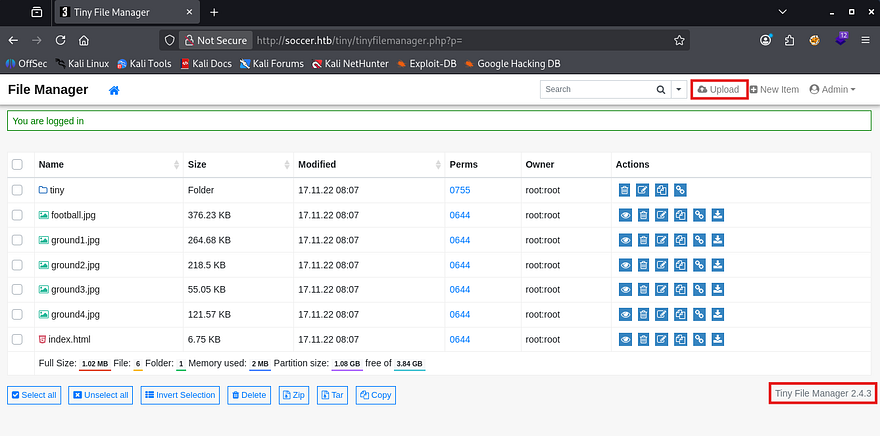

The page's footer discloses the version of Tiny File Manager that's running and I use it to poke around Google for any known vulnerabilities. That led me to finding [CVE-2021–45010](https://nvd.nist.gov/vuln/detail/CVE-2021-45010) which explains that versions prior to 2.4.7 are prone to path traversal in the upload feature and allows attackers to gain RCE by supplying arbitrary PHP code.

This exploit exists because Tiny File Manager fails to canonicalize and validate user-supplied file paths during upload, allowing `../` traversal sequences to escape the intended directory. An authenticated attacker can upload files to arbitrary locations, including the web root, leading to arbitrary file overwrite or remote code execution when a PHP payload is placed in an executable path.

Let's try it out, first I grab a PHP reverse shell from [revshells.com](https://www.revshells.com/) and make sure it's pointed towards my attacking machine. Next, we must capture a POST request to the the upload API on the site and send it to the repeater tab. Note that we need to navigate under the `/tiny/uploads` folder through the UI so that we have write access to the directories. 

We know that the webroot directory is at `/var/www/html` and that we're most likely in `/var/www/html/tiny/uploads`, so I'll provide path traversal characters to get our shell to reflect that.

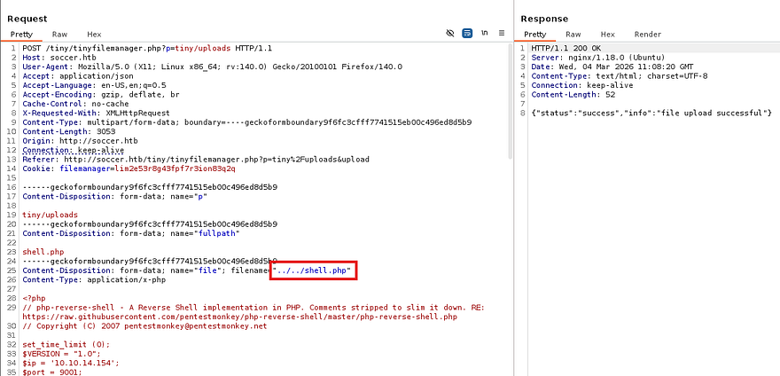

Setting up a Netcat listener and navigating to the shell code in our browser will execute the file and we get a successful shell on the box as www-data. I also upgrade and stabilize my shell with the typical `python3 import pty` method.

```
$ python3 -c 'import pty;pty.spawn("/bin/bash")'
$ export TERM=xterm
CTRL + Z
$ stty raw -echo;fg
ENTER
ENTER
```

## Privilege Escalation
Now we can start looking for routes to escalate privileges towards root or pivot to other accounts on the system. Listing the /home directory shows just one other user named player who doesn't own many files that help us.

Whenever I land on a box as the web service, I tend to go for dumping databases or finding loosely secured backups that contain plaintext credentials for other users. Some light enumeration showed that the default site didn't have a config page with a MySQL password, but checking in nginx's directory reveals a subdomain named `soc-player.htb` that may be vulnerable.

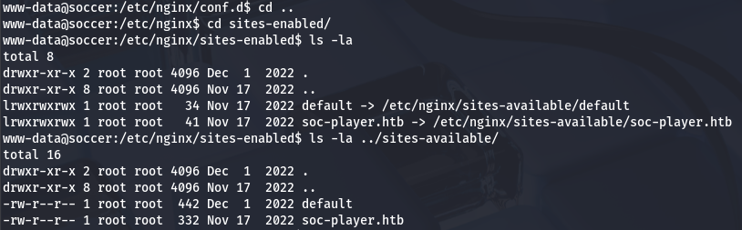

### Blind SQL Injection
After adding that domain to my `/etc/hosts` file, I head on over to find a replica of the original page. The key difference is the presence of a login and registration page. Since this is just a subdomain of the original site, even if we get RCE via this site too, it won't do us any good if it's still being ran as `www-data`. For that reason, I'm going to test all pages for SQL Injection and try to find backup folder that could give us credentials for the player user.

Login and registration both properly sanitizes characters, so I create a new account and poke around internal site functions. Really the only thing to do here was make a query for a Ticket ID that would return if it existed or not.

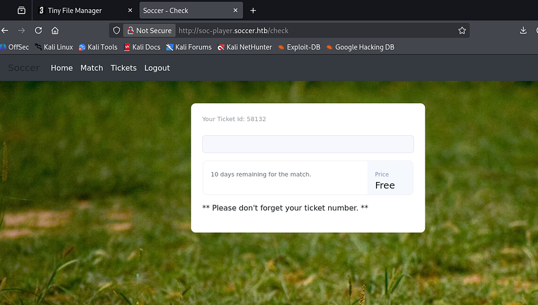

This seems promising to SQL Injection so I try a few common payloads but don't get anything to reflect on the page. That doesn't mean that it's not vulnerable though and I capture a request to this check API to figure out what's happening behind the scenes.

The server's `X-Powered-By` header responds with Express, meaning that the site is built on Node.js. Analyzing site traffic reveals that when we send our Ticket ID, it's being transported over a websocket to port 9091 in JSON format. That gives some clarity as to what that service is being utilized for, but how do exploit this?

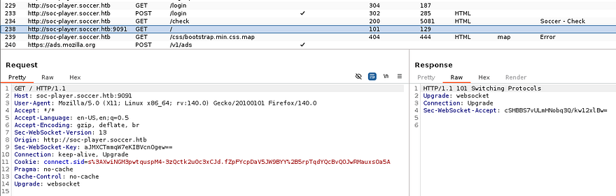

Another test run with a simple payload of `0 OR 1=1-- -` shows that the site responds with a message saying that our ticket exists (0 itself is not valid). That means we can send malicious queries to this websocket to perform a blind SQLi attack.

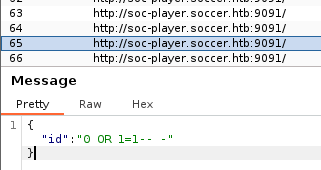

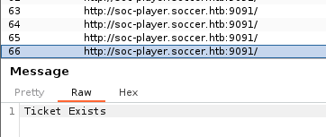

Technically this is possible to do by hand, but is extremely tedious and time-consuming. We can either create a script to automate this or just use SQLmap. I make sure to specify to connect to port 9091 via websockets and supply our JSON data so it knows what to field to inject at. My original one returned nothing, but increasing the level and risk succeeds to give us a list of databases on the box.

```
sqlmap -u ws://soc-player.soccer.htb:9091 --data '{"id": "123123"}' --dbms mysql --batch --level 5 --risk 3 --dbs
```

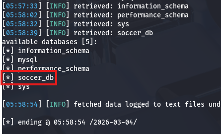

We'll probably want info for the soccer_db as it may hold user credentials for 'player'. Next, I list all tables in that DB to figure out what to dump.

```
sqlmap -u ws://soc-player.soccer.htb:9091 --data '{"id": "123123"}' --dbms mysql --batch --level 5 --risk 3 -D soccer_db --tables
```

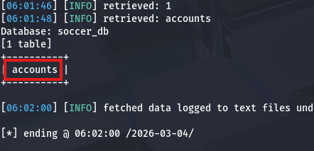

Luckily there is only one by the name of accounts and dumping it will give us the plaintext password which we can use to pivot.

```
sqlmap -u ws://soc-player.soccer.htb:9091 --data '{"id": "123123"}' --dbms mysql --batch --level 5 --risk 3 -D soccer_db -T accounts --dump
```

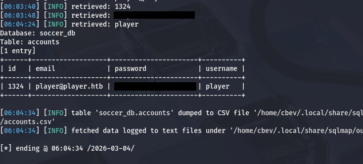

### Loading Malicious dstat Plugin
Password authentication is enabled over SSH, so I grab a proper shell with these new credentials and start looking routes to escalate privileges to root. There didn't seem to be any internal services running and we didn't have permission to run Sudo on anything either. Whilst checking for files that had an SUID bit set on them, I discovered that we're able to run the doas binary as root user.

If you're unfamiliar with this, it's a kind of alternative to Sudo that let's users execute commands as others in a secure manner. If properly configured in `/etc/doas.conf`, we wouldn't be able to do much here and attempting to just spawn a shell with it returns an error saying operation not permitted. Displaying the config file shows that our account can only execute the dstat binary as root user on this system.

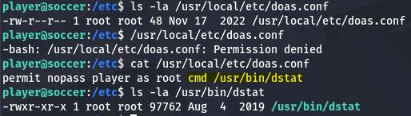

A bit of research shows that `dstat` is a versatile, Python-based command-line tool for monitoring system resources (CPU, memory, disk, network) in real-time on Linux. Checking out what [GTFOBins](https://gtfobins.org/gtfobins/dstat/#inherit) has in store discloses that this binary can be exploited to escalate privileges by providing it with a python script and loading it as an external plugin.

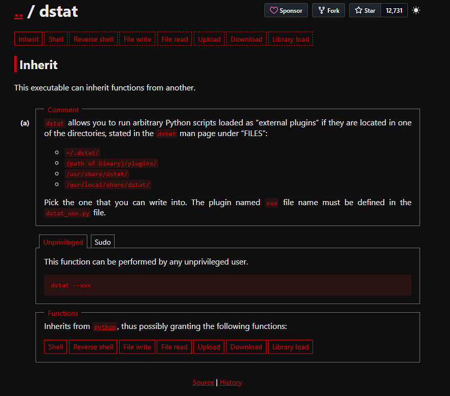

Towards the bottom of the binary's manual page is a section disclosing which file paths should be used to load external plugins and that our file must start with `dstat_` and end with `.py`.

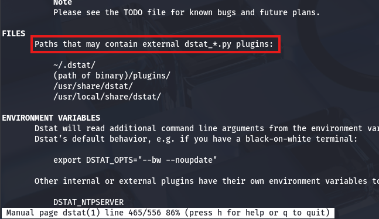

Knowing that we can create a python script to be executed by `dstat`, and that we're able to run it as root user with the `doas` binary, all that's left is to create a malicious script. This could be anything, but I'll have it make a clone of Bash in the `/tmp` directory and give it an SUID bit.

```
import os

os.system("cp /bin/bash /tmp/bash; chmod +s /tmp/bash")
```

An important thing to mention is that we must take into account how root will look for our module. By just plopping it in `~/.dstat`, the system won't find it since our home directory isn't in their path, so we'll have to find someplace else. Luckily we have write access over `/usr/share/local/dstat`, which is accessible to all users.

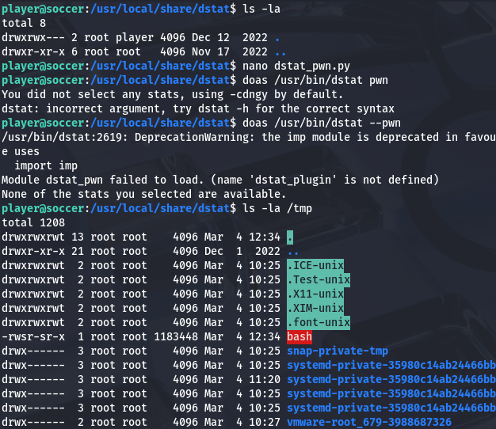

After executing the command with `doas /usr/bin/dstat --[PLUGIN_NAME]`, I check `/tmp` to find the successful Bash clone that allows us to spawn a root shell. Grabbing the root flag under the `/root` directory completes this challenge.

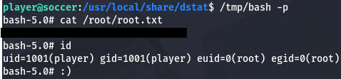

That's all y'all, I really enjoyed this box due to the more unique attack vectors. I hope this was helpful to anyone following along or stuck and happy hacking!
