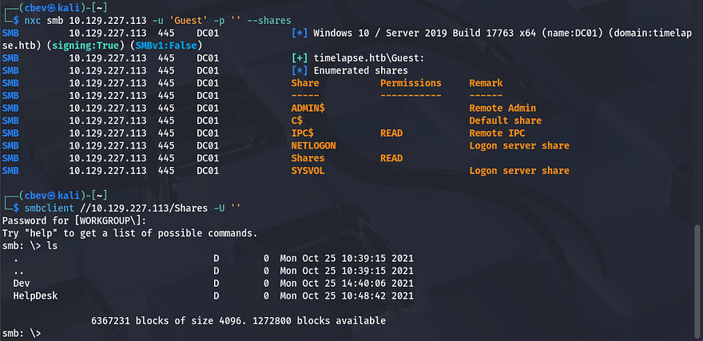
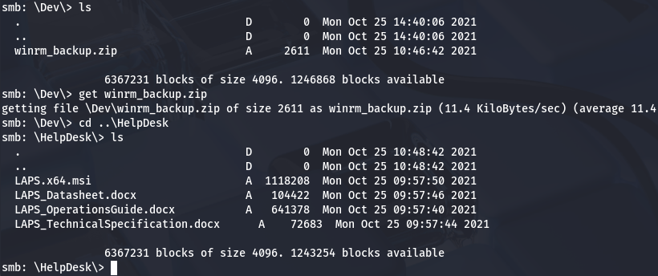
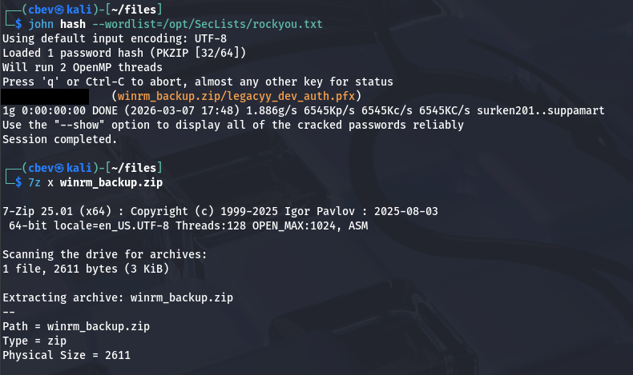
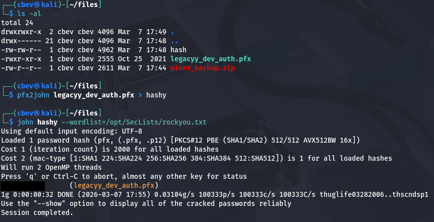
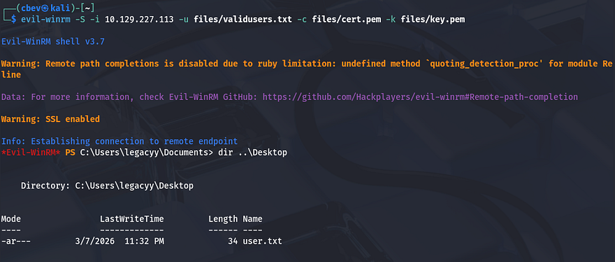
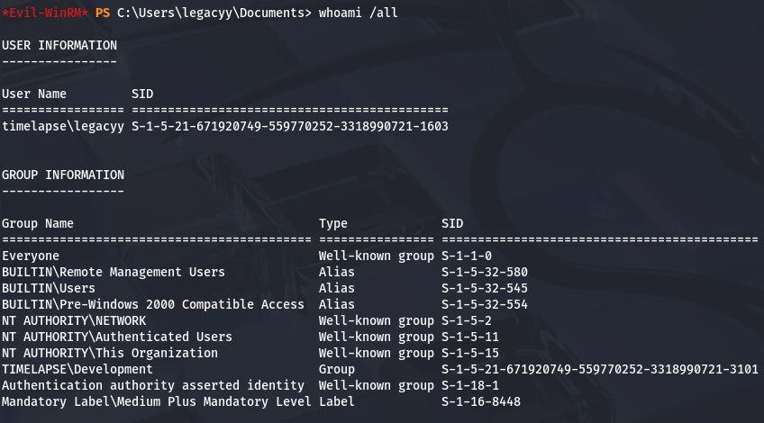
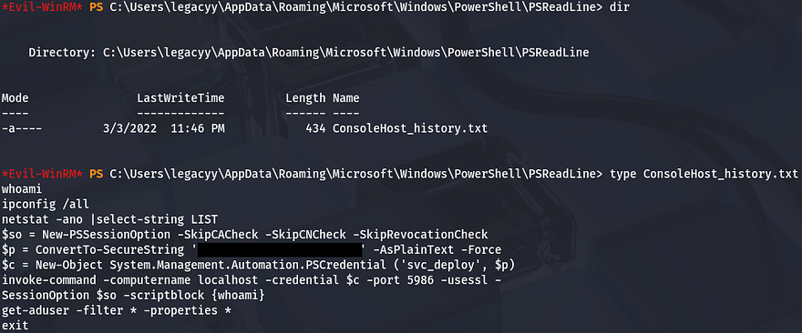
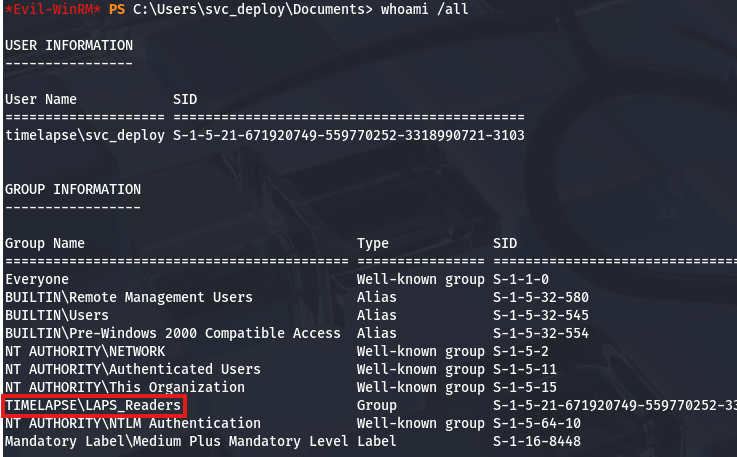
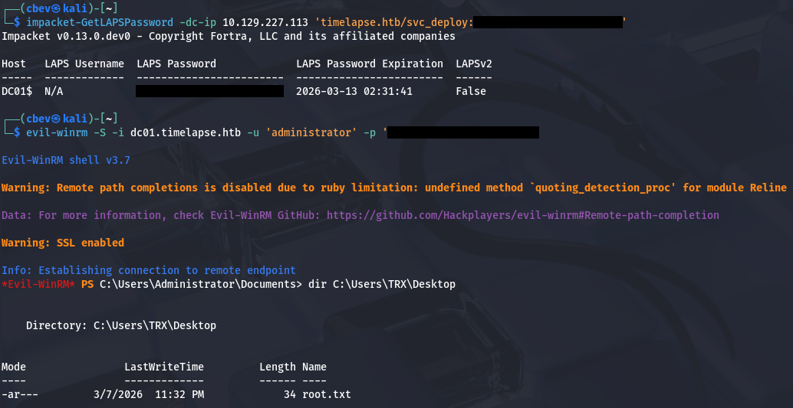

This box is rated easy difficulty on THM. It involves us extracting a certificate and private key from a PFX file on an SMB share to get a shell via WinRM, gathering credentials from a user's PowerShell history, and abusing LAPS to read passwords on the local domain.

## Scanning & Enumeration
I begin with an Nmap scan against the target IP to find all running services on the host; Repeating the same for UDP returns the usual AD things.

```
$ sudo nmap -sCV 10.129.227.113 -oN fullscan-tcp

Starting Nmap 7.95 ( https://nmap.org ) at 2026-03-07 17:34 CST
Nmap scan report for 10.129.227.113
Host is up (0.055s latency).
Not shown: 988 filtered tcp ports (no-response)
PORT     STATE SERVICE           VERSION
53/tcp   open  domain            Simple DNS Plus
88/tcp   open  kerberos-sec      Microsoft Windows Kerberos (server time: 2026-03-08 07:33:19Z)
135/tcp  open  msrpc             Microsoft Windows RPC
139/tcp  open  netbios-ssn       Microsoft Windows netbios-ssn
389/tcp  open  ldap              Microsoft Windows Active Directory LDAP (Domain: timelapse.htb0., Site: Default-First-Site-Name)
445/tcp  open  microsoft-ds?
464/tcp  open  kpasswd5?
593/tcp  open  ncacn_http        Microsoft Windows RPC over HTTP 1.0
636/tcp  open  ldapssl?
3268/tcp open  ldap              Microsoft Windows Active Directory LDAP (Domain: timelapse.htb0., Site: Default-First-Site-Name)
3269/tcp open  globalcatLDAPssl?
5986/tcp open  ssl/http          Microsoft HTTPAPI httpd 2.0 (SSDP/UPnP)
| tls-alpn: 
|_  http/1.1
|_ssl-date: 2026-03-08T07:34:40+00:00; +7h59m01s from scanner time.
|_http-server-header: Microsoft-HTTPAPI/2.0
| ssl-cert: Subject: commonName=dc01.timelapse.htb
| Not valid before: 2021-10-25T14:05:29
|_Not valid after:  2022-10-25T14:25:29
|_http-title: Not Found
Service Info: Host: DC01; OS: Windows; CPE: cpe:/o:microsoft:windows

Host script results:
| smb2-time: 
|   date: 2026-03-08T07:34:02
|_  start_date: N/A
|_clock-skew: mean: 7h59m00s, deviation: 0s, median: 7h59m00s
| smb2-security-mode: 
|   3:1:1: 
|_    Message signing enabled and required

Service detection performed. Please report any incorrect results at https://nmap.org/submit/ .
Nmap done: 1 IP address (1 host up) scanned in 93.93 seconds
```

Looks like a Windows machine with Active Directory components installed on it. LDAP is leaking the domain of `timelapse.htb`, which we can add to our `/etc/hosts` file. Due to there not being any web services present, I'll focus on SMB, Kerberos, and LDAP in order to get a foothold on the box.

## SMB Shares
Using Netexec shows that Guest authentication is enabled on SMB and that we have read permissions to a non-standard share. Inside are two directories for the Development and HelpDesk roles.



### Cracking Password-Protected Zip File
As we can see, the Dev folder holds a backup Zip file for what appears to be the WinRM service. Checking the HelpDesk folder reveals a few informational documents for LAPS as well as a `.msi` installer file.



After grabbing all of these, I attempt to unzip the winrm archive which prompts us for a password. Trying a few common ones doesn't work to unlock it so I'll convert this file into a crackable format using [zip2john](https://github.com/openwall/john/blob/bleeding-jumbo/src/zip2john.c) and recover the password that way.

```
#Converting file format into one recognizable by JohnTheRipper
$ zip2john winrm_backup.zip > hash

#Cracking the password with RockYou
$ john hash --wordlist=/opt/SecLists/rockyou.txt
```

That retrieves a valid password very quick and can be used to dump the Zip. Inside is the `legacyy_dev_auth.pfx` - A `.pfx` file (PKCS #12 format) is used to store a digital certificate along with its associated private key in a single, encrypted file. It's commonly used for authentication and secure communications, such as installing SSL/TLS certificates on servers or importing certificates for user or machine authentication.



### Cracking Password-Protected PFX File
Inside of these `.pfx` files is an SSL certificate and a private key used for authentication, most likely for WinRM as that was the archive's name. If we can crack this, we'll be able to get a shell on the box via the private key. Once again, I convert this file into a crackable format so that JTR recognizes it and give it a minute to recover the password.

```
#Converting file format into one recognizable by JohnTheRipper
$ pfx2john legacyy_dev_auth.pfx > hashy

#Cracking the password with RockYou
$ john hashy --wordlist=/opt/SecLists/rockyou.txt
```



We can use OpenSSL to extract both the certificate and the private key from this `.pfx` so that we can supply them for authentication later.

```
#Grabbing certificate
openssl pkcs12 -in legacyy_dev_auth.pfx -clcerts -nokeys -out cert.pem

#Grabbing privkey
openssl pkcs12 -in legacyy_dev_auth.pfx -nocerts -nodes -out key.pem
```

We still need some usernames to test out who this belongs to. I use Netexec to brute-force RIDs on the box which returns machine/user and group names. Saving that output to a file lets me extract the usernames with a simple `awk` command.

```
$ nxc smb 10.129.227.113 -u 'Guest' -p '' --rid-brute > users.txt

$ awk -F'\\\\' '{print $2}' users.txt | awk '{print $1}' > validusers.txt
```

_Note: This was completely unnecessary as the .pfx filename literally tells us that it's for the legacyy developer user, I completely disregarded it because I didn't recognize the name at first._

Next, I use [Evil-WinRM](https://github.com/Hackplayers/evil-winrm) which supports certificates to spray the private key against the list of users on the domain. This eventually gives us a shell as `legacyy` and we're able to start internal enumeration to escalate privileges to the administrator. We must provide the `-S` flag to enable SSL since WinRM is on port 5986.

```
evil-winrm -S -i 10.129.227.113 -u validusers.txt -c cert.pem -k key.pem
```

At this point we can also grab the user flag under their Desktop folder.



## Privilege Escalation
Thinking back to the SMB share, we found a few files pertaining to Local Administrator Password Solution (LAPS) and also discovered a domain group named `LAPS_Readers` while brute-forcing RIDs. Checking our account's privileges shows that we are not apart of this group, however if we're able to pivot to a user who is, we may have the capability to read local passwords on the domain.



### Creds in PS History
A bit of enumeration on the filesystem didn't return much other than the presence of two other users named svc_deploy and TRX. I figured that since our account belonged to a developer, they'd manage configurations for the related services. I end up checking our account's PowerShell history and find a password that was converted to a secure string for the `svc_deploy` user inside.

```
$ type C:\Users\legacyy\AppData\Roaming\Microsoft\Windows\PowerShell\PSReadLine\ConsoleHost_history.txt
```



### Reading Passwords with LAPS
Testing to see if this works shows that we can authenticate over SMB and also that they have WinRM access because they're apart of the Remote Management group. Grabbing a shell with Evil-WinRM again reveals that this account is apart of the `LAPS_Readers` group and that we should be able to display passwords for other user accounts.



Rather than fumble around with weird PowerShell syntax, I'll use Impacket's [GetLAPSPassword](https://github.com/fortra/impacket/blob/master/examples/GetLAPSPassword.py) module to dump all local passwords stored on the domain.

```
$ impacket-GetLAPSPassword -dc-ip 10.129.227.113 'timelapse.htb/svc_deploy:[REDACTED]'

$ evil-winrm -S -i dc01.timelapse.htb -u 'administrator' -p '[REDACTED]'
```



Finally, grabbing the root flag under `C:\Users\TRX\Desktop\root.txt` completes this challenge. I enjoyed this box because it showed that there are other ways to authenticate than just a password. I hope this was helpful to anyone following along or stuck and happy hacking!
