This box is rated easy difficulty on HTB. It involves us discovering an exposed Git repository on a content management site that gives us user credentials. After logging in, we enumerate the BackdropCMS version and find that it's vulnerable to a malicious archive upload which we exploit to get a reverse shell. Once on the box, we password spray the credentials found earlier to swap users and abuse Sudo permissions to execute PHP code with a vulnerable binary.

## Host Scanning
I begin with an Nmap scan against the target IP to find all running services on the host; Repeating the same for UDP returns nothing.

```
$ sudo nmap -p22,80 -sCV 10.129.231.223 -oN fullscan-tcp

Starting Nmap 7.95 ( https://nmap.org ) at 2026-03-16 01:35 CDT
Nmap scan report for 10.129.231.223
Host is up (0.054s latency).

PORT   STATE SERVICE VERSION
22/tcp open  ssh     OpenSSH 8.2p1 Ubuntu 4ubuntu0.12 (Ubuntu Linux; protocol 2.0)
| ssh-hostkey: 
|   3072 97:2a:d2:2c:89:8a:d3:ed:4d:ac:00:d2:1e:87:49:a7 (RSA)
|   256 27:7c:3c:eb:0f:26:e9:62:59:0f:0f:b1:38:c9:ae:2b (ECDSA)
|_  256 93:88:47:4c:69:af:72:16:09:4c:ba:77:1e:3b:3b:eb (ED25519)
80/tcp open  http    Apache httpd 2.4.41 ((Ubuntu))
|_http-generator: Backdrop CMS 1 (https://backdropcms.org)
|_http-title: Home | Dog
|_http-server-header: Apache/2.4.41 (Ubuntu)
| http-git: 
|   10.129.231.223:80/.git/
|     Git repository found!
|     Repository description: Unnamed repository; edit this file 'description' to name the...
|_    Last commit message: todo: customize url aliases.  reference:https://docs.backdro...
| http-robots.txt: 22 disallowed entries (15 shown)
| /core/ /profiles/ /README.md /web.config /admin 
| /comment/reply /filter/tips /node/add /search /user/register 
|_/user/password /user/login /user/logout /?q=admin /?q=comment/reply
Service Info: OS: Linux; CPE: cpe:/o:linux:linux_kernel

Service detection performed. Please report any incorrect results at https://nmap.org/submit/ .
Nmap done: 1 IP address (1 host up) scanned in 10.44 seconds
```

There are just two ports open:
- SSH on port 22
- An Apache web server on port 80

## Enumeration
We won't be able to do much with that version of OpenSSH without credentials, so I'll focus on the web server. As we can see Nmap's default scripts give us a ton of useful information, namely an exposed Git repository, disallowed entries in robots.txt, and that the server is using BackdropCMS (built in PHP).

Checking out the landing page shows a site dedicated towards blog posts of all types of information about dogs. 

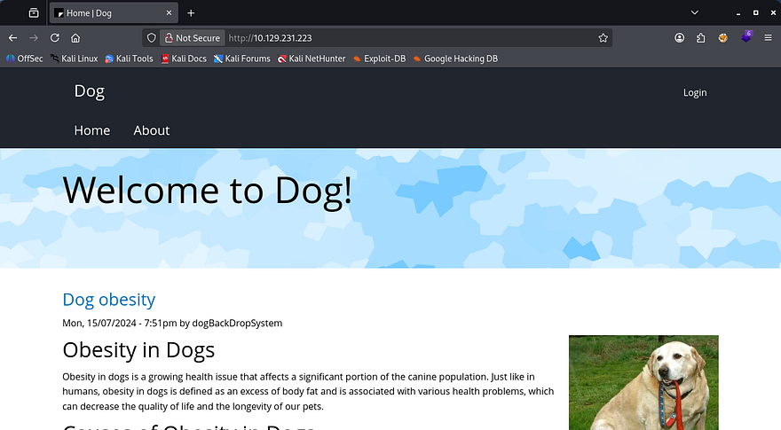

Besides the login panel, there aren't a whole lot of functions on the site that we can exploit, however I do find an email for the support account which discloses the domain. I'll add that to my /etc/hosts file in case we get some type of resolution error later on.

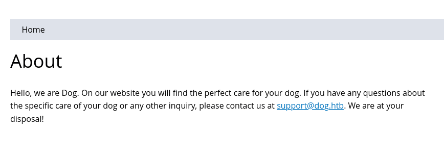

There is a reset password feature which is prone to username/email enumeration. This shows that the typical admin account is not registered, so we'll be looking for a real name. Navigating to the admin page at /?q=admin also throws a 403 Forbidden code.

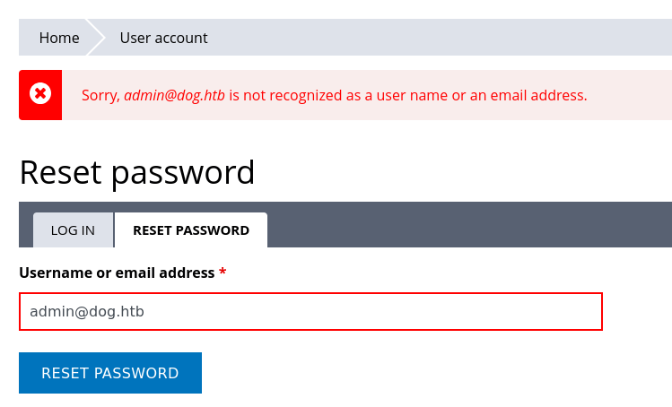

### Dumping Git Repo
I move onto transferring that Git repository to my local machine for further inspection with a tool called Gitdumper.

```
--Cloning tool repo and installing all requirements in virtual env--
$ git clone https://github.com/arthaud/git-dumper
$ cd git-dumper
$ python3 -m venv venv
$ source venv/bin/activate
$ pip3 install -r requirements.txt

--Retreiving the .git directory--
$ python3 git_dumper.py http://dog.htb/ git-src
$ cd git-src
```

Heading into the output directory gives us a ton of files on the server. The most important being `settings.php`, which contains a pair of credentials for the root user on BackdropCMS. Displaying the Git log also gives us a potential username on the system.

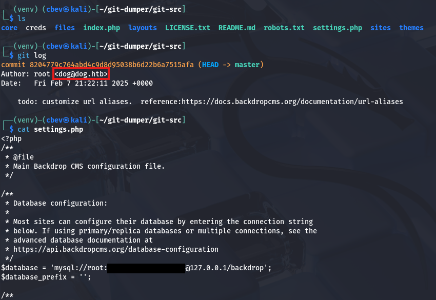

### Valid Site Credentials
Attempting to use these to login on the site's panel show that it doesn't work for `root@dog.htb` or `dog@dog.htb`, so I grep for any instance of the domain being used.

```
grep -iR '@dog.htb'
```

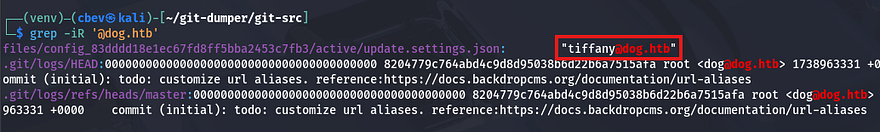

That returns a username of tiffany inside of an update settings file. Using that username along with the database password on the login panel succeeds to get a valid admin session on the site. Looking around shows the typical management functions for a CMS site, but I'm unsure what to exploit. 

Unable to find the version internally, I grep for it in the Git source files and find it inside of `/core/profiles/testing/testing.info`.

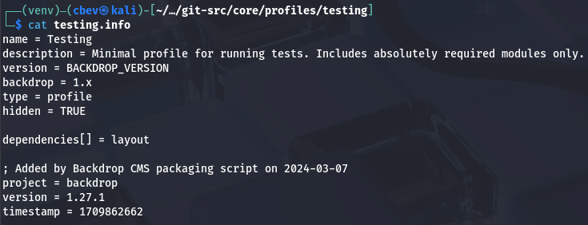

This discloses that the site is running version 1.27.1 of BackdropCMS, which I start researching for any known vulnerabilities in hopes to get RCE or something critical.  

## Malicious Theme Upload
That brings me to finding [CVE-2022–42092](http://nvd.nist.gov/vuln/detail/CVE-2022-42092), which explains that the themes tab allows for unrestricted file uploads, with the only stipulation being that we need admin access.

To exploit this, we need to download a random theme from their [themes contribution repository](https://github.com/orgs/backdrop-contrib/repositories?q=theme) and place a PHP reverse shell within it; I copy and pasted Pentestmonkey's rendition from [revshells.com](https://www.revshells.com/). I should note that `.zip` archives are not allowed on the site, so we must create a `.tar` instead.

```
$ 7z x bedrock-1.x-1.x.zip
$ cd bedrock-1.x-1.x
$ vi cbev.php
$ cd ..
$ tar cf bedrock.tar bedrock-1.x-1.x
```

### Initial Foothold
To upload this, we go to **Appearence -> Install New Themes -> Manual Installation _(in the bottom right)_ -> Upload Theme to Install**, and specify the malicious TAR archive to be placed on the web server.

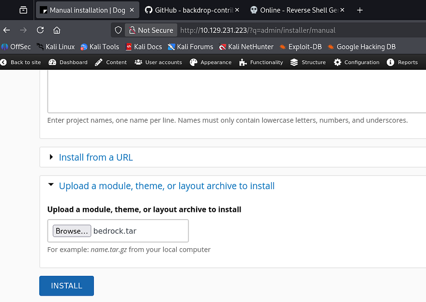

Once that's done uploading, we can proc the reverse shell by navigating to the malicious PHP file name under the `/themes/[THEME_NAME]/` directory. In my case, it was the bedrock theme, and make sure to stand up a Netcat listener beforehand to receive the connection.

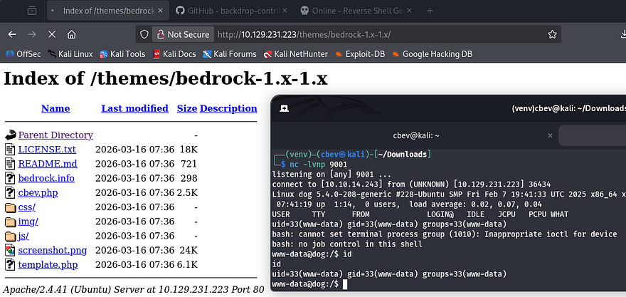

I upgrade and stabilize my shell using the typical `Python import pty` method and start internal enumeration to escalate privileges. 

## Privilege Escalation
Listing the `/home` directory shows two other users named _johncusack_ and _jobert_. It seems like only the ladder account owns any files, and also has the user flag, so I'll assume we need to pivot there first.

### Password Reuse
Typically when I get a shell as a web server, I go straight to dumping the database or find hardcoded credentials, but since we already found some from the Git repository, I try password spraying against these users. This returns a valid login for _johncusack_ and we can grab the user flag under their home directory.

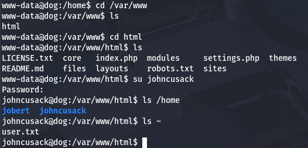

I swap to authenticating over SSH to grab a proper shell with more capabilities and look for ways to escalate privileges towards root. 

### Sudo Permissions on Bee Binary
Listing Sudo permissions shows that we're able to run the Bee binary as root user on this system. A test run reveals that this is intended to manage the BackdropCMS site from the CLI, however we can utilize it to execute arbitrary PHP code through the eval function.

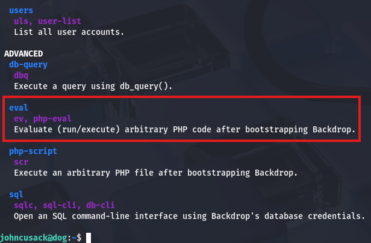

A quick Google command discloses that it must be ran at the webroot directory or with the `--root` flag to specify where that is in order to work correctly. All that's left is to supply it with a valid PHP code and since there are no limitations on it, we can use the system function to have it execute commands as root.

```
$ cd /var/www/html
$ sudo /usr/local/bin/bee eval 'system("bash")'
```

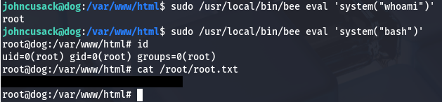

I use it to spawn a Bash shell with elevated privileges and grab the final flag under their home directory to complete this challenge. Overall, this box was not too difficult, however unfamiliarity with Git or CMS sites may cause some frustration as they can be confusing. I hope this was helpful to anyone following along or stuck and happy hacking!
