This box is rated medium difficulty on HTB. It involves us finding a file upload vulnerability in a Torrent Hosting application that allows us to execute a reverse shell on the system. Once on the machine, we discover an outdated Kernel that is prone to the DirtyCow privilege escalation exploit, letting us create a new user with root permissions on the machine.

## Host Scanning
I begin with an Nmap scan against the target IP to find all running services on the host; Repeating the same for UDP yields no results.

```
$ sudo nmap -p22,80 -sCV 10.129.20.99 -oN fullscan-tcp

Starting Nmap 7.98 ( https://nmap.org ) at 2026-04-16 23:04 -0400
Nmap scan report for 10.129.20.99
Host is up (0.056s latency).

PORT   STATE SERVICE VERSION
22/tcp open  ssh     OpenSSH 5.1p1 Debian 6ubuntu2 (Ubuntu Linux; protocol 2.0)
| ssh-hostkey: 
|   1024 3e:c8:1b:15:21:15:50:ec:6e:63:bc:c5:6b:80:7b:38 (DSA)
|_  2048 aa:1f:79:21:b8:42:f4:8a:38:bd:b8:05:ef:1a:07:4d (RSA)
80/tcp open  http    Apache httpd 2.2.12
|_http-title: Did not follow redirect to http://popcorn.htb/
|_http-server-header: Apache/2.2.12 (Ubuntu)
Service Info: Host: 127.0.0.1; OS: Linux; CPE: cpe:/o:linux:linux_kernel

Service detection performed. Please report any incorrect results at https://nmap.org/submit/ .
Nmap done: 1 IP address (1 host up) scanned in 9.34 seconds
```

There are just two ports open: 
- SSH on port 22
- An Apache server on port 80

Not a whole lot we can do with that version of OpenSSH without credentials so I'll focus on the web components. Default scripts show that the site is redirecting us to `popcorn.htb` which I add to my `/etc/hosts` file. 

## Web Enumeration
I also fire up Ffuf to search for subdirectories and Vhosts in the background before heading over to the site.

```
$ ffuf -u http://popcorn.htb/FUZZ -w /opt/seclists/directory-list-2.3-medium.txt 

        /'___\  /'___\           /'___\       
       /\ \__/ /\ \__/  __  __  /\ \__/       
       \ \ ,__\\ \ ,__\/\ \/\ \ \ \ ,__\      
        \ \ \_/ \ \ \_/\ \ \_\ \ \ \ \_/      
         \ \_\   \ \_\  \ \____/  \ \_\       
          \/_/    \/_/   \/___/    \/_/       

       v2.1.0-dev
________________________________________________

 :: Method           : GET
 :: URL              : http://popcorn.htb/FUZZ
 :: Wordlist         : FUZZ: /opt/seclists/directory-list-2.3-medium.txt
 :: Follow redirects : false
 :: Calibration      : false
 :: Timeout          : 10
 :: Threads          : 40
 :: Matcher          : Response status: 200-299,301,302,307,401,403,405,500
________________________________________________

index                   [Status: 200, Size: 177, Words: 22, Lines: 5, Duration: 60ms]
test                    [Status: 200, Size: 47406, Words: 2478, Lines: 655, Duration: 91ms]
torrent                 [Status: 301, Size: 312, Words: 20, Lines: 10, Duration: 65ms]
rename                  [Status: 301, Size: 311, Words: 20, Lines: 10, Duration: 55ms]

:: Progress: [220546/220546] :: Job [1/1] :: 719 req/sec :: Duration: [0:05:21] :: Errors: 1 ::
```

Checking out the landing page shows that no content has been added to the index page yet. 

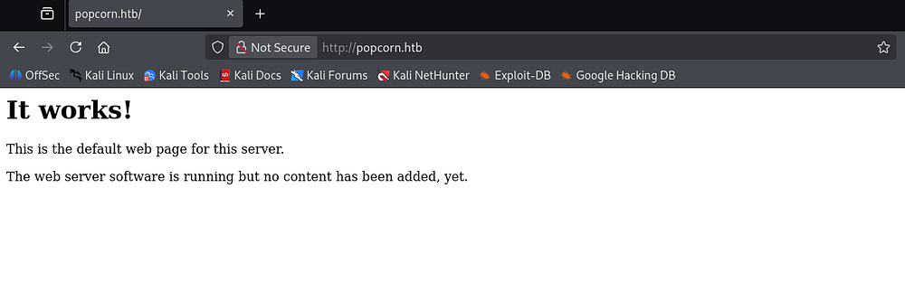

### Rename API
My scans discovered three very interesting things. The first of which is an API endpoint that takes in an old file path and moves it to a new file path location, similar to the mv command in Linux, it will rename certain things.

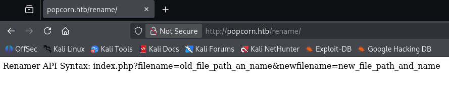

### phpinfo() page
Second is a test page that holds the web server's phpinfo() page. This is very useful for discovering critical information about the Apache environment.

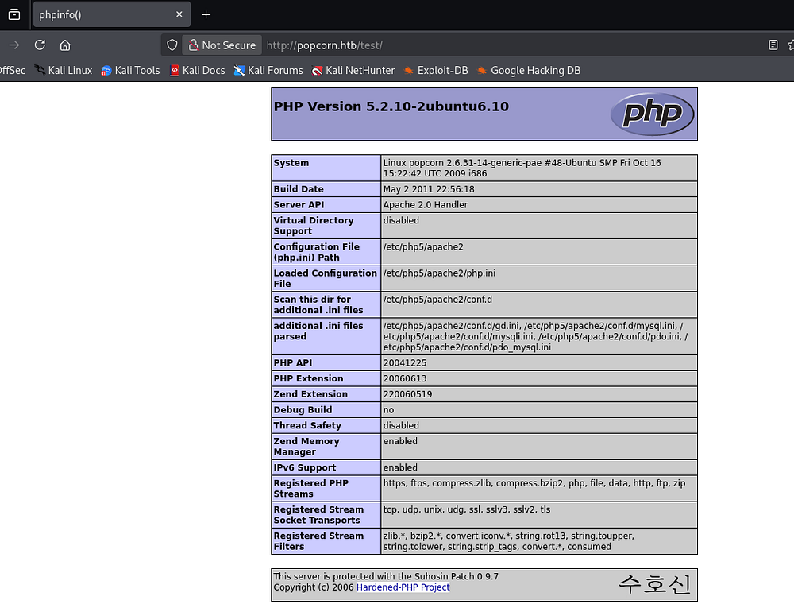

### Torrent Hosting Application
Lastly, there is a torrent directory that redirects us to a Torrent Hoster website. Torrents use a peer-to-peer (P2P) system where files are split into pieces and downloaded from multiple users (peers) instead of a single central server. 

A torrent hosting application (like a torrent client) manages these connections - downloading, uploading, verifying pieces, and coordinating with trackers or distributed hash tables (DHT) to find peers. This makes file distribution more efficient and resilient, especially for large files.

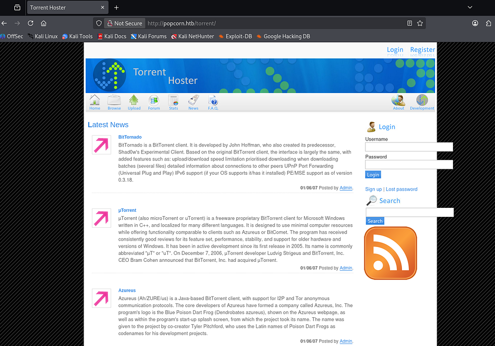

We can see a few posts made by the site's Admin and there is a spot to login and register as well. I tried brute-forcing the administrator's login with a quick wordlist but got nothing out of it.

## File Upload Vulnerability
From the looks of it so far, we most likely need to upload a file via this torrent hosting application and then use the API to either overwrite another file or expose it to get a reverse shell in order to get a foothold. I start by registering an account on the site, this shows that only one torrent file containing a Kali Linux ISO has been uploaded to the site.

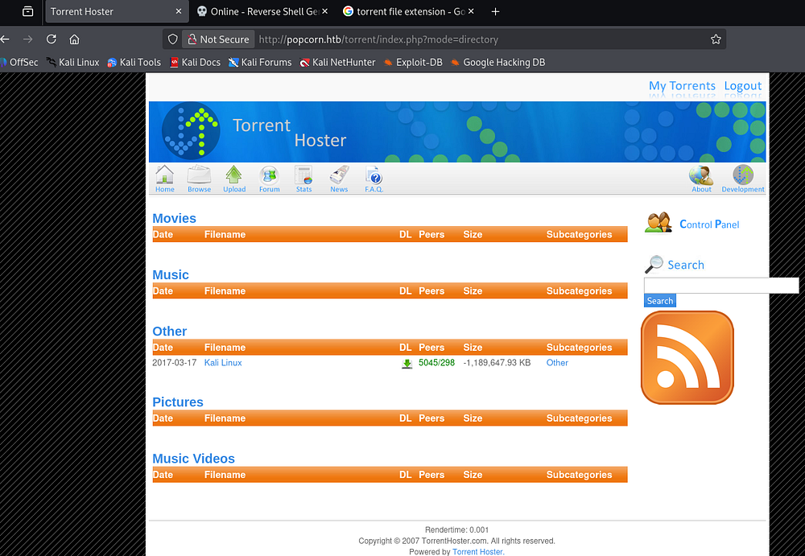

### Failed Torrent Attempts
Attempting to upload files other than valid Torrents will return an error saying such. The POST request is sent in **multipart/form-data** content which gives us some control over the upload, however messing with file extensions and _Content-Type_ headers did not work.

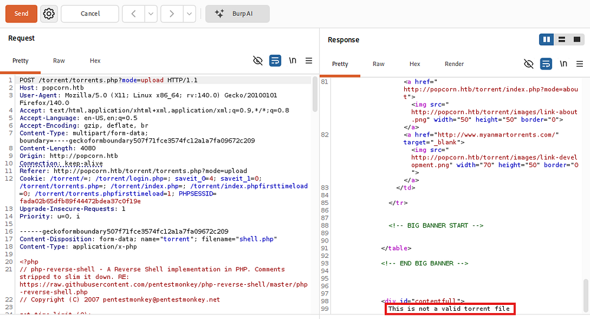

Attempting to upload a valid torrent file (I grabbed one from [Kali.org](https://www.kali.org/)) hangs for a good bit and then redirects us to a page hosting our Torrent for downloading purposes.

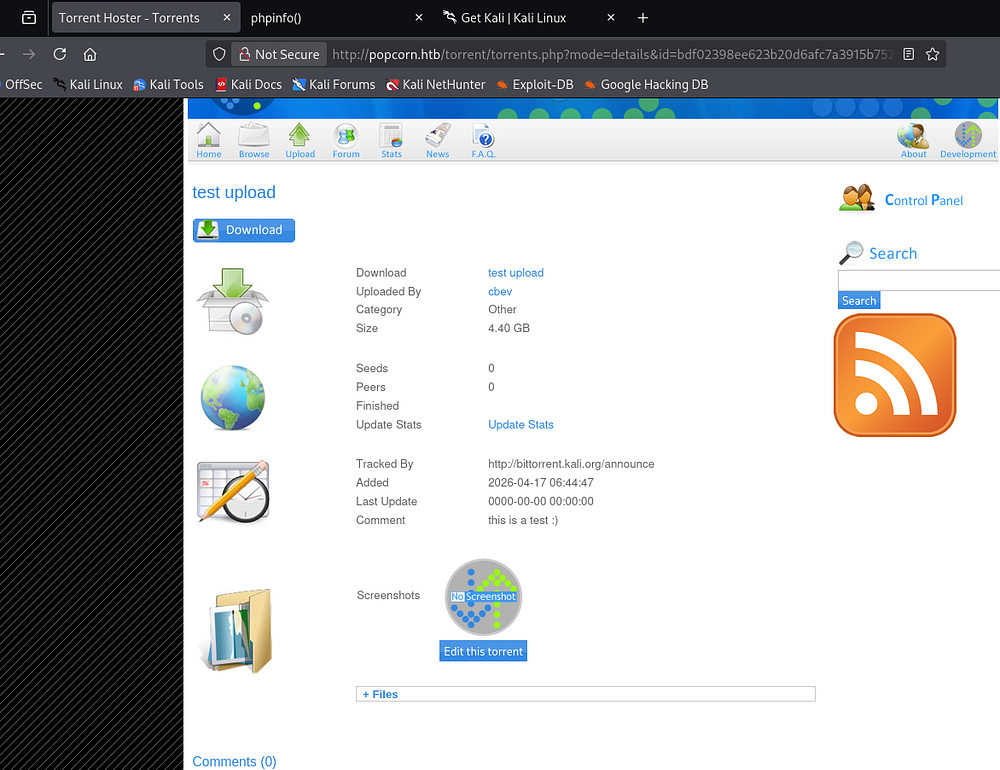

### Screenshot Route
Along with the information about our uploaded Torrent file, we're given an option to change the screenshot provided. It seems only valid image types are allowed so I rename a PHP reverse shell from [PentestMonkey](https://www.revshells.com/) to meet this criteria.

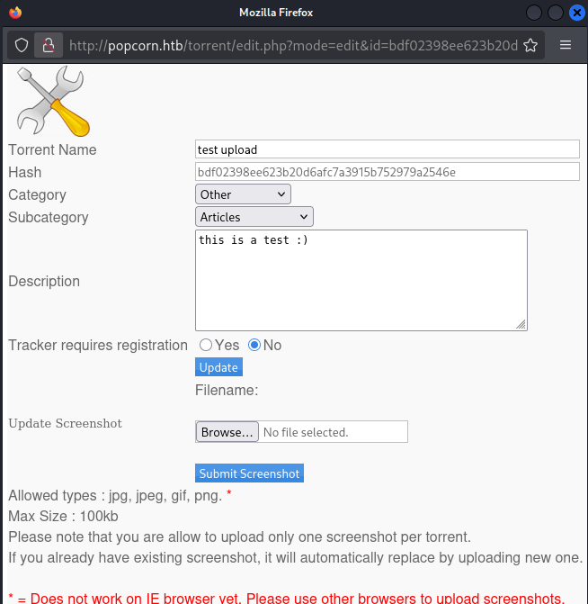

Looks like our file has been successfully uploaded to the site.

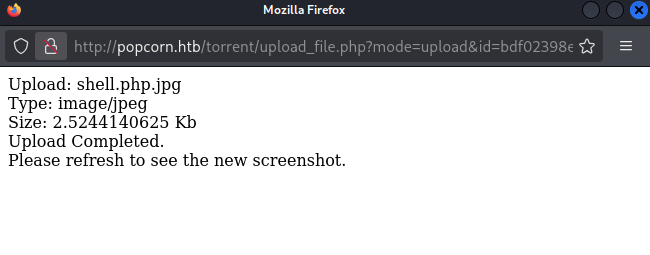

Refreshing the page will not work to execute this reverse shell, however we did discover that rename API that can be used to strip the extension from the uploaded file and format it to be executable.

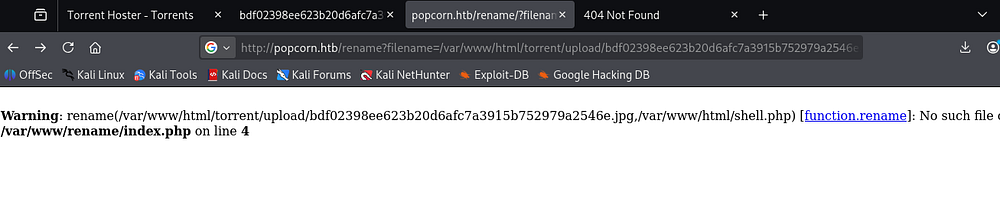

After some time messing with that, I just couldn't get the API to work at all, making me think it was a rabbit hole. Either way, heading back to the file upload showed something strange.

Attempting to upload PHP files with the correct extension worked as long as we changed the _Content-Type_ header to match one of the necessary ones disclosed on the upload panel (i.e. jpg, png, gif).

```
Content-Type: image/png
```

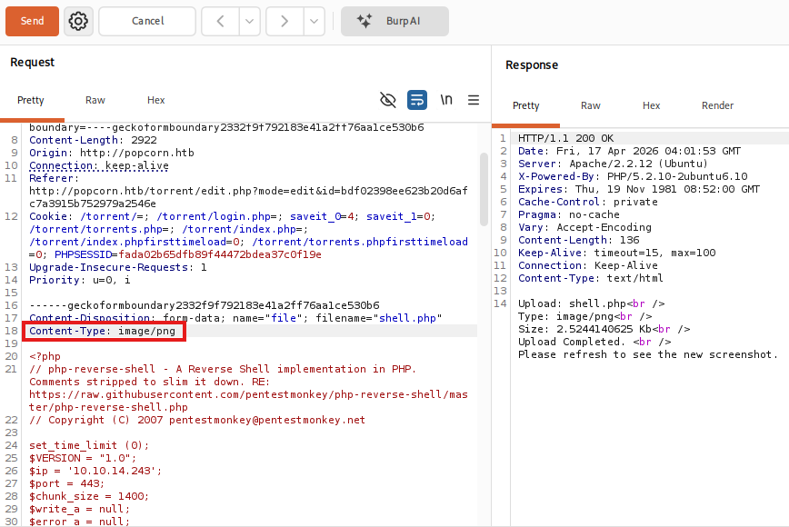

### Initial Foothold
After navigating to the uploads directory, we can find our PHP reverse shell renamed to be its hash followed by the extension. It seems like this was the APIs function and may not have been exploitable by us. Standing up a Netcat listener and executing the shell gives us a foothold on the box as www-data.

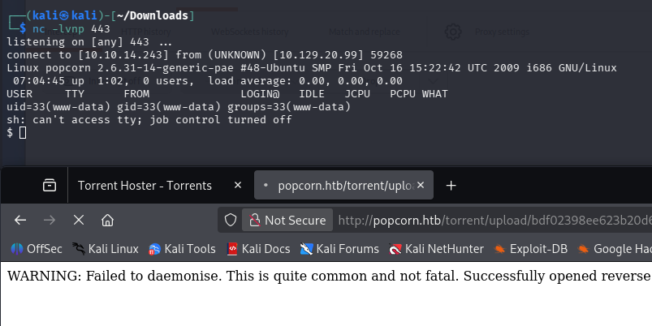

At this point, I upgrade my shell with the typical Python import pty method and grab the user flag under George's home directory.

## Privilege Escalation
Since we landed on the system as the web service user, we generally won't have many special binary permissions or privileged actions. However, there was a place to login at the Torrent Hoster application and we should own it, so I head over to the web root's directory to dump the config file.

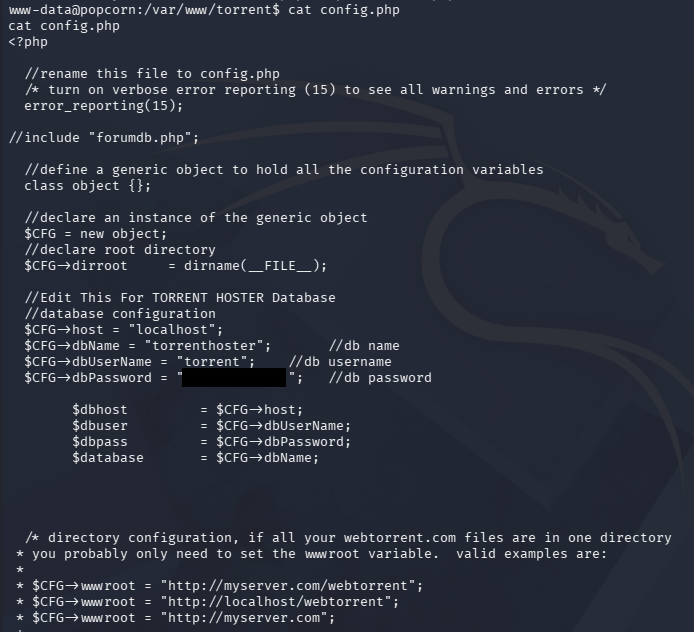

### Database Dump
Connecting to the MySQL server and dumping the users table in the TorrentHoster database gives us an MD5 hash for the admin. Unfortunately this does not crack and isn't reused for George's account either.

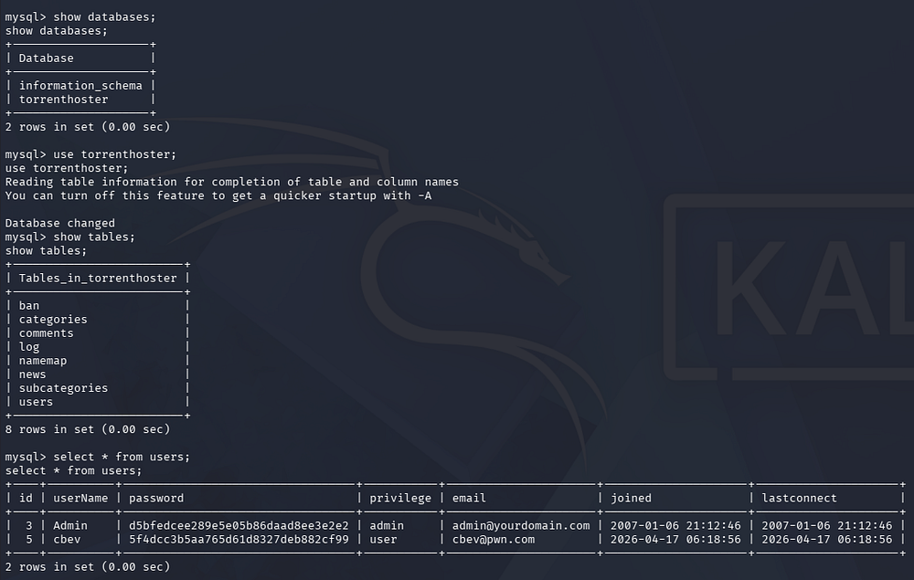

### DirtyCow Exploit
Displaying the Linux Kernel version reveals that it is extremely old (around September, 2009), making it vulnerable to quite a few dangerous privilege escalation exploits. I proceed with using [DirtyCow](https://github.com/FireFart/dirtycow/blob/master/dirty.c), aka. CVE-2016–5195, which is a Linux privilege escalation vulnerability that exploits a race condition in the copy-on-write (COW) mechanism of memory management. It allows a local attacker to gain write access to read-only files, potentially modifying system binaries and escalating privileges to root.

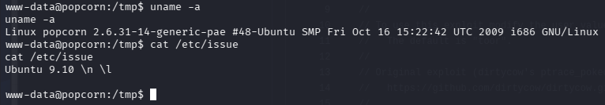

I download the exploit written in C and transfer it to the vulnerable machine. Luckily for us, it has gcc installed which makes compiling issues far less frequent than if we were to upload it after-the-fact. This exploit works by creating a new user with root privileges, allowing us to switch to them and have full control over the system.

```
$ gcc -pthread dirty.c -o dirty -lcrypt

$ chmod + dirty

$ ./dirty

$ su - toor
```

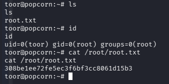

That's all y'all, this box wasn't too difficult but locating the correct vulnerability was tricky because of the initial Torrent technology. I hope this was helpful to anyone following along or stuck and happy hacking!
